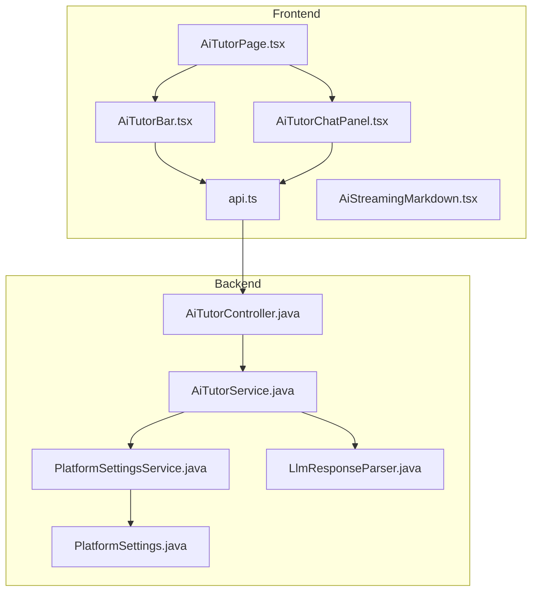
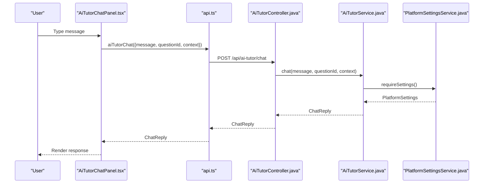
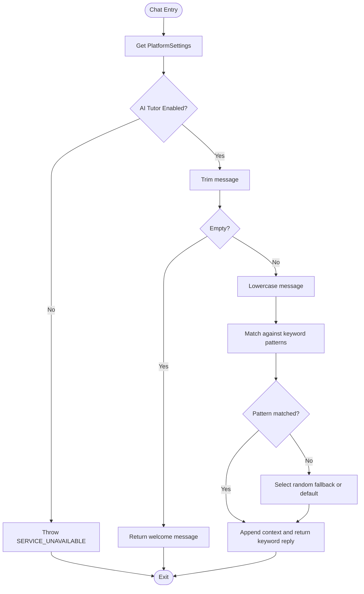
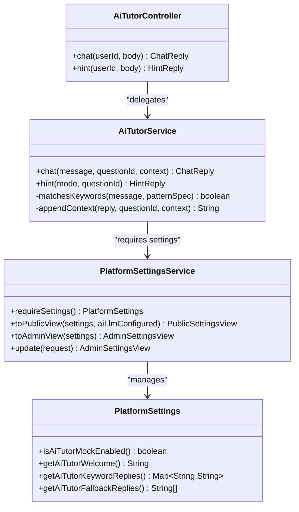
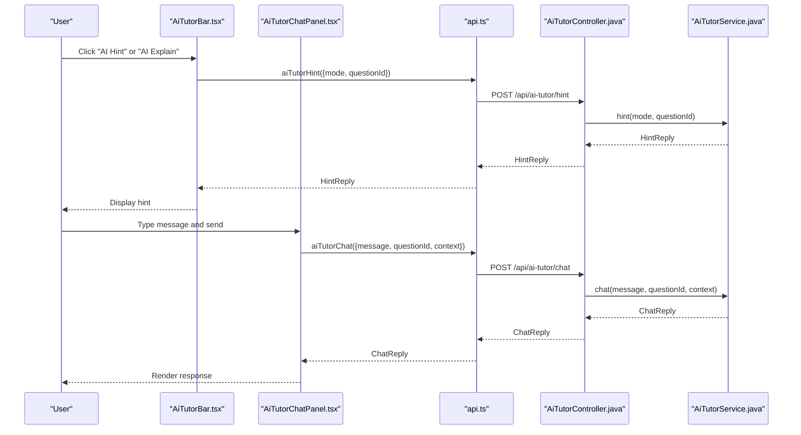

# AI Tutor Endpoints

<cite>
**Referenced Files in This Document**
- [AiTutorController.java](file://backend/src/main/java/com/neetlu/examhunt/web/AiTutorController.java)
- [AiTutorService.java](file://backend/src/main/java/com/neetlu/examhunt/service/AiTutorService.java)
- [PlatformSettings.java](file://backend/src/main/java/com/neetlu/examhunt/model/PlatformSettings.java)
- [PlatformSettingsService.java](file://backend/src/main/java/com/neetlu/examhunt/service/PlatformSettingsService.java)
- [AiTutorPage.tsx](file://frontend/src/pages/AiTutorPage.tsx)
- [AiTutorChatPanel.tsx](file://frontend/src/components/AiTutorChatPanel.tsx)
- [AiTutorBar.tsx](file://frontend/src/components/AiTutorBar.tsx)
- [api.ts](file://frontend/src/api.ts)
- [AiStreamingMarkdown.tsx](file://frontend/src/components/AiStreamingMarkdown.tsx)
- [LlmResponseParser.java](file://backend/src/main/java/com/neetlu/examhunt/service/llm/LlmResponseParser.java)
</cite>

## Table of Contents
1. [Introduction](#introduction)
2. [Project Structure](#project-structure)
3. [Core Components](#core-components)
4. [Architecture Overview](#architecture-overview)
5. [Detailed Component Analysis](#detailed-component-analysis)
6. [API Reference](#api-reference)
7. [AI Integration Patterns](#ai-integration-patterns)
8. [Prompt Engineering](#prompt-engineering)
9. [Response Processing](#response-processing)
10. [Interactive Tutoring Workflows](#interactive-tutoring-workflows)
11. [Performance Considerations](#performance-considerations)
12. [Troubleshooting Guide](#troubleshooting-guide)
13. [Conclusion](#conclusion)

## Introduction
This document provides comprehensive API documentation for the AI tutor endpoints that power interactive learning assistance, question explanation generation, and personalized study recommendations. The system currently operates in demo mode with keyword-aware responses, but is designed to integrate with live AI models. It supports chat-based tutoring, contextual hints, and explain modes tailored for NEET practice questions.

## Project Structure
The AI tutor functionality spans backend Spring controllers and services, and frontend components for chat and UI integration. Configuration is managed through platform settings, enabling admin-controlled customization of responses and feature availability.

**Diagram sources**
- [AiTutorController.java:10-35](file://backend/src/main/java/com/neetlu/examhunt/web/AiTutorController.java#L10-L35)
- [AiTutorService.java:12-84](file://backend/src/main/java/com/neetlu/examhunt/service/AiTutorService.java#L12-L84)
- [PlatformSettings.java:12-150](file://backend/src/main/java/com/neetlu/examhunt/model/PlatformSettings.java#L12-L150)
- [PlatformSettingsService.java:11-126](file://backend/src/main/java/com/neetlu/examhunt/service/PlatformSettingsService.java#L11-L126)
- [AiTutorPage.tsx:6-56](file://frontend/src/pages/AiTutorPage.tsx#L6-L56)
- [AiTutorBar.tsx:8-94](file://frontend/src/components/AiTutorBar.tsx#L8-L94)
- [AiTutorChatPanel.tsx:15-105](file://frontend/src/components/AiTutorChatPanel.tsx#L15-L105)
- [api.ts:1156-1168](file://frontend/src/api.ts#L1156-L1168)
- [AiStreamingMarkdown.tsx:25-49](file://frontend/src/components/AiStreamingMarkdown.tsx#L25-L49)
- [LlmResponseParser.java:12-34](file://backend/src/main/java/com/neetlu/examhunt/service/llm/LlmResponseParser.java#L12-L34)

**Section sources**
- [AiTutorController.java:10-35](file://backend/src/main/java/com/neetlu/examhunt/web/AiTutorController.java#L10-L35)
- [AiTutorService.java:12-84](file://backend/src/main/java/com/neetlu/examhunt/service/AiTutorService.java#L12-L84)
- [PlatformSettings.java:12-150](file://backend/src/main/java/com/neetlu/examhunt/model/PlatformSettings.java#L12-L150)
- [PlatformSettingsService.java:11-126](file://backend/src/main/java/com/neetlu/examhunt/service/PlatformSettingsService.java#L11-L126)
- [AiTutorPage.tsx:6-56](file://frontend/src/pages/AiTutorPage.tsx#L6-L56)
- [AiTutorBar.tsx:8-94](file://frontend/src/components/AiTutorBar.tsx#L8-L94)
- [AiTutorChatPanel.tsx:15-105](file://frontend/src/components/AiTutorChatPanel.tsx#L15-L105)
- [api.ts:1156-1168](file://frontend/src/api.ts#L1156-L1168)
- [AiStreamingMarkdown.tsx:25-49](file://frontend/src/components/AiStreamingMarkdown.tsx#L25-L49)
- [LlmResponseParser.java:12-34](file://backend/src/main/java/com/neetlu/examhunt/service/llm/LlmResponseParser.java#L12-L34)

## Core Components
- **AiTutorController**: Exposes REST endpoints for chat and hints under /api/ai-tutor.
- **AiTutorService**: Implements keyword matching, fallback responses, and context appending logic using platform settings.
- **PlatformSettings**: Holds admin-configurable AI tutor settings including welcome messages, keyword replies, and fallback responses.
- **PlatformSettingsService**: Provides access to platform settings and exposes views for public/admin consumption.
- **Frontend Components**: AiTutorPage, AiTutorBar, AiTutorChatPanel handle UI interactions and integrate with the backend APIs.
- **Streaming UI**: AiStreamingMarkdown renders AI responses with typewriter animation.

**Section sources**
- [AiTutorController.java:10-35](file://backend/src/main/java/com/neetlu/examhunt/web/AiTutorController.java#L10-L35)
- [AiTutorService.java:12-84](file://backend/src/main/java/com/neetlu/examhunt/service/AiTutorService.java#L12-L84)
- [PlatformSettings.java:26-44](file://backend/src/main/java/com/neetlu/examhunt/model/PlatformSettings.java#L26-L44)
- [PlatformSettingsService.java:29-54](file://backend/src/main/java/com/neetlu/examhunt/service/PlatformSettingsService.java#L29-L54)
- [AiTutorPage.tsx:6-56](file://frontend/src/pages/AiTutorPage.tsx#L6-L56)
- [AiTutorBar.tsx:8-94](file://frontend/src/components/AiTutorBar.tsx#L8-L94)
- [AiTutorChatPanel.tsx:15-105](file://frontend/src/components/AiTutorChatPanel.tsx#L15-L105)
- [AiStreamingMarkdown.tsx:25-49](file://frontend/src/components/AiStreamingMarkdown.tsx#L25-L49)

## Architecture Overview
The AI tutor follows a layered architecture:
- Frontend components collect user input and render responses.
- API functions in the frontend call backend endpoints.
- Backend controllers delegate to services that consult platform settings for response logic.
- Streaming UI enhances user experience during response rendering.

**Diagram sources**
- [AiTutorChatPanel.tsx:34-51](file://frontend/src/components/AiTutorChatPanel.tsx#L34-L51)
- [api.ts:1156-1160](file://frontend/src/api.ts#L1156-L1160)
- [AiTutorController.java:20-24](file://backend/src/main/java/com/neetlu/examhunt/web/AiTutorController.java#L20-L24)
- [AiTutorService.java:20-40](file://backend/src/main/java/com/neetlu/examhunt/service/AiTutorService.java#L20-L40)
- [PlatformSettingsService.java:19-21](file://backend/src/main/java/com/neetlu/examhunt/service/PlatformSettingsService.java#L19-L21)

## Detailed Component Analysis

### Backend Controller: AiTutorController
- Exposes two endpoints:
  - POST /api/ai-tutor/chat: Accepts message, questionId, and context; returns ChatReply.
  - POST /api/ai-tutor/hint: Accepts mode and questionId; returns HintReply.
- Uses @AuthenticationPrincipal to obtain userId for request context.

**Section sources**
- [AiTutorController.java:20-34](file://backend/src/main/java/com/neetlu/examhunt/web/AiTutorController.java#L20-L34)

### Backend Service: AiTutorService
- Validates platform settings and throws SERVICE_UNAVAILABLE if AI tutor is not enabled.
- Chat logic:
  - Returns welcome message for empty input.
  - Matches keywords against configured patterns; appends context if present.
  - Falls back to random configured replies or a default fallback.
- Hint logic:
  - Mode-driven responses: explain, hint, or default guidance.
  - Appends question context when available.

**Diagram sources**
- [AiTutorService.java:20-40](file://backend/src/main/java/com/neetlu/examhunt/service/AiTutorService.java#L20-L40)
- [AiTutorService.java:60-78](file://backend/src/main/java/com/neetlu/examhunt/service/AiTutorService.java#L60-L78)

**Section sources**
- [AiTutorService.java:20-58](file://backend/src/main/java/com/neetlu/examhunt/service/AiTutorService.java#L20-L58)
- [AiTutorService.java:60-78](file://backend/src/main/java/com/neetlu/examhunt/service/AiTutorService.java#L60-L78)

### Frontend Integration: AiTutorPage, AiTutorBar, AiTutorChatPanel
- AiTutorPage:
  - Reads questionId from URL search params.
  - Renders hero section and chat panel with optional context.
- AiTutorBar:
  - Provides quick actions: AI Hint, AI Explain, and Open Full Chat.
  - Calls aiTutorHint with mode and questionId.
- AiTutorChatPanel:
  - Manages message history and sends aiTutorChat requests.
  - Handles guest vs. logged-in states and displays errors.

**Section sources**
- [AiTutorPage.tsx:6-56](file://frontend/src/pages/AiTutorPage.tsx#L6-L56)
- [AiTutorBar.tsx:8-94](file://frontend/src/components/AiTutorBar.tsx#L8-L94)
- [AiTutorChatPanel.tsx:15-105](file://frontend/src/components/AiTutorChatPanel.tsx#L15-L105)

### API Functions: aiTutorChat and aiTutorHint
- aiTutorChat: Sends POST to /api/ai-tutor/chat with {message, questionId?, context?}.
- aiTutorHint: Sends POST to /api/ai-tutor/hint with {mode, questionId?}.

**Section sources**
- [api.ts:1156-1168](file://frontend/src/api.ts#L1156-L1168)

### Streaming Response Rendering: AiStreamingMarkdown
- Renders AI responses with typewriter animation.
- Integrates with useTypewriterText hook for progressive text display.

**Section sources**
- [AiStreamingMarkdown.tsx:25-49](file://frontend/src/components/AiStreamingMarkdown.tsx#L25-L49)

## API Reference

### Base Path
- /api/ai-tutor

### Authentication
- Requires authenticated user for chat and hints.
- Controller uses @AuthenticationPrincipal to extract userId.

### Endpoints

#### POST /chat
- Description: Send a message to the AI tutor for a question.
- Request Body: ChatBody
  - message: string (required)
  - questionId: string (optional)
  - context: string (optional)
- Response: ChatReply
  - reply: string
  - source: string ("welcome", "keyword", "fallback")
  - mock: boolean
- Example Request
  - POST /api/ai-tutor/chat
  - Body: {"message":"How do I solve this torque problem?","questionId":"PYQ-123","context":"From rotational dynamics chapter"}
- Example Response
  - {"reply":"For rotation, draw the axis first, then τ = Iα and conservation of L when net τ_ext = 0.\n\n(Context: From rotational dynamics chapter)","source":"keyword","mock":true}

#### POST /hint
- Description: Request a hint or explanation for a question.
- Request Body: HintBody
  - mode: string ("explain" | "hint" | other)
  - questionId: string (optional)
- Response: HintReply
  - text: string
  - mode: string ("explain" | "hint" | "hint-default")
- Example Request
  - POST /api/ai-tutor/hint
  - Body: {"mode":"explain","questionId":"PYQ-123"}
- Example Response
  - {"text":"Explain mode: identify the concept tested, list givens, then predict the formula before opening the solution. (Question PYQ-123)","mode":"explain"}

### Data Models

#### ChatBody
- message: string
- questionId: string
- context: string

#### HintBody
- mode: string
- questionId: string

#### ChatReply
- reply: string
- source: string
- mock: boolean

#### HintReply
- text: string
- mode: string

**Section sources**
- [AiTutorController.java:20-34](file://backend/src/main/java/com/neetlu/examhunt/web/AiTutorController.java#L20-L34)
- [AiTutorController.java:32-34](file://backend/src/main/java/com/neetlu/examhunt/web/AiTutorController.java#L32-L34)
- [AiTutorService.java:80-82](file://backend/src/main/java/com/neetlu/examhunt/service/AiTutorService.java#L80-L82)

## AI Integration Patterns
- Demo Mode First: Current implementation validates platform settings and returns SERVICE_UNAVAILABLE if AI tutor is not enabled, ensuring safe preview mode behavior.
- Keyword-Aware Responses: The service matches user messages against configured keyword patterns to select appropriate hints or explanations.
- Contextual Enhancement: Responses can be appended with questionId or free-form context for richer tutoring.
- Admin Configurability: Platform settings enable dynamic tuning of welcome messages, keyword replies, and fallbacks without code changes.

**Diagram sources**
- [AiTutorController.java:14-18](file://backend/src/main/java/com/neetlu/examhunt/web/AiTutorController.java#L14-L18)
- [AiTutorService.java:14-18](file://backend/src/main/java/com/neetlu/examhunt/service/AiTutorService.java#L14-L18)
- [PlatformSettingsService.java:19-27](file://backend/src/main/java/com/neetlu/examhunt/service/PlatformSettingsService.java#L19-L27)
- [PlatformSettings.java:102-132](file://backend/src/main/java/com/neetlu/examhunt/model/PlatformSettings.java#L102-L132)

**Section sources**
- [AiTutorService.java:20-58](file://backend/src/main/java/com/neetlu/examhunt/service/AiTutorService.java#L20-L58)
- [PlatformSettings.java:26-44](file://backend/src/main/java/com/neetlu/examhunt/model/PlatformSettings.java#L26-L44)
- [PlatformSettingsService.java:29-95](file://backend/src/main/java/com/neetlu/examhunt/service/PlatformSettingsService.java#L29-L95)

## Prompt Engineering
- Keyword Pattern Matching: Keywords are pipe-separated and whitespace-trimmed; the service checks containment to trigger contextual hints.
- Structured Hint Generation: The system distinguishes between "explain" and "hint" modes, guiding users toward conceptual steps or elimination strategies.
- Context Injection: When questionId or context is provided, the service appends metadata to responses, anchoring explanations to specific questions or topics.

**Section sources**
- [AiTutorService.java:30-34](file://backend/src/main/java/com/neetlu/examhunt/service/AiTutorService.java#L30-L34)
- [AiTutorService.java:47-57](file://backend/src/main/java/com/neetlu/examhunt/service/AiTutorService.java#L47-L57)
- [AiTutorService.java:70-78](file://backend/src/main/java/com/neetlu/examhunt/service/AiTutorService.java#L70-L78)

## Response Processing
- Response Types:
  - ChatReply: Includes the generated text, source classification, and a flag indicating mock/demo mode.
  - HintReply: Provides concise guidance aligned with the requested mode.
- Streaming UI: AiStreamingMarkdown progressively renders responses, enhancing readability and engagement.

**Section sources**
- [AiTutorService.java:80-82](file://backend/src/main/java/com/neetlu/examhunt/service/AiTutorService.java#L80-L82)
- [AiStreamingMarkdown.tsx:25-49](file://frontend/src/components/AiStreamingMarkdown.tsx#L25-L49)

## Interactive Tutoring Workflows

### Chat Workflow

**Diagram sources**
- [AiTutorBar.tsx:24-36](file://frontend/src/components/AiTutorBar.tsx#L24-L36)
- [AiTutorChatPanel.tsx:34-51](file://frontend/src/components/AiTutorChatPanel.tsx#L34-L51)
- [api.ts:1156-1168](file://frontend/src/api.ts#L1156-L1168)
- [AiTutorController.java:20-30](file://backend/src/main/java/com/neetlu/examhunt/web/AiTutorController.java#L20-L30)
- [AiTutorService.java:20-58](file://backend/src/main/java/com/neetlu/examhunt/service/AiTutorService.java#L20-L58)

### Concept Clarification Flow
- User selects "AI Explain" from the bar.
- Backend returns structured guidance tailored to the question.
- Optional chat refinement allows further clarification.

**Section sources**
- [AiTutorBar.tsx:44-59](file://frontend/src/components/AiTutorBar.tsx#L44-L59)
- [AiTutorService.java:47-57](file://backend/src/main/java/com/neetlu/examhunt/service/AiTutorService.java#L47-L57)

### Learning Path Suggestions
- While direct learning path endpoints are not exposed in the current backend, the system's keyword-aware hints and analytics context can inform future enhancements for personalized recommendations.

[No sources needed since this section doesn't analyze specific files]

## Performance Considerations
- Demo Mode Guard: The service validates platform settings early, preventing unnecessary processing when AI tutor is disabled.
- Lightweight Matching: Keyword matching uses simple containment checks, minimizing computational overhead.
- Randomized Fallbacks: Fallback selection is O(1) with constant-time array indexing.
- Streaming UI: Progressive rendering reduces perceived latency and improves UX.

**Section sources**
- [AiTutorService.java:21-24](file://backend/src/main/java/com/neetlu/examhunt/service/AiTutorService.java#L21-L24)
- [AiTutorService.java:35-39](file://backend/src/main/java/com/neetlu/examhunt/service/AiTutorService.java#L35-L39)

## Troubleshooting Guide
- AI Tutor Preview Mode:
  - Symptom: SERVICE_UNAVAILABLE when calling chat/hint.
  - Cause: aiTutorMockEnabled is false.
  - Resolution: Enable AI tutor in platform settings.
- No Responses for Empty Messages:
  - Behavior: Welcome message returned for empty input.
  - Action: Ensure non-empty message is sent.
- Keyword Not Triggering:
  - Cause: Message does not contain configured keywords.
  - Resolution: Adjust platform settings keyword replies.
- Frontend Guest State:
  - Symptom: Prompt to sign in when accessing AI tutor.
  - Resolution: Authenticate user before sending requests.

**Section sources**
- [AiTutorService.java:22-24](file://backend/src/main/java/com/neetlu/examhunt/service/AiTutorService.java#L22-L24)
- [AiTutorService.java:26-28](file://backend/src/main/java/com/neetlu/examhunt/service/AiTutorService.java#L26-L28)
- [AiTutorService.java:30-34](file://backend/src/main/java/com/neetlu/examhunt/service/AiTutorService.java#L30-L34)
- [AiTutorChatPanel.tsx:62-71](file://frontend/src/components/AiTutorChatPanel.tsx#L62-L71)

## Conclusion
The AI tutor endpoints provide a robust foundation for interactive learning assistance with keyword-aware hints, contextual responses, and admin-controlled configuration. The current demo mode ensures safe operation while preparing the system for seamless integration with live AI models. The frontend components deliver a responsive, accessible tutoring experience with streaming response rendering.