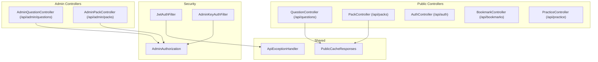
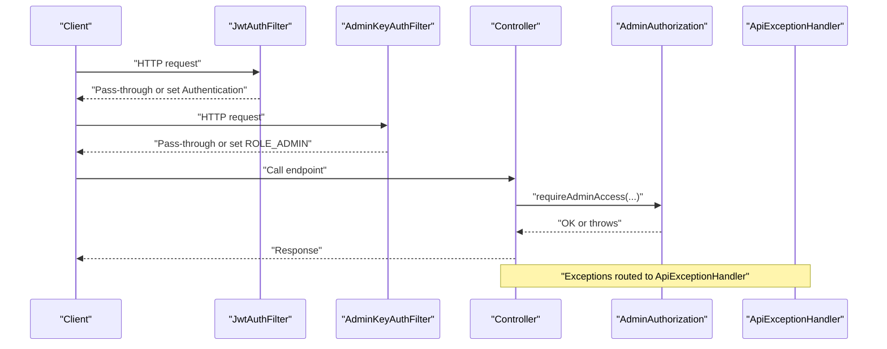
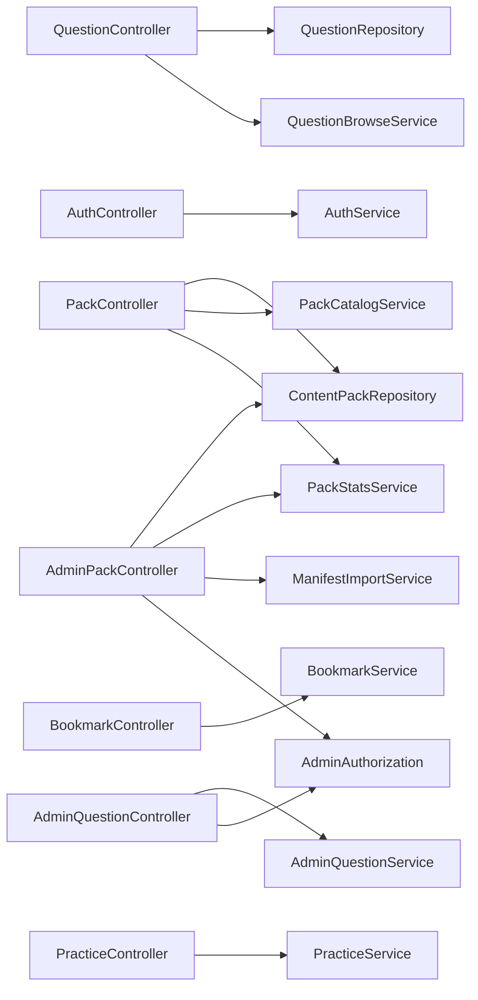

# API Reference

<cite>
**Referenced Files in This Document**
- [QuestionController.java](file://backend/src/main/java/com/neetlu/examhunt/web/QuestionController.java)
- [PackController.java](file://backend/src/main/java/com/neetlu/examhunt/web/PackController.java)
- [AuthController.java](file://backend/src/main/java/com/neetlu/examhunt/web/AuthController.java)
- [BookmarkController.java](file://backend/src/main/java/com/neetlu/examhunt/web/BookmarkController.java)
- [PracticeController.java](file://backend/src/main/java/com/neetlu/examhunt/web/PracticeController.java)
- [AdminQuestionController.java](file://backend/src/main/java/com/neetlu/examhunt/web/AdminQuestionController.java)
- [AdminPackController.java](file://backend/src/main/java/com/neetlu/examhunt/web/AdminPackController.java)
- [JwtAuthFilter.java](file://backend/src/main/java/com/neetlu/examhunt/security/JwtAuthFilter.java)
- [AdminKeyAuthFilter.java](file://backend/src/main/java/com/neetlu/examhunt/security/AdminKeyAuthFilter.java)
- [AdminAuthorization.java](file://backend/src/main/java/com/neetlu/examhunt/security/AdminAuthorization.java)
- [PublicCacheResponses.java](file://backend/src/main/java/com/neetlu/examhunt/web/PublicCacheResponses.java)
- [ApiExceptionHandler.java](file://backend/src/main/java/com/neetlu/examhunt/web/ApiExceptionHandler.java)
- [application.yml](file://backend/src/main/resources/application.yml)
- [Question.java](file://backend/src/main/java/com/neetlu/examhunt/model/Question.java)
- [ContentPack.java](file://backend/src/main/java/com/neetlu/examhunt/model/ContentPack.java)
</cite>

## Table of Contents
1. [Introduction](#introduction)
2. [Project Structure](#project-structure)
3. [Core Components](#core-components)
4. [Architecture Overview](#architecture-overview)
5. [Detailed Component Analysis](#detailed-component-analysis)
6. [Dependency Analysis](#dependency-analysis)
7. [Performance Considerations](#performance-considerations)
8. [Troubleshooting Guide](#troubleshooting-guide)
9. [Conclusion](#conclusion)
10. [Appendices](#appendices)

## Introduction
This document describes the REST API for the exam-hunt application. It covers:
- Public endpoints for question browsing, pack catalogs, bookmarks, and practice sessions
- Protected admin endpoints for question and pack management
- Authentication and authorization mechanisms (JWT and admin key)
- Request/response schemas, parameters, pagination, caching, error handling, and status codes
- Client implementation guidelines, rate limiting considerations, API versioning, and backwards compatibility notes

## Project Structure
The API surface is implemented via Spring MVC controllers grouped by domain:
- Public APIs: questions, packs, auth, bookmarks, practice
- Admin APIs: admin questions, admin packs, plus admin analytics, import, settings, seed, and practice AI endpoints

**Diagram sources**
- [QuestionController.java:24-292](file://backend/src/main/java/com/neetlu/examhunt/web/QuestionController.java#L24-L292)
- [PackController.java:19-85](file://backend/src/main/java/com/neetlu/examhunt/web/PackController.java#L19-L85)
- [AuthController.java:13-45](file://backend/src/main/java/com/neetlu/examhunt/web/AuthController.java#L13-L45)
- [BookmarkController.java:17-62](file://backend/src/main/java/com/neetlu/examhunt/web/BookmarkController.java#L17-L62)
- [PracticeController.java:21-273](file://backend/src/main/java/com/neetlu/examhunt/web/PracticeController.java#L21-L273)
- [AdminQuestionController.java:17-71](file://backend/src/main/java/com/neetlu/examhunt/web/AdminQuestionController.java#L17-L71)
- [AdminPackController.java:23-85](file://backend/src/main/java/com/neetlu/examhunt/web/AdminPackController.java#L23-L85)
- [JwtAuthFilter.java:21-59](file://backend/src/main/java/com/neetlu/examhunt/security/JwtAuthFilter.java#L21-L59)
- [AdminKeyAuthFilter.java:20-50](file://backend/src/main/java/com/neetlu/examhunt/security/AdminKeyAuthFilter.java#L20-L50)
- [AdminAuthorization.java:11-85](file://backend/src/main/java/com/neetlu/examhunt/security/AdminAuthorization.java#L11-L85)
- [PublicCacheResponses.java:9-24](file://backend/src/main/java/com/neetlu/examhunt/web/PublicCacheResponses.java#L9-L24)
- [ApiExceptionHandler.java:14-39](file://backend/src/main/java/com/neetlu/examhunt/web/ApiExceptionHandler.java#L14-L39)

**Section sources**
- [QuestionController.java:24-292](file://backend/src/main/java/com/neetlu/examhunt/web/QuestionController.java#L24-L292)
- [PackController.java:19-85](file://backend/src/main/java/com/neetlu/examhunt/web/PackController.java#L19-L85)
- [AuthController.java:13-45](file://backend/src/main/java/com/neetlu/examhunt/web/AuthController.java#L13-L45)
- [BookmarkController.java:17-62](file://backend/src/main/java/com/neetlu/examhunt/web/BookmarkController.java#L17-L62)
- [PracticeController.java:21-273](file://backend/src/main/java/com/neetlu/examhunt/web/PracticeController.java#L21-L273)
- [AdminQuestionController.java:17-71](file://backend/src/main/java/com/neetlu/examhunt/web/AdminQuestionController.java#L17-L71)
- [AdminPackController.java:23-85](file://backend/src/main/java/com/neetlu/examhunt/web/AdminPackController.java#L23-L85)

## Core Components
- Authentication and Authorization
  - JWT-based user authentication for protected endpoints
  - Admin key authentication for admin endpoints
- Public Catalog Caching
  - ETag and Cache-Control headers for public catalogs
- Exception Handling
  - Centralized mapping of exceptions to HTTP responses

**Section sources**
- [JwtAuthFilter.java:21-59](file://backend/src/main/java/com/neetlu/examhunt/security/JwtAuthFilter.java#L21-L59)
- [AdminKeyAuthFilter.java:20-50](file://backend/src/main/java/com/neetlu/examhunt/security/AdminKeyAuthFilter.java#L20-L50)
- [AdminAuthorization.java:11-85](file://backend/src/main/java/com/neetlu/examhunt/security/AdminAuthorization.java#L11-L85)
- [PublicCacheResponses.java:9-24](file://backend/src/main/java/com/neetlu/examhunt/web/PublicCacheResponses.java#L9-L24)
- [ApiExceptionHandler.java:14-39](file://backend/src/main/java/com/neetlu/examhunt/web/ApiExceptionHandler.java#L14-L39)

## Architecture Overview
High-level API flow:
- Public endpoints are generally unauthenticated; some responses are cached
- Protected endpoints require a valid JWT
- Admin endpoints accept either a JWT of an admin user or an admin key via a dedicated header

**Diagram sources**
- [JwtAuthFilter.java:30-56](file://backend/src/main/java/com/neetlu/examhunt/security/JwtAuthFilter.java#L30-L56)
- [AdminKeyAuthFilter.java:32-47](file://backend/src/main/java/com/neetlu/examhunt/security/AdminKeyAuthFilter.java#L32-L47)
- [AdminAuthorization.java:44-56](file://backend/src/main/java/com/neetlu/examhunt/security/AdminAuthorization.java#L44-L56)
- [ApiExceptionHandler.java:17-37](file://backend/src/main/java/com/neetlu/examhunt/web/ApiExceptionHandler.java#L17-L37)

## Detailed Component Analysis

### Authentication and Authorization
- JWT-based authentication
  - Header: Authorization: Bearer <token>
  - Filters out registration and login paths
- Admin key authentication
  - Header: X-Admin-Key: <key>
  - Applied to admin endpoints when no JWT present
- Admin authorization checks
  - Validates legacy admin key or user role and email configuration

Common status codes:
- 401 Unauthorized (invalid/expired JWT, missing credentials)
- 403 Forbidden (admin access required)

**Section sources**
- [JwtAuthFilter.java:30-56](file://backend/src/main/java/com/neetlu/examhunt/security/JwtAuthFilter.java#L30-L56)
- [AdminKeyAuthFilter.java:32-47](file://backend/src/main/java/com/neetlu/examhunt/security/AdminKeyAuthFilter.java#L32-L47)
- [AdminAuthorization.java:44-56](file://backend/src/main/java/com/neetlu/examhunt/security/AdminAuthorization.java#L44-L56)
- [ApiExceptionHandler.java:17-37](file://backend/src/main/java/com/neetlu/examhunt/web/ApiExceptionHandler.java#L17-L37)

### Public Endpoints

#### GET /api/packs
- Purpose: List content packs
- Response: 200 OK with ETag and Cache-Control headers
- Response body: Array of PackSummary

Response body fields:
- packId: string
- exam: string
- year: integer
- sourceFolder: string
- questionCount: long
- facets: object

Pagination: Not applicable

**Section sources**
- [PackController.java:39-43](file://backend/src/main/java/com/neetlu/examhunt/web/PackController.java#L39-L43)
- [PublicCacheResponses.java:14-22](file://backend/src/main/java/com/neetlu/examhunt/web/PublicCacheResponses.java#L14-L22)

#### GET /api/packs/{packId}
- Purpose: Get pack details
- Path parameters:
  - packId: string (required)
- Response: 200 OK with PackDetail

Response body fields:
- packId: string
- exam: string
- year: integer
- sourceFolder: string
- stats: object
- facets: object
- questionCount: long

**Section sources**
- [PackController.java:45-57](file://backend/src/main/java/com/neetlu/examhunt/web/PackController.java#L45-L57)

#### GET /api/packs/{packId}/facets
- Purpose: Get pack facets
- Path parameters:
  - packId: string (required)
- Response: 200 OK with facets map

**Section sources**
- [PackController.java:59-64](file://backend/src/main/java/com/neetlu/examhunt/web/PackController.java#L59-L64)

#### GET /api/questions
- Purpose: Browse questions within a pack
- Query parameters:
  - packId: string (required)
  - subject: string (optional)
  - chapter: string (optional)
  - topic: string (optional)
  - difficulty: string (optional)
  - q: string (optional)
  - page: integer (default 0)
  - size: integer (default 24, max 100)
- Response: 200 OK with Page of QuestionPublic

Response body fields (QuestionPublic):
- questionId: string
- packId: string
- questionNo: integer
- exam: string
- year: integer
- subject: string
- chapter: string
- topic: string
- difficulty: integer
- hasSolution: boolean
- answerOnly: boolean
- questionImageUrl: string
- solutionImageUrl: string
- questionTextPreview: string
- options: array of McqOptionView
- sourceType: string
- parentQuestionId: string
- variantNo: integer
- variantType: string

**Section sources**
- [QuestionController.java:42-57](file://backend/src/main/java/com/neetlu/examhunt/web/QuestionController.java#L42-L57)

#### GET /api/questions/search
- Purpose: Search questions globally or within a pack
- Query parameters:
  - q: string (required)
  - exam: string (default "NEET")
  - packId: string (optional)
  - page: integer (default 0)
  - size: integer (default 24, max 100)
- Response: 200 OK with Page of QuestionPublic
- Validation: Returns 400 Bad Request if q is blank

**Section sources**
- [QuestionController.java:59-78](file://backend/src/main/java/com/neetlu/examhunt/web/QuestionController.java#L59-L78)

#### GET /api/questions/{questionId}
- Purpose: Get question detail (includes answer and solution preview)
- Path parameters:
  - questionId: string (required)
- Response: 200 OK with QuestionDetail

Response body fields (QuestionDetail):
- questionId: string
- packId: string
- questionNo: integer
- exam: string
- year: integer
- answer: string
- subject: string
- chapter: string
- topic: string
- subtopic: string
- difficulty: integer
- concepts: array of string
- hasDiagram: boolean
- hasEquation: boolean
- formulaRelevant: boolean
- hasSolution: boolean
- answerOnly: boolean
- questionImageUrl: string
- solutionImageUrl: string
- questionTextPreview: string
- solutionTextPreview: string
- options: array of McqOptionView
- sourceType: string
- parentQuestionId: string
- variantNo: integer
- variantType: string
- questionFormat: string
- assertion: string
- reason: string
- statements: array of McqOptionView
- matchListA: array of McqOptionView
- matchListB: array of McqOptionView
- questionDiagramSvg: string
- solutionDiagramSvg: string

**Section sources**
- [QuestionController.java:84-90](file://backend/src/main/java/com/neetlu/examhunt/web/QuestionController.java#L84-L90)
- [QuestionController.java:196-271](file://backend/src/main/java/com/neetlu/examhunt/web/QuestionController.java#L196-L271)

#### GET /api/questions/{questionId}/family
- Purpose: Get question family (parent and variants)
- Path parameters:
  - questionId: string (required)
- Response: 200 OK with QuestionFamily

Response body fields (QuestionFamily):
- parentQuestionId: string
- paperQuestionNo: integer
- activeQuestionId: string
- pyq: QuestionPublic
- variants: array of VariantRef

VariantRef fields:
- questionId: string
- variantNo: integer
- variantType: string
- difficulty: integer
- hasSolution: boolean
- questionTextPreview: string

**Section sources**
- [QuestionController.java:93-121](file://backend/src/main/java/com/neetlu/examhunt/web/QuestionController.java#L93-L121)

#### GET /api/auth/register
- Purpose: Register a new user
- Body: RegisterRequest
  - email: string (required)
  - password: string (required)
  - displayName: string (optional)
- Response: 200 OK with AuthService.AuthResult

**Section sources**
- [AuthController.java:23-26](file://backend/src/main/java/com/neetlu/examhunt/web/AuthController.java#L23-L26)
- [AuthController.java:38-43](file://backend/src/main/java/com/neetlu/examhunt/web/AuthController.java#L38-L43)

#### GET /api/auth/login
- Purpose: Log in an existing user
- Body: LoginRequest
  - email: string (required)
  - password: string (required)
- Response: 200 OK with AuthService.AuthResult

**Section sources**
- [AuthController.java:28-31](file://backend/src/main/java/com/neetlu/examhunt/web/AuthController.java#L28-L31)
- [AuthController.java:43](file://backend/src/main/java/com/neetlu/examhunt/web/AuthController.java#L43)

#### GET /api/auth/me
- Purpose: Get current user profile
- Response: 200 OK with AuthService.UserProfile
- Requires: JWT

**Section sources**
- [AuthController.java:33-36](file://backend/src/main/java/com/neetlu/examhunt/web/AuthController.java#L33-L36)

#### GET /api/bookmarks
- Purpose: List bookmarks for the authenticated user
- Response: 200 OK with array of BookmarkItemView
- Requires: JWT

**Section sources**
- [BookmarkController.java:27-30](file://backend/src/main/java/com/neetlu/examhunt/web/BookmarkController.java#L27-L30)

#### GET /api/bookmarks/batch-status
- Purpose: Batch bookmark status lookup
- Query parameters:
  - ids: string (comma-separated question IDs)
- Response: 200 OK with map of questionId to boolean
- Requires: JWT

**Section sources**
- [BookmarkController.java:32-43](file://backend/src/main/java/com/neetlu/examhunt/web/BookmarkController.java#L32-L43)

#### GET /api/bookmarks/{questionId}/status
- Purpose: Single bookmark status
- Path parameters:
  - questionId: string (required)
- Response: 200 OK with BookmarkStatus
- Requires: JWT

**Section sources**
- [BookmarkController.java:45-49](file://backend/src/main/java/com/neetlu/examhunt/web/BookmarkController.java#L45-L49)

#### POST /api/bookmarks/{questionId}/toggle
- Purpose: Toggle bookmark and optionally add a note
- Path parameters:
  - questionId: string (required)
- Body: ToggleBody (note: string, optional)
- Response: 200 OK with BookmarkView
- Requires: JWT

**Section sources**
- [BookmarkController.java:51-58](file://backend/src/main/java/com/neetlu/examhunt/web/BookmarkController.java#L51-L58)

#### POST /api/practice/sessions
- Purpose: Create a new practice session
- Body: CreateSessionBody
  - exam: string (optional)
  - packId: string (required)
  - subject: string (optional)
  - chapter: string (optional)
  - topic: string (optional)
  - difficulty: string (optional)
  - adaptive: boolean (default false)
  - startQuestionId: string (optional)
  - mode: string (optional)
  - questionCount: integer (optional)
  - questionSet: string (optional)
- Response: 200 OK with PracticeService.SessionView
- Requires: JWT

**Section sources**
- [PracticeController.java:31-49](file://backend/src/main/java/com/neetlu/examhunt/web/PracticeController.java#L31-L49)

#### POST /api/practice/sessions/{sessionId}/retake-test
- Purpose: Create a retake test session
- Path parameters:
  - sessionId: string (required)
- Body: RetakeTestBody
  - filter: string (required)
- Response: 200 OK with PracticeService.SessionView
- Requires: JWT

**Section sources**
- [PracticeController.java:51-58](file://backend/src/main/java/com/neetlu/examhunt/web/PracticeController.java#L51-L58)

#### GET /api/practice/sessions/{sessionId}
- Purpose: Get a practice session
- Path parameters:
  - sessionId: string (required)
- Response: 200 OK with PracticeService.SessionView
- Requires: JWT

**Section sources**
- [PracticeController.java:60-64](file://backend/src/main/java/com/neetlu/examhunt/web/PracticeController.java#L60-L64)

#### GET /api/practice/progress
- Purpose: Get user progress summary
- Response: 200 OK with PracticeService.ProgressSummary
- Requires: JWT

**Section sources**
- [PracticeController.java:66-69](file://backend/src/main/java/com/neetlu/examhunt/web/PracticeController.java#L66-L69)

#### GET /api/practice/wrong-attempts
- Purpose: List wrong attempts with filters
- Query parameters:
  - mode: string (optional)
  - subject: string (optional)
  - chapter: string (optional)
  - exam: string (optional)
  - year: integer (optional)
  - sessionId: string (optional)
- Response: 200 OK with array of PracticeService.WrongAttemptView
- Requires: JWT

**Section sources**
- [PracticeController.java:71-81](file://backend/src/main/java/com/neetlu/examhunt/web/PracticeController.java#L71-L81)

#### GET /api/practice/sessions/{sessionId}/result
- Purpose: Get session result
- Path parameters:
  - sessionId: string (required)
- Response: 200 OK with PracticeService.SessionResultView
- Requires: JWT

**Section sources**
- [PracticeController.java:83-87](file://backend/src/main/java/com/neetlu/examhunt/web/PracticeController.java#L83-L87)

#### POST /api/practice/submit
- Purpose: Submit an answer for a question in a session
- Body: SubmitBody
  - sessionId: string (required)
  - questionId: string (required)
  - selectedAnswer: string (required)
- Response: 200 OK with PracticeService.SubmitResult
- Requires: JWT

**Section sources**
- [PracticeController.java:89-95](file://backend/src/main/java/com/neetlu/examhunt/web/PracticeController.java#L89-L95)

#### POST /api/practice/variant-check
- Purpose: Check variant answer
- Body: VariantCheckBody
  - questionId: string (required)
  - selectedAnswer: string (required)
- Response: 200 OK with PracticeService.VariantCheckResult
- Requires: JWT

**Section sources**
- [PracticeController.java:97-101](file://backend/src/main/java/com/neetlu/examhunt/web/PracticeController.java#L97-L101)

#### POST /api/practice/skip
- Purpose: Skip a question in a session
- Body: SkipBody
  - sessionId: string (required)
  - questionId: string (required)
- Response: 200 OK with PracticeService.SkipResult
- Requires: JWT

**Section sources**
- [PracticeController.java:103-108](file://backend/src/main/java/com/neetlu/examhunt/web/PracticeController.java#L103-L108)

#### POST /api/practice/sessions/{sessionId}/mark-review
- Purpose: Mark/unmark a question for review
- Path parameters:
  - sessionId: string (required)
- Body: MarkReviewBody
  - questionId: string (required)
- Response: 200 OK with PracticeService.SessionView
- Requires: JWT

**Section sources**
- [PracticeController.java:110-116](file://backend/src/main/java/com/neetlu/examhunt/web/PracticeController.java#L110-L116)

#### POST /api/practice/sessions/{sessionId}/engage
- Purpose: Engage a session (mark active)
- Path parameters:
  - sessionId: string (required)
- Response: 200 OK with PracticeService.SessionView
- Requires: JWT

**Section sources**
- [PracticeController.java:118-122](file://backend/src/main/java/com/neetlu/examhunt/web/PracticeController.java#L118-L122)

#### POST /api/practice/sessions/{sessionId}/pause
- Purpose: Pause a session
- Path parameters:
  - sessionId: string (required)
- Response: 200 OK with PracticeService.SessionView
- Requires: JWT

**Section sources**
- [PracticeController.java:124-128](file://backend/src/main/java/com/neetlu/examhunt/web/PracticeController.java#L124-L128)

#### POST /api/practice/sessions/{sessionId}/finish
- Purpose: Finish a session
- Path parameters:
  - sessionId: string (required)
- Response: 200 OK with PracticeService.SessionResultView
- Requires: JWT

**Section sources**
- [PracticeController.java:130-134](file://backend/src/main/java/com/neetlu/examhunt/web/PracticeController.java#L130-L134)

#### GET /api/practice/questions/{questionId}
- Purpose: Get a practice question view
- Path parameters:
  - questionId: string (required)
- Response: 200 OK with QuestionPracticeView
- Requires: JWT

**Section sources**
- [PracticeController.java:136-141](file://backend/src/main/java/com/neetlu/examhunt/web/PracticeController.java#L136-L141)

#### GET /api/practice/questions/{questionId}/solution
- Purpose: Reveal solution preview for a practice question
- Path parameters:
  - questionId: string (required)
- Response: 200 OK with SolutionRevealView
- Requires: JWT

**Section sources**
- [PracticeController.java:144-151](file://backend/src/main/java/com/neetlu/examhunt/web/PracticeController.java#L144-L151)

#### PUT /api/practice/questions/{questionId}/rating
- Purpose: Rate a question
- Path parameters:
  - questionId: string (required)
- Body: RateBody
  - score: integer (min 1, max 5)
  - comment: string (optional)
- Response: 200 OK with PracticeService.RatingView
- Requires: JWT

**Section sources**
- [PracticeController.java:157-163](file://backend/src/main/java/com/neetlu/examhunt/web/PracticeController.java#L157-L163)

#### GET /api/practice/questions/{questionId}/rating
- Purpose: Get user rating for a question
- Path parameters:
  - questionId: string (required)
- Response: 200 OK with PracticeService.RatingView
- Requires: JWT

**Section sources**
- [PracticeController.java:165-169](file://backend/src/main/java/com/neetlu/examhunt/web/PracticeController.java#L165-L169)

### Admin Endpoints

#### GET /api/admin/questions/search
- Purpose: Search questions (admin)
- Query parameters:
  - q: string (required)
  - packId: string (optional)
  - page: integer (default 0)
  - size: integer (default 24, max 100)
- Headers:
  - X-Admin-Key: string (optional)
- Response: 200 OK with Page of AdminQuestionService.QuestionSearchRow
- Requires: JWT or X-Admin-Key

**Section sources**
- [AdminQuestionController.java:30-40](file://backend/src/main/java/com/neetlu/examhunt/web/AdminQuestionController.java#L30-L40)

#### GET /api/admin/questions/{questionId}
- Purpose: Get admin question detail
- Path parameters:
  - questionId: string (required)
- Headers:
  - X-Admin-Key: string (optional)
- Response: 200 OK with AdminQuestionService.AdminQuestionDetail
- Requires: JWT or X-Admin-Key

**Section sources**
- [AdminQuestionController.java:42-49](file://backend/src/main/java/com/neetlu/examhunt/web/AdminQuestionController.java#L42-L49)

#### PATCH /api/admin/questions/{questionId}
- Purpose: Update question content
- Path parameters:
  - questionId: string (required)
- Body: AdminQuestionService.UpdateContentRequest
- Headers:
  - X-Admin-Key: string (optional)
- Response: 200 OK with AdminQuestionService.AdminQuestionDetail
- Requires: JWT or X-Admin-Key

**Section sources**
- [AdminQuestionController.java:51-59](file://backend/src/main/java/com/neetlu/examhunt/web/AdminQuestionController.java#L51-L59)

#### PUT /api/admin/questions/{questionId}/enrichment
- Purpose: Update question enrichment
- Path parameters:
  - questionId: string (required)
- Body: AdminQuestionService.UpdateEnrichmentRequest
- Headers:
  - X-Admin-Key: string (optional)
- Response: 200 OK with AdminQuestionService.AdminQuestionDetail
- Requires: JWT or X-Admin-Key

**Section sources**
- [AdminQuestionController.java:61-69](file://backend/src/main/java/com/neetlu/examhunt/web/AdminQuestionController.java#L61-L69)

#### GET /api/admin/packs
- Purpose: List packs (admin)
- Headers:
  - X-Admin-Key: string (optional)
- Response: 200 OK with object containing packs array and count
- Requires: JWT or X-Admin-Key

**Section sources**
- [AdminPackController.java:43-58](file://backend/src/main/java/com/neetlu/examhunt/web/AdminPackController.java#L43-L58)

#### DELETE /api/admin/packs/{packId}
- Purpose: Delete a pack (admin)
- Path parameters:
  - packId: string (required)
- Headers:
  - X-Admin-Key: string (optional)
- Response: 200 OK with deletion result
- Requires: JWT or X-Admin-Key

**Section sources**
- [AdminPackController.java:60-75](file://backend/src/main/java/com/neetlu/examhunt/web/AdminPackController.java#L60-L75)

## Dependency Analysis
- Controllers depend on services and repositories
- Public endpoints leverage caching utilities
- Admin endpoints enforce authorization via AdminAuthorization
- Exception handling centralizes error responses

**Diagram sources**
- [QuestionController.java:28-40](file://backend/src/main/java/com/neetlu/examhunt/web/QuestionController.java#L28-L40)
- [PackController.java:23-37](file://backend/src/main/java/com/neetlu/examhunt/web/PackController.java#L23-L37)
- [AuthController.java:17-21](file://backend/src/main/java/com/neetlu/examhunt/web/AuthController.java#L17-L21)
- [BookmarkController.java:21-25](file://backend/src/main/java/com/neetlu/examhunt/web/BookmarkController.java#L21-L25)
- [PracticeController.java:25-29](file://backend/src/main/java/com/neetlu/examhunt/web/PracticeController.java#L25-L29)
- [AdminQuestionController.java:21-28](file://backend/src/main/java/com/neetlu/examhunt/web/AdminQuestionController.java#L21-L28)
- [AdminPackController.java:27-41](file://backend/src/main/java/com/neetlu/examhunt/web/AdminPackController.java#L27-L41)

**Section sources**
- [QuestionController.java:28-40](file://backend/src/main/java/com/neetlu/examhunt/web/QuestionController.java#L28-L40)
- [PackController.java:23-37](file://backend/src/main/java/com/neetlu/examhunt/web/PackController.java#L23-L37)
- [AuthController.java:17-21](file://backend/src/main/java/com/neetlu/examhunt/web/AuthController.java#L17-L21)
- [BookmarkController.java:21-25](file://backend/src/main/java/com/neetlu/examhunt/web/BookmarkController.java#L21-L25)
- [PracticeController.java:25-29](file://backend/src/main/java/com/neetlu/examhunt/web/PracticeController.java#L25-L29)
- [AdminQuestionController.java:21-28](file://backend/src/main/java/com/neetlu/examhunt/web/AdminQuestionController.java#L21-L28)
- [AdminPackController.java:27-41](file://backend/src/main/java/com/neetlu/examhunt/web/AdminPackController.java#L27-L41)

## Performance Considerations
- Pagination limits: size parameters are capped (e.g., 100) to prevent heavy queries
- Public catalog caching: ETag and Cache-Control headers reduce origin load and improve latency
- Indexes on MongoDB collections support efficient filtering and sorting

**Section sources**
- [QuestionController.java:53](file://backend/src/main/java/com/neetlu/examhunt/web/QuestionController.java#L53)
- [PublicCacheResponses.java:14-22](file://backend/src/main/java/com/neetlu/examhunt/web/PublicCacheResponses.java#L14-L22)
- [Question.java:12-15](file://backend/src/main/java/com/neetlu/examhunt/model/Question.java#L12-L15)
- [ContentPack.java:11](file://backend/src/main/java/com/neetlu/examhunt/model/ContentPack.java#L11)

## Troubleshooting Guide
Common errors and resolutions:
- 400 Bad Request
  - Occurs when required query/body fields are missing or invalid (e.g., empty search query)
- 401 Unauthorized
  - Missing or invalid JWT; ensure Authorization header is present and valid
- 403 Forbidden
  - Admin access required; provide valid JWT of an admin user or X-Admin-Key
- 404 Not Found
  - Resource not found (e.g., pack or question)

Centralized error handling:
- Authentication and access denied exceptions mapped to appropriate HTTP status codes
- Generic bad request mapping for validation and IO issues

**Section sources**
- [QuestionController.java:67-70](file://backend/src/main/java/com/neetlu/examhunt/web/QuestionController.java#L67-L70)
- [ApiExceptionHandler.java:17-37](file://backend/src/main/java/com/neetlu/examhunt/web/ApiExceptionHandler.java#L17-L37)

## Conclusion
The exam-hunt API provides a clear separation between public and protected/admin endpoints, robust authentication and authorization, and practical caching for public catalogs. Clients should implement JWT-based authentication for protected features and use admin keys for administrative tasks. Adhering to pagination limits and respecting cache headers ensures optimal performance and reliability.

## Appendices

### Authentication Methods
- JWT
  - Header: Authorization: Bearer <token>
  - Used by most protected endpoints
- Admin Key
  - Header: X-Admin-Key: <key>
  - Used by admin endpoints when JWT is not available

Environment configuration affects behavior:
- JWT secret and expiration hours
- Admin email and admin import key
- Public API cache settings

**Section sources**
- [application.yml:11-31](file://backend/src/main/resources/application.yml#L11-L31)

### API Versioning and Backwards Compatibility
- No explicit version path segments observed in controllers
- Backwards compatibility is not explicitly documented; clients should pin to stable endpoints and monitor changes

[No sources needed since this section provides general guidance]

### Rate Limiting Considerations
- No built-in rate limiting observed in controllers or filters
- Recommended: Apply rate limiting at the gateway or reverse proxy layer

[No sources needed since this section provides general guidance]

### Client Implementation Guidelines
- Use Authorization header for JWT on protected endpoints
- Include X-Admin-Key for admin endpoints when not using JWT
- Respect Cache-Control and ETag headers for public catalogs
- Implement retry/backoff for transient failures
- Validate response schemas against provided records

[No sources needed since this section provides general guidance]

### Curl Examples
- Register
  - curl -X POST https://<host>/api/auth/register -H "Content-Type: application/json" -d '{"email":"user@example.com","password":"pass","displayName":"User"}'
- Login
  - curl -X POST https://<host>/api/auth/login -H "Content-Type: application/json" -d '{"email":"user@example.com","password":"pass"}'
- Get my profile (JWT required)
  - curl -H "Authorization: Bearer <token>" https://<host>/api/auth/me
- List packs (public)
  - curl https://<host>/api/packs
- Search questions (public)
  - curl "https://<host>/api/questions/search?q=physics&packId=NEET_2024"
- Admin key usage (admin)
  - curl -H "X-Admin-Key: <admin-key>" https://<host>/api/admin/questions/search?q=biology&page=0&size=24

[No sources needed since this section provides general guidance]