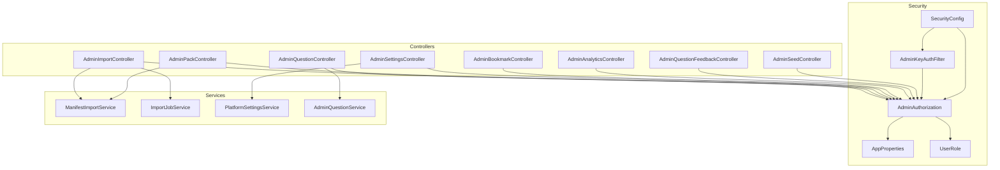
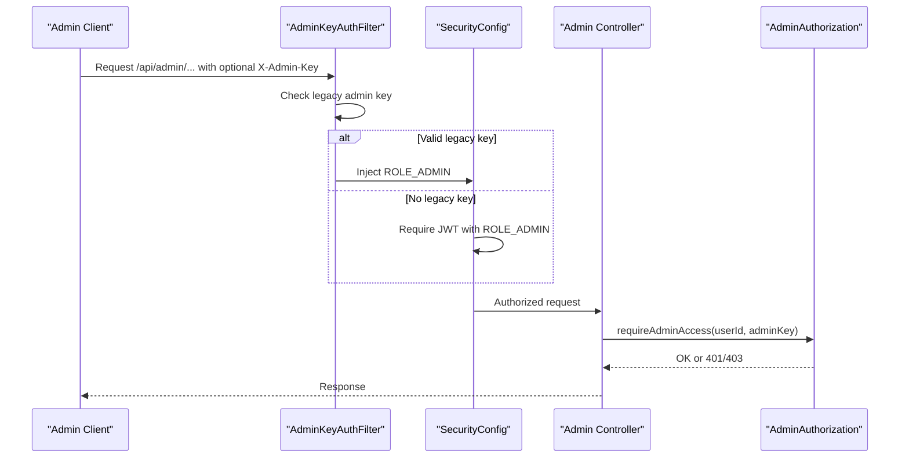
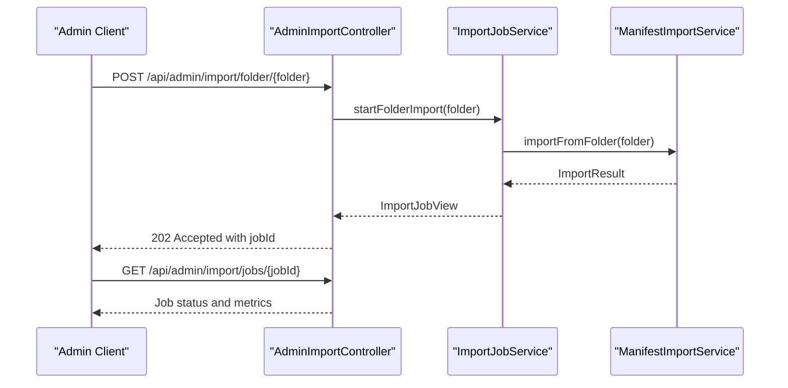
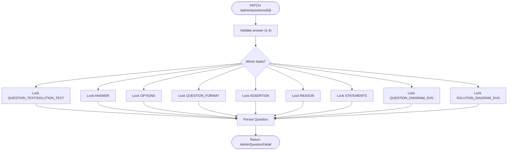
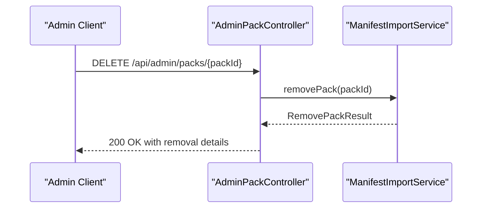
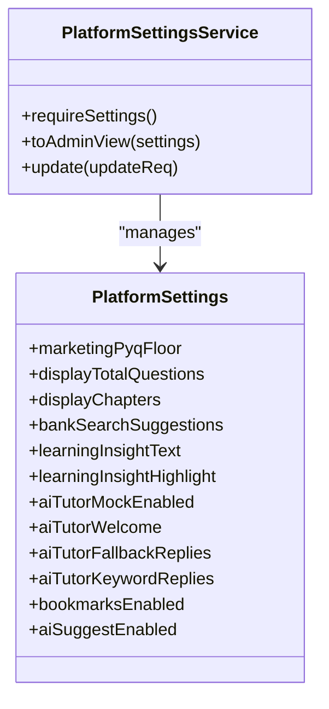
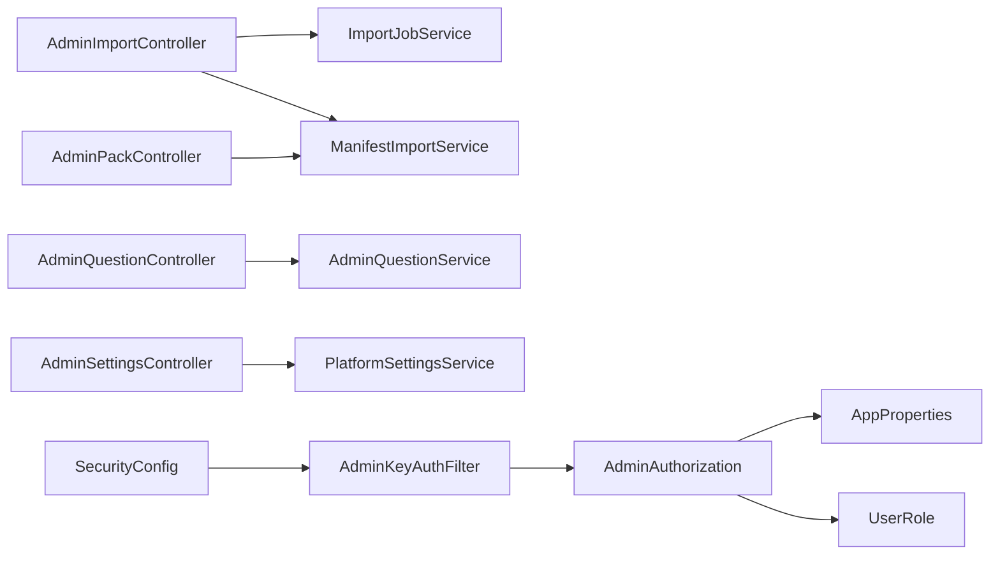

# Admin Management Endpoints

<cite>
**Referenced Files in This Document**
- [AdminImportController.java](file://backend/src/main/java/com/neetlu/examhunt/web/AdminImportController.java)
- [AdminQuestionController.java](file://backend/src/main/java/com/neetlu/examhunt/web/AdminQuestionController.java)
- [AdminPackController.java](file://backend/src/main/java/com/neetlu/examhunt/web/AdminPackController.java)
- [AdminSettingsController.java](file://backend/src/main/java/com/neetlu/examhunt/web/AdminSettingsController.java)
- [AdminBookmarkController.java](file://backend/src/main/java/com/neetlu/examhunt/web/AdminBookmarkController.java)
- [AdminAnalyticsController.java](file://backend/src/main/java/com/neetlu/examhunt/web/AdminAnalyticsController.java)
- [AdminQuestionFeedbackController.java](file://backend/src/main/java/com/neetlu/examhunt/web/AdminQuestionFeedbackController.java)
- [AdminSeedController.java](file://backend/src/main/java/com/neetlu/examhunt/web/AdminSeedController.java)
- [AdminAuthorization.java](file://backend/src/main/java/com/neetlu/examhunt/security/AdminAuthorization.java)
- [AdminKeyAuthFilter.java](file://backend/src/main/java/com/neetlu/examhunt/security/AdminKeyAuthFilter.java)
- [SecurityConfig.java](file://backend/src/main/java/com/neetlu/examhunt/config/SecurityConfig.java)
- [AppProperties.java](file://backend/src/main/java/com/neetlu/examhunt/config/AppProperties.java)
- [UserRole.java](file://backend/src/main/java/com/neetlu/examhunt/model/UserRole.java)
- [PlatformSettingsService.java](file://backend/src/main/java/com/neetlu/examhunt/service/PlatformSettingsService.java)
- [PlatformSettings.java](file://backend/src/main/java/com/neetlu/examhunt/model/PlatformSettings.java)
- [ImportJobService.java](file://backend/src/main/java/com/neetlu/examhunt/service/ImportJobService.java)
- [ManifestImportService.java](file://backend/src/main/java/com/neetlu/examhunt/service/ManifestImportService.java)
- [AdminQuestionService.java](file://backend/src/main/java/com/neetlu/examhunt/service/AdminQuestionService.java)
</cite>

## Table of Contents
1. [Introduction](#introduction)
2. [Project Structure](#project-structure)
3. [Core Components](#core-components)
4. [Architecture Overview](#architecture-overview)
5. [Detailed Component Analysis](#detailed-component-analysis)
6. [Dependency Analysis](#dependency-analysis)
7. [Performance Considerations](#performance-considerations)
8. [Troubleshooting Guide](#troubleshooting-guide)
9. [Conclusion](#conclusion)
10. [Appendices](#appendices)

## Introduction
This document describes the admin management API surface for content import, question management, pack administration, and system settings. It explains authentication and authorization requirements, privileged operations, and provides endpoint reference tables with request/response characteristics. It also covers import workflows, bulk operations, and quality assurance patterns used by the backend.

## Project Structure
Admin endpoints are implemented as Spring MVC REST controllers under the `/api/admin` namespace. Controllers delegate to services that encapsulate domain logic, while security filters and authorization utilities enforce admin access.

**Diagram sources**
- [AdminImportController.java:19-110](file://backend/src/main/java/com/neetlu/examhunt/web/AdminImportController.java#L19-L110)
- [AdminQuestionController.java:17-71](file://backend/src/main/java/com/neetlu/examhunt/web/AdminQuestionController.java#L17-L71)
- [AdminPackController.java:23-85](file://backend/src/main/java/com/neetlu/examhunt/web/AdminPackController.java#L23-L85)
- [AdminSettingsController.java:13-43](file://backend/src/main/java/com/neetlu/examhunt/web/AdminSettingsController.java#L13-L43)
- [AdminBookmarkController.java:15-44](file://backend/src/main/java/com/neetlu/examhunt/web/AdminBookmarkController.java#L15-L44)
- [AdminAnalyticsController.java:9-24](file://backend/src/main/java/com/neetlu/examhunt/web/AdminAnalyticsController.java#L9-L24)
- [AdminQuestionFeedbackController.java:12-36](file://backend/src/main/java/com/neetlu/examhunt/web/AdminQuestionFeedbackController.java#L12-L36)
- [AdminSeedController.java:16-84](file://backend/src/main/java/com/neetlu/examhunt/web/AdminSeedController.java#L16-L84)
- [AdminAuthorization.java:12-85](file://backend/src/main/java/com/neetlu/examhunt/security/AdminAuthorization.java#L12-L85)
- [AdminKeyAuthFilter.java:20-50](file://backend/src/main/java/com/neetlu/examhunt/security/AdminKeyAuthFilter.java#L20-L50)
- [SecurityConfig.java:23-76](file://backend/src/main/java/com/neetlu/examhunt/config/SecurityConfig.java#L23-L76)
- [AppProperties.java:6-24](file://backend/src/main/java/com/neetlu/examhunt/config/AppProperties.java#L6-L24)
- [UserRole.java:3-7](file://backend/src/main/java/com/neetlu/examhunt/model/UserRole.java#L3-L7)
- [ManifestImportService.java:38-800](file://backend/src/main/java/com/neetlu/examhunt/service/ManifestImportService.java#L38-L800)
- [ImportJobService.java:19-241](file://backend/src/main/java/com/neetlu/examhunt/service/ImportJobService.java#L19-L241)
- [PlatformSettingsService.java:10-126](file://backend/src/main/java/com/neetlu/examhunt/service/PlatformSettingsService.java#L10-L126)
- [AdminQuestionService.java:22-408](file://backend/src/main/java/com/neetlu/examhunt/service/AdminQuestionService.java#L22-L408)

**Section sources**
- [AdminImportController.java:19-110](file://backend/src/main/java/com/neetlu/examhunt/web/AdminImportController.java#L19-L110)
- [AdminQuestionController.java:17-71](file://backend/src/main/java/com/neetlu/examhunt/web/AdminQuestionController.java#L17-L71)
- [AdminPackController.java:23-85](file://backend/src/main/java/com/neetlu/examhunt/web/AdminPackController.java#L23-L85)
- [AdminSettingsController.java:13-43](file://backend/src/main/java/com/neetlu/examhunt/web/AdminSettingsController.java#L13-L43)
- [AdminAuthorization.java:12-85](file://backend/src/main/java/com/neetlu/examhunt/security/AdminAuthorization.java#L12-L85)
- [AdminKeyAuthFilter.java:20-50](file://backend/src/main/java/com/neetlu/examhunt/security/AdminKeyAuthFilter.java#L20-L50)
- [SecurityConfig.java:23-76](file://backend/src/main/java/com/neetlu/examhunt/config/SecurityConfig.java#L23-L76)
- [AppProperties.java:6-24](file://backend/src/main/java/com/neetlu/examhunt/config/AppProperties.java#L6-L24)
- [UserRole.java:3-7](file://backend/src/main/java/com/neetlu/examhunt/model/UserRole.java#L3-L7)

## Core Components
- AdminImportController: Lists import folders, manages import jobs, and triggers imports for specific folders or bulk datasets.
- AdminQuestionController: Searches and updates question content and enrichment fields.
- AdminPackController: Lists packs and deletes packs by ID.
- AdminSettingsController: Retrieves and updates platform settings for admin use.
- AdminBookmarkController: Seeds and clears bookmarks for admin testing.
- AdminAnalyticsController: Provides administrative analytics summaries.
- AdminQuestionFeedbackController: Lists question feedback for admin review.
- AdminSeedController: Seeds demo packs and leaderboard demo data, and cleans up demo artifacts.
- AdminAuthorization: Enforces admin access via JWT principal or legacy admin key.
- AdminKeyAuthFilter: Injects admin authorities for requests carrying a legacy admin key header.
- SecurityConfig: Declares admin route protection and filter ordering.
- AppProperties: Supplies admin credentials and keys used by authorization.
- PlatformSettingsService and PlatformSettings: Manage platform-wide settings.
- ImportJobService and ManifestImportService: Drive asynchronous import jobs and orchestrate content ingestion.
- AdminQuestionService: Validates and persists question updates with admin locking.

**Section sources**
- [AdminImportController.java:19-110](file://backend/src/main/java/com/neetlu/examhunt/web/AdminImportController.java#L19-L110)
- [AdminQuestionController.java:17-71](file://backend/src/main/java/com/neetlu/examhunt/web/AdminQuestionController.java#L17-L71)
- [AdminPackController.java:23-85](file://backend/src/main/java/com/neetlu/examhunt/web/AdminPackController.java#L23-L85)
- [AdminSettingsController.java:13-43](file://backend/src/main/java/com/neetlu/examhunt/web/AdminSettingsController.java#L13-L43)
- [AdminBookmarkController.java:15-44](file://backend/src/main/java/com/neetlu/examhunt/web/AdminBookmarkController.java#L15-L44)
- [AdminAnalyticsController.java:9-24](file://backend/src/main/java/com/neetlu/examhunt/web/AdminAnalyticsController.java#L9-L24)
- [AdminQuestionFeedbackController.java:12-36](file://backend/src/main/java/com/neetlu/examhunt/web/AdminQuestionFeedbackController.java#L12-L36)
- [AdminSeedController.java:16-84](file://backend/src/main/java/com/neetlu/examhunt/web/AdminSeedController.java#L16-L84)
- [AdminAuthorization.java:12-85](file://backend/src/main/java/com/neetlu/examhunt/security/AdminAuthorization.java#L12-L85)
- [AdminKeyAuthFilter.java:20-50](file://backend/src/main/java/com/neetlu/examhunt/security/AdminKeyAuthFilter.java#L20-L50)
- [SecurityConfig.java:23-76](file://backend/src/main/java/com/neetlu/examhunt/config/SecurityConfig.java#L23-L76)
- [PlatformSettingsService.java:10-126](file://backend/src/main/java/com/neetlu/examhunt/service/PlatformSettingsService.java#L10-L126)
- [PlatformSettings.java:11-150](file://backend/src/main/java/com/neetlu/examhunt/model/PlatformSettings.java#L11-L150)
- [ImportJobService.java:19-241](file://backend/src/main/java/com/neetlu/examhunt/service/ImportJobService.java#L19-L241)
- [ManifestImportService.java:38-800](file://backend/src/main/java/com/neetlu/examhunt/service/ManifestImportService.java#L38-L800)
- [AdminQuestionService.java:22-408](file://backend/src/main/java/com/neetlu/examhunt/service/AdminQuestionService.java#L22-L408)

## Architecture Overview
Admin endpoints are protected by role-based access control. Requests to /api/admin/* require ROLE_ADMIN. Authentication can come from:
- JWT principal (preferred), or
- Legacy admin key via X-Admin-Key header.

**Diagram sources**
- [AdminKeyAuthFilter.java:20-50](file://backend/src/main/java/com/neetlu/examhunt/security/AdminKeyAuthFilter.java#L20-L50)
- [SecurityConfig.java:42-76](file://backend/src/main/java/com/neetlu/examhunt/config/SecurityConfig.java#L42-L76)
- [AdminAuthorization.java:44-56](file://backend/src/main/java/com/neetlu/examhunt/security/AdminAuthorization.java#L44-L56)

**Section sources**
- [AdminKeyAuthFilter.java:20-50](file://backend/src/main/java/com/neetlu/examhunt/security/AdminKeyAuthFilter.java#L20-L50)
- [SecurityConfig.java:42-76](file://backend/src/main/java/com/neetlu/examhunt/config/SecurityConfig.java#L42-L76)
- [AdminAuthorization.java:44-56](file://backend/src/main/java/com/neetlu/examhunt/security/AdminAuthorization.java#L44-L56)

## Detailed Component Analysis

### Admin Import Endpoints
- List import folders
  - Method: GET
  - Path: /api/admin/import/folders
  - Headers: X-Admin-Key (optional)
  - Auth: ROLE_ADMIN enforced
  - Response: folders array, count, and import source status
- List recent import jobs
  - Method: GET
  - Path: /api/admin/import/jobs
  - Headers: X-Admin-Key (optional)
  - Auth: ROLE_ADMIN enforced
  - Response: jobs array and count
- Get a specific import job
  - Method: GET
  - Path: /api/admin/import/jobs/{jobId}
  - Path params: jobId
  - Headers: X-Admin-Key (optional)
  - Auth: ROLE_ADMIN enforced
  - Response: job details
- Import a specific folder
  - Method: POST
  - Path: /api/admin/import/folder/{folderName}
  - Path params: folderName
  - Headers: X-Admin-Key (optional)
  - Auth: ROLE_ADMIN enforced
  - Response: job id, status, and polling hint
- Import NEET dataset
  - Method: POST
  - Path: /api/admin/import/neet
  - Headers: X-Admin-Key (optional)
  - Auth: ROLE_ADMIN enforced
  - Response: job id, status, and polling hint
- Import all published folders
  - Method: POST
  - Path: /api/admin/import/all
  - Headers: X-Admin-Key (optional)
  - Auth: ROLE_ADMIN enforced
  - Response: job id, status, and polling hint

**Diagram sources**
- [AdminImportController.java:67-108](file://backend/src/main/java/com/neetlu/examhunt/web/AdminImportController.java#L67-L108)
- [ImportJobService.java:38-112](file://backend/src/main/java/com/neetlu/examhunt/service/ImportJobService.java#L38-L112)
- [ManifestImportService.java:71-79](file://backend/src/main/java/com/neetlu/examhunt/service/ManifestImportService.java#L71-L79)

**Section sources**
- [AdminImportController.java:36-108](file://backend/src/main/java/com/neetlu/examhunt/web/AdminImportController.java#L36-L108)
- [ImportJobService.java:38-112](file://backend/src/main/java/com/neetlu/examhunt/service/ImportJobService.java#L38-L112)
- [ManifestImportService.java:71-79](file://backend/src/main/java/com/neetlu/examhunt/service/ManifestImportService.java#L71-L79)

### Admin Question Management Endpoints
- Search questions
  - Method: GET
  - Path: /api/admin/questions/search
  - Query params: q (required), packId (optional), page, size
  - Headers: X-Admin-Key (optional)
  - Auth: ROLE_ADMIN enforced
  - Response: paginated search rows
- Get question detail
  - Method: GET
  - Path: /api/admin/questions/{questionId}
  - Path params: questionId
  - Headers: X-Admin-Key (optional)
  - Auth: ROLE_ADMIN enforced
  - Response: admin question detail enriched from disk
- Update question content
  - Method: PATCH
  - Path: /api/admin/questions/{questionId}
  - Path params: questionId
  - Body: content update fields (e.g., previews, answer, options, formats)
  - Headers: X-Admin-Key (optional)
  - Auth: ROLE_ADMIN enforced
  - Response: updated admin question detail
- Update question enrichment
  - Method: PUT
  - Path: /api/admin/questions/{questionId}/enrichment
  - Path params: questionId
  - Body: enrichment fields (e.g., hints, notes, formula cards)
  - Headers: X-Admin-Key (optional)
  - Auth: ROLE_ADMIN enforced
  - Response: updated admin question detail

**Diagram sources**
- [AdminQuestionController.java:51-69](file://backend/src/main/java/com/neetlu/examhunt/web/AdminQuestionController.java#L51-L69)
- [AdminQuestionService.java:54-99](file://backend/src/main/java/com/neetlu/examhunt/service/AdminQuestionService.java#L54-L99)

**Section sources**
- [AdminQuestionController.java:30-69](file://backend/src/main/java/com/neetlu/examhunt/web/AdminQuestionController.java#L30-L69)
- [AdminQuestionService.java:33-155](file://backend/src/main/java/com/neetlu/examhunt/service/AdminQuestionService.java#L33-L155)

### Admin Pack Administration Endpoints
- List packs
  - Method: GET
  - Path: /api/admin/packs
  - Headers: X-Admin-Key (optional)
  - Auth: ROLE_ADMIN enforced
  - Response: packs array with counts and demo flags
- Delete pack
  - Method: DELETE
  - Path: /api/admin/packs/{packId}
  - Path params: packId
  - Headers: X-Admin-Key (optional)
  - Auth: ROLE_ADMIN enforced
  - Response: removed pack info and message
  - Notes: Throws 404 if pack not found

**Diagram sources**
- [AdminPackController.java:60-75](file://backend/src/main/java/com/neetlu/examhunt/web/AdminPackController.java#L60-L75)
- [ManifestImportService.java:412-427](file://backend/src/main/java/com/neetlu/examhunt/service/ManifestImportService.java#L412-L427)

**Section sources**
- [AdminPackController.java:43-75](file://backend/src/main/java/com/neetlu/examhunt/web/AdminPackController.java#L43-L75)
- [ManifestImportService.java:412-427](file://backend/src/main/java/com/neetlu/examhunt/service/ManifestImportService.java#L412-L427)

### Admin Settings Endpoints
- Get platform settings (admin view)
  - Method: GET
  - Path: /api/admin/settings
  - Headers: X-Admin-Key (optional)
  - Auth: ROLE_ADMIN enforced
  - Response: admin settings view
- Update platform settings
  - Method: PUT
  - Path: /api/admin/settings
  - Body: update request fields
  - Headers: X-Admin-Key (optional)
  - Auth: ROLE_ADMIN enforced
  - Response: updated admin settings view

**Diagram sources**
- [PlatformSettingsService.java:10-126](file://backend/src/main/java/com/neetlu/examhunt/service/PlatformSettingsService.java#L10-L126)
- [PlatformSettings.java:11-150](file://backend/src/main/java/com/neetlu/examhunt/model/PlatformSettings.java#L11-L150)

**Section sources**
- [AdminSettingsController.java:26-41](file://backend/src/main/java/com/neetlu/examhunt/web/AdminSettingsController.java#L26-L41)
- [PlatformSettingsService.java:49-95](file://backend/src/main/java/com/neetlu/examhunt/service/PlatformSettingsService.java#L49-L95)
- [PlatformSettings.java:14-150](file://backend/src/main/java/com/neetlu/examhunt/model/PlatformSettings.java#L14-L150)

### Additional Admin Endpoints
- Admin Bookmark Operations
  - Seed sample bookmarks
  - Clear user’s bookmarks
- Admin Analytics
  - Summary view over configurable days
- Admin Question Feedback
  - Paginated listing filtered by questionId
- Admin Seed
  - Seed demo packs and leaderboard demo data
  - Cleanup demo packs and leaderboard demo data

**Section sources**
- [AdminBookmarkController.java:27-42](file://backend/src/main/java/com/neetlu/examhunt/web/AdminBookmarkController.java#L27-L42)
- [AdminAnalyticsController.java:19-22](file://backend/src/main/java/com/neetlu/examhunt/web/AdminAnalyticsController.java#L19-L22)
- [AdminQuestionFeedbackController.java:25-34](file://backend/src/main/java/com/neetlu/examhunt/web/AdminQuestionFeedbackController.java#L25-L34)
- [AdminSeedController.java:33-82](file://backend/src/main/java/com/neetlu/examhunt/web/AdminSeedController.java#L33-L82)

## Dependency Analysis
Admin endpoints depend on:
- AdminAuthorization for enforcing admin access
- Services for domain operations (import, question updates, settings)
- Filters and security configuration for authentication gating

**Diagram sources**
- [AdminImportController.java:23-34](file://backend/src/main/java/com/neetlu/examhunt/web/AdminImportController.java#L23-L34)
- [AdminQuestionController.java:21-28](file://backend/src/main/java/com/neetlu/examhunt/web/AdminQuestionController.java#L21-L28)
- [AdminPackController.java:27-41](file://backend/src/main/java/com/neetlu/examhunt/web/AdminPackController.java#L27-L41)
- [AdminSettingsController.java:17-24](file://backend/src/main/java/com/neetlu/examhunt/web/AdminSettingsController.java#L17-L24)
- [AdminAuthorization.java:14-20](file://backend/src/main/java/com/neetlu/examhunt/security/AdminAuthorization.java#L14-L20)
- [AdminKeyAuthFilter.java:26-30](file://backend/src/main/java/com/neetlu/examhunt/security/AdminKeyAuthFilter.java#L26-L30)
- [SecurityConfig.java:42-72](file://backend/src/main/java/com/neetlu/examhunt/config/SecurityConfig.java#L42-L72)
- [AppProperties.java:6-24](file://backend/src/main/java/com/neetlu/examhunt/config/AppProperties.java#L6-L24)
- [UserRole.java:3-7](file://backend/src/main/java/com/neetlu/examhunt/model/UserRole.java#L3-L7)

**Section sources**
- [AdminAuthorization.java:14-20](file://backend/src/main/java/com/neetlu/examhunt/security/AdminAuthorization.java#L14-L20)
- [AdminKeyAuthFilter.java:26-30](file://backend/src/main/java/com/neetlu/examhunt/security/AdminKeyAuthFilter.java#L26-L30)
- [SecurityConfig.java:42-72](file://backend/src/main/java/com/neetlu/examhunt/config/SecurityConfig.java#L42-L72)

## Performance Considerations
- Import jobs are executed asynchronously with a single-threaded executor to serialize writes and avoid contention. Jobs are retained with a bounded history.
- Bulk imports scan available folders and process them sequentially; ensure adequate memory and disk I/O for large datasets.
- Question updates lock specific fields to prevent accidental overwrites during batch edits.

[No sources needed since this section provides general guidance]

## Troubleshooting Guide
- Unauthorized or forbidden access
  - Cause: Missing or invalid admin credentials
  - Resolution: Provide a valid JWT with ROLE_ADMIN or a valid X-Admin-Key
- Not found errors
  - Causes: Non-existent job ID, pack ID, or question ID
  - Resolution: Verify identifiers and retry
- Bad request errors
  - Causes: Invalid answer format (must be 1–4), empty query for search, or malformed request bodies
  - Resolution: Correct payload according to endpoint specs

**Section sources**
- [AdminAuthorization.java:44-56](file://backend/src/main/java/com/neetlu/examhunt/security/AdminAuthorization.java#L44-L56)
- [AdminQuestionService.java:211-216](file://backend/src/main/java/com/neetlu/examhunt/service/AdminQuestionService.java#L211-L216)
- [ImportJobService.java:54-58](file://backend/src/main/java/com/neetlu/examhunt/service/ImportJobService.java#L54-L58)

## Conclusion
The admin API provides comprehensive controls for importing content, managing questions and packs, configuring platform settings, and performing administrative tasks. Access is strictly controlled via role-based policies with support for both JWT and legacy admin key authentication. Asynchronous import jobs enable scalable bulk operations, while field-level admin locks protect critical content integrity.

[No sources needed since this section summarizes without analyzing specific files]

## Appendices

### Authentication and Authorization Reference
- Admin access enforcement
  - Requires either:
    - JWT principal with ROLE_ADMIN, or
    - X-Admin-Key header matching configured legacy key
- Admin key header
  - Header name: X-Admin-Key
  - Acceptance: Checked before JWT filter
- Role constants
  - ADMIN and USER roles are defined and used for access checks

**Section sources**
- [AdminAuthorization.java:44-79](file://backend/src/main/java/com/neetlu/examhunt/security/AdminAuthorization.java#L44-L79)
- [AdminKeyAuthFilter.java:23-47](file://backend/src/main/java/com/neetlu/examhunt/security/AdminKeyAuthFilter.java#L23-L47)
- [SecurityConfig.java:63-70](file://backend/src/main/java/com/neetlu/examhunt/config/SecurityConfig.java#L63-L70)
- [UserRole.java:3-7](file://backend/src/main/java/com/neetlu/examhunt/model/UserRole.java#L3-L7)

### Example Workflows

#### Import a Folder and Track Progress
- Trigger import
  - POST /api/admin/import/folder/{folderName}
- Poll job status
  - GET /api/admin/import/jobs/{jobId}

**Section sources**
- [AdminImportController.java:67-80](file://backend/src/main/java/com/neetlu/examhunt/web/AdminImportController.java#L67-L80)
- [ImportJobService.java:54-60](file://backend/src/main/java/com/neetlu/examhunt/service/ImportJobService.java#L54-L60)

#### Update Question Content Safely
- Send partial updates to lock specific fields
- Validate answer range and option IDs before patch

**Section sources**
- [AdminQuestionController.java:51-59](file://backend/src/main/java/com/neetlu/examhunt/web/AdminQuestionController.java#L51-L59)
- [AdminQuestionService.java:54-99](file://backend/src/main/java/com/neetlu/examhunt/service/AdminQuestionService.java#L54-L99)

#### Seed Demo Data
- Seed demo packs
  - POST /api/admin/seed/demo
- Seed leaderboard demo
  - POST /api/admin/seed/leaderboard-demo
- Cleanup demo data
  - POST /api/admin/seed/cleanup-demo
  - POST /api/admin/seed/cleanup-leaderboard-demo

**Section sources**
- [AdminSeedController.java:33-82](file://backend/src/main/java/com/neetlu/examhunt/web/AdminSeedController.java#L33-L82)