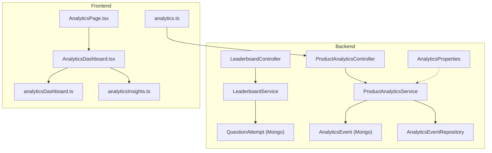
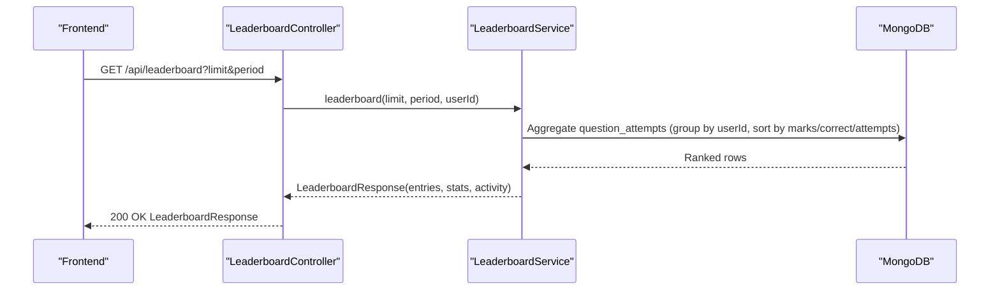
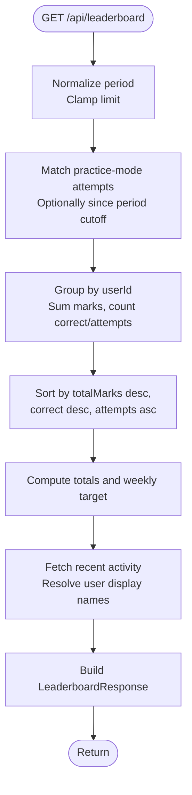
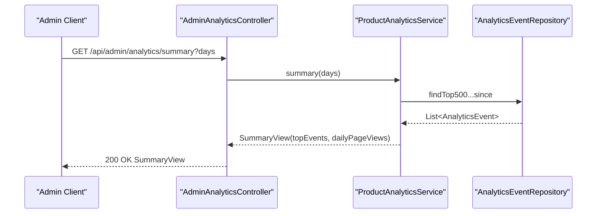
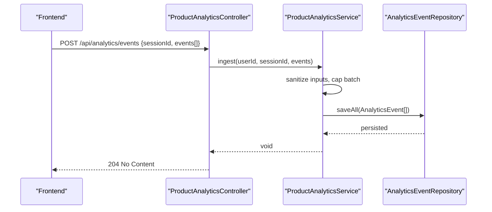
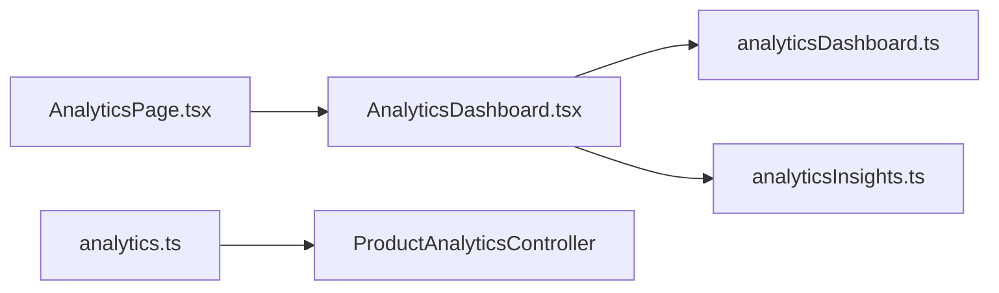
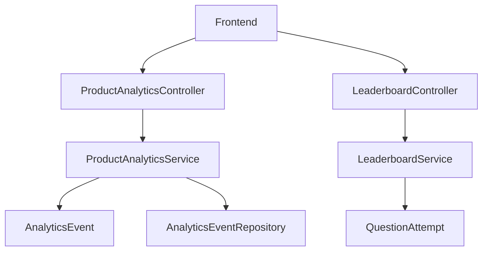
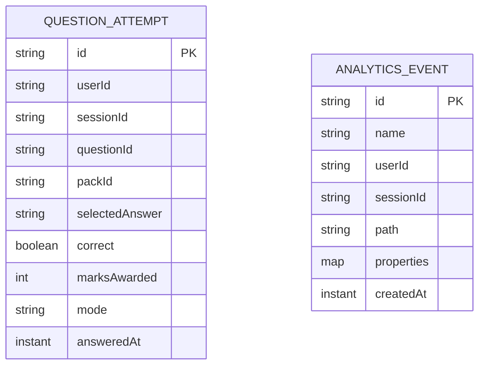

# Analytics and Leaderboard Endpoints

<cite>
**Referenced Files in This Document**
- [LeaderboardController.java](file://backend/src/main/java/com/neetlu/examhunt/web/LeaderboardController.java)
- [LeaderboardService.java](file://backend/src/main/java/com/neetlu/examhunt/service/LeaderboardService.java)
- [AdminAnalyticsController.java](file://backend/src/main/java/com/neetlu/examhunt/web/AdminAnalyticsController.java)
- [ProductAnalyticsController.java](file://backend/src/main/java/com/neetlu/examhunt/web/ProductAnalyticsController.java)
- [ProductAnalyticsService.java](file://backend/src/main/java/com/neetlu/examhunt/service/ProductAnalyticsService.java)
- [AnalyticsEvent.java](file://backend/src/main/java/com/neetlu/examhunt/model/AnalyticsEvent.java)
- [AnalyticsEventRepository.java](file://backend/src/main/java/com/neetlu/examhunt/repository/AnalyticsEventRepository.java)
- [QuestionAttempt.java](file://backend/src/main/java/com/neetlu/examhunt/model/QuestionAttempt.java)
- [AnalyticsProperties.java](file://backend/src/main/java/com/neetlu/examhunt/config/AnalyticsProperties.java)
- [AnalyticsPage.tsx](file://frontend/src/pages/AnalyticsPage.tsx)
- [AnalyticsDashboard.tsx](file://frontend/src/components/AnalyticsDashboard.tsx)
- [analyticsDashboard.ts](file://frontend/src/utils/analyticsDashboard.ts)
- [analyticsInsights.ts](file://frontend/src/utils/analyticsInsights.ts)
- [analytics.ts](file://frontend/src/analytics.ts)
</cite>

## Table of Contents
1. [Introduction](#introduction)
2. [Project Structure](#project-structure)
3. [Core Components](#core-components)
4. [Architecture Overview](#architecture-overview)
5. [Detailed Component Analysis](#detailed-component-analysis)
6. [Dependency Analysis](#dependency-analysis)
7. [Performance Considerations](#performance-considerations)
8. [Troubleshooting Guide](#troubleshooting-guide)
9. [Conclusion](#conclusion)
10. [Appendices](#appendices)

## Introduction
This document describes the analytics and leaderboard endpoints, focusing on:
- Leaderboard rankings and scoring
- Administrative analytics dashboards
- Product analytics ingestion and summaries
- Personal analytics and visualization patterns
- Ranking algorithms, performance metrics, and seasonal targets
- Examples of analytics queries and leaderboard access patterns

It consolidates backend controller endpoints, service logic, and frontend usage to help developers and product teams integrate, consume, and extend analytics and leaderboard capabilities.

## Project Structure
The analytics and leaderboard features span backend controllers/services and MongoDB models, plus frontend pages and utilities that render dashboards and trends.

**Diagram sources**
- [LeaderboardController.java:10-27](file://backend/src/main/java/com/neetlu/examhunt/web/LeaderboardController.java#L10-L27)
- [LeaderboardService.java:26-77](file://backend/src/main/java/com/neetlu/examhunt/service/LeaderboardService.java#L26-L77)
- [ProductAnalyticsController.java:15-35](file://backend/src/main/java/com/neetlu/examhunt/web/ProductAnalyticsController.java#L15-L35)
- [ProductAnalyticsService.java:19-103](file://backend/src/main/java/com/neetlu/examhunt/service/ProductAnalyticsService.java#L19-L103)
- [AnalyticsEvent.java:11-25](file://backend/src/main/java/com/neetlu/examhunt/model/AnalyticsEvent.java#L11-L25)
- [AnalyticsEventRepository.java:9-16](file://backend/src/main/java/com/neetlu/examhunt/repository/AnalyticsEventRepository.java#L9-L16)
- [AnalyticsProperties.java:5-6](file://backend/src/main/java/com/neetlu/examhunt/config/AnalyticsProperties.java#L5-L6)
- [QuestionAttempt.java:10-28](file://backend/src/main/java/com/neetlu/examhunt/model/QuestionAttempt.java#L10-L28)
- [AnalyticsPage.tsx:9-57](file://frontend/src/pages/AnalyticsPage.tsx#L9-L57)
- [AnalyticsDashboard.tsx:137-433](file://frontend/src/components/AnalyticsDashboard.tsx#L137-L433)
- [analyticsDashboard.ts:55-170](file://frontend/src/utils/analyticsDashboard.ts#L55-L170)
- [analyticsInsights.ts:19-47](file://frontend/src/utils/analyticsInsights.ts#L19-L47)
- [analytics.ts:104-156](file://frontend/src/analytics.ts#L104-L156)

**Section sources**
- [LeaderboardController.java:10-27](file://backend/src/main/java/com/neetlu/examhunt/web/LeaderboardController.java#L10-L27)
- [ProductAnalyticsController.java:15-35](file://backend/src/main/java/com/neetlu/examhunt/web/ProductAnalyticsController.java#L15-L35)
- [AnalyticsPage.tsx:9-57](file://frontend/src/pages/AnalyticsPage.tsx#L9-L57)

## Core Components
- LeaderboardController: Exposes GET /api/leaderboard with pagination and period filters.
- LeaderboardService: Computes rankings, stats, and recent activity using MongoDB aggregation on question attempts.
- ProductAnalyticsController: Accepts analytics events via POST /api/analytics/events.
- ProductAnalyticsService: Sanitizes and persists events; computes admin summary views.
- AnalyticsEvent and AnalyticsEventRepository: Data model and repository for analytics events.
- QuestionAttempt: Data model for practice/test attempts used in leaderboard calculations.
- Frontend AnalyticsDashboard and utilities: Render personal analytics, trends, and insights.

**Section sources**
- [LeaderboardController.java:10-27](file://backend/src/main/java/com/neetlu/examhunt/web/LeaderboardController.java#L10-L27)
- [LeaderboardService.java:26-77](file://backend/src/main/java/com/neetlu/examhunt/service/LeaderboardService.java#L26-L77)
- [ProductAnalyticsController.java:15-35](file://backend/src/main/java/com/neetlu/examhunt/web/ProductAnalyticsController.java#L15-L35)
- [ProductAnalyticsService.java:19-103](file://backend/src/main/java/com/neetlu/examhunt/service/ProductAnalyticsService.java#L19-L103)
- [AnalyticsEvent.java:11-25](file://backend/src/main/java/com/neetlu/examhunt/model/AnalyticsEvent.java#L11-L25)
- [AnalyticsEventRepository.java:9-16](file://backend/src/main/java/com/neetlu/examhunt/repository/AnalyticsEventRepository.java#L9-L16)
- [QuestionAttempt.java:10-28](file://backend/src/main/java/com/neetlu/examhunt/model/QuestionAttempt.java#L10-L28)
- [AnalyticsDashboard.tsx:137-433](file://frontend/src/components/AnalyticsDashboard.tsx#L137-L433)
- [analyticsDashboard.ts:55-170](file://frontend/src/utils/analyticsDashboard.ts#L55-L170)

## Architecture Overview
The system separates concerns:
- Controllers expose REST endpoints.
- Services encapsulate domain logic and data access.
- MongoDB stores analytics events and question attempts.
- Frontend renders dashboards and trends derived from backend-provided data.

**Diagram sources**
- [LeaderboardController.java:20-26](file://backend/src/main/java/com/neetlu/examhunt/web/LeaderboardController.java#L20-L26)
- [LeaderboardService.java:40-77](file://backend/src/main/java/com/neetlu/examhunt/service/LeaderboardService.java#L40-L77)

## Detailed Component Analysis

### Leaderboard Endpoints
- Endpoint: GET /api/leaderboard
- Query parameters:
  - limit: integer, default 50, clamped to 1..100
  - period: string, one of weekly, monthly, all; defaults to all
  - Authorization: requires authenticated user (userId injected)
- Response: LeaderboardResponse containing:
  - period, entries (top N), you (optional), totalPlayers, stats, recentActivity

Ranking algorithm:
- Filters attempts to practice mode (including legacy rows without mode).
- Groups by userId and aggregates:
  - totalMarks (sum of marksAwarded)
  - correct (count of correct answers)
  - attempts (count of answers)
- Sort order: totalMarks desc, correct desc, attempts asc
- Calculates accuracyPercent per player
- Computes weekly challenge target based on current marks

Scoring and display:
- weeklyChallengeTarget is computed as a bounded function of current marks
- recentActivity lists recent correct/incorrect attempts with relative timestamps

**Diagram sources**
- [LeaderboardController.java:20-26](file://backend/src/main/java/com/neetlu/examhunt/web/LeaderboardController.java#L20-L26)
- [LeaderboardService.java:40-77](file://backend/src/main/java/com/neetlu/examhunt/service/LeaderboardService.java#L40-L77)
- [LeaderboardService.java:175-224](file://backend/src/main/java/com/neetlu/examhunt/service/LeaderboardService.java#L175-L224)
- [LeaderboardService.java:117-148](file://backend/src/main/java/com/neetlu/examhunt/service/LeaderboardService.java#L117-L148)

**Section sources**
- [LeaderboardController.java:20-26](file://backend/src/main/java/com/neetlu/examhunt/web/LeaderboardController.java#L20-L26)
- [LeaderboardService.java:40-77](file://backend/src/main/java/com/neetlu/examhunt/service/LeaderboardService.java#L40-L77)
- [LeaderboardService.java:175-224](file://backend/src/main/java/com/neetlu/examhunt/service/LeaderboardService.java#L175-L224)
- [LeaderboardService.java:117-148](file://backend/src/main/java/com/neetlu/examhunt/service/LeaderboardService.java#L117-L148)

### Administrative Analytics Dashboard
- Endpoint: GET /api/admin/analytics/summary
- Query parameter:
  - days: integer, default 7, clamped to 1..90
- Response: SummaryView with:
  - sampleSize, uniqueSessions, windowDays
  - topEvents (top 12 event names by count)
  - dailyPageViews (sorted by day)

Implementation highlights:
- Aggregates recent events from the repository
- Tracks unique sessions and daily page views for “page_view” events
- Returns counts and sorted series for visualization

**Diagram sources**
- [AdminAnalyticsController.java:19-22](file://backend/src/main/java/com/neetlu/examhunt/web/AdminAnalyticsController.java#L19-L22)
- [ProductAnalyticsService.java:71-103](file://backend/src/main/java/com/neetlu/examhunt/service/ProductAnalyticsService.java#L71-L103)
- [AnalyticsEventRepository.java:15-16](file://backend/src/main/java/com/neetlu/examhunt/repository/AnalyticsEventRepository.java#L15-L16)

**Section sources**
- [AdminAnalyticsController.java:19-22](file://backend/src/main/java/com/neetlu/examhunt/web/AdminAnalyticsController.java#L19-L22)
- [ProductAnalyticsService.java:71-103](file://backend/src/main/java/com/neetlu/examhunt/service/ProductAnalyticsService.java#L71-L103)
- [AnalyticsEventRepository.java:15-16](file://backend/src/main/java/com/neetlu/examhunt/repository/AnalyticsEventRepository.java#L15-L16)

### Product Analytics Ingestion
- Endpoint: POST /api/analytics/events
- Request body: IngestBody with sessionId and events array
  - Each EventBody has name and properties map
- Behavior:
  - Sanitizes event names and properties (limits on length/count)
  - Limits batch size and discards invalid entries
  - Persists sanitized events to analytics_events collection
  - Extracts optional path property for page_view events

**Diagram sources**
- [ProductAnalyticsController.java:25-35](file://backend/src/main/java/com/neetlu/examhunt/web/ProductAnalyticsController.java#L25-L35)
- [ProductAnalyticsService.java:36-69](file://backend/src/main/java/com/neetlu/examhunt/service/ProductAnalyticsService.java#L36-L69)
- [AnalyticsEventRepository.java:9-16](file://backend/src/main/java/com/neetlu/examhunt/repository/AnalyticsEventRepository.java#L9-L16)

**Section sources**
- [ProductAnalyticsController.java:25-35](file://backend/src/main/java/com/neetlu/examhunt/web/ProductAnalyticsController.java#L25-L35)
- [ProductAnalyticsService.java:36-69](file://backend/src/main/java/com/neetlu/examhunt/service/ProductAnalyticsService.java#L36-L69)
- [AnalyticsEvent.java:11-25](file://backend/src/main/java/com/neetlu/examhunt/model/AnalyticsEvent.java#L11-L25)

### Personal Analytics and Visualization
Frontend analytics dashboard:
- AnalyticsPage.tsx orchestrates data fetching and renders AnalyticsDashboard
- AnalyticsDashboard.tsx displays:
  - Focus area and potential accuracy
  - Accuracy and questions trends over last 28 days
  - Subject gauges (Physics, Chemistry, Botany, Zoology)
  - Weak chapters table and mistakes overview
  - AI insights and recommendations
- analyticsDashboard.ts utilities:
  - Build four-subject gauges from chapter progress
  - Compute accuracy and questions trend points
  - Calculate potential accuracy based on trend
  - Segment mistakes by category
- analyticsInsights.ts:
  - Generate insight strings based on progress and sessions
  - Build weekly activity cells for heatmap visualization
- analytics.ts:
  - Initializes external analytics (GA4, Plausible, Cloudflare)
  - Enqueues and flushes events to backend

**Diagram sources**
- [AnalyticsPage.tsx:9-57](file://frontend/src/pages/AnalyticsPage.tsx#L9-L57)
- [AnalyticsDashboard.tsx:137-433](file://frontend/src/components/AnalyticsDashboard.tsx#L137-L433)
- [analyticsDashboard.ts:55-170](file://frontend/src/utils/analyticsDashboard.ts#L55-L170)
- [analyticsInsights.ts:19-47](file://frontend/src/utils/analyticsInsights.ts#L19-L47)
- [analytics.ts:104-156](file://frontend/src/analytics.ts#L104-L156)
- [ProductAnalyticsController.java:25-35](file://backend/src/main/java/com/neetlu/examhunt/web/ProductAnalyticsController.java#L25-L35)

**Section sources**
- [AnalyticsPage.tsx:9-57](file://frontend/src/pages/AnalyticsPage.tsx#L9-L57)
- [AnalyticsDashboard.tsx:137-433](file://frontend/src/components/AnalyticsDashboard.tsx#L137-L433)
- [analyticsDashboard.ts:55-170](file://frontend/src/utils/analyticsDashboard.ts#L55-L170)
- [analyticsInsights.ts:19-47](file://frontend/src/utils/analyticsInsights.ts#L19-L47)
- [analytics.ts:104-156](file://frontend/src/analytics.ts#L104-L156)

## Dependency Analysis
- Controllers depend on services.
- Services depend on repositories and models.
- Frontend depends on analytics.ts for event queuing and on backend endpoints for data.
- MongoDB collections:
  - question_attempts: used for leaderboard aggregation
  - analytics_events: used for product analytics ingestion and admin summary

**Diagram sources**
- [LeaderboardController.java:10-27](file://backend/src/main/java/com/neetlu/examhunt/web/LeaderboardController.java#L10-L27)
- [LeaderboardService.java:26-38](file://backend/src/main/java/com/neetlu/examhunt/service/LeaderboardService.java#L26-L38)
- [ProductAnalyticsController.java:15-35](file://backend/src/main/java/com/neetlu/examhunt/web/ProductAnalyticsController.java#L15-L35)
- [ProductAnalyticsService.java:19-34](file://backend/src/main/java/com/neetlu/examhunt/service/ProductAnalyticsService.java#L19-L34)
- [AnalyticsEvent.java:11-25](file://backend/src/main/java/com/neetlu/examhunt/model/AnalyticsEvent.java#L11-L25)
- [QuestionAttempt.java:10-28](file://backend/src/main/java/com/neetlu/examhunt/model/QuestionAttempt.java#L10-L28)
- [AnalyticsEventRepository.java:9-16](file://backend/src/main/java/com/neetlu/examhunt/repository/AnalyticsEventRepository.java#L9-L16)

**Section sources**
- [LeaderboardService.java:26-38](file://backend/src/main/java/com/neetlu/examhunt/service/LeaderboardService.java#L26-L38)
- [ProductAnalyticsService.java:19-34](file://backend/src/main/java/com/neetlu/examhunt/service/ProductAnalyticsService.java#L19-L34)

## Performance Considerations
- Leaderboard aggregation:
  - Uses MongoDB aggregation pipeline with match/group/sort; ensure appropriate indexes on question_attempts (compound indexes exist for user+question and user+answeredAt).
  - Limit returned entries via client-side cap and server-side clamp to reduce payload size.
- Analytics ingestion:
  - Batch limit enforced to avoid oversized writes.
  - Property limits prevent excessive storage overhead.
- Admin summary:
  - Window capped to 90 days; top 500 events retrieved to keep computation bounded.

[No sources needed since this section provides general guidance]

## Troubleshooting Guide
Common issues and resolutions:
- Leaderboard returns empty or unexpected rankings:
  - Verify attempts are in practice mode or lack mode (legacy rows treated as practice).
  - Confirm question_attempts collection has recent data.
- Analytics events not appearing in admin summary:
  - Check app.analytics.eventsEnabled flag.
  - Ensure event names and properties meet sanitization limits.
  - Confirm repository persistence is functioning.
- Frontend analytics dashboard shows placeholders:
  - Guest mode uses demo data; sign in to populate real progress.
  - Ensure analytics.ts initialization runs and events are flushed.

**Section sources**
- [LeaderboardService.java:194-201](file://backend/src/main/java/com/neetlu/examhunt/service/LeaderboardService.java#L194-L201)
- [ProductAnalyticsService.java:36-69](file://backend/src/main/java/com/neetlu/examhunt/service/ProductAnalyticsService.java#L36-L69)
- [AnalyticsProperties.java:5-6](file://backend/src/main/java/com/neetlu/examhunt/config/AnalyticsProperties.java#L5-L6)
- [AnalyticsPage.tsx:35-46](file://frontend/src/pages/AnalyticsPage.tsx#L35-L46)
- [analytics.ts:104-156](file://frontend/src/analytics.ts#L104-L156)

## Conclusion
The system provides:
- A robust leaderboard with configurable periods and capped results, driven by MongoDB aggregation on practice attempts.
- An administrative analytics summary for product insights.
- A flexible analytics ingestion endpoint with sanitization and batching.
- A comprehensive personal analytics dashboard with trends, gauges, and insights.

These components work together to support performance reporting, cohort analysis, and progress tracking while maintaining scalability and clarity.

[No sources needed since this section summarizes without analyzing specific files]

## Appendices

### API Reference

- GET /api/leaderboard
  - Description: Retrieve leaderboard rankings for a given period and limit.
  - Query parameters:
    - limit: integer, default 50, min 1, max 100
    - period: string, one of weekly, monthly, all; defaults to all
  - Response: LeaderboardResponse
    - period: string
    - entries: array of LeaderboardEntry
    - you: optional LeaderboardEntry for current user
    - totalPlayers: integer
    - stats: LeaderboardStats
    - recentActivity: array of ActivityItem

- GET /api/admin/analytics/summary
  - Description: Retrieve administrative analytics summary.
  - Query parameters:
    - days: integer, default 7, min 1, max 90
  - Response: SummaryView
    - sampleSize: long
    - uniqueSessions: long
    - windowDays: int
    - topEvents: array of EventCount
    - dailyPageViews: array of DailyCount

- POST /api/analytics/events
  - Description: Ingest analytics events for a session.
  - Body: IngestBody
    - sessionId: string
    - events: array of EventBody
      - name: string
      - properties: object
  - Response: 204 No Content

**Section sources**
- [LeaderboardController.java:20-26](file://backend/src/main/java/com/neetlu/examhunt/web/LeaderboardController.java#L20-L26)
- [AdminAnalyticsController.java:19-22](file://backend/src/main/java/com/neetlu/examhunt/web/AdminAnalyticsController.java#L19-L22)
- [ProductAnalyticsController.java:25-35](file://backend/src/main/java/com/neetlu/examhunt/web/ProductAnalyticsController.java#L25-L35)

### Data Models

**Diagram sources**
- [QuestionAttempt.java:10-28](file://backend/src/main/java/com/neetlu/examhunt/model/QuestionAttempt.java#L10-L28)
- [AnalyticsEvent.java:11-25](file://backend/src/main/java/com/neetlu/examhunt/model/AnalyticsEvent.java#L11-L25)

### Example Queries and Access Patterns

- Leaderboard access pattern:
  - Fetch top 50 for current weekly leaderboard and highlight “You”
  - Paginate by adjusting limit and re-fetching
- Personal analytics:
  - Build four-subject gauges from chapter progress
  - Compute accuracy trend points over last 28 days
  - Derive potential accuracy from current accuracy and trend delta
- Analytics ingestion:
  - Track page_view with path and title
  - Enqueue up to 20 events; flush on threshold or visibility change

**Section sources**
- [LeaderboardController.java:20-26](file://backend/src/main/java/com/neetlu/examhunt/web/LeaderboardController.java#L20-L26)
- [analyticsDashboard.ts:55-170](file://frontend/src/utils/analyticsDashboard.ts#L55-L170)
- [analytics.ts:134-156](file://frontend/src/analytics.ts#L134-L156)