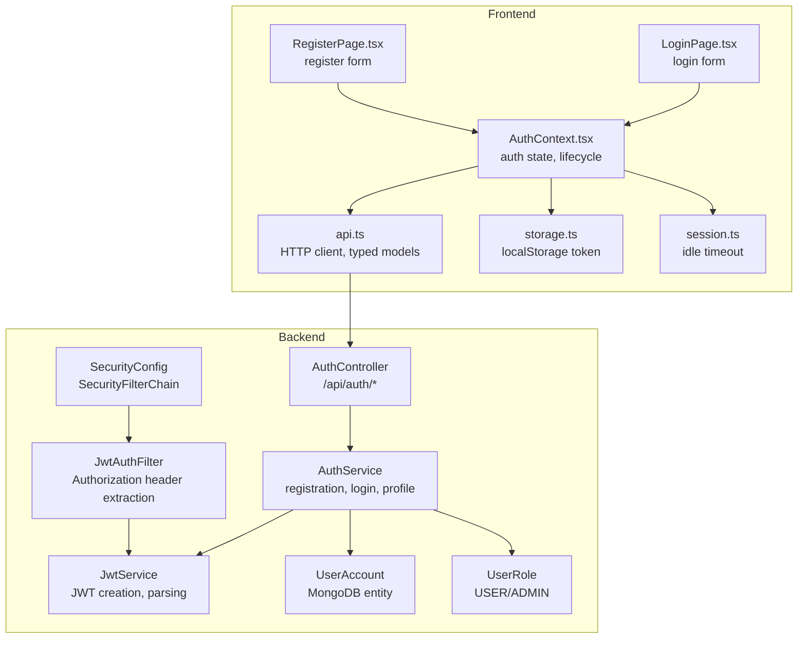
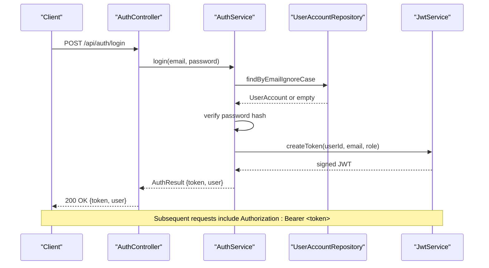
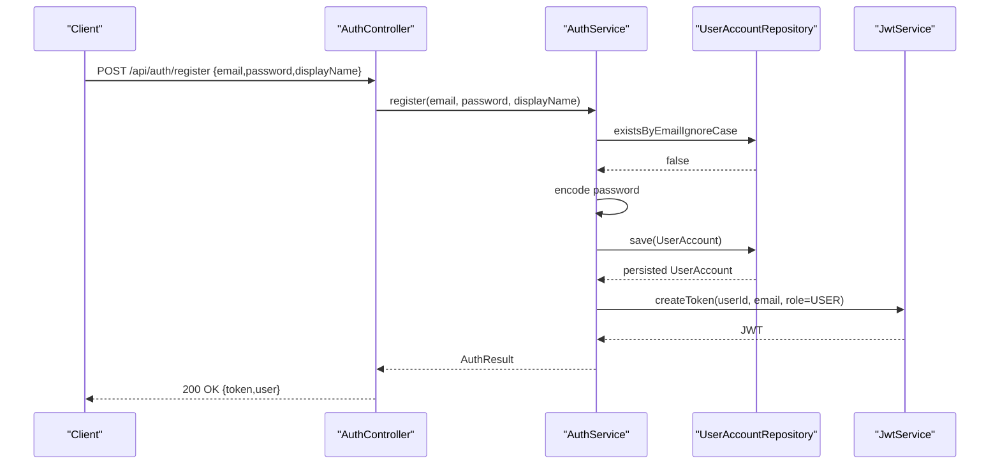
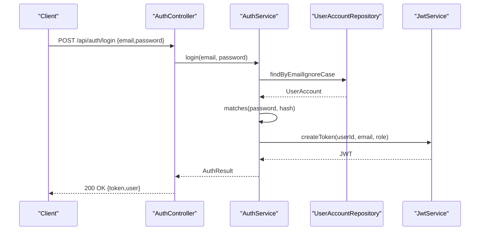
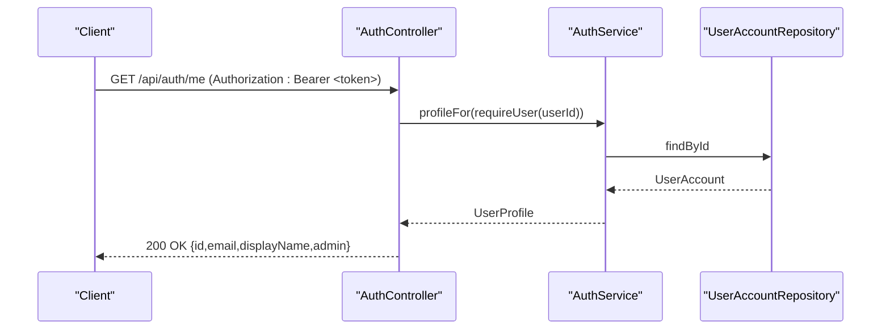
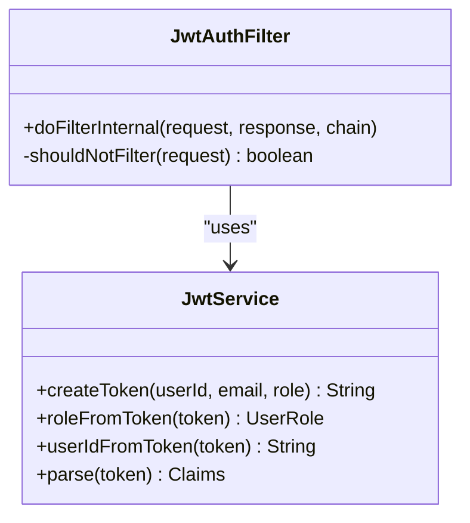
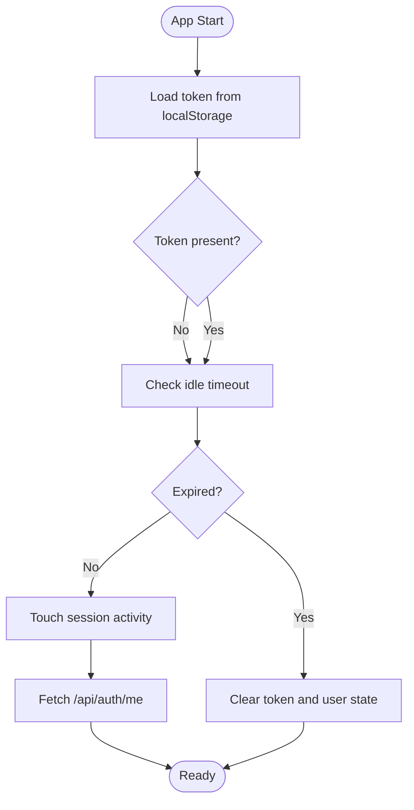
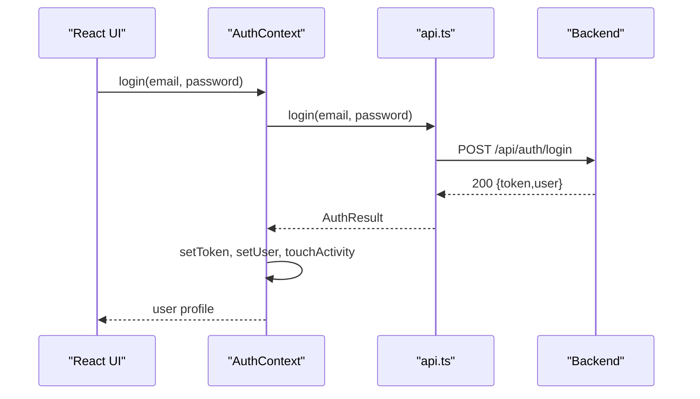
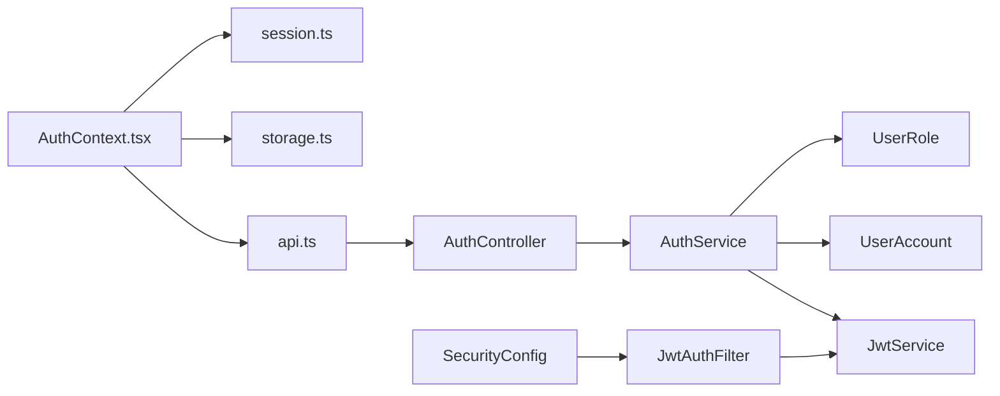

# Authentication Endpoints

<cite>
**Referenced Files in This Document**
- [AuthController.java](file://backend/src/main/java/com/neetlu/examhunt/web/AuthController.java)
- [AuthService.java](file://backend/src/main/java/com/neetlu/examhunt/service/AuthService.java)
- [JwtService.java](file://backend/src/main/java/com/neetlu/examhunt/service/JwtService.java)
- [JwtAuthFilter.java](file://backend/src/main/java/com/neetlu/examhunt/security/JwtAuthFilter.java)
- [SecurityConfig.java](file://backend/src/main/java/com/neetlu/examhunt/config/SecurityConfig.java)
- [application.yml](file://backend/src/main/resources/application.yml)
- [UserAccount.java](file://backend/src/main/java/com/neetlu/examhunt/model/UserAccount.java)
- [UserRole.java](file://backend/src/main/java/com/neetlu/examhunt/model/UserRole.java)
- [api.ts](file://frontend/src/api.ts)
- [AuthContext.tsx](file://frontend/src/auth/AuthContext.tsx)
- [storage.ts](file://frontend/src/auth/storage.ts)
- [session.ts](file://frontend/src/auth/session.ts)
- [LoginPage.tsx](file://frontend/src/pages/LoginPage.tsx)
- [RegisterPage.tsx](file://frontend/src/pages/RegisterPage.tsx)
</cite>

## Table of Contents
1. [Introduction](#introduction)
2. [Project Structure](#project-structure)
3. [Core Components](#core-components)
4. [Architecture Overview](#architecture-overview)
5. [Detailed Component Analysis](#detailed-component-analysis)
6. [Dependency Analysis](#dependency-analysis)
7. [Performance Considerations](#performance-considerations)
8. [Troubleshooting Guide](#troubleshooting-guide)
9. [Conclusion](#conclusion)
10. [Appendices](#appendices)

## Introduction
This document provides comprehensive API documentation for the authentication endpoints: register, login, and profile retrieval. It covers request and response schemas, JWT token handling, session management, authentication flow, and security considerations. It also includes client-side implementation guidelines for handling authentication state and protecting authenticated routes.

## Project Structure
The authentication system spans backend Spring Boot controllers and services, JWT processing, and frontend React context and utilities.

**Diagram sources**
- [AuthController.java:1-45](file://backend/src/main/java/com/neetlu/examhunt/web/AuthController.java#L1-L45)
- [AuthService.java:1-106](file://backend/src/main/java/com/neetlu/examhunt/service/AuthService.java#L1-L106)
- [JwtService.java:1-63](file://backend/src/main/java/com/neetlu/examhunt/service/JwtService.java#L1-L63)
- [JwtAuthFilter.java:1-59](file://backend/src/main/java/com/neetlu/examhunt/security/JwtAuthFilter.java#L1-L59)
- [SecurityConfig.java:1-76](file://backend/src/main/java/com/neetlu/examhunt/config/SecurityConfig.java#L1-L76)
- [UserAccount.java:1-71](file://backend/src/main/java/com/neetlu/examhunt/model/UserAccount.java#L1-L71)
- [UserRole.java:1-7](file://backend/src/main/java/com/neetlu/examhunt/model/UserRole.java#L1-L7)
- [api.ts:558-574](file://frontend/src/api.ts#L558-L574)
- [AuthContext.tsx:1-183](file://frontend/src/auth/AuthContext.tsx#L1-L183)
- [storage.ts:1-30](file://frontend/src/auth/storage.ts#L1-L30)
- [session.ts:1-37](file://frontend/src/auth/session.ts#L1-L37)
- [LoginPage.tsx:1-93](file://frontend/src/pages/LoginPage.tsx#L1-L93)
- [RegisterPage.tsx:1-97](file://frontend/src/pages/RegisterPage.tsx#L1-L97)

**Section sources**
- [AuthController.java:1-45](file://backend/src/main/java/com/neetlu/examhunt/web/AuthController.java#L1-L45)
- [AuthService.java:1-106](file://backend/src/main/java/com/neetlu/examhunt/service/AuthService.java#L1-L106)
- [JwtService.java:1-63](file://backend/src/main/java/com/neetlu/examhunt/service/JwtService.java#L1-L63)
- [JwtAuthFilter.java:1-59](file://backend/src/main/java/com/neetlu/examhunt/security/JwtAuthFilter.java#L1-L59)
- [SecurityConfig.java:1-76](file://backend/src/main/java/com/neetlu/examhunt/config/SecurityConfig.java#L1-L76)
- [application.yml:1-44](file://backend/src/main/resources/application.yml#L1-L44)
- [UserAccount.java:1-71](file://backend/src/main/java/com/neetlu/examhunt/model/UserAccount.java#L1-L71)
- [UserRole.java:1-7](file://backend/src/main/java/com/neetlu/examhunt/model/UserRole.java#L1-L7)
- [api.ts:558-574](file://frontend/src/api.ts#L558-L574)
- [AuthContext.tsx:1-183](file://frontend/src/auth/AuthContext.tsx#L1-L183)
- [storage.ts:1-30](file://frontend/src/auth/storage.ts#L1-L30)
- [session.ts:1-37](file://frontend/src/auth/session.ts#L1-L37)
- [LoginPage.tsx:1-93](file://frontend/src/pages/LoginPage.tsx#L1-L93)
- [RegisterPage.tsx:1-97](file://frontend/src/pages/RegisterPage.tsx#L1-L97)

## Core Components
- Backend endpoints:
  - POST /api/auth/register: Creates a new user account and returns a JWT token plus user profile.
  - POST /api/auth/login: Authenticates credentials and returns a JWT token plus user profile.
  - GET /api/auth/me: Returns the authenticated user’s profile.
- Frontend client:
  - Typed models for AuthResult and UserProfile.
  - HTTP client that injects Authorization: Bearer token automatically.
  - AuthContext manages login/register/logout, idle timeout, and profile refresh.

**Section sources**
- [AuthController.java:23-36](file://backend/src/main/java/com/neetlu/examhunt/web/AuthController.java#L23-L36)
- [api.ts:102-114](file://frontend/src/api.ts#L102-L114)
- [AuthContext.tsx:23-33](file://frontend/src/auth/AuthContext.tsx#L23-L33)

## Architecture Overview
High-level authentication flow:
- Clients send credentials to /api/auth/login or /api/auth/register.
- Backend validates inputs, checks credentials, and issues a signed JWT via JwtService.
- Frontend stores the token and attaches it to subsequent requests.
- JwtAuthFilter extracts the token from Authorization header and populates Spring Security context.
- SecurityConfig enforces stateless sessions and route-level authorization.

**Diagram sources**
- [AuthController.java:28-31](file://backend/src/main/java/com/neetlu/examhunt/web/AuthController.java#L28-L31)
- [AuthService.java:52-60](file://backend/src/main/java/com/neetlu/examhunt/service/AuthService.java#L52-L60)
- [JwtService.java:26-37](file://backend/src/main/java/com/neetlu/examhunt/service/JwtService.java#L26-L37)
- [api.ts:435-439](file://frontend/src/api.ts#L435-L439)

**Section sources**
- [SecurityConfig.java:42-72](file://backend/src/main/java/com/neetlu/examhunt/config/SecurityConfig.java#L42-L72)
- [JwtAuthFilter.java:30-57](file://backend/src/main/java/com/neetlu/examhunt/security/JwtAuthFilter.java#L30-L57)
- [application.yml:20-21](file://backend/src/main/resources/application.yml#L20-L21)

## Detailed Component Analysis

### Endpoints

#### POST /api/auth/register
- Purpose: Create a new user account.
- Request body:
  - email: string, required, valid email format
  - password: string, required, minimum length 6
  - displayName: string, optional
- Response body:
  - token: string (JWT)
  - user: object
    - id: string
    - email: string
    - displayName: string
    - admin: boolean
- Typical success response: 200 OK with AuthResult
- Typical errors:
  - 400 Bad Request: invalid email, admin email attempted, password too short
  - 409 Conflict: email already registered

**Diagram sources**
- [AuthController.java:23-26](file://backend/src/main/java/com/neetlu/examhunt/web/AuthController.java#L23-L26)
- [AuthService.java:31-50](file://backend/src/main/java/com/neetlu/examhunt/service/AuthService.java#L31-L50)
- [JwtService.java:26-37](file://backend/src/main/java/com/neetlu/examhunt/service/JwtService.java#L26-L37)

**Section sources**
- [AuthController.java:23-43](file://backend/src/main/java/com/neetlu/examhunt/web/AuthController.java#L23-L43)
- [AuthService.java:31-50](file://backend/src/main/java/com/neetlu/examhunt/service/AuthService.java#L31-L50)
- [application.yml:20-21](file://backend/src/main/resources/application.yml#L20-L21)

#### POST /api/auth/login
- Purpose: Authenticate existing user and issue JWT.
- Request body:
  - email: string, required, valid email format
  - password: string, required
- Response body:
  - token: string (JWT)
  - user: object
    - id: string
    - email: string
    - displayName: string
    - admin: boolean
- Typical success response: 200 OK with AuthResult
- Typical errors:
  - 401 Unauthorized: invalid credentials

**Diagram sources**
- [AuthController.java:28-31](file://backend/src/main/java/com/neetlu/examhunt/web/AuthController.java#L28-L31)
- [AuthService.java:52-60](file://backend/src/main/java/com/neetlu/examhunt/service/AuthService.java#L52-L60)
- [JwtService.java:26-37](file://backend/src/main/java/com/neetlu/examhunt/service/JwtService.java#L26-L37)

**Section sources**
- [AuthController.java:28-43](file://backend/src/main/java/com/neetlu/examhunt/web/AuthController.java#L28-L43)
- [AuthService.java:52-60](file://backend/src/main/java/com/neetlu/examhunt/service/AuthService.java#L52-L60)

#### GET /api/auth/me
- Purpose: Retrieve authenticated user profile.
- Authentication: Requires valid Bearer token.
- Response body:
  - id: string
  - email: string
  - displayName: string
  - admin: boolean
- Typical success response: 200 OK with UserProfile
- Typical errors:
  - 401 Unauthorized: missing or invalid token
  - 404 Not Found: user not found

**Diagram sources**
- [AuthController.java:33-36](file://backend/src/main/java/com/neetlu/examhunt/web/AuthController.java#L33-L36)
- [AuthService.java:62-75](file://backend/src/main/java/com/neetlu/examhunt/service/AuthService.java#L62-L75)

**Section sources**
- [AuthController.java:33-36](file://backend/src/main/java/com/neetlu/examhunt/web/AuthController.java#L33-L36)
- [AuthService.java:62-75](file://backend/src/main/java/com/neetlu/examhunt/service/AuthService.java#L62-L75)

### JWT Token Handling and Validation

- Token structure:
  - Subject: user ID
  - Claims: email, role
  - Issued at and expiration derived from app configuration
- Expiration:
  - Controlled by jwt-expiration-hours property (default 168 hours)
- Validation:
  - JwtAuthFilter extracts Authorization header, verifies signature, and sets Spring Security context
  - JwtService parses claims and extracts user ID and role

**Diagram sources**
- [JwtService.java:15-63](file://backend/src/main/java/com/neetlu/examhunt/service/JwtService.java#L15-L63)
- [JwtAuthFilter.java:21-59](file://backend/src/main/java/com/neetlu/examhunt/security/JwtAuthFilter.java#L21-L59)

**Section sources**
- [JwtService.java:26-61](file://backend/src/main/java/com/neetlu/examhunt/service/JwtService.java#L26-L61)
- [JwtAuthFilter.java:38-57](file://backend/src/main/java/com/neetlu/examhunt/security/JwtAuthFilter.java#L38-L57)
- [application.yml:20-21](file://backend/src/main/resources/application.yml#L20-L21)

### Session Management and Idle Timeout

- Frontend session lifecycle:
  - On login/register, token is stored in localStorage and session activity is touched
  - Periodic idle check clears session if inactive beyond threshold
  - Refresh routine fetches /api/auth/me to keep session alive
- Idle timeout:
  - Default 30 minutes of inactivity
  - Activity events reset the idle timer

**Diagram sources**
- [AuthContext.tsx:77-97](file://frontend/src/auth/AuthContext.tsx#L77-L97)
- [session.ts:26-36](file://frontend/src/auth/session.ts#L26-L36)
- [storage.ts:1-30](file://frontend/src/auth/storage.ts#L1-L30)

**Section sources**
- [AuthContext.tsx:45-97](file://frontend/src/auth/AuthContext.tsx#L45-L97)
- [session.ts:1-37](file://frontend/src/auth/session.ts#L1-L37)
- [storage.ts:1-30](file://frontend/src/auth/storage.ts#L1-L30)

### Client Implementation Guidelines

- Authorization header:
  - Automatically added to all requests if a token exists
- Handling responses:
  - On success, update auth state and analytics user
  - On failure, surface user-friendly messages
- Protecting routes:
  - Use route guards to redirect unauthenticated users
  - For authenticated-only routes, ensure Authorization header presence

**Diagram sources**
- [AuthContext.tsx:132-144](file://frontend/src/auth/AuthContext.tsx#L132-L144)
- [api.ts:565-570](file://frontend/src/api.ts#L565-L570)

**Section sources**
- [api.ts:435-439](file://frontend/src/api.ts#L435-L439)
- [AuthContext.tsx:132-157](file://frontend/src/auth/AuthContext.tsx#L132-L157)
- [LoginPage.tsx:14-34](file://frontend/src/pages/LoginPage.tsx#L14-L34)
- [RegisterPage.tsx:12-29](file://frontend/src/pages/RegisterPage.tsx#L12-L29)

## Dependency Analysis

**Diagram sources**
- [AuthController.java:1-45](file://backend/src/main/java/com/neetlu/examhunt/web/AuthController.java#L1-L45)
- [AuthService.java:1-106](file://backend/src/main/java/com/neetlu/examhunt/service/AuthService.java#L1-L106)
- [JwtService.java:1-63](file://backend/src/main/java/com/neetlu/examhunt/service/JwtService.java#L1-L63)
- [JwtAuthFilter.java:1-59](file://backend/src/main/java/com/neetlu/examhunt/security/JwtAuthFilter.java#L1-L59)
- [SecurityConfig.java:1-76](file://backend/src/main/java/com/neetlu/examhunt/config/SecurityConfig.java#L1-L76)
- [UserAccount.java:1-71](file://backend/src/main/java/com/neetlu/examhunt/model/UserAccount.java#L1-L71)
- [UserRole.java:1-7](file://backend/src/main/java/com/neetlu/examhunt/model/UserRole.java#L1-L7)
- [api.ts:558-574](file://frontend/src/api.ts#L558-L574)
- [AuthContext.tsx:1-183](file://frontend/src/auth/AuthContext.tsx#L1-L183)
- [storage.ts:1-30](file://frontend/src/auth/storage.ts#L1-L30)
- [session.ts:1-37](file://frontend/src/auth/session.ts#L1-L37)

**Section sources**
- [SecurityConfig.java:42-72](file://backend/src/main/java/com/neetlu/examhunt/config/SecurityConfig.java#L42-L72)
- [JwtAuthFilter.java:30-57](file://backend/src/main/java/com/neetlu/examhunt/security/JwtAuthFilter.java#L30-L57)

## Performance Considerations
- Stateless design: No server-side session storage reduces scaling overhead.
- Token signing and verification are lightweight; ensure jwt-expiration-hours aligns with expected usage patterns.
- Frontend caching of GET requests minimizes redundant network calls.

[No sources needed since this section provides general guidance]

## Troubleshooting Guide
- Common backend errors:
  - 400 Bad Request: invalid email format, admin email attempted for user registration, password too short
  - 401 Unauthorized: invalid credentials or invalid/expired token
  - 409 Conflict: email already registered
- Frontend error handling:
  - api.ts surfaces user-friendly messages for HTTP errors and timeouts
  - Idle timeout triggers automatic logout

**Section sources**
- [AuthService.java:31-60](file://backend/src/main/java/com/neetlu/examhunt/service/AuthService.java#L31-L60)
- [api.ts:465-479](file://frontend/src/api.ts#L465-L479)
- [AuthContext.tsx:118-130](file://frontend/src/auth/AuthContext.tsx#L118-L130)

## Conclusion
The authentication system provides secure, stateless login and registration with robust JWT handling and frontend session management. Clients attach the Bearer token to all authenticated requests, enabling protected routes and personalized experiences.

[No sources needed since this section summarizes without analyzing specific files]

## Appendices

### Endpoint Reference

- POST /api/auth/register
  - Request: { email, password, displayName? }
  - Response: { token, user: { id, email, displayName, admin } }
  - Errors: 400, 409

- POST /api/auth/login
  - Request: { email, password }
  - Response: { token, user: { id, email, displayName, admin } }
  - Errors: 401

- GET /api/auth/me
  - Response: { id, email, displayName, admin }
  - Errors: 401, 404

**Section sources**
- [AuthController.java:23-36](file://backend/src/main/java/com/neetlu/examhunt/web/AuthController.java#L23-L36)
- [AuthService.java:69-75](file://backend/src/main/java/com/neetlu/examhunt/service/AuthService.java#L69-L75)
- [api.ts:102-114](file://frontend/src/api.ts#L102-L114)

### JWT Claims and Expiration
- Claims: sub (user ID), email, role
- Expiration: jwt-expiration-hours (default 168)

**Section sources**
- [JwtService.java:26-37](file://backend/src/main/java/com/neetlu/examhunt/service/JwtService.java#L26-L37)
- [application.yml:20-21](file://backend/src/main/resources/application.yml#L20-L21)