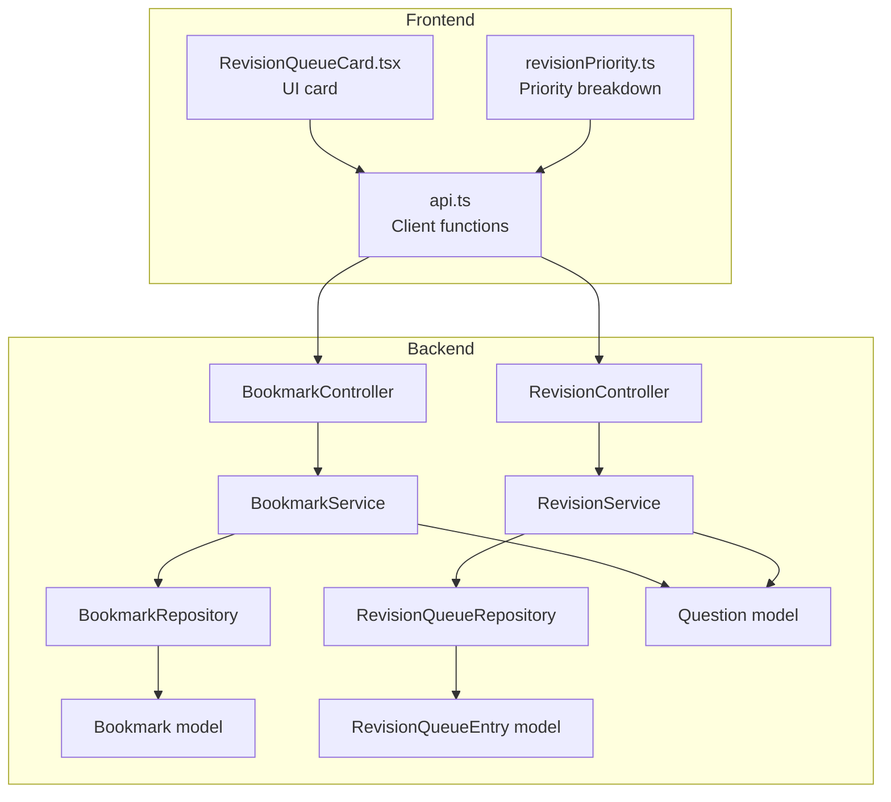
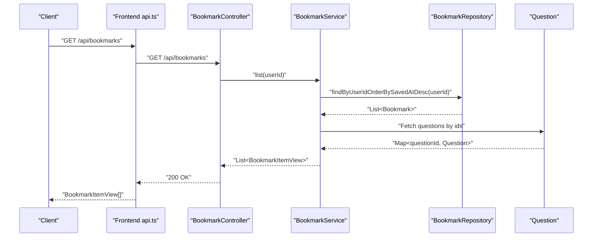
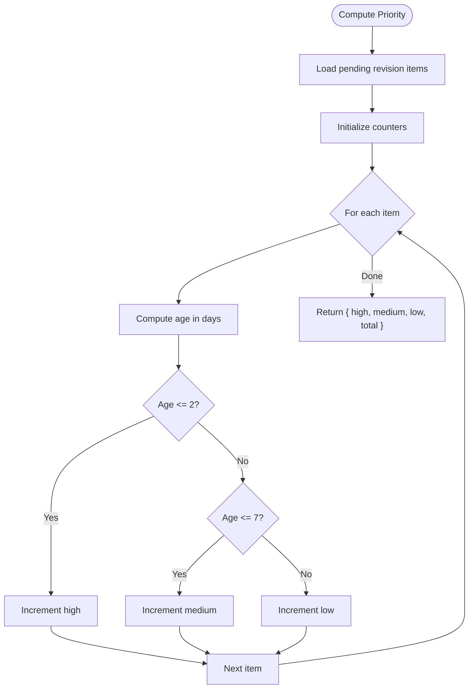
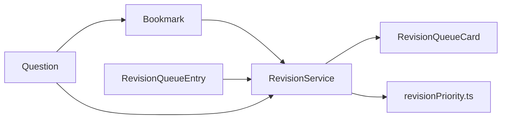
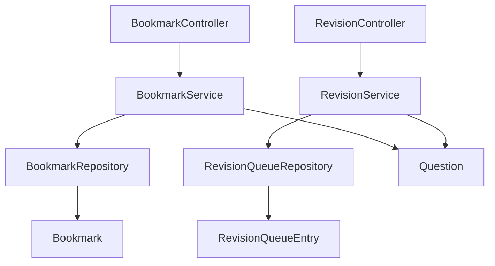

# Bookmark and Revision Endpoints

<cite>
**Referenced Files in This Document**
- [BookmarkController.java](file://backend/src/main/java/com/neetlu/examhunt/web/BookmarkController.java)
- [RevisionController.java](file://backend/src/main/java/com/neetlu/examhunt/web/RevisionController.java)
- [BookmarkService.java](file://backend/src/main/java/com/neetlu/examhunt/service/BookmarkService.java)
- [RevisionService.java](file://backend/src/main/java/com/neetlu/examhunt/service/RevisionService.java)
- [Bookmark.java](file://backend/src/main/java/com/neetlu/examhunt/model/Bookmark.java)
- [RevisionQueueEntry.java](file://backend/src/main/java/com/neetlu/examhunt/model/RevisionQueueEntry.java)
- [BookmarkRepository.java](file://backend/src/main/java/com/neetlu/examhunt/repository/BookmarkRepository.java)
- [RevisionQueueRepository.java](file://backend/src/main/java/com/neetlu/examhunt/repository/RevisionQueueRepository.java)
- [Question.java](file://backend/src/main/java/com/neetlu/examhunt/model/Question.java)
- [api.ts](file://frontend/src/api.ts)
- [revisionPriority.ts](file://frontend/src/utils/revisionPriority.ts)
- [RevisionQueueCard.tsx](file://frontend/src/components/RevisionQueueCard.tsx)
</cite>

## Table of Contents
1. [Introduction](#introduction)
2. [Project Structure](#project-structure)
3. [Core Components](#core-components)
4. [Architecture Overview](#architecture-overview)
5. [Detailed Component Analysis](#detailed-component-analysis)
6. [Dependency Analysis](#dependency-analysis)
7. [Performance Considerations](#performance-considerations)
8. [Troubleshooting Guide](#troubleshooting-guide)
9. [Conclusion](#conclusion)
10. [Appendices](#appendices)

## Introduction
This document describes the bookmark and revision endpoints used to manage user bookmarks and revision queues. It covers:
- Endpoints for adding/removing bookmarks and retrieving bookmarked questions
- Endpoints for managing revision queues (adding questions, marking revised/pending)
- Data structures for bookmarks and revision queue entries
- Revision prioritization logic and study tracking features
- Examples of typical workflows for bookmark operations, revision queue management, and study planning

## Project Structure
The backend exposes REST endpoints via controllers that delegate to services. Services interact with repositories backed by MongoDB collections. Frontend utilities consume these endpoints and provide UI components for revision prioritization and queue cards.

**Diagram sources**
- [BookmarkController.java:17-61](file://backend/src/main/java/com/neetlu/examhunt/web/BookmarkController.java#L17-L61)
- [RevisionController.java:14-55](file://backend/src/main/java/com/neetlu/examhunt/web/RevisionController.java#L14-L55)
- [BookmarkService.java:20-170](file://backend/src/main/java/com/neetlu/examhunt/service/BookmarkService.java#L20-L170)
- [RevisionService.java:19-207](file://backend/src/main/java/com/neetlu/examhunt/service/RevisionService.java#L19-L207)
- [BookmarkRepository.java:10-21](file://backend/src/main/java/com/neetlu/examhunt/repository/BookmarkRepository.java#L10-L21)
- [RevisionQueueRepository.java:9-21](file://backend/src/main/java/com/neetlu/examhunt/repository/RevisionQueueRepository.java#L9-L21)
- [Bookmark.java:9-68](file://backend/src/main/java/com/neetlu/examhunt/model/Bookmark.java#L9-L68)
- [RevisionQueueEntry.java:8-98](file://backend/src/main/java/com/neetlu/examhunt/model/RevisionQueueEntry.java#L8-L98)
- [Question.java:12-412](file://backend/src/main/java/com/neetlu/examhunt/model/Question.java#L12-L412)
- [api.ts:1100-1124](file://frontend/src/api.ts#L1100-L1124)
- [api.ts:809-840](file://frontend/src/api.ts#L809-L840)
- [revisionPriority.ts:10-25](file://frontend/src/utils/revisionPriority.ts#L10-L25)
- [RevisionQueueCard.tsx:6-35](file://frontend/src/components/RevisionQueueCard.tsx#L6-L35)

**Section sources**
- [BookmarkController.java:17-61](file://backend/src/main/java/com/neetlu/examhunt/web/BookmarkController.java#L17-L61)
- [RevisionController.java:14-55](file://backend/src/main/java/com/neetlu/examhunt/web/RevisionController.java#L14-L55)
- [BookmarkService.java:20-170](file://backend/src/main/java/com/neetlu/examhunt/service/BookmarkService.java#L20-L170)
- [RevisionService.java:19-207](file://backend/src/main/java/com/neetlu/examhunt/service/RevisionService.java#L19-L207)
- [BookmarkRepository.java:10-21](file://backend/src/main/java/com/neetlu/examhunt/repository/BookmarkRepository.java#L10-L21)
- [RevisionQueueRepository.java:9-21](file://backend/src/main/java/com/neetlu/examhunt/repository/RevisionQueueRepository.java#L9-L21)
- [Bookmark.java:9-68](file://backend/src/main/java/com/neetlu/examhunt/model/Bookmark.java#L9-L68)
- [RevisionQueueEntry.java:8-98](file://backend/src/main/java/com/neetlu/examhunt/model/RevisionQueueEntry.java#L8-L98)
- [Question.java:12-412](file://backend/src/main/java/com/neetlu/examhunt/model/Question.java#L12-L412)
- [api.ts:1100-1124](file://frontend/src/api.ts#L1100-L1124)
- [api.ts:809-840](file://frontend/src/api.ts#L809-L840)
- [revisionPriority.ts:10-25](file://frontend/src/utils/revisionPriority.ts#L10-L25)
- [RevisionQueueCard.tsx:6-35](file://frontend/src/components/RevisionQueueCard.tsx#L6-L35)

## Core Components
- BookmarkController: Exposes endpoints for listing bookmarks, checking bookmark status, toggling bookmarks, and batch status checks.
- RevisionController: Exposes endpoints for revision summary, queue listing, adding to queue, and marking items revised/pending.
- BookmarkService: Implements bookmark operations, status checks, batch status, and list building with question metadata.
- RevisionService: Implements revision queue operations, summary computation, and integration with practice sessions.
- Models and Repositories: Define persistence structures and provide CRUD-like operations for bookmarks and revision queue entries.

**Section sources**
- [BookmarkController.java:17-61](file://backend/src/main/java/com/neetlu/examhunt/web/BookmarkController.java#L17-L61)
- [RevisionController.java:14-55](file://backend/src/main/java/com/neetlu/examhunt/web/RevisionController.java#L14-L55)
- [BookmarkService.java:20-170](file://backend/src/main/java/com/neetlu/examhunt/service/BookmarkService.java#L20-L170)
- [RevisionService.java:19-207](file://backend/src/main/java/com/neetlu/examhunt/service/RevisionService.java#L19-L207)
- [Bookmark.java:9-68](file://backend/src/main/java/com/neetlu/examhunt/model/Bookmark.java#L9-L68)
- [RevisionQueueEntry.java:8-98](file://backend/src/main/java/com/neetlu/examhunt/model/RevisionQueueEntry.java#L8-L98)
- [BookmarkRepository.java:10-21](file://backend/src/main/java/com/neetlu/examhunt/repository/BookmarkRepository.java#L10-L21)
- [RevisionQueueRepository.java:9-21](file://backend/src/main/java/com/neetlu/examhunt/repository/RevisionQueueRepository.java#L9-L21)

## Architecture Overview
The endpoint architecture follows a layered pattern:
- Controllers handle HTTP requests and responses
- Services encapsulate business logic and orchestrate repository interactions
- Repositories abstract MongoDB operations
- Models define persisted entities and indexes

**Diagram sources**
- [BookmarkController.java:27-30](file://backend/src/main/java/com/neetlu/examhunt/web/BookmarkController.java#L27-L30)
- [BookmarkService.java:92-119](file://backend/src/main/java/com/neetlu/examhunt/service/BookmarkService.java#L92-L119)
- [BookmarkRepository.java:16-16](file://backend/src/main/java/com/neetlu/examhunt/repository/BookmarkRepository.java#L16-L16)
- [Question.java:12-412](file://backend/src/main/java/com/neetlu/examhunt/model/Question.java#L12-L412)
- [api.ts:1100-1102](file://frontend/src/api.ts#L1100-L1102)

**Section sources**
- [BookmarkController.java:27-30](file://backend/src/main/java/com/neetlu/examhunt/web/BookmarkController.java#L27-L30)
- [BookmarkService.java:92-119](file://backend/src/main/java/com/neetlu/examhunt/service/BookmarkService.java#L92-L119)
- [BookmarkRepository.java:16-16](file://backend/src/main/java/com/neetlu/examhunt/repository/BookmarkRepository.java#L16-L16)
- [Question.java:12-412](file://backend/src/main/java/com/neetlu/examhunt/model/Question.java#L12-L412)
- [api.ts:1100-1102](file://frontend/src/api.ts#L1100-L1102)

## Detailed Component Analysis

### Bookmark Endpoints
- GET /api/bookmarks
  - Returns the user’s bookmarked questions with associated metadata.
  - Response shape: array of BookmarkItemView.
- GET /api/bookmarks/{questionId}/status
  - Returns whether a specific question is bookmarked by the user.
  - Response shape: { questionId, saved }.
- GET /api/bookmarks/batch-status
  - Batch checks bookmark status for multiple question IDs.
  - Query param: ids (comma-separated).
  - Response shape: Record<string, boolean>.
- POST /api/bookmarks/{questionId}/toggle
  - Adds or removes a bookmark; optional note can be included.
  - Request body: { note?: string }.
  - Response shape: { questionId, saved, note, totalBookmarks }.

Data model: Bookmark
- Fields: id, userId, questionId, packId, note, savedAt.
- Indexes: compound index on (userId, questionId) unique.

Related service logic:
- toggle(userId, questionId, note): Upserts bookmark, sets packId from question, trims note, tracks total count.
- status(userId, questionId): Checks existence for a single question.
- batchStatus(userId, questionIds): Efficient batch lookup using repository findByUserIdAndQuestionIdIn.
- list(userId): Fetches bookmarks ordered by savedAt desc and enriches with question metadata.

**Section sources**
- [BookmarkController.java:27-60](file://backend/src/main/java/com/neetlu/examhunt/web/BookmarkController.java#L27-L60)
- [BookmarkService.java:36-119](file://backend/src/main/java/com/neetlu/examhunt/service/BookmarkService.java#L36-L119)
- [Bookmark.java:9-68](file://backend/src/main/java/com/neetlu/examhunt/model/Bookmark.java#L9-L68)
- [BookmarkRepository.java:10-21](file://backend/src/main/java/com/neetlu/examhunt/repository/BookmarkRepository.java#L10-L21)
- [Question.java:12-412](file://backend/src/main/java/com/neetlu/examhunt/model/Question.java#L12-L412)
- [api.ts:1100-1124](file://frontend/src/api.ts#L1100-L1124)

### Revision Endpoints
- GET /api/revision/summary
  - Returns revision summary: { pending, revised }.
- GET /api/revision/queue
  - Returns revision queue items for the user.
  - Query param: status ("pending" | "revised" | omitted for all).
  - Response shape: RevisionItemView[].
- POST /api/revision/add
  - Adds a question to the revision queue; supports source, wrongAttemptId, sessionId.
  - Request body: { questionId, source?, wrongAttemptId?, sessionId? }.
  - Response shape: RevisionItemView.
- POST /api/revision/{questionId}/mark-revised
  - Marks a queued question as revised (sets revisedAt).
- POST /api/revision/{questionId}/mark-pending
  - Reverts a revised question back to pending (clears revisedAt).

Data model: RevisionQueueEntry
- Fields: id, userId, questionId, packId, source, wrongAttemptId, sessionId, addedAt, revisedAt.
- Indexes: compound index on (userId, questionId) unique.
- Utility: isPending() returns true when revisedAt is null.

Related service logic:
- summary(userId): Counts pending and revised entries.
- list(userId, status): Filters by status and enriches with question metadata.
- add(userId, questionId, source, wrongAttemptId, sessionId): Upserts queue entry, sets packId and source, clears revisedAt if newly created.
- markRevised/markedPending: Updates timestamps and returns enriched view.
- enqueueWrongAttemptsForSession(userId, sessionId): Bulk enqueues wrong answers from a session with source "wrong".

**Section sources**
- [RevisionController.java:24-54](file://backend/src/main/java/com/neetlu/examhunt/web/RevisionController.java#L24-L54)
- [RevisionService.java:35-171](file://backend/src/main/java/com/neetlu/examhunt/service/RevisionService.java#L35-L171)
- [RevisionQueueEntry.java:8-98](file://backend/src/main/java/com/neetlu/examhunt/model/RevisionQueueEntry.java#L8-L98)
- [RevisionQueueRepository.java:9-21](file://backend/src/main/java/com/neetlu/examhunt/repository/RevisionQueueRepository.java#L9-L21)
- [Question.java:12-412](file://backend/src/main/java/com/neetlu/examhunt/model/Question.java#L12-L412)
- [api.ts:809-840](file://frontend/src/api.ts#L809-L840)

### Revision Priority and Study Tracking
Frontend utilities compute priority buckets for pending revision items based on recency:
- High: added within 2 days
- Medium: added within 7 days
- Low: older than 7 days
- Total: count of pending items

**Diagram sources**
- [revisionPriority.ts:10-25](file://frontend/src/utils/revisionPriority.ts#L10-L25)

**Section sources**
- [revisionPriority.ts:10-25](file://frontend/src/utils/revisionPriority.ts#L10-L25)
- [RevisionService.java:41-61](file://backend/src/main/java/com/neetlu/examhunt/service/RevisionService.java#L41-L61)

### Relationship Between Bookmarks, Revision Queue, and Progress
- Bookmarks capture user interest and can be leveraged for targeted revision suggestions.
- Revision queue captures actionable items derived from practice sessions (wrong answers) and manual additions.
- Progress tracking integrates with revision queue visibility (pending count) and UI cards to encourage study.

**Diagram sources**
- [BookmarkService.java:92-119](file://backend/src/main/java/com/neetlu/examhunt/service/BookmarkService.java#L92-L119)
- [RevisionService.java:133-171](file://backend/src/main/java/com/neetlu/examhunt/service/RevisionService.java#L133-L171)
- [RevisionQueueCard.tsx:6-35](file://frontend/src/components/RevisionQueueCard.tsx#L6-L35)
- [revisionPriority.ts:10-25](file://frontend/src/utils/revisionPriority.ts#L10-L25)

**Section sources**
- [BookmarkService.java:92-119](file://backend/src/main/java/com/neetlu/examhunt/service/BookmarkService.java#L92-L119)
- [RevisionService.java:133-171](file://backend/src/main/java/com/neetlu/examhunt/service/RevisionService.java#L133-L171)
- [RevisionQueueCard.tsx:6-35](file://frontend/src/components/RevisionQueueCard.tsx#L6-L35)
- [revisionPriority.ts:10-25](file://frontend/src/utils/revisionPriority.ts#L10-L25)

## Dependency Analysis
Controllers depend on services; services depend on repositories and models. Frontend depends on backend endpoints.

**Diagram sources**
- [BookmarkController.java:17-25](file://backend/src/main/java/com/neetlu/examhunt/web/BookmarkController.java#L17-L25)
- [RevisionController.java:14-22](file://backend/src/main/java/com/neetlu/examhunt/web/RevisionController.java#L14-L22)
- [BookmarkService.java:20-34](file://backend/src/main/java/com/neetlu/examhunt/service/BookmarkService.java#L20-L34)
- [RevisionService.java:19-33](file://backend/src/main/java/com/neetlu/examhunt/service/RevisionService.java#L19-L33)
- [BookmarkRepository.java:10-21](file://backend/src/main/java/com/neetlu/examhunt/repository/BookmarkRepository.java#L10-L21)
- [RevisionQueueRepository.java:9-21](file://backend/src/main/java/com/neetlu/examhunt/repository/RevisionQueueRepository.java#L9-L21)
- [Bookmark.java:9-68](file://backend/src/main/java/com/neetlu/examhunt/model/Bookmark.java#L9-L68)
- [RevisionQueueEntry.java:8-98](file://backend/src/main/java/com/neetlu/examhunt/model/RevisionQueueEntry.java#L8-L98)
- [Question.java:12-412](file://backend/src/main/java/com/neetlu/examhunt/model/Question.java#L12-L412)

**Section sources**
- [BookmarkController.java:17-25](file://backend/src/main/java/com/neetlu/examhunt/web/BookmarkController.java#L17-L25)
- [RevisionController.java:14-22](file://backend/src/main/java/com/neetlu/examhunt/web/RevisionController.java#L14-L22)
- [BookmarkService.java:20-34](file://backend/src/main/java/com/neetlu/examhunt/service/BookmarkService.java#L20-L34)
- [RevisionService.java:19-33](file://backend/src/main/java/com/neetlu/examhunt/service/RevisionService.java#L19-L33)
- [BookmarkRepository.java:10-21](file://backend/src/main/java/com/neetlu/examhunt/repository/BookmarkRepository.java#L10-L21)
- [RevisionQueueRepository.java:9-21](file://backend/src/main/java/com/neetlu/examhunt/repository/RevisionQueueRepository.java#L9-L21)
- [Bookmark.java:9-68](file://backend/src/main/java/com/neetlu/examhunt/model/Bookmark.java#L9-L68)
- [RevisionQueueEntry.java:8-98](file://backend/src/main/java/com/neetlu/examhunt/model/RevisionQueueEntry.java#L8-L98)
- [Question.java:12-412](file://backend/src/main/java/com/neetlu/examhunt/model/Question.java#L12-L412)

## Performance Considerations
- Batch status endpoint limits IDs to prevent oversized queries and uses a distinct filter to reduce duplicates.
- Batch status performs a single repository query for presence checks and returns a LinkedHashMap preserving order.
- Revision queue listing filters by status efficiently and enriches with question metadata in a single pass.
- Frontend caches GET requests for a short duration to reduce redundant network calls.

[No sources needed since this section provides general guidance]

## Troubleshooting Guide
- 404 Not Found
  - Occurs when a question does not exist during bookmark toggle or revision operations.
- 403 Forbidden
  - Bookmarks may be disabled by platform settings; service throws forbidden when attempting operations.
- 401 Unauthorized
  - Authentication required; ensure Authorization header is present.

**Section sources**
- [BookmarkService.java:38-40](file://backend/src/main/java/com/neetlu/examhunt/service/BookmarkService.java#L38-L40)
- [RevisionService.java:64-65](file://backend/src/main/java/com/neetlu/examhunt/service/RevisionService.java#L64-L65)
- [BookmarkService.java:147-151](file://backend/src/main/java/com/neetlu/examhunt/service/BookmarkService.java#L147-L151)
- [api.ts:465-479](file://frontend/src/api.ts#L465-L479)

## Conclusion
The bookmark and revision endpoints provide a cohesive system for capturing user interests and structuring focused review sessions. By combining bookmark insights with revision queue actions and frontend-driven prioritization, learners can maintain an effective study plan aligned with their progress and weak areas.

[No sources needed since this section summarizes without analyzing specific files]

## Appendices

### Endpoint Reference

- GET /api/bookmarks
  - Description: Retrieve all bookmarks for the authenticated user.
  - Response: BookmarkItemView[]
- GET /api/bookmarks/{questionId}/status
  - Description: Check if a specific question is bookmarked.
  - Response: { questionId, saved }
- GET /api/bookmarks/batch-status?ids=a,b,c
  - Description: Batch check bookmark status for multiple question IDs.
  - Response: Record<string, boolean>
- POST /api/bookmarks/{questionId}/toggle
  - Description: Add or remove a bookmark; optional note supported.
  - Request: { note?: string }
  - Response: { questionId, saved, note, totalBookmarks }

- GET /api/revision/summary
  - Description: Get pending and revised counts.
  - Response: { pending, revised }
- GET /api/revision/queue?status=pending|revised|all
  - Description: List revision queue items filtered by status.
  - Response: RevisionItemView[]
- POST /api/revision/add
  - Description: Add a question to the revision queue.
  - Request: { questionId, source?, wrongAttemptId?, sessionId? }
  - Response: RevisionItemView
- POST /api/revision/{questionId}/mark-revised
  - Description: Mark a question as revised.
  - Response: RevisionItemView
- POST /api/revision/{questionId}/mark-pending
  - Description: Revert a question to pending.
  - Response: RevisionItemView

**Section sources**
- [BookmarkController.java:27-60](file://backend/src/main/java/com/neetlu/examhunt/web/BookmarkController.java#L27-L60)
- [RevisionController.java:24-54](file://backend/src/main/java/com/neetlu/examhunt/web/RevisionController.java#L24-L54)
- [api.ts:1100-1124](file://frontend/src/api.ts#L1100-L1124)
- [api.ts:809-840](file://frontend/src/api.ts#L809-L840)

### Data Model Reference

- Bookmark
  - Fields: id, userId, questionId, packId, note, savedAt
  - Index: (userId, questionId) unique
- RevisionQueueEntry
  - Fields: id, userId, questionId, packId, source, wrongAttemptId, sessionId, addedAt, revisedAt
  - Index: (userId, questionId) unique
  - Methods: isPending()

**Section sources**
- [Bookmark.java:9-68](file://backend/src/main/java/com/neetlu/examhunt/model/Bookmark.java#L9-L68)
- [RevisionQueueEntry.java:8-98](file://backend/src/main/java/com/neetlu/examhunt/model/RevisionQueueEntry.java#L8-L98)
- [BookmarkRepository.java:10-21](file://backend/src/main/java/com/neetlu/examhunt/repository/BookmarkRepository.java#L10-L21)
- [RevisionQueueRepository.java:9-21](file://backend/src/main/java/com/neetlu/examhunt/repository/RevisionQueueRepository.java#L9-L21)

### Example Workflows

- Bookmark Operations
  - Toggle a bookmark for a question with an optional note.
  - Batch check statuses for a list of question IDs.
  - Retrieve all bookmarks with enriched question metadata.

- Revision Queue Management
  - Add a question to the queue manually or from a wrong attempt.
  - Mark items as revised or revert them to pending.
  - Filter queue by status to focus on pending items.

- Study Planning
  - Use revisionPriority.ts to group pending items by recency.
  - Display a revision queue card showing pending count and link to the revision page.

**Section sources**
- [BookmarkController.java:27-60](file://backend/src/main/java/com/neetlu/examhunt/web/BookmarkController.java#L27-L60)
- [RevisionController.java:24-54](file://backend/src/main/java/com/neetlu/examhunt/web/RevisionController.java#L24-L54)
- [BookmarkService.java:36-119](file://backend/src/main/java/com/neetlu/examhunt/service/BookmarkService.java#L36-L119)
- [RevisionService.java:63-106](file://backend/src/main/java/com/neetlu/examhunt/service/RevisionService.java#L63-L106)
- [revisionPriority.ts:10-25](file://frontend/src/utils/revisionPriority.ts#L10-L25)
- [RevisionQueueCard.tsx:6-35](file://frontend/src/components/RevisionQueueCard.tsx#L6-L35)