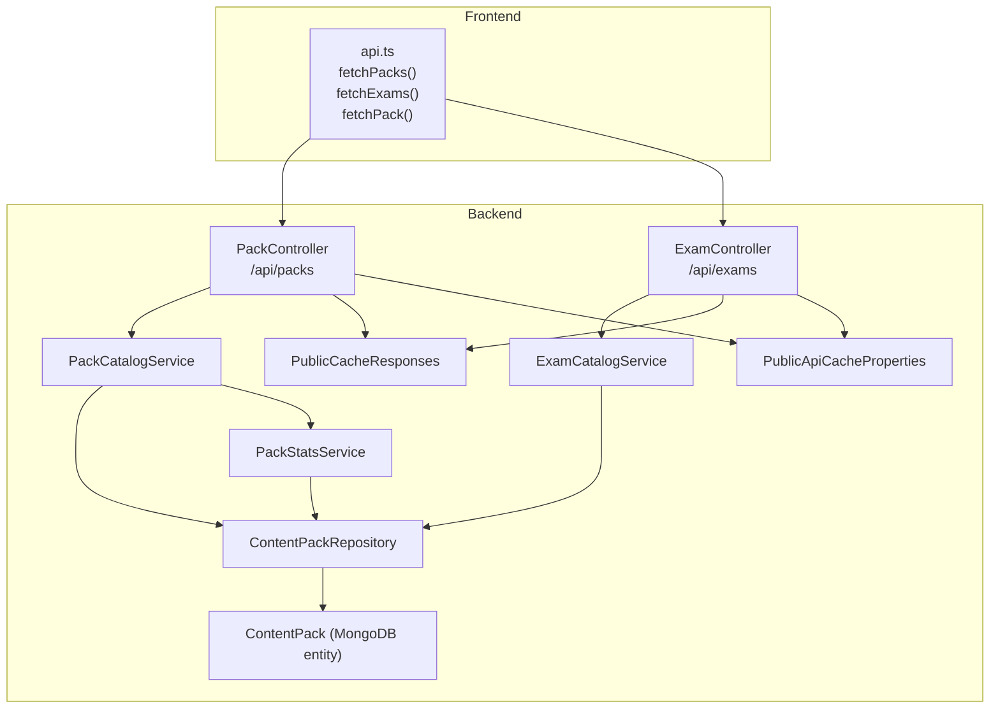
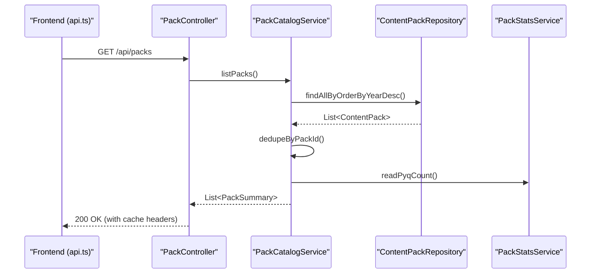
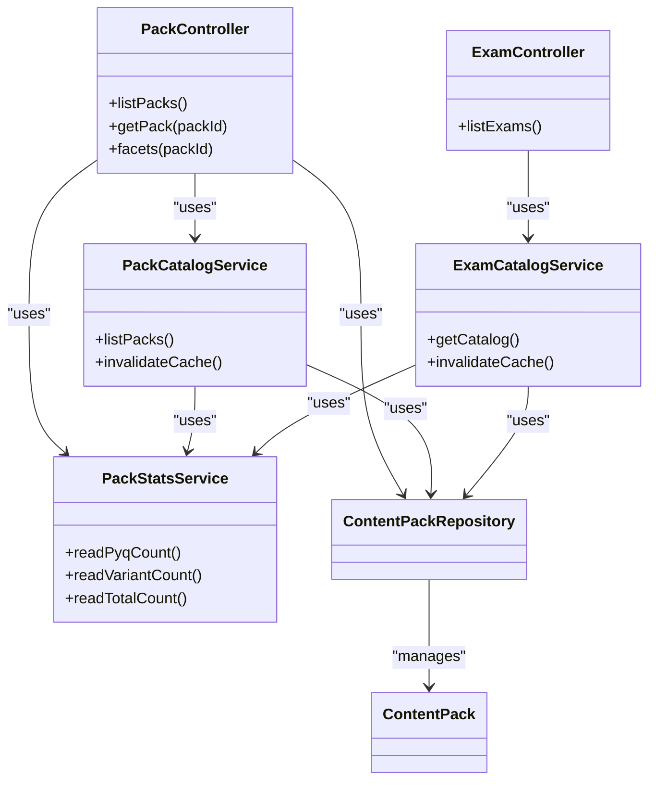

# Content Pack Endpoints

<cite>
**Referenced Files in This Document**
- [PackController.java](file://backend/src/main/java/com/neetlu/examhunt/web/PackController.java)
- [ExamController.java](file://backend/src/main/java/com/neetlu/examhunt/web/ExamController.java)
- [PackCatalogService.java](file://backend/src/main/java/com/neetlu/examhunt/service/PackCatalogService.java)
- [ExamCatalogService.java](file://backend/src/main/java/com/neetlu/examhunt/service/ExamCatalogService.java)
- [PackStatsService.java](file://backend/src/main/java/com/neetlu/examhunt/service/PackStatsService.java)
- [ContentPack.java](file://backend/src/main/java/com/neetlu/examhunt/model/ContentPack.java)
- [ContentPackRepository.java](file://backend/src/main/java/com/neetlu/examhunt/repository/ContentPackRepository.java)
- [PublicCacheResponses.java](file://backend/src/main/java/com/neetlu/examhunt/web/PublicCacheResponses.java)
- [PublicApiCacheProperties.java](file://backend/src/main/java/com/neetlu/examhunt/config/PublicApiCacheProperties.java)
- [application.yml](file://backend/src/main/resources/application.yml)
- [api.ts](file://frontend/src/api.ts)
</cite>

## Table of Contents
1. [Introduction](#introduction)
2. [Project Structure](#project-structure)
3. [Core Components](#core-components)
4. [Architecture Overview](#architecture-overview)
5. [Detailed Component Analysis](#detailed-component-analysis)
6. [Dependency Analysis](#dependency-analysis)
7. [Performance Considerations](#performance-considerations)
8. [Troubleshooting Guide](#troubleshooting-guide)
9. [Conclusion](#conclusion)
10. [Appendices](#appendices)

## Introduction
This document describes the content pack and exam catalog APIs that power browsing curated question collections, organizing content by exam and year, and exposing pack-level metadata and statistics. It covers:
- Endpoints for listing content packs, viewing pack details, and retrieving pack facets
- Exam catalog endpoints for discovering available exams and years
- Pack statistics and content availability indicators
- Frontend usage patterns for pack browsing, exam selection, and content organization

## Project Structure
The content pack and exam endpoints are implemented in the backend Spring Boot application and consumed by the frontend client.

**Diagram sources**
- [PackController.java:19-84](file://backend/src/main/java/com/neetlu/examhunt/web/PackController.java#L19-L84)
- [ExamController.java:12-29](file://backend/src/main/java/com/neetlu/examhunt/web/ExamController.java#L12-L29)
- [PackCatalogService.java:14-72](file://backend/src/main/java/com/neetlu/examhunt/service/PackCatalogService.java#L14-L72)
- [ExamCatalogService.java:16-166](file://backend/src/main/java/com/neetlu/examhunt/service/ExamCatalogService.java#L16-L166)
- [PackStatsService.java:12-108](file://backend/src/main/java/com/neetlu/examhunt/service/PackStatsService.java#L12-L108)
- [ContentPackRepository.java:9-20](file://backend/src/main/java/com/neetlu/examhunt/repository/ContentPackRepository.java#L9-L20)
- [ContentPack.java:11-127](file://backend/src/main/java/com/neetlu/examhunt/model/ContentPack.java#L11-L127)
- [PublicCacheResponses.java:9-23](file://backend/src/main/java/com/neetlu/examhunt/web/PublicCacheResponses.java#L9-L23)
- [PublicApiCacheProperties.java:6-31](file://backend/src/main/java/com/neetlu/examhunt/config/PublicApiCacheProperties.java#L6-L31)
- [api.ts:503-513](file://frontend/src/api.ts#L503-L513)

**Section sources**
- [PackController.java:19-84](file://backend/src/main/java/com/neetlu/examhunt/web/PackController.java#L19-L84)
- [ExamController.java:12-29](file://backend/src/main/java/com/neetlu/examhunt/web/ExamController.java#L12-L29)
- [PackCatalogService.java:14-72](file://backend/src/main/java/com/neetlu/examhunt/service/PackCatalogService.java#L14-L72)
- [ExamCatalogService.java:16-166](file://backend/src/main/java/com/neetlu/examhunt/service/ExamCatalogService.java#L16-L166)
- [PackStatsService.java:12-108](file://backend/src/main/java/com/neetlu/examhunt/service/PackStatsService.java#L12-L108)
- [ContentPackRepository.java:9-20](file://backend/src/main/java/com/neetlu/examhunt/repository/ContentPackRepository.java#L9-L20)
- [ContentPack.java:11-127](file://backend/src/main/java/com/neetlu/examhunt/model/ContentPack.java#L11-L127)
- [PublicCacheResponses.java:9-23](file://backend/src/main/java/com/neetlu/examhunt/web/PublicCacheResponses.java#L9-L23)
- [PublicApiCacheProperties.java:6-31](file://backend/src/main/java/com/neetlu/examhunt/config/PublicApiCacheProperties.java#L6-L31)
- [api.ts:503-513](file://frontend/src/api.ts#L503-L513)

## Core Components
- PackController: Exposes endpoints for pack listing, detail retrieval, and facets.
- ExamController: Exposes endpoint for exam catalog retrieval.
- PackCatalogService: Builds pack summaries with deduplication and facet aggregation.
- ExamCatalogService: Constructs exam catalog entries with year availability and counts.
- PackStatsService: Computes and caches pack-level counts (PYQs, variants, totals).
- ContentPackRepository: Data access for content packs.
- ContentPack: MongoDB entity representing a pack with metadata, stats, and facets.
- PublicCacheResponses and PublicApiCacheProperties: Configure caching headers and in-memory TTL.

**Section sources**
- [PackController.java:19-84](file://backend/src/main/java/com/neetlu/examhunt/web/PackController.java#L19-L84)
- [ExamController.java:12-29](file://backend/src/main/java/com/neetlu/examhunt/web/ExamController.java#L12-L29)
- [PackCatalogService.java:14-72](file://backend/src/main/java/com/neetlu/examhunt/service/PackCatalogService.java#L14-L72)
- [ExamCatalogService.java:16-166](file://backend/src/main/java/com/neetlu/examhunt/service/ExamCatalogService.java#L16-L166)
- [PackStatsService.java:12-108](file://backend/src/main/java/com/neetlu/examhunt/service/PackStatsService.java#L12-L108)
- [ContentPackRepository.java:9-20](file://backend/src/main/java/com/neetlu/examhunt/repository/ContentPackRepository.java#L9-L20)
- [ContentPack.java:11-127](file://backend/src/main/java/com/neetlu/examhunt/model/ContentPack.java#L11-L127)
- [PublicCacheResponses.java:9-23](file://backend/src/main/java/com/neetlu/examhunt/web/PublicCacheResponses.java#L9-L23)
- [PublicApiCacheProperties.java:6-31](file://backend/src/main/java/com/neetlu/examhunt/config/PublicApiCacheProperties.java#L6-L31)

## Architecture Overview
The API follows a layered architecture:
- Controllers expose REST endpoints and delegate to services.
- Services encapsulate business logic, including deduplication, caching, and computation.
- Repositories provide data access to MongoDB.
- Frontend consumes endpoints via typed functions.

**Diagram sources**
- [PackController.java:39-43](file://backend/src/main/java/com/neetlu/examhunt/web/PackController.java#L39-L43)
- [PackCatalogService.java:35-48](file://backend/src/main/java/com/neetlu/examhunt/service/PackCatalogService.java#L35-L48)
- [ContentPackRepository.java:15-17](file://backend/src/main/java/com/neetlu/examhunt/repository/ContentPackRepository.java#L15-L17)
- [PackStatsService.java:55-61](file://backend/src/main/java/com/neetlu/examhunt/service/PackStatsService.java#L55-L61)
- [PublicCacheResponses.java:14-22](file://backend/src/main/java/com/neetlu/examhunt/web/PublicCacheResponses.java#L14-L22)

## Detailed Component Analysis

### Pack Endpoints
- Base path: /api/packs
- Endpoints:
  - GET /api/packs
    - Returns a list of pack summaries with packId, exam, year, sourceFolder, questionCount, and facets.
    - Uses cache headers and in-memory cache versioning.
  - GET /api/packs/{packId}
    - Returns detailed pack info including stats, facets, and computed questionCount.
    - Throws 404 if pack not found.
  - GET /api/packs/{packId}/facets
    - Returns the facets map for a pack or empty map if null.

Response models:
- PackSummary: packId, exam, year, sourceFolder, questionCount, facets
- PackDetail: packId, exam, year, sourceFolder, stats, facets, questionCount

Implementation highlights:
- Caching: catalogOk(...) sets Cache-Control, ETag, and applies memory TTL.
- Stats: PackStatsService reads denormalized counts from stats or computes live counts.
- Facets: PackCatalogService and PackController surface facets populated during ingestion.

**Section sources**
- [PackController.java:39-83](file://backend/src/main/java/com/neetlu/examhunt/web/PackController.java#L39-L83)
- [PackCatalogService.java:35-65](file://backend/src/main/java/com/neetlu/examhunt/service/PackCatalogService.java#L35-L65)
- [PackStatsService.java:55-82](file://backend/src/main/java/com/neetlu/examhunt/service/PackStatsService.java#L55-L82)
- [PublicCacheResponses.java:14-22](file://backend/src/main/java/com/neetlu/examhunt/web/PublicCacheResponses.java#L14-L22)

### Exam Catalog Endpoints
- Base path: /api/exams
- Endpoint:
  - GET /api/exams
    - Returns exam catalog entries with id, name, status, description, totalQuestions, availableYears, and years list.
    - Status is derived from availability; years list includes year, status, packId, questionCount, and optional message.

Exam catalog construction:
- ExamCatalogService builds entries for predefined exams, derives availability from existing packs, and computes totals and counts.

**Section sources**
- [ExamController.java:24-28](file://backend/src/main/java/com/neetlu/examhunt/web/ExamController.java#L24-L28)
- [ExamCatalogService.java:60-133](file://backend/src/main/java/com/neetlu/examhunt/service/ExamCatalogService.java#L60-L133)

### Pack Statistics and Availability
- PackStatsService maintains denormalized counts in ContentPack.stats:
  - pyq_count: official previous year questions (total - variants)
  - variant_count: AI-generated variants
  - total_count: total questions
- Reads from stats if present; otherwise computes live counts from QuestionRepository.
- PackCatalogService and PackController surfaces questionCount via PackStatsService.

Availability signals:
- ExamCatalogService determines year availability based on presence of packs and updates status accordingly.

**Section sources**
- [PackStatsService.java:15-53](file://backend/src/main/java/com/neetlu/examhunt/service/PackStatsService.java#L15-L53)
- [PackStatsService.java:84-91](file://backend/src/main/java/com/neetlu/examhunt/service/PackStatsService.java#L84-L91)
- [ExamCatalogService.java:70-119](file://backend/src/main/java/com/neetlu/examhunt/service/ExamCatalogService.java#L70-L119)

### Data Model: ContentPack
- Fields include identifiers, metadata (exam, year, sourceFolder), timestamps (publishedAt, importedAt), and structured maps (stats, facets).
- Stats and facets are used to store pack-level metrics and organizational facets.

**Section sources**
- [ContentPack.java:11-127](file://backend/src/main/java/com/neetlu/examhunt/model/ContentPack.java#L11-L127)

### API Usage Examples (Frontend)
- Fetch packs: api.ts fetchPacks()
- Fetch exam catalog: api.ts fetchExams()
- Fetch a specific pack: api.ts fetchPack(packId)

These functions map directly to the backend endpoints documented above.

**Section sources**
- [api.ts:503-513](file://frontend/src/api.ts#L503-L513)

## Dependency Analysis

**Diagram sources**
- [PackController.java:23-37](file://backend/src/main/java/com/neetlu/examhunt/web/PackController.java#L23-L37)
- [ExamController.java:16-22](file://backend/src/main/java/com/neetlu/examhunt/web/ExamController.java#L16-L22)
- [PackCatalogService.java:16-29](file://backend/src/main/java/com/neetlu/examhunt/service/PackCatalogService.java#L16-L29)
- [ExamCatalogService.java:36-49](file://backend/src/main/java/com/neetlu/examhunt/service/ExamCatalogService.java#L36-L49)
- [PackStatsService.java:19-25](file://backend/src/main/java/com/neetlu/examhunt/service/PackStatsService.java#L19-L25)
- [ContentPackRepository.java:9-20](file://backend/src/main/java/com/neetlu/examhunt/repository/ContentPackRepository.java#L9-L20)
- [ContentPack.java:11-127](file://backend/src/main/java/com/neetlu/examhunt/model/ContentPack.java#L11-L127)

**Section sources**
- [PackController.java:23-37](file://backend/src/main/java/com/neetlu/examhunt/web/PackController.java#L23-L37)
- [ExamController.java:16-22](file://backend/src/main/java/com/neetlu/examhunt/web/ExamController.java#L16-L22)
- [PackCatalogService.java:16-29](file://backend/src/main/java/com/neetlu/examhunt/service/PackCatalogService.java#L16-L29)
- [ExamCatalogService.java:36-49](file://backend/src/main/java/com/neetlu/examhunt/service/ExamCatalogService.java#L36-L49)
- [PackStatsService.java:19-25](file://backend/src/main/java/com/neetlu/examhunt/service/PackStatsService.java#L19-L25)
- [ContentPackRepository.java:9-20](file://backend/src/main/java/com/neetlu/examhunt/repository/ContentPackRepository.java#L9-L20)
- [ContentPack.java:11-127](file://backend/src/main/java/com/neetlu/examhunt/model/ContentPack.java#L11-L127)

## Performance Considerations
- Caching:
  - Public catalog endpoints use Cache-Control headers and ETag for browser and CDN caching.
  - In-process memory cache with TTL and cache versioning to avoid stale data after imports.
- Computation:
  - Pack statistics are stored in stats to avoid expensive recomputation on each request.
  - Deduplication and sorting are applied to pack lists to ensure canonical rows.
- Configuration:
  - Cache durations are configurable via app.public-api-cache.* properties.

**Section sources**
- [PublicCacheResponses.java:14-22](file://backend/src/main/java/com/neetlu/examhunt/web/PublicCacheResponses.java#L14-L22)
- [PublicApiCacheProperties.java:6-31](file://backend/src/main/java/com/neetlu/examhunt/config/PublicApiCacheProperties.java#L6-L31)
- [application.yml:27-31](file://backend/src/main/resources/application.yml#L27-L31)
- [PackCatalogService.java:31-48](file://backend/src/main/java/com/neetlu/examhunt/service/PackCatalogService.java#L31-L48)
- [PackStatsService.java:27-53](file://backend/src/main/java/com/neetlu/examhunt/service/PackStatsService.java#L27-L53)

## Troubleshooting Guide
- 404 Not Found when fetching a pack by ID:
  - Occurs when the pack does not exist in ContentPackRepository.
- Cache invalidation:
  - After importing or updating packs, ensure cache invalidation is triggered so clients receive fresh data.
- Stats discrepancies:
  - Verify stats fields (pyq_count, variant_count, total_count) exist; otherwise, live counts are computed from QuestionRepository.

**Section sources**
- [PackController.java:47-48](file://backend/src/main/java/com/neetlu/examhunt/web/PackController.java#L47-L48)
- [PackStatsService.java:55-82](file://backend/src/main/java/com/neetlu/examhunt/service/PackStatsService.java#L55-L82)
- [PackCatalogService.java:45-48](file://backend/src/main/java/com/neetlu/examhunt/service/PackCatalogService.java#L45-L48)

## Conclusion
The content pack and exam catalog APIs provide a robust foundation for browsing curated question collections, organizing content by exam and year, and surfacing pack-level statistics and availability. The design emphasizes caching, deduplication, and denormalized stats to deliver fast, reliable responses while maintaining flexibility for future enhancements.

## Appendices

### API Definitions

- GET /api/packs
  - Description: List all packs with summary information.
  - Response: Array of PackSummary
  - Cache: ETag + Cache-Control headers applied; in-memory TTL honored.

- GET /api/packs/{packId}
  - Description: Retrieve detailed pack information including stats and facets.
  - Path parameters: packId (string)
  - Response: PackDetail
  - Errors: 404 Not Found if pack does not exist.

- GET /api/packs/{packId}/facets
  - Description: Retrieve facets map for a pack.
  - Path parameters: packId (string)
  - Response: Map<String, Object>

- GET /api/exams
  - Description: Retrieve exam catalog with year availability and counts.
  - Response: Array of ExamCatalogEntry
  - Cache: ETag + Cache-Control headers applied; in-memory TTL honored.

### Data Models

- PackSummary
  - Fields: packId, exam, year, sourceFolder, questionCount, facets

- PackDetail
  - Fields: packId, exam, year, sourceFolder, stats, facets, questionCount

- ExamCatalogEntry
  - Fields: id, name, status, description, totalQuestions, availableYears, years

- YearCatalogEntry
  - Fields: year, status, packId, questionCount, message

**Section sources**
- [PackController.java:39-83](file://backend/src/main/java/com/neetlu/examhunt/web/PackController.java#L39-L83)
- [ExamController.java:24-28](file://backend/src/main/java/com/neetlu/examhunt/web/ExamController.java#L24-L28)
- [PackCatalogService.java:57-65](file://backend/src/main/java/com/neetlu/examhunt/service/PackCatalogService.java#L57-L65)
- [ExamCatalogService.java:140-156](file://backend/src/main/java/com/neetlu/examhunt/service/ExamCatalogService.java#L140-L156)
- [api.ts:17-28](file://frontend/src/api.ts#L17-L28)
- [api.ts:92-100](file://frontend/src/api.ts#L92-L100)