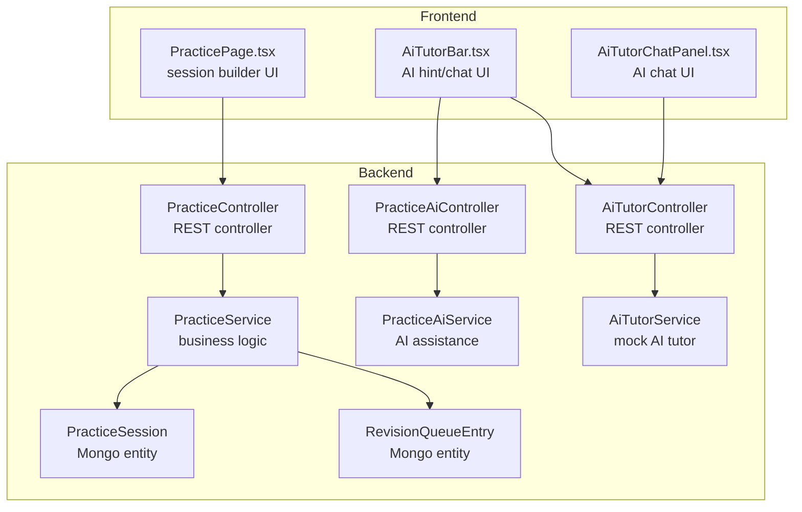
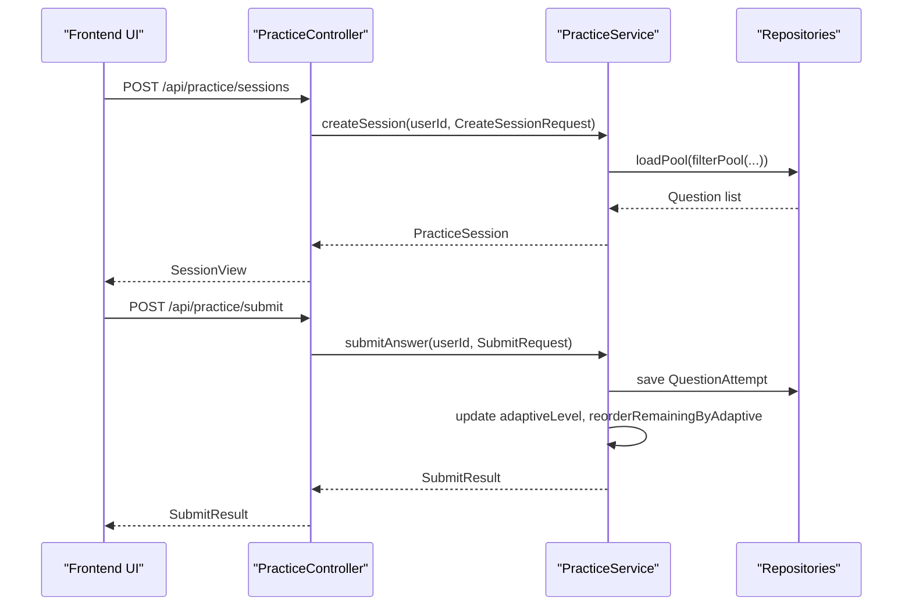
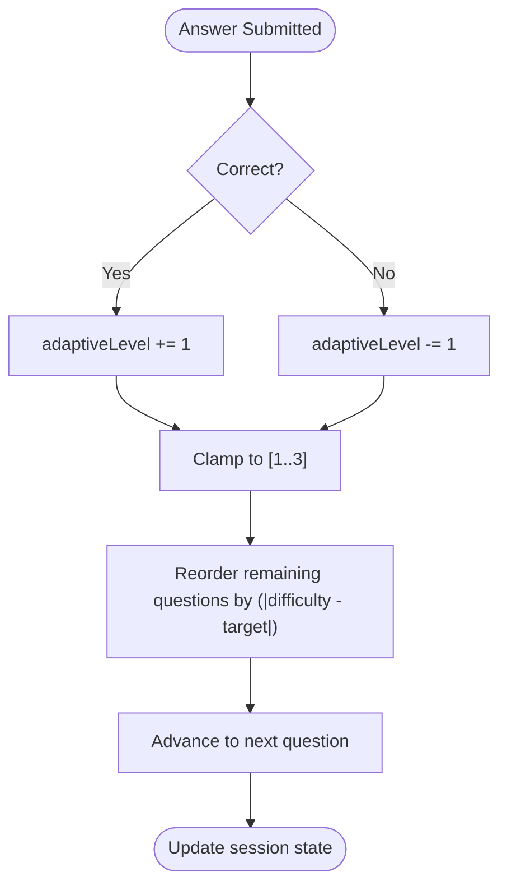
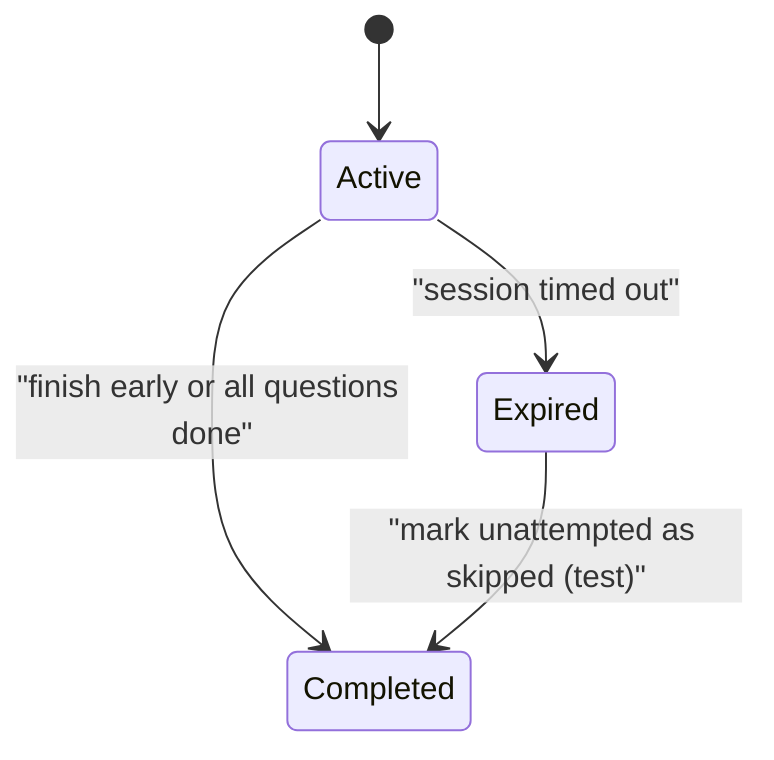
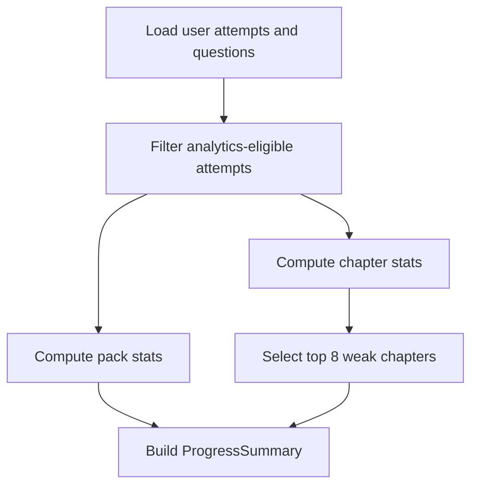
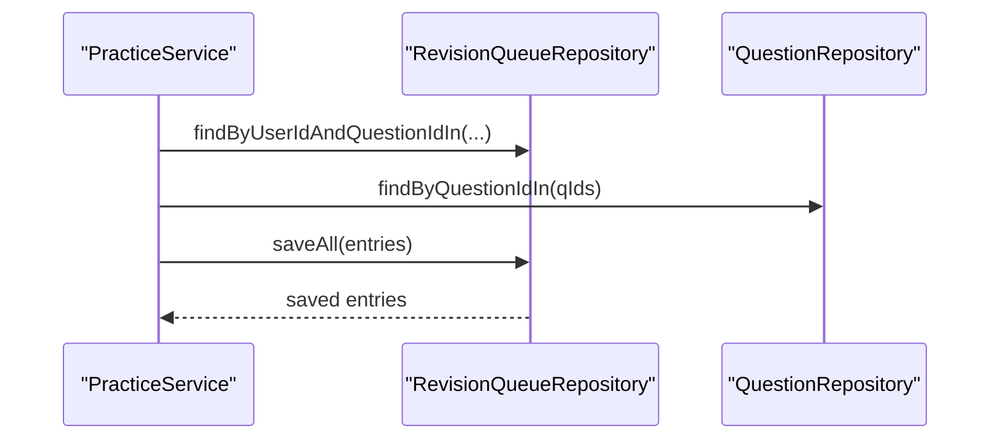
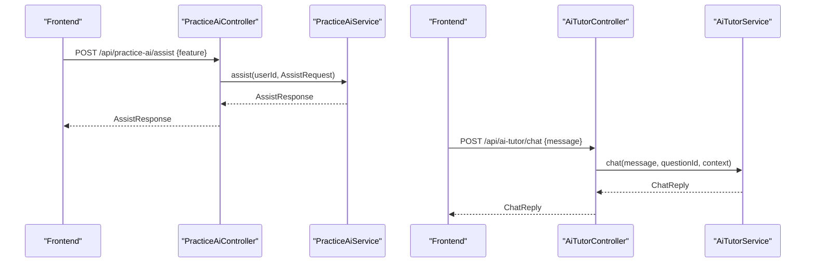
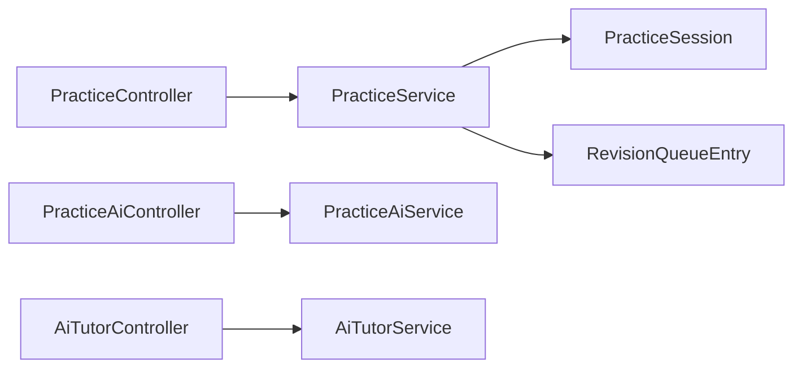

# Practice Session Endpoints

<cite>
**Referenced Files in This Document**
- [PracticeController.java](file://backend/src/main/java/com/neetlu/examhunt/web/PracticeController.java)
- [PracticeAiController.java](file://backend/src/main/java/com/neetlu/examhunt/web/PracticeAiController.java)
- [PracticeService.java](file://backend/src/main/java/com/neetlu/examhunt/service/PracticeService.java)
- [PracticeAiService.java](file://backend/src/main/java/com/neetlu/examhunt/service/PracticeAiService.java)
- [PracticeSession.java](file://backend/src/main/java/com/neetlu/examhunt/model/PracticeSession.java)
- [RevisionQueueEntry.java](file://backend/src/main/java/com/neetlu/examhunt/model/RevisionQueueEntry.java)
- [AiTutorController.java](file://backend/src/main/java/com/neetlu/examhunt/web/AiTutorController.java)
- [AiTutorService.java](file://backend/src/main/java/com/neetlu/examhunt/service/AiTutorService.java)
- [PracticePage.tsx](file://frontend/src/pages/PracticePage.tsx)
- [AiTutorBar.tsx](file://frontend/src/components/AiTutorBar.tsx)
- [AiTutorChatPanel.tsx](file://frontend/src/components/AiTutorChatPanel.tsx)
</cite>

## Table of Contents
1. [Introduction](#introduction)
2. [Project Structure](#project-structure)
3. [Core Components](#core-components)
4. [Architecture Overview](#architecture-overview)
5. [Detailed Component Analysis](#detailed-component-analysis)
6. [Dependency Analysis](#dependency-analysis)
7. [Performance Considerations](#performance-considerations)
8. [Troubleshooting Guide](#troubleshooting-guide)
9. [Conclusion](#conclusion)
10. [Appendices](#appendices)

## Introduction
This document provides API documentation for practice session endpoints, covering session lifecycle, adaptive practice algorithm, session state management, progress tracking, revision queue management, weak area identification, and AI-powered practice assistance. It also documents AI tutor integration, response processing, and learning assistance features, with examples of session workflows, answer submission formats, and AI interaction patterns.

## Project Structure
The practice-related APIs are implemented in the backend Java controllers and services, with frontend components orchestrating user actions and rendering results.

**Diagram sources**
- [PracticeController.java:21-29](file://backend/src/main/java/com/neetlu/examhunt/web/PracticeController.java#L21-L29)
- [PracticeAiController.java:11-19](file://backend/src/main/java/com/neetlu/examhunt/web/PracticeAiController.java#L11-L19)
- [AiTutorController.java:10-18](file://backend/src/main/java/com/neetlu/examhunt/web/AiTutorController.java#L10-L18)
- [PracticeService.java:26-58](file://backend/src/main/java/com/neetlu/examhunt/service/PracticeService.java#L26-L58)
- [PracticeAiService.java:30-178](file://backend/src/main/java/com/neetlu/examhunt/service/PracticeAiService.java#L30-L178)
- [AiTutorService.java:12-18](file://backend/src/main/java/com/neetlu/examhunt/service/AiTutorService.java#L12-L18)
- [PracticeSession.java:12-43](file://backend/src/main/java/com/neetlu/examhunt/model/PracticeSession.java#L12-L43)
- [RevisionQueueEntry.java:8-22](file://backend/src/main/java/com/neetlu/examhunt/model/RevisionQueueEntry.java#L8-L22)
- [PracticePage.tsx:23-98](file://frontend/src/pages/PracticePage.tsx#L23-L98)
- [AiTutorBar.tsx:8-36](file://frontend/src/components/AiTutorBar.tsx#L8-L36)
- [AiTutorChatPanel.tsx:15-51](file://frontend/src/components/AiTutorChatPanel.tsx#L15-L51)

**Section sources**
- [PracticeController.java:21-29](file://backend/src/main/java/com/neetlu/examhunt/web/PracticeController.java#L21-L29)
- [PracticeAiController.java:11-19](file://backend/src/main/java/com/neetlu/examhunt/web/PracticeAiController.java#L11-L19)
- [AiTutorController.java:10-18](file://backend/src/main/java/com/neetlu/examhunt/web/AiTutorController.java#L10-L18)
- [PracticeService.java:26-58](file://backend/src/main/java/com/neetlu/examhunt/service/PracticeService.java#L26-L58)
- [PracticeAiService.java:30-178](file://backend/src/main/java/com/neetlu/examhunt/service/PracticeAiService.java#L30-L178)
- [AiTutorService.java:12-18](file://backend/src/main/java/com/neetlu/examhunt/service/AiTutorService.java#L12-L18)
- [PracticeSession.java:12-43](file://backend/src/main/java/com/neetlu/examhunt/model/PracticeSession.java#L12-L43)
- [RevisionQueueEntry.java:8-22](file://backend/src/main/java/com/neetlu/examhunt/model/RevisionQueueEntry.java#L8-L22)
- [PracticePage.tsx:23-98](file://frontend/src/pages/PracticePage.tsx#L23-L98)
- [AiTutorBar.tsx:8-36](file://frontend/src/components/AiTutorBar.tsx#L8-L36)
- [AiTutorChatPanel.tsx:15-51](file://frontend/src/components/AiTutorChatPanel.tsx#L15-L51)

## Core Components
- PracticeController: Exposes REST endpoints for creating sessions, retrieving session data, submitting answers, skipping questions, marking for review, engaging/pausing sessions, finishing sessions, rating questions, and fetching question details and solutions.
- PracticeAiController: Provides AI assistance status and endpoint to request AI help for hints, explanations, formulas, pitfalls, and revision support.
- PracticeService: Implements adaptive practice algorithm, session state transitions, progress computation, weak chapter detection, and integration with repositories for sessions, attempts, and revisions.
- PracticeAiService: Orchestrates AI assistance features including hint generation, formula recall, basics explanation, pitfalls, weak chapter analysis, and revision suggestions.
- PracticeSession: MongoDB entity representing a user’s practice/test session with state, timing, adaptive level, and metrics.
- RevisionQueueEntry: MongoDB entity representing items queued for revision with source and timestamps.
- AiTutorController and AiTutorService: Provide a mock AI tutor chat and hint endpoints integrated with platform settings.

**Section sources**
- [PracticeController.java:31-134](file://backend/src/main/java/com/neetlu/examhunt/web/PracticeController.java#L31-L134)
- [PracticeAiController.java:21-30](file://backend/src/main/java/com/neetlu/examhunt/web/PracticeAiController.java#L21-L30)
- [PracticeService.java:60-89](file://backend/src/main/java/com/neetlu/examhunt/service/PracticeService.java#L60-L89)
- [PracticeAiService.java:192-217](file://backend/src/main/java/com/neetlu/examhunt/service/PracticeAiService.java#L192-L217)
- [PracticeSession.java:13-43](file://backend/src/main/java/com/neetlu/examhunt/model/PracticeSession.java#L13-L43)
- [RevisionQueueEntry.java:9-22](file://backend/src/main/java/com/neetlu/examhunt/model/RevisionQueueEntry.java#L9-L22)
- [AiTutorController.java:20-30](file://backend/src/main/java/com/neetlu/examhunt/web/AiTutorController.java#L20-L30)
- [AiTutorService.java:20-58](file://backend/src/main/java/com/neetlu/examhunt/service/AiTutorService.java#L20-L58)

## Architecture Overview
The practice flow integrates frontend UI actions with backend controllers and services. Sessions are created with filters and optional adaptive mode, then processed with answer submissions that update session state and adaptive difficulty ordering. AI assistance enriches learning via hints, formulas, and explanations. Weak areas are identified from analytics, and revision queue entries support targeted review.

**Diagram sources**
- [PracticeController.java:31-49](file://backend/src/main/java/com/neetlu/examhunt/web/PracticeController.java#L31-L49)
- [PracticeService.java:60-89](file://backend/src/main/java/com/neetlu/examhunt/service/PracticeService.java#L60-L89)
- [PracticeService.java:278-337](file://backend/src/main/java/com/neetlu/examhunt/service/PracticeService.java#L278-L337)

## Detailed Component Analysis

### Practice Session Lifecycle Endpoints
- POST /api/practice/sessions
  - Purpose: Start a new practice or test session with filters and options.
  - Request body fields: exam, packId, subject, chapter, topic, difficulty, adaptive, startQuestionId, mode, questionCount, questionSet.
  - Response: SessionView with session metadata and currentQuestionId.
  - Notes: Adaptive mode adjusts next question difficulty around the current level.

- GET /api/practice/sessions/{sessionId}
  - Purpose: Retrieve session details and current state.
  - Response: SessionView.

- POST /api/practice/sessions/{sessionId}/retake-test
  - Purpose: Create a timed test from wrong/skipped/unanswered questions of a completed test session.
  - Request body: filter (wrong, skipped, unanswered, mistakes).
  - Response: SessionView for the new retake session.

- POST /api/practice/sessions/{sessionId}/engage
  - Purpose: Start or resume session timer when user opens a question page.
  - Response: SessionView.

- POST /api/practice/sessions/{sessionId}/pause
  - Purpose: Pause session timer when user leaves the page.
  - Response: SessionView.

- POST /api/practice/sessions/{sessionId}/finish
  - Purpose: Finish an active session early.
  - Response: SessionResultView.

- GET /api/practice/sessions/{sessionId}/result
  - Purpose: Retrieve final result of a completed session.
  - Response: SessionResultView.

- GET /api/practice/questions/{questionId}
  - Purpose: Fetch question details for practice.
  - Response: QuestionPracticeView with options and variant info.

- GET /api/practice/questions/{questionId}/solution
  - Purpose: Reveal solution image/text preview after hint ladder.
  - Response: SolutionRevealView.

- PUT /api/practice/questions/{questionId}/rating
  - Purpose: Submit rating and optional comment for a question.
  - Response: RatingView.

- GET /api/practice/questions/{questionId}/rating
  - Purpose: Retrieve user’s rating for a question.
  - Response: RatingView.

- POST /api/practice/submit
  - Purpose: Submit an answer for the current question.
  - Request body: sessionId, questionId, selectedAnswer.
  - Response: SubmitResult with correctness, marks, totals, adaptive level, nextQuestionId.

- POST /api/practice/skip
  - Purpose: Skip the current question (only allowed for the current position).
  - Request body: sessionId, questionId.
  - Response: SkipResult.

- POST /api/practice/sessions/{sessionId}/mark-review
  - Purpose: Mark/unmark a question for review (test mode only).
  - Request body: questionId.
  - Response: SessionView.

- GET /api/practice/progress
  - Purpose: Retrieve user progress summary including recent sessions, pack stats, weak chapters, and weekly activity.
  - Response: ProgressSummary.

- GET /api/practice/wrong-attempts
  - Purpose: List wrong attempts with optional filters (mode, subject, chapter, exam, year, sessionId).
  - Response: List of WrongAttemptView.

**Section sources**
- [PracticeController.java:31-169](file://backend/src/main/java/com/neetlu/examhunt/web/PracticeController.java#L31-L169)
- [PracticeService.java:451-511](file://backend/src/main/java/com/neetlu/examhunt/service/PracticeService.java#L451-L511)

### Adaptive Practice Algorithm
- Initial setup: Session starts with adaptiveLevel set to a baseline and ordered question list sorted by proximity to the target difficulty.
- After each correct answer: adaptiveLevel increases by 1; remaining questions reordered to favor the new target difficulty.
- After each incorrect answer: adaptiveLevel decreases by 1; remaining questions reordered accordingly.
- Clamp adaptiveLevel between 1 and 3 to prevent extreme difficulty shifts.
- Reordering ensures the next question aligns with the updated adaptive level.

**Diagram sources**
- [PracticeService.java:311-314](file://backend/src/main/java/com/neetlu/examhunt/service/PracticeService.java#L311-L314)
- [PracticeService.java:712-730](file://backend/src/main/java/com/neetlu/examhunt/service/PracticeService.java#L712-L730)
- [PracticeService.java:708-710](file://backend/src/main/java/com/neetlu/examhunt/service/PracticeService.java#L708-L710)

**Section sources**
- [PracticeService.java:708-730](file://backend/src/main/java/com/neetlu/examhunt/service/PracticeService.java#L708-L730)

### Session State Management
- Status lifecycle: active → completed (on finish or exhaustion).
- Timing: engagedSince and lastDisengagedAt track page engagement; maybeExpireSession completes expired sessions based on expiry rules.
- Current index advancement occurs after answer/skip submission; session completion triggers asynchronous post-processing.
- Test mode differs from practice mode in analytics counting and feedback suppression.

**Diagram sources**
- [PracticeService.java:755-784](file://backend/src/main/java/com/neetlu/examhunt/service/PracticeService.java#L755-L784)
- [PracticeSession.java:35-42](file://backend/src/main/java/com/neetlu/examhunt/model/PracticeSession.java#L35-L42)

**Section sources**
- [PracticeService.java:222-237](file://backend/src/main/java/com/neetlu/examhunt/service/PracticeService.java#L222-L237)
- [PracticeService.java:755-784](file://backend/src/main/java/com/neetlu/examhunt/service/PracticeService.java#L755-L784)
- [PracticeSession.java:35-42](file://backend/src/main/java/com/neetlu/examhunt/model/PracticeSession.java#L35-L42)

### Progress Tracking and Weak Areas
- ProgressSummary aggregates:
  - Total attempts and correct count.
  - Pack-wise statistics (attempts, correct, marks).
  - Weak chapters (top 8) computed from accuracy percent, marks, and attempt count.
  - Weekly activity counts over the last 28 days.
- Weak chapter identification filters chapters with at least 2 attempts and sorts by accuracy and marks.

**Diagram sources**
- [PracticeService.java:451-511](file://backend/src/main/java/com/neetlu/examhunt/service/PracticeService.java#L451-L511)

**Section sources**
- [PracticeService.java:451-511](file://backend/src/main/java/com/neetlu/examhunt/service/PracticeService.java#L451-L511)

### Revision Queue Management
- Enqueue wrong attempts from a completed session into the revision queue with source "wrong".
- List revision queue items by status (pending/revised/all) and mark items as revised or pending.
- Summary provides pending and revised counts.

**Diagram sources**
- [PracticeService.java:133-171](file://backend/src/main/java/com/neetlu/examhunt/service/PracticeService.java#L133-L171)
- [RevisionQueueEntry.java:9-22](file://backend/src/main/java/com/neetlu/examhunt/model/RevisionQueueEntry.java#L9-L22)

**Section sources**
- [PracticeService.java:133-171](file://backend/src/main/java/com/neetlu/examhunt/service/PracticeService.java#L133-L171)
- [RevisionQueueEntry.java:9-22](file://backend/src/main/java/com/neetlu/examhunt/model/RevisionQueueEntry.java#L9-L22)

### Personalized Recommendations and AI Assistance
- AI Assistance Features:
  - Status: GET /api/practice-ai/status
  - Assist: POST /api/practice-ai/assist with feature selection (why_wrong, hint, formula, explain_basics, pitfalls, weak_chapter_analysis, practice_from_weak, revision_notes, mentor, similar_questions).
- AI Tutor Integration:
  - Chat: POST /api/ai-tutor/chat with message, questionId, context.
  - Hint: POST /api/ai-tutor/hint with mode and questionId.
  - Mock responses powered by platform settings.

**Diagram sources**
- [PracticeAiController.java:21-30](file://backend/src/main/java/com/neetlu/examhunt/web/PracticeAiController.java#L21-L30)
- [PracticeAiService.java:192-217](file://backend/src/main/java/com/neetlu/examhunt/service/PracticeAiService.java#L192-L217)
- [AiTutorController.java:20-30](file://backend/src/main/java/com/neetlu/examhunt/web/AiTutorController.java#L20-L30)
- [AiTutorService.java:20-58](file://backend/src/main/java/com/neetlu/examhunt/service/AiTutorService.java#L20-L58)

**Section sources**
- [PracticeAiController.java:21-30](file://backend/src/main/java/com/neetlu/examhunt/web/PracticeAiController.java#L21-L30)
- [PracticeAiService.java:192-217](file://backend/src/main/java/com/neetlu/examhunt/service/PracticeAiService.java#L192-L217)
- [AiTutorController.java:20-30](file://backend/src/main/java/com/neetlu/examhunt/web/AiTutorController.java#L20-L30)
- [AiTutorService.java:20-58](file://backend/src/main/java/com/neetlu/examhunt/service/AiTutorService.java#L20-L58)

### Frontend Integration Examples
- Starting a session:
  - Frontend composes CreateSessionRequest and navigates to the first question route upon successful creation.
- AI Hint and Chat:
  - AiTutorBar triggers hint requests and toggles chat panel.
  - AiTutorChatPanel manages message history and sends chat messages.

**Section sources**
- [PracticePage.tsx:45-98](file://frontend/src/pages/PracticePage.tsx#L45-L98)
- [AiTutorBar.tsx:24-36](file://frontend/src/components/AiTutorBar.tsx#L24-L36)
- [AiTutorChatPanel.tsx:34-51](file://frontend/src/components/AiTutorChatPanel.tsx#L34-L51)

## Dependency Analysis
- Controllers depend on services for business logic.
- Services depend on repositories for persistence and on shared services (e.g., AnswerValidationService, RevisionService).
- Entities represent persisted state for sessions and revision queue.

**Diagram sources**
- [PracticeController.java:25-29](file://backend/src/main/java/com/neetlu/examhunt/web/PracticeController.java#L25-L29)
- [PracticeAiController.java:15-19](file://backend/src/main/java/com/neetlu/examhunt/web/PracticeAiController.java#L15-L19)
- [AiTutorController.java:14-18](file://backend/src/main/java/com/neetlu/examhunt/web/AiTutorController.java#L14-L18)
- [PracticeService.java:35-58](file://backend/src/main/java/com/neetlu/examhunt/service/PracticeService.java#L35-L58)
- [PracticeAiService.java:161-178](file://backend/src/main/java/com/neetlu/examhunt/service/PracticeAiService.java#L161-L178)
- [AiTutorService.java:14-18](file://backend/src/main/java/com/neetlu/examhunt/service/AiTutorService.java#L14-L18)
- [PracticeSession.java:12-43](file://backend/src/main/java/com/neetlu/examhunt/model/PracticeSession.java#L12-L43)
- [RevisionQueueEntry.java:8-22](file://backend/src/main/java/com/neetlu/examhunt/model/RevisionQueueEntry.java#L8-L22)

**Section sources**
- [PracticeController.java:25-29](file://backend/src/main/java/com/neetlu/examhunt/web/PracticeController.java#L25-L29)
- [PracticeAiController.java:15-19](file://backend/src/main/java/com/neetlu/examhunt/web/PracticeAiController.java#L15-L19)
- [AiTutorController.java:14-18](file://backend/src/main/java/com/neetlu/examhunt/web/AiTutorController.java#L14-L18)
- [PracticeService.java:35-58](file://backend/src/main/java/com/neetlu/examhunt/service/PracticeService.java#L35-L58)
- [PracticeAiService.java:161-178](file://backend/src/main/java/com/neetlu/examhunt/service/PracticeAiService.java#L161-L178)
- [AiTutorService.java:14-18](file://backend/src/main/java/com/neetlu/examhunt/service/AiTutorService.java#L14-L18)
- [PracticeSession.java:12-43](file://backend/src/main/java/com/neetlu/examhunt/model/PracticeSession.java#L12-L43)
- [RevisionQueueEntry.java:8-22](file://backend/src/main/java/com/neetlu/examhunt/model/RevisionQueueEntry.java#L8-L22)

## Performance Considerations
- Adaptive reordering operates on remaining questions; keep question pools reasonably sized to avoid heavy recomputation.
- Use pagination and filtering to limit question pool sizes during session creation.
- Cache frequently accessed question metadata and reduce JSON payload sizes for AI responses where applicable.

## Troubleshooting Guide
- Session not found: Ensure sessionId belongs to the authenticated user.
- Session already completed: Cannot submit answers to a completed session.
- Question not in session: Selected questionId must belong to the current session.
- Conflict on answer submission: Question already answered in this session.
- Invalid retake filter: Only supports specific filter values.
- AI feature unavailable: Platform setting or LLM configuration may disable features.

**Section sources**
- [PracticeController.java:280-288](file://backend/src/main/java/com/neetlu/examhunt/web/PracticeController.java#L280-L288)
- [PracticeService.java:94-172](file://backend/src/main/java/com/neetlu/examhunt/service/PracticeService.java#L94-L172)
- [PracticeAiService.java:192-217](file://backend/src/main/java/com/neetlu/examhunt/service/PracticeAiService.java#L192-L217)

## Conclusion
The practice session endpoints provide a robust foundation for adaptive learning, comprehensive progress tracking, and AI-enhanced assistance. The architecture cleanly separates concerns between controllers, services, and persistence, enabling scalable enhancements such as personalized recommendations, weak area remediation, and advanced AI tutoring features.

## Appendices

### Endpoint Reference Summary
- Practice Sessions
  - POST /api/practice/sessions
  - GET /api/practice/sessions/{sessionId}
  - POST /api/practice/sessions/{sessionId}/retake-test
  - POST /api/practice/sessions/{sessionId}/engage
  - POST /api/practice/sessions/{sessionId}/pause
  - POST /api/practice/sessions/{sessionId}/finish
  - GET /api/practice/sessions/{sessionId}/result
- Question and Submission
  - GET /api/practice/questions/{questionId}
  - GET /api/practice/questions/{questionId}/solution
  - POST /api/practice/submit
  - POST /api/practice/skip
  - POST /api/practice/sessions/{sessionId}/mark-review
  - PUT /api/practice/questions/{questionId}/rating
  - GET /api/practice/questions/{questionId}/rating
- Progress and Analytics
  - GET /api/practice/progress
  - GET /api/practice/wrong-attempts
- AI Assistance
  - GET /api/practice-ai/status
  - POST /api/practice-ai/assist
- AI Tutor
  - POST /api/ai-tutor/chat
  - POST /api/ai-tutor/hint