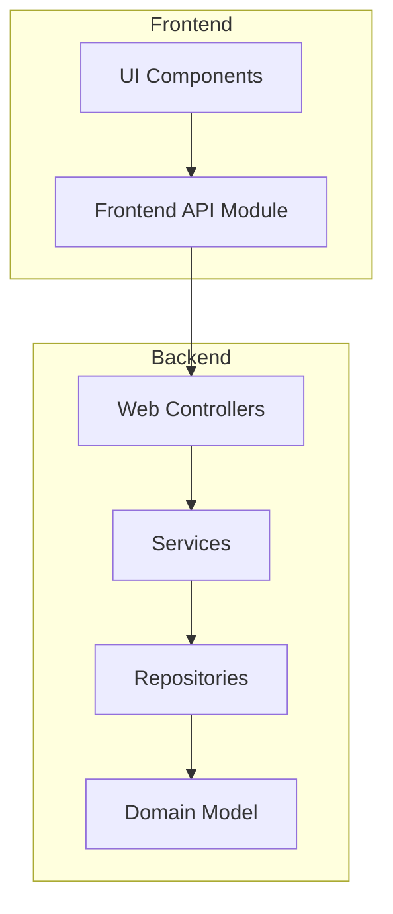
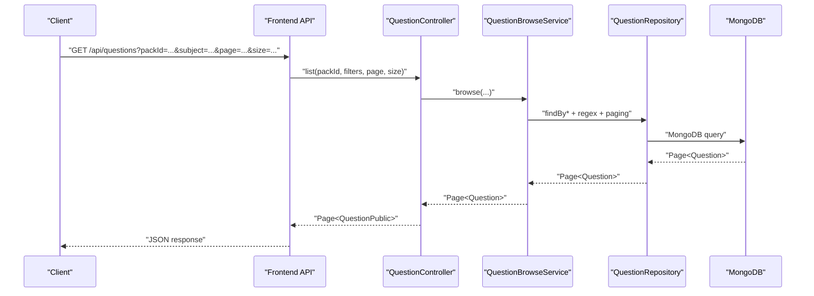
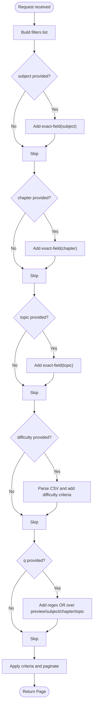
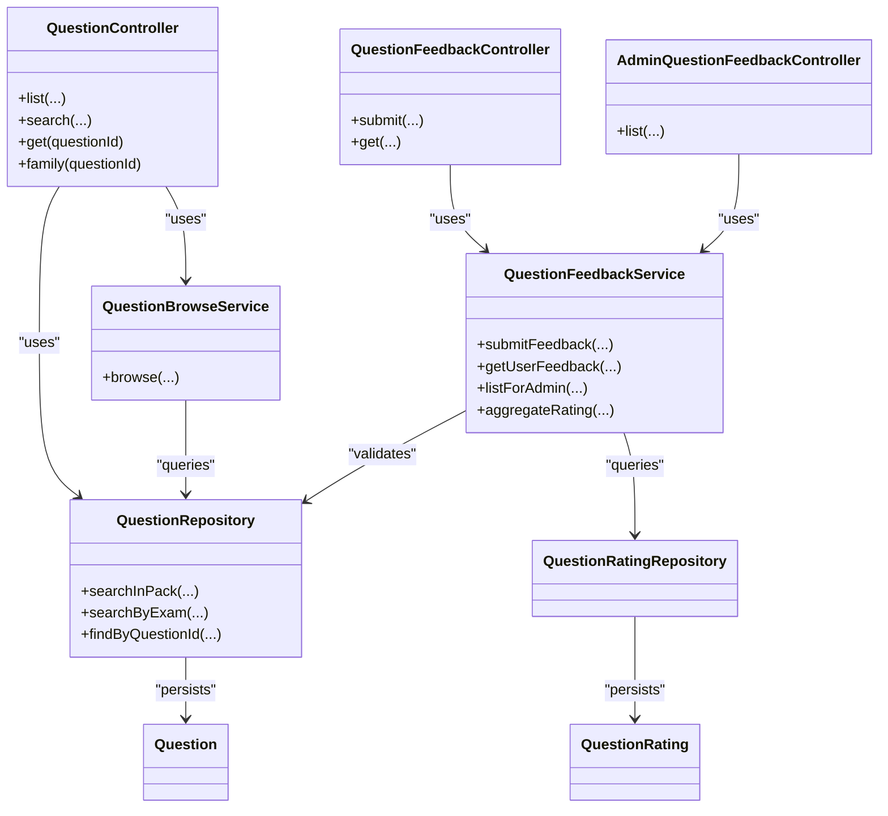

# Question Bank Endpoints

<cite>
**Referenced Files in This Document**
- [QuestionController.java](file://backend/src/main/java/com/neetlu/examhunt/web/QuestionController.java)
- [QuestionBrowseService.java](file://backend/src/main/java/com/neetlu/examhunt/service/QuestionBrowseService.java)
- [QuestionRepository.java](file://backend/src/main/java/com/neetlu/examhunt/repository/QuestionRepository.java)
- [Question.java](file://backend/src/main/java/com/neetlu/examhunt/model/Question.java)
- [QuestionFeedbackController.java](file://backend/src/main/java/com/neetlu/examhunt/web/QuestionFeedbackController.java)
- [AdminQuestionFeedbackController.java](file://backend/src/main/java/com/neetlu/examhunt/web/AdminQuestionFeedbackController.java)
- [QuestionFeedbackService.java](file://backend/src/main/java/com/neetlu/examhunt/service/QuestionFeedbackService.java)
- [QuestionRating.java](file://backend/src/main/java/com/neetlu/examhunt/model/QuestionRating.java)
- [QuestionRatingRepository.java](file://backend/src/main/java/com/neetlu/examhunt/repository/QuestionRatingRepository.java)
- [api.ts](file://frontend/src/api.ts)
- [BankSearchSection.tsx](file://frontend/src/components/BankSearchSection.tsx)
- [BrowsePage.tsx](file://frontend/src/pages/BrowsePage.tsx)
</cite>

## Table of Contents
1. [Introduction](#introduction)
2. [Project Structure](#project-structure)
3. [Core Components](#core-components)
4. [Architecture Overview](#architecture-overview)
5. [Detailed Component Analysis](#detailed-component-analysis)
6. [Dependency Analysis](#dependency-analysis)
7. [Performance Considerations](#performance-considerations)
8. [Troubleshooting Guide](#troubleshooting-guide)
9. [Conclusion](#conclusion)
10. [Appendices](#appendices)

## Introduction
This document describes the question bank API endpoints for browsing, searching, viewing details, and managing feedback for questions. It covers:
- Endpoints for listing questions with filters and pagination
- Search by query across packs or exams
- Viewing question details and related variants
- Managing question feedback (ratings and comments)
- Pagination parameters, filtering options, sorting behavior, and response formats
- Examples of typical queries and filtering combinations

## Project Structure
The question bank functionality spans backend controllers, services, repositories, and models, with frontend APIs and UI components that drive requests and render results.

**Diagram sources**
- [QuestionController.java:24-90](file://backend/src/main/java/com/neetlu/examhunt/web/QuestionController.java#L24-L90)
- [QuestionBrowseService.java:16-69](file://backend/src/main/java/com/neetlu/examhunt/service/QuestionBrowseService.java#L16-L69)
- [QuestionRepository.java:13-65](file://backend/src/main/java/com/neetlu/examhunt/repository/QuestionRepository.java#L13-L65)
- [Question.java:12-15](file://backend/src/main/java/com/neetlu/examhunt/model/Question.java#L12-L15)
- [api.ts:515-554](file://frontend/src/api.ts#L515-L554)

**Section sources**
- [QuestionController.java:24-90](file://backend/src/main/java/com/neetlu/examhunt/web/QuestionController.java#L24-L90)
- [QuestionBrowseService.java:16-69](file://backend/src/main/java/com/neetlu/examhunt/service/QuestionBrowseService.java#L16-L69)
- [QuestionRepository.java:13-65](file://backend/src/main/java/com/neetlu/examhunt/repository/QuestionRepository.java#L13-L65)
- [Question.java:12-15](file://backend/src/main/java/com/neetlu/examhunt/model/Question.java#L12-L15)
- [api.ts:515-554](file://frontend/src/api.ts#L515-L554)

## Core Components
- QuestionController: Exposes REST endpoints for listing, searching, retrieving details, and variant families.
- QuestionBrowseService: Implements filtering and pagination logic for browsing questions.
- QuestionRepository: Provides MongoDB queries for browsing and searching.
- Question: Domain model representing question documents.
- QuestionFeedbackController and AdminQuestionFeedbackController: Manage user feedback and admin review.
- QuestionFeedbackService: Handles feedback submission, aggregation, and admin listing.
- QuestionRating and QuestionRatingRepository: Feedback persistence and queries.

**Section sources**
- [QuestionController.java:24-90](file://backend/src/main/java/com/neetlu/examhunt/web/QuestionController.java#L24-L90)
- [QuestionBrowseService.java:16-69](file://backend/src/main/java/com/neetlu/examhunt/service/QuestionBrowseService.java#L16-L69)
- [QuestionRepository.java:13-65](file://backend/src/main/java/com/neetlu/examhunt/repository/QuestionRepository.java#L13-L65)
- [Question.java:12-15](file://backend/src/main/java/com/neetlu/examhunt/model/Question.java#L12-L15)
- [QuestionFeedbackController.java:12-43](file://backend/src/main/java/com/neetlu/examhunt/web/QuestionFeedbackController.java#L12-L43)
- [AdminQuestionFeedbackController.java:12-34](file://backend/src/main/java/com/neetlu/examhunt/web/AdminQuestionFeedbackController.java#L12-L34)
- [QuestionFeedbackService.java:24-110](file://backend/src/main/java/com/neetlu/examhunt/service/QuestionFeedbackService.java#L24-L110)
- [QuestionRating.java:9-11](file://backend/src/main/java/com/neetlu/examhunt/model/QuestionRating.java#L9-L11)
- [QuestionRatingRepository.java:11-16](file://backend/src/main/java/com/neetlu/examhunt/repository/QuestionRatingRepository.java#L11-L16)

## Architecture Overview
The question bank API follows a layered architecture:
- Controllers expose endpoints and handle request validation.
- Services encapsulate business logic for browsing and feedback.
- Repositories abstract database queries.
- Models define the persisted question and rating entities.

**Diagram sources**
- [QuestionController.java:42-57](file://backend/src/main/java/com/neetlu/examhunt/web/QuestionController.java#L42-L57)
- [QuestionBrowseService.java:25-69](file://backend/src/main/java/com/neetlu/examhunt/service/QuestionBrowseService.java#L25-L69)
- [QuestionRepository.java:19-65](file://backend/src/main/java/com/neetlu/examhunt/repository/QuestionRepository.java#L19-L65)
- [api.ts:515-536](file://frontend/src/api.ts#L515-L536)

## Detailed Component Analysis

### Endpoint Catalog

#### GET /api/questions
- Purpose: Browse questions with filters and pagination.
- Authentication: Not specified in controller; typically requires authentication depending on deployment policy.
- Query parameters:
  - Required:
    - packId: string
  - Optional:
    - subject: string
    - chapter: string
    - topic: string
    - difficulty: string (comma-separated: Easy, Medium, Hard)
    - q: string (free-text search across preview, subject, chapter, topic)
    - page: integer (default 0)
    - size: integer (default 24, max 100)
- Sorting: By questionNo ascending.
- Response: Page<QuestionPublic>
- Notes:
  - Filters are applied as exact matches (case-insensitive regex) for subject/chapter/topic.
  - difficulty supports comma-separated values; invalid values are ignored.
  - Free-text search q matches questionTextPreview, subject, chapter, topic (case-insensitive).

Example request:
- GET /api/questions?packId=NEET_2024&subject=Physics&page=0&size=24

Example response (excerpt):
- content: [QuestionPublic, ...]
- totalElements: number
- totalPages: number
- number: number
- size: number

**Section sources**
- [QuestionController.java:42-57](file://backend/src/main/java/com/neetlu/examhunt/web/QuestionController.java#L42-L57)
- [QuestionBrowseService.java:25-69](file://backend/src/main/java/com/neetlu/examhunt/service/QuestionBrowseService.java#L25-L69)
- [QuestionRepository.java:24-31](file://backend/src/main/java/com/neetlu/examhunt/repository/QuestionRepository.java#L24-L31)
- [api.ts:515-536](file://frontend/src/api.ts#L515-L536)

#### GET /api/questions/search
- Purpose: Search questions globally by query string, optionally scoped to a pack or exam.
- Authentication: Not specified in controller; typically requires authentication.
- Query parameters:
  - Required:
    - q: string (non-blank)
  - Optional:
    - exam: string (default NEET)
    - packId: string (when provided, restricts search to pack)
    - page: integer (default 0)
    - size: integer (default 24, max 100)
- Sorting: By year descending, then questionNo ascending.
- Response: Page<QuestionPublic>
- Behavior:
  - Validates q is present.
  - Uses repository searchInPack or searchByExam depending on packId presence.

Example request:
- GET /api/questions/search?q=kinematics&exam=NEET&page=0&size=24

**Section sources**
- [QuestionController.java:59-78](file://backend/src/main/java/com/neetlu/examhunt/web/QuestionController.java#L59-L78)
- [QuestionRepository.java:45-65](file://backend/src/main/java/com/neetlu/examhunt/repository/QuestionRepository.java#L45-L65)
- [api.ts:1126-1139](file://frontend/src/api.ts#L1126-L1139)

#### GET /api/questions/{questionId}
- Purpose: Retrieve detailed question view (includes answer and extended metadata).
- Authentication: Not specified in controller; typically requires authentication.
- Path parameter:
  - questionId: string
- Response: QuestionDetail
- Behavior:
  - Loads question by questionId.
  - Enriches variant info from disk via manifest service.
  - Returns QuestionDetail with answer and solution previews/images.

Example request:
- GET /api/questions/NEET_2023_Q50

**Section sources**
- [QuestionController.java:84-90](file://backend/src/main/java/com/neetlu/examhunt/web/QuestionController.java#L84-L90)
- [api.ts:538-540](file://frontend/src/api.ts#L538-L540)

#### GET /api/questions/{questionId}/family
- Purpose: Get the question family (original PYQ + up to five QC-approved AI variants).
- Authentication: Not specified in controller; typically requires authentication.
- Path parameter:
  - questionId: string
- Response: QuestionFamily
  - Fields: parentQuestionId, paperQuestionNo, activeQuestionId, pyq (QuestionPublic), variants (list of variant refs)
- Behavior:
  - Determines parent ID (self if no parent).
  - Retrieves variants ordered by variantNo asc.
  - Builds variantRefs with minimal metadata.

Example request:
- GET /api/questions/NEET_2023_Q50/family

**Section sources**
- [QuestionController.java:93-121](file://backend/src/main/java/com/neetlu/examhunt/web/QuestionController.java#L93-L121)
- [api.ts:542-554](file://frontend/src/api.ts#L542-L554)

#### PUT /api/questions/{questionId}/feedback
- Purpose: Submit user feedback/rating for a question.
- Authentication: Requires authenticated user (via @AuthenticationPrincipal).
- Path parameter:
  - questionId: string
- Request body: FeedbackBody
  - Fields: score (integer 0–5), comment (string), category (enum), context (enum)
- Response: QuestionFeedbackService.FeedbackView
  - Includes yourScore, comment, category, context, and aggregate rating.
- Validation:
  - At least one of score or comment length ≥ 3 is required.
  - Score must be within 1–5 when provided.
  - Category must be one of general, wrong_answer, typo, image_issue, ai_variant, other.
  - Context normalized to solve, practice, test.

Example request:
- PUT /api/questions/NEET_2023_Q50/feedback
- Body: { "score": 5, "comment": "Great explanation", "category": "general", "context": "practice" }

**Section sources**
- [QuestionFeedbackController.java:22-34](file://backend/src/main/java/com/neetlu/examhunt/web/QuestionFeedbackController.java#L22-L34)
- [QuestionFeedbackService.java:42-69](file://backend/src/main/java/com/neetlu/examhunt/service/QuestionFeedbackService.java#L42-L69)
- [QuestionFeedbackService.java:165-189](file://backend/src/main/java/com/neetlu/examhunt/service/QuestionFeedbackService.java#L165-L189)
- [api.ts:962-978](file://frontend/src/api.ts#L962-L978)

#### GET /api/questions/{questionId}/feedback
- Purpose: Retrieve user’s feedback and aggregate rating for a question.
- Authentication: Requires authenticated user.
- Path parameter:
  - questionId: string
- Response: QuestionFeedbackService.FeedbackView
  - If no user feedback exists, returns empty feedback with aggregate.

Example request:
- GET /api/questions/NEET_2023_Q50/feedback

**Section sources**
- [QuestionFeedbackController.java:36-40](file://backend/src/main/java/com/neetlu/examhunt/web/QuestionFeedbackController.java#L36-L40)
- [QuestionFeedbackService.java:71-76](file://backend/src/main/java/com/neetlu/examhunt/service/QuestionFeedbackService.java#L71-L76)
- [api.ts:980-984](file://frontend/src/api.ts#L980-L984)

#### GET /api/admin/question-feedback
- Purpose: Admin endpoint to list feedback with optional question filter.
- Authentication: Requires admin access via @AuthenticationPrincipal and X-Admin-Key header.
- Query parameters:
  - questionId: string (optional)
  - page: integer (default 0)
  - size: integer (default 25, min 1, max 100)
- Response: QuestionFeedbackService.AdminFeedbackPage
  - Items: AdminFeedbackRow with user and question metadata.
  - Metadata: total, totalPages, page, size.

Example request:
- GET /api/admin/question-feedback?page=0&size=25

**Section sources**
- [AdminQuestionFeedbackController.java:25-34](file://backend/src/main/java/com/neetlu/examhunt/web/AdminQuestionFeedbackController.java#L25-L34)
- [QuestionFeedbackService.java:78-100](file://backend/src/main/java/com/neetlu/examhunt/service/QuestionFeedbackService.java#L78-L100)

### Data Schemas

#### QuestionPublic
- Fields: questionId, packId, questionNo, exam, year, subject, chapter, topic, difficulty, hasSolution, answerOnly, questionImageUrl, solutionImageUrl, questionTextPreview, options, sourceType, parentQuestionId, variantNo, variantType
- Notes: Options mapped from McqOption to id/text pairs.

#### QuestionDetail
- Extends QuestionPublic with: answer, subtopic, concepts, hasDiagram, hasEquation, formulaRelevant, solutionTextPreview, questionFormat, assertion, reason, statements, matchListA, matchListB, questionDiagramSvg, solutionDiagramSvg
- Notes: Includes answer and solution previews/images; excludes solution images when not renderable.

#### QuestionFamily
- Fields: parentQuestionId, paperQuestionNo, activeQuestionId, pyq (QuestionPublic), variants (list of VariantRef)
- VariantRef: questionId, variantNo, variantType, difficulty, hasSolution, questionTextPreview

#### Feedback Views
- FeedbackBody: score, comment, category, context
- QuestionFeedbackService.FeedbackView: yourScore, comment, category, context, aggregate (count, average)
- AdminFeedbackRow: id, questionId, userId, userEmail, score, comment, category, context, ratedAt, exam, year, questionNo, subject, packId, variantNo
- AdminFeedbackPage: items, total, totalPages, page, size

**Section sources**
- [QuestionController.java:124-194](file://backend/src/main/java/com/neetlu/examhunt/web/QuestionController.java#L124-L194)
- [QuestionController.java:197-271](file://backend/src/main/java/com/neetlu/examhunt/web/QuestionController.java#L197-L271)
- [QuestionController.java:181-194](file://backend/src/main/java/com/neetlu/examhunt/web/QuestionController.java#L181-L194)
- [QuestionFeedbackService.java:195-219](file://backend/src/main/java/com/neetlu/examhunt/service/QuestionFeedbackService.java#L195-L219)

### Filtering and Search Logic

#### Browse Filters (GET /api/questions)
- subject, chapter, topic: exact-field match (case-insensitive regex anchored).
- difficulty: comma-separated values; supported: Easy, Medium, Hard. Invalid values ignored.
- q: free-text search across questionTextPreview, subject, chapter, topic (case-insensitive).

**Diagram sources**
- [QuestionBrowseService.java:34-68](file://backend/src/main/java/com/neetlu/examhunt/service/QuestionBrowseService.java#L34-L68)

**Section sources**
- [QuestionBrowseService.java:25-100](file://backend/src/main/java/com/neetlu/examhunt/service/QuestionBrowseService.java#L25-L100)

#### Search (GET /api/questions/search)
- If packId provided: searchInPack(packId, regex(q)).
- Else: searchByExam(exam, regex(q)).
- Sorting: year desc, then questionNo asc.

**Section sources**
- [QuestionController.java:59-78](file://backend/src/main/java/com/neetlu/examhunt/web/QuestionController.java#L59-L78)
- [QuestionRepository.java:45-65](file://backend/src/main/java/com/neetlu/examhunt/repository/QuestionRepository.java#L45-L65)

### Pagination and Limits
- page: zero-based index (default 0).
- size: default 24; capped at 100 in both browse and search endpoints.
- Browse sorts by questionNo ascending.
- Search sorts by year descending, then questionNo ascending.

**Section sources**
- [QuestionController.java:50-51](file://backend/src/main/java/com/neetlu/examhunt/web/QuestionController.java#L50-L51)
- [QuestionController.java:64-65](file://backend/src/main/java/com/neetlu/examhunt/web/QuestionController.java#L64-L65)

### Related Content Retrieval
- Family endpoint aggregates variants for the same paper question (parent) and returns minimal variant metadata.
- Detail endpoint enriches question with answer and solution assets.

**Section sources**
- [QuestionController.java:93-121](file://backend/src/main/java/com/neetlu/examhunt/web/QuestionController.java#L93-L121)
- [QuestionController.java:84-90](file://backend/src/main/java/com/neetlu/examhunt/web/QuestionController.java#L84-L90)

### Frontend Integration
- Frontend API module exposes typed helpers for:
  - fetchQuestions: wraps GET /api/questions with filters and pagination.
  - searchQuestions: wraps GET /api/questions/search.
  - fetchQuestion: GET /api/questions/{questionId}.
  - fetchQuestionFamily: GET /api/questions/{questionId}/family.
  - submitQuestionFeedback and fetchQuestionFeedback: manage user feedback.
- UI components:
  - BankSearchSection: drives search and suggestions.
  - BrowsePage: legacy redirect to practice hub with defaults.

**Section sources**
- [api.ts:515-554](file://frontend/src/api.ts#L515-L554)
- [api.ts:1126-1139](file://frontend/src/api.ts#L1126-L1139)
- [BankSearchSection.tsx:11-37](file://frontend/src/components/BankSearchSection.tsx#L11-L37)
- [BrowsePage.tsx:1-13](file://frontend/src/pages/BrowsePage.tsx#L1-L13)

## Dependency Analysis

**Diagram sources**
- [QuestionController.java:24-90](file://backend/src/main/java/com/neetlu/examhunt/web/QuestionController.java#L24-L90)
- [QuestionBrowseService.java:16-69](file://backend/src/main/java/com/neetlu/examhunt/service/QuestionBrowseService.java#L16-L69)
- [QuestionRepository.java:13-65](file://backend/src/main/java/com/neetlu/examhunt/repository/QuestionRepository.java#L13-L65)
- [QuestionFeedbackController.java:12-43](file://backend/src/main/java/com/neetlu/examhunt/web/QuestionFeedbackController.java#L12-L43)
- [AdminQuestionFeedbackController.java:12-34](file://backend/src/main/java/com/neetlu/examhunt/web/AdminQuestionFeedbackController.java#L12-L34)
- [QuestionFeedbackService.java:24-110](file://backend/src/main/java/com/neetlu/examhunt/service/QuestionFeedbackService.java#L24-L110)
- [QuestionRatingRepository.java:11-16](file://backend/src/main/java/com/neetlu/examhunt/repository/QuestionRatingRepository.java#L11-L16)
- [Question.java:12-15](file://backend/src/main/java/com/neetlu/examhunt/model/Question.java#L12-L15)
- [QuestionRating.java:9-11](file://backend/src/main/java/com/neetlu/examhunt/model/QuestionRating.java#L9-L11)

**Section sources**
- [QuestionController.java:24-90](file://backend/src/main/java/com/neetlu/examhunt/web/QuestionController.java#L24-L90)
- [QuestionBrowseService.java:16-69](file://backend/src/main/java/com/neetlu/examhunt/service/QuestionBrowseService.java#L16-L69)
- [QuestionRepository.java:13-65](file://backend/src/main/java/com/neetlu/examhunt/repository/QuestionRepository.java#L13-L65)
- [QuestionFeedbackController.java:12-43](file://backend/src/main/java/com/neetlu/examhunt/web/QuestionFeedbackController.java#L12-L43)
- [AdminQuestionFeedbackController.java:12-34](file://backend/src/main/java/com/neetlu/examhunt/web/AdminQuestionFeedbackController.java#L12-L34)
- [QuestionFeedbackService.java:24-110](file://backend/src/main/java/com/neetlu/examhunt/service/QuestionFeedbackService.java#L24-L110)
- [QuestionRatingRepository.java:11-16](file://backend/src/main/java/com/neetlu/examhunt/repository/QuestionRatingRepository.java#L11-L16)
- [Question.java:12-15](file://backend/src/main/java/com/neetlu/examhunt/model/Question.java#L12-L15)
- [QuestionRating.java:9-11](file://backend/src/main/java/com/neetlu/examhunt/model/QuestionRating.java#L9-L11)

## Performance Considerations
- Pagination limits: size capped at 100 to prevent heavy loads.
- Indexes: Compound indexes on packId+questionNo and packId+subject+chapter improve browse performance.
- Regex search: Free-text search uses regex; keep queries concise to reduce scan cost.
- Family retrieval: Variants retrieved by parent and ordered by variantNo; ensure parentQuestionId is indexed.
- Caching: Frontend caches certain family and detail requests to reduce repeated network calls.

[No sources needed since this section provides general guidance]

## Troubleshooting Guide
- 400 Bad Request:
  - Search endpoint requires q; empty or blank query throws an error.
  - Feedback submission requires either a valid score (1–5) or a non-empty comment (≥3 chars).
  - Invalid feedback category or context triggers a bad request.
- 404 Not Found:
  - Question not found when retrieving detail or family.
  - Question not found when submitting feedback.
- 401 Unauthorized:
  - Accessing admin feedback endpoint without proper credentials.
- 403 Forbidden:
  - Admin endpoint access denied; ensure admin key and principal are provided.

**Section sources**
- [QuestionController.java:67-69](file://backend/src/main/java/com/neetlu/examhunt/web/QuestionController.java#L67-L69)
- [QuestionController.java:86-88](file://backend/src/main/java/com/neetlu/examhunt/web/QuestionController.java#L86-L88)
- [QuestionController.java:95-100](file://backend/src/main/java/com/neetlu/examhunt/web/QuestionController.java#L95-L100)
- [QuestionFeedbackService.java:50-56](file://backend/src/main/java/com/neetlu/examhunt/service/QuestionFeedbackService.java#L50-L56)
- [QuestionFeedbackService.java:112-115](file://backend/src/main/java/com/neetlu/examhunt/service/QuestionFeedbackService.java#L112-L115)
- [AdminQuestionFeedbackController.java:32-33](file://backend/src/main/java/com/neetlu/examhunt/web/AdminQuestionFeedbackController.java#L32-L33)

## Conclusion
The question bank API provides robust browsing, searching, and feedback mechanisms with clear pagination, filtering, and variant handling. Clients should leverage the provided frontend helpers and adhere to the documented constraints for optimal performance and reliability.

[No sources needed since this section summarizes without analyzing specific files]

## Appendices

### Example Queries and Combinations
- Browse by subject and difficulty:
  - GET /api/questions?packId=NEET_2024&subject=Physics&difficulty=Easy,Medium&page=0&size=24
- Search within a pack:
  - GET /api/questions/search?q=kinematics&packId=NEET_2024&page=0&size=24
- Search across an exam:
  - GET /api/questions/search?q=organic&page=0&size=24
- View question details:
  - GET /api/questions/NEET_2023_Q50
- View question family:
  - GET /api/questions/NEET_2023_Q50/family
- Submit feedback:
  - PUT /api/questions/NEET_2023_Q50/feedback with body { score, comment, category, context }
- Fetch user feedback:
  - GET /api/questions/NEET_2023_Q50/feedback

**Section sources**
- [api.ts:515-554](file://frontend/src/api.ts#L515-L554)
- [api.ts:1126-1139](file://frontend/src/api.ts#L1126-L1139)
- [api.ts:962-984](file://frontend/src/api.ts#L962-L984)