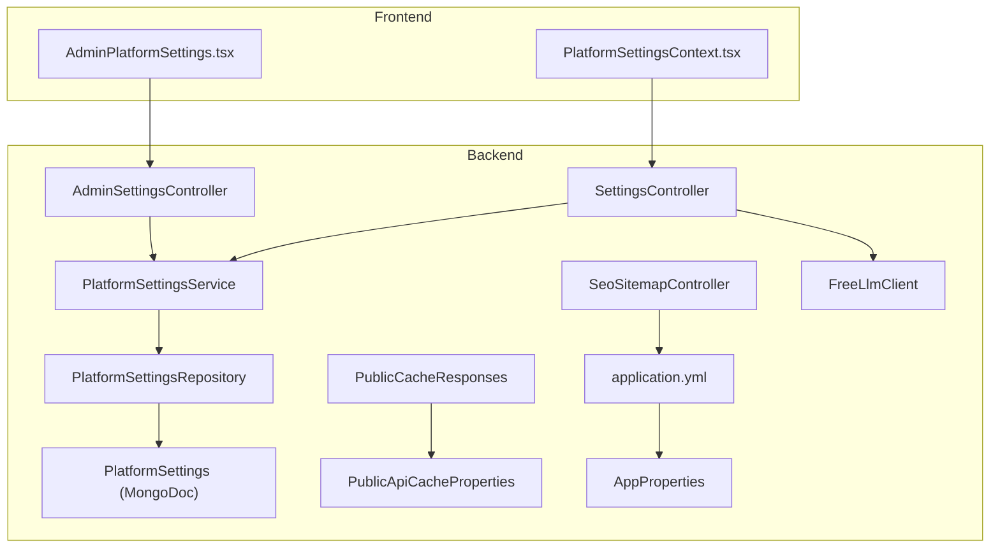
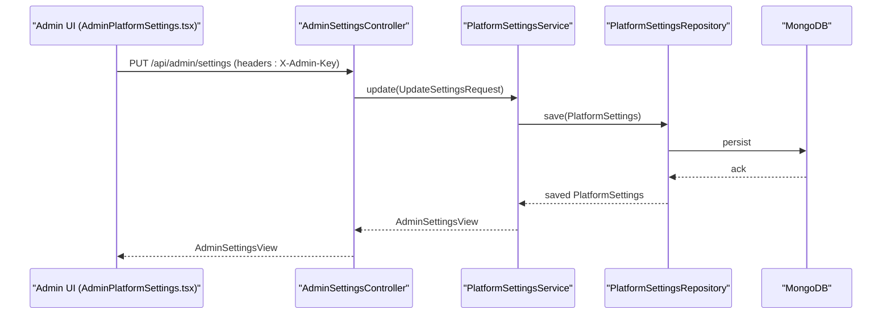
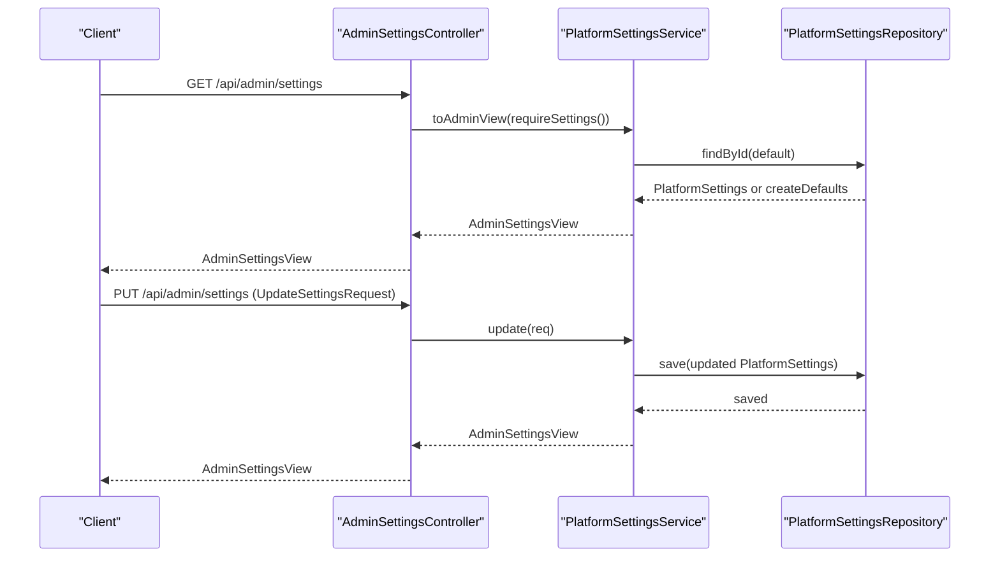
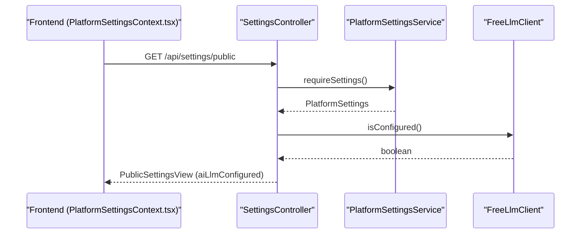
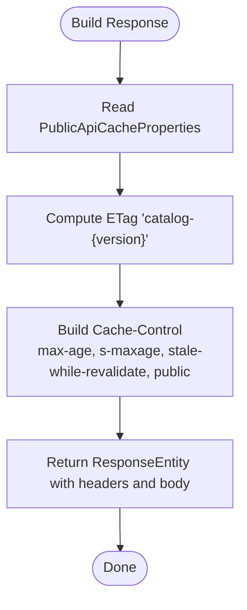
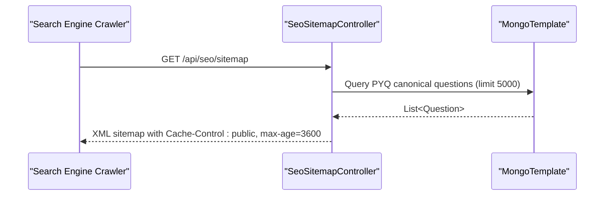
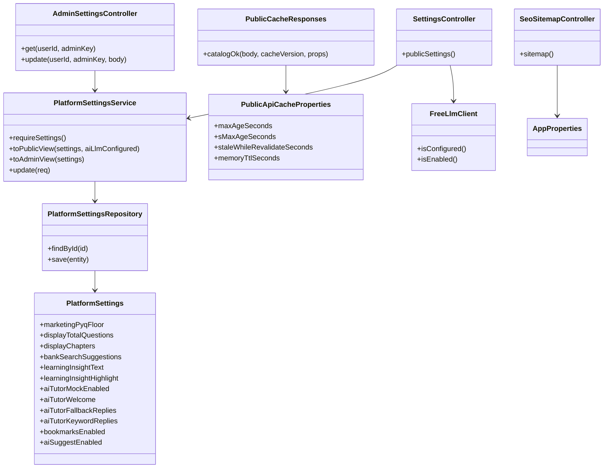

# System Settings and Configuration Endpoints

<cite>
**Referenced Files in This Document**
- [AdminSettingsController.java](file://backend/src/main/java/com/neetlu/examhunt/web/AdminSettingsController.java)
- [SettingsController.java](file://backend/src/main/java/com/neetlu/examhunt/web/SettingsController.java)
- [PlatformSettingsService.java](file://backend/src/main/java/com/neetlu/examhunt/service/PlatformSettingsService.java)
- [PlatformSettings.java](file://backend/src/main/java/com/neetlu/examhunt/model/PlatformSettings.java)
- [PlatformSettingsRepository.java](file://backend/src/main/java/com/neetlu/examhunt/repository/PlatformSettingsRepository.java)
- [PublicCacheResponses.java](file://backend/src/main/java/com/neetlu/examhunt/web/PublicCacheResponses.java)
- [PublicApiCacheProperties.java](file://backend/src/main/java/com/neetlu/examhunt/config/PublicApiCacheProperties.java)
- [SeoSitemapController.java](file://backend/src/main/java/com/neetlu/examhunt/web/SeoSitemapController.java)
- [application.yml](file://backend/src/main/resources/application.yml)
- [AppProperties.java](file://backend/src/main/java/com/neetlu/examhunt/config/AppProperties.java)
- [FreeLlmClient.java](file://backend/src/main/java/com/neetlu/examhunt/service/FreeLlmClient.java)
- [PlatformSettingsContext.tsx](file://frontend/src/settings/PlatformSettingsContext.tsx)
- [AdminPlatformSettings.tsx](file://frontend/src/components/AdminPlatformSettings.tsx)
</cite>

## Table of Contents
1. [Introduction](#introduction)
2. [Project Structure](#project-structure)
3. [Core Components](#core-components)
4. [Architecture Overview](#architecture-overview)
5. [Detailed Component Analysis](#detailed-component-analysis)
6. [Dependency Analysis](#dependency-analysis)
7. [Performance Considerations](#performance-considerations)
8. [Troubleshooting Guide](#troubleshooting-guide)
9. [Conclusion](#conclusion)
10. [Appendices](#appendices)

## Introduction
This document describes the system settings and configuration endpoints that control platform-wide behavior, cache policies, and SEO-related features. It covers:
- Platform settings endpoints for administrators and public consumption
- Cache management for public catalog responses
- SEO sitemap generation for question URLs
- Configuration options, defaults, validation, and inheritance
- Examples of configuration updates and public data access patterns

## Project Structure
The settings and configuration functionality spans backend controllers, services, models, repositories, configuration properties, and frontend consumers.

**Diagram sources**
- [AdminSettingsController.java:14-41](file://backend/src/main/java/com/neetlu/examhunt/web/AdminSettingsController.java#L14-L41)
- [SettingsController.java:10-26](file://backend/src/main/java/com/neetlu/examhunt/web/SettingsController.java#L10-L26)
- [PlatformSettingsService.java:11-95](file://backend/src/main/java/com/neetlu/examhunt/service/PlatformSettingsService.java#L11-L95)
- [PlatformSettings.java:12-148](file://backend/src/main/java/com/neetlu/examhunt/model/PlatformSettings.java#L12-L148)
- [PlatformSettingsRepository.java](file://backend/src/main/java/com/neetlu/examhunt/repository/PlatformSettingsRepository.java#L6)
- [PublicCacheResponses.java:10-22](file://backend/src/main/java/com/neetlu/examhunt/web/PublicCacheResponses.java#L10-L22)
- [PublicApiCacheProperties.java:6-31](file://backend/src/main/java/com/neetlu/examhunt/config/PublicApiCacheProperties.java#L6-L31)
- [SeoSitemapController.java:23-69](file://backend/src/main/java/com/neetlu/examhunt/web/SeoSitemapController.java#L23-L69)
- [application.yml:11-31](file://backend/src/main/resources/application.yml#L11-L31)
- [AppProperties.java:5-23](file://backend/src/main/java/com/neetlu/examhunt/config/AppProperties.java#L5-L23)
- [FreeLlmClient.java:30-69](file://backend/src/main/java/com/neetlu/examhunt/service/FreeLlmClient.java#L30-L69)
- [PlatformSettingsContext.tsx:10-49](file://frontend/src/settings/PlatformSettingsContext.tsx#L10-L49)
- [AdminPlatformSettings.tsx:5-114](file://frontend/src/components/AdminPlatformSettings.tsx#L5-L114)

**Section sources**
- [AdminSettingsController.java:14-41](file://backend/src/main/java/com/neetlu/examhunt/web/AdminSettingsController.java#L14-L41)
- [SettingsController.java:10-26](file://backend/src/main/java/com/neetlu/examhunt/web/SettingsController.java#L10-L26)
- [PlatformSettingsService.java:11-95](file://backend/src/main/java/com/neetlu/examhunt/service/PlatformSettingsService.java#L11-L95)
- [PlatformSettings.java:12-148](file://backend/src/main/java/com/neetlu/examhunt/model/PlatformSettings.java#L12-L148)
- [PublicCacheResponses.java:10-22](file://backend/src/main/java/com/neetlu/examhunt/web/PublicCacheResponses.java#L10-L22)
- [PublicApiCacheProperties.java:6-31](file://backend/src/main/java/com/neetlu/examhunt/config/PublicApiCacheProperties.java#L6-L31)
- [SeoSitemapController.java:23-69](file://backend/src/main/java/com/neetlu/examhunt/web/SeoSitemapController.java#L23-L69)
- [application.yml:11-31](file://backend/src/main/resources/application.yml#L11-L31)
- [AppProperties.java:5-23](file://backend/src/main/java/com/neetlu/examhunt/config/AppProperties.java#L5-L23)
- [FreeLlmClient.java:30-69](file://backend/src/main/java/com/neetlu/examhunt/service/FreeLlmClient.java#L30-L69)
- [PlatformSettingsContext.tsx:10-49](file://frontend/src/settings/PlatformSettingsContext.tsx#L10-L49)
- [AdminPlatformSettings.tsx:5-114](file://frontend/src/components/AdminPlatformSettings.tsx#L5-L114)

## Core Components
- AdminSettingsController: Exposes GET /api/admin/settings (returns admin view) and PUT /api/admin/settings (updates settings) with admin key header validation.
- SettingsController: Exposes GET /api/settings/public (returns public view) including AI LLM availability status.
- PlatformSettingsService: Central business logic for settings retrieval, defaults creation, view mapping, and partial updates with validation.
- PlatformSettings: MongoDB-backed entity containing platform-wide configuration fields with sensible defaults.
- PublicCacheResponses: Utility to attach Cache-Control and ETag headers for public catalog responses.
- PublicApiCacheProperties: Typed configuration for browser, CDN, and in-process caching TTLs.
- SeoSitemapController: Generates XML sitemap of canonical PYQ question URLs for SEO indexing.
- AppProperties and application.yml: Application-wide configuration including CORS, JWT, LLM settings, and public API cache policy.
- FreeLlmClient: Determines whether AI features are configured and enabled.

**Section sources**
- [AdminSettingsController.java:14-41](file://backend/src/main/java/com/neetlu/examhunt/web/AdminSettingsController.java#L14-L41)
- [SettingsController.java:10-26](file://backend/src/main/java/com/neetlu/examhunt/web/SettingsController.java#L10-L26)
- [PlatformSettingsService.java:19-95](file://backend/src/main/java/com/neetlu/examhunt/service/PlatformSettingsService.java#L19-L95)
- [PlatformSettings.java:14-44](file://backend/src/main/java/com/neetlu/examhunt/model/PlatformSettings.java#L14-L44)
- [PublicCacheResponses.java:14-22](file://backend/src/main/java/com/neetlu/examhunt/web/PublicCacheResponses.java#L14-L22)
- [PublicApiCacheProperties.java:7-31](file://backend/src/main/java/com/neetlu/examhunt/config/PublicApiCacheProperties.java#L7-L31)
- [SeoSitemapController.java:26-69](file://backend/src/main/java/com/neetlu/examhunt/web/SeoSitemapController.java#L26-L69)
- [AppProperties.java:6-23](file://backend/src/main/java/com/neetlu/examhunt/config/AppProperties.java#L6-L23)
- [application.yml:11-31](file://backend/src/main/resources/application.yml#L11-L31)
- [FreeLlmClient.java:62-69](file://backend/src/main/java/com/neetlu/examhunt/service/FreeLlmClient.java#L62-L69)

## Architecture Overview
The system separates administrative configuration from public consumption. Administrators use admin endpoints to modify settings; clients consume public endpoints for UI behavior and content.

**Diagram sources**
- [AdminPlatformSettings.tsx:80-114](file://frontend/src/components/AdminPlatformSettings.tsx#L80-L114)
- [AdminSettingsController.java:34-41](file://backend/src/main/java/com/neetlu/examhunt/web/AdminSettingsController.java#L34-L41)
- [PlatformSettingsService.java:56-94](file://backend/src/main/java/com/neetlu/examhunt/service/PlatformSettingsService.java#L56-L94)
- [PlatformSettingsRepository.java](file://backend/src/main/java/com/neetlu/examhunt/repository/PlatformSettingsRepository.java#L6)
- [PlatformSettings.java:14-44](file://backend/src/main/java/com/neetlu/examhunt/model/PlatformSettings.java#L14-L44)

## Detailed Component Analysis

### Admin Settings Endpoints
- Endpoint: GET /api/admin/settings
  - Purpose: Returns admin view of current platform settings.
  - Authentication: Requires either a valid authenticated principal or X-Admin-Key header.
  - Response: AdminSettingsView containing PublicSettingsView plus AI tutor fallbacks and keyword replies.
- Endpoint: PUT /api/admin/settings
  - Purpose: Partially updates platform settings.
  - Authentication: Same as GET.
  - Request body: UpdateSettingsRequest supports selective field updates.
  - Validation and normalization:
    - marketingPyqFloor is forced to be non-negative.
    - displayTotalQuestions and displayChapters are reset to null if set to non-positive values.
    - Lists and maps replace existing values when provided.
  - Response: AdminSettingsView reflecting applied changes.

**Diagram sources**
- [AdminSettingsController.java:26-41](file://backend/src/main/java/com/neetlu/examhunt/web/AdminSettingsController.java#L26-L41)
- [PlatformSettingsService.java:19-95](file://backend/src/main/java/com/neetlu/examhunt/service/PlatformSettingsService.java#L19-L95)
- [PlatformSettingsRepository.java](file://backend/src/main/java/com/neetlu/examhunt/repository/PlatformSettingsRepository.java#L6)

**Section sources**
- [AdminSettingsController.java:26-41](file://backend/src/main/java/com/neetlu/examhunt/web/AdminSettingsController.java#L26-L41)
- [PlatformSettingsService.java:56-95](file://backend/src/main/java/com/neetlu/examhunt/service/PlatformSettingsService.java#L56-L95)
- [PlatformSettings.java:18-35](file://backend/src/main/java/com/neetlu/examhunt/model/PlatformSettings.java#L18-L35)

### Public Settings Endpoint
- Endpoint: GET /api/settings/public
  - Purpose: Returns PublicSettingsView for client-side UI behavior.
  - Includes computed flag indicating whether AI LLM is configured.
  - Response fields include marketing thresholds, display overrides, search suggestions, learning insights, AI tutor flags, bookmarks toggle, and AI suggest toggle.

**Diagram sources**
- [SettingsController.java:21-26](file://backend/src/main/java/com/neetlu/examhunt/web/SettingsController.java#L21-L26)
- [PlatformSettingsService.java:29-47](file://backend/src/main/java/com/neetlu/examhunt/service/PlatformSettingsService.java#L29-L47)
- [FreeLlmClient.java:62-65](file://backend/src/main/java/com/neetlu/examhunt/service/FreeLlmClient.java#L62-L65)
- [PlatformSettingsContext.tsx:40-49](file://frontend/src/settings/PlatformSettingsContext.tsx#L40-L49)

**Section sources**
- [SettingsController.java:21-26](file://backend/src/main/java/com/neetlu/examhunt/web/SettingsController.java#L21-L26)
- [PlatformSettingsService.java:29-54](file://backend/src/main/java/com/neetlu/examhunt/service/PlatformSettingsService.java#L29-L54)
- [FreeLlmClient.java:62-69](file://backend/src/main/java/com/neetlu/examhunt/service/FreeLlmClient.java#L62-L69)
- [PlatformSettingsContext.tsx:12-26](file://frontend/src/settings/PlatformSettingsContext.tsx#L12-L26)

### Cache Management for Public Responses
- PublicCacheResponses: Adds Cache-Control and ETag headers for public catalog responses.
- PublicApiCacheProperties: Defines:
  - maxAgeSeconds: browser cache duration
  - sMaxAgeSeconds: CDN/shared cache duration
  - staleWhileRevalidateSeconds: revalidation window
  - memoryTtlSeconds: in-process cache TTL for catalog queries
- Defaults are enforced if configuration values are invalid.

**Diagram sources**
- [PublicCacheResponses.java:14-22](file://backend/src/main/java/com/neetlu/examhunt/web/PublicCacheResponses.java#L14-L22)
- [PublicApiCacheProperties.java:7-31](file://backend/src/main/java/com/neetlu/examhunt/config/PublicApiCacheProperties.java#L7-L31)

**Section sources**
- [PublicCacheResponses.java:14-22](file://backend/src/main/java/com/neetlu/examhunt/web/PublicCacheResponses.java#L14-L22)
- [PublicApiCacheProperties.java:17-31](file://backend/src/main/java/com/neetlu/examhunt/config/PublicApiCacheProperties.java#L17-L31)
- [application.yml:27-31](file://backend/src/main/resources/application.yml#L27-L31)

### SEO Sitemap Generation
- Endpoint: GET /api/seo/sitemap (produces application/xml)
- Purpose: Generates XML sitemap of canonical PYQ question URLs for search engine discovery.
- Query filters: Includes questions where sourceType is "pyq" or does not exist, sorts by year descending and question number, limits to 5000 entries.
- Fields included: questionId, exam, year, subject, questionTextPreview.
- Response caching: Cache-Control header sets public max-age to 3600 seconds.

**Diagram sources**
- [SeoSitemapController.java:35-70](file://backend/src/main/java/com/neetlu/examhunt/web/SeoSitemapController.java#L35-L70)

**Section sources**
- [SeoSitemapController.java:35-70](file://backend/src/main/java/com/neetlu/examhunt/web/SeoSitemapController.java#L35-L70)

### System Configuration Options and Defaults
- PlatformSettings fields and defaults:
  - marketingPyqFloor: integer threshold for marketing display
  - displayTotalQuestions: nullable override for total questions
  - displayChapters: nullable override for chapters
  - bankSearchSuggestions: list of suggested topics
  - learningInsightText and learningInsightHighlight: UI copy for learning insights
  - aiTutorMockEnabled: legacy demo mode toggle
  - aiTutorWelcome: greeting message for AI tutor
  - aiTutorFallbackReplies: list of fallback replies
  - aiTutorKeywordReplies: map of regex-like patterns to replies
  - bookmarksEnabled: feature toggle
  - aiSuggestEnabled: AI practice coach toggle
- Defaults are embedded in the model and created automatically if missing.

**Section sources**
- [PlatformSettings.java:18-44](file://backend/src/main/java/com/neetlu/examhunt/model/PlatformSettings.java#L18-L44)

### Configuration Inheritance and Validation
- Defaults: If no settings document exists, a default instance is created and persisted.
- Validation and normalization during updates:
  - Non-negative flooring for marketingPyqFloor
  - Nulling display overrides when non-positive
  - Replacement of lists/maps when provided
- Frontend consumes PublicSettingsView and falls back to built-in defaults if API fails.

**Section sources**
- [PlatformSettingsService.java:19-27](file://backend/src/main/java/com/neetlu/examhunt/service/PlatformSettingsService.java#L19-L27)
- [PlatformSettingsService.java:56-95](file://backend/src/main/java/com/neetlu/examhunt/service/PlatformSettingsService.java#L56-L95)
- [PlatformSettingsContext.tsx:12-26](file://frontend/src/settings/PlatformSettingsContext.tsx#L12-L26)

### Public Data Access Patterns
- Frontend loads public settings via SettingsController and stores them in a React context.
- Admin UI loads admin settings, allows editing, and saves via AdminSettingsController.
- After saving, admin UI refreshes public settings to reflect changes immediately.

**Section sources**
- [PlatformSettingsContext.tsx:40-49](file://frontend/src/settings/PlatformSettingsContext.tsx#L40-L49)
- [AdminPlatformSettings.tsx:32-114](file://frontend/src/components/AdminPlatformSettings.tsx#L32-L114)

## Dependency Analysis

**Diagram sources**
- [AdminSettingsController.java:17-24](file://backend/src/main/java/com/neetlu/examhunt/web/AdminSettingsController.java#L17-L24)
- [SettingsController.java:13-19](file://backend/src/main/java/com/neetlu/examhunt/web/SettingsController.java#L13-L19)
- [PlatformSettingsService.java:13-17](file://backend/src/main/java/com/neetlu/examhunt/service/PlatformSettingsService.java#L13-L17)
- [PlatformSettingsRepository.java](file://backend/src/main/java/com/neetlu/examhunt/repository/PlatformSettingsRepository.java#L6)
- [PlatformSettings.java:14-148](file://backend/src/main/java/com/neetlu/examhunt/model/PlatformSettings.java#L14-L148)
- [PublicCacheResponses.java:14-22](file://backend/src/main/java/com/neetlu/examhunt/web/PublicCacheResponses.java#L14-L22)
- [PublicApiCacheProperties.java:7-31](file://backend/src/main/java/com/neetlu/examhunt/config/PublicApiCacheProperties.java#L7-L31)
- [SeoSitemapController.java:29-33](file://backend/src/main/java/com/neetlu/examhunt/web/SeoSitemapController.java#L29-L33)
- [AppProperties.java:6-23](file://backend/src/main/java/com/neetlu/examhunt/config/AppProperties.java#L6-L23)
- [FreeLlmClient.java:62-69](file://backend/src/main/java/com/neetlu/examhunt/service/FreeLlmClient.java#L62-L69)

**Section sources**
- [AdminSettingsController.java:17-24](file://backend/src/main/java/com/neetlu/examhunt/web/AdminSettingsController.java#L17-L24)
- [SettingsController.java:13-19](file://backend/src/main/java/com/neetlu/examhunt/web/SettingsController.java#L13-L19)
- [PlatformSettingsService.java:13-17](file://backend/src/main/java/com/neetlu/examhunt/service/PlatformSettingsService.java#L13-L17)
- [PlatformSettingsRepository.java](file://backend/src/main/java/com/neetlu/examhunt/repository/PlatformSettingsRepository.java#L6)
- [PlatformSettings.java:14-148](file://backend/src/main/java/com/neetlu/examhunt/model/PlatformSettings.java#L14-L148)
- [PublicCacheResponses.java:14-22](file://backend/src/main/java/com/neetlu/examhunt/web/PublicCacheResponses.java#L14-L22)
- [PublicApiCacheProperties.java:7-31](file://backend/src/main/java/com/neetlu/examhunt/config/PublicApiCacheProperties.java#L7-L31)
- [SeoSitemapController.java:29-33](file://backend/src/main/java/com/neetlu/examhunt/web/SeoSitemapController.java#L29-L33)
- [AppProperties.java:6-23](file://backend/src/main/java/com/neetlu/examhunt/config/AppProperties.java#L6-L23)
- [FreeLlmClient.java:62-69](file://backend/src/main/java/com/neetlu/examhunt/service/FreeLlmClient.java#L62-L69)

## Performance Considerations
- Browser and CDN caching: PublicApiCacheProperties controls max-age, s-maxage, and stale-while-revalidate to optimize latency and reduce origin load.
- In-process caching: Catalog services maintain an in-memory cache with TTL aligned to memoryTtlSeconds; invalidated on pack import via PublicCatalogCacheInvalidator.
- LLM readiness: FreeLlmClient checks configuration to avoid unnecessary failures and to gate AI features behind availability.
- Sitemap freshness: Sitemap endpoint sets a 1-hour cache to balance freshness with CDN efficiency.

**Section sources**
- [PublicApiCacheProperties.java:7-31](file://backend/src/main/java/com/neetlu/examhunt/config/PublicApiCacheProperties.java#L7-L31)
- [application.yml:27-31](file://backend/src/main/resources/application.yml#L27-L31)
- [FreeLlmClient.java:62-69](file://backend/src/main/java/com/neetlu/examhunt/service/FreeLlmClient.java#L62-L69)
- [SeoSitemapController.java:67-69](file://backend/src/main/java/com/neetlu/examhunt/web/SeoSitemapController.java#L67-L69)

## Troubleshooting Guide
- Admin endpoint requires X-Admin-Key or authenticated principal; otherwise access is denied.
- If settings document is missing, defaults are created automatically on first access.
- AI features depend on LLM configuration; if OPENAI_API_KEY or base URL is missing, AI-related UI may indicate unconfigured state.
- Public catalog responses require cache version alignment; ensure cache version increments after content changes.

**Section sources**
- [AdminSettingsController.java:29-31](file://backend/src/main/java/com/neetlu/examhunt/web/AdminSettingsController.java#L29-L31)
- [PlatformSettingsService.java:19-27](file://backend/src/main/java/com/neetlu/examhunt/service/PlatformSettingsService.java#L19-L27)
- [FreeLlmClient.java:62-69](file://backend/src/main/java/com/neetlu/examhunt/service/FreeLlmClient.java#L62-L69)

## Conclusion
The system provides a clear separation between admin-controlled platform settings and public-facing configuration consumed by the client. Robust defaults, validation, and explicit caching controls enable predictable behavior and strong performance. SEO and public data endpoints are designed for efficient distribution through CDN and browser caches.

## Appendices

### API Reference Summary

- Admin Settings
  - GET /api/admin/settings
    - Headers: X-Admin-Key (optional)
    - Response: AdminSettingsView
  - PUT /api/admin/settings
    - Headers: X-Admin-Key (optional)
    - Body: UpdateSettingsRequest (selective fields)
    - Response: AdminSettingsView

- Public Settings
  - GET /api/settings/public
    - Response: PublicSettingsView (includes aiLlmConfigured)

- SEO
  - GET /api/seo/sitemap
    - Produces: application/xml
    - Response: XML sitemap with Cache-Control: public, max-age=3600

**Section sources**
- [AdminSettingsController.java:26-41](file://backend/src/main/java/com/neetlu/examhunt/web/AdminSettingsController.java#L26-L41)
- [SettingsController.java:21-26](file://backend/src/main/java/com/neetlu/examhunt/web/SettingsController.java#L21-L26)
- [SeoSitemapController.java:35-70](file://backend/src/main/java/com/neetlu/examhunt/web/SeoSitemapController.java#L35-L70)