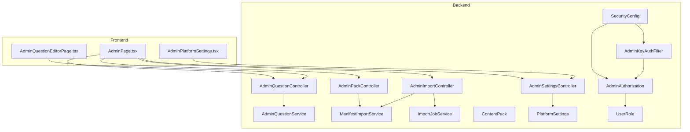
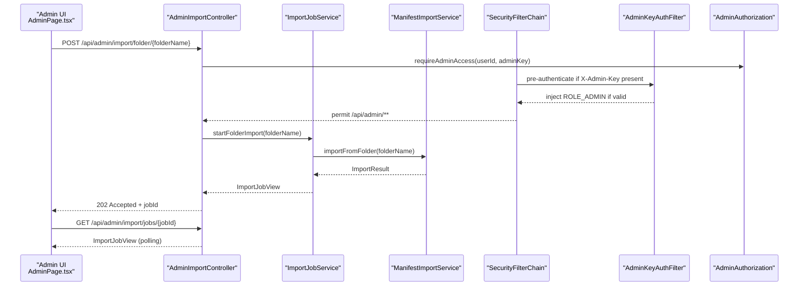
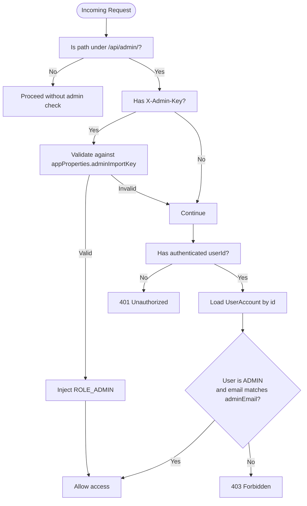
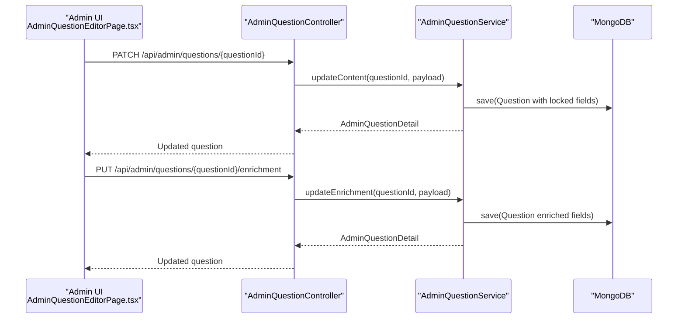
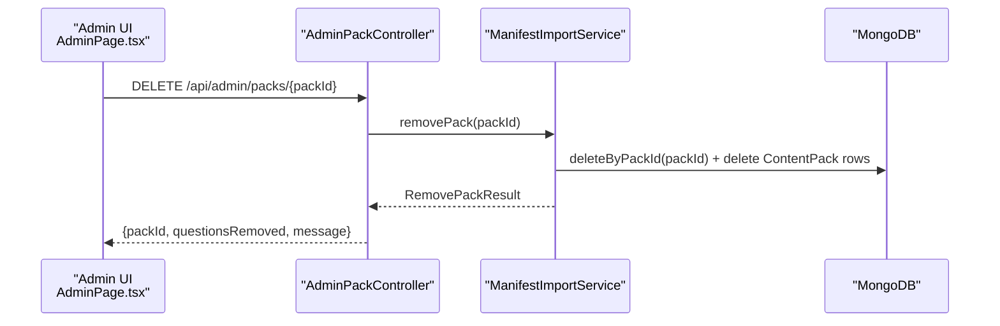
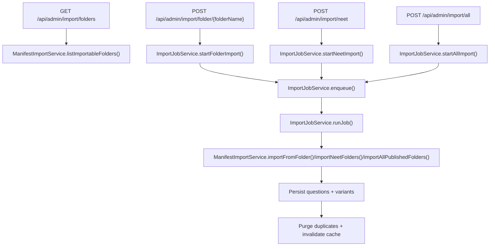
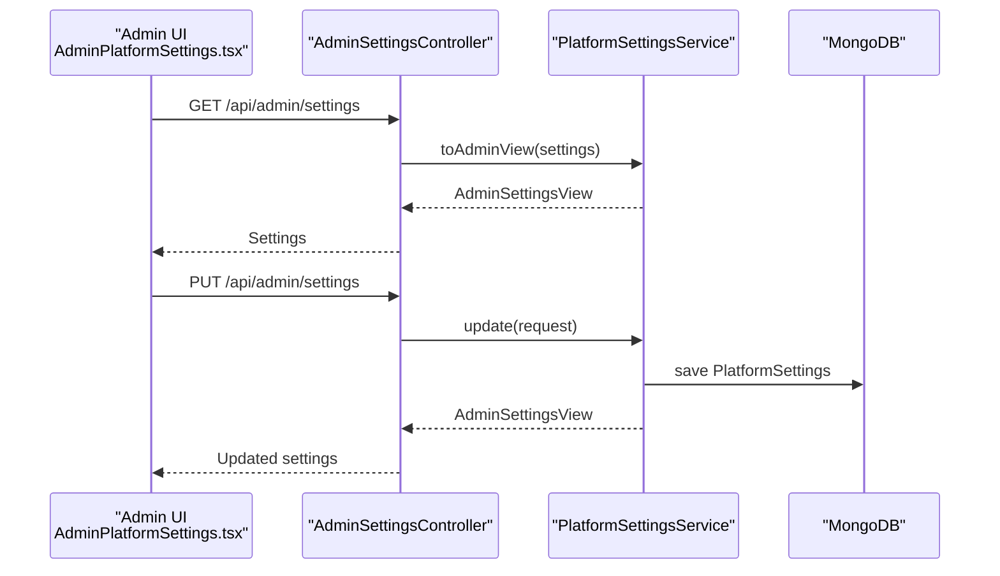
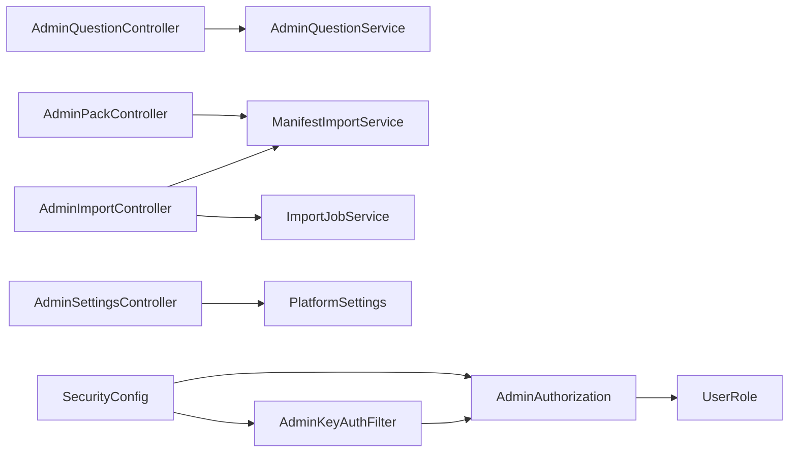

# Administrative Features

<cite>
**Referenced Files in This Document**
- [AdminQuestionController.java](file://backend/src/main/java/com/neetlu/examhunt/web/AdminQuestionController.java)
- [AdminPackController.java](file://backend/src/main/java/com/neetlu/examhunt/web/AdminPackController.java)
- [AdminImportController.java](file://backend/src/main/java/com/neetlu/examhunt/web/AdminImportController.java)
- [AdminSettingsController.java](file://backend/src/main/java/com/neetlu/examhunt/web/AdminSettingsController.java)
- [AdminAuthorization.java](file://backend/src/main/java/com/neetlu/examhunt/security/AdminAuthorization.java)
- [AdminKeyAuthFilter.java](file://backend/src/main/java/com/neetlu/examhunt/security/AdminKeyAuthFilter.java)
- [SecurityConfig.java](file://backend/src/main/java/com/neetlu/examhunt/config/SecurityConfig.java)
- [AdminQuestionService.java](file://backend/src/main/java/com/neetlu/examhunt/service/AdminQuestionService.java)
- [ManifestImportService.java](file://backend/src/main/java/com/neetlu/examhunt/service/ManifestImportService.java)
- [ImportJobService.java](file://backend/src/main/java/com/neetlu/examhunt/service/ImportJobService.java)
- [ContentPack.java](file://backend/src/main/java/com/neetlu/examhunt/model/ContentPack.java)
- [PlatformSettings.java](file://backend/src/main/java/com/neetlu/examhunt/model/PlatformSettings.java)
- [UserRole.java](file://backend/src/main/java/com/neetlu/examhunt/model/UserRole.java)
- [AdminPage.tsx](file://frontend/src/pages/AdminPage.tsx)
- [AdminPlatformSettings.tsx](file://frontend/src/components/AdminPlatformSettings.tsx)
- [AdminQuestionEditorPage.tsx](file://frontend/src/pages/AdminQuestionEditorPage.tsx)
- [application.yml](file://backend/src/main/resources/application.yml)
- [AppProperties.java](file://backend/src/main/java/com/neetlu/examhunt/config/AppProperties.java)
</cite>

## Table of Contents
1. [Introduction](#introduction)
2. [Project Structure](#project-structure)
3. [Core Components](#core-components)
4. [Architecture Overview](#architecture-overview)
5. [Detailed Component Analysis](#detailed-component-analysis)
6. [Dependency Analysis](#dependency-analysis)
7. [Performance Considerations](#performance-considerations)
8. [Troubleshooting Guide](#troubleshooting-guide)
9. [Conclusion](#conclusion)
10. [Appendices](#appendices)

## Introduction
This document explains the administrative functionality of the exam-hunt platform. It covers admin content management, including question import from PDF extractor outputs, content pack lifecycle management, user administration, and system monitoring. It also documents admin authentication and role-based access control, security measures, practical workflows for importing question banks, managing content packs, and monitoring system performance, along with quality assurance and maintenance procedures.

## Project Structure
The administrative domain spans backend REST controllers, security filters, services, and models, plus frontend admin pages and components.

**Diagram sources**
- [AdminQuestionController.java:17-71](file://backend/src/main/java/com/neetlu/examhunt/web/AdminQuestionController.java#L17-L71)
- [AdminPackController.java:23-85](file://backend/src/main/java/com/neetlu/examhunt/web/AdminPackController.java#L23-L85)
- [AdminImportController.java:19-110](file://backend/src/main/java/com/neetlu/examhunt/web/AdminImportController.java#L19-L110)
- [AdminSettingsController.java:13-43](file://backend/src/main/java/com/neetlu/examhunt/web/AdminSettingsController.java#L13-L43)
- [AdminAuthorization.java:11-85](file://backend/src/main/java/com/neetlu/examhunt/security/AdminAuthorization.java#L11-L85)
- [AdminKeyAuthFilter.java:20-50](file://backend/src/main/java/com/neetlu/examhunt/security/AdminKeyAuthFilter.java#L20-L50)
- [SecurityConfig.java:23-76](file://backend/src/main/java/com/neetlu/examhunt/config/SecurityConfig.java#L23-L76)
- [AdminQuestionService.java:22-408](file://backend/src/main/java/com/neetlu/examhunt/service/AdminQuestionService.java#L22-L408)
- [ManifestImportService.java:38-800](file://backend/src/main/java/com/neetlu/examhunt/service/ManifestImportService.java#L38-L800)
- [ImportJobService.java:19-241](file://backend/src/main/java/com/neetlu/examhunt/service/ImportJobService.java#L19-L241)
- [ContentPack.java:11-127](file://backend/src/main/java/com/neetlu/examhunt/model/ContentPack.java#L11-L127)
- [PlatformSettings.java:11-150](file://backend/src/main/java/com/neetlu/examhunt/model/PlatformSettings.java#L11-L150)
- [UserRole.java:3-7](file://backend/src/main/java/com/neetlu/examhunt/model/UserRole.java#L3-L7)
- [AdminPage.tsx:47-479](file://frontend/src/pages/AdminPage.tsx#L47-L479)
- [AdminPlatformSettings.tsx:11-276](file://frontend/src/components/AdminPlatformSettings.tsx#L11-L276)
- [AdminQuestionEditorPage.tsx:118-844](file://frontend/src/pages/AdminQuestionEditorPage.tsx#L118-L844)

**Section sources**
- [AdminQuestionController.java:17-71](file://backend/src/main/java/com/neetlu/examhunt/web/AdminQuestionController.java#L17-L71)
- [AdminPackController.java:23-85](file://backend/src/main/java/com/neetlu/examhunt/web/AdminPackController.java#L23-L85)
- [AdminImportController.java:19-110](file://backend/src/main/java/com/neetlu/examhunt/web/AdminImportController.java#L19-L110)
- [AdminSettingsController.java:13-43](file://backend/src/main/java/com/neetlu/examhunt/web/AdminSettingsController.java#L13-L43)
- [AdminPage.tsx:47-479](file://frontend/src/pages/AdminPage.tsx#L47-L479)

## Core Components
- Admin endpoints for questions, packs, imports, and settings are exposed under /api/admin and guarded by role ADMIN.
- AdminAuthorization enforces access via JWT principal or legacy X-Admin-Key header, and normalizes admin role assignment.
- AdminKeyAuthFilter injects ROLE_ADMIN when a valid legacy admin key is present, allowing scripted admin calls.
- AdminQuestionService supports search, retrieval, and editing of question content and enrichment with validation and preservation locks.
- ManifestImportService discovers importable folders (local, remote, installed), imports manifests, persists questions and variants, and purges duplicates.
- ImportJobService queues and executes import jobs asynchronously with polling-friendly status reporting.
- Frontend AdminPage orchestrates import/sync, pack listing, cleanup tasks, and analytics summaries.
- Frontend AdminPlatformSettings manages platform-wide UI and marketing settings.
- Frontend AdminQuestionEditorPage enables admin search, preview, and editing of question content and AI enrichment overrides.

**Section sources**
- [AdminAuthorization.java:44-85](file://backend/src/main/java/com/neetlu/examhunt/security/AdminAuthorization.java#L44-L85)
- [AdminKeyAuthFilter.java:32-48](file://backend/src/main/java/com/neetlu/examhunt/security/AdminKeyAuthFilter.java#L32-L48)
- [AdminQuestionService.java:33-155](file://backend/src/main/java/com/neetlu/examhunt/service/AdminQuestionService.java#L33-L155)
- [ManifestImportService.java:71-126](file://backend/src/main/java/com/neetlu/examhunt/service/ManifestImportService.java#L71-L126)
- [ImportJobService.java:38-112](file://backend/src/main/java/com/neetlu/examhunt/service/ImportJobService.java#L38-L112)
- [AdminPage.tsx:47-479](file://frontend/src/pages/AdminPage.tsx#L47-L479)
- [AdminPlatformSettings.tsx:11-276](file://frontend/src/components/AdminPlatformSettings.tsx#L11-L276)
- [AdminQuestionEditorPage.tsx:118-844](file://frontend/src/pages/AdminQuestionEditorPage.tsx#L118-L844)

## Architecture Overview
The admin subsystem integrates frontend UI with backend controllers, services, and persistence. Access control is enforced centrally via Spring Security with a dual-path: JWT-based identity and legacy admin key injection.

**Diagram sources**
- [AdminImportController.java:67-108](file://backend/src/main/java/com/neetlu/examhunt/web/AdminImportController.java#L67-L108)
- [ImportJobService.java:38-112](file://backend/src/main/java/com/neetlu/examhunt/service/ImportJobService.java#L38-L112)
- [ManifestImportService.java:71-79](file://backend/src/main/java/com/neetlu/examhunt/service/ManifestImportService.java#L71-L79)
- [SecurityConfig.java:41-72](file://backend/src/main/java/com/neetlu/examhunt/config/SecurityConfig.java#L41-L72)
- [AdminKeyAuthFilter.java:32-48](file://backend/src/main/java/com/neetlu/examhunt/security/AdminKeyAuthFilter.java#L32-L48)
- [AdminAuthorization.java:44-56](file://backend/src/main/java/com/neetlu/examhunt/security/AdminAuthorization.java#L44-L56)

## Detailed Component Analysis

### Admin Authentication and Authorization
- Role enforcement: Requests under /api/admin/** require role ADMIN.
- Dual admin access:
  - JWT principal: validated via AdminAuthorization.requireAdminAccess.
  - Legacy admin key: AdminKeyAuthFilter checks X-Admin-Key and injects ROLE_ADMIN when configured.
- Admin role normalization: AdminAuthorization.roleFor and AdminAuthorization.applyRole derive admin status from configured adminEmail and enforce demotion of non-configured admins.

**Diagram sources**
- [SecurityConfig.java:63-70](file://backend/src/main/java/com/neetlu/examhunt/config/SecurityConfig.java#L63-L70)
- [AdminKeyAuthFilter.java:32-48](file://backend/src/main/java/com/neetlu/examhunt/security/AdminKeyAuthFilter.java#L32-L48)
- [AdminAuthorization.java:44-85](file://backend/src/main/java/com/neetlu/examhunt/security/AdminAuthorization.java#L44-L85)

**Section sources**
- [SecurityConfig.java:41-76](file://backend/src/main/java/com/neetlu/examhunt/config/SecurityConfig.java#L41-L76)
- [AdminKeyAuthFilter.java:20-50](file://backend/src/main/java/com/neetlu/examhunt/security/AdminKeyAuthFilter.java#L20-L50)
- [AdminAuthorization.java:44-85](file://backend/src/main/java/com/neetlu/examhunt/security/AdminAuthorization.java#L44-L85)

### Question Management
- Search and retrieval: AdminQuestionController exposes search and detail endpoints gated by AdminAuthorization.
- Editing content: AdminQuestionService.updateContent validates answers and options, applies admin locks to prevent accidental overwrites during import.
- Enrichment editing: AdminQuestionService.updateEnrichment updates hints, revision notes, concept explanations, formula cards, and clears cached features safely.
- Preservation locks: AdminQuestionPreserve locks protect admin-locked fields from being overwritten by subsequent imports or AI cache.

**Diagram sources**
- [AdminQuestionController.java:51-69](file://backend/src/main/java/com/neetlu/examhunt/web/AdminQuestionController.java#L51-L69)
- [AdminQuestionService.java:54-155](file://backend/src/main/java/com/neetlu/examhunt/service/AdminQuestionService.java#L54-L155)

**Section sources**
- [AdminQuestionController.java:30-69](file://backend/src/main/java/com/neetlu/examhunt/web/AdminQuestionController.java#L30-L69)
- [AdminQuestionService.java:33-155](file://backend/src/main/java/com/neetlu/examhunt/service/AdminQuestionService.java#L33-L155)

### Content Pack Management
- Listing packs: AdminPackController lists deduplicated packs with question counts and demo flags.
- Deleting packs: Removes all questions and packs by packId and invalidates public catalog cache.
- Pack model: ContentPack stores pack metadata, stats, and facets.

**Diagram sources**
- [AdminPackController.java:60-75](file://backend/src/main/java/com/neetlu/examhunt/web/AdminPackController.java#L60-L75)
- [ManifestImportService.java:412-427](file://backend/src/main/java/com/neetlu/examhunt/service/ManifestImportService.java#L412-L427)
- [ContentPack.java:11-127](file://backend/src/main/java/com/neetlu/examhunt/model/ContentPack.java#L11-L127)

**Section sources**
- [AdminPackController.java:43-75](file://backend/src/main/java/com/neetlu/examhunt/web/AdminPackController.java#L43-L75)
- [ManifestImportService.java:412-427](file://backend/src/main/java/com/neetlu/examhunt/service/ManifestImportService.java#L412-L427)
- [ContentPack.java:11-127](file://backend/src/main/java/com/neetlu/examhunt/model/ContentPack.java#L11-L127)

### Question Import from Extractor Outputs
- Folder discovery: ManifestImportService lists importable folders from local extractor output, remote public files, and installed packs.
- Import execution: ImportJobService starts import jobs (single folder, NEET, or all) and tracks status.
- Import pipeline: ManifestImportService loads manifests, imports questions and AI variants, preserves admin-locked fields, purges duplicates, recomputes stats, and invalidates caches.

**Diagram sources**
- [AdminImportController.java:36-108](file://backend/src/main/java/com/neetlu/examhunt/web/AdminImportController.java#L36-L108)
- [ImportJobService.java:38-112](file://backend/src/main/java/com/neetlu/examhunt/service/ImportJobService.java#L38-L112)
- [ManifestImportService.java:81-126](file://backend/src/main/java/com/neetlu/examhunt/service/ManifestImportService.java#L81-L126)
- [ManifestImportService.java:300-331](file://backend/src/main/java/com/neetlu/examhunt/service/ManifestImportService.java#L300-L331)
- [ManifestImportService.java:457-525](file://backend/src/main/java/com/neetlu/examhunt/service/ManifestImportService.java#L457-L525)

**Section sources**
- [AdminImportController.java:36-108](file://backend/src/main/java/com/neetlu/examhunt/web/AdminImportController.java#L36-L108)
- [ImportJobService.java:38-112](file://backend/src/main/java/com/neetlu/examhunt/service/ImportJobService.java#L38-L112)
- [ManifestImportService.java:81-126](file://backend/src/main/java/com/neetlu/examhunt/service/ManifestImportService.java#L81-L126)
- [ManifestImportService.java:300-331](file://backend/src/main/java/com/neetlu/examhunt/service/ManifestImportService.java#L300-L331)
- [ManifestImportService.java:457-525](file://backend/src/main/java/com/neetlu/examhunt/service/ManifestImportService.java#L457-L525)

### System Monitoring and Analytics
- Frontend AdminPage displays analytics summary and import job progress.
- ImportJobService maintains a bounded history of jobs and exposes polling-friendly views.
- ManifestImportService logs import events and statuses for observability.

**Section sources**
- [AdminPage.tsx:47-479](file://frontend/src/pages/AdminPage.tsx#L47-L479)
- [ImportJobService.java:62-112](file://backend/src/main/java/com/neetlu/examhunt/service/ImportJobService.java#L62-L112)
- [ManifestImportService.java:462-522](file://backend/src/main/java/com/neetlu/examhunt/service/ManifestImportService.java#L462-L522)

### Platform Settings Administration
- AdminSettingsController exposes get/update endpoints for platform settings.
- Frontend AdminPlatformSettings.tsx renders and saves settings including marketing thresholds, search suggestions, AI tutor messages, and feature flags.

**Diagram sources**
- [AdminSettingsController.java:26-41](file://backend/src/main/java/com/neetlu/examhunt/web/AdminSettingsController.java#L26-L41)
- [PlatformSettings.java:11-150](file://backend/src/main/java/com/neetlu/examhunt/model/PlatformSettings.java#L11-L150)

**Section sources**
- [AdminSettingsController.java:26-41](file://backend/src/main/java/com/neetlu/examhunt/web/AdminSettingsController.java#L26-L41)
- [PlatformSettings.java:11-150](file://backend/src/main/java/com/neetlu/examhunt/model/PlatformSettings.java#L11-L150)
- [AdminPlatformSettings.tsx:11-276](file://frontend/src/components/AdminPlatformSettings.tsx#L11-L276)

### Admin User Administration
- Role assignment: AdminAuthorization.applyRole sets ADMIN for configured adminEmail and USER otherwise.
- Demotion: AdminAuthorization.demoteNonConfiguredAdmins ensures only the configured admin retains ADMIN.
- Frontend guards: Pages redirect unauthenticated or non-admin users to login.

**Section sources**
- [AdminAuthorization.java:40-70](file://backend/src/main/java/com/neetlu/examhunt/security/AdminAuthorization.java#L40-L70)
- [AdminPage.tsx:181-183](file://frontend/src/pages/AdminPage.tsx#L181-L183)

## Dependency Analysis
- Controllers depend on AdminAuthorization for access checks and on services for business logic.
- Services depend on repositories and configuration properties for persistence and external integrations.
- Frontend admin pages depend on API modules for import, pack, settings, and question operations.

**Diagram sources**
- [AdminQuestionController.java:21-28](file://backend/src/main/java/com/neetlu/examhunt/web/AdminQuestionController.java#L21-L28)
- [AdminPackController.java:27-40](file://backend/src/main/java/com/neetlu/examhunt/web/AdminPackController.java#L27-L40)
- [AdminImportController.java:23-33](file://backend/src/main/java/com/neetlu/examhunt/web/AdminImportController.java#L23-L33)
- [AdminSettingsController.java:17-23](file://backend/src/main/java/com/neetlu/examhunt/web/AdminSettingsController.java#L17-L23)
- [SecurityConfig.java:42-72](file://backend/src/main/java/com/neetlu/examhunt/config/SecurityConfig.java#L42-L72)
- [AdminKeyAuthFilter.java:26-30](file://backend/src/main/java/com/neetlu/examhunt/security/AdminKeyAuthFilter.java#L26-L30)
- [AdminAuthorization.java:14-19](file://backend/src/main/java/com/neetlu/examhunt/security/AdminAuthorization.java#L14-L19)
- [UserRole.java:3-7](file://backend/src/main/java/com/neetlu/examhunt/model/UserRole.java#L3-L7)

**Section sources**
- [AdminQuestionController.java:21-28](file://backend/src/main/java/com/neetlu/examhunt/web/AdminQuestionController.java#L21-L28)
- [AdminPackController.java:27-40](file://backend/src/main/java/com/neetlu/examhunt/web/AdminPackController.java#L27-L40)
- [AdminImportController.java:23-33](file://backend/src/main/java/com/neetlu/examhunt/web/AdminImportController.java#L23-L33)
- [AdminSettingsController.java:17-23](file://backend/src/main/java/com/neetlu/examhunt/web/AdminSettingsController.java#L17-L23)
- [SecurityConfig.java:42-72](file://backend/src/main/java/com/neetlu/examhunt/config/SecurityConfig.java#L42-L72)

## Performance Considerations
- Import throughput: Single-threaded import executor in ImportJobService serializes jobs; large imports should be scheduled with awareness of queue depth.
- Pagination limits: AdminQuestionService caps page size to avoid heavy queries.
- Duplicate removal: ManifestImportService purges duplicate packs and variants to maintain data integrity and reduce query overhead.
- Caching: Catalog cache invalidation occurs after imports to keep public catalogs consistent.

[No sources needed since this section provides general guidance]

## Troubleshooting Guide
- Admin access denied:
  - Ensure X-Admin-Key is set and matches appProperties.adminImportKey, or sign in with a user whose email matches appProperties.adminEmail and role is ADMIN.
- Import failures:
  - Verify PUBLIC_FILES_BASE_URL or EXTRACTOR_ROOT configuration and that manifest.json exists in the requested folder.
  - Poll /api/admin/import/jobs/{jobId} for detailed error messages.
- Pack deletion errors:
  - Confirm packId exists; missing packs raise NOT_FOUND.
- Settings not updating:
  - Validate request payload and permissions; ensure admin role is applied.

**Section sources**
- [AdminAuthorization.java:44-85](file://backend/src/main/java/com/neetlu/examhunt/security/AdminAuthorization.java#L44-L85)
- [AdminImportController.java:36-108](file://backend/src/main/java/com/neetlu/examhunt/web/AdminImportController.java#L36-L108)
- [ManifestImportService.java:333-369](file://backend/src/main/java/com/neetlu/examhunt/service/ManifestImportService.java#L333-L369)
- [AdminPackController.java:60-75](file://backend/src/main/java/com/neetlu/examhunt/web/AdminPackController.java#L60-L75)

## Conclusion
The exam-hunt admin system provides robust controls for importing, managing, and maintaining question content, with strong access control via JWT and legacy admin keys, and comprehensive frontend tools for monitoring and editing. The design emphasizes safety (admin locks, duplicate removal, cache invalidation) and operability (polling-friendly job status, clear error reporting).

## Appendices

### Practical Workflows

- Import a single year folder:
  - From AdminPage, select a discovered folder and click “Run”.
  - Poll /api/admin/import/jobs/{jobId} until completion.
  - Verify new questions and variants appear in Question Bank.

- Sync all NEET packs:
  - Click “Sync all NEET packs”; monitor job status and analytics summary.

- Remove a content pack:
  - Use “Remove” on the installed packs list; confirm removal.

- Edit question content and enrichment:
  - Use AdminQuestionEditorPage to search, preview, and update content and cached AI enrichments.

- Manage platform settings:
  - Use AdminPlatformSettings panel to adjust marketing thresholds, search suggestions, AI tutor messages, and feature flags.

- Monitor system performance:
  - Observe import job progress and analytics summary in AdminPage.

**Section sources**
- [AdminPage.tsx:185-479](file://frontend/src/pages/AdminPage.tsx#L185-L479)
- [AdminQuestionEditorPage.tsx:118-844](file://frontend/src/pages/AdminQuestionEditorPage.tsx#L118-L844)
- [AdminPlatformSettings.tsx:11-276](file://frontend/src/components/AdminPlatformSettings.tsx#L11-L276)

### Configuration Reference
- Environment variables impacting admin:
  - ADMIN_IMPORT_KEY: legacy admin key for scripted access.
  - ADMIN_EMAIL: admin email used to grant ADMIN role.
  - PUBLIC_FILES_BASE_URL: remote manifest and asset base URL.
  - EXTRACTOR_ROOT: local extractor output path for discovery.
  - IMPORT_PACK_FOLDERS: comma-separated remote folder names.

**Section sources**
- [application.yml:11-26](file://backend/src/main/resources/application.yml#L11-L26)
- [AppProperties.java:6-23](file://backend/src/main/java/com/neetlu/examhunt/config/AppProperties.java#L6-L23)