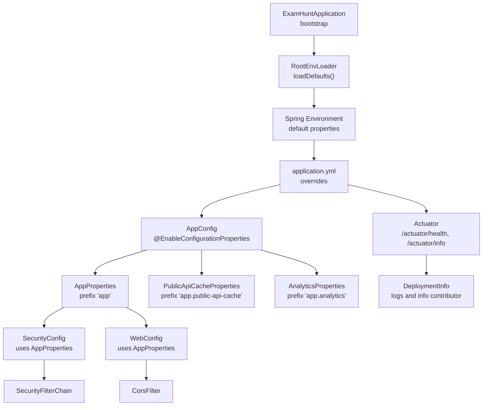
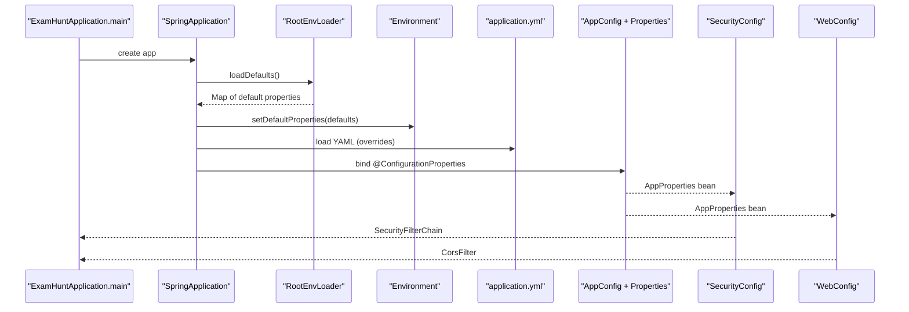
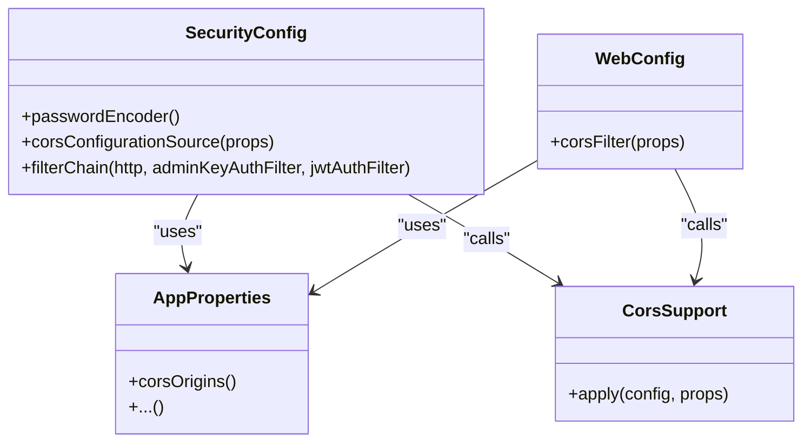
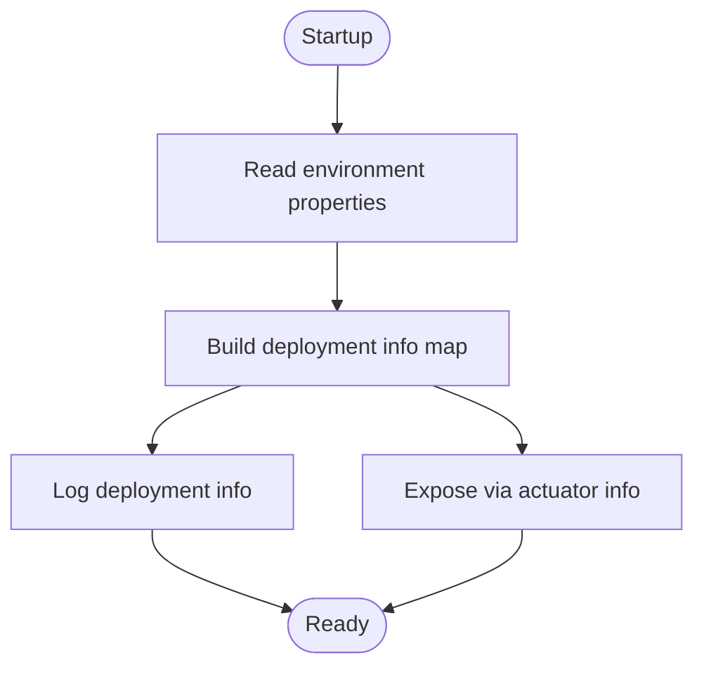
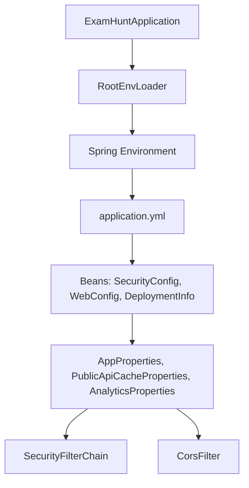

# Application Configuration

<cite>
**Referenced Files in This Document**
- [application.yml](file://backend/src/main/resources/application.yml)
- [ExamHuntApplication.java](file://backend/src/main/java/com/neetlu/examhunt/ExamHuntApplication.java)
- [RootEnvLoader.java](file://backend/src/main/java/com/neetlu/examhunt/config/RootEnvLoader.java)
- [AppConfig.java](file://backend/src/main/java/com/neetlu/examhunt/config/AppConfig.java)
- [AppProperties.java](file://backend/src/main/java/com/neetlu/examhunt/config/AppProperties.java)
- [PublicApiCacheProperties.java](file://backend/src/main/java/com/neetlu/examhunt/config/PublicApiCacheProperties.java)
- [AnalyticsProperties.java](file://backend/src/main/java/com/neetlu/examhunt/config/AnalyticsProperties.java)
- [SecurityConfig.java](file://backend/src/main/java/com/neetlu/examhunt/config/SecurityConfig.java)
- [CorsSupport.java](file://backend/src/main/java/com/neetlu/examhunt/config/CorsSupport.java)
- [WebConfig.java](file://backend/src/main/java/com/neetlu/examhunt/config/WebConfig.java)
- [DeploymentInfo.java](file://backend/src/main/java/com/neetlu/examhunt/config/DeploymentInfo.java)
- [pom.xml](file://backend/pom.xml)
- [Dockerfile](file://backend/Dockerfile)
- [docker-compose.yml](file://deploy/ec2/docker-compose.yml)
- [CorsSupportTest.java](file://backend/src/test/java/com/neetlu/examhunt/config/CorsSupportTest.java)
</cite>

## Table of Contents
1. [Introduction](#introduction)
2. [Project Structure](#project-structure)
3. [Core Components](#core-components)
4. [Architecture Overview](#architecture-overview)
5. [Detailed Component Analysis](#detailed-component-analysis)
6. [Dependency Analysis](#dependency-dependencies)
7. [Performance Considerations](#performance-considerations)
8. [Troubleshooting Guide](#troubleshooting-guide)
9. [Conclusion](#conclusion)
10. [Appendices](#appendices)

## Introduction
This document explains the Spring Boot application configuration for the backend service. It covers the YAML configuration structure, environment variable loading via a custom loader, application-wide settings managed by typed configuration classes, security and CORS policies, and deployment-time information exposure. It also provides best practices for environment variable precedence, security considerations for sensitive data, and practical troubleshooting steps.

## Project Structure
The configuration is centered around:
- A primary YAML configuration file that defines server, Spring data, application properties, logging, and actuator exposure.
- A custom environment loader that reads a monorepo root .env file and maps selected keys to Spring properties.
- Typed configuration classes bound to YAML prefixes for strongly-typed access.
- Security and CORS configuration beans wired to the typed properties.
- Actuator endpoints and deployment metadata exposed via Spring beans.

**Diagram sources**
- [ExamHuntApplication.java:10-14](file://backend/src/main/java/com/neetlu/examhunt/ExamHuntApplication.java#L10-L14)
- [RootEnvLoader.java:23-88](file://backend/src/main/java/com/neetlu/examhunt/config/RootEnvLoader.java#L23-L88)
- [application.yml:1-44](file://backend/src/main/resources/application.yml#L1-L44)
- [AppConfig.java:6-8](file://backend/src/main/java/com/neetlu/examhunt/config/AppConfig.java#L6-L8)
- [AppProperties.java:5-23](file://backend/src/main/java/com/neetlu/examhunt/config/AppProperties.java#L5-L23)
- [PublicApiCacheProperties.java:6-31](file://backend/src/main/java/com/neetlu/examhunt/config/PublicApiCacheProperties.java#L6-L31)
- [AnalyticsProperties.java:5-6](file://backend/src/main/java/com/neetlu/examhunt/config/AnalyticsProperties.java#L5-L6)
- [SecurityConfig.java:33-39](file://backend/src/main/java/com/neetlu/examhunt/config/SecurityConfig.java#L33-L39)
- [WebConfig.java:12-19](file://backend/src/main/java/com/neetlu/examhunt/config/WebConfig.java#L12-L19)
- [DeploymentInfo.java:20-39](file://backend/src/main/java/com/neetlu/examhunt/config/DeploymentInfo.java#L20-L39)

**Section sources**
- [application.yml:1-44](file://backend/src/main/resources/application.yml#L1-L44)
- [ExamHuntApplication.java:10-14](file://backend/src/main/java/com/neetlu/examhunt/ExamHuntApplication.java#L10-L14)
- [RootEnvLoader.java:23-88](file://backend/src/main/java/com/neetlu/examhunt/config/RootEnvLoader.java#L23-L88)
- [AppConfig.java:6-8](file://backend/src/main/java/com/neetlu/examhunt/config/AppConfig.java#L6-L8)
- [AppProperties.java:5-23](file://backend/src/main/java/com/neetlu/examhunt/config/AppProperties.java#L5-L23)
- [PublicApiCacheProperties.java:6-31](file://backend/src/main/java/com/neetlu/examhunt/config/PublicApiCacheProperties.java#L6-L31)
- [AnalyticsProperties.java:5-6](file://backend/src/main/java/com/neetlu/examhunt/config/AnalyticsProperties.java#L5-L6)
- [SecurityConfig.java:33-39](file://backend/src/main/java/com/neetlu/examhunt/config/SecurityConfig.java#L33-L39)
- [WebConfig.java:12-19](file://backend/src/main/java/com/neetlu/examhunt/config/WebConfig.java#L12-L19)
- [DeploymentInfo.java:20-39](file://backend/src/main/java/com/neetlu/examhunt/config/DeploymentInfo.java#L20-L39)

## Core Components
- application.yml: Defines server port, MongoDB connection URI, application-scoped properties under prefix app, caching and analytics toggles, logging, and actuator exposure.
- RootEnvLoader: Reads a .env file from the monorepo root when running from backend/, maps selected keys to Spring properties, and avoids overriding existing OS environment variables.
- AppConfig: Enables configuration binding for typed properties.
- AppProperties: Strongly typed representation of application properties under prefix app.
- PublicApiCacheProperties: Strongly typed cache controls for public endpoints.
- AnalyticsProperties: Strongly typed analytics toggle.
- SecurityConfig: Configures CORS, CSRF, session management, and endpoint authorization using typed properties.
- WebConfig: Registers a global CORS filter using typed properties.
- DeploymentInfo: Logs and exposes deployment metadata via actuator info.

**Section sources**
- [application.yml:1-44](file://backend/src/main/resources/application.yml#L1-L44)
- [RootEnvLoader.java:23-88](file://backend/src/main/java/com/neetlu/examhunt/config/RootEnvLoader.java#L23-L88)
- [AppConfig.java:6-8](file://backend/src/main/java/com/neetlu/examhunt/config/AppConfig.java#L6-L8)
- [AppProperties.java:5-23](file://backend/src/main/java/com/neetlu/examhunt/config/AppProperties.java#L5-L23)
- [PublicApiCacheProperties.java:6-31](file://backend/src/main/java/com/neetlu/examhunt/config/PublicApiCacheProperties.java#L6-L31)
- [AnalyticsProperties.java:5-6](file://backend/src/main/java/com/neetlu/examhunt/config/AnalyticsProperties.java#L5-L6)
- [SecurityConfig.java:33-39](file://backend/src/main/java/com/neetlu/examhunt/config/SecurityConfig.java#L33-L39)
- [WebConfig.java:12-19](file://backend/src/main/java/com/neetlu/examhunt/config/WebConfig.java#L12-L19)
- [DeploymentInfo.java:20-39](file://backend/src/main/java/com/neetlu/examhunt/config/DeploymentInfo.java#L20-L39)

## Architecture Overview
The configuration pipeline starts at application bootstrap, merges environment defaults from .env, applies YAML overrides, binds typed properties, and wires security and CORS.

**Diagram sources**
- [ExamHuntApplication.java:10-14](file://backend/src/main/java/com/neetlu/examhunt/ExamHuntApplication.java#L10-L14)
- [RootEnvLoader.java:23-88](file://backend/src/main/java/com/neetlu/examhunt/config/RootEnvLoader.java#L23-L88)
- [application.yml:1-44](file://backend/src/main/resources/application.yml#L1-L44)
- [AppConfig.java:6-8](file://backend/src/main/java/com/neetlu/examhunt/config/AppConfig.java#L6-L8)
- [AppProperties.java:5-23](file://backend/src/main/java/com/neetlu/examhunt/config/AppProperties.java#L5-L23)
- [SecurityConfig.java:33-39](file://backend/src/main/java/com/neetlu/examhunt/config/SecurityConfig.java#L33-L39)
- [WebConfig.java:12-19](file://backend/src/main/java/com/neetlu/examhunt/config/WebConfig.java#L12-L19)

## Detailed Component Analysis

### application.yml: Configuration Structure
- Server
  - Port is configurable via SERVER_PORT with a default fallback.
- Spring Data (MongoDB)
  - MongoDB URI is configurable via MONGODB_URI with a local default.
- Application Properties (prefix app)
  - CORS origins list, extractor roots, public files base URLs, import pack folders, admin credentials and keys, JWT secret and expiration, leaderboard demo seed flag, LLM provider settings, AI practice enablement, nested cache controls, and analytics toggle.
- Logging
  - Sets a specific logger level for a client utility.
- Actuator
  - Exposes health and info endpoints.

Common environment variables and defaults:
- SERVER_PORT: 8081
- MONGODB_URI: mongodb://127.0.0.1:27017/exam-hunt
- CORS_ORIGINS: http://localhost:5173,http://127.0.0.1:5173
- ADMIN_EMAIL: hussaininazir1@gmail.com
- JWT_SECRET: development secret placeholder
- JWT_EXPIRATION_HOURS: 168
- LEADERBOARD_DEMO_SEED: true
- OPENAI_BASE_URL: http://localhost:3001/v1
- OPENAI_CHAT_MODEL: auto
- AI_PRACTICE_ENABLED: true
- PUBLIC_API_CACHE_* and APP_ANALYTICS_* keys are also supported.

**Section sources**
- [application.yml:1-44](file://backend/src/main/resources/application.yml#L1-L44)

### RootEnvLoader: Environment Variable Loading
- Scans for .env in two locations: sibling to backend and monorepo root.
- Skips empty and comment lines; ignores keys already present in OS environment.
- Normalizes quoted values and maps specific keys to Spring property names.
- Provides defaults for:
  - MONGODB_URI → spring.data.mongodb.uri
  - EXTRACTOR_ROOT → app.extractor-root
  - ADMIN_IMPORT_KEY → app.admin-import-key
  - ADMIN_EMAIL → app.admin-email
  - ADMIN_PASSWORD → app.admin-bootstrap-password
  - JWT_SECRET → app.jwt-secret
  - PUBLIC_FILES_BASE_URL or R2_PUBLIC_BASE_URL → app.public-files-base-url
  - IMPORT_PACK_FOLDERS → app.import-pack-folders
  - OPENAI_API_KEY → app.llm-api-key
  - OPENAI_BASE_URL → app.llm-base-url
  - OPENAI_CHAT_MODEL → app.llm-model
  - AI_PRACTICE_ENABLED → app.ai-practice-enabled (parsed as boolean)

Behavior ensures .env acts as a development-time fallback without overriding explicit OS environment variables.

**Section sources**
- [RootEnvLoader.java:23-88](file://backend/src/main/java/com/neetlu/examhunt/config/RootEnvLoader.java#L23-L88)

### AppConfig and Typed Properties
- AppConfig enables configuration properties for:
  - AppProperties (prefix app)
  - PublicApiCacheProperties (prefix app.public-api-cache)
  - AnalyticsProperties (prefix app.analytics)
- AppProperties exposes:
  - CORS origins, extractor and manifest base URLs, public files base URL, import pack folders, admin keys and emails, JWT secret and expiration, leaderboard demo seed, LLM keys and endpoints, and AI practice enablement.
- PublicApiCacheProperties enforces positive defaults for browser and CDN cache durations and in-memory TTL.
- AnalyticsProperties toggles event emission.

These classes provide compile-time safety and IDE support for configuration keys.

**Section sources**
- [AppConfig.java:6-8](file://backend/src/main/java/com/neetlu/examhunt/config/AppConfig.java#L6-L8)
- [AppProperties.java:5-23](file://backend/src/main/java/com/neetlu/examhunt/config/AppProperties.java#L5-L23)
- [PublicApiCacheProperties.java:6-31](file://backend/src/main/java/com/neetlu/examhunt/config/PublicApiCacheProperties.java#L6-L31)
- [AnalyticsProperties.java:5-6](file://backend/src/main/java/com/neetlu/examhunt/config/AnalyticsProperties.java#L5-L6)

### Security and CORS Configuration
- SecurityConfig:
  - Enables CORS, disables CSRF, sets stateless sessions, and configures an unauthorized entry point.
  - Authorizes endpoints per method and path, including public routes, authenticated paths, and admin-only endpoints.
  - Integrates JWT and admin key filters.
- WebConfig:
  - Registers a global CorsFilter using the same configuration logic.
- CorsSupport:
  - Applies allowed origins from AppProperties plus development patterns.
  - Sets allowed methods, headers, credentials, and max age.
  - Ensures production origins are enumerated (not wildcard) when credentials are enabled.

**Diagram sources**
- [SecurityConfig.java:27-74](file://backend/src/main/java/com/neetlu/examhunt/config/SecurityConfig.java#L27-L74)
- [WebConfig.java:12-19](file://backend/src/main/java/com/neetlu/examhunt/config/WebConfig.java#L12-L19)
- [CorsSupport.java:22-35](file://backend/src/main/java/com/neetlu/examhunt/config/CorsSupport.java#L22-L35)
- [AppProperties.java:6-23](file://backend/src/main/java/com/neetlu/examhunt/config/AppProperties.java#L6-L23)

**Section sources**
- [SecurityConfig.java:33-39](file://backend/src/main/java/com/neetlu/examhunt/config/SecurityConfig.java#L33-L39)
- [WebConfig.java:12-19](file://backend/src/main/java/com/neetlu/examhunt/config/WebConfig.java#L12-L19)
- [CorsSupport.java:22-35](file://backend/src/main/java/com/neetlu/examhunt/config/CorsSupport.java#L22-L35)
- [CorsSupportTest.java:10-66](file://backend/src/test/java/com/neetlu/examhunt/config/CorsSupportTest.java#L10-L66)

### Deployment Information Exposure
- DeploymentInfo logs deployment metadata at startup and contributes the same information to actuator info.
- Reads environment variables for image tag, commit, ref, build time, and run number, with sensible defaults.

**Diagram sources**
- [DeploymentInfo.java:20-39](file://backend/src/main/java/com/neetlu/examhunt/config/DeploymentInfo.java#L20-L39)

**Section sources**
- [DeploymentInfo.java:20-39](file://backend/src/main/java/com/neetlu/examhunt/config/DeploymentInfo.java#L20-L39)

## Dependency Analysis
- Runtime dependencies include Spring Web, Data MongoDB, Security, Validation, Actuator, and JWT libraries.
- The application is packaged as a self-contained JAR and runs on a JRE.

**Diagram sources**
- [pom.xml:24-66](file://backend/pom.xml#L24-L66)
- [ExamHuntApplication.java:10-14](file://backend/src/main/java/com/neetlu/examhunt/ExamHuntApplication.java#L10-L14)
- [RootEnvLoader.java:23-88](file://backend/src/main/java/com/neetlu/examhunt/config/RootEnvLoader.java#L23-L88)
- [application.yml:1-44](file://backend/src/main/resources/application.yml#L1-L44)
- [SecurityConfig.java:33-39](file://backend/src/main/java/com/neetlu/examhunt/config/SecurityConfig.java#L33-L39)
- [WebConfig.java:12-19](file://backend/src/main/java/com/neetlu/examhunt/config/WebConfig.java#L12-L19)
- [AppProperties.java:5-23](file://backend/src/main/java/com/neetlu/examhunt/config/AppProperties.java#L5-L23)
- [PublicApiCacheProperties.java:6-31](file://backend/src/main/java/com/neetlu/examhunt/config/PublicApiCacheProperties.java#L6-L31)
- [AnalyticsProperties.java:5-6](file://backend/src/main/java/com/neetlu/examhunt/config/AnalyticsProperties.java#L5-L6)

**Section sources**
- [pom.xml:24-66](file://backend/pom.xml#L24-L66)

## Performance Considerations
- CORS configuration enumerates origins explicitly when credentials are enabled to avoid preflight overhead and reduce wildcard risks.
- Public API cache properties define conservative defaults for browser and CDN caching, balancing freshness and performance.
- Actuator exposure is minimal (health, info) to limit overhead in production.

[No sources needed since this section provides general guidance]

## Troubleshooting Guide
- Environment variables not taking effect
  - Verify precedence: OS environment variables override .env and YAML defaults. RootEnvLoader intentionally skips keys already present in the OS environment.
  - Confirm .env location and format: the loader scans sibling and monorepo root paths and ignores comments and malformed lines.
- CORS issues in production
  - Ensure app.cors-origins lists exact domains when credentials are enabled; wildcards are not applied in that scenario.
  - Confirm development origins remain allowed via built-in patterns.
- MongoDB connectivity
  - Check MONGODB_URI resolution: either pass it via OS environment or .env; YAML default is a local URI.
- JWT and security
  - Validate JWT secret and expiration hours; ensure filters are registered in the chain.
- Actuator and deployment info
  - Confirm actuator endpoints are exposed and deployment metadata is logged; ensure required environment variables are set during containerization.

**Section sources**
- [RootEnvLoader.java:23-88](file://backend/src/main/java/com/neetlu/examhunt/config/RootEnvLoader.java#L23-L88)
- [application.yml:11-26](file://backend/src/main/resources/application.yml#L11-L26)
- [CorsSupport.java:22-35](file://backend/src/main/java/com/neetlu/examhunt/config/CorsSupport.java#L22-L35)
- [SecurityConfig.java:42-74](file://backend/src/main/java/com/neetlu/examhunt/config/SecurityConfig.java#L42-L74)
- [DeploymentInfo.java:20-39](file://backend/src/main/java/com/neetlu/examhunt/config/DeploymentInfo.java#L20-L39)

## Conclusion
The configuration system combines a YAML baseline with a custom .env loader, typed configuration classes, and explicit security and CORS wiring. This approach provides strong defaults for local development while allowing precise overrides in CI/CD and production environments. Careful attention to environment precedence, credential-safe CORS, and secure secrets ensures robust operation across environments.

[No sources needed since this section summarizes without analyzing specific files]

## Appendices

### Environment Variable Precedence and Best Practices
- Precedence order (highest wins):
  1) OS environment variables
  2) .env loaded by RootEnvLoader
  3) application.yml defaults
- Best practices:
  - Store secrets in OS environment or secret managers; avoid committing secrets to .env or YAML.
  - Use app.cors-origins for production domains; keep credentials-enabled CORS safe by avoiding wildcards.
  - Keep JWT secrets and LLM keys environment-driven; validate expiration hours for session hygiene.
  - Use actuator info and logs to confirm effective configuration at runtime.

**Section sources**
- [RootEnvLoader.java:23-88](file://backend/src/main/java/com/neetlu/examhunt/config/RootEnvLoader.java#L23-L88)
- [application.yml:11-26](file://backend/src/main/resources/application.yml#L11-L26)
- [SecurityConfig.java:42-74](file://backend/src/main/java/com/neetlu/examhunt/config/SecurityConfig.java#L42-L74)

### Example Configuration Scenarios
- Local development with .env
  - Place .env at the monorepo root or sibling to backend/.
  - Define MONGODB_URI, JWT_SECRET, OPENAI_* keys, and app.* keys as needed.
  - Run the application from backend/ without sourcing .env; RootEnvLoader will apply defaults.
- Production with Docker
  - Pass environment variables via docker-compose env_file or secrets.
  - Ensure actuator health checks are reachable on the published port.
  - Confirm deployment info is logged and visible via actuator info.

**Section sources**
- [RootEnvLoader.java:23-88](file://backend/src/main/java/com/neetlu/examhunt/config/RootEnvLoader.java#L23-L88)
- [docker-compose.yml:6-9](file://deploy/ec2/docker-compose.yml#L6-L9)
- [Dockerfile:39-40](file://backend/Dockerfile#L39-L40)