# Backend Architecture

<cite>
**Referenced Files in This Document**
- [ExamHuntApplication.java](file://backend/src/main/java/com/neetlu/examhunt/ExamHuntApplication.java)
- [application.yml](file://backend/src/main/resources/application.yml)
- [pom.xml](file://backend/pom.xml)
- [AppConfig.java](file://backend/src/main/java/com/neetlu/examhunt/config/AppConfig.java)
- [SecurityConfig.java](file://backend/src/main/java/com/neetlu/examhunt/config/SecurityConfig.java)
- [WebConfig.java](file://backend/src/main/java/com/neetlu/examhunt/config/WebConfig.java)
- [CorsSupport.java](file://backend/src/main/java/com/neetlu/examhunt/config/CorsSupport.java)
- [AuthController.java](file://backend/src/main/java/com/neetlu/examhunt/web/AuthController.java)
- [AuthService.java](file://backend/src/main/java/com/neetlu/examhunt/service/AuthService.java)
- [UserAccountRepository.java](file://backend/src/main/java/com/neetlu/examhunt/repository/UserAccountRepository.java)
- [JwtAuthFilter.java](file://backend/src/main/java/com/neetlu/examhunt/security/JwtAuthFilter.java)
- [AdminKeyAuthFilter.java](file://backend/src/main/java/com/neetlu/examhunt/security/AdminKeyAuthFilter.java)
- [AdminAuthorization.java](file://backend/src/main/java/com/neetlu/examhunt/security/AdminAuthorization.java)
- [UserAccount.java](file://backend/src/main/java/com/neetlu/examhunt/model/UserAccount.java)
- [UserRole.java](file://backend/src/main/java/com/neetlu/examhunt/model/UserRole.java)
- [docker-compose.yml](file://deploy/ec2/docker-compose.yml)
- [Dockerfile](file://backend/Dockerfile)
</cite>

## Table of Contents
1. [Introduction](#introduction)
2. [Project Structure](#project-structure)
3. [Core Components](#core-components)
4. [Architecture Overview](#architecture-overview)
5. [Detailed Component Analysis](#detailed-component-analysis)
6. [Dependency Analysis](#dependency-analysis)
7. [Performance Considerations](#performance-considerations)
8. [Troubleshooting Guide](#troubleshooting-guide)
9. [Conclusion](#conclusion)
10. [Appendices](#appendices)

## Introduction
This document describes the backend architecture of the Spring Boot application serving the exam-hunt project. It outlines the layered architecture following MVC and repository patterns, the service layer organization, and the integration with MongoDB. It also documents security, CORS, web configuration, infrastructure requirements, deployment topology, and cross-cutting concerns such as authentication, authorization, and error handling.

## Project Structure
The backend is organized into clear layers:
- Application bootstrap and configuration
- Model layer (MongoDB entities)
- Repository layer (data access)
- Service layer (business logic)
- Web layer (controllers and exception handling)
- Security filters and configuration
- Infrastructure and deployment artifacts

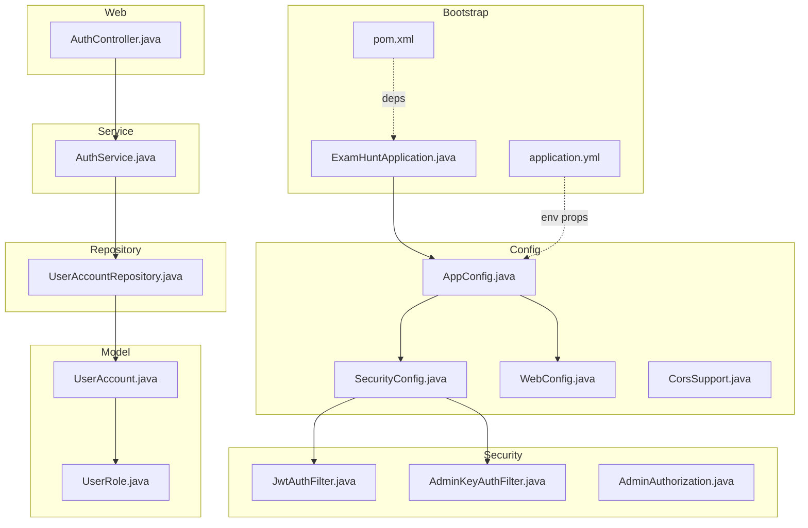

**Diagram sources**
- [ExamHuntApplication.java:1-16](file://backend/src/main/java/com/neetlu/examhunt/ExamHuntApplication.java#L1-L16)
- [application.yml:1-44](file://backend/src/main/resources/application.yml#L1-L44)
- [pom.xml:1-78](file://backend/pom.xml#L1-L78)
- [AppConfig.java:1-9](file://backend/src/main/java/com/neetlu/examhunt/config/AppConfig.java#L1-L9)
- [SecurityConfig.java:1-76](file://backend/src/main/java/com/neetlu/examhunt/config/SecurityConfig.java#L1-L76)
- [WebConfig.java:1-21](file://backend/src/main/java/com/neetlu/examhunt/config/WebConfig.java#L1-L21)
- [CorsSupport.java:1-37](file://backend/src/main/java/com/neetlu/examhunt/config/CorsSupport.java#L1-L37)
- [UserAccount.java:1-71](file://backend/src/main/java/com/neetlu/examhunt/model/UserAccount.java#L1-L71)
- [UserRole.java:1-7](file://backend/src/main/java/com/neetlu/examhunt/model/UserRole.java#L1-L7)
- [UserAccountRepository.java:1-17](file://backend/src/main/java/com/neetlu/examhunt/repository/UserAccountRepository.java#L1-L17)
- [AuthService.java:1-106](file://backend/src/main/java/com/neetlu/examhunt/service/AuthService.java#L1-L106)
- [AuthController.java:1-45](file://backend/src/main/java/com/neetlu/examhunt/web/AuthController.java#L1-L45)
- [JwtAuthFilter.java:1-59](file://backend/src/main/java/com/neetlu/examhunt/security/JwtAuthFilter.java#L1-L59)
- [AdminKeyAuthFilter.java:1-50](file://backend/src/main/java/com/neetlu/examhunt/security/AdminKeyAuthFilter.java#L1-L50)
- [AdminAuthorization.java:1-85](file://backend/src/main/java/com/neetlu/examhunt/security/AdminAuthorization.java#L1-L85)

**Section sources**
- [ExamHuntApplication.java:1-16](file://backend/src/main/java/com/neetlu/examhunt/ExamHuntApplication.java#L1-L16)
- [application.yml:1-44](file://backend/src/main/resources/application.yml#L1-L44)
- [pom.xml:1-78](file://backend/pom.xml#L1-L78)

## Core Components
- Application bootstrap initializes Spring Boot and loads default environment properties.
- Configuration beans enable property binding and security/filter chains.
- MongoDB integration is configured via application properties.
- Controllers expose REST endpoints following the MVC pattern.
- Services encapsulate business logic and orchestrate repositories.
- Repositories provide data access abstractions over MongoDB.
- Security filters implement JWT and admin key-based authentication.
- Cross-cutting concerns include CORS, error handling, and logging.

**Section sources**
- [ExamHuntApplication.java:10-14](file://backend/src/main/java/com/neetlu/examhunt/ExamHuntApplication.java#L10-L14)
- [AppConfig.java:6-8](file://backend/src/main/java/com/neetlu/examhunt/config/AppConfig.java#L6-L8)
- [application.yml:4-10](file://backend/src/main/resources/application.yml#L4-L10)
- [AuthController.java:13-21](file://backend/src/main/java/com/neetlu/examhunt/web/AuthController.java#L13-L21)
- [AuthService.java:12-29](file://backend/src/main/java/com/neetlu/examhunt/service/AuthService.java#L12-L29)
- [UserAccountRepository.java:10-16](file://backend/src/main/java/com/neetlu/examhunt/repository/UserAccountRepository.java#L10-L16)
- [JwtAuthFilter.java:21-28](file://backend/src/main/java/com/neetlu/examhunt/security/JwtAuthFilter.java#L21-L28)
- [AdminKeyAuthFilter.java:20-29](file://backend/src/main/java/com/neetlu/examhunt/security/AdminKeyAuthFilter.java#L20-L29)

## Architecture Overview
The system follows a layered architecture:
- Presentation Layer: Controllers handle HTTP requests and delegate to services.
- Business Logic Layer: Services encapsulate domain logic and coordinate repositories.
- Data Access Layer: Repositories provide MongoDB-backed persistence.
- Security Layer: Filters enforce authentication and authorization policies.
- Configuration Layer: Beans wire components and define cross-cutting behaviors.

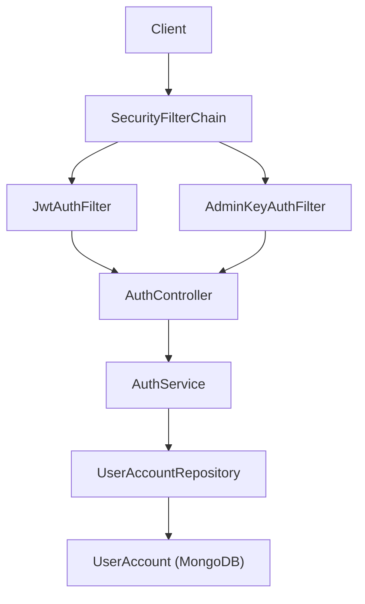

**Diagram sources**
- [AuthController.java:13-36](file://backend/src/main/java/com/neetlu/examhunt/web/AuthController.java#L13-L36)
- [AuthService.java:12-29](file://backend/src/main/java/com/neetlu/examhunt/service/AuthService.java#L12-L29)
- [UserAccountRepository.java:10-16](file://backend/src/main/java/com/neetlu/examhunt/repository/UserAccountRepository.java#L10-L16)
- [UserAccount.java:9-22](file://backend/src/main/java/com/neetlu/examhunt/model/UserAccount.java#L9-L22)
- [SecurityConfig.java:42-73](file://backend/src/main/java/com/neetlu/examhunt/config/SecurityConfig.java#L42-L73)
- [JwtAuthFilter.java:30-57](file://backend/src/main/java/com/neetlu/examhunt/security/JwtAuthFilter.java#L30-L57)
- [AdminKeyAuthFilter.java:32-47](file://backend/src/main/java/com/neetlu/examhunt/security/AdminKeyAuthFilter.java#L32-L47)

## Detailed Component Analysis

### Authentication and Authorization Flow
This sequence illustrates login and profile retrieval, including JWT issuance and role synchronization.

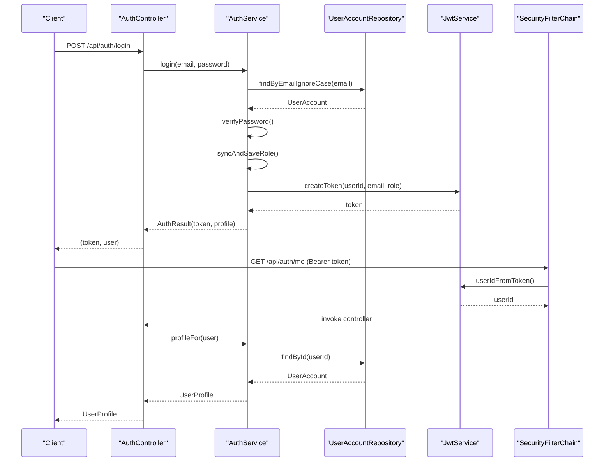

**Diagram sources**
- [AuthController.java:28-36](file://backend/src/main/java/com/neetlu/examhunt/web/AuthController.java#L28-L36)
- [AuthService.java:52-88](file://backend/src/main/java/com/neetlu/examhunt/service/AuthService.java#L52-L88)
- [UserAccountRepository.java:11](file://backend/src/main/java/com/neetlu/examhunt/repository/UserAccountRepository.java#L11)
- [JwtAuthFilter.java:38-57](file://backend/src/main/java/com/neetlu/examhunt/security/JwtAuthFilter.java#L38-L57)

**Section sources**
- [AuthService.java:52-88](file://backend/src/main/java/com/neetlu/examhunt/service/AuthService.java#L52-L88)
- [JwtAuthFilter.java:38-57](file://backend/src/main/java/com/neetlu/examhunt/security/JwtAuthFilter.java#L38-L57)

### JWT Authentication Filter
The filter extracts Bearer tokens, validates them, and populates the security context with authorities derived from the token.

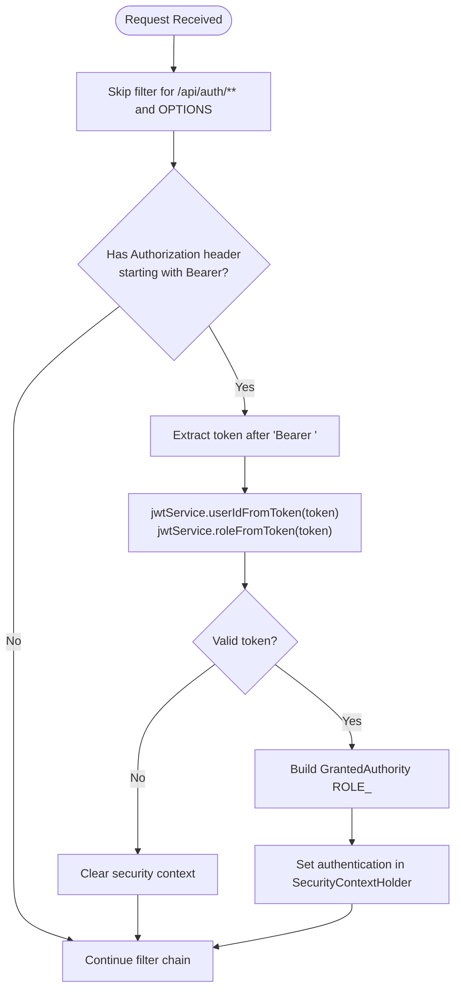

**Diagram sources**
- [JwtAuthFilter.java:30-57](file://backend/src/main/java/com/neetlu/examhunt/security/JwtAuthFilter.java#L30-L57)

**Section sources**
- [JwtAuthFilter.java:30-57](file://backend/src/main/java/com/neetlu/examhunt/security/JwtAuthFilter.java#L30-L57)

### Admin Key Authentication Filter
The admin key filter allows administrative actions via a legacy admin key header when no JWT is present.

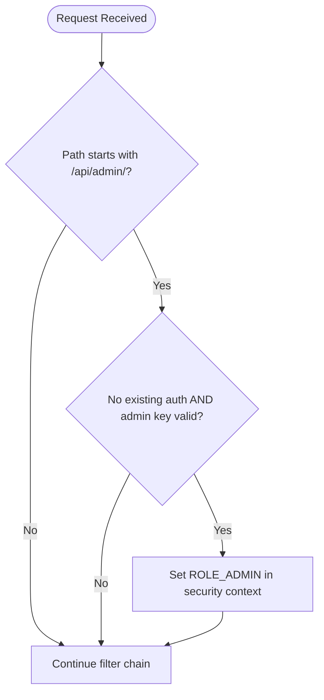

**Diagram sources**
- [AdminKeyAuthFilter.java:32-47](file://backend/src/main/java/com/neetlu/examhunt/security/AdminKeyAuthFilter.java#L32-L47)

**Section sources**
- [AdminKeyAuthFilter.java:32-47](file://backend/src/main/java/com/neetlu/examhunt/security/AdminKeyAuthFilter.java#L32-L47)

### Security Configuration
SecurityConfig defines:
- Stateless sessions
- CSRF disabled
- CORS applied from AppProperties via CorsSupport
- Endpoint-level authorization rules
- Filters order: AdminKeyAuthFilter before JWT filter

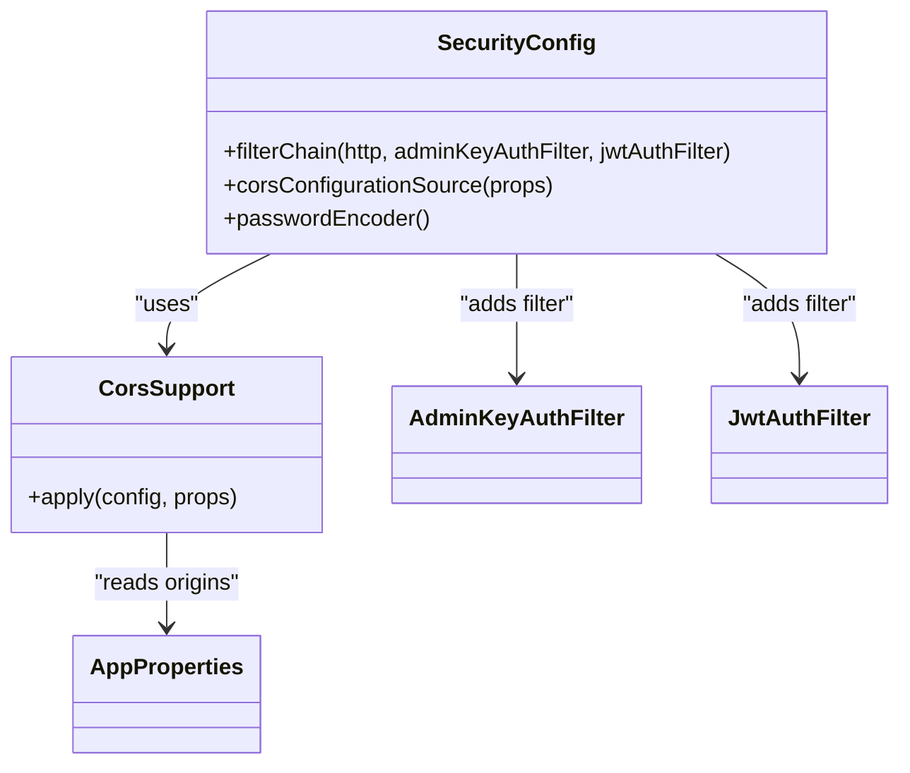

**Diagram sources**
- [SecurityConfig.java:42-73](file://backend/src/main/java/com/neetlu/examhunt/config/SecurityConfig.java#L42-L73)
- [CorsSupport.java:22-35](file://backend/src/main/java/com/neetlu/examhunt/config/CorsSupport.java#L22-L35)
- [AdminKeyAuthFilter.java:28-29](file://backend/src/main/java/com/neetlu/examhunt/security/AdminKeyAuthFilter.java#L28-L29)
- [JwtAuthFilter.java:26-27](file://backend/src/main/java/com/neetlu/examhunt/security/JwtAuthFilter.java#L26-L27)

**Section sources**
- [SecurityConfig.java:41-73](file://backend/src/main/java/com/neetlu/examhunt/config/SecurityConfig.java#L41-L73)
- [CorsSupport.java:22-35](file://backend/src/main/java/com/neetlu/examhunt/config/CorsSupport.java#L22-L35)

### Data Model and Repository Pattern
UserAccount is mapped to MongoDB collection "users". Repositories extend MongoRepository to leverage Spring Data MongoDB features.

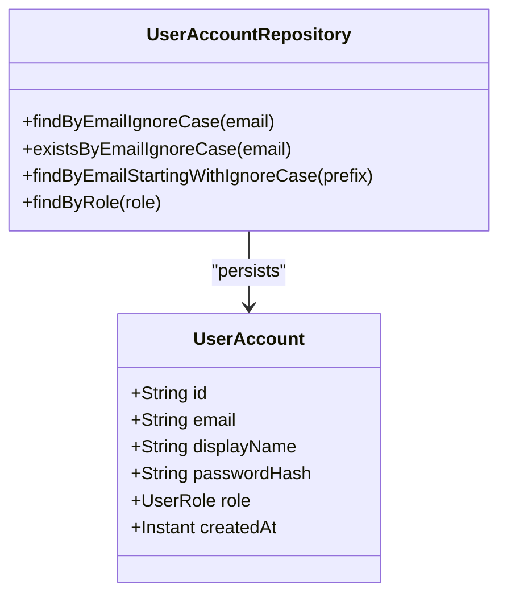

**Diagram sources**
- [UserAccount.java:9-22](file://backend/src/main/java/com/neetlu/examhunt/model/UserAccount.java#L9-L22)
- [UserAccountRepository.java:10-16](file://backend/src/main/java/com/neetlu/examhunt/repository/UserAccountRepository.java#L10-L16)

**Section sources**
- [UserAccount.java:9-22](file://backend/src/main/java/com/neetlu/examhunt/model/UserAccount.java#L9-L22)
- [UserAccountRepository.java:10-16](file://backend/src/main/java/com/neetlu/examhunt/repository/UserAccountRepository.java#L10-L16)

### Service Layer Organization
AuthService coordinates user registration, login, profile retrieval, and JWT issuance. It delegates to UserAccountRepository and integrates with AdminAuthorization and JwtService.

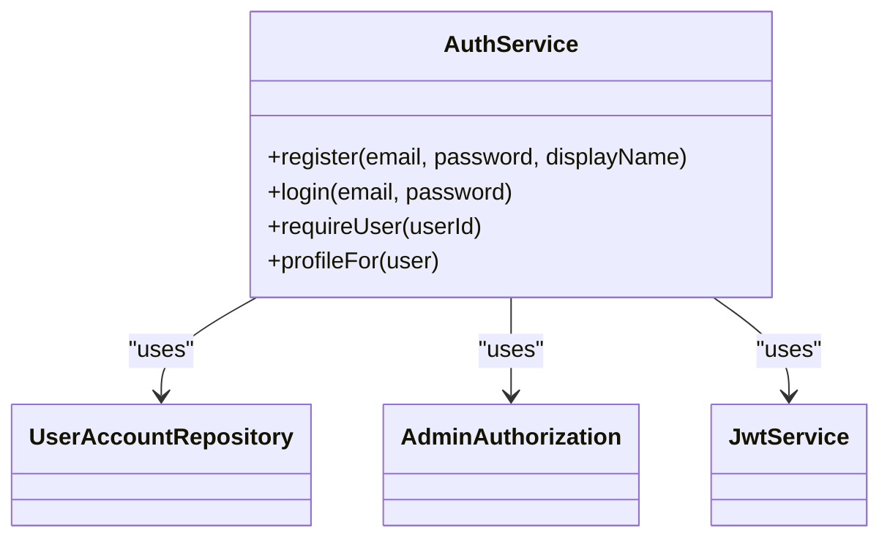

**Diagram sources**
- [AuthService.java:12-29](file://backend/src/main/java/com/neetlu/examhunt/service/AuthService.java#L12-L29)
- [UserAccountRepository.java:10-16](file://backend/src/main/java/com/neetlu/examhunt/repository/UserAccountRepository.java#L10-L16)
- [AdminAuthorization.java:17-20](file://backend/src/main/java/com/neetlu/examhunt/security/AdminAuthorization.java#L17-L20)

**Section sources**
- [AuthService.java:12-29](file://backend/src/main/java/com/neetlu/examhunt/service/AuthService.java#L12-L29)

### Web Layer and MVC Pattern
Controllers expose REST endpoints under /api/*, delegating to services. Validation annotations guard request payloads.

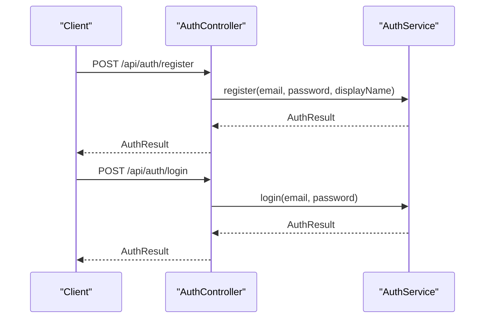

**Diagram sources**
- [AuthController.java:23-31](file://backend/src/main/java/com/neetlu/examhunt/web/AuthController.java#L23-L31)
- [AuthService.java:31-60](file://backend/src/main/java/com/neetlu/examhunt/service/AuthService.java#L31-L60)

**Section sources**
- [AuthController.java:13-36](file://backend/src/main/java/com/neetlu/examhunt/web/AuthController.java#L13-L36)

## Dependency Analysis
External dependencies include Spring Boot starters for web, data-mongodb, validation, actuator, security, and JWT libraries. The application uses Maven for build management.

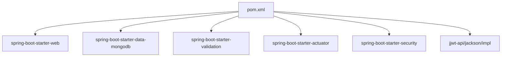

**Diagram sources**
- [pom.xml:24-66](file://backend/pom.xml#L24-L66)

**Section sources**
- [pom.xml:24-66](file://backend/pom.xml#L24-L66)

## Performance Considerations
- Stateless JWT reduces server-side session overhead.
- Spring Data MongoDB leverages repository methods; ensure proper indexing on frequently queried fields (e.g., email).
- CORS configuration supports credentials and cached preflight requests to minimize latency.
- Logging is tuned for specific service clients to avoid excessive noise.

[No sources needed since this section provides general guidance]

## Troubleshooting Guide
Common issues and remedies:
- Authentication failures: Verify Authorization header format and token validity; check security chain configuration.
- CORS errors: Confirm allowed origins and credentials settings; ensure preflight OPTIONS requests are permitted.
- MongoDB connectivity: Validate MONGODB_URI and network accessibility.
- Admin access denied: Confirm admin email configuration and admin key header for scripted access.
- Unauthorized or forbidden responses: Review endpoint authorization rules and roles.

**Section sources**
- [SecurityConfig.java:49-70](file://backend/src/main/java/com/neetlu/examhunt/config/SecurityConfig.java#L49-L70)
- [CorsSupport.java:22-35](file://backend/src/main/java/com/neetlu/examhunt/config/CorsSupport.java#L22-L35)
- [application.yml:8-9](file://backend/src/main/resources/application.yml#L8-L9)
- [AdminAuthorization.java:44-56](file://backend/src/main/java/com/neetlu/examhunt/security/AdminAuthorization.java#L44-L56)

## Conclusion
The backend employs a clean layered architecture with clear separation of concerns. Security is enforced through a dual-filter mechanism supporting both JWT and admin keys. MongoDB integration is straightforward via Spring Data MongoDB. The configuration is environment-driven, enabling flexible deployments across development and production environments.

[No sources needed since this section summarizes without analyzing specific files]

## Appendices

### System Context Diagram
High-level view of API endpoints, business logic, and data persistence.

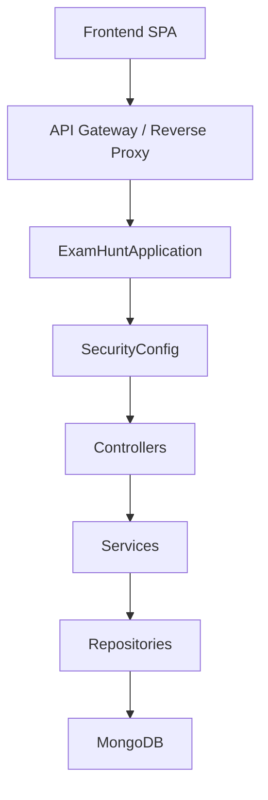

[No sources needed since this diagram shows conceptual workflow, not actual code structure]

### Infrastructure and Deployment
- Containerization: A Dockerfile is available for building the backend image.
- Orchestration: docker-compose is provided for EC2 deployment.
- Environment variables: Application properties are loaded from environment variables defined in configuration files.

**Section sources**
- [Dockerfile](file://backend/Dockerfile)
- [docker-compose.yml](file://deploy/ec2/docker-compose.yml)
- [application.yml:11-31](file://backend/src/main/resources/application.yml#L11-L31)