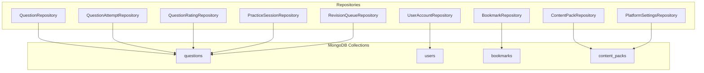
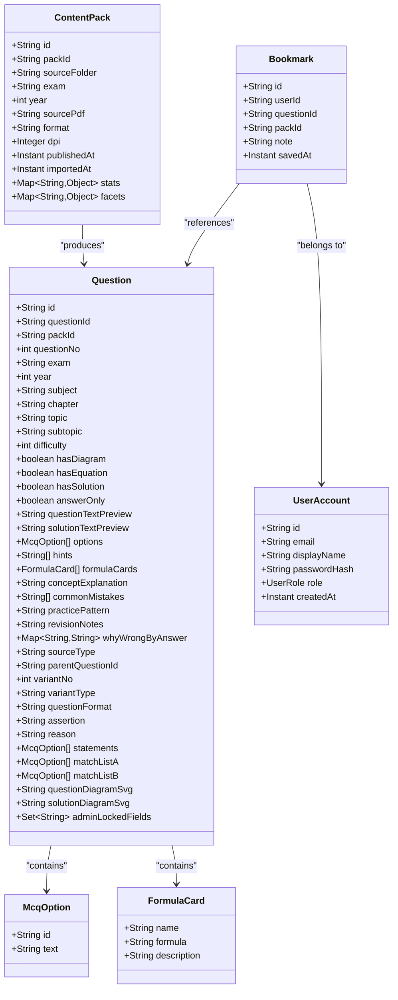
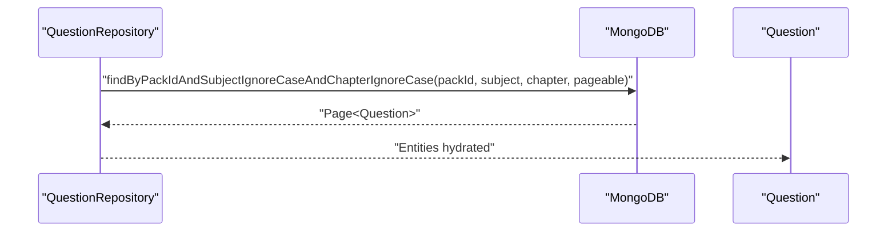
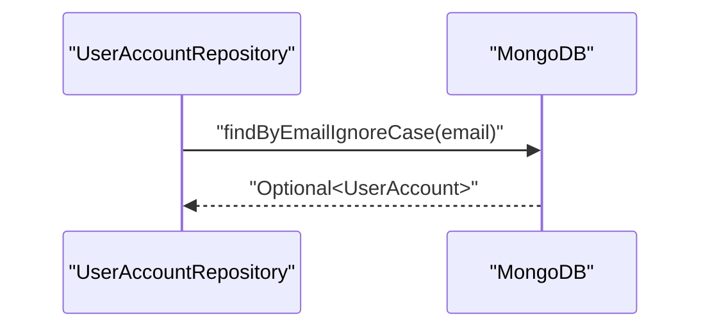
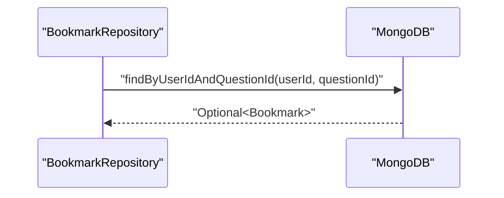
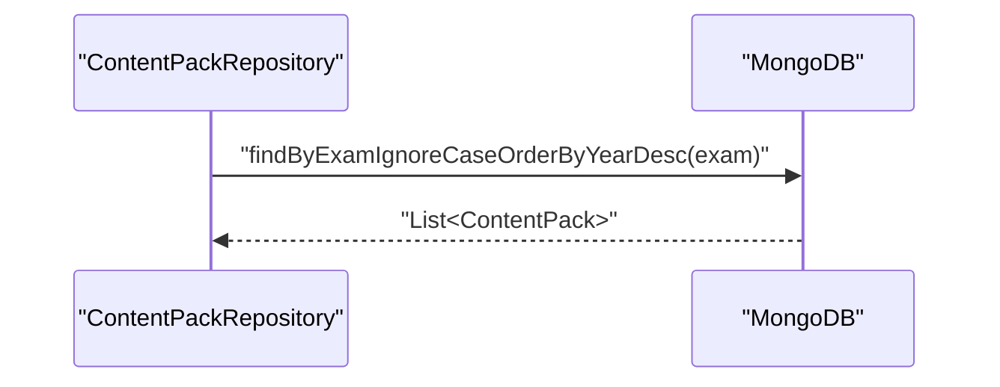
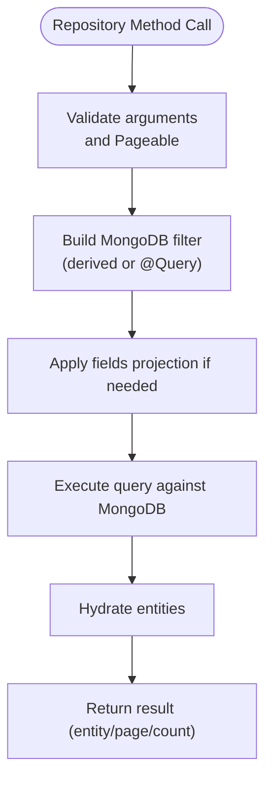
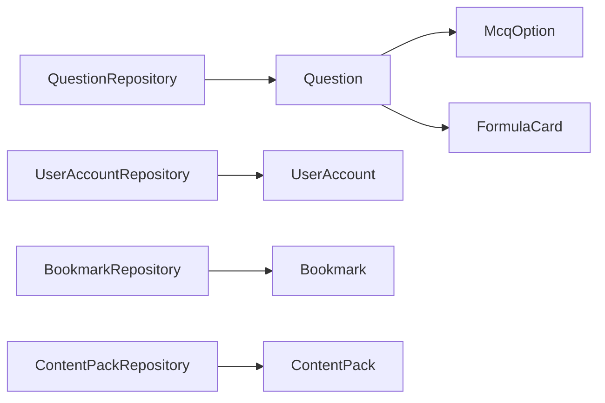

# Data Access Layer

<cite>
**Referenced Files in This Document**
- [QuestionRepository.java](file://backend/src/main/java/com/neetlu/examhunt/repository/QuestionRepository.java)
- [UserAccountRepository.java](file://backend/src/main/java/com/neetlu/examhunt/repository/UserAccountRepository.java)
- [BookmarkRepository.java](file://backend/src/main/java/com/neetlu/examhunt/repository/BookmarkRepository.java)
- [ContentPackRepository.java](file://backend/src/main/java/com/neetlu/examhunt/repository/ContentPackRepository.java)
- [QuestionAttemptRepository.java](file://backend/src/main/java/com/neetlu/examhunt/repository/QuestionAttemptRepository.java)
- [QuestionRatingRepository.java](file://backend/src/main/java/com/neetlu/examhunt/repository/QuestionRatingRepository.java)
- [PracticeSessionRepository.java](file://backend/src/main/java/com/neetlu/examhunt/repository/PracticeSessionRepository.java)
- [RevisionQueueRepository.java](file://backend/src/main/java/com/neetlu/examhunt/repository/RevisionQueueRepository.java)
- [PlatformSettingsRepository.java](file://backend/src/main/java/com/neetlu/examhunt/repository/PlatformSettingsRepository.java)
- [Question.java](file://backend/src/main/java/com/neetlu/examhunt/model/Question.java)
- [UserAccount.java](file://backend/src/main/java/com/neetlu/examhunt/model/UserAccount.java)
- [Bookmark.java](file://backend/src/main/java/com/neetlu/examhunt/model/Bookmark.java)
- [ContentPack.java](file://backend/src/main/java/com/neetlu/examhunt/model/ContentPack.java)
- [McqOption.java](file://backend/src/main/java/com/neetlu/examhunt/model/McqOption.java)
- [FormulaCard.java](file://backend/src/main/java/com/neetlu/examhunt/model/FormulaCard.java)
</cite>

## Table of Contents
1. [Introduction](#introduction)
2. [Project Structure](#project-structure)
3. [Core Components](#core-components)
4. [Architecture Overview](#architecture-overview)
5. [Detailed Component Analysis](#detailed-component-analysis)
6. [Dependency Analysis](#dependency-analysis)
7. [Performance Considerations](#performance-considerations)
8. [Troubleshooting Guide](#troubleshooting-guide)
9. [Conclusion](#conclusion)

## Introduction
This document describes the data access layer built with Spring Data MongoDB. It explains how repositories implement the repository pattern, define custom query methods, and leverage MongoDB’s native query syntax. It documents entity models, their field annotations, and indexing strategies. It also covers data access patterns, transaction handling, performance optimization, indexing, query optimization, consistency mechanisms, complex queries, aggregation pipelines, data manipulation operations, validation, error handling, and migration procedures.

## Project Structure
The data access layer is organized around:
- Model entities annotated for MongoDB mapping and indexing
- Repository interfaces extending Spring Data MongoDB’s MongoRepository
- Custom method signatures and @Query annotations for advanced queries

**Diagram sources**
- [QuestionRepository.java:13-103](file://backend/src/main/java/com/neetlu/examhunt/repository/QuestionRepository.java#L13-L103)
- [UserAccountRepository.java:10-16](file://backend/src/main/java/com/neetlu/examhunt/repository/UserAccountRepository.java#L10-L16)
- [BookmarkRepository.java:10-21](file://backend/src/main/java/com/neetlu/examhunt/repository/BookmarkRepository.java#L10-L21)
- [ContentPackRepository.java:9-20](file://backend/src/main/java/com/neetlu/examhunt/repository/ContentPackRepository.java#L9-L20)
- [QuestionAttemptRepository.java:9-16](file://backend/src/main/java/com/neetlu/examhunt/repository/QuestionAttemptRepository.java#L9-L16)
- [QuestionRatingRepository.java:11-16](file://backend/src/main/java/com/neetlu/examhunt/repository/QuestionRatingRepository.java#L11-L16)
- [PracticeSessionRepository.java:9-12](file://backend/src/main/java/com/neetlu/examhunt/repository/PracticeSessionRepository.java#L9-L12)
- [RevisionQueueRepository.java:9-21](file://backend/src/main/java/com/neetlu/examhunt/repository/RevisionQueueRepository.java#L9-L21)
- [PlatformSettingsRepository.java](file://backend/src/main/java/com/neetlu/examhunt/repository/PlatformSettingsRepository.java#L6)

**Section sources**
- [QuestionRepository.java:13-103](file://backend/src/main/java/com/neetlu/examhunt/repository/QuestionRepository.java#L13-L103)
- [UserAccountRepository.java:10-16](file://backend/src/main/java/com/neetlu/examhunt/repository/UserAccountRepository.java#L10-L16)
- [BookmarkRepository.java:10-21](file://backend/src/main/java/com/neetlu/examhunt/repository/BookmarkRepository.java#L10-L21)
- [ContentPackRepository.java:9-20](file://backend/src/main/java/com/neetlu/examhunt/repository/ContentPackRepository.java#L9-L20)

## Core Components
- Repositories: Define CRUD and custom finder methods for each domain entity. They extend MongoRepository to inherit base operations and add derived or @Query-based methods.
- Entities: Annotated with @Document and @Indexed/@CompoundIndex to map to collections and define indexes. Fields represent attributes and nested structures (e.g., lists and maps).
- Domain Objects: Lightweight value/container objects used within entities (e.g., McqOption, FormulaCard).

Key responsibilities:
- QuestionRepository: Pack-scoped queries, analytics projections, search across packs and exams, counts, and variant traversal.
- UserAccountRepository: Email-based lookup, existence checks, prefix-based search, and role filtering.
- BookmarkRepository: User-question bookmarks with counts and deletions.
- ContentPackRepository: Pack-level retrieval, ordering, and deletion by pack identifier.
- Supporting repositories: QuestionAttemptRepository, QuestionRatingRepository, PracticeSessionRepository, RevisionQueueRepository, PlatformSettingsRepository.

**Section sources**
- [QuestionRepository.java:13-103](file://backend/src/main/java/com/neetlu/examhunt/repository/QuestionRepository.java#L13-L103)
- [UserAccountRepository.java:10-16](file://backend/src/main/java/com/neetlu/examhunt/repository/UserAccountRepository.java#L10-L16)
- [BookmarkRepository.java:10-21](file://backend/src/main/java/com/neetlu/examhunt/repository/BookmarkRepository.java#L10-L21)
- [ContentPackRepository.java:9-20](file://backend/src/main/java/com/neetlu/examhunt/repository/ContentPackRepository.java#L9-L20)
- [QuestionAttemptRepository.java:9-16](file://backend/src/main/java/com/neetlu/examhunt/repository/QuestionAttemptRepository.java#L9-L16)
- [QuestionRatingRepository.java:11-16](file://backend/src/main/java/com/neetlu/examhunt/repository/QuestionRatingRepository.java#L11-L16)
- [PracticeSessionRepository.java:9-12](file://backend/src/main/java/com/neetlu/examhunt/repository/PracticeSessionRepository.java#L9-L12)
- [RevisionQueueRepository.java:9-21](file://backend/src/main/java/com/neetlu/examhunt/repository/RevisionQueueRepository.java#L9-L21)
- [PlatformSettingsRepository.java](file://backend/src/main/java/com/neetlu/examhunt/repository/PlatformSettingsRepository.java#L6)

## Architecture Overview
Spring Data MongoDB abstracts persistence operations behind repositories. Entities are mapped to MongoDB collections via @Document. Indexes declared via @Indexed and @CompoundIndex optimize query performance. Custom queries are expressed using derived method names or @Query with MongoDB JSON syntax.

**Diagram sources**
- [Question.java:12-412](file://backend/src/main/java/com/neetlu/examhunt/model/Question.java#L12-L412)
- [UserAccount.java:9-70](file://backend/src/main/java/com/neetlu/examhunt/model/UserAccount.java#L9-L70)
- [Bookmark.java:9-68](file://backend/src/main/java/com/neetlu/examhunt/model/Bookmark.java#L9-L68)
- [ContentPack.java:11-126](file://backend/src/main/java/com/neetlu/examhunt/model/ContentPack.java#L11-L126)
- [McqOption.java:4-24](file://backend/src/main/java/com/neetlu/examhunt/model/McqOption.java#L4-L24)
- [FormulaCard.java:4-33](file://backend/src/main/java/com/neetlu/examhunt/model/FormulaCard.java#L4-L33)

## Detailed Component Analysis

### Question Entity and Repository
- Mapping and indexes:
  - Collection: questions
  - Unique index: questionId
  - Compound indexes: packId+questionNo, packId+subject+chapter
- Key queries:
  - Find by questionId and bulk by questionIdIn
  - Analytics projection fields for question IDs
  - Paginated queries by packId and filters by subject/chapter
  - Counts by packId and sourceType
  - Parent-child traversal for variants
  - Deletion by packId
  - Regex-based search scoped to pack or exam
  - Exclusion by questionId for recommendation-like queries
  - First match with practicePattern for topic

**Diagram sources**
- [QuestionRepository.java:28-29](file://backend/src/main/java/com/neetlu/examhunt/repository/QuestionRepository.java#L28-L29)
- [Question.java:12-412](file://backend/src/main/java/com/neetlu/examhunt/model/Question.java#L12-L412)

**Section sources**
- [Question.java:12-412](file://backend/src/main/java/com/neetlu/examhunt/model/Question.java#L12-L412)
- [QuestionRepository.java:13-103](file://backend/src/main/java/com/neetlu/examhunt/repository/QuestionRepository.java#L13-L103)

### UserAccount Entity and Repository
- Mapping and indexes:
  - Collection: users
  - Unique index: email
- Queries:
  - Case-insensitive email lookup and existence check
  - Prefix-based email search
  - Role-based filtering

**Diagram sources**
- [UserAccountRepository.java:11-13](file://backend/src/main/java/com/neetlu/examhunt/repository/UserAccountRepository.java#L11-L13)
- [UserAccount.java:9-70](file://backend/src/main/java/com/neetlu/examhunt/model/UserAccount.java#L9-L70)

**Section sources**
- [UserAccount.java:9-70](file://backend/src/main/java/com/neetlu/examhunt/model/UserAccount.java#L9-L70)
- [UserAccountRepository.java:10-16](file://backend/src/main/java/com/neetlu/examhunt/repository/UserAccountRepository.java#L10-L16)

### Bookmark Entity and Repository
- Mapping and indexes:
  - Collection: bookmarks
  - Unique compound index: userId+questionId
- Queries:
  - Lookup by user and question
  - Bulk lookup by user and questionIdIn
  - Ordered bookmarks per user
  - Count per user
  - Deletion by user and question

**Diagram sources**
- [BookmarkRepository.java:12-14](file://backend/src/main/java/com/neetlu/examhunt/repository/BookmarkRepository.java#L12-L14)
- [Bookmark.java:9-68](file://backend/src/main/java/com/neetlu/examhunt/model/Bookmark.java#L9-L68)

**Section sources**
- [Bookmark.java:9-68](file://backend/src/main/java/com/neetlu/examhunt/model/Bookmark.java#L9-L68)
- [BookmarkRepository.java:10-21](file://backend/src/main/java/com/neetlu/examhunt/repository/BookmarkRepository.java#L10-L21)

### ContentPack Entity and Repository
- Mapping and indexes:
  - Collection: content_packs
  - Unique index: packId
- Queries:
  - Find by packId
  - Ordering by year descending
  - Filtering by exam (case-insensitive)
  - Deletion by packId

**Diagram sources**
- [ContentPackRepository.java](file://backend/src/main/java/com/neetlu/examhunt/repository/ContentPackRepository.java#L17)
- [ContentPack.java:11-126](file://backend/src/main/java/com/neetlu/examhunt/model/ContentPack.java#L11-L126)

**Section sources**
- [ContentPack.java:11-126](file://backend/src/main/java/com/neetlu/examhunt/model/ContentPack.java#L11-L126)
- [ContentPackRepository.java:9-20](file://backend/src/main/java/com/neetlu/examhunt/repository/ContentPackRepository.java#L9-L20)

### Supporting Repositories
- QuestionAttemptRepository: Attempts by user/session, counts, and cleanup by user.
- QuestionRatingRepository: Ratings by user/question and paginated listings.
- PracticeSessionRepository: Session ownership verification and ordered retrieval.
- RevisionQueueRepository: Queue entries per user with revised/unrevised counts and bulk lookups.
- PlatformSettingsRepository: Minimal repository for platform settings.

**Diagram sources**
- [QuestionRepository.java:19-22](file://backend/src/main/java/com/neetlu/examhunt/repository/QuestionRepository.java#L19-L22)
- [QuestionAttemptRepository.java:9-16](file://backend/src/main/java/com/neetlu/examhunt/repository/QuestionAttemptRepository.java#L9-L16)
- [QuestionRatingRepository.java:11-16](file://backend/src/main/java/com/neetlu/examhunt/repository/QuestionRatingRepository.java#L11-L16)
- [PracticeSessionRepository.java:9-12](file://backend/src/main/java/com/neetlu/examhunt/repository/PracticeSessionRepository.java#L9-L12)
- [RevisionQueueRepository.java:9-21](file://backend/src/main/java/com/neetlu/examhunt/repository/RevisionQueueRepository.java#L9-L21)
- [PlatformSettingsRepository.java](file://backend/src/main/java/com/neetlu/examhunt/repository/PlatformSettingsRepository.java#L6)

**Section sources**
- [QuestionAttemptRepository.java:9-16](file://backend/src/main/java/com/neetlu/examhunt/repository/QuestionAttemptRepository.java#L9-L16)
- [QuestionRatingRepository.java:11-16](file://backend/src/main/java/com/neetlu/examhunt/repository/QuestionRatingRepository.java#L11-L16)
- [PracticeSessionRepository.java:9-12](file://backend/src/main/java/com/neetlu/examhunt/repository/PracticeSessionRepository.java#L9-L12)
- [RevisionQueueRepository.java:9-21](file://backend/src/main/java/com/neetlu/examhunt/repository/RevisionQueueRepository.java#L9-L21)
- [PlatformSettingsRepository.java](file://backend/src/main/java/com/neetlu/examhunt/repository/PlatformSettingsRepository.java#L6)

## Dependency Analysis
- Repositories depend on Spring Data MongoDB infrastructure and are self-contained.
- Entities encapsulate mapping and indexing metadata; they do not depend on repositories.
- Domain objects (McqOption, FormulaCard) are embedded within Question.

**Diagram sources**
- [QuestionRepository.java:13-103](file://backend/src/main/java/com/neetlu/examhunt/repository/QuestionRepository.java#L13-L103)
- [UserAccountRepository.java:10-16](file://backend/src/main/java/com/neetlu/examhunt/repository/UserAccountRepository.java#L10-L16)
- [BookmarkRepository.java:10-21](file://backend/src/main/java/com/neetlu/examhunt/repository/BookmarkRepository.java#L10-L21)
- [ContentPackRepository.java:9-20](file://backend/src/main/java/com/neetlu/examhunt/repository/ContentPackRepository.java#L9-L20)
- [Question.java:12-412](file://backend/src/main/java/com/neetlu/examhunt/model/Question.java#L12-L412)
- [UserAccount.java:9-70](file://backend/src/main/java/com/neetlu/examhunt/model/UserAccount.java#L9-L70)
- [Bookmark.java:9-68](file://backend/src/main/java/com/neetlu/examhunt/model/Bookmark.java#L9-L68)
- [ContentPack.java:11-126](file://backend/src/main/java/com/neetlu/examhunt/model/ContentPack.java#L11-L126)
- [McqOption.java:4-24](file://backend/src/main/java/com/neetlu/examhunt/model/McqOption.java#L4-L24)
- [FormulaCard.java:4-33](file://backend/src/main/java/com/neetlu/examhunt/model/FormulaCard.java#L4-L33)

**Section sources**
- [Question.java:12-412](file://backend/src/main/java/com/neetlu/examhunt/model/Question.java#L12-L412)
- [UserAccount.java:9-70](file://backend/src/main/java/com/neetlu/examhunt/model/UserAccount.java#L9-L70)
- [Bookmark.java:9-68](file://backend/src/main/java/com/neetlu/examhunt/model/Bookmark.java#L9-L68)
- [ContentPack.java:11-126](file://backend/src/main/java/com/neetlu/examhunt/model/ContentPack.java#L11-L126)
- [McqOption.java:4-24](file://backend/src/main/java/com/neetlu/examhunt/model/McqOption.java#L4-L24)
- [FormulaCard.java:4-33](file://backend/src/main/java/com/neetlu/examhunt/model/FormulaCard.java#L4-L33)

## Performance Considerations
- Indexing strategies:
  - Unique index on questionId and packId+questionNo for fast lookups and sorting.
  - Compound index on packId+subject+chapter to support pack-scoped filtering.
  - Unique compound index on userId+questionId for bookmarks.
  - Unique index on packId for content packs.
  - Unique index on email for user accounts.
- Query optimization:
  - Prefer indexed fields in filters (packId, subject, chapter, questionId).
  - Use projection fields in analytics queries to limit returned data.
  - Use Pageable for pagination to avoid large result sets.
  - Avoid regex on leading wildcard; prefer anchored or trailing wildcards when possible.
- Aggregation operations:
  - Use MongoDB aggregation pipelines for complex analytics (e.g., grouping by subject/chapter/topic, computing averages, counts).
  - Combine $match, $group, $project, and $sort stages to minimize server-side work.
- Transactions:
  - MongoDB transactions are supported for multi-document ACID operations. Wrap write-heavy sequences in @Transactional when using a transaction manager configured for MongoDB.
- Consistency:
  - Use unique indexes to prevent duplicates.
  - Enforce referential integrity at application level for denormalized fields (e.g., packId in Question and Bookmark).
- Caching:
  - Cache frequent reads (e.g., user profile, content pack metadata) to reduce database load.

[No sources needed since this section provides general guidance]

## Troubleshooting Guide
- Duplicate key errors:
  - Symptom: Unique index violation on questionId, packId, or email.
  - Resolution: Ensure uniqueness before save; handle exceptions and deduplicate.
- Slow queries:
  - Symptom: High latency on pack-scoped or search queries.
  - Resolution: Add appropriate indexes; rewrite regex patterns; use projection; paginate results.
- Unexpected empty results:
  - Symptom: Case-sensitive filters returning no matches.
  - Resolution: Use case-insensitive operators or lowercased fields; verify collation settings.
- Transaction failures:
  - Symptom: Partial writes during batch updates.
  - Resolution: Wrap operations in a single transaction; ensure all participating documents are in the same replica set; handle transient errors.
- Migration procedures:
  - Add new indexes offline or with background builds.
  - Backfill missing fields using batch jobs; monitor progress and rollback plan.
  - Version collections or add schema version fields to manage evolving entities.

[No sources needed since this section analyzes general error handling and debugging utilities]

## Conclusion
The data access layer leverages Spring Data MongoDB to provide a clean repository abstraction over MongoDB collections. Entities are annotated for mapping and indexing, while repositories expose both derived and custom queries. Performance relies on strategic indexing, pagination, and projection. Aggregation pipelines enable complex analytics. Transactions, caching, and migrations support robust operations. Adhering to these patterns ensures scalable and maintainable persistence.