# Security Implementation

<cite>
**Referenced Files in This Document**
- [SecurityConfig.java](file://backend/src/main/java/com/neetlu/examhunt/config/SecurityConfig.java)
- [JwtAuthFilter.java](file://backend/src/main/java/com/neetlu/examhunt/security/JwtAuthFilter.java)
- [AdminKeyAuthFilter.java](file://backend/src/main/java/com/neetlu/examhunt/security/AdminKeyAuthFilter.java)
- [AdminAuthorization.java](file://backend/src/main/java/com/neetlu/examhunt/security/AdminAuthorization.java)
- [JwtService.java](file://backend/src/main/java/com/neetlu/examhunt/service/JwtService.java)
- [AppProperties.java](file://backend/src/main/java/com/neetlu/examhunt/config/AppProperties.java)
- [CorsSupport.java](file://backend/src/main/java/com/neetlu/examhunt/config/CorsSupport.java)
- [application.yml](file://backend/src/main/resources/application.yml)
- [AuthController.java](file://backend/src/main/java/com/neetlu/examhunt/web/AuthController.java)
- [AuthService.java](file://backend/src/main/java/com/neetlu/examhunt/service/AuthService.java)
- [AdminQuestionController.java](file://backend/src/main/java/com/neetlu/examhunt/web/AdminQuestionController.java)
- [AdminAccountBootstrap.java](file://backend/src/main/java/com/neetlu/examhunt/config/AdminAccountBootstrap.java)
- [UserAccount.java](file://backend/src/main/java/com/neetlu/examhunt/model/UserAccount.java)
- [UserRole.java](file://backend/src/main/java/com/neetlu/examhunt/model/UserRole.java)
- [UserAccountRepository.java](file://backend/src/main/java/com/neetlu/examhunt/repository/UserAccountRepository.java)
</cite>

## Table of Contents
1. [Introduction](#introduction)
2. [Project Structure](#project-structure)
3. [Core Components](#core-components)
4. [Architecture Overview](#architecture-overview)
5. [Detailed Component Analysis](#detailed-component-analysis)
6. [Dependency Analysis](#dependency-analysis)
7. [Performance Considerations](#performance-considerations)
8. [Troubleshooting Guide](#troubleshooting-guide)
9. [Conclusion](#conclusion)
10. [Appendices](#appendices)

## Introduction
This document explains the security implementation subsystem, focusing on JWT authentication, admin authorization, and role-based access control (RBAC). It covers security configuration (CORS, CSRF, and HTTP headers), JWT token creation and validation, user authentication flow, admin key-based authentication, and integration with controllers and services. Practical examples and diagrams illustrate how filters and services collaborate to enforce authorization policies.

## Project Structure
Security-related code is organized under dedicated packages:
- config: Spring Security configuration, CORS support, and application properties
- security: Authentication filters and admin authorization utilities
- service: JWT token generation and user authentication services
- model/repository: User domain and persistence
- web: Controllers that enforce authorization and expose authentication endpoints

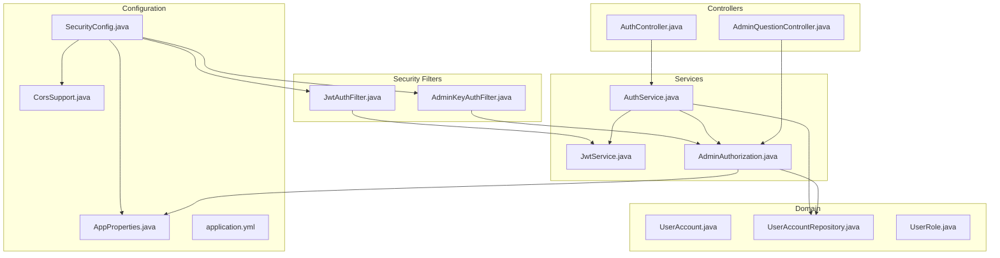

**Diagram sources**
- [SecurityConfig.java:42-74](file://backend/src/main/java/com/neetlu/examhunt/config/SecurityConfig.java#L42-L74)
- [JwtAuthFilter.java:22-58](file://backend/src/main/java/com/neetlu/examhunt/security/JwtAuthFilter.java#L22-L58)
- [AdminKeyAuthFilter.java:21-49](file://backend/src/main/java/com/neetlu/examhunt/security/AdminKeyAuthFilter.java#L21-L49)
- [JwtService.java:16-62](file://backend/src/main/java/com/neetlu/examhunt/service/JwtService.java#L16-L62)
- [AuthService.java:14-29](file://backend/src/main/java/com/neetlu/examhunt/service/AuthService.java#L14-L29)
- [AdminAuthorization.java:12-84](file://backend/src/main/java/com/neetlu/examhunt/security/AdminAuthorization.java#L12-L84)
- [UserAccount.java:10-71](file://backend/src/main/java/com/neetlu/examhunt/model/UserAccount.java#L10-L71)
- [UserAccountRepository.java:10-16](file://backend/src/main/java/com/neetlu/examhunt/repository/UserAccountRepository.java#L10-L16)
- [UserRole.java:3-6](file://backend/src/main/java/com/neetlu/examhunt/model/UserRole.java#L3-L6)
- [AuthController.java:14-36](file://backend/src/main/java/com/neetlu/examhunt/web/AuthController.java#L14-L36)
- [AdminQuestionController.java:18-70](file://backend/src/main/java/com/neetlu/examhunt/web/AdminQuestionController.java#L18-70)
- [AppProperties.java:6-23](file://backend/src/main/java/com/neetlu/examhunt/config/AppProperties.java#L6-L23)
- [CorsSupport.java:10-36](file://backend/src/main/java/com/neetlu/examhunt/config/CorsSupport.java#L10-L36)
- [application.yml:11-26](file://backend/src/main/resources/application.yml#L11-L26)

**Section sources**
- [SecurityConfig.java:23-76](file://backend/src/main/java/com/neetlu/examhunt/config/SecurityConfig.java#L23-L76)
- [application.yml:11-26](file://backend/src/main/resources/application.yml#L11-L26)

## Core Components
- SecurityConfig: Defines global security policy, CORS, CSRF, session management, exception handling, and filter ordering.
- JwtAuthFilter: Extracts Bearer tokens, validates them via JwtService, and populates SecurityContext with authorities.
- AdminKeyAuthFilter: Accepts legacy admin key via X-Admin-Key header for admin endpoints and sets an ADMIN authority when applicable.
- JwtService: Creates and parses JWT tokens using HMAC-SHA with a secret from AppProperties.
- AuthService: Handles registration, login, and profile retrieval; integrates with AdminAuthorization to synchronize roles.
- AdminAuthorization: Manages admin email and legacy admin key validation, role assignment, and enforcement of admin access.
- AdminAccountBootstrap: Ensures a single configured admin account exists and demotes others.
- AppProperties and application.yml: Provide runtime configuration for secrets, origins, and admin keys.
- Controllers: Expose authentication endpoints and admin endpoints guarded by RBAC.

**Section sources**
- [SecurityConfig.java:42-74](file://backend/src/main/java/com/neetlu/examhunt/config/SecurityConfig.java#L42-L74)
- [JwtAuthFilter.java:22-58](file://backend/src/main/java/com/neetlu/examhunt/security/JwtAuthFilter.java#L22-L58)
- [AdminKeyAuthFilter.java:21-49](file://backend/src/main/java/com/neetlu/examhunt/security/AdminKeyAuthFilter.java#L21-L49)
- [JwtService.java:16-62](file://backend/src/main/java/com/neetlu/examhunt/service/JwtService.java#L16-L62)
- [AuthService.java:14-29](file://backend/src/main/java/com/neetlu/examhunt/service/AuthService.java#L14-L29)
- [AdminAuthorization.java:12-84](file://backend/src/main/java/com/neetlu/examhunt/security/AdminAuthorization.java#L12-L84)
- [AdminAccountBootstrap.java:14-61](file://backend/src/main/java/com/neetlu/examhunt/config/AdminAccountBootstrap.java#L14-L61)
- [AppProperties.java:6-23](file://backend/src/main/java/com/neetlu/examhunt/config/AppProperties.java#L6-L23)
- [application.yml:11-26](file://backend/src/main/resources/application.yml#L11-L26)
- [AuthController.java:14-36](file://backend/src/main/java/com/neetlu/examhunt/web/AuthController.java#L14-L36)
- [AdminQuestionController.java:18-70](file://backend/src/main/java/com/neetlu/examhunt/web/AdminQuestionController.java#L18-70)

## Architecture Overview
The security subsystem enforces authentication and authorization across HTTP requests:
- Requests enter the filter chain before reaching controllers.
- AdminKeyAuthFilter runs first to allow scripted admin calls via X-Admin-Key.
- JwtAuthFilter validates Bearer tokens and sets authorities.
- SecurityConfig defines permit-all and authenticated patterns per endpoint.
- Admin endpoints are restricted to ADMIN role.

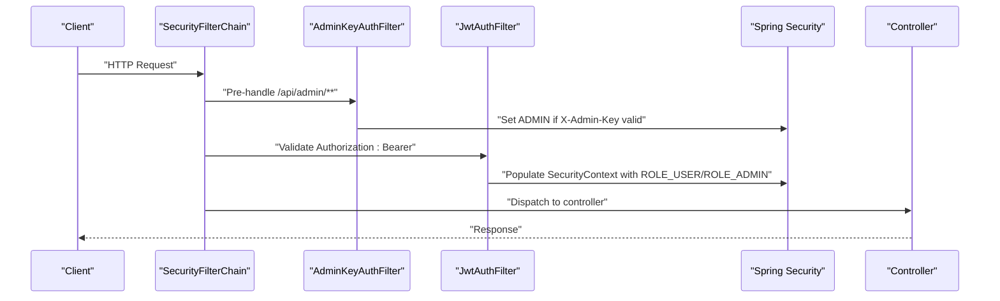

**Diagram sources**
- [SecurityConfig.java:71-72](file://backend/src/main/java/com/neetlu/examhunt/config/SecurityConfig.java#L71-L72)
- [AdminKeyAuthFilter.java:38-47](file://backend/src/main/java/com/neetlu/examhunt/security/AdminKeyAuthFilter.java#L38-L47)
- [JwtAuthFilter.java:39-56](file://backend/src/main/java/com/neetlu/examhunt/security/JwtAuthFilter.java#L39-L56)

## Detailed Component Analysis

### JWT Authentication Filter
Purpose:
- Extract Authorization header, validate token, and populate SecurityContext with authorities derived from the token.

Behavior:
- Skips filtering for registration, login, and OPTIONS requests.
- On successful token validation, creates an authentication token with ROLE_USER or ROLE_ADMIN based on claims.
- Clears context on invalid tokens.

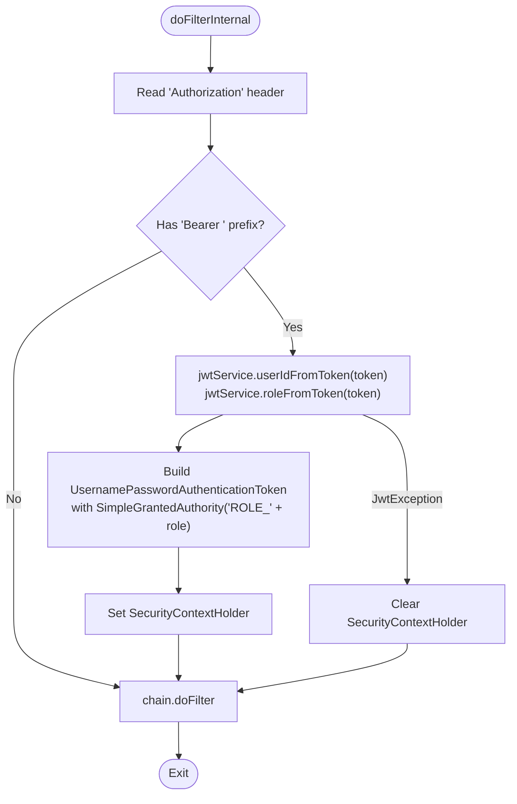

**Diagram sources**
- [JwtAuthFilter.java:30-56](file://backend/src/main/java/com/neetlu/examhunt/security/JwtAuthFilter.java#L30-L56)
- [JwtService.java:39-61](file://backend/src/main/java/com/neetlu/examhunt/service/JwtService.java#L39-L61)

**Section sources**
- [JwtAuthFilter.java:22-58](file://backend/src/main/java/com/neetlu/examhunt/security/JwtAuthFilter.java#L22-L58)
- [JwtService.java:16-62](file://backend/src/main/java/com/neetlu/examhunt/service/JwtService.java#L16-L62)

### Admin Authorization Mechanisms
Purpose:
- Enforce admin-only access for /api/admin/** endpoints using either:
  - Bearer token with ADMIN role (primary), or
  - Legacy admin key via X-Admin-Key header (fallback for scripted calls).

Components:
- AdminKeyAuthFilter: Sets an ADMIN authority when a valid legacy key is present and no existing authentication exists.
- AdminAuthorization: Validates admin email, determines effective role, synchronizes user roles, and enforces admin access.

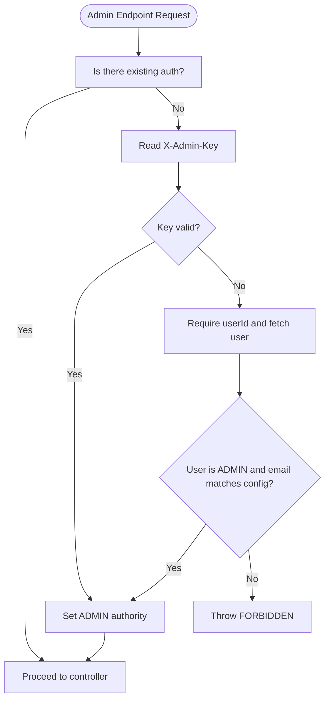

**Diagram sources**
- [AdminKeyAuthFilter.java:32-47](file://backend/src/main/java/com/neetlu/examhunt/security/AdminKeyAuthFilter.java#L32-L47)
- [AdminAuthorization.java:44-56](file://backend/src/main/java/com/neetlu/examhunt/security/AdminAuthorization.java#L44-L56)

**Section sources**
- [AdminKeyAuthFilter.java:21-49](file://backend/src/main/java/com/neetlu/examhunt/security/AdminKeyAuthFilter.java#L21-L49)
- [AdminAuthorization.java:12-84](file://backend/src/main/java/com/neetlu/examhunt/security/AdminAuthorization.java#L12-L84)

### Role-Based Access Control (RBAC)
Policy:
- Public endpoints: registration, login, and selected GET routes are permitted without authentication.
- Authenticated routes: user-specific endpoints require authentication.
- Admin routes: require ADMIN role.
- Feedback endpoints: require authentication.
- Actuator and pre-flight requests are permitted.

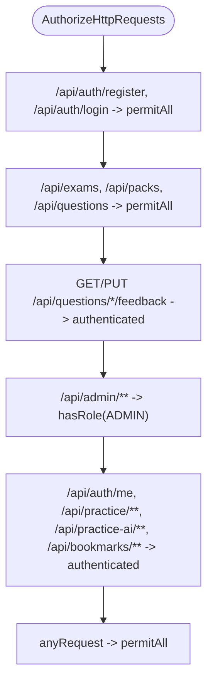

**Diagram sources**
- [SecurityConfig.java:51-70](file://backend/src/main/java/com/neetlu/examhunt/config/SecurityConfig.java#L51-L70)

**Section sources**
- [SecurityConfig.java:42-74](file://backend/src/main/java/com/neetlu/examhunt/config/SecurityConfig.java#L42-L74)

### JWT Token Validation and User Authentication Flow
End-to-end flow:
- Registration/Login: AuthService validates inputs, persists user, and issues JWT via JwtService.
- Subsequent requests: Clients attach Authorization: Bearer <token>; JwtAuthFilter validates and sets authorities.
- Admin actions: AdminKeyAuthFilter may set ADMIN authority for legacy key; otherwise, JwtAuthFilter must supply ADMIN role.

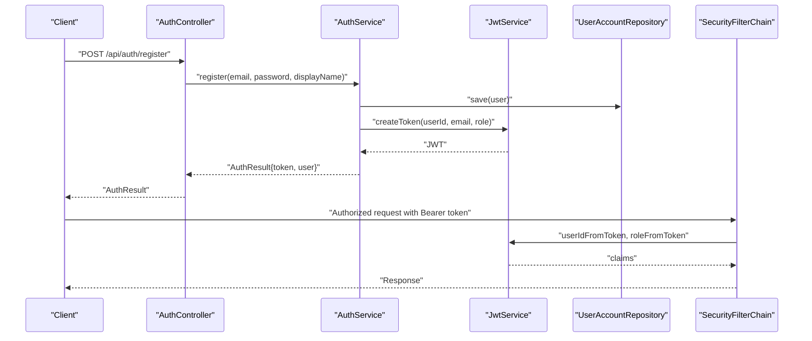

**Diagram sources**
- [AuthController.java:23-36](file://backend/src/main/java/com/neetlu/examhunt/web/AuthController.java#L23-L36)
- [AuthService.java:31-60](file://backend/src/main/java/com/neetlu/examhunt/service/AuthService.java#L31-L60)
- [JwtService.java:26-37](file://backend/src/main/java/com/neetlu/examhunt/service/JwtService.java#L26-L37)
- [JwtAuthFilter.java:42-51](file://backend/src/main/java/com/neetlu/examhunt/security/JwtAuthFilter.java#L42-L51)

**Section sources**
- [AuthController.java:14-36](file://backend/src/main/java/com/neetlu/examhunt/web/AuthController.java#L14-L36)
- [AuthService.java:14-29](file://backend/src/main/java/com/neetlu/examhunt/service/AuthService.java#L14-L29)
- [JwtService.java:16-62](file://backend/src/main/java/com/neetlu/examhunt/service/JwtService.java#L16-L62)
- [JwtAuthFilter.java:22-58](file://backend/src/main/java/com/neetlu/examhunt/security/JwtAuthFilter.java#L22-L58)

### Admin Key-Based Authentication
- AdminKeyAuthFilter checks X-Admin-Key for /api/admin/** requests when no existing authentication is present.
- AdminAuthorization supports a legacy admin key for scripted operations and enforces admin access when both userId and key are absent.

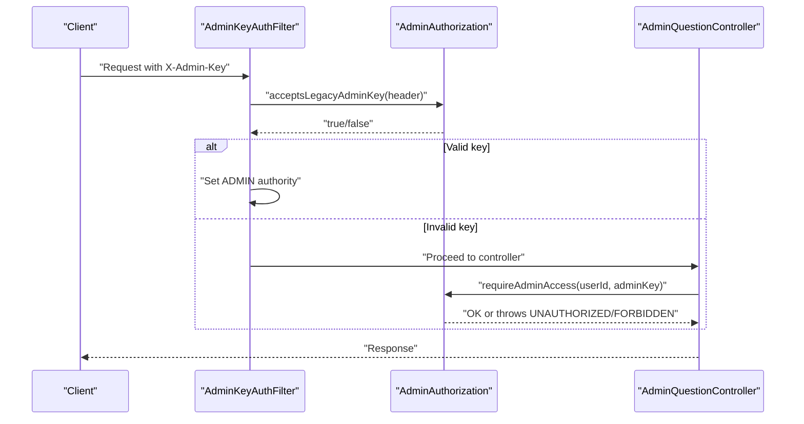

**Diagram sources**
- [AdminKeyAuthFilter.java:38-47](file://backend/src/main/java/com/neetlu/examhunt/security/AdminKeyAuthFilter.java#L38-L47)
- [AdminAuthorization.java:44-56](file://backend/src/main/java/com/neetlu/examhunt/security/AdminAuthorization.java#L44-L56)
- [AdminQuestionController.java:38-48](file://backend/src/main/java/com/neetlu/examhunt/web/AdminQuestionController.java#L38-L48)

**Section sources**
- [AdminKeyAuthFilter.java:21-49](file://backend/src/main/java/com/neetlu/examhunt/security/AdminKeyAuthFilter.java#L21-L49)
- [AdminAuthorization.java:44-56](file://backend/src/main/java/com/neetlu/examhunt/security/AdminAuthorization.java#L44-L56)
- [AdminQuestionController.java:18-70](file://backend/src/main/java/com/neetlu/examhunt/web/AdminQuestionController.java#L18-70)

### Security Configuration: CORS, CSRF, and HTTP Headers
- CORS: Configured centrally; origins come from AppProperties and include development patterns. Credentials are enabled with explicit allowed origins.
- CSRF: Disabled globally because the application is stateless (STATELESS sessions).
- HTTP Security Headers: Not explicitly configured in the provided files; defaults apply. Consider adding HSTS, X-Frame-Options, X-Content-Type-Options, and Content-Security-Policy in production.

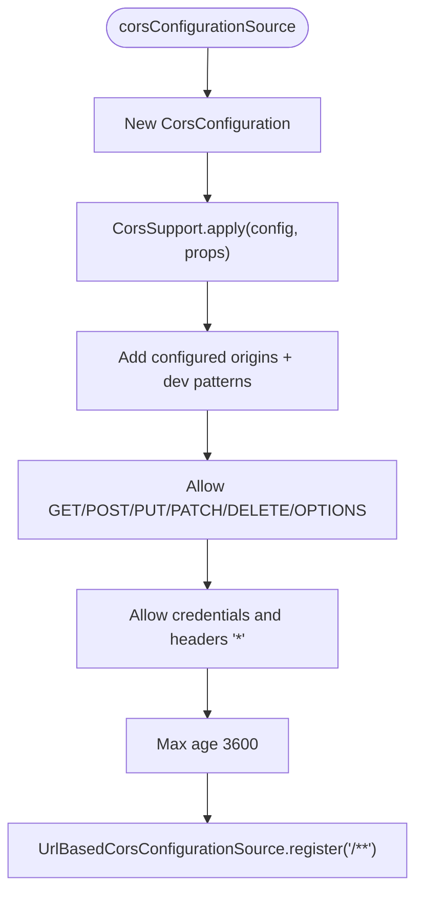

**Diagram sources**
- [SecurityConfig.java:33-39](file://backend/src/main/java/com/neetlu/examhunt/config/SecurityConfig.java#L33-L39)
- [CorsSupport.java:22-35](file://backend/src/main/java/com/neetlu/examhunt/config/CorsSupport.java#L22-L35)

**Section sources**
- [SecurityConfig.java:42-74](file://backend/src/main/java/com/neetlu/examhunt/config/SecurityConfig.java#L42-L74)
- [CorsSupport.java:10-36](file://backend/src/main/java/com/neetlu/examhunt/config/CorsSupport.java#L10-L36)
- [AppProperties.java:6-23](file://backend/src/main/java/com/neetlu/examhunt/config/AppProperties.java#L6-L23)
- [application.yml:11-12](file://backend/src/main/resources/application.yml#L11-L12)

### JWT Token Creation and Validation Details
- Secret and expiration: Loaded from AppProperties and application.yml.
- Claims: subject (userId), email, role.
- Validation: Signed with HMAC-SHA using the configured secret; parsing verifies signature and extracts payload.

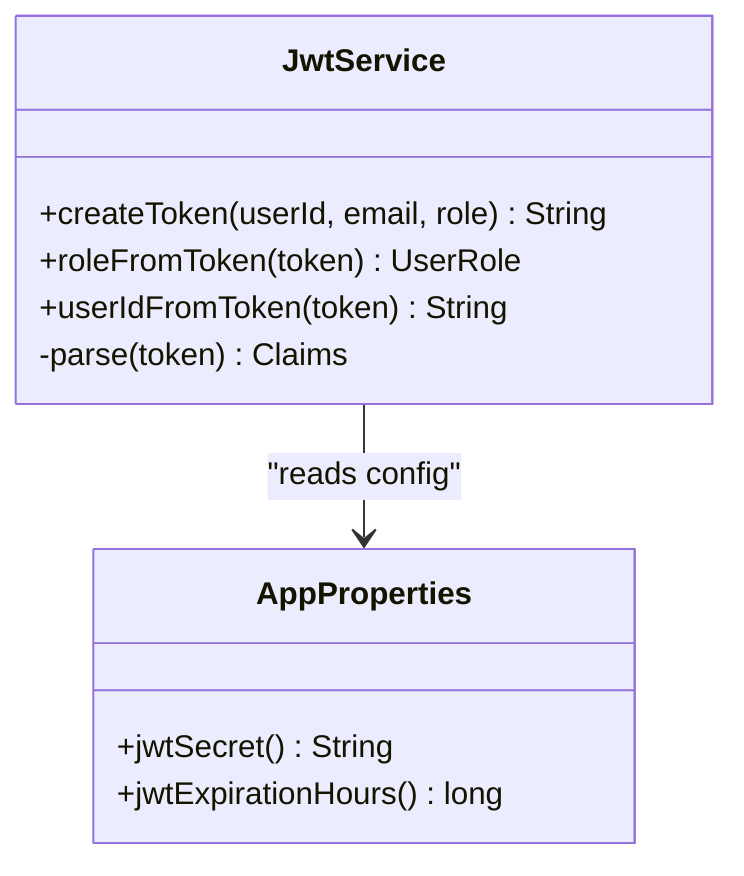

**Diagram sources**
- [JwtService.java:16-62](file://backend/src/main/java/com/neetlu/examhunt/service/JwtService.java#L16-L62)
- [AppProperties.java:6-23](file://backend/src/main/java/com/neetlu/examhunt/config/AppProperties.java#L6-L23)

**Section sources**
- [JwtService.java:16-62](file://backend/src/main/java/com/neetlu/examhunt/service/JwtService.java#L16-L62)
- [application.yml:20-21](file://backend/src/main/resources/application.yml#L20-L21)

### Admin Account Bootstrap and Role Synchronization
- AdminAccountBootstrap ensures a single admin account exists and demotes non-configured admins.
- AuthService.syncAndSaveRole keeps user roles aligned with AdminAuthorization.roleFor.

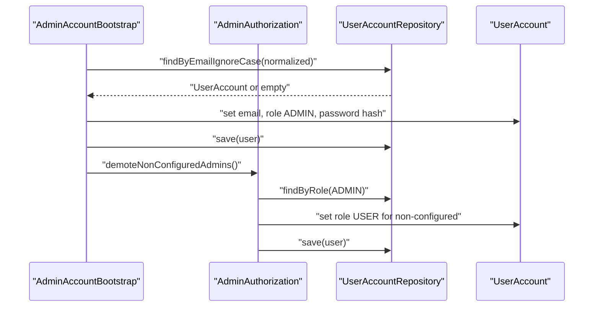

**Diagram sources**
- [AdminAccountBootstrap.java:35-60](file://backend/src/main/java/com/neetlu/examhunt/config/AdminAccountBootstrap.java#L35-L60)
- [AdminAuthorization.java:58-70](file://backend/src/main/java/com/neetlu/examhunt/security/AdminAuthorization.java#L58-L70)
- [UserAccountRepository.java:10-16](file://backend/src/main/java/com/neetlu/examhunt/repository/UserAccountRepository.java#L10-L16)

**Section sources**
- [AdminAccountBootstrap.java:14-61](file://backend/src/main/java/com/neetlu/examhunt/config/AdminAccountBootstrap.java#L14-L61)
- [AuthService.java:77-83](file://backend/src/main/java/com/neetlu/examhunt/service/AuthService.java#L77-L83)
- [AdminAuthorization.java:36-42](file://backend/src/main/java/com/neetlu/examhunt/security/AdminAuthorization.java#L36-L42)

## Dependency Analysis
- SecurityConfig depends on AdminKeyAuthFilter, JwtAuthFilter, AppProperties, and CorsSupport.
- JwtAuthFilter depends on JwtService.
- AdminKeyAuthFilter depends on AdminAuthorization.
- AuthService depends on UserAccountRepository, PasswordEncoder, JwtService, and AdminAuthorization.
- AdminAuthorization depends on AppProperties and UserAccountRepository.
- Controllers depend on services and enforce authorization via SecurityConfig patterns.

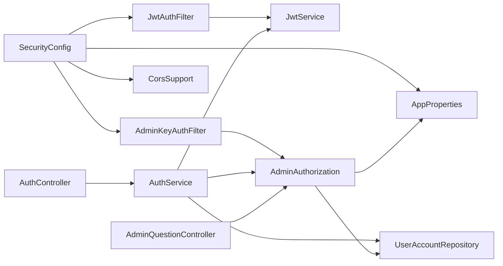

**Diagram sources**
- [SecurityConfig.java:42-74](file://backend/src/main/java/com/neetlu/examhunt/config/SecurityConfig.java#L42-L74)
- [JwtAuthFilter.java:24-28](file://backend/src/main/java/com/neetlu/examhunt/security/JwtAuthFilter.java#L24-L28)
- [AdminKeyAuthFilter.java:26-30](file://backend/src/main/java/com/neetlu/examhunt/security/AdminKeyAuthFilter.java#L26-L30)
- [AuthService.java:15-29](file://backend/src/main/java/com/neetlu/examhunt/service/AuthService.java#L15-L29)
- [AdminAuthorization.java:14-20](file://backend/src/main/java/com/neetlu/examhunt/security/AdminAuthorization.java#L14-L20)
- [AuthController.java:17-21](file://backend/src/main/java/com/neetlu/examhunt/web/AuthController.java#L17-L21)
- [AdminQuestionController.java:21-28](file://backend/src/main/java/com/neetlu/examhunt/web/AdminQuestionController.java#L21-L28)

**Section sources**
- [SecurityConfig.java:42-74](file://backend/src/main/java/com/neetlu/examhunt/config/SecurityConfig.java#L42-L74)
- [AuthService.java:14-29](file://backend/src/main/java/com/neetlu/examhunt/service/AuthService.java#L14-L29)
- [AdminAuthorization.java:12-20](file://backend/src/main/java/com/neetlu/examhunt/security/AdminAuthorization.java#L12-L20)

## Performance Considerations
- Stateless design: No server-side session storage improves scalability.
- Minimal filter work: JwtAuthFilter performs lightweight header parsing and token validation.
- Role caching: Authorities are derived from tokens; avoid frequent database reads for roles.
- Token expiration: Shorter expirations reduce risk but increase re-auth frequency; balance security and UX.
- CORS overhead: Allow-listed origins improve security; avoid wildcards with credentials enabled.

[No sources needed since this section provides general guidance]

## Troubleshooting Guide
Common issues and resolutions:
- Unauthorized due to missing or invalid Bearer token:
  - Ensure Authorization header uses "Bearer <token>" format.
  - Verify token was issued by the same JWT secret and not expired.
- Forbidden when accessing admin endpoints:
  - Confirm user has ADMIN role and email matches configured admin email.
  - Alternatively, send X-Admin-Key for scripted access.
- CORS errors:
  - Confirm origin is included in configured cors-origins or matches development patterns.
  - Ensure credentials are enabled and allowed headers/methods align with client requests.
- CSRF disabled:
  - Expected for stateless APIs; do not enable CSRF for stateless applications.
- Token validation failures:
  - Check JWT secret consistency across deployments.
  - Validate clock skew and token signing algorithm.

**Section sources**
- [JwtAuthFilter.java:42-56](file://backend/src/main/java/com/neetlu/examhunt/security/JwtAuthFilter.java#L42-L56)
- [AdminAuthorization.java:44-56](file://backend/src/main/java/com/neetlu/examhunt/security/AdminAuthorization.java#L44-L56)
- [CorsSupport.java:22-35](file://backend/src/main/java/com/neetlu/examhunt/config/CorsSupport.java#L22-L35)

## Conclusion
The security subsystem combines stateless JWT authentication, admin key-based access, and RBAC to protect both public and admin endpoints. SecurityConfig centralizes policy, filters handle authentication, and services manage token lifecycle and role synchronization. While CSRF is disabled for stateless operation and CORS is configured securely, consider adding explicit HTTP security headers in production for hardened deployments.

[No sources needed since this section summarizes without analyzing specific files]

## Appendices

### Example Security Configurations
- Application properties:
  - Configure JWT secret and expiration hours.
  - Define admin email and optional admin import key.
  - Set CORS origins for production domains.
- Controller usage:
  - Admin endpoints accept either Bearer token with ADMIN role or X-Admin-Key.
  - Auth endpoints remain open for registration and login.

**Section sources**
- [application.yml:11-26](file://backend/src/main/resources/application.yml#L11-L26)
- [AdminQuestionController.java:30-70](file://backend/src/main/java/com/neetlu/examhunt/web/AdminQuestionController.java#L30-L70)
- [AuthController.java:23-36](file://backend/src/main/java/com/neetlu/examhunt/web/AuthController.java#L23-L36)

### Token Refresh Mechanism
- Current implementation does not include automatic token refresh.
- Recommended pattern: Issue short-lived access tokens and optionally long-lived refresh tokens; validate refresh tokens against secure storage and rotate them.

[No sources needed since this section provides general guidance]

### Secure Coding Practices
- Never log raw JWT secrets or tokens.
- Enforce HTTPS in production to protect Authorization headers.
- Validate and sanitize all inputs; avoid storing sensitive data unnecessarily.
- Regularly rotate JWT secrets and monitor for anomalies.

[No sources needed since this section provides general guidance]