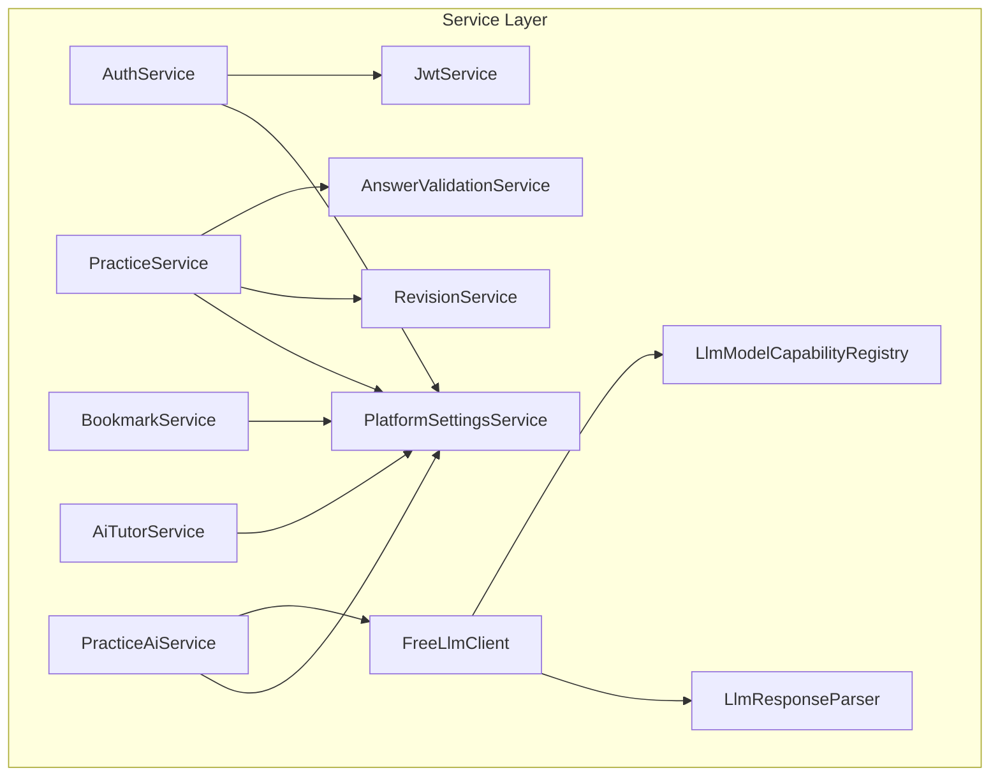
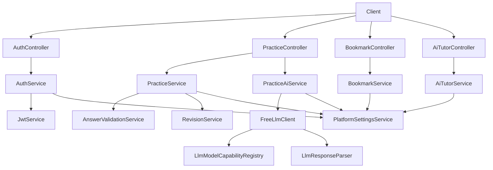
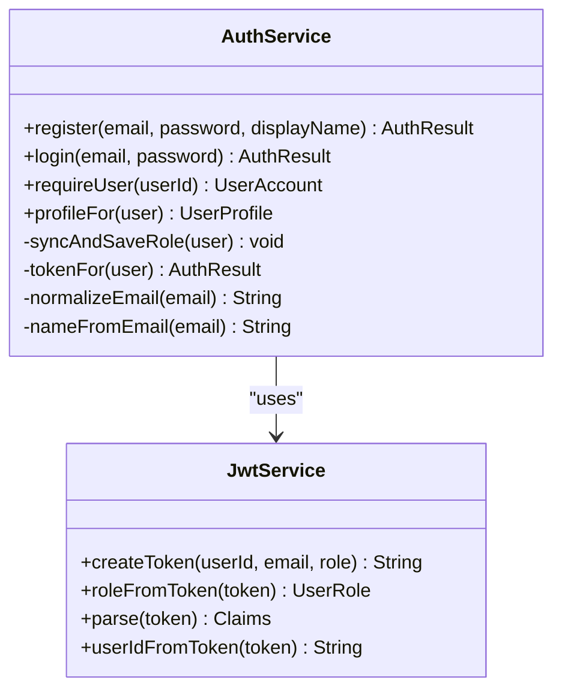
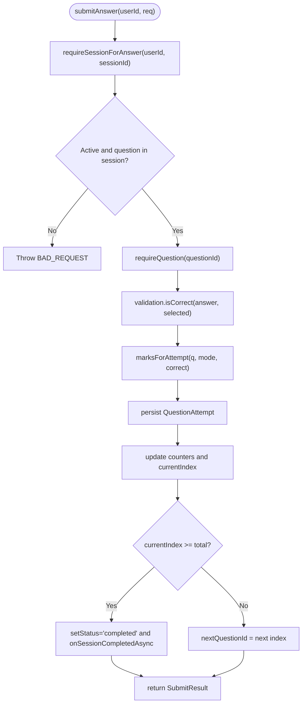
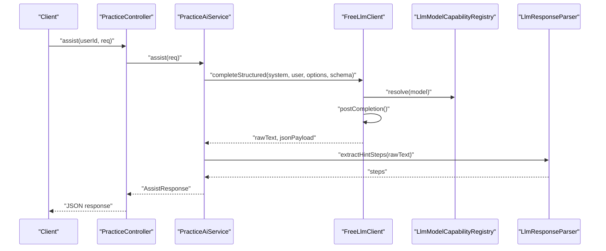
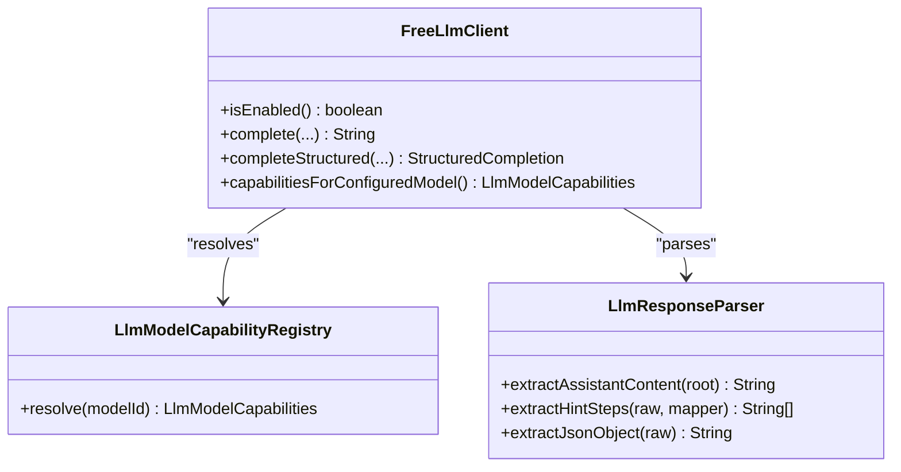
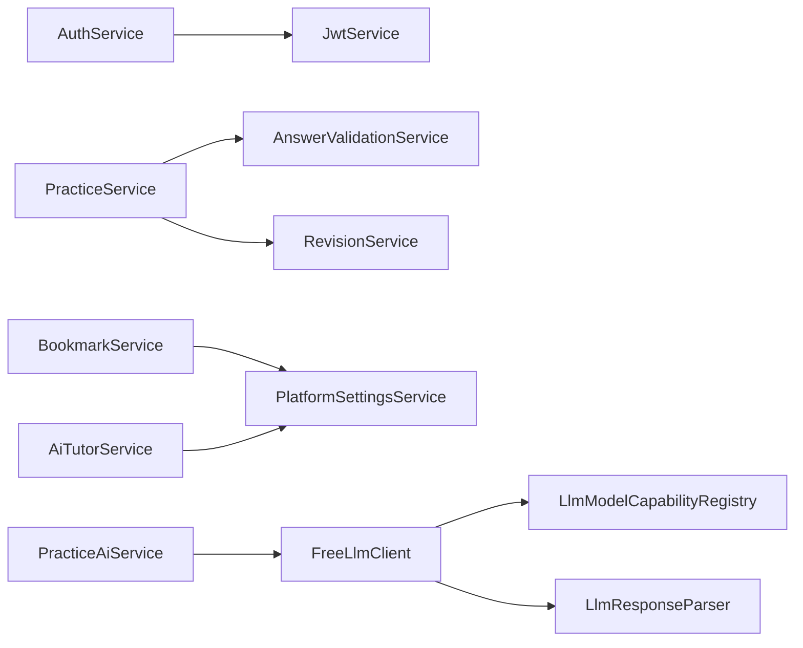

# Service Layer

<cite>
**Referenced Files in This Document**
- [AuthService.java](file://backend/src/main/java/com/neetlu/examhunt/service/AuthService.java)
- [JwtService.java](file://backend/src/main/java/com/neetlu/examhunt/service/JwtService.java)
- [PracticeService.java](file://backend/src/main/java/com/neetlu/examhunt/service/PracticeService.java)
- [BookmarkService.java](file://backend/src/main/java/com/neetlu/examhunt/service/BookmarkService.java)
- [AiTutorService.java](file://backend/src/main/java/com/neetlu/examhunt/service/AiTutorService.java)
- [PracticeAiService.java](file://backend/src/main/java/com/neetlu/examhunt/service/PracticeAiService.java)
- [FreeLlmClient.java](file://backend/src/main/java/com/neetlu/examhunt/service/FreeLlmClient.java)
- [LlmModelCapabilityRegistry.java](file://backend/src/main/java/com/neetlu/examhunt/service/llm/LlmModelCapabilityRegistry.java)
- [LlmResponseParser.java](file://backend/src/main/java/com/neetlu/examhunt/service/llm/LlmResponseParser.java)
- [PlatformSettingsService.java](file://backend/src/main/java/com/neetlu/examhunt/service/PlatformSettingsService.java)
- [AnswerValidationService.java](file://backend/src/main/java/com/neetlu/examhunt/service/AnswerValidationService.java)
- [RevisionService.java](file://backend/src/main/java/com/neetlu/examhunt/service/RevisionService.java)
</cite>

## Table of Contents
1. [Introduction](#introduction)
2. [Project Structure](#project-structure)
3. [Core Components](#core-components)
4. [Architecture Overview](#architecture-overview)
5. [Detailed Component Analysis](#detailed-component-analysis)
6. [Dependency Analysis](#dependency-analysis)
7. [Performance Considerations](#performance-considerations)
8. [Troubleshooting Guide](#troubleshooting-guide)
9. [Conclusion](#conclusion)

## Introduction
This document explains the service layer architecture and implementation of the exam-hunt-project. It focuses on how business logic is organized, how dependency injection is applied, and how transactions and error handling are managed. It documents the primary services (AuthService, PracticeService, BookmarkService, and AI-related services), the LLM integration patterns, response parsing, and model capability management. It also covers relationships between services, data transformation patterns, external API integrations, testing strategies, performance considerations, and scalability patterns.

## Project Structure
The service layer resides under backend/src/main/java/com/neetlu/examhunt/service and includes:
- Authentication and authorization services (AuthService, JwtService)
- Practice and assessment services (PracticeService, AnswerValidationService, RevisionService)
- Bookmarking service (BookmarkService)
- AI tutoring and practice assistance (AiTutorService, PracticeAiService)
- LLM integration (FreeLlmClient, LlmModelCapabilityRegistry, LlmResponseParser)
- Platform settings (PlatformSettingsService)

**Diagram sources**
- [AuthService.java:12-29](file://backend/src/main/java/com/neetlu/examhunt/service/AuthService.java#L12-L29)
- [JwtService.java:15-24](file://backend/src/main/java/com/neetlu/examhunt/service/JwtService.java#L15-L24)
- [PracticeService.java:26-58](file://backend/src/main/java/com/neetlu/examhunt/service/PracticeService.java#L26-L58)
- [BookmarkService.java:20-34](file://backend/src/main/java/com/neetlu/examhunt/service/BookmarkService.java#L20-L34)
- [AiTutorService.java:11-18](file://backend/src/main/java/com/neetlu/examhunt/service/AiTutorService.java#L11-L18)
- [PracticeAiService.java:30-178](file://backend/src/main/java/com/neetlu/examhunt/service/PracticeAiService.java#L30-L178)
- [FreeLlmClient.java:30-60](file://backend/src/main/java/com/neetlu/examhunt/service/FreeLlmClient.java#L30-L60)
- [LlmModelCapabilityRegistry.java:13-78](file://backend/src/main/java/com/neetlu/examhunt/service/llm/LlmModelCapabilityRegistry.java#L13-L78)
- [LlmResponseParser.java:12-34](file://backend/src/main/java/com/neetlu/examhunt/service/llm/LlmResponseParser.java#L12-L34)
- [PlatformSettingsService.java:10-27](file://backend/src/main/java/com/neetlu/examhunt/service/PlatformSettingsService.java#L10-L27)
- [AnswerValidationService.java:5-34](file://backend/src/main/java/com/neetlu/examhunt/service/AnswerValidationService.java#L5-L34)
- [RevisionService.java:19-33](file://backend/src/main/java/com/neetlu/examhunt/service/RevisionService.java#L19-L33)

**Section sources**
- [AuthService.java:12-105](file://backend/src/main/java/com/neetlu/examhunt/service/AuthService.java#L12-L105)
- [PracticeService.java:26-182](file://backend/src/main/java/com/neetlu/examhunt/service/PracticeService.java#L26-L182)
- [BookmarkService.java:20-170](file://backend/src/main/java/com/neetlu/examhunt/service/BookmarkService.java#L20-L170)
- [AiTutorService.java:11-84](file://backend/src/main/java/com/neetlu/examhunt/service/AiTutorService.java#L11-L84)
- [PracticeAiService.java:30-1200](file://backend/src/main/java/com/neetlu/examhunt/service/PracticeAiService.java#L30-L1200)
- [FreeLlmClient.java:30-327](file://backend/src/main/java/com/neetlu/examhunt/service/FreeLlmClient.java#L30-L327)
- [LlmModelCapabilityRegistry.java:13-78](file://backend/src/main/java/com/neetlu/examhunt/service/llm/LlmModelCapabilityRegistry.java#L13-L78)
- [LlmResponseParser.java:12-239](file://backend/src/main/java/com/neetlu/examhunt/service/llm/LlmResponseParser.java#L12-L239)
- [PlatformSettingsService.java:10-126](file://backend/src/main/java/com/neetlu/examhunt/service/PlatformSettingsService.java#L10-L126)
- [AnswerValidationService.java:5-35](file://backend/src/main/java/com/neetlu/examhunt/service/AnswerValidationService.java#L5-L35)
- [RevisionService.java:19-207](file://backend/src/main/java/com/neetlu/examhunt/service/RevisionService.java#L19-L207)

## Core Components
- Authentication and Authorization
  - AuthService orchestrates registration, login, and user profile retrieval. It integrates with JwtService for tokens and AdminAuthorization for role synchronization.
  - JwtService generates and validates JWTs using a secret key and expiration policy.
- Practice and Assessment
  - PracticeService manages session lifecycle, adaptive ordering, scoring, and analytics. It coordinates with AnswerValidationService and RevisionService.
  - AnswerValidationService provides normalization and scoring rules for answers.
  - RevisionService maintains a revision queue for wrong attempts and supports bulk operations.
- Bookmarking
  - BookmarkService toggles bookmarks, checks statuses, lists items, and enforces platform settings gating.
- AI Tutoring and Practice Assistance
  - AiTutorService provides keyword-driven replies and hints when AI tutor is in preview mode.
  - PracticeAiService integrates FreeLlmClient to deliver hints, formulas, basics, pitfalls, and curated drills. It parses and normalizes LLM outputs.
- LLM Integration
  - FreeLlmClient encapsulates OpenAI-compatible chat completions, capability-aware JSON mode/schema, and structured output fallbacks.
  - LlmModelCapabilityRegistry resolves model capabilities and defaults.
  - LlmResponseParser extracts assistant content, strips analysis preambles, and normalizes hint steps and JSON payloads.

**Section sources**
- [AuthService.java:12-105](file://backend/src/main/java/com/neetlu/examhunt/service/AuthService.java#L12-L105)
- [JwtService.java:15-62](file://backend/src/main/java/com/neetlu/examhunt/service/JwtService.java#L15-L62)
- [PracticeService.java:26-58](file://backend/src/main/java/com/neetlu/examhunt/service/PracticeService.java#L26-L58)
- [AnswerValidationService.java:5-35](file://backend/src/main/java/com/neetlu/examhunt/service/AnswerValidationService.java#L5-L35)
- [RevisionService.java:19-171](file://backend/src/main/java/com/neetlu/examhunt/service/RevisionService.java#L19-L171)
- [BookmarkService.java:20-170](file://backend/src/main/java/com/neetlu/examhunt/service/BookmarkService.java#L20-L170)
- [AiTutorService.java:11-84](file://backend/src/main/java/com/neetlu/examhunt/service/AiTutorService.java#L11-L84)
- [PracticeAiService.java:30-1200](file://backend/src/main/java/com/neetlu/examhunt/service/PracticeAiService.java#L30-L1200)
- [FreeLlmClient.java:30-327](file://backend/src/main/java/com/neetlu/examhunt/service/FreeLlmClient.java#L30-L327)
- [LlmModelCapabilityRegistry.java:13-78](file://backend/src/main/java/com/neetlu/examhunt/service/llm/LlmModelCapabilityRegistry.java#L13-L78)
- [LlmResponseParser.java:12-239](file://backend/src/main/java/com/neetlu/examhunt/service/llm/LlmResponseParser.java#L12-L239)

## Architecture Overview
The service layer follows a layered pattern with explicit boundaries:
- Services depend on repositories and other services via constructor injection.
- Business logic is centralized in services; controllers delegate to services.
- LLM calls are encapsulated behind FreeLlmClient with capability-aware routing and robust parsing.

**Diagram sources**
- [AuthService.java:12-29](file://backend/src/main/java/com/neetlu/examhunt/service/AuthService.java#L12-L29)
- [JwtService.java:15-24](file://backend/src/main/java/com/neetlu/examhunt/service/JwtService.java#L15-L24)
- [PracticeService.java:26-58](file://backend/src/main/java/com/neetlu/examhunt/service/PracticeService.java#L26-L58)
- [AnswerValidationService.java:5-15](file://backend/src/main/java/com/neetlu/examhunt/service/AnswerValidationService.java#L5-L15)
- [RevisionService.java:19-33](file://backend/src/main/java/com/neetlu/examhunt/service/RevisionService.java#L19-L33)
- [BookmarkService.java:20-34](file://backend/src/main/java/com/neetlu/examhunt/service/BookmarkService.java#L20-L34)
- [AiTutorService.java:11-18](file://backend/src/main/java/com/neetlu/examhunt/service/AiTutorService.java#L11-L18)
- [PracticeAiService.java:30-178](file://backend/src/main/java/com/neetlu/examhunt/service/PracticeAiService.java#L30-L178)
- [FreeLlmClient.java:30-60](file://backend/src/main/java/com/neetlu/examhunt/service/FreeLlmClient.java#L30-L60)
- [LlmModelCapabilityRegistry.java:13-27](file://backend/src/main/java/com/neetlu/examhunt/service/llm/LlmModelCapabilityRegistry.java#L13-L27)
- [LlmResponseParser.java:12-34](file://backend/src/main/java/com/neetlu/examhunt/service/llm/LlmResponseParser.java#L12-L34)
- [PlatformSettingsService.java:10-27](file://backend/src/main/java/com/neetlu/examhunt/service/PlatformSettingsService.java#L10-L27)

## Detailed Component Analysis

### Authentication Service (AuthService)
Responsibilities:
- Normalize and validate emails
- Enforce registration constraints (password length, uniqueness)
- Authenticate users, synchronize roles, and issue JWT tokens
- Build user profiles and handle unauthorized access

Key implementation patterns:
- Constructor injection of UserAccountRepository, PasswordEncoder, JwtService, and AdminAuthorization
- Centralized validation and error signaling via ResponseStatusException
- Role synchronization against admin authorization rules

**Diagram sources**
- [AuthService.java:12-105](file://backend/src/main/java/com/neetlu/examhunt/service/AuthService.java#L12-L105)
- [JwtService.java:15-62](file://backend/src/main/java/com/neetlu/examhunt/service/JwtService.java#L15-L62)

**Section sources**
- [AuthService.java:31-105](file://backend/src/main/java/com/neetlu/examhunt/service/AuthService.java#L31-L105)
- [JwtService.java:26-62](file://backend/src/main/java/com/neetlu/examhunt/service/JwtService.java#L26-L62)

### Practice Service (PracticeService)
Responsibilities:
- Create and manage practice/test sessions with adaptive ordering
- Validate answers, compute scores, and maintain session progress
- Support retake sessions and enforce session expiry rules
- Aggregate progress and analytics, including weak chapters

Key implementation patterns:
- Dependency injection of repositories and supporting services
- Adaptive difficulty adjustment and question reordering
- Strict validation of request parameters and session state
- Asynchronous completion hooks and engagement timing

**Diagram sources**
- [PracticeService.java:278-337](file://backend/src/main/java/com/neetlu/examhunt/service/PracticeService.java#L278-L337)

**Section sources**
- [PracticeService.java:60-182](file://backend/src/main/java/com/neetlu/examhunt/service/PracticeService.java#L60-L182)
- [PracticeService.java:278-337](file://backend/src/main/java/com/neetlu/examhunt/service/PracticeService.java#L278-L337)
- [PracticeService.java:554-556](file://backend/src/main/java/com/neetlu/examhunt/service/PracticeService.java#L554-L556)
- [AnswerValidationService.java:5-35](file://backend/src/main/java/com/neetlu/examhunt/service/AnswerValidationService.java#L5-L35)

### Bookmark Service (BookmarkService)
Responsibilities:
- Toggle bookmarks, batch-check statuses, list bookmarks, and seed sample bookmarks
- Enforce platform settings for bookmark availability
- De-duplicate and limit batch requests

Key implementation patterns:
- Validation-first approach with early exits for disabled features
- Efficient batch queries to reduce round trips
- Safe handling of missing questions by skipping entries

**Section sources**
- [BookmarkService.java:36-170](file://backend/src/main/java/com/neetlu/examhunt/service/BookmarkService.java#L36-L170)
- [PlatformSettingsService.java:19-27](file://backend/src/main/java/com/neetlu/examhunt/service/PlatformSettingsService.java#L19-L27)

### AI Tutor Service (AiTutorService)
Responsibilities:
- Provide keyword-matched replies and fallback responses when AI tutor is in preview mode
- Append contextual notes to replies

Key implementation patterns:
- Early exit when AI tutor is not enabled
- Case-insensitive keyword matching and random fallback selection

**Section sources**
- [AiTutorService.java:20-84](file://backend/src/main/java/com/neetlu/examhunt/service/AiTutorService.java#L20-L84)
- [PlatformSettingsService.java:19-27](file://backend/src/main/java/com/neetlu/examhunt/service/PlatformSettingsService.java#L19-L27)

### Practice AI Service (PracticeAiService)
Responsibilities:
- Deliver AI-powered hints, formulas, basics, pitfalls, revision notes, and curated drills
- Integrate FreeLlmClient with capability-aware JSON mode/schema
- Parse and normalize LLM outputs, with fallbacks and retries

Key implementation patterns:
- Feature-gated orchestration with platform settings
- Structured output extraction and validation
- Retry mechanisms for malformed outputs
- Curated prompts and output normalization rules

**Diagram sources**
- [PracticeAiService.java:297-309](file://backend/src/main/java/com/neetlu/examhunt/service/PracticeAiService.java#L297-L309)
- [FreeLlmClient.java:96-116](file://backend/src/main/java/com/neetlu/examhunt/service/FreeLlmClient.java#L96-L116)
- [LlmModelCapabilityRegistry.java:53-77](file://backend/src/main/java/com/neetlu/examhunt/service/llm/LlmModelCapabilityRegistry.java#L53-L77)
- [LlmResponseParser.java:119-151](file://backend/src/main/java/com/neetlu/examhunt/service/llm/LlmResponseParser.java#L119-L151)

**Section sources**
- [PracticeAiService.java:192-217](file://backend/src/main/java/com/neetlu/examhunt/service/PracticeAiService.java#L192-L217)
- [PracticeAiService.java:279-309](file://backend/src/main/java/com/neetlu/examhunt/service/PracticeAiService.java#L279-L309)
- [FreeLlmClient.java:145-252](file://backend/src/main/java/com/neetlu/examhunt/service/FreeLlmClient.java#L145-L252)
- [LlmModelCapabilityRegistry.java:53-77](file://backend/src/main/java/com/neetlu/examhunt/service/llm/LlmModelCapabilityRegistry.java#L53-L77)
- [LlmResponseParser.java:119-151](file://backend/src/main/java/com/neetlu/examhunt/service/llm/LlmResponseParser.java#L119-L151)

### LLM Integration Patterns
- Capability-aware routing: LlmModelCapabilityRegistry determines JSON mode, JSON schema, reasoning, and tool-calling support.
- Structured output: FreeLlmClient builds request bodies with response_format when supported; falls back to plain text when rejected.
- Response parsing: LlmResponseParser cleans fenced code blocks, strips analysis preambles, and extracts hint steps or JSON objects.
- Model resolution: FreeLlmClient resolves base URL and model ID from configuration, logs usage, and handles parse errors.

**Diagram sources**
- [FreeLlmClient.java:30-60](file://backend/src/main/java/com/neetlu/examhunt/service/FreeLlmClient.java#L30-L60)
- [LlmModelCapabilityRegistry.java:13-78](file://backend/src/main/java/com/neetlu/examhunt/service/llm/LlmModelCapabilityRegistry.java#L13-L78)
- [LlmResponseParser.java:12-34](file://backend/src/main/java/com/neetlu/examhunt/service/llm/LlmResponseParser.java#L12-L34)

**Section sources**
- [FreeLlmClient.java:75-143](file://backend/src/main/java/com/neetlu/examhunt/service/FreeLlmClient.java#L75-L143)
- [FreeLlmClient.java:145-252](file://backend/src/main/java/com/neetlu/examhunt/service/FreeLlmClient.java#L145-L252)
- [LlmModelCapabilityRegistry.java:53-77](file://backend/src/main/java/com/neetlu/examhunt/service/llm/LlmModelCapabilityRegistry.java#L53-L77)
- [LlmResponseParser.java:39-151](file://backend/src/main/java/com/neetlu/examhunt/service/llm/LlmResponseParser.java#L39-L151)

### Platform Settings Service (PlatformSettingsService)
Responsibilities:
- Provide default platform settings if none exist
- Expose public and admin views of settings
- Update settings with validation and sanitization

Key implementation patterns:
- Singleton settings retrieval with lazy initialization
- View models for public/admin exposure
- Defensive updates with min/max bounds and null checks

**Section sources**
- [PlatformSettingsService.java:19-95](file://backend/src/main/java/com/neetlu/examhunt/service/PlatformSettingsService.java#L19-L95)

### Revision Service (RevisionService)
Responsibilities:
- Manage a revision queue for wrong attempts
- Bulk enqueue wrong attempts from a session
- Query and transform queue entries into views

Key implementation patterns:
- Upsert semantics for queue entries
- Batch queries to minimize round trips
- Consistent view mapping with question metadata

**Section sources**
- [RevisionService.java:63-171](file://backend/src/main/java/com/neetlu/examhunt/service/RevisionService.java#L63-L171)

## Dependency Analysis
- Coupling and Cohesion
  - Services are cohesive around single responsibilities and depend on repositories and other services via constructor injection.
  - Low coupling between services through explicit interfaces (repositories) and shared domain models.
- External Dependencies
  - FreeLlmClient depends on RestTemplate and Jackson for HTTP and JSON handling.
  - JwtService depends on JJWT for token signing and verification.
- Potential Circular Dependencies
  - None observed among services; services are layered and unidirectionally dependent.

**Diagram sources**
- [AuthService.java:12-29](file://backend/src/main/java/com/neetlu/examhunt/service/AuthService.java#L12-L29)
- [JwtService.java:15-24](file://backend/src/main/java/com/neetlu/examhunt/service/JwtService.java#L15-L24)
- [PracticeService.java:26-58](file://backend/src/main/java/com/neetlu/examhunt/service/PracticeService.java#L26-L58)
- [AnswerValidationService.java:5-15](file://backend/src/main/java/com/neetlu/examhunt/service/AnswerValidationService.java#L5-L15)
- [RevisionService.java:19-33](file://backend/src/main/java/com/neetlu/examhunt/service/RevisionService.java#L19-L33)
- [BookmarkService.java:20-34](file://backend/src/main/java/com/neetlu/examhunt/service/BookmarkService.java#L20-L34)
- [AiTutorService.java:11-18](file://backend/src/main/java/com/neetlu/examhunt/service/AiTutorService.java#L11-L18)
- [PracticeAiService.java:30-178](file://backend/src/main/java/com/neetlu/examhunt/service/PracticeAiService.java#L30-L178)
- [FreeLlmClient.java:30-60](file://backend/src/main/java/com/neetlu/examhunt/service/FreeLlmClient.java#L30-L60)
- [LlmModelCapabilityRegistry.java:13-27](file://backend/src/main/java/com/neetlu/examhunt/service/llm/LlmModelCapabilityRegistry.java#L13-L27)
- [LlmResponseParser.java:12-34](file://backend/src/main/java/com/neetlu/examhunt/service/llm/LlmResponseParser.java#L12-L34)
- [PlatformSettingsService.java:10-27](file://backend/src/main/java/com/neetlu/examhunt/service/PlatformSettingsService.java#L10-L27)

**Section sources**
- [AuthService.java:12-29](file://backend/src/main/java/com/neetlu/examhunt/service/AuthService.java#L12-L29)
- [PracticeService.java:26-58](file://backend/src/main/java/com/neetlu/examhunt/service/PracticeService.java#L26-L58)
- [BookmarkService.java:20-34](file://backend/src/main/java/com/neetlu/examhunt/service/BookmarkService.java#L20-L34)
- [AiTutorService.java:11-18](file://backend/src/main/java/com/neetlu/examhunt/service/AiTutorService.java#L11-L18)
- [PracticeAiService.java:30-178](file://backend/src/main/java/com/neetlu/examhunt/service/PracticeAiService.java#L30-L178)
- [FreeLlmClient.java:30-60](file://backend/src/main/java/com/neetlu/examhunt/service/FreeLlmClient.java#L30-L60)
- [LlmModelCapabilityRegistry.java:13-27](file://backend/src/main/java/com/neetlu/examhunt/service/llm/LlmModelCapabilityRegistry.java#L13-L27)
- [LlmResponseParser.java:12-34](file://backend/src/main/java/com/neetlu/examhunt/service/llm/LlmResponseParser.java#L12-L34)
- [PlatformSettingsService.java:10-27](file://backend/src/main/java/com/neetlu/examhunt/service/PlatformSettingsService.java#L10-L27)
- [AnswerValidationService.java:5-15](file://backend/src/main/java/com/neetlu/examhunt/service/AnswerValidationService.java#L5-L15)
- [RevisionService.java:19-33](file://backend/src/main/java/com/neetlu/examhunt/service/RevisionService.java#L19-L33)

## Performance Considerations
- Minimize database round trips:
  - Use batch queries for bookmark status and question enrichment.
  - Stream analytics aggregates and limit result sets.
- Optimize LLM calls:
  - Prefer JSON mode/schema when supported to reduce parsing overhead.
  - Apply structured output fallbacks and retries judiciously.
- Concurrency and timeouts:
  - FreeLlmClient sets connect/read timeouts suitable for cold-start environments.
- Caching and memoization:
  - Cache platform settings reads and consider caching frequent prompts for reuse.

## Troubleshooting Guide
- Authentication failures:
  - Verify email normalization and password encoder usage.
  - Confirm admin role synchronization and forbidden registrations for admin emails.
- Practice session errors:
  - Ensure session exists, is active, and contains the question.
  - Check for duplicate attempts and session expiry conditions.
- LLM integration issues:
  - Confirm API key and base URL configuration.
  - Inspect capability registry resolution and response parsing logs.
- AI tutor preview mode:
  - Validate platform settings enabling mock mode and keyword replies.

**Section sources**
- [AuthService.java:31-83](file://backend/src/main/java/com/neetlu/examhunt/service/AuthService.java#L31-L83)
- [PracticeService.java:278-337](file://backend/src/main/java/com/neetlu/examhunt/service/PracticeService.java#L278-L337)
- [FreeLlmClient.java:145-252](file://backend/src/main/java/com/neetlu/examhunt/service/FreeLlmClient.java#L145-L252)
- [AiTutorService.java:20-40](file://backend/src/main/java/com/neetlu/examhunt/service/AiTutorService.java#L20-L40)

## Conclusion
The service layer cleanly separates business logic from infrastructure concerns, with strong dependency injection and clear service boundaries. The LLM integration is capability-aware, resilient, and designed for structured outputs with robust parsing. Services enforce business rules, handle errors gracefully, and expose consistent views for clients. The architecture supports scalability through batch operations, caching opportunities, and modular service composition.