# Web Layer

<cite>
**Referenced Files in This Document**
- [AuthController.java](file://backend/src/main/java/com/neetlu/examhunt/web/AuthController.java)
- [QuestionController.java](file://backend/src/main/java/com/neetlu/examhunt/web/QuestionController.java)
- [PracticeController.java](file://backend/src/main/java/com/neetlu/examhunt/web/PracticeController.java)
- [AdminQuestionController.java](file://backend/src/main/java/com/neetlu/examhunt/web/AdminQuestionController.java)
- [AdminPackController.java](file://backend/src/main/java/com/neetlu/examhunt/web/AdminPackController.java)
- [AdminSettingsController.java](file://backend/src/main/java/com/neetlu/examhunt/web/AdminSettingsController.java)
- [AiTutorController.java](file://backend/src/main/java/com/neetlu/examhunt/web/AiTutorController.java)
- [BookmarkController.java](file://backend/src/main/java/com/neetlu/examhunt/web/BookmarkController.java)
- [LeaderboardController.java](file://backend/src/main/java/com/neetlu/examhunt/web/LeaderboardController.java)
- [PackController.java](file://backend/src/main/java/com/neetlu/examhunt/web/PackController.java)
- [RevisionController.java](file://backend/src/main/java/com/neetlu/examhunt/web/RevisionController.java)
- [ApiExceptionHandler.java](file://backend/src/main/java/com/neetlu/examhunt/web/ApiExceptionHandler.java)
- [WebConfig.java](file://backend/src/main/java/com/neetlu/examhunt/config/WebConfig.java)
- [CorsSupport.java](file://backend/src/main/java/com/neetlu/examhunt/config/CorsSupport.java)
- [AppProperties.java](file://backend/src/main/java/com/neetlu/examhunt/config/AppProperties.java)
</cite>

## Table of Contents
1. [Introduction](#introduction)
2. [Project Structure](#project-structure)
3. [Core Components](#core-components)
4. [Architecture Overview](#architecture-overview)
5. [Detailed Component Analysis](#detailed-component-analysis)
6. [Dependency Analysis](#dependency-analysis)
7. [Performance Considerations](#performance-considerations)
8. [Troubleshooting Guide](#troubleshooting-guide)
9. [Conclusion](#conclusion)
10. [Appendices](#appendices)

## Introduction
This document describes the web layer implementation of the backend, focusing on REST controllers and web configuration. It covers the primary controllers for authentication, questions, and practice, along with administrative controllers for question management, content packs, and platform settings. It also documents request/response handling, parameter validation, exception mapping, CORS configuration, and security integration. Guidance on testing strategies, API versioning, backward compatibility, performance optimization, rate limiting, and monitoring is included.

## Project Structure
The web layer is organized under the package com.neetlu.examhunt.web, with dedicated controllers grouped by domain:
- Authentication and user profile
- Question browsing, search, and detail views
- Practice sessions, submission, and review
- Administrative endpoints for questions, packs, and settings
- Auxiliary controllers for bookmarks, leaderboard, packs catalog, revision queue, and AI tutor

```mermaid
graph TB
subgraph "Controllers"
AC["AuthController"]
QC["QuestionController"]
PC["PracticeController"]
AQ["AdminQuestionController"]
AP["AdminPackController"]
AS["AdminSettingsController"]
AT["AiTutorController"]
BC["BookmarkController"]
LC["LeaderboardController"]
PK["PackController"]
RC["RevisionController"]
end
subgraph "Web Config"
WC["WebConfig"]
CS["CorsSupport"]
APProps["AppProperties"]
end
AC --> |"uses"| AuthService["AuthService"]
QC --> |"uses"| QuestionBrowseService["QuestionBrowseService"]
QC --> |"uses"| ManifestImportService["ManifestImportService"]
PC --> |"uses"| PracticeService["PracticeService"]
AQ --> |"uses"| AdminQuestionService["AdminQuestionService"]
AP --> |"uses"| ContentPackRepository["ContentPackRepository"]
AP --> |"uses"| PackStatsService["PackStatsService"]
AP --> |"uses"| ManifestImportService
AS --> |"uses"| PlatformSettingsService["PlatformSettingsService"]
AT --> |"uses"| AiTutorService["AiTutorService"]
BC --> |"uses"| BookmarkService["BookmarkService"]
LC --> |"uses"| LeaderboardService["LeaderboardService"]
PK --> |"uses"| PackCatalogService["PackCatalogService"]
PK --> |"uses"| PublicApiCacheProperties["PublicApiCacheProperties"]
RC --> |"uses"| RevisionService["RevisionService"]
WC --> CS
CS --> APProps
```

**Diagram sources**
- [AuthController.java:1-45](file://backend/src/main/java/com/neetlu/examhunt/web/AuthController.java#L1-L45)
- [QuestionController.java:1-292](file://backend/src/main/java/com/neetlu/examhunt/web/QuestionController.java#L1-L292)
- [PracticeController.java:1-273](file://backend/src/main/java/com/neetlu/examhunt/web/PracticeController.java#L1-L273)
- [AdminQuestionController.java:1-71](file://backend/src/main/java/com/neetlu/examhunt/web/AdminQuestionController.java#L1-L71)
- [AdminPackController.java:1-85](file://backend/src/main/java/com/neetlu/examhunt/web/AdminPackController.java#L1-L85)
- [AdminSettingsController.java:1-43](file://backend/src/main/java/com/neetlu/examhunt/web/AdminSettingsController.java#L1-L43)
- [AiTutorController.java:1-36](file://backend/src/main/java/com/neetlu/examhunt/web/AiTutorController.java#L1-L36)
- [BookmarkController.java:1-62](file://backend/src/main/java/com/neetlu/examhunt/web/BookmarkController.java#L1-L62)
- [LeaderboardController.java:1-28](file://backend/src/main/java/com/neetlu/examhunt/web/LeaderboardController.java#L1-L28)
- [PackController.java:1-85](file://backend/src/main/java/com/neetlu/examhunt/web/PackController.java#L1-L85)
- [RevisionController.java:1-56](file://backend/src/main/java/com/neetlu/examhunt/web/RevisionController.java#L1-L56)
- [WebConfig.java:1-21](file://backend/src/main/java/com/neetlu/examhunt/config/WebConfig.java#L1-L21)
- [CorsSupport.java:1-37](file://backend/src/main/java/com/neetlu/examhunt/config/CorsSupport.java#L1-L37)
- [AppProperties.java:1-24](file://backend/src/main/java/com/neetlu/examhunt/config/AppProperties.java#L1-L24)

**Section sources**
- [AuthController.java:1-45](file://backend/src/main/java/com/neetlu/examhunt/web/AuthController.java#L1-L45)
- [QuestionController.java:1-292](file://backend/src/main/java/com/neetlu/examhunt/web/QuestionController.java#L1-L292)
- [PracticeController.java:1-273](file://backend/src/main/java/com/neetlu/examhunt/web/PracticeController.java#L1-L273)
- [AdminQuestionController.java:1-71](file://backend/src/main/java/com/neetlu/examhunt/web/AdminQuestionController.java#L1-L71)
- [AdminPackController.java:1-85](file://backend/src/main/java/com/neetlu/examhunt/web/AdminPackController.java#L1-L85)
- [AdminSettingsController.java:1-43](file://backend/src/main/java/com/neetlu/examhunt/web/AdminSettingsController.java#L1-L43)
- [AiTutorController.java:1-36](file://backend/src/main/java/com/neetlu/examhunt/web/AiTutorController.java#L1-L36)
- [BookmarkController.java:1-62](file://backend/src/main/java/com/neetlu/examhunt/web/BookmarkController.java#L1-L62)
- [LeaderboardController.java:1-28](file://backend/src/main/java/com/neetlu/examhunt/web/LeaderboardController.java#L1-L28)
- [PackController.java:1-85](file://backend/src/main/java/com/neetlu/examhunt/web/PackController.java#L1-L85)
- [RevisionController.java:1-56](file://backend/src/main/java/com/neetlu/examhunt/web/RevisionController.java#L1-L56)
- [WebConfig.java:1-21](file://backend/src/main/java/com/neetlu/examhunt/config/WebConfig.java#L1-L21)
- [CorsSupport.java:1-37](file://backend/src/main/java/com/neetlu/examhunt/config/CorsSupport.java#L1-L37)
- [AppProperties.java:1-24](file://backend/src/main/java/com/neetlu/examhunt/config/AppProperties.java#L1-L24)

## Core Components
- AuthController: Registration, login, and current user profile retrieval. Uses request records for validation and delegates to AuthService.
- QuestionController: Browse packs, search questions, fetch single question details, and retrieve question families with AI variants.
- PracticeController: Manage practice sessions, submit answers, skip questions, mark review, rate questions, and fetch solutions.
- Administrative Controllers:
  - AdminQuestionController: Search, retrieve, update content, and enrichment metadata for questions.
  - AdminPackController: List and delete content packs.
  - AdminSettingsController: Retrieve and update platform settings.
- Auxiliary Controllers:
  - AiTutorController: Chat and hint endpoints for AI tutoring.
  - BookmarkController: List, batch status, and toggle bookmarks.
  - LeaderboardController: Fetch leaderboard with configurable period and limit.
  - PackController: Catalog packs, pack details, and facets with caching support.
  - RevisionController: Manage revision queue items and statuses.
- Exception Handling: Centralized handler mapping authentication, authorization, and general response exceptions to JSON with appropriate HTTP status.
- Web Configuration: CORS filter registration via WebConfig and CorsSupport applying origin lists and headers from AppProperties.

**Section sources**
- [AuthController.java:1-45](file://backend/src/main/java/com/neetlu/examhunt/web/AuthController.java#L1-L45)
- [QuestionController.java:1-292](file://backend/src/main/java/com/neetlu/examhunt/web/QuestionController.java#L1-L292)
- [PracticeController.java:1-273](file://backend/src/main/java/com/neetlu/examhunt/web/PracticeController.java#L1-L273)
- [AdminQuestionController.java:1-71](file://backend/src/main/java/com/neetlu/examhunt/web/AdminQuestionController.java#L1-L71)
- [AdminPackController.java:1-85](file://backend/src/main/java/com/neetlu/examhunt/web/AdminPackController.java#L1-L85)
- [AdminSettingsController.java:1-43](file://backend/src/main/java/com/neetlu/examhunt/web/AdminSettingsController.java#L1-L43)
- [AiTutorController.java:1-36](file://backend/src/main/java/com/neetlu/examhunt/web/AiTutorController.java#L1-L36)
- [BookmarkController.java:1-62](file://backend/src/main/java/com/neetlu/examhunt/web/BookmarkController.java#L1-L62)
- [LeaderboardController.java:1-28](file://backend/src/main/java/com/neetlu/examhunt/web/LeaderboardController.java#L1-L28)
- [PackController.java:1-85](file://backend/src/main/java/com/neetlu/examhunt/web/PackController.java#L1-L85)
- [RevisionController.java:1-56](file://backend/src/main/java/com/neetlu/examhunt/web/RevisionController.java#L1-L56)
- [ApiExceptionHandler.java:1-39](file://backend/src/main/java/com/neetlu/examhunt/web/ApiExceptionHandler.java#L1-L39)
- [WebConfig.java:1-21](file://backend/src/main/java/com/neetlu/examhunt/config/WebConfig.java#L1-L21)
- [CorsSupport.java:1-37](file://backend/src/main/java/com/neetlu/examhunt/config/CorsSupport.java#L1-L37)
- [AppProperties.java:1-24](file://backend/src/main/java/com/neetlu/examhunt/config/AppProperties.java#L1-L24)

## Architecture Overview
The web layer follows Spring MVC with REST controllers and centralized exception handling. Controllers depend on service-layer components and repositories. CORS is configured centrally and applied to all routes. Security is enforced via method-level annotations and admin key headers for protected endpoints.

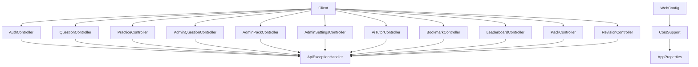

**Diagram sources**
- [WebConfig.java:1-21](file://backend/src/main/java/com/neetlu/examhunt/config/WebConfig.java#L1-L21)
- [CorsSupport.java:1-37](file://backend/src/main/java/com/neetlu/examhunt/config/CorsSupport.java#L1-L37)
- [AppProperties.java:1-24](file://backend/src/main/java/com/neetlu/examhunt/config/AppProperties.java#L1-L24)
- [ApiExceptionHandler.java:1-39](file://backend/src/main/java/com/neetlu/examhunt/web/ApiExceptionHandler.java#L1-L39)
- [AuthController.java:1-45](file://backend/src/main/java/com/neetlu/examhunt/web/AuthController.java#L1-L45)
- [QuestionController.java:1-292](file://backend/src/main/java/com/neetlu/examhunt/web/QuestionController.java#L1-L292)
- [PracticeController.java:1-273](file://backend/src/main/java/com/neetlu/examhunt/web/PracticeController.java#L1-L273)
- [AdminQuestionController.java:1-71](file://backend/src/main/java/com/neetlu/examhunt/web/AdminQuestionController.java#L1-L71)
- [AdminPackController.java:1-85](file://backend/src/main/java/com/neetlu/examhunt/web/AdminPackController.java#L1-L85)
- [AdminSettingsController.java:1-43](file://backend/src/main/java/com/neetlu/examhunt/web/AdminSettingsController.java#L1-L43)
- [AiTutorController.java:1-36](file://backend/src/main/java/com/neetlu/examhunt/web/AiTutorController.java#L1-L36)
- [BookmarkController.java:1-62](file://backend/src/main/java/com/neetlu/examhunt/web/BookmarkController.java#L1-L62)
- [LeaderboardController.java:1-28](file://backend/src/main/java/com/neetlu/examhunt/web/LeaderboardController.java#L1-L28)
- [PackController.java:1-85](file://backend/src/main/java/com/neetlu/examhunt/web/PackController.java#L1-L85)
- [RevisionController.java:1-56](file://backend/src/main/java/com/neetlu/examhunt/web/RevisionController.java#L1-L56)

## Detailed Component Analysis

### AuthController
- Endpoints
  - POST /api/auth/register: Registers a new user with validated fields.
  - POST /api/auth/login: Authenticates a user.
  - GET /api/auth/me: Returns current user profile.
- Validation
  - Request records enforce non-blank and email constraints.
- Error Handling
  - Delegates to service; exceptions propagate to ApiExceptionHandler.
- Example Requests/Responses
  - Register: {"email":"user@example.com","password":"Passw0rd!","displayName":"User"}
  - Login: {"email":"user@example.com","password":"Passw0rd!"}
  - Me: 200 OK with user profile payload.

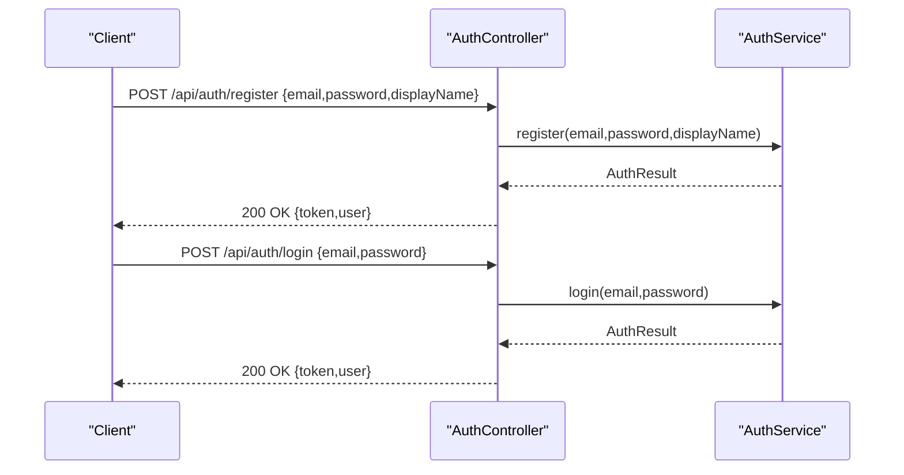

**Diagram sources**
- [AuthController.java:23-36](file://backend/src/main/java/com/neetlu/examhunt/web/AuthController.java#L23-L36)

**Section sources**
- [AuthController.java:1-45](file://backend/src/main/java/com/neetlu/examhunt/web/AuthController.java#L1-L45)

### QuestionController
- Endpoints
  - GET /api/questions: Paginated browse by pack and filters.
  - GET /api/questions/search: Search within pack or exam-wide.
  - GET /api/questions/{questionId}: Single question detail with enrichment.
  - GET /api/questions/{questionId}/family: Parent and variant references.
- Validation and Limits
  - Page size capped at 100.
  - Search requires a non-empty query.
- Response Schemas
  - QuestionPublic: Lightweight view for listings.
  - QuestionDetail: Full detail including answer and variants.
  - QuestionFamily: Parent info and variant refs.

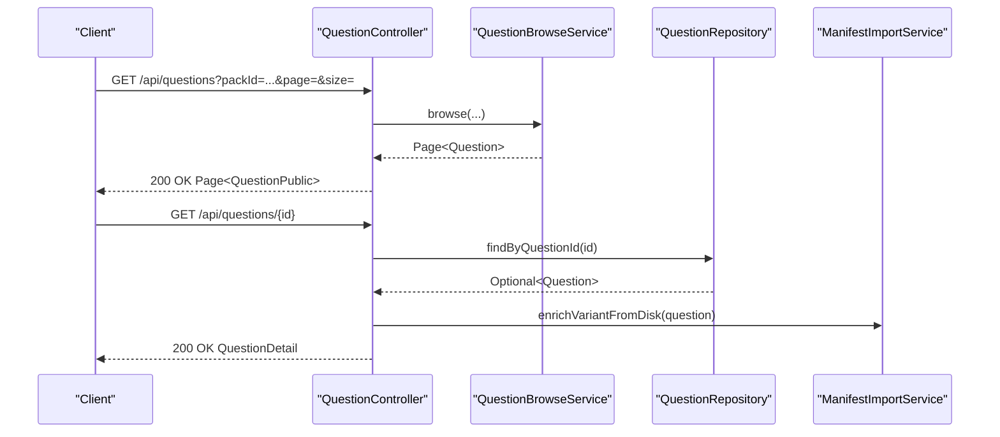

**Diagram sources**
- [QuestionController.java:42-90](file://backend/src/main/java/com/neetlu/examhunt/web/QuestionController.java#L42-L90)

**Section sources**
- [QuestionController.java:1-292](file://backend/src/main/java/com/neetlu/examhunt/web/QuestionController.java#L1-L292)

### PracticeController
- Endpoints
  - POST /api/practice/sessions: Create a session with filters and mode.
  - POST /api/practice/sessions/{sessionId}/retake-test: Retake with filter.
  - GET /api/practice/sessions/{sessionId}: Get session.
  - GET /api/practice/progress: Progress summary.
  - GET /api/practice/wrong-attempts: List wrong attempts with filters.
  - GET /api/practice/sessions/{sessionId}/result: Session result.
  - POST /api/practice/submit: Submit answer.
  - POST /api/practice/variant-check: Validate variant answer.
  - POST /api/practice/skip: Skip question.
  - POST /api/practice/sessions/{sessionId}/mark-review: Mark for review.
  - POST /api/practice/sessions/{sessionId}/engage/pause/finish: Lifecycle controls.
  - GET /api/practice/questions/{questionId}: Practice view.
  - GET /api/practice/questions/{questionId}/solution: Reveal solution preview.
  - PUT /api/practice/questions/{questionId}/rating: Rate question.
  - GET /api/practice/questions/{questionId}/rating: Get user rating.
- Validation
  - Request records enforce constraints (min/max for ratings, not blank identifiers).
- Response Schemas
  - SessionView, ProgressSummary, WrongAttemptView, SessionResultView, SubmitResult, RatingView, QuestionPracticeView, SolutionRevealView.

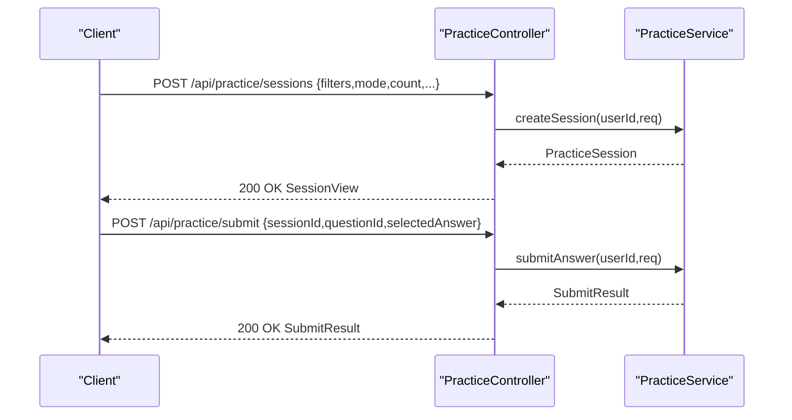

**Diagram sources**
- [PracticeController.java:31-95](file://backend/src/main/java/com/neetlu/examhunt/web/PracticeController.java#L31-L95)

**Section sources**
- [PracticeController.java:1-273](file://backend/src/main/java/com/neetlu/examhunt/web/PracticeController.java#L1-L273)

### Administrative Controllers

#### AdminQuestionController
- Endpoints
  - GET /api/admin/questions/search: Admin-only search with X-Admin-Key.
  - GET /api/admin/questions/{questionId}: Retrieve detail.
  - PATCH /api/admin/questions/{questionId}: Update content.
  - PUT /api/admin/questions/{questionId}/enrichment: Update enrichment metadata.
- Authorization
  - Requires admin access via AdminAuthorization and X-Admin-Key header.

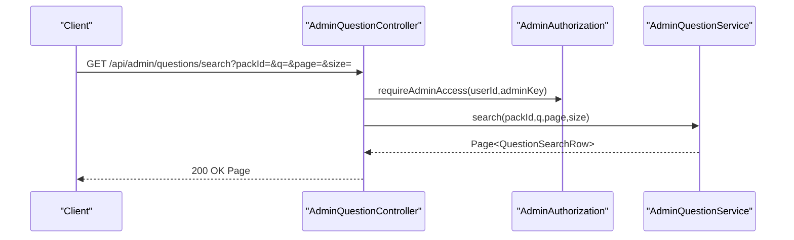

**Diagram sources**
- [AdminQuestionController.java:30-40](file://backend/src/main/java/com/neetlu/examhunt/web/AdminQuestionController.java#L30-L40)

**Section sources**
- [AdminQuestionController.java:1-71](file://backend/src/main/java/com/neetlu/examhunt/web/AdminQuestionController.java#L1-L71)

#### AdminPackController
- Endpoints
  - GET /api/admin/packs: List packs with counts and demo flag.
  - DELETE /api/admin/packs/{packId}: Remove pack and associated questions.
- Authorization
  - Admin-only via X-Admin-Key.

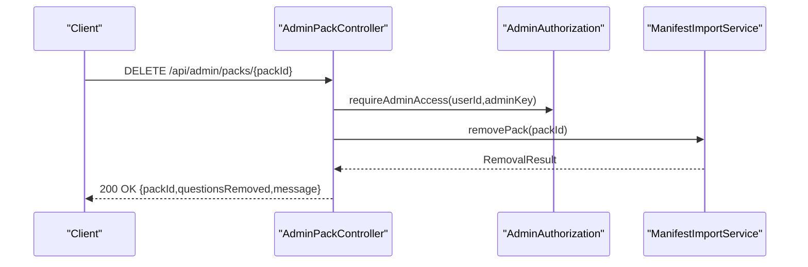

**Diagram sources**
- [AdminPackController.java:60-75](file://backend/src/main/java/com/neetlu/examhunt/web/AdminPackController.java#L60-L75)

**Section sources**
- [AdminPackController.java:1-85](file://backend/src/main/java/com/neetlu/examhunt/web/AdminPackController.java#L1-L85)

#### AdminSettingsController
- Endpoints
  - GET /api/admin/settings: Admin-only settings view.
  - PUT /api/admin/settings: Update settings with X-Admin-Key.

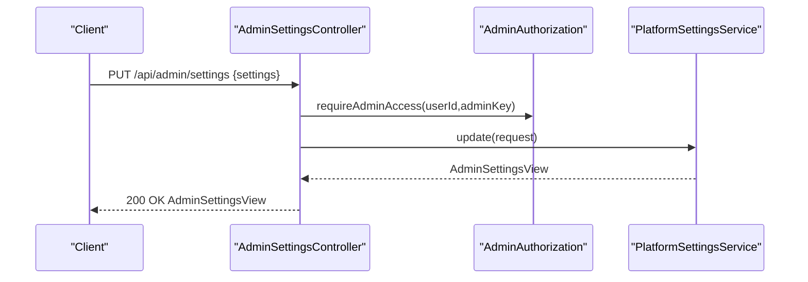

**Diagram sources**
- [AdminSettingsController.java:34-41](file://backend/src/main/java/com/neetlu/examhunt/web/AdminSettingsController.java#L34-L41)

**Section sources**
- [AdminSettingsController.java:1-43](file://backend/src/main/java/com/neetlu/examhunt/web/AdminSettingsController.java#L1-L43)

### Auxiliary Controllers

#### AiTutorController
- Endpoints
  - POST /api/ai-tutor/chat: Chat with optional context.
  - POST /api/ai-tutor/hint: Hint generation by mode and question.

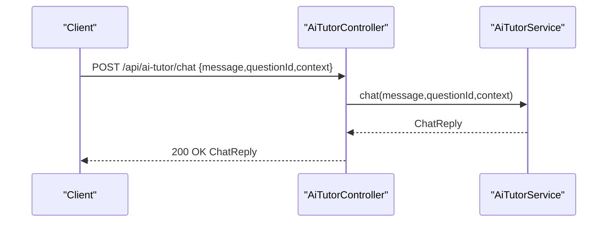

**Diagram sources**
- [AiTutorController.java:20-30](file://backend/src/main/java/com/neetlu/examhunt/web/AiTutorController.java#L20-L30)

**Section sources**
- [AiTutorController.java:1-36](file://backend/src/main/java/com/neetlu/examhunt/web/AiTutorController.java#L1-L36)

#### BookmarkController
- Endpoints
  - GET /api/bookmarks: List bookmarks.
  - GET /api/bookmarks/batch-status: Batch status by comma-separated IDs.
  - GET /api/bookmarks/{questionId}/status: Individual status.
  - POST /api/bookmarks/{questionId}/toggle: Toggle bookmark with optional note.

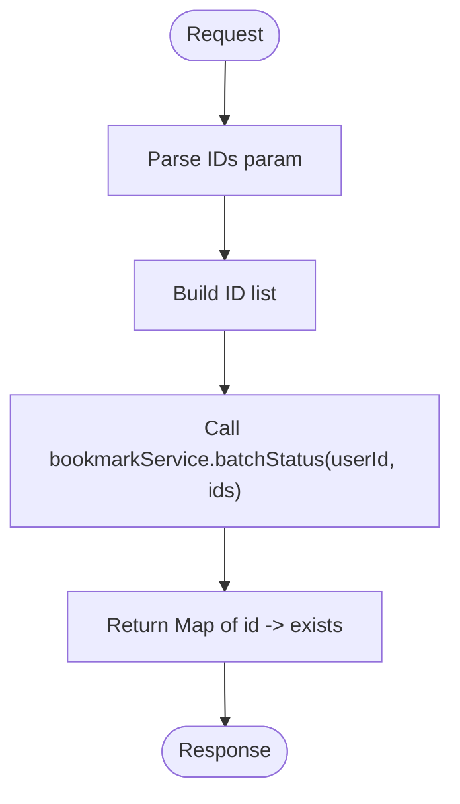

**Diagram sources**
- [BookmarkController.java:32-43](file://backend/src/main/java/com/neetlu/examhunt/web/BookmarkController.java#L32-L43)

**Section sources**
- [BookmarkController.java:1-62](file://backend/src/main/java/com/neetlu/examhunt/web/BookmarkController.java#L1-L62)

#### LeaderboardController
- Endpoints
  - GET /api/leaderboard: Leaderboard with limit and period.

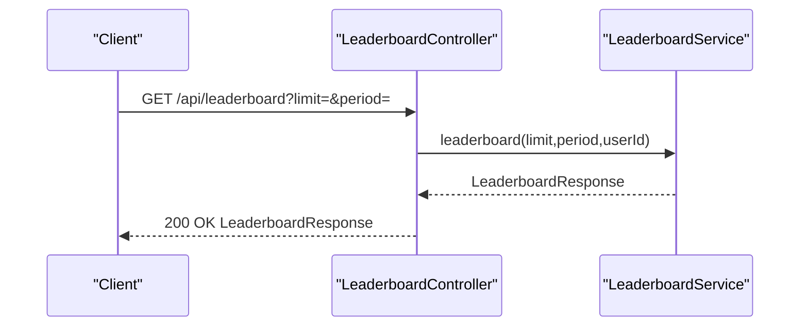

**Diagram sources**
- [LeaderboardController.java:20-26](file://backend/src/main/java/com/neetlu/examhunt/web/LeaderboardController.java#L20-L26)

**Section sources**
- [LeaderboardController.java:1-28](file://backend/src/main/java/com/neetlu/examhunt/web/LeaderboardController.java#L1-L28)

#### PackController
- Endpoints
  - GET /api/packs: Catalog with caching via PublicCacheResponses.
  - GET /api/packs/{packId}: Pack detail.
  - GET /api/packs/{packId}/facets: Facets map.
- Caching
  - Uses PublicApiCacheProperties and cache version from service.

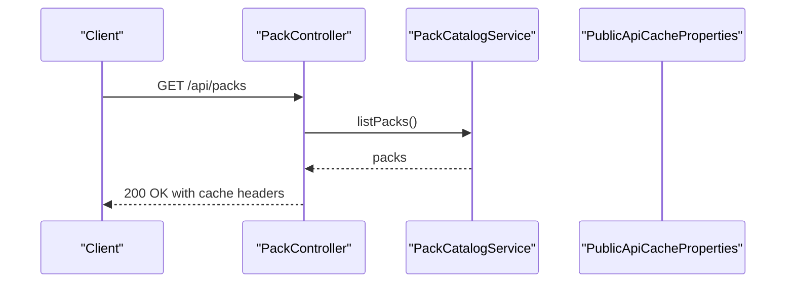

**Diagram sources**
- [PackController.java:39-43](file://backend/src/main/java/com/neetlu/examhunt/web/PackController.java#L39-L43)

**Section sources**
- [PackController.java:1-85](file://backend/src/main/java/com/neetlu/examhunt/web/PackController.java#L1-L85)

#### RevisionController
- Endpoints
  - GET /api/revision/summary: Summary.
  - GET /api/revision/queue: Queue items with optional status filter.
  - POST /api/revision/add: Add item with source and related IDs.
  - POST /api/revision/{questionId}/mark-revised/pending: Update status.

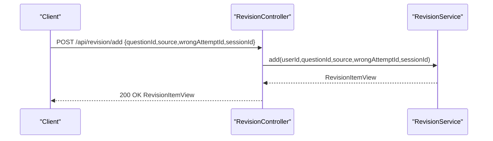

**Diagram sources**
- [RevisionController.java:35-41](file://backend/src/main/java/com/neetlu/examhunt/web/RevisionController.java#L35-L41)

**Section sources**
- [RevisionController.java:1-56](file://backend/src/main/java/com/neetlu/examhunt/web/RevisionController.java#L1-L56)

### Exception Handling
Centralized exception mapper:
- AuthenticationException → 401 Unauthorized
- AccessDeniedException → 403 Forbidden
- ResponseStatusException → Status and reason mapped to message
- IllegalStateException, IOException → 400 Bad Request

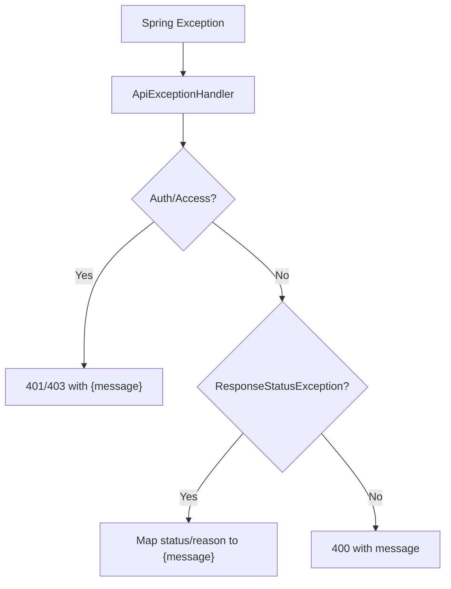

**Diagram sources**
- [ApiExceptionHandler.java:17-37](file://backend/src/main/java/com/neetlu/examhunt/web/ApiExceptionHandler.java#L17-L37)

**Section sources**
- [ApiExceptionHandler.java:1-39](file://backend/src/main/java/com/neetlu/examhunt/web/ApiExceptionHandler.java#L1-L39)

### Web Configuration (CORS, Resources, Security)
- CORS
  - WebConfig registers a CorsFilter bean.
  - CorsSupport applies allowed origins from AppProperties.corsOrigins, adds development patterns, sets methods/headers, credentials, and max age.
- Security Integration
  - Controllers use @AuthenticationPrincipal to receive authenticated user ID.
  - Administrative endpoints require X-Admin-Key and AdminAuthorization.
- Resource Handling
  - Public cache responses are used for catalog endpoints (PackController).

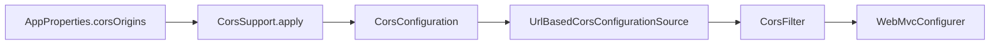

**Diagram sources**
- [WebConfig.java:12-19](file://backend/src/main/java/com/neetlu/examhunt/config/WebConfig.java#L12-L19)
- [CorsSupport.java:22-35](file://backend/src/main/java/com/neetlu/examhunt/config/CorsSupport.java#L22-L35)
- [AppProperties.java:6-23](file://backend/src/main/java/com/neetlu/examhunt/config/AppProperties.java#L6-L23)

**Section sources**
- [WebConfig.java:1-21](file://backend/src/main/java/com/neetlu/examhunt/config/WebConfig.java#L1-L21)
- [CorsSupport.java:1-37](file://backend/src/main/java/com/neetlu/examhunt/config/CorsSupport.java#L1-L37)
- [AppProperties.java:1-24](file://backend/src/main/java/com/neetlu/examhunt/config/AppProperties.java#L1-L24)

## Dependency Analysis
- Controllers depend on service-layer components and repositories.
- Admin endpoints depend on AdminAuthorization and admin-specific services.
- Exception handling is global via @RestControllerAdvice.
- CORS configuration is centralized and injected via AppProperties.

```mermaid
graph TB
AC["AuthController"] --> AuthService
QC["QuestionController"] --> QuestionBrowseService
QC --> ManifestImportService
PC["PracticeController"] --> PracticeService
AQ["AdminQuestionController"] --> AdminAuthorization
AQ --> AdminQuestionService
AP["AdminPackController"] --> AdminAuthorization
AP --> ManifestImportService
AS["AdminSettingsController"] --> AdminAuthorization
AS --> PlatformSettingsService
AT["AiTutorController"] --> AiTutorService
BC["BookmarkController"] --> BookmarkService
LC["LeaderboardController"] --> LeaderboardService
PK["PackController"] --> PackCatalogService
PK --> PublicApiCacheProperties
RC["RevisionController"] --> RevisionService
E["ApiExceptionHandler"] --> SecEx["Security Exceptions"]
E --> RespEx["ResponseStatusException"]
WC["WebConfig"] --> CorsSupport
CorsSupport --> AppProperties
```

**Diagram sources**
- [AuthController.java:1-45](file://backend/src/main/java/com/neetlu/examhunt/web/AuthController.java#L1-L45)
- [QuestionController.java:1-292](file://backend/src/main/java/com/neetlu/examhunt/web/QuestionController.java#L1-L292)
- [PracticeController.java:1-273](file://backend/src/main/java/com/neetlu/examhunt/web/PracticeController.java#L1-L273)
- [AdminQuestionController.java:1-71](file://backend/src/main/java/com/neetlu/examhunt/web/AdminQuestionController.java#L1-L71)
- [AdminPackController.java:1-85](file://backend/src/main/java/com/neetlu/examhunt/web/AdminPackController.java#L1-L85)
- [AdminSettingsController.java:1-43](file://backend/src/main/java/com/neetlu/examhunt/web/AdminSettingsController.java#L1-L43)
- [AiTutorController.java:1-36](file://backend/src/main/java/com/neetlu/examhunt/web/AiTutorController.java#L1-L36)
- [BookmarkController.java:1-62](file://backend/src/main/java/com/neetlu/examhunt/web/BookmarkController.java#L1-L62)
- [LeaderboardController.java:1-28](file://backend/src/main/java/com/neetlu/examhunt/web/LeaderboardController.java#L1-L28)
- [PackController.java:1-85](file://backend/src/main/java/com/neetlu/examhunt/web/PackController.java#L1-L85)
- [RevisionController.java:1-56](file://backend/src/main/java/com/neetlu/examhunt/web/RevisionController.java#L1-L56)
- [ApiExceptionHandler.java:1-39](file://backend/src/main/java/com/neetlu/examhunt/web/ApiExceptionHandler.java#L1-L39)
- [WebConfig.java:1-21](file://backend/src/main/java/com/neetlu/examhunt/config/WebConfig.java#L1-L21)
- [CorsSupport.java:1-37](file://backend/src/main/java/com/neetlu/examhunt/config/CorsSupport.java#L1-L37)
- [AppProperties.java:1-24](file://backend/src/main/java/com/neetlu/examhunt/config/AppProperties.java#L1-L24)

**Section sources**
- [ApiExceptionHandler.java:1-39](file://backend/src/main/java/com/neetlu/examhunt/web/ApiExceptionHandler.java#L1-L39)
- [WebConfig.java:1-21](file://backend/src/main/java/com/neetlu/examhunt/config/WebConfig.java#L1-L21)
- [CorsSupport.java:1-37](file://backend/src/main/java/com/neetlu/examhunt/config/CorsSupport.java#L1-L37)
- [AppProperties.java:1-24](file://backend/src/main/java/com/neetlu/examhunt/config/AppProperties.java#L1-L24)

## Performance Considerations
- Pagination limits: QuestionController caps page size to 100 to prevent heavy queries.
- Caching: PackController uses cached responses for catalogs.
- Minimal DTO mapping: Record classes reduce overhead and improve readability.
- Recommendations:
  - Introduce rate limiting at gateway or controller level for public endpoints.
  - Add circuit breakers for external LLM integrations (AiTutorService).
  - Monitor slow endpoints with tracing/metrics and consider async processing for write-heavy operations.

[No sources needed since this section provides general guidance]

## Troubleshooting Guide
- Authentication failures
  - Symptom: 401 Unauthorized on protected endpoints.
  - Cause: Missing/expired credentials or invalid JWT.
  - Resolution: Ensure proper auth flow and token validity.
- Authorization failures
  - Symptom: 403 Forbidden on admin endpoints.
  - Cause: Missing or invalid X-Admin-Key.
  - Resolution: Verify admin key and permissions.
- Not Found errors
  - Symptom: 404 on question/pack IDs.
  - Cause: Non-existent entity.
  - Resolution: Validate IDs and existence checks.
- Validation errors
  - Symptom: 400 Bad Request on malformed requests.
  - Cause: Missing/not-blank fields or out-of-range values.
  - Resolution: Review request records and constraints.

**Section sources**
- [ApiExceptionHandler.java:17-37](file://backend/src/main/java/com/neetlu/examhunt/web/ApiExceptionHandler.java#L17-L37)
- [QuestionController.java:67-70](file://backend/src/main/java/com/neetlu/examhunt/web/QuestionController.java#L67-L70)
- [PackController.java:47-48](file://backend/src/main/java/com/neetlu/examhunt/web/PackController.java#L47-L48)

## Conclusion
The web layer is cleanly structured around domain-focused controllers, with strong separation of concerns and centralized CORS and exception handling. Administrative endpoints are secured via dedicated keys and authorizations. The design supports scalability through pagination, caching, and DTOs while maintaining clear request/response contracts.

[No sources needed since this section summarizes without analyzing specific files]

## Appendices

### API Versioning and Backward Compatibility
- Current state: No explicit version path/version header is used in controllers.
- Recommendations:
  - Use path-based versioning (/api/v1/...) or Accept header versioning.
  - Maintain backward compatibility by deprecating fields rather than removing them immediately.
  - Add OpenAPI/Swagger specs to document versions and changes.

[No sources needed since this section provides general guidance]

### Testing Strategies
- Unit tests per controller
  - Validate happy paths, parameter validation, and error responses.
  - Use @WebMvcTest and mock services to isolate controller logic.
- Integration tests
  - End-to-end flows for auth, practice sessions, and admin operations.
  - Use test containers for database and external services.
- Security tests
  - Verify admin endpoints reject missing/invalid X-Admin-Key.
- Performance tests
  - Load test paginated endpoints and measure latency/throughput.

[No sources needed since this section provides general guidance]

### Monitoring and Observability
- Instrument endpoints with metrics (count, duration, error rates).
- Log request IDs and user IDs for traceability.
- Alert on elevated 4xx/5xx rates and latency percentiles.

[No sources needed since this section provides general guidance]