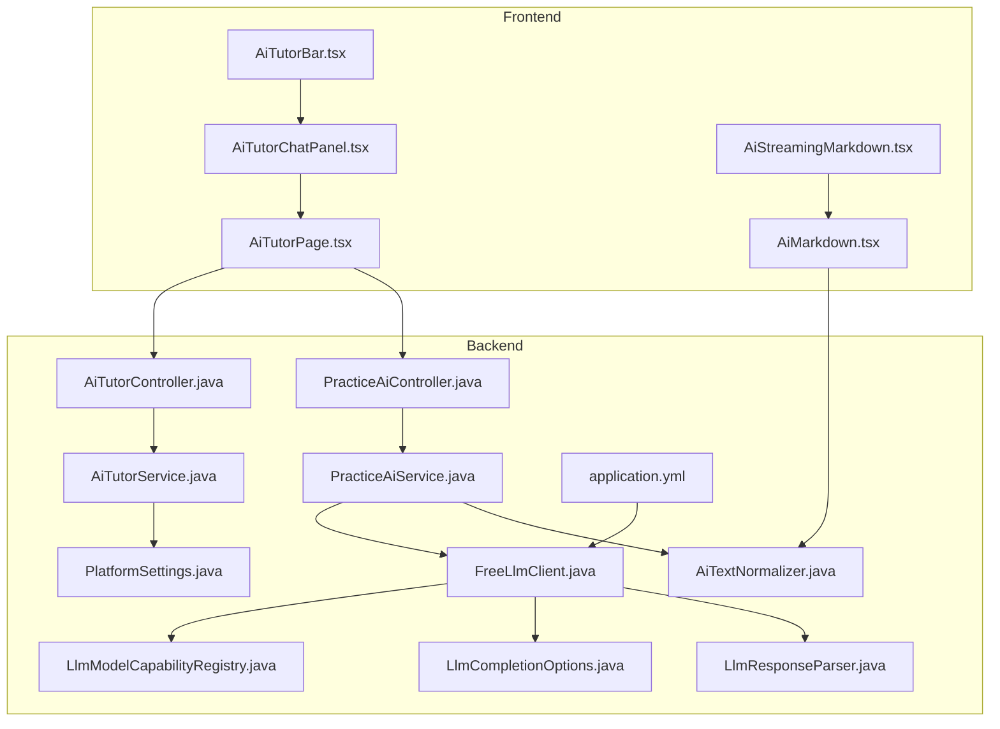
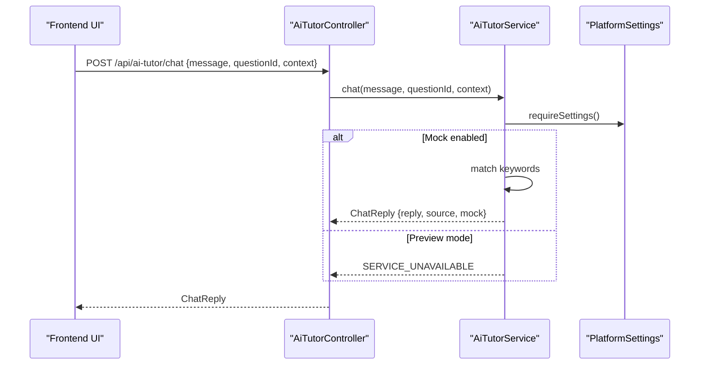
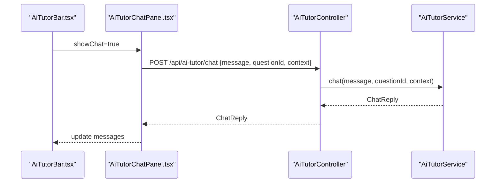
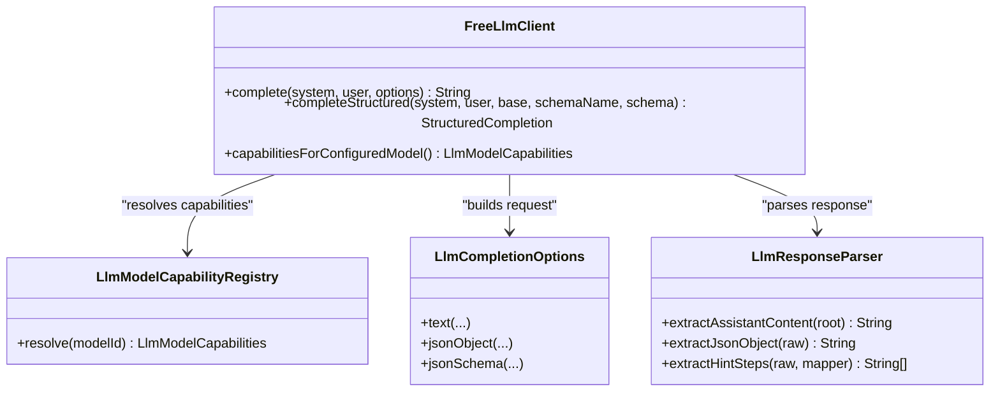
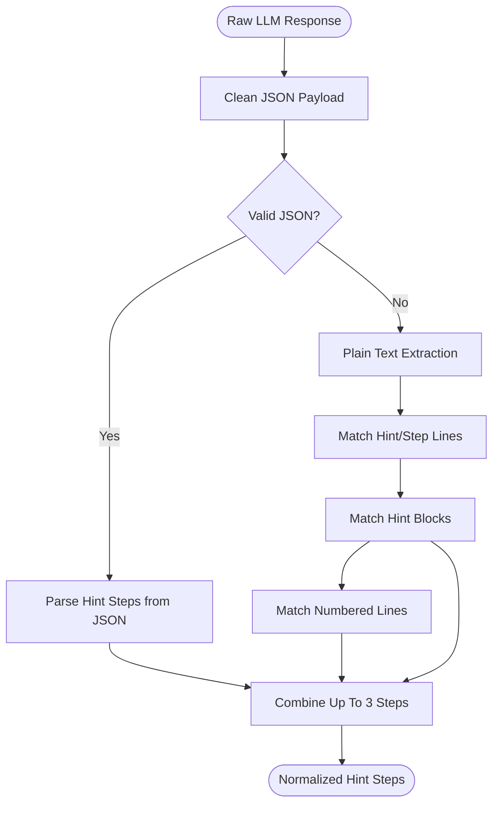
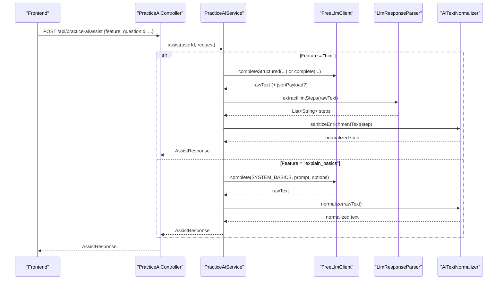
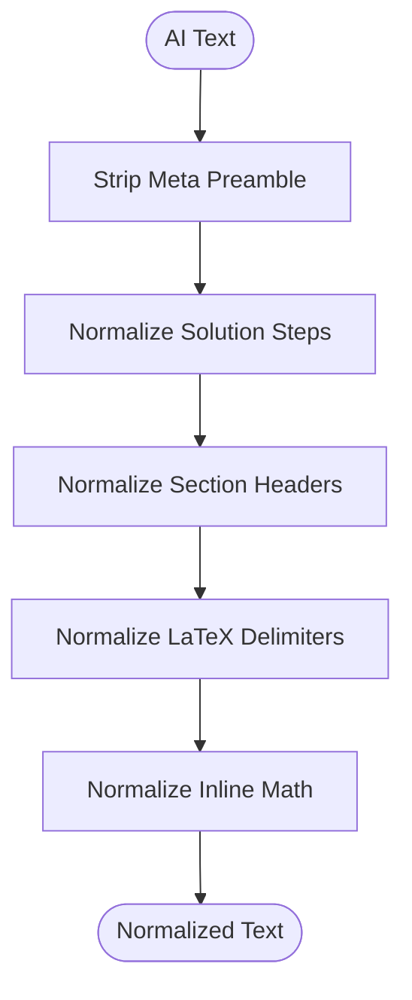
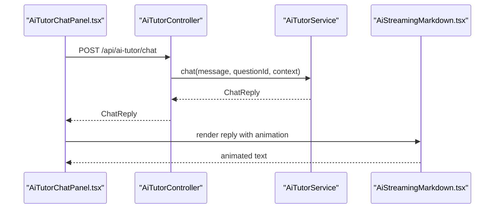
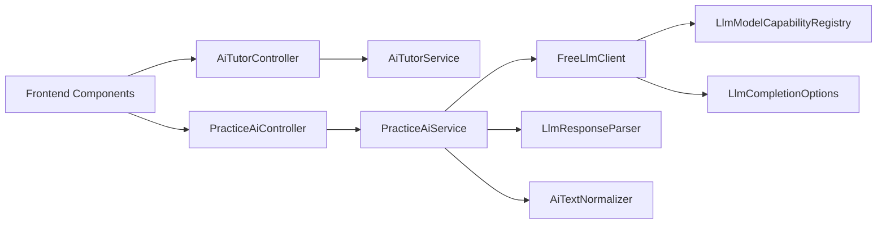

# AI-Powered Learning Assistant

<cite>
**Referenced Files in This Document**
- [AiTutorService.java](file://backend/src/main/java/com/neetlu/examhunt/service/AiTutorService.java)
- [AiTutorController.java](file://backend/src/main/java/com/neetlu/examhunt/web/AiTutorController.java)
- [AiTextNormalizer.java](file://backend/src/main/java/com/neetlu/examhunt/service/AiTextNormalizer.java)
- [FreeLlmClient.java](file://backend/src/main/java/com/neetlu/examhunt/service/FreeLlmClient.java)
- [LlmModelCapabilityRegistry.java](file://backend/src/main/java/com/neetlu/examhunt/service/llm/LlmModelCapabilityRegistry.java)
- [LlmCompletionOptions.java](file://backend/src/main/java/com/neetlu/examhunt/service/llm/LlmCompletionOptions.java)
- [LlmResponseParser.java](file://backend/src/main/java/com/neetlu/examhunt/service/llm/LlmResponseParser.java)
- [PracticeAiService.java](file://backend/src/main/java/com/neetlu/examhunt/service/PracticeAiService.java)
- [PracticeAiController.java](file://backend/src/main/java/com/neetlu/examhunt/web/PracticeAiController.java)
- [PlatformSettings.java](file://backend/src/main/java/com/neetlu/examhunt/model/PlatformSettings.java)
- [application.yml](file://backend/src/main/resources/application.yml)
- [AiTutorBar.tsx](file://frontend/src/components/AiTutorBar.tsx)
- [AiTutorChatPanel.tsx](file://frontend/src/components/AiTutorChatPanel.tsx)
- [AiTutorPage.tsx](file://frontend/src/pages/AiTutorPage.tsx)
- [AiMarkdown.tsx](file://frontend/src/components/AiMarkdown.tsx)
- [AiStreamingMarkdown.tsx](file://frontend/src/components/AiStreamingMarkdown.tsx)
</cite>

## Table of Contents
1. [Introduction](#introduction)
2. [Project Structure](#project-structure)
3. [Core Components](#core-components)
4. [Architecture Overview](#architecture-overview)
5. [Detailed Component Analysis](#detailed-component-analysis)
6. [Dependency Analysis](#dependency-analysis)
7. [Performance Considerations](#performance-considerations)
8. [Troubleshooting Guide](#troubleshooting-guide)
9. [Conclusion](#conclusion)
10. [Appendices](#appendices)

## Introduction
This document explains the AI-powered learning assistant integrated into the exam preparation platform. It covers the AI tutor interface, chat functionality, and personalized learning recommendations. It documents the integration with external LLM APIs, prompt engineering strategies, and AI response processing. It also details text normalization, response parsing, and conversational AI patterns, including examples of AI interaction flows, tutoring scenarios, and content adaptation. Finally, it explains the technical implementation of AI streaming responses and conversational context management.

## Project Structure
The AI system spans backend Java services and controllers, and a React-based frontend. The backend exposes REST endpoints for AI tutoring and practice assistance, integrates with an LLM client, and applies text normalization and response parsing. The frontend renders the AI tutor bar, chat panel, and markdown-rendered AI content with streaming animations.

**Diagram sources**
- [AiTutorBar.tsx:1-95](file://frontend/src/components/AiTutorBar.tsx#L1-95)
- [AiTutorChatPanel.tsx:1-106](file://frontend/src/components/AiTutorChatPanel.tsx#L1-106)
- [AiTutorPage.tsx:1-57](file://frontend/src/pages/AiTutorPage.tsx#L1-57)
- [AiMarkdown.tsx:1-208](file://frontend/src/components/AiMarkdown.tsx#L1-208)
- [AiStreamingMarkdown.tsx:1-49](file://frontend/src/components/AiStreamingMarkdown.tsx#L1-49)
- [AiTutorController.java:1-36](file://backend/src/main/java/com/neetlu/examhunt/web/AiTutorController.java#L1-36)
- [AiTutorService.java:1-84](file://backend/src/main/java/com/neetlu/examhunt/service/AiTutorService.java#L1-84)
- [PracticeAiController.java:1-32](file://backend/src/main/java/com/neetlu/examhunt/web/PracticeAiController.java#L1-32)
- [PracticeAiService.java:1-800](file://backend/src/main/java/com/neetlu/examhunt/service/PracticeAiService.java#L1-800)
- [FreeLlmClient.java:1-327](file://backend/src/main/java/com/neetlu/examhunt/service/FreeLlmClient.java#L1-327)
- [LlmModelCapabilityRegistry.java:1-79](file://backend/src/main/java/com/neetlu/examhunt/service/llm/LlmModelCapabilityRegistry.java#L1-79)
- [LlmCompletionOptions.java:1-30](file://backend/src/main/java/com/neetlu/examhunt/service/llm/LlmCompletionOptions.java#L1-30)
- [LlmResponseParser.java:1-239](file://backend/src/main/java/com/neetlu/examhunt/service/llm/LlmResponseParser.java#L1-239)
- [AiTextNormalizer.java:1-221](file://backend/src/main/java/com/neetlu/examhunt/service/AiTextNormalizer.java#L1-221)
- [PlatformSettings.java:1-150](file://backend/src/main/java/com/neetlu/examhunt/model/PlatformSettings.java#L1-150)
- [application.yml:1-44](file://backend/src/main/resources/application.yml#L1-44)

**Section sources**
- [AiTutorBar.tsx:1-95](file://frontend/src/components/AiTutorBar.tsx#L1-95)
- [AiTutorChatPanel.tsx:1-106](file://frontend/src/components/AiTutorChatPanel.tsx#L1-106)
- [AiTutorPage.tsx:1-57](file://frontend/src/pages/AiTutorPage.tsx#L1-57)
- [AiMarkdown.tsx:1-208](file://frontend/src/components/AiMarkdown.tsx#L1-208)
- [AiStreamingMarkdown.tsx:1-49](file://frontend/src/components/AiStreamingMarkdown.tsx#L1-49)
- [AiTutorController.java:1-36](file://backend/src/main/java/com/neetlu/examhunt/web/AiTutorController.java#L1-36)
- [AiTutorService.java:1-84](file://backend/src/main/java/com/neetlu/examhunt/service/AiTutorService.java#L1-84)
- [PracticeAiController.java:1-32](file://backend/src/main/java/com/neetlu/examhunt/web/PracticeAiController.java#L1-32)
- [PracticeAiService.java:1-800](file://backend/src/main/java/com/neetlu/examhunt/service/PracticeAiService.java#L1-800)
- [FreeLlmClient.java:1-327](file://backend/src/main/java/com/neetlu/examhunt/service/FreeLlmClient.java#L1-327)
- [LlmModelCapabilityRegistry.java:1-79](file://backend/src/main/java/com/neetlu/examhunt/service/llm/LlmModelCapabilityRegistry.java#L1-79)
- [LlmCompletionOptions.java:1-30](file://backend/src/main/java/com/neetlu/examhunt/service/llm/LlmCompletionOptions.java#L1-30)
- [LlmResponseParser.java:1-239](file://backend/src/main/java/com/neetlu/examhunt/service/llm/LlmResponseParser.java#L1-239)
- [AiTextNormalizer.java:1-221](file://backend/src/main/java/com/neetlu/examhunt/service/AiTextNormalizer.java#L1-221)
- [PlatformSettings.java:1-150](file://backend/src/main/java/com/neetlu/examhunt/model/PlatformSettings.java#L1-150)
- [application.yml:1-44](file://backend/src/main/resources/application.yml#L1-44)

## Core Components
- AI Tutor Service: Provides keyword-aware chat replies and hints, with context-aware appending and mock mode gating.
- Practice AI Service: Generates hints, formulas, basics, pitfalls, and personalized recommendations using LLMs with strict prompt engineering and structured output parsing.
- LLM Client: Integrates with OpenAI-compatible endpoints, handles capability-aware requests, structured JSON output, and response normalization.
- Text Normalization: Ensures consistent markdown and LaTeX rendering across UI components.
- Frontend AI Components: Renders chat UI, markdown, and streaming animations; orchestrates user interactions and platform settings.

**Section sources**
- [AiTutorService.java:1-84](file://backend/src/main/java/com/neetlu/examhunt/service/AiTutorService.java#L1-84)
- [PracticeAiService.java:1-800](file://backend/src/main/java/com/neetlu/examhunt/service/PracticeAiService.java#L1-800)
- [FreeLlmClient.java:1-327](file://backend/src/main/java/com/neetlu/examhunt/service/FreeLlmClient.java#L1-327)
- [AiTextNormalizer.java:1-221](file://backend/src/main/java/com/neetlu/examhunt/service/AiTextNormalizer.java#L1-221)
- [AiTutorBar.tsx:1-95](file://frontend/src/components/AiTutorBar.tsx#L1-95)
- [AiTutorChatPanel.tsx:1-106](file://frontend/src/components/AiTutorChatPanel.tsx#L1-106)
- [AiMarkdown.tsx:1-208](file://frontend/src/components/AiMarkdown.tsx#L1-208)
- [AiStreamingMarkdown.tsx:1-49](file://frontend/src/components/AiStreamingMarkdown.tsx#L1-49)

## Architecture Overview
The system separates concerns between frontend UX and backend AI orchestration. The frontend triggers AI actions via REST endpoints, receives normalized text, and renders it with markdown and LaTeX support. Backend services encapsulate LLM integration, capability detection, and robust response parsing.

**Diagram sources**
- [AiTutorController.java:1-36](file://backend/src/main/java/com/neetlu/examhunt/web/AiTutorController.java#L1-36)
- [AiTutorService.java:1-84](file://backend/src/main/java/com/neetlu/examhunt/service/AiTutorService.java#L1-84)
- [PlatformSettings.java:1-150](file://backend/src/main/java/com/neetlu/examhunt/model/PlatformSettings.java#L1-150)

**Section sources**
- [AiTutorController.java:1-36](file://backend/src/main/java/com/neetlu/examhunt/web/AiTutorController.java#L1-36)
- [AiTutorService.java:1-84](file://backend/src/main/java/com/neetlu/examhunt/service/AiTutorService.java#L1-84)
- [PlatformSettings.java:1-150](file://backend/src/main/java/com/neetlu/examhunt/model/PlatformSettings.java#L1-150)

## Detailed Component Analysis

### AI Tutor Interface and Chat Functionality
- Mock-mode chat: Responds with keyword-aware replies and fallbacks, appending contextual notes when applicable.
- Hint generation: Provides “Hint” and “Explain” modes with context-aware messages.
- Frontend integration: The AI tutor bar and chat panel coordinate user state, platform settings, and message history.

**Diagram sources**
- [AiTutorBar.tsx:1-95](file://frontend/src/components/AiTutorBar.tsx#L1-95)
- [AiTutorChatPanel.tsx:1-106](file://frontend/src/components/AiTutorChatPanel.tsx#L1-106)
- [AiTutorController.java:1-36](file://backend/src/main/java/com/neetlu/examhunt/web/AiTutorController.java#L1-36)
- [AiTutorService.java:1-84](file://backend/src/main/java/com/neetlu/examhunt/service/AiTutorService.java#L1-84)

**Section sources**
- [AiTutorBar.tsx:1-95](file://frontend/src/components/AiTutorBar.tsx#L1-95)
- [AiTutorChatPanel.tsx:1-106](file://frontend/src/components/AiTutorChatPanel.tsx#L1-106)
- [AiTutorController.java:1-36](file://backend/src/main/java/com/neetlu/examhunt/web/AiTutorController.java#L1-36)
- [AiTutorService.java:1-84](file://backend/src/main/java/com/neetlu/examhunt/service/AiTutorService.java#L1-84)

### Prompt Engineering Strategies and Model Capabilities
- Strict system prompts enforce output format, prevent preamble, and avoid revealing answers prematurely.
- Capability-aware request building: selects JSON mode or JSON schema based on model flags; reinforces prompts for reasoning models.
- Structured output: Uses JSON schema or JSON object mode to guide LLM responses for reliable parsing.

**Diagram sources**
- [FreeLlmClient.java:1-327](file://backend/src/main/java/com/neetlu/examhunt/service/FreeLlmClient.java#L1-327)
- [LlmModelCapabilityRegistry.java:1-79](file://backend/src/main/java/com/neetlu/examhunt/service/llm/LlmModelCapabilityRegistry.java#L1-79)
- [LlmCompletionOptions.java:1-30](file://backend/src/main/java/com/neetlu/examhunt/service/llm/LlmCompletionOptions.java#L1-30)
- [LlmResponseParser.java:1-239](file://backend/src/main/java/com/neetlu/examhunt/service/llm/LlmResponseParser.java#L1-239)

**Section sources**
- [FreeLlmClient.java:1-327](file://backend/src/main/java/com/neetlu/examhunt/service/FreeLlmClient.java#L1-327)
- [LlmModelCapabilityRegistry.java:1-79](file://backend/src/main/java/com/neetlu/examhunt/service/llm/LlmModelCapabilityRegistry.java#L1-79)
- [LlmCompletionOptions.java:1-30](file://backend/src/main/java/com/neetlu/examhunt/service/llm/LlmCompletionOptions.java#L1-30)
- [LlmResponseParser.java:1-239](file://backend/src/main/java/com/neetlu/examhunt/service/llm/LlmResponseParser.java#L1-239)

### AI Response Processing and Parsing
- Response extraction: Reads assistant content from standardized response structures.
- JSON cleaning and validation: Removes fenced blocks, trims, and validates JSON payloads.
- Hint parsing: Extracts up to three progressive hints from JSON or plain text formats.

**Diagram sources**
- [LlmResponseParser.java:1-239](file://backend/src/main/java/com/neetlu/examhunt/service/llm/LlmResponseParser.java#L1-239)

**Section sources**
- [LlmResponseParser.java:1-239](file://backend/src/main/java/com/neetlu/examhunt/service/llm/LlmResponseParser.java#L1-239)

### Personalized Learning Recommendations and Practice AI
- Features: Hints, formulas, basics, pitfalls, weak chapter analysis, and mentor-style guidance.
- Prompt engineering: Enforces strict output rules, prevents preamble, and avoids premature answer revelation.
- Structured output: Uses JSON schema to guarantee hint and formula lists; falls back to plain text when needed.
- Text normalization: Ensures consistent markdown and LaTeX rendering for UI consumption.

**Diagram sources**
- [PracticeAiController.java:1-32](file://backend/src/main/java/com/neetlu/examhunt/web/PracticeAiController.java#L1-32)
- [PracticeAiService.java:1-800](file://backend/src/main/java/com/neetlu/examhunt/service/PracticeAiService.java#L1-800)
- [FreeLlmClient.java:1-327](file://backend/src/main/java/com/neetlu/examhunt/service/FreeLlmClient.java#L1-327)
- [LlmResponseParser.java:1-239](file://backend/src/main/java/com/neetlu/examhunt/service/llm/LlmResponseParser.java#L1-239)
- [AiTextNormalizer.java:1-221](file://backend/src/main/java/com/neetlu/examhunt/service/AiTextNormalizer.java#L1-221)

**Section sources**
- [PracticeAiController.java:1-32](file://backend/src/main/java/com/neetlu/examhunt/web/PracticeAiController.java#L1-32)
- [PracticeAiService.java:1-800](file://backend/src/main/java/com/neetlu/examhunt/service/PracticeAiService.java#L1-800)
- [FreeLlmClient.java:1-327](file://backend/src/main/java/com/neetlu/examhunt/service/FreeLlmClient.java#L1-327)
- [LlmResponseParser.java:1-239](file://backend/src/main/java/com/neetlu/examhunt/service/llm/LlmResponseParser.java#L1-239)
- [AiTextNormalizer.java:1-221](file://backend/src/main/java/com/neetlu/examhunt/service/AiTextNormalizer.java#L1-221)

### Text Normalization and Conversational AI Patterns
- Backend normalization: Strips meta preambles, standardizes section headers, normalizes LaTeX delimiters, and repairs common LLM artifacts.
- Frontend normalization: Mirrors backend fixes and wraps bare LaTeX for KaTeX rendering; streaming animation enhances readability.
- Conversation patterns: Keyword matching, context-aware replies, and progressive hint systems improve engagement and scaffolding.

**Diagram sources**
- [AiTextNormalizer.java:1-221](file://backend/src/main/java/com/neetlu/examhunt/service/AiTextNormalizer.java#L1-221)
- [AiMarkdown.tsx:1-208](file://frontend/src/components/AiMarkdown.tsx#L1-208)

**Section sources**
- [AiTextNormalizer.java:1-221](file://backend/src/main/java/com/neetlu/examhunt/service/AiTextNormalizer.java#L1-221)
- [AiMarkdown.tsx:1-208](file://frontend/src/components/AiMarkdown.tsx#L1-208)
- [AiStreamingMarkdown.tsx:1-49](file://frontend/src/components/AiStreamingMarkdown.tsx#L1-49)

### AI Streaming Responses and Context Management
- Streaming UI: Typewriter animation simulates real-time response delivery with reduced-motion preference handling.
- Context management: Chat panels maintain message history and pass questionId/context to backend for tailored replies.
- Preview mode: Admin-configurable mock responses gate AI features until live LLM integration is enabled.

**Diagram sources**
- [AiTutorChatPanel.tsx:1-106](file://frontend/src/components/AiTutorChatPanel.tsx#L1-106)
- [AiTutorController.java:1-36](file://backend/src/main/java/com/neetlu/examhunt/web/AiTutorController.java#L1-36)
- [AiTutorService.java:1-84](file://backend/src/main/java/com/neetlu/examhunt/service/AiTutorService.java#L1-84)
- [AiStreamingMarkdown.tsx:1-49](file://frontend/src/components/AiStreamingMarkdown.tsx#L1-49)

**Section sources**
- [AiTutorChatPanel.tsx:1-106](file://frontend/src/components/AiTutorChatPanel.tsx#L1-106)
- [AiStreamingMarkdown.tsx:1-49](file://frontend/src/components/AiStreamingMarkdown.tsx#L1-49)
- [AiTutorController.java:1-36](file://backend/src/main/java/com/neetlu/examhunt/web/AiTutorController.java#L1-36)
- [AiTutorService.java:1-84](file://backend/src/main/java/com/neetlu/examhunt/service/AiTutorService.java#L1-84)

## Dependency Analysis
- Backend dependencies: AiTutorController depends on AiTutorService; PracticeAiController depends on PracticeAiService; PracticeAiService depends on FreeLlmClient, LlmResponseParser, and AiTextNormalizer; FreeLlmClient depends on LlmModelCapabilityRegistry and LlmCompletionOptions; LlmResponseParser is standalone utility.
- Frontend dependencies: AiTutorBar and AiTutorChatPanel depend on platform settings and API helpers; AiMarkdown and AiStreamingMarkdown depend on normalization utilities.

**Diagram sources**
- [AiTutorController.java:1-36](file://backend/src/main/java/com/neetlu/examhunt/web/AiTutorController.java#L1-36)
- [AiTutorService.java:1-84](file://backend/src/main/java/com/neetlu/examhunt/service/AiTutorService.java#L1-84)
- [PracticeAiController.java:1-32](file://backend/src/main/java/com/neetlu/examhunt/web/PracticeAiController.java#L1-32)
- [PracticeAiService.java:1-800](file://backend/src/main/java/com/neetlu/examhunt/service/PracticeAiService.java#L1-800)
- [FreeLlmClient.java:1-327](file://backend/src/main/java/com/neetlu/examhunt/service/FreeLlmClient.java#L1-327)
- [LlmModelCapabilityRegistry.java:1-79](file://backend/src/main/java/com/neetlu/examhunt/service/llm/LlmModelCapabilityRegistry.java#L1-79)
- [LlmCompletionOptions.java:1-30](file://backend/src/main/java/com/neetlu/examhunt/service/llm/LlmCompletionOptions.java#L1-30)
- [LlmResponseParser.java:1-239](file://backend/src/main/java/com/neetlu/examhunt/service/llm/LlmResponseParser.java#L1-239)
- [AiTextNormalizer.java:1-221](file://backend/src/main/java/com/neetlu/examhunt/service/AiTextNormalizer.java#L1-221)

**Section sources**
- [AiTutorController.java:1-36](file://backend/src/main/java/com/neetlu/examhunt/web/AiTutorController.java#L1-36)
- [AiTutorService.java:1-84](file://backend/src/main/java/com/neetlu/examhunt/service/AiTutorService.java#L1-84)
- [PracticeAiController.java:1-32](file://backend/src/main/java/com/neetlu/examhunt/web/PracticeAiController.java#L1-32)
- [PracticeAiService.java:1-800](file://backend/src/main/java/com/neetlu/examhunt/service/PracticeAiService.java#L1-800)
- [FreeLlmClient.java:1-327](file://backend/src/main/java/com/neetlu/examhunt/service/FreeLlmClient.java#L1-327)
- [LlmModelCapabilityRegistry.java:1-79](file://backend/src/main/java/com/neetlu/examhunt/service/llm/LlmModelCapabilityRegistry.java#L1-79)
- [LlmCompletionOptions.java:1-30](file://backend/src/main/java/com/neetlu/examhunt/service/llm/LlmCompletionOptions.java#L1-30)
- [LlmResponseParser.java:1-239](file://backend/src/main/java/com/neetlu/examhunt/service/llm/LlmResponseParser.java#L1-239)
- [AiTextNormalizer.java:1-221](file://backend/src/main/java/com/neetlu/examhunt/service/AiTextNormalizer.java#L1-221)

## Performance Considerations
- LLM timeouts: Connect/read timeouts configured for cold-start and long responses.
- Capability-aware requests: Reduces retries by selecting appropriate output formats per model.
- Structured output fallback: Attempts structured output first, then falls back to plain text when necessary.
- UI streaming: Typewriter animation improves perceived performance and readability.

[No sources needed since this section provides general guidance]

## Troubleshooting Guide
- LLM not configured: Throws service unavailable when API key/base URL/model are missing.
- Empty assistant content: Returns bad gateway when LLM returns empty content.
- JSON parse failures: Logs warnings and continues with plain-text extraction when structured output is unsupported.
- Preview mode: Mock responses are returned only when enabled in platform settings.

**Section sources**
- [FreeLlmClient.java:145-252](file://backend/src/main/java/com/neetlu/examhunt/service/FreeLlmClient.java#L145-252)
- [AiTutorService.java:20-40](file://backend/src/main/java/com/neetlu/examhunt/service/AiTutorService.java#L20-40)
- [PlatformSettings.java:26-33](file://backend/src/main/java/com/neetlu/examhunt/model/PlatformSettings.java#L26-33)

## Conclusion
The AI-powered learning assistant combines a robust backend LLM integration with a responsive frontend UI. Strict prompt engineering, capability-aware requests, and comprehensive response parsing ensure reliable, educational outputs. Text normalization and streaming UI enhance readability and engagement. The system is designed to evolve from mock responses to live LLM integration with minimal disruption.

[No sources needed since this section summarizes without analyzing specific files]

## Appendices

### Configuration Options
- LLM API key, base URL, and model are configured via application properties.
- AI tutor mock mode and welcome/fallback/keyword replies are managed by platform settings.

**Section sources**
- [application.yml:23-26](file://backend/src/main/resources/application.yml#L23-26)
- [PlatformSettings.java:26-44](file://backend/src/main/java/com/neetlu/examhunt/model/PlatformSettings.java#L26-44)