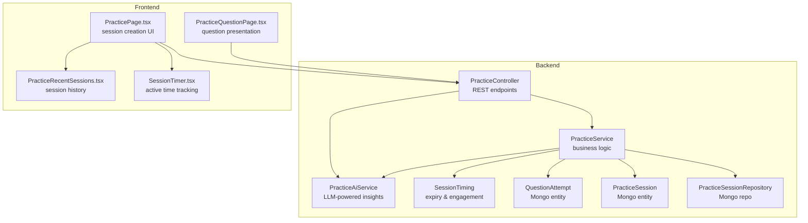
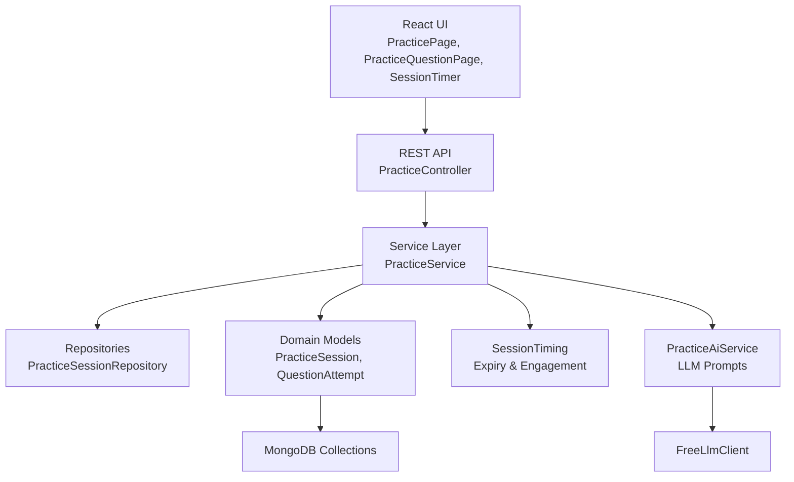
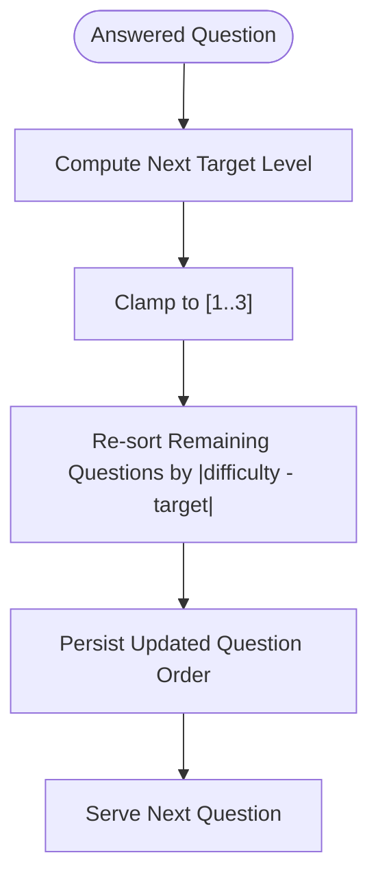
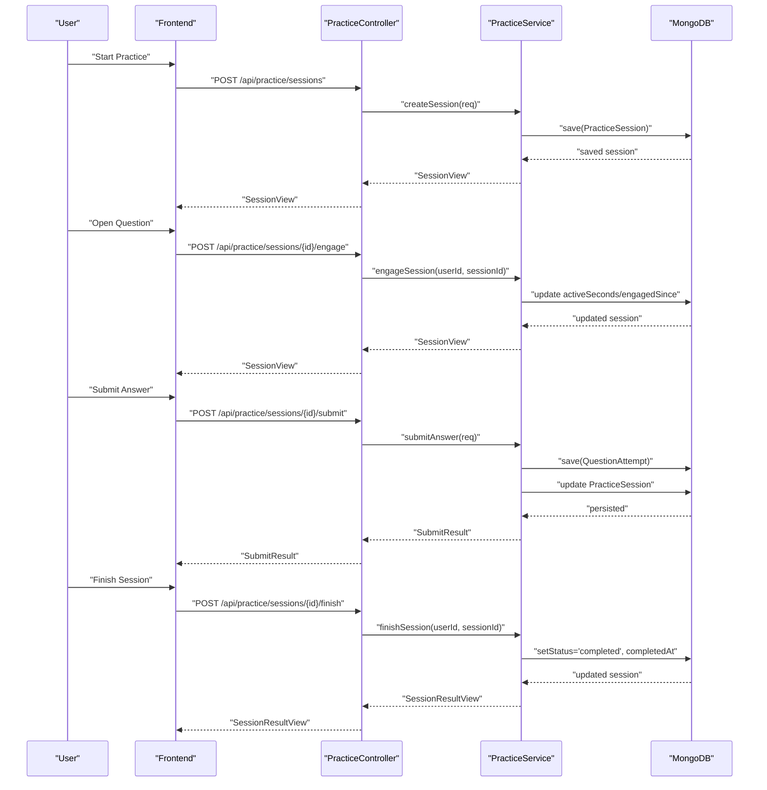
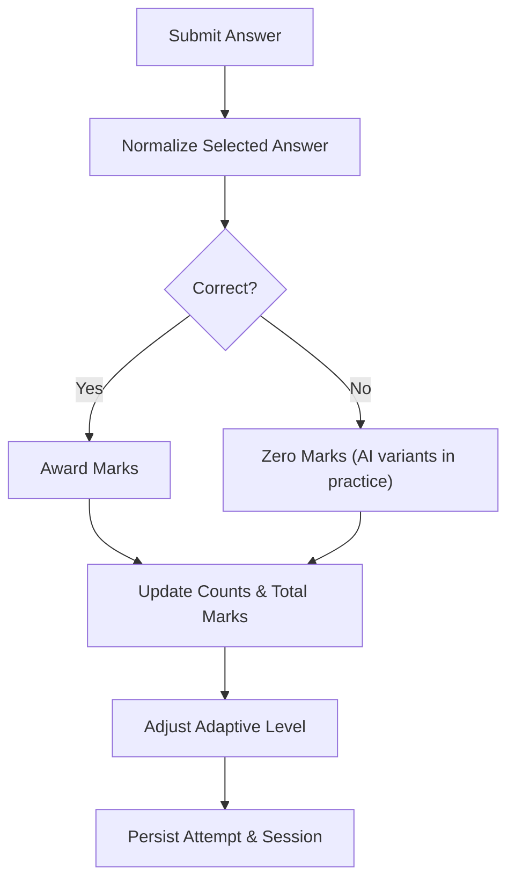
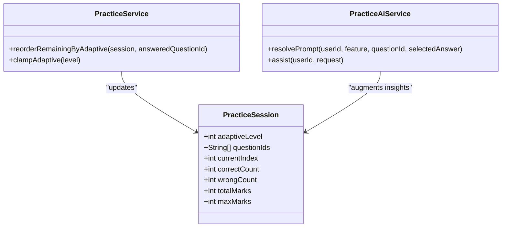
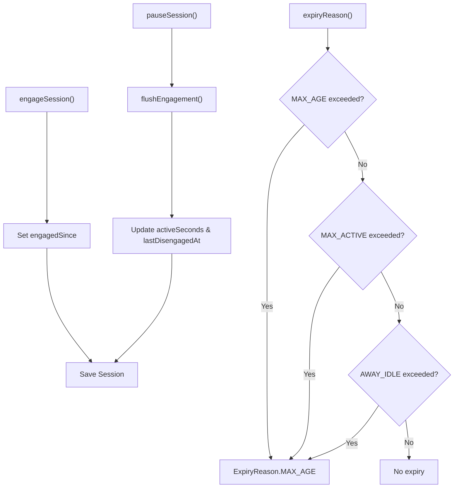
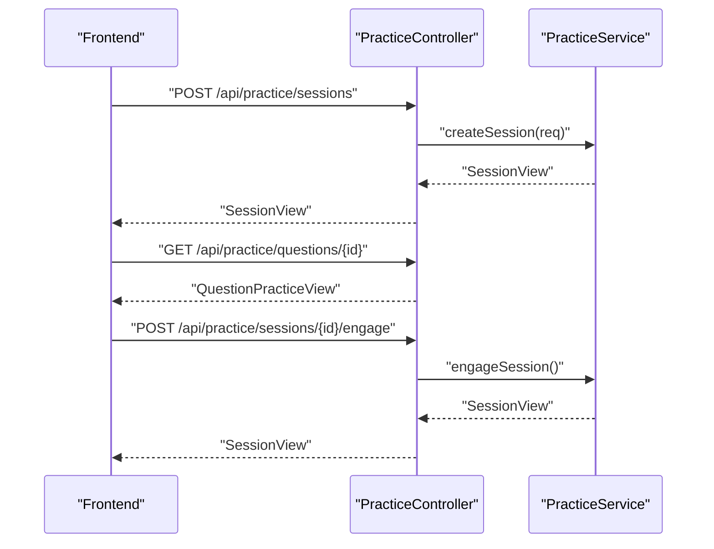
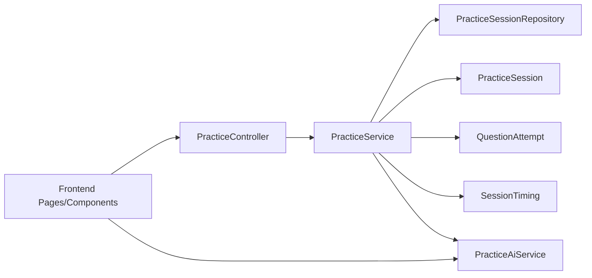
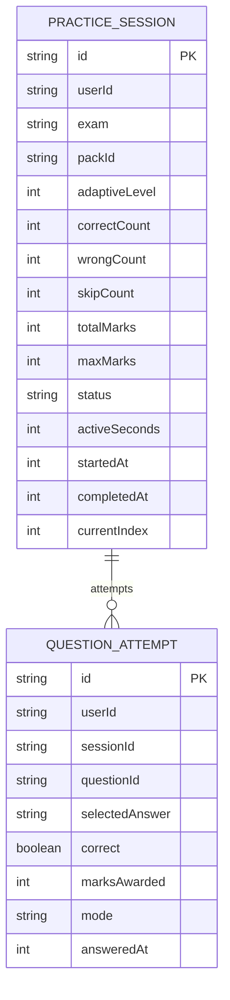

# Adaptive Practice System

<cite>
**Referenced Files in This Document**
- [PracticeService.java](file://backend/src/main/java/com/neetlu/examhunt/service/PracticeService.java)
- [PracticeController.java](file://backend/src/main/java/com/neetlu/examhunt/web/PracticeController.java)
- [PracticeSession.java](file://backend/src/main/java/com/neetlu/examhunt/model/PracticeSession.java)
- [QuestionAttempt.java](file://backend/src/main/java/com/neetlu/examhunt/model/QuestionAttempt.java)
- [PracticeSessionRepository.java](file://backend/src/main/java/com/neetlu/examhunt/repository/PracticeSessionRepository.java)
- [SessionTiming.java](file://backend/src/main/java/com/neetlu/examhunt/service/SessionTiming.java)
- [PracticeAiService.java](file://backend/src/main/java/com/neetlu/examhunt/service/PracticeAiService.java)
- [PracticeAiController.java](file://backend/src/main/java/com/neetlu/examhunt/web/PracticeAiController.java)
- [AdminPracticeAiController.java](file://backend/src/main/java/com/neetlu/examhunt/web/AdminPracticeAiController.java)
- [PracticePage.tsx](file://frontend/src/pages/PracticePage.tsx)
- [PracticeQuestionPage.tsx](file://frontend/src/pages/PracticeQuestionPage.tsx)
- [SessionTimer.tsx](file://frontend/src/components/SessionTimer.tsx)
- [PracticeRecentSessions.tsx](file://frontend/src/components/PracticeRecentSessions.tsx)
- [practice.ts](file://frontend/src/utils/practice.ts)
</cite>

## Table of Contents
1. [Introduction](#introduction)
2. [Project Structure](#project-structure)
3. [Core Components](#core-components)
4. [Architecture Overview](#architecture-overview)
5. [Detailed Component Analysis](#detailed-component-analysis)
6. [Dependency Analysis](#dependency-analysis)
7. [Performance Considerations](#performance-considerations)
8. [Troubleshooting Guide](#troubleshooting-guide)
9. [Conclusion](#conclusion)
10. [Appendices](#appendices)

## Introduction
This document explains the adaptive practice system that powers personalized question selection, dynamic difficulty scaling, and intelligent session management. It covers how sessions are initiated, how questions are selected and presented, how answers are validated, and how progress is tracked and persisted. It also documents the adaptive algorithm, user progress analysis, and dynamic difficulty scaling, along with practical examples of the practice session lifecycle.

## Project Structure
The adaptive practice system spans backend services and frontend UI components:
- Backend Java services manage session lifecycle, adaptive algorithms, and analytics.
- MongoDB-backed models persist sessions and attempts.
- Frontend React components orchestrate user actions, session navigation, and progress visualization.

**Diagram sources**
- [PracticeController.java:31-141](file://backend/src/main/java/com/neetlu/examhunt/web/PracticeController.java#L31-L141)
- [PracticeService.java:60-89](file://backend/src/main/java/com/neetlu/examhunt/service/PracticeService.java#L60-L89)
- [PracticeAiService.java:161-190](file://backend/src/main/java/com/neetlu/examhunt/service/PracticeAiService.java#L161-L190)
- [PracticeSession.java:1-228](file://backend/src/main/java/com/neetlu/examhunt/model/PracticeSession.java#L1-L228)
- [QuestionAttempt.java:1-110](file://backend/src/main/java/com/neetlu/examhunt/model/QuestionAttempt.java#L1-L110)
- [PracticeSessionRepository.java:1-13](file://backend/src/main/java/com/neetlu/examhunt/repository/PracticeSessionRepository.java#L1-L13)
- [SessionTiming.java:30-69](file://backend/src/main/java/com/neetlu/examhunt/service/SessionTiming.java#L30-L69)
- [PracticePage.tsx:45-98](file://frontend/src/pages/PracticePage.tsx#L45-L98)
- [PracticeQuestionPage.tsx:180-206](file://frontend/src/pages/PracticeQuestionPage.tsx#L180-L206)
- [SessionTimer.tsx:20-48](file://frontend/src/components/SessionTimer.tsx#L20-L48)
- [PracticeRecentSessions.tsx:104-132](file://frontend/src/components/PracticeRecentSessions.tsx#L104-L132)

**Section sources**
- [PracticeController.java:31-141](file://backend/src/main/java/com/neetlu/examhunt/web/PracticeController.java#L31-L141)
- [PracticeService.java:60-89](file://backend/src/main/java/com/neetlu/examhunt/service/PracticeService.java#L60-L89)
- [PracticeSession.java:1-228](file://backend/src/main/java/com/neetlu/examhunt/model/PracticeSession.java#L1-L228)
- [QuestionAttempt.java:1-110](file://backend/src/main/java/com/neetlu/examhunt/model/QuestionAttempt.java#L1-L110)
- [PracticeSessionRepository.java:1-13](file://backend/src/main/java/com/neetlu/examhunt/repository/PracticeSessionRepository.java#L1-L13)
- [SessionTiming.java:30-69](file://backend/src/main/java/com/neetlu/examhunt/service/SessionTiming.java#L30-L69)
- [PracticePage.tsx:45-98](file://frontend/src/pages/PracticePage.tsx#L45-L98)
- [PracticeQuestionPage.tsx:180-206](file://frontend/src/pages/PracticeQuestionPage.tsx#L180-L206)
- [SessionTimer.tsx:20-48](file://frontend/src/components/SessionTimer.tsx#L20-L48)
- [PracticeRecentSessions.tsx:104-132](file://frontend/src/components/PracticeRecentSessions.tsx#L104-L132)

## Core Components
- PracticeSession: Tracks session metadata, question order, counts, adaptive level, and timing.
- QuestionAttempt: Stores individual answer submissions with correctness and marks.
- PracticeService: Implements session creation, adaptive ordering, engagement timing, submission handling, and result computation.
- PracticeController: Exposes REST endpoints for session lifecycle and question retrieval.
- SessionTiming: Manages session expiry and engagement-based active seconds.
- PracticeAiService: Provides AI-powered prompts and insights for practice.
- Frontend components: Drive user actions, session navigation, and progress display.

**Section sources**
- [PracticeSession.java:13-228](file://backend/src/main/java/com/neetlu/examhunt/model/PracticeSession.java#L13-L228)
- [QuestionAttempt.java:15-110](file://backend/src/main/java/com/neetlu/examhunt/model/QuestionAttempt.java#L15-L110)
- [PracticeService.java:60-89](file://backend/src/main/java/com/neetlu/examhunt/service/PracticeService.java#L60-L89)
- [PracticeController.java:31-141](file://backend/src/main/java/com/neetlu/examhunt/web/PracticeController.java#L31-L141)
- [SessionTiming.java:30-69](file://backend/src/main/java/com/neetlu/examhunt/service/SessionTiming.java#L30-L69)
- [PracticeAiService.java:161-190](file://backend/src/main/java/com/neetlu/examhunt/service/PracticeAiService.java#L161-L190)
- [PracticePage.tsx:45-98](file://frontend/src/pages/PracticePage.tsx#L45-L98)
- [PracticeQuestionPage.tsx:180-206](file://frontend/src/pages/PracticeQuestionPage.tsx#L180-L206)

## Architecture Overview
The system follows a layered architecture:
- Presentation layer (frontend) handles user interactions and renders UI.
- Application layer (controllers/services) implements domain logic.
- Persistence layer (MongoDB) stores sessions and attempts.
- AI layer (PracticeAiService) augments practice with contextual prompts.

**Diagram sources**
- [PracticeController.java:21-141](file://backend/src/main/java/com/neetlu/examhunt/web/PracticeController.java#L21-L141)
- [PracticeService.java:26-1238](file://backend/src/main/java/com/neetlu/examhunt/service/PracticeService.java#L26-L1238)
- [PracticeSessionRepository.java:9-12](file://backend/src/main/java/com/neetlu/examhunt/repository/PracticeSessionRepository.java#L9-L12)
- [PracticeSession.java:13-228](file://backend/src/main/java/com/neetlu/examhunt/model/PracticeSession.java#L13-L228)
- [QuestionAttempt.java:15-110](file://backend/src/main/java/com/neetlu/examhunt/model/QuestionAttempt.java#L15-L110)
- [SessionTiming.java:30-69](file://backend/src/main/java/com/neetlu/examhunt/service/SessionTiming.java#L30-L69)
- [PracticeAiService.java:161-190](file://backend/src/main/java/com/neetlu/examhunt/service/PracticeAiService.java#L161-L190)

## Detailed Component Analysis

### Adaptive Difficulty Adjustment and Intelligent Question Selection
The adaptive system dynamically selects questions around a target difficulty level derived from user performance. It ensures the next question aligns with the current adaptive level while maintaining session order integrity.

**Diagram sources**
- [PracticeService.java:712-730](file://backend/src/main/java/com/neetlu/examhunt/service/PracticeService.java#L712-L730)
- [PracticeService.java:708-710](file://backend/src/main/java/com/neetlu/examhunt/service/PracticeService.java#L708-L710)

Implementation highlights:
- Difficulty parsing and matching helpers ensure filters are normalized and applied consistently.
- The adaptive reordering sorts the remainder of the question list by proximity to the target difficulty.
- The adaptive level is clamped to valid bounds to prevent out-of-range difficulties.

**Section sources**
- [PracticeService.java:665-694](file://backend/src/main/java/com/neetlu/examhunt/service/PracticeService.java#L665-L694)
- [PracticeService.java:708-730](file://backend/src/main/java/com/neetlu/examhunt/service/PracticeService.java#L708-L730)

### Practice Session Lifecycle
The lifecycle spans creation, engagement, progression, and completion.

**Diagram sources**
- [PracticeController.java:31-141](file://backend/src/main/java/com/neetlu/examhunt/web/PracticeController.java#L31-L141)
- [PracticeService.java:60-89](file://backend/src/main/java/com/neetlu/examhunt/service/PracticeService.java#L60-L89)
- [PracticeService.java:732-753](file://backend/src/main/java/com/neetlu/examhunt/service/PracticeService.java#L732-L753)
- [PracticeService.java:808-825](file://backend/src/main/java/com/neetlu/examhunt/service/PracticeService.java#L808-L825)

Key lifecycle steps:
- Session creation initializes filters, question order, adaptive level, and scoring.
- Engagement toggles maintain accurate active time tracking.
- Submission updates counts, marks, and adaptive level.
- Completion computes results, persists session state, and triggers follow-up tasks.

**Section sources**
- [PracticeController.java:31-141](file://backend/src/main/java/com/neetlu/examhunt/web/PracticeController.java#L31-L141)
- [PracticeService.java:60-89](file://backend/src/main/java/com/neetlu/examhunt/service/PracticeService.java#L60-L89)
- [PracticeService.java:732-753](file://backend/src/main/java/com/neetlu/examhunt/service/PracticeService.java#L732-L753)
- [PracticeService.java:808-825](file://backend/src/main/java/com/neetlu/examhunt/service/PracticeService.java#L808-L825)

### Attempt Tracking and Marks Calculation
Each answer submission creates a QuestionAttempt and updates session metrics. Marks are computed considering AI variants and session mode.

**Diagram sources**
- [PracticeService.java:364-397](file://backend/src/main/java/com/neetlu/examhunt/service/PracticeService.java#L364-L397)
- [PracticeService.java:215-220](file://backend/src/main/java/com/neetlu/examhunt/service/PracticeService.java#L215-L220)

Behavioral notes:
- AI variant drills in practice mode do not contribute to marks or analytics.
- Test mode suppresses answer visibility and solution details in SubmitResult.

**Section sources**
- [PracticeService.java:196-220](file://backend/src/main/java/com/neetlu/examhunt/service/PracticeService.java#L196-L220)
- [PracticeService.java:364-397](file://backend/src/main/java/com/neetlu/examhunt/service/PracticeService.java#L364-L397)

### Dynamic Difficulty Scaling and Recommendation
The system maintains an internal adaptive level (1–3) and reorders remaining questions to approach the target difficulty. It also supports AI-driven insights for weak areas and similar questions.

**Diagram sources**
- [PracticeSession.java:23-106](file://backend/src/main/java/com/neetlu/examhunt/model/PracticeSession.java#L23-L106)
- [PracticeService.java:708-730](file://backend/src/main/java/com/neetlu/examhunt/service/PracticeService.java#L708-L730)
- [PracticeAiService.java:1546-1561](file://backend/src/main/java/com/neetlu/examhunt/service/PracticeAiService.java#L1546-L1561)

**Section sources**
- [PracticeSession.java:23-106](file://backend/src/main/java/com/neetlu/examhunt/model/PracticeSession.java#L23-L106)
- [PracticeService.java:708-730](file://backend/src/main/java/com/neetlu/examhunt/service/PracticeService.java#L708-L730)
- [PracticeAiService.java:1546-1561](file://backend/src/main/java/com/neetlu/examhunt/service/PracticeAiService.java#L1546-L1561)

### Session Management and Timing
Session timing integrates engagement windows and idle expiry to compute active seconds and enforce session limits.

**Diagram sources**
- [SessionTiming.java:30-69](file://backend/src/main/java/com/neetlu/examhunt/service/SessionTiming.java#L30-L69)
- [PracticeService.java:732-753](file://backend/src/main/java/com/neetlu/examhunt/service/PracticeService.java#L732-L753)

**Section sources**
- [SessionTiming.java:30-69](file://backend/src/main/java/com/neetlu/examhunt/service/SessionTiming.java#L30-L69)
- [PracticeService.java:732-753](file://backend/src/main/java/com/neetlu/examhunt/service/PracticeService.java#L732-L753)

### Frontend Integration Examples
- Starting a practice session: The frontend composes filters, validates pack availability, and requests a session from the backend.
- Presenting a question: The frontend loads question content and manages answer submission and review.
- Timer display: The frontend computes elapsed time based on activeSeconds and engagedSince.

**Diagram sources**
- [PracticePage.tsx:45-98](file://frontend/src/pages/PracticePage.tsx#L45-L98)
- [PracticeQuestionPage.tsx:180-206](file://frontend/src/pages/PracticeQuestionPage.tsx#L180-L206)
- [PracticeController.java:31-141](file://backend/src/main/java/com/neetlu/examhunt/web/PracticeController.java#L31-L141)

**Section sources**
- [PracticePage.tsx:45-98](file://frontend/src/pages/PracticePage.tsx#L45-L98)
- [PracticeQuestionPage.tsx:180-206](file://frontend/src/pages/PracticeQuestionPage.tsx#L180-L206)
- [PracticeController.java:31-141](file://backend/src/main/java/com/neetlu/examhunt/web/PracticeController.java#L31-L141)

## Dependency Analysis
The system exhibits clear separation of concerns:
- Controllers depend on services for business logic.
- Services depend on repositories and models for persistence.
- AI service depends on platform settings and LLM client.
- Frontend components depend on backend APIs and local utilities.

**Diagram sources**
- [PracticeController.java:21-141](file://backend/src/main/java/com/neetlu/examhunt/web/PracticeController.java#L21-L141)
- [PracticeService.java:26-1238](file://backend/src/main/java/com/neetlu/examhunt/service/PracticeService.java#L26-L1238)
- [PracticeSessionRepository.java:9-12](file://backend/src/main/java/com/neetlu/examhunt/repository/PracticeSessionRepository.java#L9-L12)
- [PracticeSession.java:13-228](file://backend/src/main/java/com/neetlu/examhunt/model/PracticeSession.java#L13-L228)
- [QuestionAttempt.java:15-110](file://backend/src/main/java/com/neetlu/examhunt/model/QuestionAttempt.java#L15-L110)
- [SessionTiming.java:30-69](file://backend/src/main/java/com/neetlu/examhunt/service/SessionTiming.java#L30-L69)
- [PracticeAiService.java:161-190](file://backend/src/main/java/com/neetlu/examhunt/service/PracticeAiService.java#L161-L190)

**Section sources**
- [PracticeController.java:21-141](file://backend/src/main/java/com/neetlu/examhunt/web/PracticeController.java#L21-L141)
- [PracticeService.java:26-1238](file://backend/src/main/java/com/neetlu/examhunt/service/PracticeService.java#L26-L1238)
- [PracticeSessionRepository.java:9-12](file://backend/src/main/java/com/neetlu/examhunt/repository/PracticeSessionRepository.java#L9-L12)
- [PracticeSession.java:13-228](file://backend/src/main/java/com/neetlu/examhunt/model/PracticeSession.java#L13-L228)
- [QuestionAttempt.java:15-110](file://backend/src/main/java/com/neetlu/examhunt/model/QuestionAttempt.java#L15-L110)
- [SessionTiming.java:30-69](file://backend/src/main/java/com/neetlu/examhunt/service/SessionTiming.java#L30-L69)
- [PracticeAiService.java:161-190](file://backend/src/main/java/com/neetlu/examhunt/service/PracticeAiService.java#L161-L190)

## Performance Considerations
- Adaptive reordering operates on the remainder of the question list; keep session sizes reasonable to minimize sort overhead.
- Use pagination and filtering to limit question pool size during session creation.
- Persist engagement segments efficiently to avoid excessive writes.
- Offload non-critical analytics computations asynchronously.

[No sources needed since this section provides general guidance]

## Troubleshooting Guide
Common issues and resolutions:
- Session not found: Ensure the authenticated user owns the session ID.
- Session expired: Sessions may expire due to age, active time cap, or extended idle periods.
- No questions match filters: Verify filters and question set configuration.
- AI prompts disabled: Confirm platform settings and LLM configuration.

**Section sources**
- [PracticeService.java:222-226](file://backend/src/main/java/com/neetlu/examhunt/service/PracticeService.java#L222-L226)
- [SessionTiming.java:42-69](file://backend/src/main/java/com/neetlu/examhunt/service/SessionTiming.java#L42-L69)
- [PracticeAiService.java:180-190](file://backend/src/main/java/com/neetlu/examhunt/service/PracticeAiService.java#L180-L190)

## Conclusion
The adaptive practice system combines a robust session lifecycle, dynamic difficulty scaling, and AI-enhanced insights to deliver a personalized learning experience. Its modular design separates concerns cleanly, enabling scalable enhancements and reliable persistence of user progress.

[No sources needed since this section summarizes without analyzing specific files]

## Appendices

### Example Workflows

- Practice session initiation
  - Frontend composes filters and requests a session.
  - Backend validates filters, builds question order, and persists the session.
  - Frontend navigates to the first question.

- Question presentation and answer validation
  - Frontend loads question content.
  - On submission, backend compares normalized answers, updates counts and marks, adjusts adaptive level, and returns results.

- Session completion
  - Frontend requests completion.
  - Backend computes results, persists state, and returns a comprehensive result view.

**Section sources**
- [PracticePage.tsx:45-98](file://frontend/src/pages/PracticePage.tsx#L45-L98)
- [PracticeController.java:31-141](file://backend/src/main/java/com/neetlu/examhunt/web/PracticeController.java#L31-L141)
- [PracticeService.java:364-397](file://backend/src/main/java/com/neetlu/examhunt/service/PracticeService.java#L364-L397)
- [PracticeService.java:808-825](file://backend/src/main/java/com/neetlu/examhunt/service/PracticeService.java#L808-L825)

### Data Models Overview

**Diagram sources**
- [PracticeSession.java:13-228](file://backend/src/main/java/com/neetlu/examhunt/model/PracticeSession.java#L13-L228)
- [QuestionAttempt.java:15-110](file://backend/src/main/java/com/neetlu/examhunt/model/QuestionAttempt.java#L15-L110)