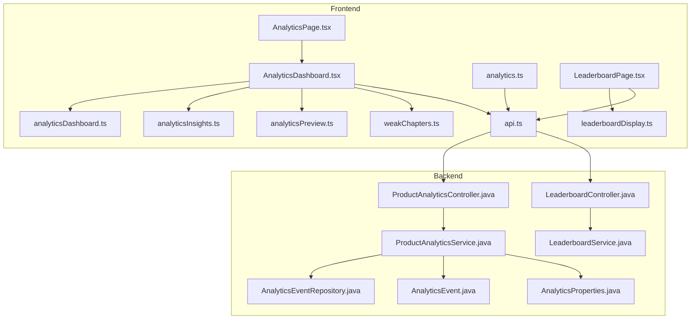
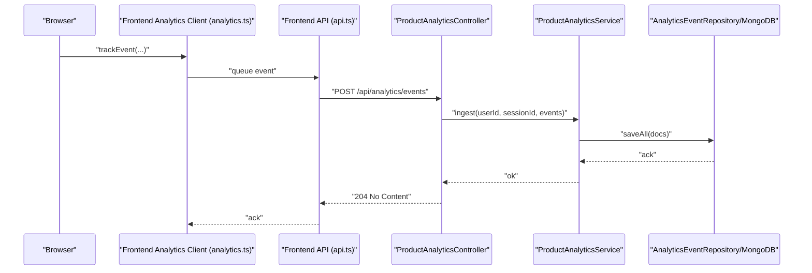
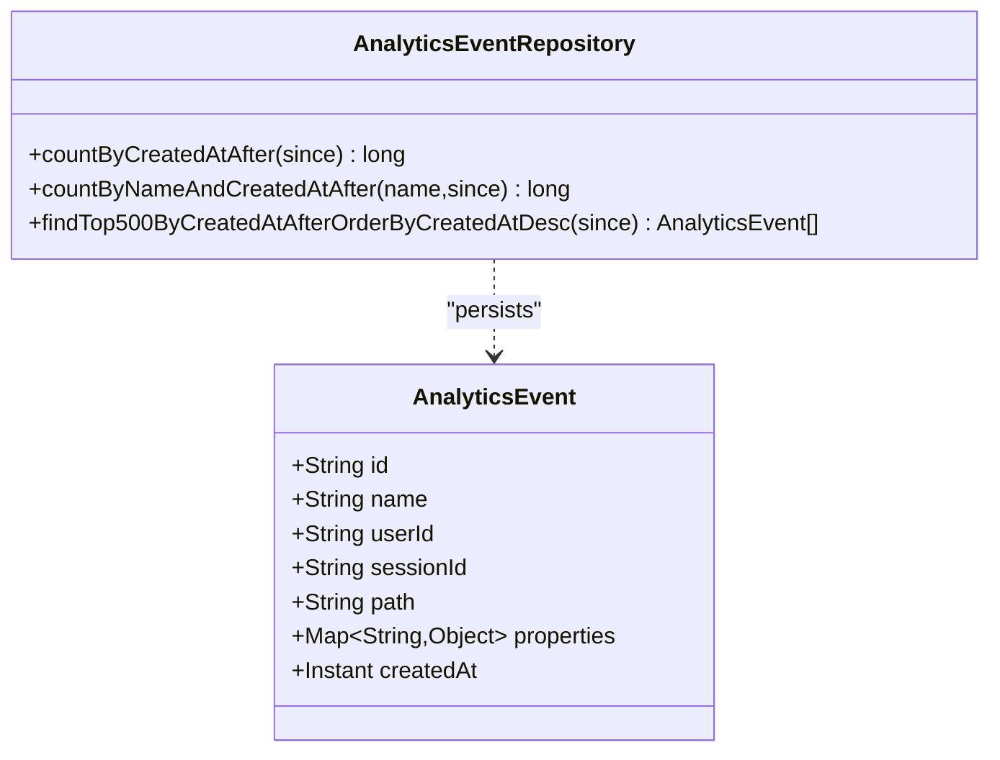
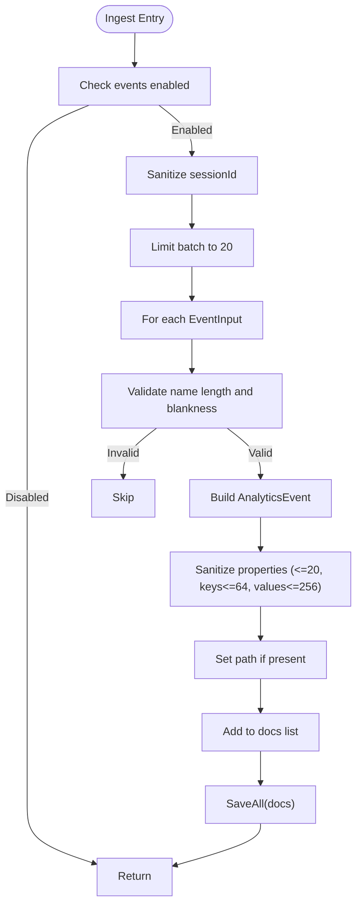
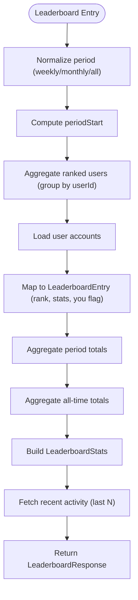
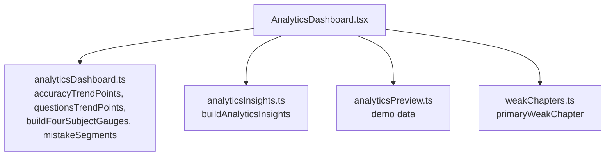
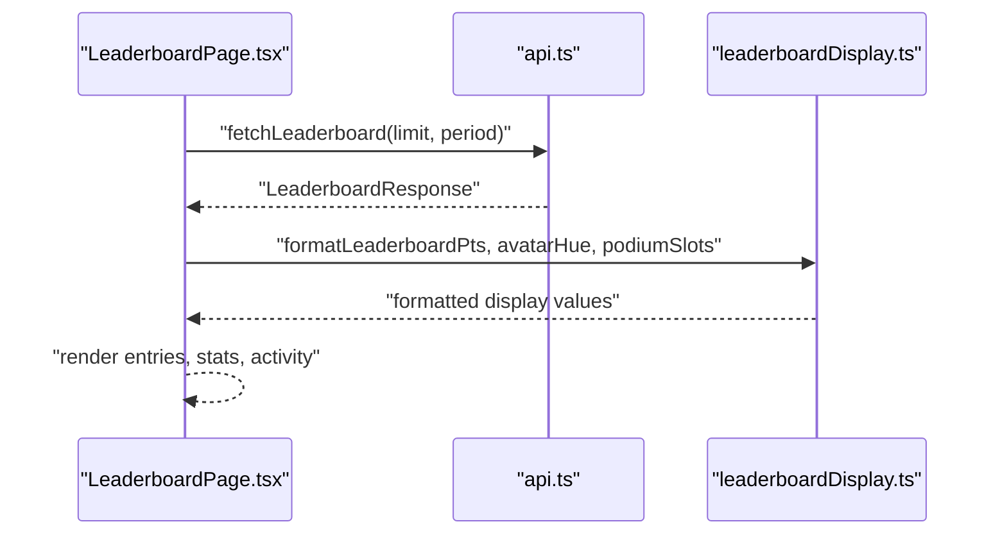
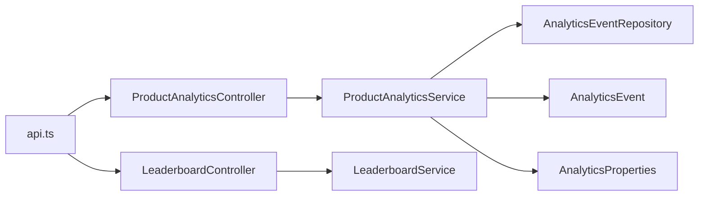
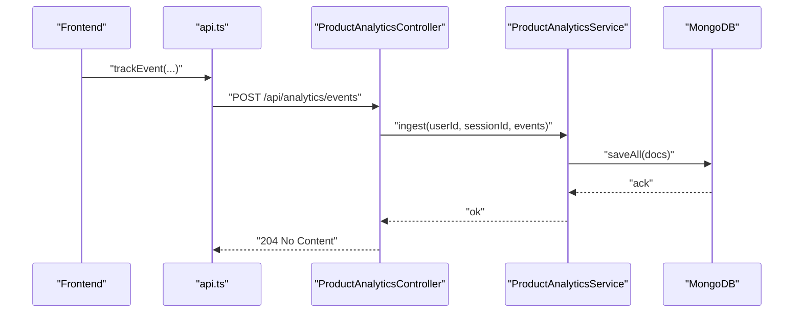
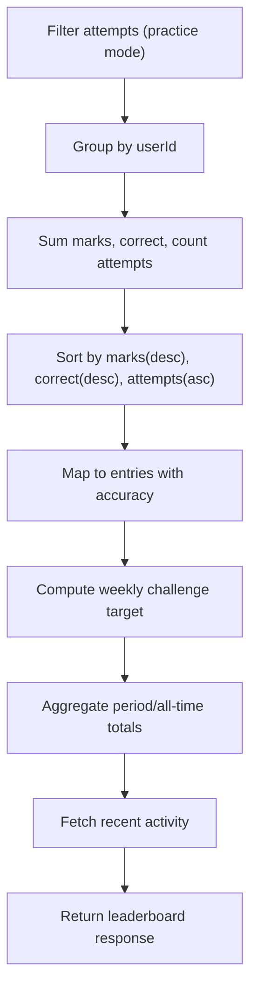

# Analytics and Insights Dashboard

<cite>
**Referenced Files in This Document**
- [AnalyticsEvent.java](file://backend/src/main/java/com/neetlu/examhunt/model/AnalyticsEvent.java)
- [AnalyticsEventRepository.java](file://backend/src/main/java/com/neetlu/examhunt/repository/AnalyticsEventRepository.java)
- [ProductAnalyticsService.java](file://backend/src/main/java/com/neetlu/examhunt/service/ProductAnalyticsService.java)
- [ProductAnalyticsController.java](file://backend/src/main/java/com/neetlu/examhunt/web/ProductAnalyticsController.java)
- [AnalyticsProperties.java](file://backend/src/main/java/com/neetlu/examhunt/config/AnalyticsProperties.java)
- [LeaderboardService.java](file://backend/src/main/java/com/neetlu/examhunt/service/LeaderboardService.java)
- [LeaderboardController.java](file://backend/src/main/java/com/neetlu/examhunt/web/LeaderboardController.java)
- [AnalyticsPage.tsx](file://frontend/src/pages/AnalyticsPage.tsx)
- [AnalyticsDashboard.tsx](file://frontend/src/components/AnalyticsDashboard.tsx)
- [analyticsDashboard.ts](file://frontend/src/utils/analyticsDashboard.ts)
- [analyticsInsights.ts](file://frontend/src/utils/analyticsInsights.ts)
- [analyticsPreview.ts](file://frontend/src/utils/analyticsPreview.ts)
- [weakChapters.ts](file://frontend/src/utils/weakChapters.ts)
- [leaderboardDisplay.ts](file://frontend/src/utils/leaderboardDisplay.ts)
- [DashboardPerformanceSnapshot.tsx](file://frontend/src/components/DashboardPerformanceSnapshot.tsx)
- [analytics.ts](file://frontend/src/analytics.ts)
- [api.ts](file://frontend/src/api.ts)
- [LeaderboardPage.tsx](file://frontend/src/pages/LeaderboardPage.tsx)
</cite>

## Table of Contents
1. [Introduction](#introduction)
2. [Project Structure](#project-structure)
3. [Core Components](#core-components)
4. [Architecture Overview](#architecture-overview)
5. [Detailed Component Analysis](#detailed-component-analysis)
6. [Dependency Analysis](#dependency-analysis)
7. [Performance Considerations](#performance-considerations)
8. [Troubleshooting Guide](#troubleshooting-guide)
9. [Conclusion](#conclusion)
10. [Appendices](#appendices)

## Introduction
This document explains the analytics and insights dashboard system, covering performance tracking, weak area identification, leaderboard implementation, and data visualization. It documents how analytics events are collected, aggregated, and surfaced into actionable insights. It also describes the leaderboard algorithms, ranking systems, and gamification elements, along with practical examples of dashboard components, analytics queries, and performance reporting. The integration between backend analytics services and frontend visualization components is explained, including data aggregation, real-time-like updates, and user insights generation.

## Project Structure
The analytics and insights system spans both backend and frontend layers:
- Backend: MongoDB-backed analytics ingestion and aggregation, plus leaderboard computation via MongoDB aggregation.
- Frontend: Dashboard pages and components that render charts, trends, weak areas, mistakes, and leaderboard views.

**Diagram sources**
- [AnalyticsPage.tsx:1-58](file://frontend/src/pages/AnalyticsPage.tsx#L1-L58)
- [AnalyticsDashboard.tsx:1-433](file://frontend/src/components/AnalyticsDashboard.tsx#L1-L433)
- [analyticsDashboard.ts:1-204](file://frontend/src/utils/analyticsDashboard.ts#L1-L204)
- [analyticsInsights.ts:1-115](file://frontend/src/utils/analyticsInsights.ts#L1-L115)
- [analyticsPreview.ts:1-159](file://frontend/src/utils/analyticsPreview.ts#L1-L159)
- [weakChapters.ts:1-38](file://frontend/src/utils/weakChapters.ts#L1-L38)
- [leaderboardDisplay.ts:1-43](file://frontend/src/utils/leaderboardDisplay.ts#L1-L43)
- [api.ts:1-200](file://frontend/src/api.ts#L1-L200)
- [analytics.ts:40-182](file://frontend/src/analytics.ts#L40-L182)
- [LeaderboardPage.tsx:1-367](file://frontend/src/pages/LeaderboardPage.tsx#L1-L367)
- [AnalyticsProperties.java:1-7](file://backend/src/main/java/com/neetlu/examhunt/config/AnalyticsProperties.java#L1-L7)
- [AnalyticsEvent.java:1-83](file://backend/src/main/java/com/neetlu/examhunt/model/AnalyticsEvent.java#L1-L83)
- [AnalyticsEventRepository.java:1-17](file://backend/src/main/java/com/neetlu/examhunt/repository/AnalyticsEventRepository.java#L1-L17)
- [ProductAnalyticsService.java:1-154](file://backend/src/main/java/com/neetlu/examhunt/service/ProductAnalyticsService.java#L1-L154)
- [LeaderboardService.java:1-372](file://backend/src/main/java/com/neetlu/examhunt/service/LeaderboardService.java#L1-L372)
- [ProductAnalyticsController.java:1-41](file://backend/src/main/java/com/neetlu/examhunt/web/ProductAnalyticsController.java#L1-L41)
- [LeaderboardController.java:1-28](file://backend/src/main/java/com/neetlu/examhunt/web/LeaderboardController.java#L1-L28)

**Section sources**
- [AnalyticsPage.tsx:1-58](file://frontend/src/pages/AnalyticsPage.tsx#L1-L58)
- [AnalyticsDashboard.tsx:1-433](file://frontend/src/components/AnalyticsDashboard.tsx#L1-L433)
- [ProductAnalyticsService.java:1-154](file://backend/src/main/java/com/neetlu/examhunt/service/ProductAnalyticsService.java#L1-L154)
- [LeaderboardService.java:1-372](file://backend/src/main/java/com/neetlu/examhunt/service/LeaderboardService.java#L1-L372)

## Core Components
- Analytics event model and repository define the schema and query surface for analytics events stored in MongoDB.
- Product analytics service handles ingestion, sanitization, and summary computation for product analytics.
- Product analytics controller exposes a POST endpoint to accept client-side events.
- Leaderboard service computes rankings, stats, and recent activity using MongoDB aggregation.
- Leaderboard controller exposes a GET endpoint to fetch leaderboard data.
- Frontend dashboard page and components render performance trends, weak areas, mistakes, and insights.
- Utilities compute trends, gauges, insights, and leaderboard display helpers.
- Analytics client tracks and batches events, sending them to the backend.

**Section sources**
- [AnalyticsEvent.java:1-83](file://backend/src/main/java/com/neetlu/examhunt/model/AnalyticsEvent.java#L1-L83)
- [AnalyticsEventRepository.java:1-17](file://backend/src/main/java/com/neetlu/examhunt/repository/AnalyticsEventRepository.java#L1-L17)
- [ProductAnalyticsService.java:1-154](file://backend/src/main/java/com/neetlu/examhunt/service/ProductAnalyticsService.java#L1-L154)
- [ProductAnalyticsController.java:1-41](file://backend/src/main/java/com/neetlu/examhunt/web/ProductAnalyticsController.java#L1-L41)
- [LeaderboardService.java:1-372](file://backend/src/main/java/com/neetlu/examhunt/service/LeaderboardService.java#L1-L372)
- [LeaderboardController.java:1-28](file://backend/src/main/java/com/neetlu/examhunt/web/LeaderboardController.java#L1-L28)
- [AnalyticsPage.tsx:1-58](file://frontend/src/pages/AnalyticsPage.tsx#L1-L58)
- [AnalyticsDashboard.tsx:1-433](file://frontend/src/components/AnalyticsDashboard.tsx#L1-L433)
- [analyticsDashboard.ts:1-204](file://frontend/src/utils/analyticsDashboard.ts#L1-L204)
- [analyticsInsights.ts:1-115](file://frontend/src/utils/analyticsInsights.ts#L1-L115)
- [analyticsPreview.ts:1-159](file://frontend/src/utils/analyticsPreview.ts#L1-L159)
- [weakChapters.ts:1-38](file://frontend/src/utils/weakChapters.ts#L1-L38)
- [leaderboardDisplay.ts:1-43](file://frontend/src/utils/leaderboardDisplay.ts#L1-L43)
- [analytics.ts:40-182](file://frontend/src/analytics.ts#L40-L182)

## Architecture Overview
The analytics pipeline collects events from the client, sanitizes and persists them server-side, and exposes summaries and leaderboards consumed by the frontend.

**Diagram sources**
- [analytics.ts:40-182](file://frontend/src/analytics.ts#L40-L182)
- [api.ts:1-200](file://frontend/src/api.ts#L1-L200)
- [ProductAnalyticsController.java:1-41](file://backend/src/main/java/com/neetlu/examhunt/web/ProductAnalyticsController.java#L1-L41)
- [ProductAnalyticsService.java:1-154](file://backend/src/main/java/com/neetlu/examhunt/service/ProductAnalyticsService.java#L1-L154)
- [AnalyticsEventRepository.java:1-17](file://backend/src/main/java/com/neetlu/examhunt/repository/AnalyticsEventRepository.java#L1-L17)

## Detailed Component Analysis

### Analytics Event Model and Repository
- Model defines indexed fields for efficient querying by event name and creation time, and includes optional path and properties metadata.
- Repository provides count and paginated retrieval helpers for recent events.

**Diagram sources**
- [AnalyticsEvent.java:1-83](file://backend/src/main/java/com/neetlu/examhunt/model/AnalyticsEvent.java#L1-L83)
- [AnalyticsEventRepository.java:1-17](file://backend/src/main/java/com/neetlu/examhunt/repository/AnalyticsEventRepository.java#L1-L17)

**Section sources**
- [AnalyticsEvent.java:1-83](file://backend/src/main/java/com/neetlu/examhunt/model/AnalyticsEvent.java#L1-L83)
- [AnalyticsEventRepository.java:1-17](file://backend/src/main/java/com/neetlu/examhunt/repository/AnalyticsEventRepository.java#L1-L17)

### Product Analytics Service and Controller
- Service ingests sanitized events, limits batch size, and stores them with sanitized properties and path.
- Provides a summary view aggregating top events, unique sessions, and daily page views for a configurable window.
- Controller accepts a batch of events and delegates ingestion to the service.

**Diagram sources**
- [ProductAnalyticsService.java:36-69](file://backend/src/main/java/com/neetlu/examhunt/service/ProductAnalyticsService.java#L36-L69)
- [ProductAnalyticsService.java:105-128](file://backend/src/main/java/com/neetlu/examhunt/service/ProductAnalyticsService.java#L105-L128)

**Section sources**
- [ProductAnalyticsService.java:1-154](file://backend/src/main/java/com/neetlu/examhunt/service/ProductAnalyticsService.java#L1-L154)
- [ProductAnalyticsController.java:1-41](file://backend/src/main/java/com/neetlu/examhunt/web/ProductAnalyticsController.java#L1-L41)

### Leaderboard Service and Controller
- Computes rankings by total marks, then correctness count, then attempts count (ascending).
- Supports weekly/monthly/all-time periods with a normalized period window.
- Aggregates period totals (scholars, total marks, attempts, correct, accuracy) and recent activity.
- Returns a response containing entries, personal entry, total players, stats, and recent activity.

**Diagram sources**
- [LeaderboardService.java:40-77](file://backend/src/main/java/com/neetlu/examhunt/service/LeaderboardService.java#L40-L77)
- [LeaderboardService.java:85-115](file://backend/src/main/java/com/neetlu/examhunt/service/LeaderboardService.java#L85-L115)
- [LeaderboardService.java:117-148](file://backend/src/main/java/com/neetlu/examhunt/service/LeaderboardService.java#L117-L148)
- [LeaderboardController.java:20-26](file://backend/src/main/java/com/neetlu/examhunt/web/LeaderboardController.java#L20-L26)

**Section sources**
- [LeaderboardService.java:1-372](file://backend/src/main/java/com/neetlu/examhunt/service/LeaderboardService.java#L1-L372)
- [LeaderboardController.java:1-28](file://backend/src/main/java/com/neetlu/examhunt/web/LeaderboardController.java#L1-L28)

### Frontend Analytics Dashboard
- Renders tabs for Overview, Performance, Subjects, Chapters, Weak Areas, Mistakes, Tests.
- Uses utilities to compute accuracy trends, question trends, weekly activity cells, subject gauges, and mistake segments.
- Displays insights cards and a “focus area” recommendation based on weak chapters.

**Diagram sources**
- [AnalyticsDashboard.tsx:137-433](file://frontend/src/components/AnalyticsDashboard.tsx#L137-L433)
- [analyticsDashboard.ts:1-204](file://frontend/src/utils/analyticsDashboard.ts#L1-L204)
- [analyticsInsights.ts:1-115](file://frontend/src/utils/analyticsInsights.ts#L1-L115)
- [analyticsPreview.ts:1-159](file://frontend/src/utils/analyticsPreview.ts#L1-L159)
- [weakChapters.ts:1-38](file://frontend/src/utils/weakChapters.ts#L1-L38)

**Section sources**
- [AnalyticsDashboard.tsx:1-433](file://frontend/src/components/AnalyticsDashboard.tsx#L1-L433)
- [analyticsDashboard.ts:1-204](file://frontend/src/utils/analyticsDashboard.ts#L1-L204)
- [analyticsInsights.ts:1-115](file://frontend/src/utils/analyticsInsights.ts#L1-L115)
- [analyticsPreview.ts:1-159](file://frontend/src/utils/analyticsPreview.ts#L1-L159)
- [weakChapters.ts:1-38](file://frontend/src/utils/weakChapters.ts#L1-L38)

### Leaderboard Frontend and Gamification
- Renders leaderboard entries with avatars, ranks, scores, and trend indicators.
- Provides filtering, podium layout, and display helpers for points formatting and mastery labels.
- Integrates with leaderboard APIs to show weekly/monthly/all-time views.

**Diagram sources**
- [LeaderboardPage.tsx:334-367](file://frontend/src/pages/LeaderboardPage.tsx#L334-L367)
- [leaderboardDisplay.ts:1-43](file://frontend/src/utils/leaderboardDisplay.ts#L1-L43)
- [api.ts:1-200](file://frontend/src/api.ts#L1-L200)

**Section sources**
- [LeaderboardPage.tsx:1-367](file://frontend/src/pages/LeaderboardPage.tsx#L1-L367)
- [leaderboardDisplay.ts:1-43](file://frontend/src/utils/leaderboardDisplay.ts#L1-L43)
- [api.ts:1-200](file://frontend/src/api.ts#L1-L200)

## Dependency Analysis
- Backend depends on Spring Data MongoDB for repository operations and aggregation.
- Analytics service depends on configuration to gate ingestion.
- Frontend depends on typed API responses and utility modules for rendering.

**Diagram sources**
- [api.ts:1-200](file://frontend/src/api.ts#L1-L200)
- [ProductAnalyticsController.java:1-41](file://backend/src/main/java/com/neetlu/examhunt/web/ProductAnalyticsController.java#L1-L41)
- [LeaderboardController.java:1-28](file://backend/src/main/java/com/neetlu/examhunt/web/LeaderboardController.java#L1-L28)
- [ProductAnalyticsService.java:1-154](file://backend/src/main/java/com/neetlu/examhunt/service/ProductAnalyticsService.java#L1-L154)
- [LeaderboardService.java:1-372](file://backend/src/main/java/com/neetlu/examhunt/service/LeaderboardService.java#L1-L372)
- [AnalyticsEventRepository.java:1-17](file://backend/src/main/java/com/neetlu/examhunt/repository/AnalyticsEventRepository.java#L1-L17)
- [AnalyticsEvent.java:1-83](file://backend/src/main/java/com/neetlu/examhunt/model/AnalyticsEvent.java#L1-L83)
- [AnalyticsProperties.java:1-7](file://backend/src/main/java/com/neetlu/examhunt/config/AnalyticsProperties.java#L1-L7)

**Section sources**
- [ProductAnalyticsService.java:1-154](file://backend/src/main/java/com/neetlu/examhunt/service/ProductAnalyticsService.java#L1-L154)
- [LeaderboardService.java:1-372](file://backend/src/main/java/com/neetlu/examhunt/service/LeaderboardService.java#L1-L372)
- [api.ts:1-200](file://frontend/src/api.ts#L1-L200)

## Performance Considerations
- Event ingestion is batch-limited to reduce write amplification and memory pressure.
- Indexes on event name and creation time enable fast summarization and recent-event queries.
- Aggregation sorts by multiple fields to produce fair, deterministic rankings.
- Frontend computations rely on memoization and precomputed utilities to minimize re-renders.
- Real-time updates are approximated via periodic polling and client-side batching.

[No sources needed since this section provides general guidance]

## Troubleshooting Guide
- Analytics ingestion disabled: Verify configuration property enabling events.
- Empty leaderboard: Ensure practice-mode attempts exist and are within the selected period.
- Missing trends: Confirm sufficient sessions exist within the chart window.
- Guest preview data: Demo datasets are used when no user progress is available.

**Section sources**
- [AnalyticsProperties.java:1-7](file://backend/src/main/java/com/neetlu/examhunt/config/AnalyticsProperties.java#L1-L7)
- [ProductAnalyticsService.java:36-69](file://backend/src/main/java/com/neetlu/examhunt/service/ProductAnalyticsService.java#L36-L69)
- [LeaderboardService.java:175-192](file://backend/src/main/java/com/neetlu/examhunt/service/LeaderboardService.java#L175-L192)
- [analyticsPreview.ts:1-159](file://frontend/src/utils/analyticsPreview.ts#L1-L159)

## Conclusion
The analytics and insights dashboard integrates client-side event tracking with robust backend ingestion and aggregation, delivering performance trends, weak area identification, and a dynamic leaderboard. The frontend components transform raw data into actionable insights, while backend services ensure scalable computation and fair ranking. Together, they form a cohesive system for tracking learning progress and motivating continued engagement.

[No sources needed since this section summarizes without analyzing specific files]

## Appendices

### Analytics Event Collection Workflow
- Client-side tracking queues events and flushes them to the backend.
- Backend controller validates and delegates ingestion to the service.
- Service sanitizes inputs, persists events, and supports summary queries.

**Diagram sources**
- [analytics.ts:40-182](file://frontend/src/analytics.ts#L40-L182)
- [api.ts:1-200](file://frontend/src/api.ts#L1-L200)
- [ProductAnalyticsController.java:1-41](file://backend/src/main/java/com/neetlu/examhunt/web/ProductAnalyticsController.java#L1-L41)
- [ProductAnalyticsService.java:1-154](file://backend/src/main/java/com/neetlu/examhunt/service/ProductAnalyticsService.java#L1-L154)

### Leaderboard Ranking Algorithm
- Sort by total marks (desc), correctness count (desc), attempts count (asc).
- Compute weekly challenge target based on current marks.
- Aggregate period/all-time stats and recent activity.

**Diagram sources**
- [LeaderboardService.java:203-224](file://backend/src/main/java/com/neetlu/examhunt/service/LeaderboardService.java#L203-L224)
- [LeaderboardService.java:79-83](file://backend/src/main/java/com/neetlu/examhunt/service/LeaderboardService.java#L79-L83)
- [LeaderboardService.java:85-115](file://backend/src/main/java/com/neetlu/examhunt/service/LeaderboardService.java#L85-L115)
- [LeaderboardService.java:117-148](file://backend/src/main/java/com/neetlu/examhunt/service/LeaderboardService.java#L117-L148)

### Dashboard Components and Metrics
- Performance trends: Accuracy and questions solved over the last 28 days.
- Subject performance: Four-subject gauges rolled up from chapter-level data.
- Weak areas: Table of weakest chapters with action links.
- Mistakes overview: Donut chart of mistake categories.
- Insights: AI-driven recommendations and potential improvement calculations.

**Section sources**
- [AnalyticsDashboard.tsx:261-415](file://frontend/src/components/AnalyticsDashboard.tsx#L261-L415)
- [analyticsDashboard.ts:56-107](file://frontend/src/utils/analyticsDashboard.ts#L56-L107)
- [analyticsDashboard.ts:110-144](file://frontend/src/utils/analyticsDashboard.ts#L110-L144)
- [analyticsDashboard.ts:172-199](file://frontend/src/utils/analyticsDashboard.ts#L172-L199)
- [analyticsInsights.ts:19-47](file://frontend/src/utils/analyticsInsights.ts#L19-L47)

### Example Queries and Reports
- Recent events summary: Top events, unique sessions, and daily page views for a configurable window.
- Leaderboard: Entries, stats, recent activity, and total players for a given period.

**Section sources**
- [ProductAnalyticsService.java:71-103](file://backend/src/main/java/com/neetlu/examhunt/service/ProductAnalyticsService.java#L71-L103)
- [LeaderboardService.java:40-77](file://backend/src/main/java/com/neetlu/examhunt/service/LeaderboardService.java#L40-L77)

### Integration Notes
- Frontend uses typed API responses and utility modules to render dashboards and leaderboards.
- Backend configuration controls analytics ingestion globally.

**Section sources**
- [api.ts:1-200](file://frontend/src/api.ts#L1-L200)
- [AnalyticsProperties.java:1-7](file://backend/src/main/java/com/neetlu/examhunt/config/AnalyticsProperties.java#L1-L7)