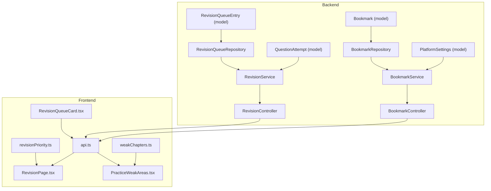
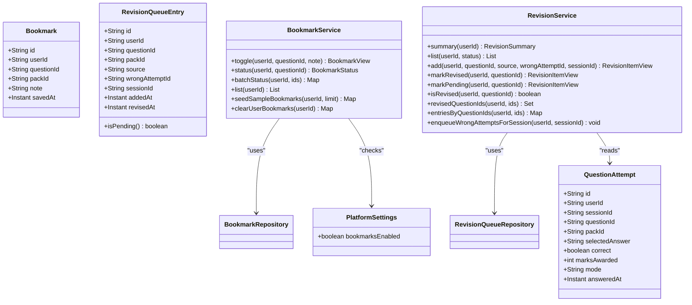
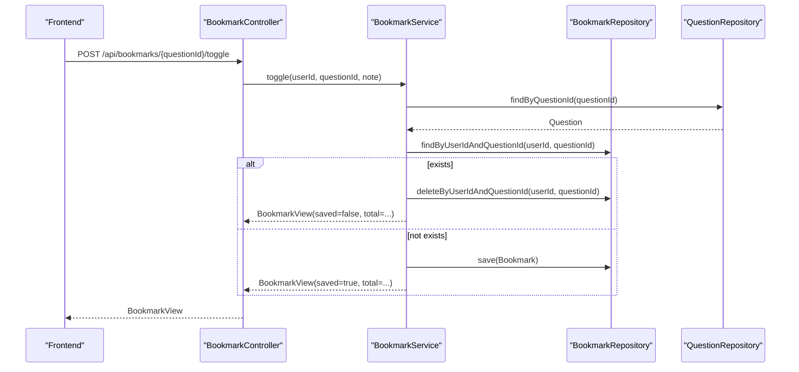
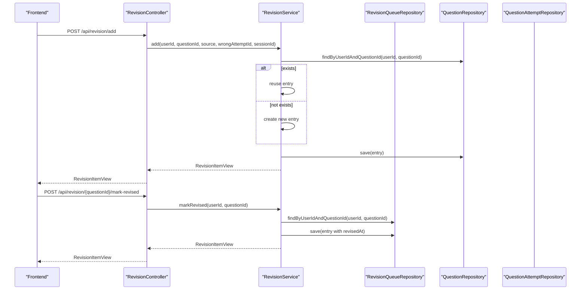
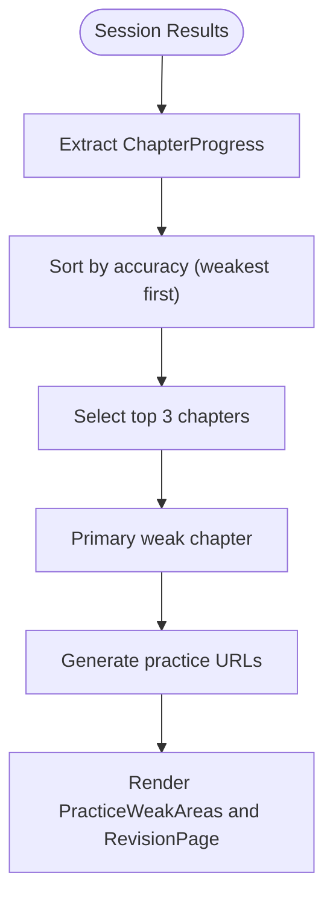
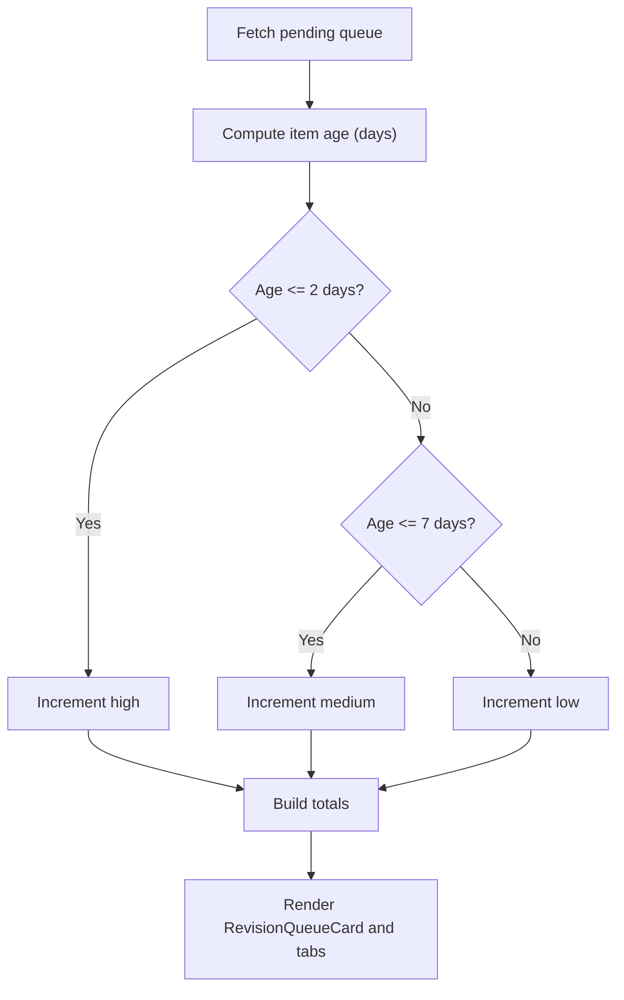
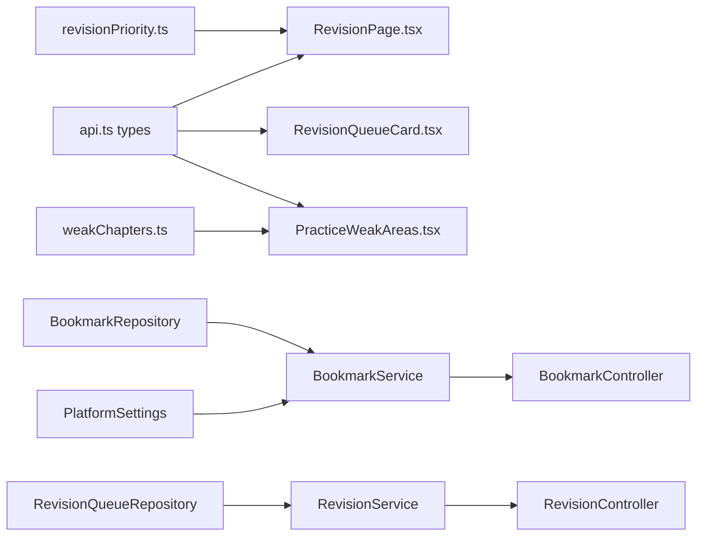

# Bookmark and Revision System

<cite>
**Referenced Files in This Document**
- [Bookmark.java](file://backend/src/main/java/com/neetlu/examhunt/model/Bookmark.java)
- [RevisionQueueEntry.java](file://backend/src/main/java/com/neetlu/examhunt/model/RevisionQueueEntry.java)
- [QuestionAttempt.java](file://backend/src/main/java/com/neetlu/examhunt/model/QuestionAttempt.java)
- [PlatformSettings.java](file://backend/src/main/java/com/neetlu/examhunt/model/PlatformSettings.java)
- [BookmarkService.java](file://backend/src/main/java/com/neetlu/examhunt/service/BookmarkService.java)
- [RevisionService.java](file://backend/src/main/java/com/neetlu/examhunt/service/RevisionService.java)
- [BookmarkRepository.java](file://backend/src/main/java/com/neetlu/examhunt/repository/BookmarkRepository.java)
- [RevisionQueueRepository.java](file://backend/src/main/java/com/neetlu/examhunt/repository/RevisionQueueRepository.java)
- [BookmarkController.java](file://backend/src/main/java/com/neetlu/examhunt/web/BookmarkController.java)
- [RevisionController.java](file://backend/src/main/java/com/neetlu/examhunt/web/RevisionController.java)
- [revisionPriority.ts](file://frontend/src/utils/revisionPriority.ts)
- [RevisionPage.tsx](file://frontend/src/pages/RevisionPage.tsx)
- [RevisionQueueCard.tsx](file://frontend/src/components/RevisionQueueCard.tsx)
- [api.ts](file://frontend/src/api.ts)
- [weakChapters.ts](file://frontend/src/utils/weakChapters.ts)
- [PracticeWeakAreas.tsx](file://frontend/src/components/PracticeWeakAreas.tsx)
</cite>

## Table of Contents
1. [Introduction](#introduction)
2. [Project Structure](#project-structure)
3. [Core Components](#core-components)
4. [Architecture Overview](#architecture-overview)
5. [Detailed Component Analysis](#detailed-component-analysis)
6. [Dependency Analysis](#dependency-analysis)
7. [Performance Considerations](#performance-considerations)
8. [Troubleshooting Guide](#troubleshooting-guide)
9. [Conclusion](#conclusion)
10. [Appendices](#appendices)

## Introduction
This document explains the bookmark and revision tracking system used by learners to manage study materials and reinforce weak areas. It covers:
- Bookmark management: creation, organization, and retrieval
- Revision queue implementation: automatic and manual queuing, status tracking, and prioritization
- Study progress tracking: weak area identification and dashboard visualization
- Practical examples and UI integrations for user study habits, scheduling reminders, and performance improvement tracking

## Project Structure
The system spans backend domain models and services, repositories, and controllers, plus frontend utilities and pages that present and act upon the data.

**Diagram sources**
- [Bookmark.java:1-69](file://backend/src/main/java/com/neetlu/examhunt/model/Bookmark.java#L1-L69)
- [RevisionQueueEntry.java:1-99](file://backend/src/main/java/com/neetlu/examhunt/model/RevisionQueueEntry.java#L1-L99)
- [QuestionAttempt.java:1-110](file://backend/src/main/java/com/neetlu/examhunt/model/QuestionAttempt.java#L1-L110)
- [PlatformSettings.java:1-150](file://backend/src/main/java/com/neetlu/examhunt/model/PlatformSettings.java#L1-L150)
- [BookmarkRepository.java:1-22](file://backend/src/main/java/com/neetlu/examhunt/repository/BookmarkRepository.java#L1-L22)
- [RevisionQueueRepository.java:1-22](file://backend/src/main/java/com/neetlu/examhunt/repository/RevisionQueueRepository.java#L1-L22)
- [BookmarkService.java:1-170](file://backend/src/main/java/com/neetlu/examhunt/service/BookmarkService.java#L1-L170)
- [RevisionService.java:1-207](file://backend/src/main/java/com/neetlu/examhunt/service/RevisionService.java#L1-L207)
- [BookmarkController.java:1-62](file://backend/src/main/java/com/neetlu/examhunt/web/BookmarkController.java#L1-L62)
- [RevisionController.java:1-56](file://backend/src/main/java/com/neetlu/examhunt/web/RevisionController.java#L1-L56)
- [revisionPriority.ts:1-26](file://frontend/src/utils/revisionPriority.ts#L1-L26)
- [RevisionPage.tsx:1-204](file://frontend/src/pages/RevisionPage.tsx#L1-L204)
- [RevisionQueueCard.tsx:1-36](file://frontend/src/components/RevisionQueueCard.tsx#L1-L36)
- [api.ts:233-252](file://frontend/src/api.ts#L233-L252)
- [weakChapters.ts:1-38](file://frontend/src/utils/weakChapters.ts#L1-L38)
- [PracticeWeakAreas.tsx:1-52](file://frontend/src/components/PracticeWeakAreas.tsx#L1-L52)

**Section sources**
- [BookmarkController.java:1-62](file://backend/src/main/java/com/neetlu/examhunt/web/BookmarkController.java#L1-L62)
- [RevisionController.java:1-56](file://backend/src/main/java/com/neetlu/examhunt/web/RevisionController.java#L1-L56)
- [BookmarkService.java:1-170](file://backend/src/main/java/com/neetlu/examhunt/service/BookmarkService.java#L1-L170)
- [RevisionService.java:1-207](file://backend/src/main/java/com/neetlu/examhunt/service/RevisionService.java#L1-L207)
- [BookmarkRepository.java:1-22](file://backend/src/main/java/com/neetlu/examhunt/repository/BookmarkRepository.java#L1-L22)
- [RevisionQueueRepository.java:1-22](file://backend/src/main/java/com/neetlu/examhunt/repository/RevisionQueueRepository.java#L1-L22)
- [Bookmark.java:1-69](file://backend/src/main/java/com/neetlu/examhunt/model/Bookmark.java#L1-L69)
- [RevisionQueueEntry.java:1-99](file://backend/src/main/java/com/neetlu/examhunt/model/RevisionQueueEntry.java#L1-L99)
- [QuestionAttempt.java:1-110](file://backend/src/main/java/com/neetlu/examhunt/model/QuestionAttempt.java#L1-L110)
- [PlatformSettings.java:1-150](file://backend/src/main/java/com/neetlu/examhunt/model/PlatformSettings.java#L1-L150)
- [revisionPriority.ts:1-26](file://frontend/src/utils/revisionPriority.ts#L1-L26)
- [RevisionPage.tsx:1-204](file://frontend/src/pages/RevisionPage.tsx#L1-L204)
- [RevisionQueueCard.tsx:1-36](file://frontend/src/components/RevisionQueueCard.tsx#L1-L36)
- [api.ts:233-252](file://frontend/src/api.ts#L233-L252)
- [weakChapters.ts:1-38](file://frontend/src/utils/weakChapters.ts#L1-L38)
- [PracticeWeakAreas.tsx:1-52](file://frontend/src/components/PracticeWeakAreas.tsx#L1-L52)

## Core Components
- Bookmark model and service: store per-user question bookmarks with optional notes and pack associations, support toggling, batch status checks, listing, and seeding.
- Revision queue model and service: maintain pending/revised items derived from wrong answers or manual additions, with source attribution and session linkage.
- Controllers: expose REST endpoints for bookmarks and revision queue operations.
- Frontend utilities: compute revision priority buckets, render queue cards, and integrate with the revision page and weak areas features.

**Section sources**
- [Bookmark.java:1-69](file://backend/src/main/java/com/neetlu/examhunt/model/Bookmark.java#L1-L69)
- [BookmarkService.java:1-170](file://backend/src/main/java/com/neetlu/examhunt/service/BookmarkService.java#L1-L170)
- [BookmarkController.java:1-62](file://backend/src/main/java/com/neetlu/examhunt/web/BookmarkController.java#L1-L62)
- [RevisionQueueEntry.java:1-99](file://backend/src/main/java/com/neetlu/examhunt/model/RevisionQueueEntry.java#L1-L99)
- [RevisionService.java:1-207](file://backend/src/main/java/com/neetlu/examhunt/service/RevisionService.java#L1-L207)
- [RevisionController.java:1-56](file://backend/src/main/java/com/neetlu/examhunt/web/RevisionController.java#L1-L56)
- [revisionPriority.ts:1-26](file://frontend/src/utils/revisionPriority.ts#L1-L26)
- [RevisionPage.tsx:1-204](file://frontend/src/pages/RevisionPage.tsx#L1-L204)
- [RevisionQueueCard.tsx:1-36](file://frontend/src/components/RevisionQueueCard.tsx#L1-L36)

## Architecture Overview
The system follows a layered architecture:
- Data models define persisted entities with compound indexes for fast lookups.
- Repositories encapsulate MongoDB queries.
- Services orchestrate business logic, enforce platform settings, and coordinate cross-entity operations.
- Controllers expose endpoints secured via authentication principals.
- Frontend pages and utilities consume the APIs to present dashboards and drive user actions.

**Diagram sources**
- [Bookmark.java:1-69](file://backend/src/main/java/com/neetlu/examhunt/model/Bookmark.java#L1-L69)
- [RevisionQueueEntry.java:1-99](file://backend/src/main/java/com/neetlu/examhunt/model/RevisionQueueEntry.java#L1-L99)
- [QuestionAttempt.java:1-110](file://backend/src/main/java/com/neetlu/examhunt/model/QuestionAttempt.java#L1-L110)
- [PlatformSettings.java:1-150](file://backend/src/main/java/com/neetlu/examhunt/model/PlatformSettings.java#L1-L150)
- [BookmarkRepository.java:1-22](file://backend/src/main/java/com/neetlu/examhunt/repository/BookmarkRepository.java#L1-L22)
- [RevisionQueueRepository.java:1-22](file://backend/src/main/java/com/neetlu/examhunt/repository/RevisionQueueRepository.java#L1-L22)
- [BookmarkService.java:1-170](file://backend/src/main/java/com/neetlu/examhunt/service/BookmarkService.java#L1-L170)
- [RevisionService.java:1-207](file://backend/src/main/java/com/neetlu/examhunt/service/RevisionService.java#L1-L207)

## Detailed Component Analysis

### Bookmark Management
- Creation and toggling: Users can toggle a bookmark for a question; if present, it is removed; otherwise, it is created with pack association and optional note.
- Batch status: Efficiently checks bookmark presence for many questions in a single round-trip.
- Listing: Returns bookmarked items enriched with question metadata for display.
- Seed/clear: Helpers for demo and cleanup scenarios.

**Diagram sources**
- [BookmarkController.java:51-58](file://backend/src/main/java/com/neetlu/examhunt/web/BookmarkController.java#L51-L58)
- [BookmarkService.java:36-56](file://backend/src/main/java/com/neetlu/examhunt/service/BookmarkService.java#L36-L56)
- [BookmarkRepository.java:12-20](file://backend/src/main/java/com/neetlu/examhunt/repository/BookmarkRepository.java#L12-L20)
- [Bookmark.java:1-69](file://backend/src/main/java/com/neetlu/examhunt/model/Bookmark.java#L1-L69)

**Section sources**
- [BookmarkController.java:27-58](file://backend/src/main/java/com/neetlu/examhunt/web/BookmarkController.java#L27-L58)
- [BookmarkService.java:36-139](file://backend/src/main/java/com/neetlu/examhunt/service/BookmarkService.java#L36-L139)
- [BookmarkRepository.java:10-21](file://backend/src/main/java/com/neetlu/examhunt/repository/BookmarkRepository.java#L10-L21)
- [Bookmark.java:1-69](file://backend/src/main/java/com/neetlu/examhunt/model/Bookmark.java#L1-L69)

### Revision Queue Implementation
- Automatic queuing: Wrong answers from sessions are enqueued with source "wrong" and linked attempt/session IDs.
- Manual queuing: Items can be added manually with configurable source and linkage.
- Status tracking: Pending vs revised with timestamps; supports flipping status.
- Listing and summaries: Paginated views by status with question enrichment.

**Diagram sources**
- [RevisionController.java:35-52](file://backend/src/main/java/com/neetlu/examhunt/web/RevisionController.java#L35-L52)
- [RevisionService.java:63-106](file://backend/src/main/java/com/neetlu/examhunt/service/RevisionService.java#L63-L106)
- [RevisionQueueRepository.java:9-21](file://backend/src/main/java/com/neetlu/examhunt/repository/RevisionQueueRepository.java#L9-L21)
- [RevisionQueueEntry.java:1-99](file://backend/src/main/java/com/neetlu/examhunt/model/RevisionQueueEntry.java#L1-L99)

**Section sources**
- [RevisionController.java:24-52](file://backend/src/main/java/com/neetlu/examhunt/web/RevisionController.java#L24-L52)
- [RevisionService.java:35-171](file://backend/src/main/java/com/neetlu/examhunt/service/RevisionService.java#L35-L171)
- [RevisionQueueRepository.java:9-21](file://backend/src/main/java/com/neetlu/examhunt/repository/RevisionQueueRepository.java#L9-L21)
- [RevisionQueueEntry.java:1-99](file://backend/src/main/java/com/neetlu/examhunt/model/RevisionQueueEntry.java#L1-L99)
- [QuestionAttempt.java:1-110](file://backend/src/main/java/com/neetlu/examhunt/model/QuestionAttempt.java#L1-L110)

### Study Progress Tracking and Weak Area Identification
- Weak chapters: Derived from session breakdowns and exposed as ChapterProgress for UI consumption.
- Primary weak chapter helpers: Utilities to select and link to targeted practice.
- Dashboard integration: Weak areas card and revision page tabs.

**Diagram sources**
- [weakChapters.ts:1-38](file://frontend/src/utils/weakChapters.ts#L1-L38)
- [PracticeWeakAreas.tsx:1-52](file://frontend/src/components/PracticeWeakAreas.tsx#L1-L52)
- [RevisionPage.tsx:1-204](file://frontend/src/pages/RevisionPage.tsx#L1-L204)

**Section sources**
- [weakChapters.ts:1-38](file://frontend/src/utils/weakChapters.ts#L1-L38)
- [PracticeWeakAreas.tsx:1-52](file://frontend/src/components/PracticeWeakAreas.tsx#L1-L52)
- [RevisionPage.tsx:1-204](file://frontend/src/pages/RevisionPage.tsx#L1-L204)

### Revision Priority and Dashboard Visualization
- Priority breakdown: Categorizes pending revision items by recency (high/medium/low) for quick triage.
- Revision queue card: Prominent widget showing pending count and CTA to review.

**Diagram sources**
- [revisionPriority.ts:10-25](file://frontend/src/utils/revisionPriority.ts#L10-L25)
- [RevisionQueueCard.tsx:6-35](file://frontend/src/components/RevisionQueueCard.tsx#L6-L35)
- [RevisionPage.tsx:20-118](file://frontend/src/pages/RevisionPage.tsx#L20-L118)

**Section sources**
- [revisionPriority.ts:1-26](file://frontend/src/utils/revisionPriority.ts#L1-L26)
- [RevisionQueueCard.tsx:1-36](file://frontend/src/components/RevisionQueueCard.tsx#L1-L36)
- [RevisionPage.tsx:1-204](file://frontend/src/pages/RevisionPage.tsx#L1-L204)

## Dependency Analysis
- Backend dependencies:
  - Services depend on repositories and shared settings.
  - Controllers depend on services.
  - Models define compound indexes for efficient lookups.
- Frontend dependencies:
  - Pages depend on API utilities and shared types.
  - Utilities depend on typed API responses.

**Diagram sources**
- [api.ts:233-252](file://frontend/src/api.ts#L233-L252)
- [RevisionPage.tsx:1-204](file://frontend/src/pages/RevisionPage.tsx#L1-L204)
- [RevisionQueueCard.tsx:1-36](file://frontend/src/components/RevisionQueueCard.tsx#L1-L36)
- [PracticeWeakAreas.tsx:1-52](file://frontend/src/components/PracticeWeakAreas.tsx#L1-L52)
- [revisionPriority.ts:1-26](file://frontend/src/utils/revisionPriority.ts#L1-L26)
- [weakChapters.ts:1-38](file://frontend/src/utils/weakChapters.ts#L1-L38)
- [BookmarkService.java:1-170](file://backend/src/main/java/com/neetlu/examhunt/service/BookmarkService.java#L1-L170)
- [RevisionService.java:1-207](file://backend/src/main/java/com/neetlu/examhunt/service/RevisionService.java#L1-L207)
- [BookmarkRepository.java:1-22](file://backend/src/main/java/com/neetlu/examhunt/repository/BookmarkRepository.java#L1-L22)
- [RevisionQueueRepository.java:1-22](file://backend/src/main/java/com/neetlu/examhunt/repository/RevisionQueueRepository.java#L1-L22)
- [PlatformSettings.java:1-150](file://backend/src/main/java/com/neetlu/examhunt/model/PlatformSettings.java#L1-L150)

**Section sources**
- [BookmarkService.java:1-170](file://backend/src/main/java/com/neetlu/examhunt/service/BookmarkService.java#L1-L170)
- [RevisionService.java:1-207](file://backend/src/main/java/com/neetlu/examhunt/service/RevisionService.java#L1-L207)
- [BookmarkRepository.java:1-22](file://backend/src/main/java/com/neetlu/examhunt/repository/BookmarkRepository.java#L1-L22)
- [RevisionQueueRepository.java:1-22](file://backend/src/main/java/com/neetlu/examhunt/repository/RevisionQueueRepository.java#L1-L22)
- [PlatformSettings.java:1-150](file://backend/src/main/java/com/neetlu/examhunt/model/PlatformSettings.java#L1-L150)
- [api.ts:233-252](file://frontend/src/api.ts#L233-L252)

## Performance Considerations
- Batch operations: The bookmark service batches status checks to reduce round-trips.
- Compound indexes: Models use compound indexes on (userId, questionId) for fast lookups.
- Pagination and limits: Batch status is capped to prevent excessive loads.
- Frontend caching: Short-lived GET cache reduces redundant network requests.

Recommendations:
- Monitor query plans on compound indexes for high-volume users.
- Consider pagination for large revision queues.
- Debounce frequent UI updates to reduce re-renders.

**Section sources**
- [BookmarkService.java:68-90](file://backend/src/main/java/com/neetlu/examhunt/service/BookmarkService.java#L68-L90)
- [Bookmark.java](file://backend/src/main/java/com/neetlu/examhunt/model/Bookmark.java#L10)
- [RevisionQueueEntry.java](file://backend/src/main/java/com/neetlu/examhunt/model/RevisionQueueEntry.java#L9)
- [api.ts:485-501](file://frontend/src/api.ts#L485-L501)

## Troubleshooting Guide
Common issues and resolutions:
- Bookmarks disabled: Operations throw forbidden errors when platform settings disable bookmarks.
- Not found errors: Adding to revision or marking revised throws not-found when the question or queue entry does not exist.
- Network timeouts: Frontend surfaces explicit timeout messages and suggests retrying after backend startup.

Actions:
- Verify platform settings for bookmarks enablement.
- Confirm question existence before adding to revision.
- Retry after backend warm-up if encountering timeouts.

**Section sources**
- [BookmarkService.java:147-151](file://backend/src/main/java/com/neetlu/examhunt/service/BookmarkService.java#L147-L151)
- [RevisionService.java:64-65](file://backend/src/main/java/com/neetlu/examhunt/service/RevisionService.java#L64-L65)
- [RevisionService.java:87-89](file://backend/src/main/java/com/neetlu/examhunt/service/RevisionService.java#L87-L89)
- [api.ts:446-462](file://frontend/src/api.ts#L446-L462)

## Conclusion
The bookmark and revision system provides a robust foundation for learner self-management:
- Bookmarks offer quick access to curated content with batch operations and clean UI integration.
- The revision queue automates reinforcement from mistakes while allowing manual curation and flexible prioritization.
- Weak area insights and dashboard widgets guide focused study and improve retention.
Together, these components support effective study habits, intelligent scheduling, and measurable performance improvements.

## Appendices

### API Reference Summary
- Bookmarks
  - GET /api/bookmarks – list user bookmarks
  - GET /api/bookmarks/batch-status – batch status for question IDs
  - GET /api/bookmarks/{questionId}/status – single status
  - POST /api/bookmarks/{questionId}/toggle – toggle bookmark
- Revision
  - GET /api/revision/summary – pending/revised counts
  - GET /api/revision/queue?status=pending|revised|all – queue items
  - POST /api/revision/add – add to queue
  - POST /api/revision/{questionId}/mark-revised – mark as revised
  - POST /api/revision/{questionId}/mark-pending – mark pending again

**Section sources**
- [BookmarkController.java:27-58](file://backend/src/main/java/com/neetlu/examhunt/web/BookmarkController.java#L27-L58)
- [RevisionController.java:24-52](file://backend/src/main/java/com/neetlu/examhunt/web/RevisionController.java#L24-L52)
- [api.ts:233-252](file://frontend/src/api.ts#L233-L252)