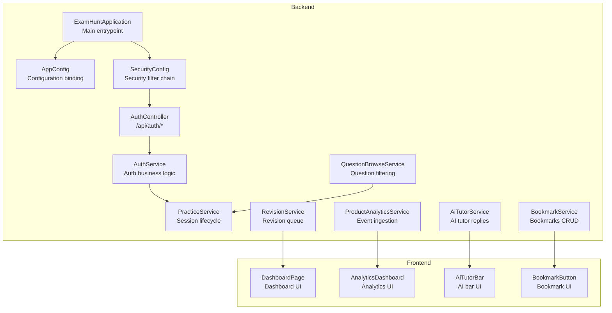
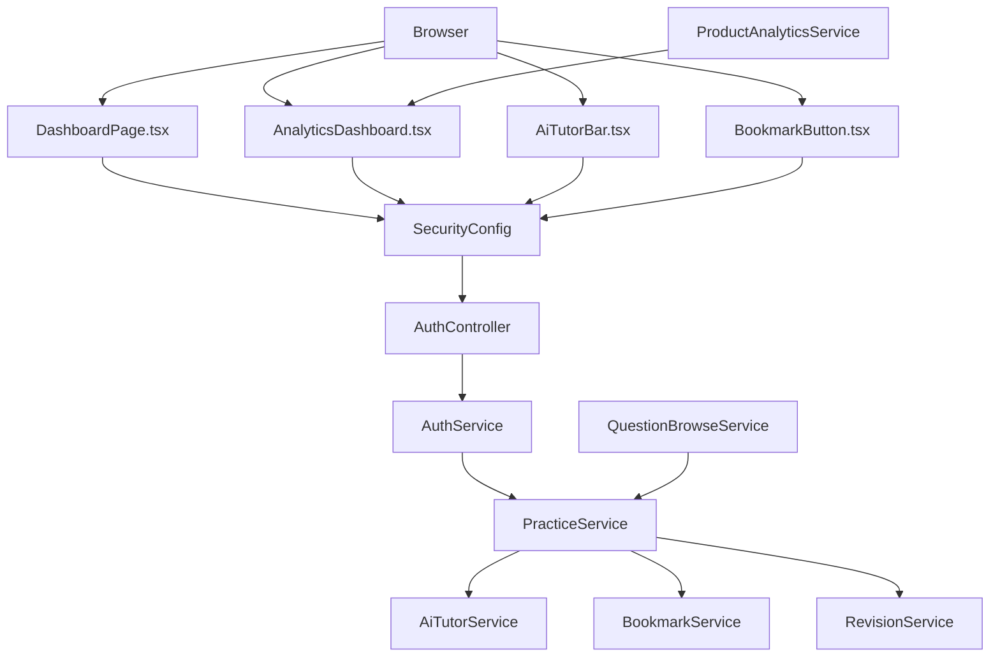
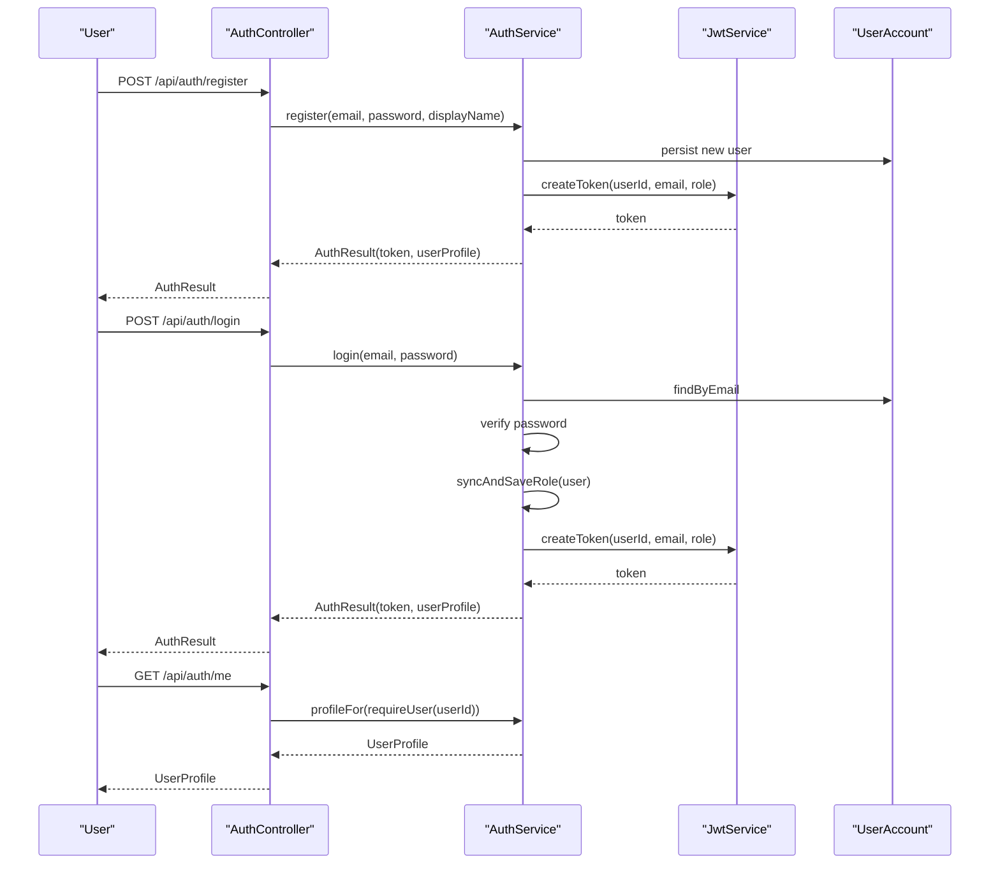
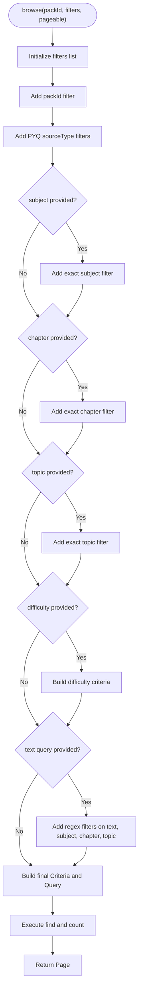
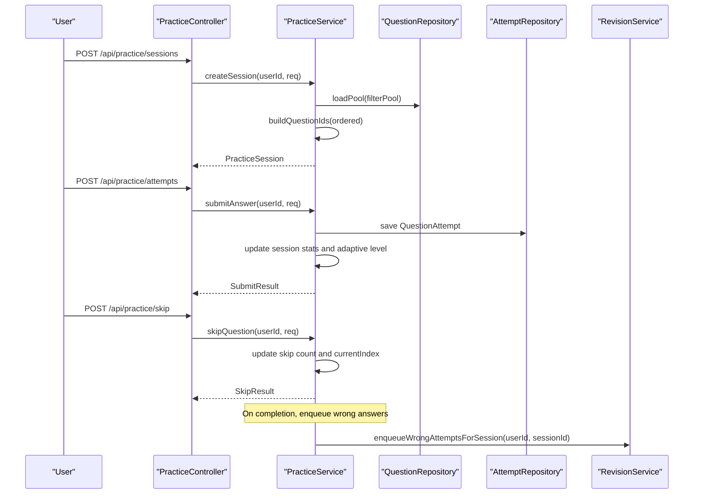
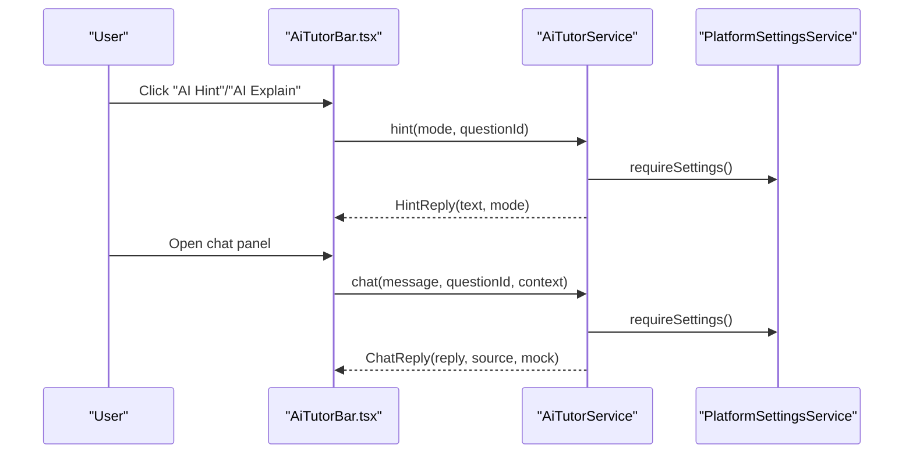
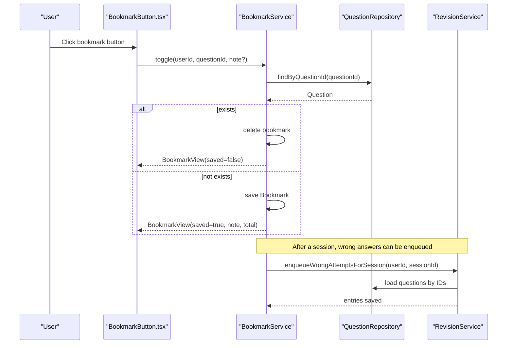
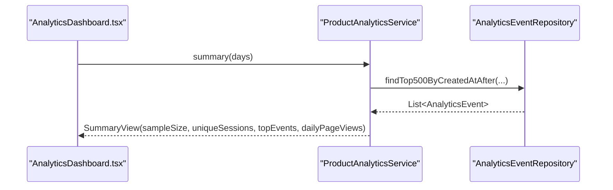
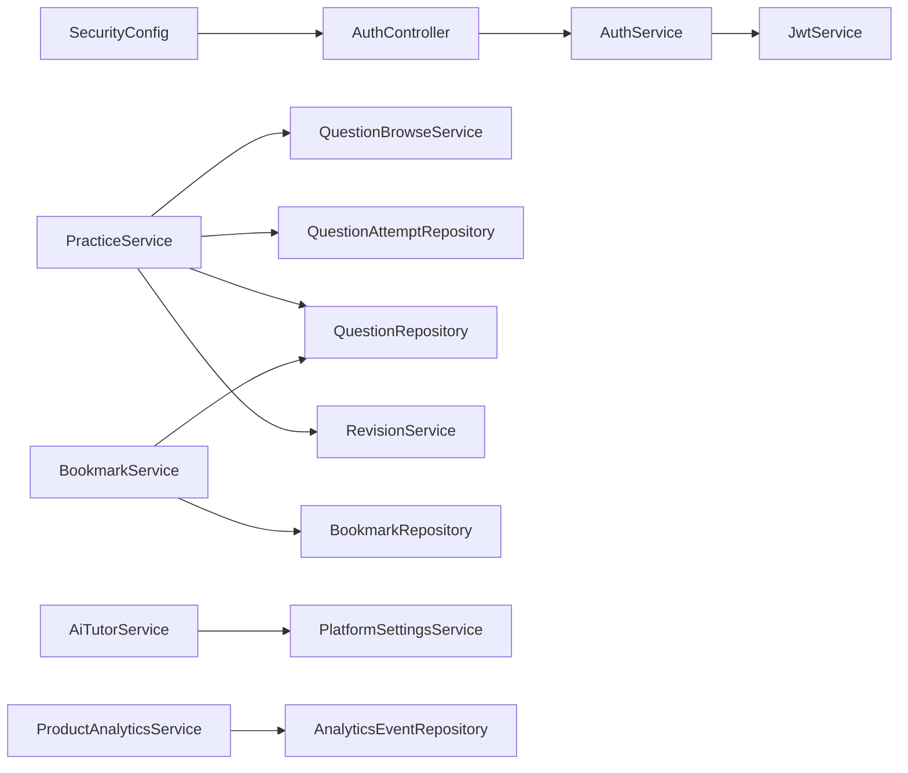

# Core Features Implementation

<cite>
**Referenced Files in This Document**
- [ExamHuntApplication.java](file://backend/src/main/java/com/neetlu/examhunt/ExamHuntApplication.java)
- [AppConfig.java](file://backend/src/main/java/com/neetlu/examhunt/config/AppConfig.java)
- [SecurityConfig.java](file://backend/src/main/java/com/neetlu/examhunt/config/SecurityConfig.java)
- [AuthService.java](file://backend/src/main/java/com/neetlu/examhunt/service/AuthService.java)
- [AuthController.java](file://backend/src/main/java/com/neetlu/examhunt/web/AuthController.java)
- [QuestionBrowseService.java](file://backend/src/main/java/com/neetlu/examhunt/service/QuestionBrowseService.java)
- [PracticeService.java](file://backend/src/main/java/com/neetlu/examhunt/service/PracticeService.java)
- [AiTutorService.java](file://backend/src/main/java/com/neetlu/examhunt/service/AiTutorService.java)
- [BookmarkService.java](file://backend/src/main/java/com/neetlu/examhunt/service/BookmarkService.java)
- [RevisionService.java](file://backend/src/main/java/com/neetlu/examhunt/service/RevisionService.java)
- [ProductAnalyticsService.java](file://backend/src/main/java/com/neetlu/examhunt/service/ProductAnalyticsService.java)
- [AnalyticsDashboard.tsx](file://frontend/src/components/AnalyticsDashboard.tsx)
- [AiTutorBar.tsx](file://frontend/src/components/AiTutorBar.tsx)
- [BookmarkButton.tsx](file://frontend/src/components/BookmarkButton.tsx)
- [DashboardPage.tsx](file://frontend/src/pages/DashboardPage.tsx)
</cite>

## Table of Contents
1. [Introduction](#introduction)
2. [Project Structure](#project-structure)
3. [Core Components](#core-components)
4. [Architecture Overview](#architecture-overview)
5. [Detailed Component Analysis](#detailed-component-analysis)
6. [Dependency Analysis](#dependency-analysis)
7. [Performance Considerations](#performance-considerations)
8. [Troubleshooting Guide](#troubleshooting-guide)
9. [Conclusion](#conclusion)

## Introduction
This document explains the core feature implementations in the exam-hunt platform, focusing on:
- User authentication system
- Question bank management
- Adaptive practice system
- AI-powered learning assistant
- Bookmark and revision system
- Analytics dashboard

It documents how each feature is implemented, how they integrate with backend services and frontend components, configuration options, business logic, usage patterns, and how features interrelate to deliver a cohesive learning experience.

## Project Structure
The platform consists of:
- Backend: Spring Boot application with REST controllers, domain services, repositories, and security configuration
- Frontend: React-based UI with TypeScript, organized into pages, components, utilities, and contexts

**Diagram sources**
- [ExamHuntApplication.java:1-16](file://backend/src/main/java/com/neetlu/examhunt/ExamHuntApplication.java#L1-L16)
- [AppConfig.java:1-9](file://backend/src/main/java/com/neetlu/examhunt/config/AppConfig.java#L1-L9)
- [SecurityConfig.java:1-76](file://backend/src/main/java/com/neetlu/examhunt/config/SecurityConfig.java#L1-L76)
- [AuthController.java:1-45](file://backend/src/main/java/com/neetlu/examhunt/web/AuthController.java#L1-L45)
- [AuthService.java:1-106](file://backend/src/main/java/com/neetlu/examhunt/service/AuthService.java#L1-L106)
- [QuestionBrowseService.java:1-102](file://backend/src/main/java/com/neetlu/examhunt/service/QuestionBrowseService.java#L1-L102)
- [PracticeService.java:1-800](file://backend/src/main/java/com/neetlu/examhunt/service/PracticeService.java#L1-L800)
- [AiTutorService.java:1-84](file://backend/src/main/java/com/neetlu/examhunt/service/AiTutorService.java#L1-L84)
- [BookmarkService.java:1-170](file://backend/src/main/java/com/neetlu/examhunt/service/BookmarkService.java#L1-L170)
- [RevisionService.java:1-207](file://backend/src/main/java/com/neetlu/examhunt/service/RevisionService.java#L1-L207)
- [ProductAnalyticsService.java:1-154](file://backend/src/main/java/com/neetlu/examhunt/service/ProductAnalyticsService.java#L1-L154)
- [DashboardPage.tsx:1-178](file://frontend/src/pages/DashboardPage.tsx#L1-L178)
- [AnalyticsDashboard.tsx:1-433](file://frontend/src/components/AnalyticsDashboard.tsx#L1-L433)
- [AiTutorBar.tsx:1-95](file://frontend/src/components/AiTutorBar.tsx#L1-L95)
- [BookmarkButton.tsx:1-119](file://frontend/src/components/BookmarkButton.tsx#L1-L119)

**Section sources**
- [ExamHuntApplication.java:1-16](file://backend/src/main/java/com/neetlu/examhunt/ExamHuntApplication.java#L1-L16)
- [AppConfig.java:1-9](file://backend/src/main/java/com/neetlu/examhunt/config/AppConfig.java#L1-L9)
- [SecurityConfig.java:1-76](file://backend/src/main/java/com/neetlu/examhunt/config/SecurityConfig.java#L1-L76)

## Core Components
This section outlines the core features and their responsibilities.

- Authentication system
  - Handles registration, login, JWT issuance, and user profile retrieval
  - Enforces role synchronization and admin authorization
- Question bank management
  - Filters and paginates questions by pack, subject, chapter, topic, difficulty, and text search
- Adaptive practice system
  - Creates practice/test sessions, tracks progress, enforces adaptive difficulty, records attempts, and computes analytics
- AI-powered learning assistant
  - Provides keyword-driven mock chat replies and hints; gated by platform settings
- Bookmark and revision system
  - Manages user bookmarks, batch status checks, and revision queue with manual and automated enqueue
- Analytics dashboard
  - Aggregates product analytics events and renders performance insights, trends, and recommendations

**Section sources**
- [AuthService.java:1-106](file://backend/src/main/java/com/neetlu/examhunt/service/AuthService.java#L1-L106)
- [AuthController.java:1-45](file://backend/src/main/java/com/neetlu/examhunt/web/AuthController.java#L1-L45)
- [QuestionBrowseService.java:1-102](file://backend/src/main/java/com/neetlu/examhunt/service/QuestionBrowseService.java#L1-L102)
- [PracticeService.java:1-800](file://backend/src/main/java/com/neetlu/examhunt/service/PracticeService.java#L1-L800)
- [AiTutorService.java:1-84](file://backend/src/main/java/com/neetlu/examhunt/service/AiTutorService.java#L1-L84)
- [BookmarkService.java:1-170](file://backend/src/main/java/com/neetlu/examhunt/service/BookmarkService.java#L1-L170)
- [RevisionService.java:1-207](file://backend/src/main/java/com/neetlu/examhunt/service/RevisionService.java#L1-L207)
- [ProductAnalyticsService.java:1-154](file://backend/src/main/java/com/neetlu/examhunt/service/ProductAnalyticsService.java#L1-L154)

## Architecture Overview
The backend follows a layered architecture:
- Controllers expose REST endpoints
- Services encapsulate business logic
- Repositories manage persistence
- Security configuration enforces authentication and authorization
- Frontend consumes APIs and renders UI

**Diagram sources**
- [SecurityConfig.java:42-74](file://backend/src/main/java/com/neetlu/examhunt/config/SecurityConfig.java#L42-L74)
- [AuthController.java:14-36](file://backend/src/main/java/com/neetlu/examhunt/web/AuthController.java#L14-L36)
- [AuthService.java:12-29](file://backend/src/main/java/com/neetlu/examhunt/service/AuthService.java#L12-L29)
- [QuestionBrowseService.java:17-23](file://backend/src/main/java/com/neetlu/examhunt/service/QuestionBrowseService.java#L17-L23)
- [PracticeService.java:27-58](file://backend/src/main/java/com/neetlu/examhunt/service/PracticeService.java#L27-L58)
- [AiTutorService.java:12-18](file://backend/src/main/java/com/neetlu/examhunt/service/AiTutorService.java#L12-L18)
- [BookmarkService.java:21-34](file://backend/src/main/java/com/neetlu/examhunt/service/BookmarkService.java#L21-L34)
- [RevisionService.java:19-33](file://backend/src/main/java/com/neetlu/examhunt/service/RevisionService.java#L19-L33)
- [ProductAnalyticsService.java:20-34](file://backend/src/main/java/com/neetlu/examhunt/service/ProductAnalyticsService.java#L20-L34)

## Detailed Component Analysis

### User Authentication System
The authentication system manages user registration, login, JWT issuance, and profile retrieval. It ensures secure stateless sessions via JWT and synchronizes user roles with administrative authorization.

**Diagram sources**
- [AuthController.java:23-36](file://backend/src/main/java/com/neetlu/examhunt/web/AuthController.java#L23-L36)
- [AuthService.java:31-88](file://backend/src/main/java/com/neetlu/examhunt/service/AuthService.java#L31-L88)

Key implementation details:
- Password encoding with BCrypt
- Role synchronization with admin authorization
- Stateless JWT-based authentication enforced by security filter chain
- Email normalization and validation

Usage patterns:
- Registration requires non-blank email and minimum password length
- Login validates credentials and returns token and profile
- Protected routes require authentication; admin endpoints require ADMIN role

Common challenges and solutions:
- Duplicate email registration handled with conflict response
- Invalid credentials return unauthorized
- Role changes are synchronized and persisted

**Section sources**
- [AuthService.java:1-106](file://backend/src/main/java/com/neetlu/examhunt/service/AuthService.java#L1-L106)
- [AuthController.java:1-45](file://backend/src/main/java/com/neetlu/examhunt/web/AuthController.java#L1-L45)
- [SecurityConfig.java:27-74](file://backend/src/main/java/com/neetlu/examhunt/config/SecurityConfig.java#L27-L74)

### Question Bank Management
The question bank service enables browsing questions with flexible filters and pagination. It supports pack-scoped queries, exact and regex matching, and difficulty filtering.

**Diagram sources**
- [QuestionBrowseService.java:25-69](file://backend/src/main/java/com/neetlu/examhunt/service/QuestionBrowseService.java#L25-L69)

Business logic highlights:
- Filters are combined with AND/OR operators
- Difficulty accepts comma-separated values (easy, medium, hard)
- Text search uses case-insensitive regex across multiple fields
- PYQ exclusivity filter ensures only PYQs or PYQ+variants are returned

Integration points:
- Used by practice session creation to select questions
- Supports UI bank search and filters

**Section sources**
- [QuestionBrowseService.java:1-102](file://backend/src/main/java/com/neetlu/examhunt/service/QuestionBrowseService.java#L1-L102)

### Adaptive Practice System
The adaptive practice system creates and manages sessions, tracks progress, enforces adaptive difficulty, records attempts, and computes analytics. It distinguishes between practice and test modes and handles retake sessions.

**Diagram sources**
- [PracticeService.java:60-89](file://backend/src/main/java/com/neetlu/examhunt/service/PracticeService.java#L60-L89)
- [PracticeService.java:278-337](file://backend/src/main/java/com/neetlu/examhunt/service/PracticeService.java#L278-L337)
- [PracticeService.java:399-449](file://backend/src/main/java/com/neetlu/examhunt/service/PracticeService.java#L399-L449)
- [PracticeService.java:133-171](file://backend/src/main/java/com/neetlu/examhunt/service/PracticeService.java#L133-L171)

Key implementation details:
- Session creation supports practice and test modes, adaptive difficulty, and question set selection (PYQ, variants, mixed)
- Adaptive level adjusts after each answer; remaining questions are reordered to match target difficulty
- Attempts are validated and scored; marks are zeroed for AI variants in practice mode
- Retake tests filter previous wrong/unanswered/skipped questions
- Completion triggers asynchronous revision queue population

Usage patterns:
- Start a session with filters; navigate questions; submit answers or skip
- Use retake to focus on mistakes
- Toggle mark-for-review in test mode

Common challenges and solutions:
- Stale question IDs resolved by reconciling session progress
- Session expiry handled by engagement timing logic
- Analytics exclusion for AI variant practice drills prevents skew

**Section sources**
- [PracticeService.java:1-800](file://backend/src/main/java/com/neetlu/examhunt/service/PracticeService.java#L1-L800)

### AI-Powered Learning Assistant
The AI tutor provides keyword-driven mock replies and hints. It is gated by platform settings and returns contextual responses tied to the current question.

**Diagram sources**
- [AiTutorBar.tsx:24-36](file://frontend/src/components/AiTutorBar.tsx#L24-L36)
- [AiTutorService.java:42-58](file://backend/src/main/java/com/neetlu/examhunt/service/AiTutorService.java#L42-L58)
- [AiTutorService.java:20-40](file://backend/src/main/java/com/neetlu/examhunt/service/AiTutorService.java#L20-L40)

Business logic highlights:
- Preview mode blocks chat until enabled in platform settings
- Keyword detection triggers predefined replies
- Fallback replies provide generic guidance
- Hints differentiate between "hint" and "explain" modes

UI integration:
- Compact bar with chips for quick hints
- Expandable chat panel for contextual doubts
- Full AI Tutor page link for advanced interactions

**Section sources**
- [AiTutorService.java:1-84](file://backend/src/main/java/com/neetlu/examhunt/service/AiTutorService.java#L1-L84)
- [AiTutorBar.tsx:1-95](file://frontend/src/components/AiTutorBar.tsx#L1-L95)

### Bookmark and Revision System
The bookmark service allows users to save questions for revision, supports batch status checks, and lists bookmarks with enriched question metadata. The revision service maintains a queue of questions to revise, supporting manual and automated enqueue.

**Diagram sources**
- [BookmarkButton.tsx:51-64](file://frontend/src/components/BookmarkButton.tsx#L51-L64)
- [BookmarkService.java:36-56](file://backend/src/main/java/com/neetlu/examhunt/service/BookmarkService.java#L36-L56)
- [BookmarkService.java:133-170](file://backend/src/main/java/com/neetlu/examhunt/service/BookmarkService.java#L133-L170)
- [RevisionService.java:133-171](file://backend/src/main/java/com/neetlu/examhunt/service/RevisionService.java#L133-L171)

Business logic highlights:
- Bookmarks are scoped to packs and include optional notes
- Batch status checks reduce network overhead for list views
- Revision queue supports manual add, mark revised/pending, and bulk queries
- Enqueue respects existing entries and session linkage

UI integration:
- BookmarkButton supports icon/full variants and batch loading
- Dashboard and revision pages consume revision queue summaries and items

**Section sources**
- [BookmarkService.java:1-170](file://backend/src/main/java/com/neetlu/examhunt/service/BookmarkService.java#L1-L170)
- [RevisionService.java:1-207](file://backend/src/main/java/com/neetlu/examhunt/service/RevisionService.java#L1-L207)
- [BookmarkButton.tsx:1-119](file://frontend/src/components/BookmarkButton.tsx#L1-L119)

### Analytics Dashboard
The analytics dashboard aggregates product analytics events and presents performance trends, subject gauges, weak chapters, mistake breakdowns, and recommendations. It integrates with backend services for event ingestion and with frontend utilities for rendering.

**Diagram sources**
- [AnalyticsDashboard.tsx:137-177](file://frontend/src/components/AnalyticsDashboard.tsx#L137-L177)
- [ProductAnalyticsService.java:71-103](file://backend/src/main/java/com/neetlu/examhunt/service/ProductAnalyticsService.java#L71-L103)

Business logic highlights:
- Event ingestion sanitizes names and properties, limits batch size, and persists events
- Summary aggregates counts, unique sessions, top events, and daily page views
- Frontend computes trends, gauges, and insights from progress and stats

UI integration:
- DashboardPage renders quick actions and telemetry nudges
- AnalyticsDashboard displays tabs, charts, and recommendations

**Section sources**
- [ProductAnalyticsService.java:1-154](file://backend/src/main/java/com/neetlu/examhunt/service/ProductAnalyticsService.java#L1-L154)
- [AnalyticsDashboard.tsx:1-433](file://frontend/src/components/AnalyticsDashboard.tsx#L1-L433)
- [DashboardPage.tsx:1-178](file://frontend/src/pages/DashboardPage.tsx#L1-L178)

## Dependency Analysis
The backend wiring ties together configuration, security, controllers, services, and repositories. The frontend composes UI components that call backend APIs.

**Diagram sources**
- [SecurityConfig.java:42-74](file://backend/src/main/java/com/neetlu/examhunt/config/SecurityConfig.java#L42-L74)
- [AuthController.java:19-21](file://backend/src/main/java/com/neetlu/examhunt/web/AuthController.java#L19-L21)
- [AuthService.java:15-28](file://backend/src/main/java/com/neetlu/examhunt/service/AuthService.java#L15-L28)
- [PracticeService.java:35-57](file://backend/src/main/java/com/neetlu/examhunt/service/PracticeService.java#L35-L57)
- [QuestionBrowseService.java:19-22](file://backend/src/main/java/com/neetlu/examhunt/service/QuestionBrowseService.java#L19-L22)
- [BookmarkService.java:23-33](file://backend/src/main/java/com/neetlu/examhunt/service/BookmarkService.java#L23-L33)
- [AiTutorService.java:14-17](file://backend/src/main/java/com/neetlu/examhunt/service/AiTutorService.java#L14-L17)
- [ProductAnalyticsService.java:28-29](file://backend/src/main/java/com/neetlu/examhunt/service/ProductAnalyticsService.java#L28-L29)

**Section sources**
- [SecurityConfig.java:1-76](file://backend/src/main/java/com/neetlu/examhunt/config/SecurityConfig.java#L1-L76)
- [AppConfig.java:6-8](file://backend/src/main/java/com/neetlu/examhunt/config/AppConfig.java#L6-L8)

## Performance Considerations
- Question filtering uses MongoDB queries with indexed fields; avoid excessive regex patterns
- Pagination limits in question browsing prevent large result sets
- Batch event ingestion caps event volume per request
- Frontend caches progress and stats to minimize repeated API calls
- Adaptive reordering operates on remaining questions to maintain responsiveness

## Troubleshooting Guide
Common issues and resolutions:
- Authentication failures
  - Verify email/password correctness; ensure user exists and role is synchronized
  - Check security filter chain permits /api/auth/register and /api/auth/login
- Session errors
  - Ensure session belongs to the requesting user; check for completion/expiry
  - Confirm question IDs exist in the question bank
- AI tutor unavailability
  - Confirm platform settings enable mock AI tutor; otherwise, preview mode is active
- Bookmark errors
  - Ensure bookmarks are enabled; handle batch status limits and empty inputs
- Analytics discrepancies
  - Validate event ingestion constraints (names, properties, sizes); confirm window days bounds

**Section sources**
- [SecurityConfig.java:51-70](file://backend/src/main/java/com/neetlu/examhunt/config/SecurityConfig.java#L51-L70)
- [AuthService.java:52-67](file://backend/src/main/java/com/neetlu/examhunt/service/AuthService.java#L52-L67)
- [PracticeService.java:222-237](file://backend/src/main/java/com/neetlu/examhunt/service/PracticeService.java#L222-L237)
- [AiTutorService.java:20-28](file://backend/src/main/java/com/neetlu/examhunt/service/AiTutorService.java#L20-L28)
- [BookmarkService.java:147-151](file://backend/src/main/java/com/neetlu/examhunt/service/BookmarkService.java#L147-L151)
- [ProductAnalyticsService.java:36-69](file://backend/src/main/java/com/neetlu/examhunt/service/ProductAnalyticsService.java#L36-L69)

## Conclusion
The exam-hunt platform integrates authentication, question management, adaptive practice, AI tutoring, bookmarks, revision queues, and analytics into a cohesive learning experience. The backend services enforce security, manage stateless sessions, and provide robust business logic, while the frontend delivers responsive UI components that connect seamlessly to backend APIs. Together, these features support efficient study workflows, personalized insights, and scalable growth.