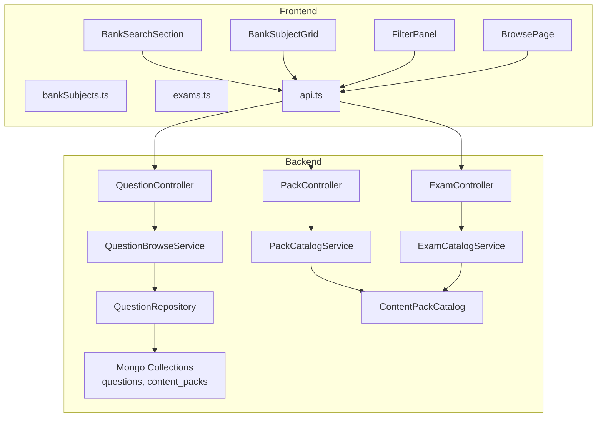
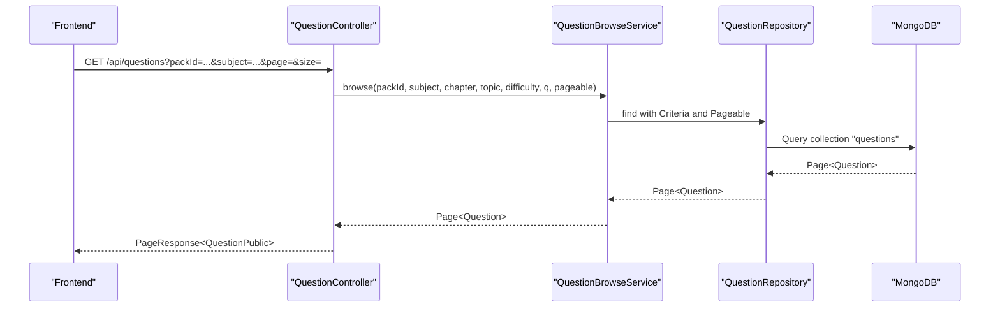
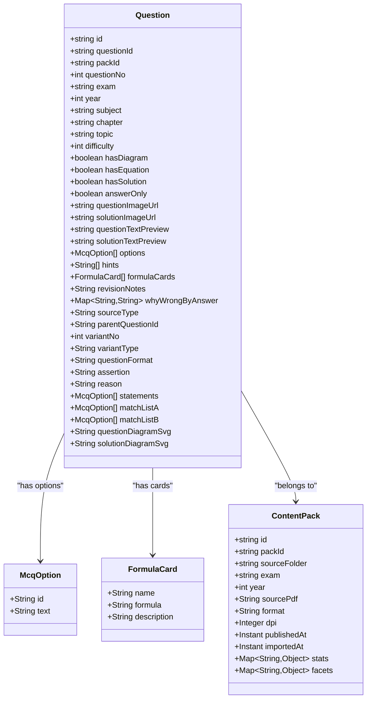
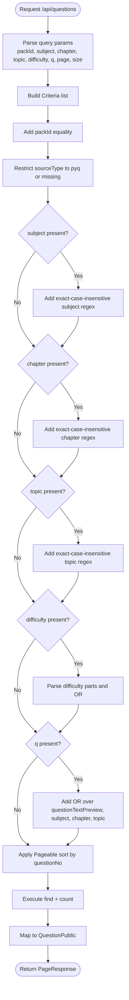
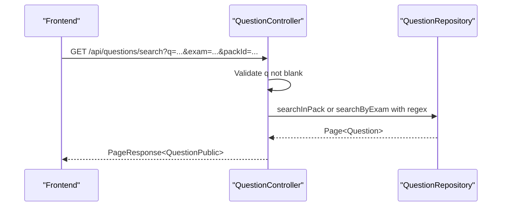
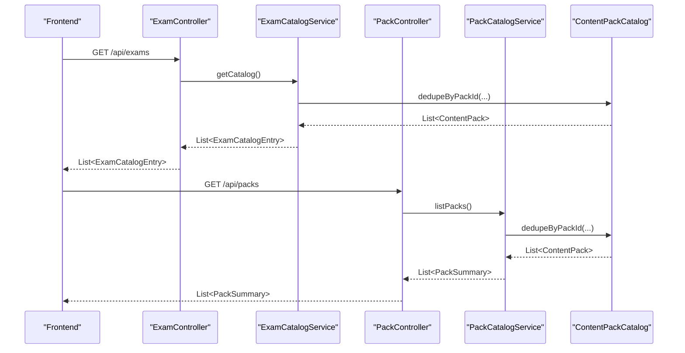
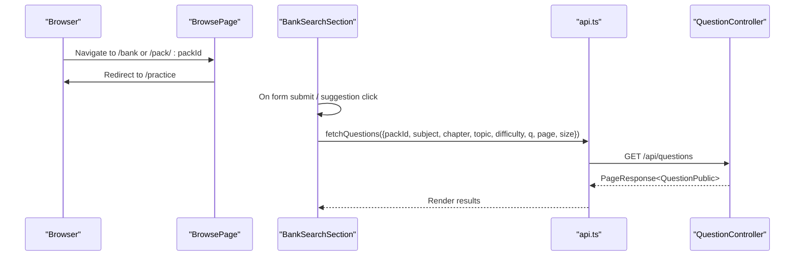
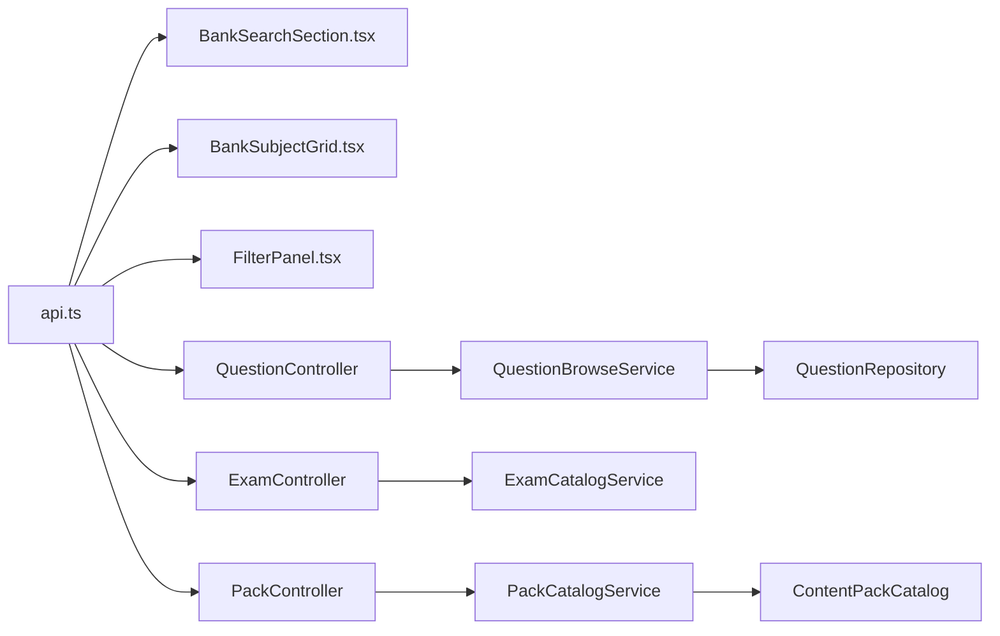

# Question Bank Management

<cite>
**Referenced Files in This Document**
- [ContentPack.java](file://backend/src/main/java/com/neetlu/examhunt/model/ContentPack.java)
- [Question.java](file://backend/src/main/java/com/neetlu/examhunt/model/Question.java)
- [McqOption.java](file://backend/src/main/java/com/neetlu/examhunt/model/McqOption.java)
- [FormulaCard.java](file://backend/src/main/java/com/neetlu/examhunt/model/FormulaCard.java)
- [QuestionBrowseService.java](file://backend/src/main/java/com/neetlu/examhunt/service/QuestionBrowseService.java)
- [QuestionRepository.java](file://backend/src/main/java/com/neetlu/examhunt/repository/QuestionRepository.java)
- [QuestionController.java](file://backend/src/main/java/com/neetlu/examhunt/web/QuestionController.java)
- [ExamCatalogService.java](file://backend/src/main/java/com/neetlu/examhunt/service/ExamCatalogService.java)
- [PackCatalogService.java](file://backend/src/main/java/com/neetlu/examhunt/service/PackCatalogService.java)
- [ContentPackCatalog.java](file://backend/src/main/java/com/neetlu/examhunt/service/ContentPackCatalog.java)
- [PackController.java](file://backend/src/main/java/com/neetlu/examhunt/web/PackController.java)
- [ExamController.java](file://backend/src/main/java/com/neetlu/examhunt/web/ExamController.java)
- [api.ts](file://frontend/src/api.ts)
- [BankSearchSection.tsx](file://frontend/src/components/BankSearchSection.tsx)
- [BankSubjectGrid.tsx](file://frontend/src/components/BankSubjectGrid.tsx)
- [FilterPanel.tsx](file://frontend/src/components/FilterPanel.tsx)
- [BrowsePage.tsx](file://frontend/src/pages/BrowsePage.tsx)
- [bankSubjects.ts](file://frontend/src/utils/bankSubjects.ts)
- [questionFamily.ts](file://frontend/src/utils/questionFamily.ts)
- [exams.ts](file://frontend/src/utils/exams.ts)
</cite>

## Table of Contents
1. [Introduction](#introduction)
2. [Project Structure](#project-structure)
3. [Core Components](#core-components)
4. [Architecture Overview](#architecture-overview)
5. [Detailed Component Analysis](#detailed-component-analysis)
6. [Dependency Analysis](#dependency-analysis)
7. [Performance Considerations](#performance-considerations)
8. [Troubleshooting Guide](#troubleshooting-guide)
9. [Conclusion](#conclusion)
10. [Appendices](#appendices)

## Introduction
This document explains the question bank management system that organizes educational content into exam catalogs and content packs, supports subject and chapter filtering, and exposes robust question browsing and search capabilities. It covers data models for questions and content packs, the exam hierarchy, search and pagination mechanics, and user-facing workflows for content discovery. It also outlines performance optimizations and best practices for large-scale question datasets.

## Project Structure
The system is split into a Spring Boot backend and a React frontend:
- Backend: Models, repositories, services, and controllers for question browsing, exam catalogs, and pack catalogs.
- Frontend: UI components and utilities for search, filtering, and navigation into the question bank.

**Diagram sources**
- [QuestionController.java:25-292](file://backend/src/main/java/com/neetlu/examhunt/web/QuestionController.java#L25-L292)
- [QuestionBrowseService.java:17-102](file://backend/src/main/java/com/neetlu/examhunt/service/QuestionBrowseService.java#L17-L102)
- [QuestionRepository.java:13-104](file://backend/src/main/java/com/neetlu/examhunt/repository/QuestionRepository.java#L13-L104)
- [ExamController.java:14-30](file://backend/src/main/java/com/neetlu/examhunt/web/ExamController.java#L14-L30)
- [ExamCatalogService.java:17-166](file://backend/src/main/java/com/neetlu/examhunt/service/ExamCatalogService.java#L17-L166)
- [PackController.java:21-85](file://backend/src/main/java/com/neetlu/examhunt/web/PackController.java#L21-L85)
- [PackCatalogService.java:14-73](file://backend/src/main/java/com/neetlu/examhunt/service/PackCatalogService.java#L14-L73)
- [ContentPackCatalog.java:13-65](file://backend/src/main/java/com/neetlu/examhunt/service/ContentPackCatalog.java#L13-L65)
- [api.ts:1-800](file://frontend/src/api.ts#L1-L800)
- [BankSearchSection.tsx:11-96](file://frontend/src/components/BankSearchSection.tsx#L11-L96)
- [BankSubjectGrid.tsx:10-40](file://frontend/src/components/BankSubjectGrid.tsx#L10-L40)
- [FilterPanel.tsx:46-276](file://frontend/src/components/FilterPanel.tsx#L46-L276)
- [BrowsePage.tsx:4-13](file://frontend/src/pages/BrowsePage.tsx#L4-L13)

**Section sources**
- [QuestionController.java:25-292](file://backend/src/main/java/com/neetlu/examhunt/web/QuestionController.java#L25-L292)
- [QuestionBrowseService.java:17-102](file://backend/src/main/java/com/neetlu/examhunt/service/QuestionBrowseService.java#L17-L102)
- [QuestionRepository.java:13-104](file://backend/src/main/java/com/neetlu/examhunt/repository/QuestionRepository.java#L13-L104)
- [ExamController.java:14-30](file://backend/src/main/java/com/neetlu/examhunt/web/ExamController.java#L14-L30)
- [ExamCatalogService.java:17-166](file://backend/src/main/java/com/neetlu/examhunt/service/ExamCatalogService.java#L17-L166)
- [PackController.java:21-85](file://backend/src/main/java/com/neetlu/examhunt/web/PackController.java#L21-L85)
- [PackCatalogService.java:14-73](file://backend/src/main/java/com/neetlu/examhunt/service/PackCatalogService.java#L14-L73)
- [ContentPackCatalog.java:13-65](file://backend/src/main/java/com/neetlu/examhunt/service/ContentPackCatalog.java#L13-L65)
- [api.ts:1-800](file://frontend/src/api.ts#L1-L800)
- [BankSearchSection.tsx:11-96](file://frontend/src/components/BankSearchSection.tsx#L11-L96)
- [BankSubjectGrid.tsx:10-40](file://frontend/src/components/BankSubjectGrid.tsx#L10-L40)
- [FilterPanel.tsx:46-276](file://frontend/src/components/FilterPanel.tsx#L46-L276)
- [BrowsePage.tsx:4-13](file://frontend/src/pages/BrowsePage.tsx#L4-L13)

## Core Components
- Data models:
  - Question: Rich question entity with subject/chapter/topic hierarchy, difficulty, variants, and enrichment fields.
  - ContentPack: Logical grouping of questions by exam and year, with metadata and facets.
  - Supporting types: McqOption and FormulaCard for AI variants and formula cards.
- Services:
  - QuestionBrowseService: Builds dynamic queries for pack-scoped browsing and global search.
  - ExamCatalogService: Provides curated exam/year catalogs with availability and counts.
  - PackCatalogService: Lists packs with deduplication and facet-driven summaries.
  - ContentPackCatalog: Deduplicates packs by packId and selects canonical rows.
- Controllers:
  - QuestionController: Exposes list/search endpoints and question family retrieval.
  - ExamController: Returns exam catalog with caching.
  - PackController: Returns pack lists and details with facets and counts.

**Section sources**
- [Question.java:15-413](file://backend/src/main/java/com/neetlu/examhunt/model/Question.java#L15-L413)
- [ContentPack.java:12-127](file://backend/src/main/java/com/neetlu/examhunt/model/ContentPack.java#L12-L127)
- [McqOption.java:4-25](file://backend/src/main/java/com/neetlu/examhunt/model/McqOption.java#L4-L25)
- [FormulaCard.java:4-34](file://backend/src/main/java/com/neetlu/examhunt/model/FormulaCard.java#L4-L34)
- [QuestionBrowseService.java:17-102](file://backend/src/main/java/com/neetlu/examhunt/service/QuestionBrowseService.java#L17-L102)
- [ExamCatalogService.java:17-166](file://backend/src/main/java/com/neetlu/examhunt/service/ExamCatalogService.java#L17-L166)
- [PackCatalogService.java:14-73](file://backend/src/main/java/com/neetlu/examhunt/service/PackCatalogService.java#L14-L73)
- [ContentPackCatalog.java:13-65](file://backend/src/main/java/com/neetlu/examhunt/service/ContentPackCatalog.java#L13-L65)
- [QuestionController.java:25-292](file://backend/src/main/java/com/neetlu/examhunt/web/QuestionController.java#L25-L292)
- [ExamController.java:14-30](file://backend/src/main/java/com/neetlu/examhunt/web/ExamController.java#L14-L30)
- [PackController.java:21-85](file://backend/src/main/java/com/neetlu/examhunt/web/PackController.java#L21-L85)

## Architecture Overview
The backend uses Spring Data MongoDB to persist Questions and ContentPacks. Controllers expose REST endpoints consumed by the frontend. Services encapsulate business logic for browsing, catalog construction, and pack deduplication. The frontend renders search, filters, and subject grids, and navigates users into the practice hub.

**Diagram sources**
- [QuestionController.java:42-57](file://backend/src/main/java/com/neetlu/examhunt/web/QuestionController.java#L42-L57)
- [QuestionBrowseService.java:25-69](file://backend/src/main/java/com/neetlu/examhunt/service/QuestionBrowseService.java#L25-L69)
- [QuestionRepository.java:13-104](file://backend/src/main/java/com/neetlu/examhunt/repository/QuestionRepository.java#L13-L104)

**Section sources**
- [QuestionController.java:25-292](file://backend/src/main/java/com/neetlu/examhunt/web/QuestionController.java#L25-L292)
- [QuestionBrowseService.java:17-102](file://backend/src/main/java/com/neetlu/examhunt/service/QuestionBrowseService.java#L17-L102)
- [QuestionRepository.java:13-104](file://backend/src/main/java/com/neetlu/examhunt/repository/QuestionRepository.java#L13-L104)

## Detailed Component Analysis

### Data Models: Questions, Content Packs, and Supporting Types
- Question: Indexed compound indexes support efficient pack-question ordering and pack-subject-chapter queries. Fields include identifiers, exam/year, subject/chapter/topic hierarchy, difficulty, variants, and enrichment fields for images/SVGs and AI-related metadata.
- ContentPack: Unique packId per logical exam year; includes source metadata, timestamps, stats, and facets for subjects/chapters.
- McqOption and FormulaCard: Lightweight structures for AI variants and formula cards.

**Diagram sources**
- [Question.java:15-413](file://backend/src/main/java/com/neetlu/examhunt/model/Question.java#L15-L413)
- [ContentPack.java:12-127](file://backend/src/main/java/com/neetlu/examhunt/model/ContentPack.java#L12-L127)
- [McqOption.java:4-25](file://backend/src/main/java/com/neetlu/examhunt/model/McqOption.java#L4-L25)
- [FormulaCard.java:4-34](file://backend/src/main/java/com/neetlu/examhunt/model/FormulaCard.java#L4-L34)

**Section sources**
- [Question.java:15-413](file://backend/src/main/java/com/neetlu/examhunt/model/Question.java#L15-L413)
- [ContentPack.java:12-127](file://backend/src/main/java/com/neetlu/examhunt/model/ContentPack.java#L12-L127)
- [McqOption.java:4-25](file://backend/src/main/java/com/neetlu/examhunt/model/McqOption.java#L4-L25)
- [FormulaCard.java:4-34](file://backend/src/main/java/com/neetlu/examhunt/model/FormulaCard.java#L4-L34)

### Question Browsing and Filtering
- Endpoint: GET /api/questions supports pack-scoped browsing with subject/chapter/topic filters, difficulty filter, and free-text search across question preview, subject, chapter, and topic.
- Pagination: Controlled via page and size parameters with a capped size.
- Difficulty parsing: Supports comma-separated Easy/Medium/Hard mapped to numeric ranges.
- Search: Uses regex with quoted literals for safety; operates within a pack or globally by exam.

**Diagram sources**
- [QuestionController.java:42-57](file://backend/src/main/java/com/neetlu/examhunt/web/QuestionController.java#L42-L57)
- [QuestionBrowseService.java:25-69](file://backend/src/main/java/com/neetlu/examhunt/service/QuestionBrowseService.java#L25-L69)

**Section sources**
- [QuestionController.java:42-78](file://backend/src/main/java/com/neetlu/examhunt/web/QuestionController.java#L42-L78)
- [QuestionBrowseService.java:25-102](file://backend/src/main/java/com/neetlu/examhunt/service/QuestionBrowseService.java#L25-L102)
- [QuestionRepository.java:19-54](file://backend/src/main/java/com/neetlu/examhunt/repository/QuestionRepository.java#L19-L54)

### Search Functionality
- Global search endpoint: GET /api/questions/search supports exam-scoped or pack-scoped search with regex pattern matching across question preview, subject, chapter, and topic.
- Validation: Requires a non-blank query parameter.

**Diagram sources**
- [QuestionController.java:59-78](file://backend/src/main/java/com/neetlu/examhunt/web/QuestionController.java#L59-L78)
- [QuestionRepository.java:45-65](file://backend/src/main/java/com/neetlu/examhunt/repository/QuestionRepository.java#L45-L65)

**Section sources**
- [QuestionController.java:59-78](file://backend/src/main/java/com/neetlu/examhunt/web/QuestionController.java#L59-L78)
- [QuestionRepository.java:45-65](file://backend/src/main/java/com/neetlu/examhunt/repository/QuestionRepository.java#L45-L65)

### Exam Catalog and Content Packs
- Exam catalog: ExamController returns curated exam entries with availability, total questions, and per-year status. ExamCatalogService caches results and invalidates on demand.
- Pack catalog: PackController lists packs with deduplicated rows by packId, and PackCatalogService builds summaries with stats and facets.

**Diagram sources**
- [ExamController.java:24-28](file://backend/src/main/java/com/neetlu/examhunt/web/ExamController.java#L24-L28)
- [ExamCatalogService.java:60-133](file://backend/src/main/java/com/neetlu/examhunt/service/ExamCatalogService.java#L60-L133)
- [PackController.java:39-43](file://backend/src/main/java/com/neetlu/examhunt/web/PackController.java#L39-L43)
- [PackCatalogService.java:35-55](file://backend/src/main/java/com/neetlu/examhunt/service/PackCatalogService.java#L35-L55)
- [ContentPackCatalog.java:17-30](file://backend/src/main/java/com/neetlu/examhunt/service/ContentPackCatalog.java#L17-L30)

**Section sources**
- [ExamController.java:14-30](file://backend/src/main/java/com/neetlu/examhunt/web/ExamController.java#L14-L30)
- [ExamCatalogService.java:17-166](file://backend/src/main/java/com/neetlu/examhunt/service/ExamCatalogService.java#L17-L166)
- [PackController.java:21-85](file://backend/src/main/java/com/neetlu/examhunt/web/PackController.java#L21-L85)
- [PackCatalogService.java:14-73](file://backend/src/main/java/com/neetlu/examhunt/service/PackCatalogService.java#L14-L73)
- [ContentPackCatalog.java:13-65](file://backend/src/main/java/com/neetlu/examhunt/service/ContentPackCatalog.java#L13-L65)

### User Interfaces and Workflows
- Redirect legacy bank URLs to the practice hub with defaults.
- Search UI: BankSearchSection captures query, applies suggestions, and sets defaults.
- Subject tiles: BankSubjectGrid links to subject-scoped filters.
- Filters panel: FilterPanel manages exam/year, pack selection, subject/chapter/topic, difficulty, and session settings.
- Facade types: api.ts defines response shapes for packs, questions, and catalogs.

**Diagram sources**
- [BrowsePage.tsx:4-13](file://frontend/src/pages/BrowsePage.tsx#L4-L13)
- [BankSearchSection.tsx:21-30](file://frontend/src/components/BankSearchSection.tsx#L21-L30)
- [api.ts:515-536](file://frontend/src/api.ts#L515-L536)
- [QuestionController.java:42-57](file://backend/src/main/java/com/neetlu/examhunt/web/QuestionController.java#L42-L57)

**Section sources**
- [BrowsePage.tsx:4-13](file://frontend/src/pages/BrowsePage.tsx#L4-L13)
- [BankSearchSection.tsx:11-96](file://frontend/src/components/BankSearchSection.tsx#L11-L96)
- [BankSubjectGrid.tsx:10-40](file://frontend/src/components/BankSubjectGrid.tsx#L10-L40)
- [FilterPanel.tsx:46-276](file://frontend/src/components/FilterPanel.tsx#L46-L276)
- [api.ts:17-82](file://frontend/src/api.ts#L17-L82)
- [QuestionController.java:42-57](file://backend/src/main/java/com/neetlu/examhunt/web/QuestionController.java#L42-L57)

## Dependency Analysis
- Controllers depend on services and repositories.
- Services encapsulate data access and business logic, minimizing coupling.
- Frontend consumes typed APIs and orchestrates navigation and filtering.

**Diagram sources**
- [api.ts:503-556](file://frontend/src/api.ts#L503-L556)
- [BankSearchSection.tsx:11-96](file://frontend/src/components/BankSearchSection.tsx#L11-L96)
- [BankSubjectGrid.tsx:10-40](file://frontend/src/components/BankSubjectGrid.tsx#L10-L40)
- [FilterPanel.tsx:46-276](file://frontend/src/components/FilterPanel.tsx#L46-L276)
- [QuestionController.java:25-292](file://backend/src/main/java/com/neetlu/examhunt/web/QuestionController.java#L25-L292)
- [QuestionBrowseService.java:17-102](file://backend/src/main/java/com/neetlu/examhunt/service/QuestionBrowseService.java#L17-L102)
- [QuestionRepository.java:13-104](file://backend/src/main/java/com/neetlu/examhunt/repository/QuestionRepository.java#L13-L104)
- [ExamController.java:14-30](file://backend/src/main/java/com/neetlu/examhunt/web/ExamController.java#L14-L30)
- [ExamCatalogService.java:17-166](file://backend/src/main/java/com/neetlu/examhunt/service/ExamCatalogService.java#L17-L166)
- [PackController.java:21-85](file://backend/src/main/java/com/neetlu/examhunt/web/PackController.java#L21-L85)
- [PackCatalogService.java:14-73](file://backend/src/main/java/com/neetlu/examhunt/service/PackCatalogService.java#L14-L73)
- [ContentPackCatalog.java:13-65](file://backend/src/main/java/com/neetlu/examhunt/service/ContentPackCatalog.java#L13-L65)

**Section sources**
- [api.ts:503-556](file://frontend/src/api.ts#L503-L556)
- [QuestionController.java:25-292](file://backend/src/main/java/com/neetlu/examhunt/web/QuestionController.java#L25-L292)
- [QuestionBrowseService.java:17-102](file://backend/src/main/java/com/neetlu/examhunt/service/QuestionBrowseService.java#L17-L102)
- [QuestionRepository.java:13-104](file://backend/src/main/java/com/neetlu/examhunt/repository/QuestionRepository.java#L13-L104)
- [ExamController.java:14-30](file://backend/src/main/java/com/neetlu/examhunt/web/ExamController.java#L14-L30)
- [ExamCatalogService.java:17-166](file://backend/src/main/java/com/neetlu/examhunt/service/ExamCatalogService.java#L17-L166)
- [PackController.java:21-85](file://backend/src/main/java/com/neetlu/examhunt/web/PackController.java#L21-L85)
- [PackCatalogService.java:14-73](file://backend/src/main/java/com/neetlu/examhunt/service/PackCatalogService.java#L14-L73)
- [ContentPackCatalog.java:13-65](file://backend/src/main/java/com/neetlu/examhunt/service/ContentPackCatalog.java#L13-L65)

## Performance Considerations
- Indexing:
  - Compound index on packId and questionNo for ordered pack browsing.
  - Compound index on packId, subject, and chapter for hierarchical filtering.
- Query patterns:
  - Prefer exact-case-insensitive regex anchors for subject/chapter/topic to leverage indexes.
  - Restrict sourceType to pyq or missing to exclude AI variants during browsing.
- Pagination:
  - Cap size parameter to prevent oversized payloads.
  - Use Pageable sorting by questionNo for consistent ordering.
- Caching:
  - Catalogs (exams and packs) are cached in-memory with TTL and explicit invalidation.
- Frontend:
  - Short-lived GET cache avoids duplicate requests during rapid navigation.
  - Family loading is cached per parent to reduce repeated network calls.

[No sources needed since this section provides general guidance]

## Troubleshooting Guide
- 400 Bad Request on search: Ensure the query parameter q is present and non-blank.
- 404 Not Found for questions/packs: Verify identifiers and pack availability.
- Empty results:
  - Confirm packId exists and matches the requested exam/year.
  - Check filters: overly restrictive subject/chapter/topic/difficulty combinations can yield empty sets.
- Slow queries:
  - Use exact-case-insensitive filters and avoid broad regex patterns.
  - Prefer pack-scoped search to limit result sets.

**Section sources**
- [QuestionController.java:67-69](file://backend/src/main/java/com/neetlu/examhunt/web/QuestionController.java#L67-L69)
- [QuestionController.java:86-90](file://backend/src/main/java/com/neetlu/examhunt/web/QuestionController.java#L86-L90)
- [PackController.java:47-56](file://backend/src/main/java/com/neetlu/examhunt/web/PackController.java#L47-L56)

## Conclusion
The question bank management system provides a scalable foundation for organizing, discovering, and practicing large volumes of educational questions. Its data models, indexing strategy, and service-layer abstractions enable efficient browsing, filtering, and search. The frontend integrates seamlessly with typed APIs to deliver intuitive content discovery and personalized practice sessions.

[No sources needed since this section summarizes without analyzing specific files]

## Appendices

### API Definitions and Examples

- List questions (pack-scoped):
  - Endpoint: GET /api/questions
  - Query params: packId (required), subject, chapter, topic, difficulty, q, page, size
  - Example: GET /api/questions?packId=NEET_2016&subject=Physics&page=0&size=24
  - Response: PageResponse<QuestionPublic>

- Search questions:
  - Endpoint: GET /api/questions/search
  - Query params: q (required), exam (default NEET), packId (optional)
  - Example: GET /api/questions/search?q=dynamics&exam=NEET&page=0&size=24
  - Response: PageResponse<QuestionPublic>

- Get pack details:
  - Endpoint: GET /api/packs/{packId}
  - Example: GET /api/packs/NEET_2016
  - Response: PackDetail with stats and facets

- Get pack facets:
  - Endpoint: GET /api/packs/{packId}/facets
  - Example: GET /api/packs/NEET_2016/facets
  - Response: Map<String,Object>

- Get exam catalog:
  - Endpoint: GET /api/exams
  - Response: List<ExamCatalogEntry>

- User workflow examples:
  - Create content pack: Use admin import endpoints to ingest PDFs and derive facets/stats.
  - Categorize questions: Ensure subject/chapter/topic are populated; rely on facets for subject/chapter counts.
  - Browse and filter: Start from BrowsePage redirect, apply filters in FilterPanel, and paginate results.

**Section sources**
- [QuestionController.java:42-78](file://backend/src/main/java/com/neetlu/examhunt/web/QuestionController.java#L42-L78)
- [PackController.java:45-64](file://backend/src/main/java/com/neetlu/examhunt/web/PackController.java#L45-L64)
- [ExamController.java:24-28](file://backend/src/main/java/com/neetlu/examhunt/web/ExamController.java#L24-L28)
- [api.ts:515-556](file://frontend/src/api.ts#L515-L556)
- [BrowsePage.tsx:4-13](file://frontend/src/pages/BrowsePage.tsx#L4-L13)
- [FilterPanel.tsx:46-276](file://frontend/src/components/FilterPanel.tsx#L46-L276)
- [bankSubjects.ts:18-52](file://frontend/src/utils/bankSubjects.ts#L18-L52)
- [exams.ts:11-22](file://frontend/src/utils/exams.ts#L11-L22)