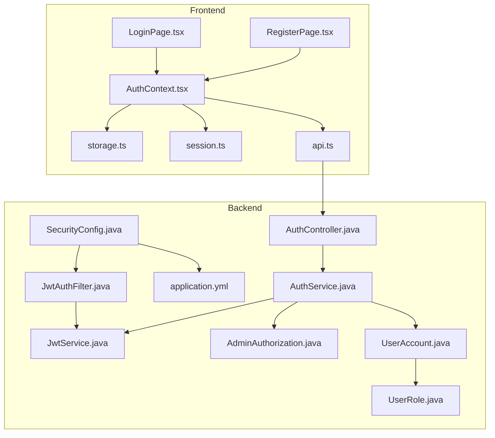
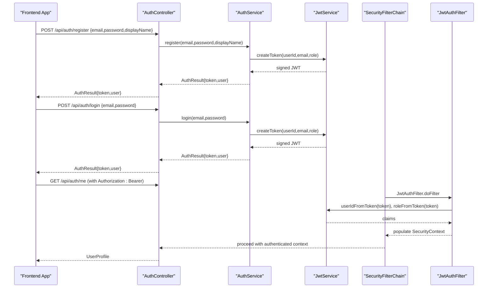
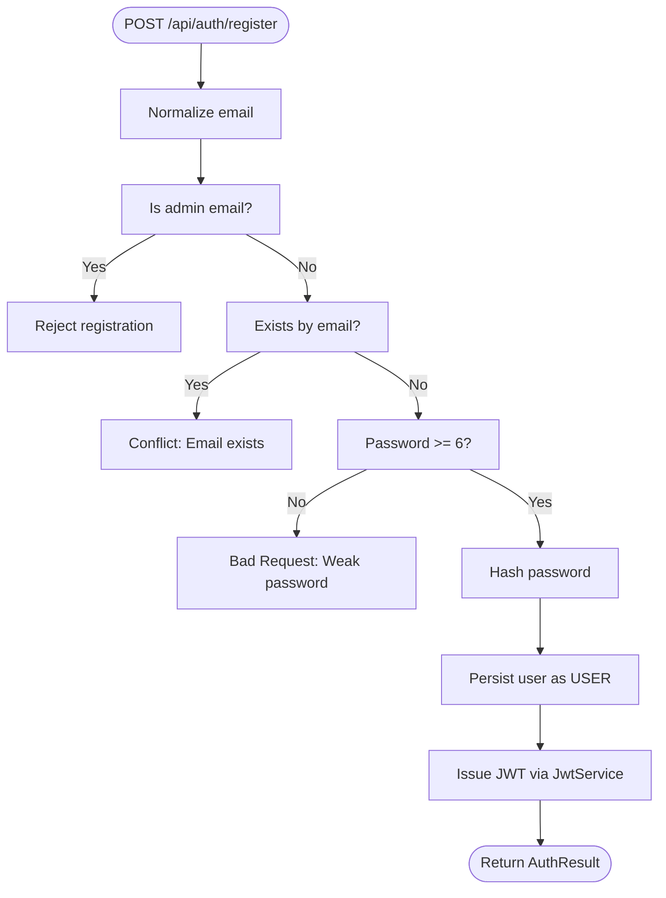
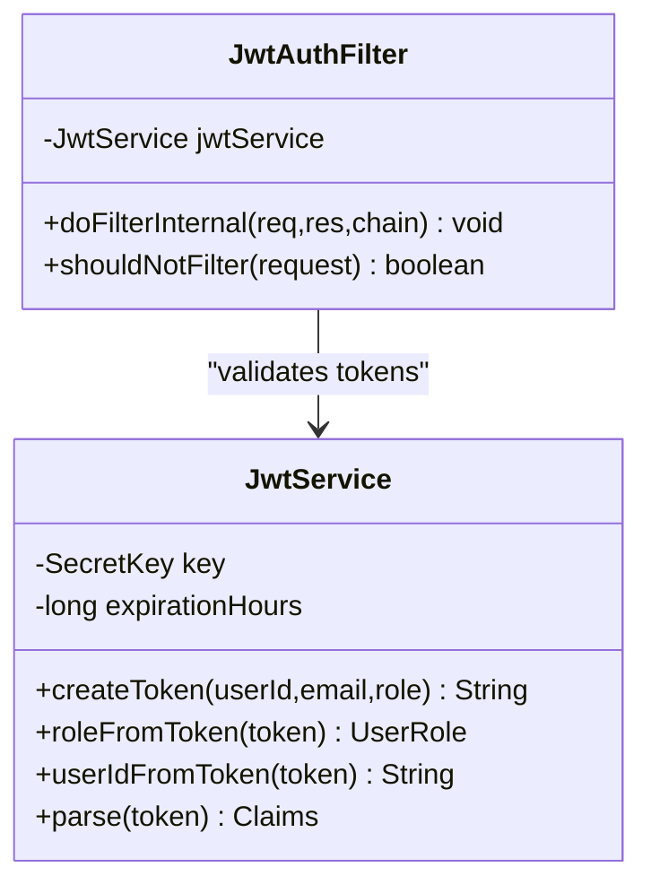
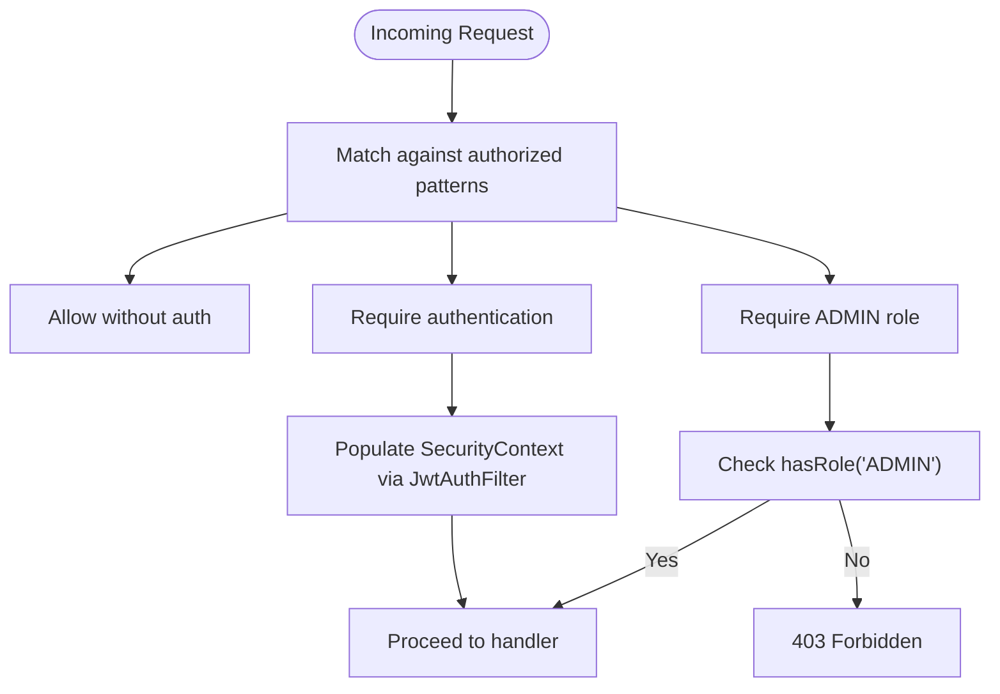
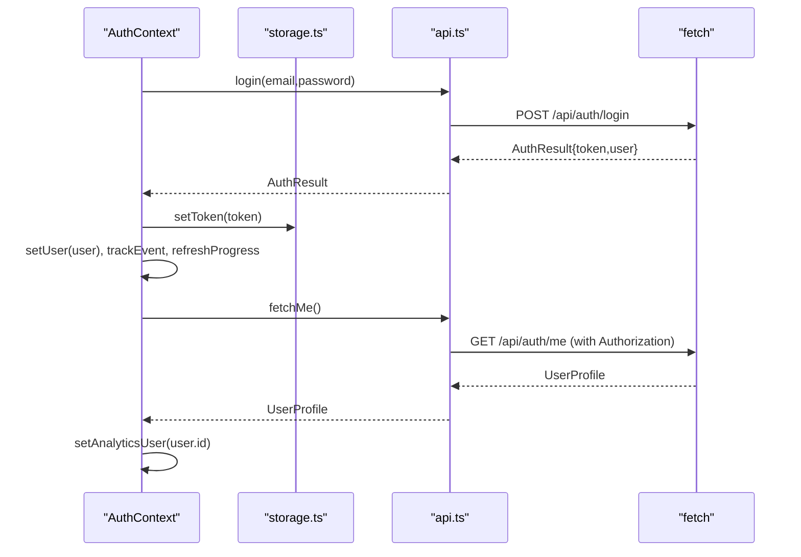
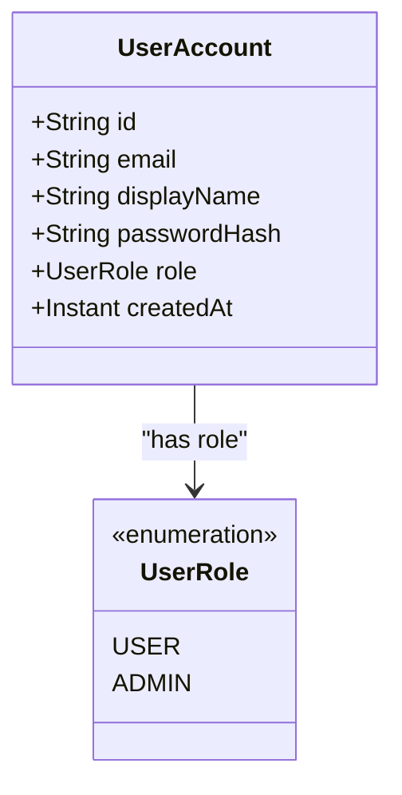
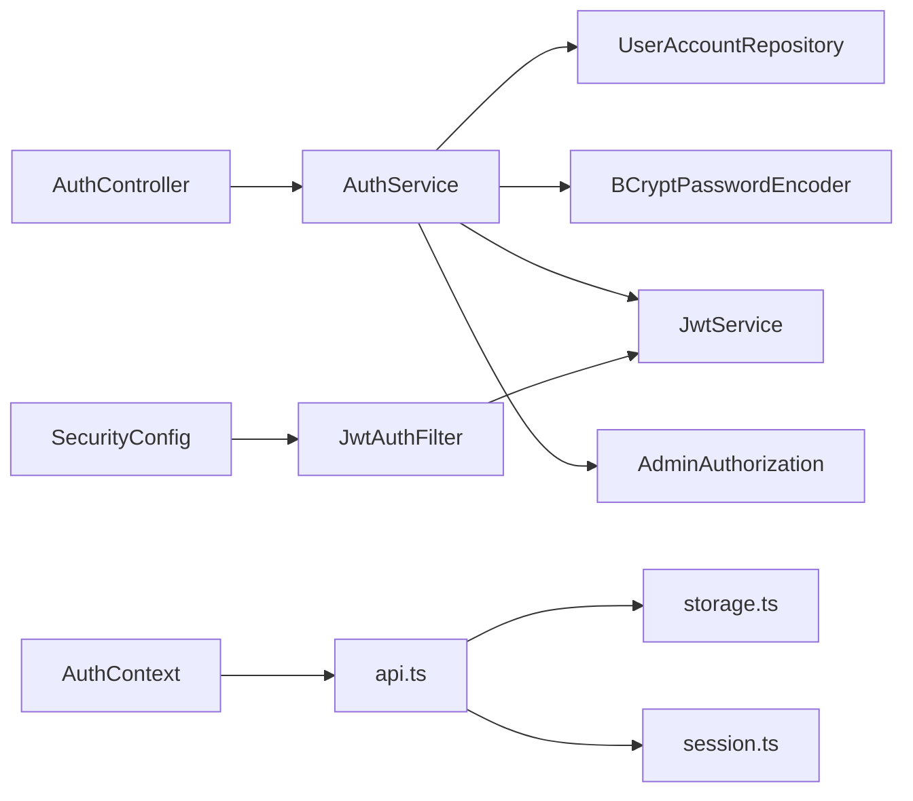

# User Authentication System

<cite>
**Referenced Files in This Document**
- [AuthController.java](file://backend/src/main/java/com/neetlu/examhunt/web/AuthController.java)
- [AuthService.java](file://backend/src/main/java/com/neetlu/examhunt/service/AuthService.java)
- [JwtService.java](file://backend/src/main/java/com/neetlu/examhunt/service/JwtService.java)
- [JwtAuthFilter.java](file://backend/src/main/java/com/neetlu/examhunt/security/JwtAuthFilter.java)
- [SecurityConfig.java](file://backend/src/main/java/com/neetlu/examhunt/config/SecurityConfig.java)
- [AdminAuthorization.java](file://backend/src/main/java/com/neetlu/examhunt/security/AdminAuthorization.java)
- [UserAccount.java](file://backend/src/main/java/com/neetlu/examhunt/model/UserAccount.java)
- [UserRole.java](file://backend/src/main/java/com/neetlu/examhunt/model/UserRole.java)
- [application.yml](file://backend/src/main/resources/application.yml)
- [AuthContext.tsx](file://frontend/src/auth/AuthContext.tsx)
- [session.ts](file://frontend/src/auth/session.ts)
- [storage.ts](file://frontend/src/auth/storage.ts)
- [api.ts](file://frontend/src/api.ts)
- [LoginPage.tsx](file://frontend/src/pages/LoginPage.tsx)
- [RegisterPage.tsx](file://frontend/src/pages/RegisterPage.tsx)
</cite>

## Table of Contents
1. [Introduction](#introduction)
2. [Project Structure](#project-structure)
3. [Core Components](#core-components)
4. [Architecture Overview](#architecture-overview)
5. [Detailed Component Analysis](#detailed-component-analysis)
6. [Dependency Analysis](#dependency-analysis)
7. [Performance Considerations](#performance-considerations)
8. [Troubleshooting Guide](#troubleshooting-guide)
9. [Conclusion](#conclusion)

## Introduction
This document explains the user authentication system used by the application. It covers JWT token-based authentication, user registration and login, session management, and role-based access control. It documents the end-to-end authentication flow from frontend to backend, including token generation, validation, and automatic session idle handling. It also outlines security configurations, password hashing, and session persistence. Practical examples of authentication endpoints and frontend authentication context usage are included, along with best practices, token expiration handling, and common error conditions.

## Project Structure
The authentication system spans both backend and frontend:
- Backend: Spring Boot REST controllers, services, security filters, and configuration define the authentication endpoints, token lifecycle, and access control.
- Frontend: React context manages authentication state, persists tokens, handles idle sessions, and attaches tokens to requests.

**Diagram sources**
- [AuthContext.tsx:1-183](file://frontend/src/auth/AuthContext.tsx#L1-L183)
- [storage.ts:1-30](file://frontend/src/auth/storage.ts#L1-L30)
- [session.ts:1-37](file://frontend/src/auth/session.ts#L1-L37)
- [api.ts:1-1300](file://frontend/src/api.ts#L1-L1300)
- [LoginPage.tsx:1-93](file://frontend/src/pages/LoginPage.tsx#L1-L93)
- [RegisterPage.tsx:1-97](file://frontend/src/pages/RegisterPage.tsx#L1-L97)
- [SecurityConfig.java:1-76](file://backend/src/main/java/com/neetlu/examhunt/config/SecurityConfig.java#L1-L76)
- [JwtAuthFilter.java:1-59](file://backend/src/main/java/com/neetlu/examhunt/security/JwtAuthFilter.java#L1-L59)
- [AuthController.java:1-45](file://backend/src/main/java/com/neetlu/examhunt/web/AuthController.java#L1-L45)
- [AuthService.java:1-106](file://backend/src/main/java/com/neetlu/examhunt/service/AuthService.java#L1-L106)
- [JwtService.java:1-63](file://backend/src/main/java/com/neetlu/examhunt/service/JwtService.java#L1-L63)
- [AdminAuthorization.java:1-85](file://backend/src/main/java/com/neetlu/examhunt/security/AdminAuthorization.java#L1-L85)
- [UserAccount.java:1-71](file://backend/src/main/java/com/neetlu/examhunt/model/UserAccount.java#L1-L71)
- [UserRole.java:1-7](file://backend/src/main/java/com/neetlu/examhunt/model/UserRole.java#L1-L7)
- [application.yml:1-44](file://backend/src/main/resources/application.yml#L1-L44)

**Section sources**
- [AuthController.java:1-45](file://backend/src/main/java/com/neetlu/examhunt/web/AuthController.java#L1-L45)
- [AuthService.java:1-106](file://backend/src/main/java/com/neetlu/examhunt/service/AuthService.java#L1-L106)
- [JwtService.java:1-63](file://backend/src/main/java/com/neetlu/examhunt/service/JwtService.java#L1-L63)
- [JwtAuthFilter.java:1-59](file://backend/src/main/java/com/neetlu/examhunt/security/JwtAuthFilter.java#L1-L59)
- [SecurityConfig.java:1-76](file://backend/src/main/java/com/neetlu/examhunt/config/SecurityConfig.java#L1-L76)
- [AdminAuthorization.java:1-85](file://backend/src/main/java/com/neetlu/examhunt/security/AdminAuthorization.java#L1-L85)
- [UserAccount.java:1-71](file://backend/src/main/java/com/neetlu/examhunt/model/UserAccount.java#L1-L71)
- [UserRole.java:1-7](file://backend/src/main/java/com/neetlu/examhunt/model/UserRole.java#L1-L7)
- [application.yml:1-44](file://backend/src/main/resources/application.yml#L1-L44)
- [AuthContext.tsx:1-183](file://frontend/src/auth/AuthContext.tsx#L1-L183)
- [session.ts:1-37](file://frontend/src/auth/session.ts#L1-L37)
- [storage.ts:1-30](file://frontend/src/auth/storage.ts#L1-L30)
- [api.ts:1-1300](file://frontend/src/api.ts#L1-L1300)
- [LoginPage.tsx:1-93](file://frontend/src/pages/LoginPage.tsx#L1-L93)
- [RegisterPage.tsx:1-97](file://frontend/src/pages/RegisterPage.tsx#L1-L97)

## Core Components
- Backend authentication endpoints:
  - POST /api/auth/register: Registers a new user with email, password, and optional display name. Returns a JWT token and user profile.
  - POST /api/auth/login: Authenticates existing users with email and password, returning a JWT token and user profile.
  - GET /api/auth/me: Retrieves the authenticated user’s profile using the JWT token.
- Token service:
  - Generates JWT with subject (user ID), email, and role claims, signed with a secret key and configured expiration.
- Security filter:
  - Extracts Authorization Bearer tokens, validates them, and populates Spring Security context with authorities derived from roles.
- Access control:
  - Stateless session policy, CORS configuration, and endpoint-level authorization rules (public vs authenticated vs admin-only).
- Admin authorization:
  - Determines admin role based on configured admin email and synchronizes user roles accordingly.
- Frontend authentication context:
  - Stores JWT in secure client-side storage, attaches Authorization headers to requests, manages idle session timeouts, and exposes login/register/logout APIs.

**Section sources**
- [AuthController.java:23-36](file://backend/src/main/java/com/neetlu/examhunt/web/AuthController.java#L23-L36)
- [AuthService.java:31-60](file://backend/src/main/java/com/neetlu/examhunt/service/AuthService.java#L31-L60)
- [JwtService.java:26-37](file://backend/src/main/java/com/neetlu/examhunt/service/JwtService.java#L26-L37)
- [JwtAuthFilter.java:30-57](file://backend/src/main/java/com/neetlu/examhunt/security/JwtAuthFilter.java#L30-L57)
- [SecurityConfig.java:42-74](file://backend/src/main/java/com/neetlu/examhunt/config/SecurityConfig.java#L42-L74)
- [AdminAuthorization.java:22-42](file://backend/src/main/java/com/neetlu/examhunt/security/AdminAuthorization.java#L22-L42)
- [AuthContext.tsx:39-175](file://frontend/src/auth/AuthContext.tsx#L39-L175)
- [storage.ts:13-29](file://frontend/src/auth/storage.ts#L13-L29)
- [api.ts:430-463](file://frontend/src/api.ts#L430-L463)

## Architecture Overview
The authentication architecture enforces JWT-based stateless authentication across the application. Requests to protected endpoints are validated by a JWT filter that extracts and verifies tokens. Role-based access control restricts administrative routes. The frontend stores tokens securely and forwards them automatically with each request.

**Diagram sources**
- [AuthController.java:23-36](file://backend/src/main/java/com/neetlu/examhunt/web/AuthController.java#L23-L36)
- [AuthService.java:31-88](file://backend/src/main/java/com/neetlu/examhunt/service/AuthService.java#L31-L88)
- [JwtService.java:26-61](file://backend/src/main/java/com/neetlu/examhunt/service/JwtService.java#L26-L61)
- [SecurityConfig.java:42-74](file://backend/src/main/java/com/neetlu/examhunt/config/SecurityConfig.java#L42-L74)
- [JwtAuthFilter.java:30-57](file://backend/src/main/java/com/neetlu/examhunt/security/JwtAuthFilter.java#L30-L57)
- [api.ts:558-574](file://frontend/src/api.ts#L558-L574)

## Detailed Component Analysis

### Backend Authentication Endpoints
- Registration:
  - Validates email uniqueness and password length, normalizes email, assigns default role USER, hashes password, and issues a JWT.
- Login:
  - Finds user by normalized email, verifies password hash, synchronizes role, and issues a JWT.
- Profile retrieval:
  - Uses @AuthenticationPrincipal to extract user ID from the authenticated context and returns user profile.

**Diagram sources**
- [AuthService.java:31-50](file://backend/src/main/java/com/neetlu/examhunt/service/AuthService.java#L31-L50)
- [JwtService.java:26-37](file://backend/src/main/java/com/neetlu/examhunt/service/JwtService.java#L26-L37)

**Section sources**
- [AuthController.java:23-31](file://backend/src/main/java/com/neetlu/examhunt/web/AuthController.java#L23-L31)
- [AuthService.java:31-60](file://backend/src/main/java/com/neetlu/examhunt/service/AuthService.java#L31-L60)

### JWT Token Service and Validation
- Token creation includes subject (user ID), email, role, issued-at, expiration, and HMAC signature.
- Token parsing extracts claims and resolves role; defaults to USER if missing or invalid.
- Filter extracts Authorization header, validates token, and sets Spring Security context with ROLE_USER or ROLE_ADMIN.

**Diagram sources**
- [JwtService.java:15-63](file://backend/src/main/java/com/neetlu/examhunt/service/JwtService.java#L15-L63)
- [JwtAuthFilter.java:22-59](file://backend/src/main/java/com/neetlu/examhunt/security/JwtAuthFilter.java#L22-L59)

**Section sources**
- [JwtService.java:18-61](file://backend/src/main/java/com/neetlu/examhunt/service/JwtService.java#L18-L61)
- [JwtAuthFilter.java:30-57](file://backend/src/main/java/com/neetlu/examhunt/security/JwtAuthFilter.java#L30-L57)

### Role-Based Access Control
- Endpoint-level rules:
  - Public: OPTIONS, actuator, auth register/login.
  - Authenticated: practice, bookmarks, feedback endpoints.
  - Admin-only: /api/admin/**.
- Role resolution:
  - AdminAuthorization derives role from configured admin email and synchronizes user role on access.

**Diagram sources**
- [SecurityConfig.java:51-70](file://backend/src/main/java/com/neetlu/examhunt/config/SecurityConfig.java#L51-L70)
- [JwtAuthFilter.java:42-51](file://backend/src/main/java/com/neetlu/examhunt/security/JwtAuthFilter.java#L42-L51)
- [AdminAuthorization.java:30-56](file://backend/src/main/java/com/neetlu/examhunt/security/AdminAuthorization.java#L30-L56)

**Section sources**
- [SecurityConfig.java:42-74](file://backend/src/main/java/com/neetlu/examhunt/config/SecurityConfig.java#L42-L74)
- [AdminAuthorization.java:36-42](file://backend/src/main/java/com/neetlu/examhunt/security/AdminAuthorization.java#L36-L42)

### Frontend Authentication Context and Session Management
- AuthContext:
  - Provides login, register, logout, refresh, and progress refresh functions.
  - Persists token in secure storage and attaches Authorization header to all requests.
  - Tracks user activity and logs out after 30 minutes of inactivity.
- Storage:
  - Manages token persistence in local storage and updates last-activity timestamps.
- API:
  - Adds Authorization: Bearer header automatically and surfaces meaningful errors.

**Diagram sources**
- [AuthContext.tsx:132-157](file://frontend/src/auth/AuthContext.tsx#L132-L157)
- [storage.ts:13-20](file://frontend/src/auth/storage.ts#L13-L20)
- [api.ts:558-574](file://frontend/src/api.ts#L558-L574)
- [api.ts:430-463](file://frontend/src/api.ts#L430-L463)

**Section sources**
- [AuthContext.tsx:39-175](file://frontend/src/auth/AuthContext.tsx#L39-L175)
- [session.ts:10-36](file://frontend/src/auth/session.ts#L10-L36)
- [storage.ts:3-29](file://frontend/src/auth/storage.ts#L3-L29)
- [api.ts:430-463](file://frontend/src/api.ts#L430-L463)

### Data Model: User Account and Roles
- UserAccount stores identity, credentials, role, and metadata.
- UserRole distinguishes USER and ADMIN.

**Diagram sources**
- [UserAccount.java:10-71](file://backend/src/main/java/com/neetlu/examhunt/model/UserAccount.java#L10-L71)
- [UserRole.java:3-7](file://backend/src/main/java/com/neetlu/examhunt/model/UserRole.java#L3-L7)

**Section sources**
- [UserAccount.java:12-70](file://backend/src/main/java/com/neetlu/examhunt/model/UserAccount.java#L12-L70)
- [UserRole.java:3-7](file://backend/src/main/java/com/neetlu/examhunt/model/UserRole.java#L3-L7)

### Security Configurations and Password Hashing
- PasswordEncoder: BCrypt for secure hashing.
- Stateless sessions: No server-side session storage.
- CORS: Configured via AppProperties and applied globally.
- JWT secret and expiration: Loaded from application.yml.

**Section sources**
- [SecurityConfig.java:27-30](file://backend/src/main/java/com/neetlu/examhunt/config/SecurityConfig.java#L27-L30)
- [SecurityConfig.java:48-50](file://backend/src/main/java/com/neetlu/examhunt/config/SecurityConfig.java#L48-L50)
- [application.yml:20-21](file://backend/src/main/resources/application.yml#L20-L21)

## Dependency Analysis
The authentication subsystem exhibits clear separation of concerns:
- Controllers depend on Services.
- Services depend on repositories, password encoder, JWT service, and admin authorization.
- Filters depend on JWT service and Spring Security infrastructure.
- Frontend depends on API module and auth utilities.

**Diagram sources**
- [AuthController.java:17-21](file://backend/src/main/java/com/neetlu/examhunt/web/AuthController.java#L17-L21)
- [AuthService.java:15-29](file://backend/src/main/java/com/neetlu/examhunt/service/AuthService.java#L15-L29)
- [SecurityConfig.java:42-74](file://backend/src/main/java/com/neetlu/examhunt/config/SecurityConfig.java#L42-L74)
- [JwtAuthFilter.java:24-28](file://backend/src/main/java/com/neetlu/examhunt/security/JwtAuthFilter.java#L24-L28)
- [AuthContext.tsx:11-21](file://frontend/src/auth/AuthContext.tsx#L11-L21)
- [api.ts:1-10](file://frontend/src/api.ts#L1-L10)
- [storage.ts:1-3](file://frontend/src/auth/storage.ts#L1-L3)
- [session.ts:1-2](file://frontend/src/auth/session.ts#L1-L2)

**Section sources**
- [AuthService.java:15-29](file://backend/src/main/java/com/neetlu/examhunt/service/AuthService.java#L15-L29)
- [SecurityConfig.java:42-74](file://backend/src/main/java/com/neetlu/examhunt/config/SecurityConfig.java#L42-L74)
- [AuthContext.tsx:11-21](file://frontend/src/auth/AuthContext.tsx#L11-L21)

## Performance Considerations
- Stateless JWT eliminates server-side session storage overhead.
- Token expiration reduces long-lived credential risk; adjust jwt-expiration-hours in production as needed.
- Frontend caching of GET requests minimizes redundant network calls during authenticated sessions.
- Consider rate-limiting login attempts at the API boundary to mitigate brute-force attacks.

## Troubleshooting Guide
Common issues and resolutions:
- 401 Unauthorized:
  - Occurs when token is missing, expired, malformed, or fails verification. The frontend automatically logs out on such errors.
- 403 Forbidden:
  - Access denied for admin-only endpoints; ensure the user is authenticated as admin.
- Registration conflicts:
  - Email already registered triggers conflict; prompt user to sign in or use another email.
- Weak password:
  - Password must be at least six characters; enforce client-side validation and server-side checks.
- Session idle timeout:
  - Automatic logout after 30 minutes of inactivity; extend activity by interacting with the app.
- CORS or CSRF errors:
  - Verify CORS origins and CSRF is disabled for stateless APIs.

**Section sources**
- [AuthService.java:37-42](file://backend/src/main/java/com/neetlu/examhunt/service/AuthService.java#L37-L42)
- [api.ts:465-479](file://frontend/src/api.ts#L465-L479)
- [session.ts:26-36](file://frontend/src/auth/session.ts#L26-L36)
- [SecurityConfig.java:46-50](file://backend/src/main/java/com/neetlu/examhunt/config/SecurityConfig.java#L46-L50)

## Conclusion
The authentication system combines robust backend JWT handling with a resilient frontend context that manages tokens and idle sessions. It enforces role-based access control, uses secure password hashing, and provides clear error messaging. By following the outlined best practices and leveraging the documented flows, teams can maintain a secure and scalable authentication layer.