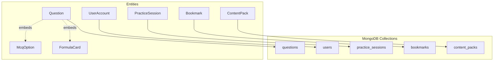
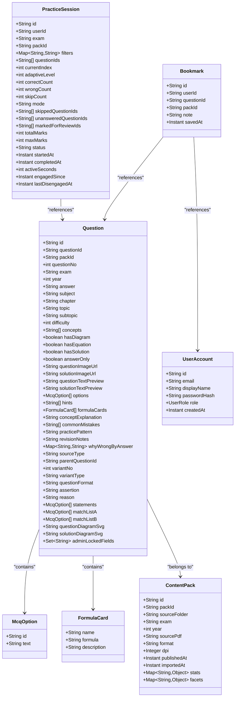
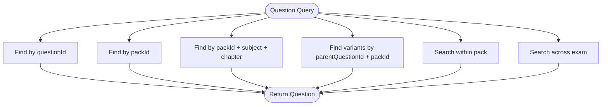
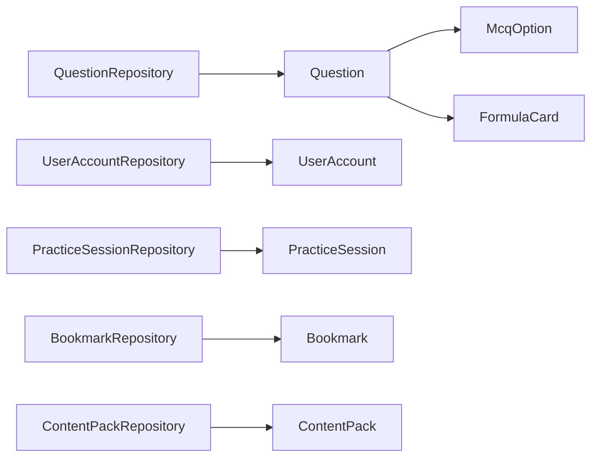

# Database Schema and Models

<cite>
**Referenced Files in This Document**
- [Question.java](file://backend/src/main/java/com/neetlu/examhunt/model/Question.java)
- [UserAccount.java](file://backend/src/main/java/com/neetlu/examhunt/model/UserAccount.java)
- [PracticeSession.java](file://backend/src/main/java/com/neetlu/examhunt/model/PracticeSession.java)
- [Bookmark.java](file://backend/src/main/java/com/neetlu/examhunt/model/Bookmark.java)
- [ContentPack.java](file://backend/src/main/java/com/neetlu/examhunt/model/ContentPack.java)
- [McqOption.java](file://backend/src/main/java/com/neetlu/examhunt/model/McqOption.java)
- [FormulaCard.java](file://backend/src/main/java/com/neetlu/examhunt/model/FormulaCard.java)
- [UserRole.java](file://backend/src/main/java/com/neetlu/examhunt/model/UserRole.java)
- [QuestionRepository.java](file://backend/src/main/java/com/neetlu/examhunt/repository/QuestionRepository.java)
- [UserAccountRepository.java](file://backend/src/main/java/com/neetlu/examhunt/repository/UserAccountRepository.java)
- [BookmarkRepository.java](file://backend/src/main/java/com/neetlu/examhunt/repository/BookmarkRepository.java)
- [ContentPackRepository.java](file://backend/src/main/java/com/neetlu/examhunt/repository/ContentPackRepository.java)
- [PracticeSessionRepository.java](file://backend/src/main/java/com/neetlu/examhunt/repository/PracticeSessionRepository.java)
- [application.yml](file://backend/src/main/resources/application.yml)
</cite>

## Table of Contents
1. [Introduction](#introduction)
2. [Project Structure](#project-structure)
3. [Core Components](#core-components)
4. [Architecture Overview](#architecture-overview)
5. [Detailed Component Analysis](#detailed-component-analysis)
6. [Dependency Analysis](#dependency-analysis)
7. [Performance Considerations](#performance-considerations)
8. [Troubleshooting Guide](#troubleshooting-guide)
9. [Conclusion](#conclusion)
10. [Appendices](#appendices)

## Introduction
This document provides comprehensive data model documentation for the MongoDB schema and entity definitions used by the backend service. It covers the document structure for core entities including Question, UserAccount, PracticeSession, Bookmark, and ContentPack, along with related models such as McqOption and FormulaCard. For each entity, we define fields, data types, validation rules, and business constraints. We also explain entity relationships, indexing strategies for query performance, and data access patterns via repository interfaces. Finally, we outline data lifecycle management, migration considerations, and performance guidance for large-scale question data.

## Project Structure
The data model is implemented using Spring Data MongoDB annotations and repository interfaces. Entities are mapped to collections with explicit compound and single-field indexes to optimize frequent queries. Repositories expose typed methods for CRUD and specialized queries.

**Diagram sources**
- [Question.java:12-14](file://backend/src/main/java/com/neetlu/examhunt/model/Question.java#L12-L14)
- [UserAccount.java](file://backend/src/main/java/com/neetlu/examhunt/model/UserAccount.java#L9)
- [PracticeSession.java](file://backend/src/main/java/com/neetlu/examhunt/model/PracticeSession.java#L12)
- [Bookmark.java](file://backend/src/main/java/com/neetlu/examhunt/model/Bookmark.java#L9)
- [ContentPack.java](file://backend/src/main/java/com/neetlu/examhunt/model/ContentPack.java#L11)

**Section sources**
- [application.yml:8-9](file://backend/src/main/resources/application.yml#L8-L9)

## Core Components
This section documents each core entity, its fields, data types, validation rules, and business constraints.

### Question
- Collection: questions
- Purpose: Stores question bank entries, including original previous years’ questions (PYQ) and AI-generated variants.
- Key fields and constraints:
  - id: ObjectId (auto-generated)
  - questionId: Unique identifier for the question (indexed, unique)
  - packId: References a content pack (indexed)
  - questionNo: Integer question number within a pack
  - exam, subject, chapter, topic, subtopic: Classification fields for filtering and faceting
  - difficulty: Integer rating
  - concepts: Array of concept tags
  - hasDiagram, hasEquation, hasSolution: Flags for media presence
  - answerOnly: Boolean indicating answer-only mode
  - questionImageUrl, solutionImageUrl: Image URLs
  - questionTextPreview, solutionTextPreview: Snippet previews
  - options: Array of McqOption for text-based AI variants
  - hints: Array of hint strings
  - formulaCards: Array of FormulaCard
  - conceptExplanation: Text explanation
  - commonMistakes: Array of mistake descriptions
  - practicePattern: Pattern identifier for adaptive practice
  - revisionNotes: Cached LLM revision notes
  - whyWrongByAnswer: Map of answer option to explanation
  - sourceType: Enumerated type ("pyq" or others)
  - parentQuestionId: For AI variants, links to the original PYQ
  - variantNo: Variant number (0 for original)
  - variantType: Type of variant
  - questionFormat: Format discriminator (mcq, assertion_reason, statement_based)
  - assertion, reason: For assertion–reason format
  - statements: For statement-based format
  - matchListA, matchListB: For matching-type variants
  - questionDiagramSvg, solutionDiagramSvg: Inline SVG diagrams
  - adminLockedFields: Set of admin-edited field names to protect during enrichment
- Indexes:
  - Compound index: (packId, questionNo)
  - Compound index: (packId, subject, chapter)
  - Unique index: questionId
  - Additional implicit indexes on _id and packId
- Validation rules:
  - questionId must be unique
  - packId must reference an existing ContentPack
  - parentQuestionId must reference an existing Question when present
  - variantNo must be non-negative integer
  - sourceType must be one of supported values
  - questionFormat must be one of supported values
- Business constraints:
  - For AI variants, parentQuestionId and variantNo form a unique pair per pack
  - practicePattern must be present for recommendation logic
  - adminLockedFields prevents enrichment from overwriting admin-edited fields

**Section sources**
- [Question.java:12-14](file://backend/src/main/java/com/neetlu/examhunt/model/Question.java#L12-L14)
- [Question.java:17-411](file://backend/src/main/java/com/neetlu/examhunt/model/Question.java#L17-L411)

### UserAccount
- Collection: users
- Purpose: Stores user profiles and authentication metadata.
- Key fields and constraints:
  - id: ObjectId (auto-generated)
  - email: Unique email address (indexed, unique)
  - displayName: User’s display name
  - passwordHash: Hashed password
  - role: Enumerated role (USER or ADMIN)
  - createdAt: Timestamp of account creation
- Indexes:
  - Unique index: email
- Validation rules:
  - email must be unique and non-empty
  - role defaults to USER if null
- Business constraints:
  - Role controls administrative access

**Section sources**
- [UserAccount.java](file://backend/src/main/java/com/neetlu/examhunt/model/UserAccount.java#L9)
- [UserAccount.java:12-69](file://backend/src/main/java/com/neetlu/examhunt/model/UserAccount.java#L12-L69)
- [UserRole.java:3-6](file://backend/src/main/java/com/neetlu/examhunt/model/UserRole.java#L3-L6)

### PracticeSession
- Collection: practice_sessions
- Purpose: Tracks user practice/test sessions, progress, and timing metrics.
- Key fields and constraints:
  - id: ObjectId (auto-generated)
  - userId: Reference to UserAccount
  - exam, packId: Filters for session scope
  - filters: Map of filter key-value pairs
  - questionIds: Ordered list of question identifiers presented
  - currentIndex: Current position in the list
  - adaptiveLevel: Adaptive difficulty level
  - correctCount, wrongCount, skipCount: Attempt statistics
  - mode: Mode discriminator ("practice" or "test")
  - skippedQuestionIds, unansweredQuestionIds, markedForReviewIds: Lists of question identifiers
  - totalMarks, maxMarks: Score metrics
  - status: Session lifecycle state (default "active")
  - startedAt, completedAt: Timestamps
  - activeSeconds: Active engagement seconds
  - engagedSince, lastDisengagedAt: Engagement tracking timestamps
- Indexes:
  - Implicit index on _id
  - Additional indexes inferred by repository queries (see repositories)
- Validation rules:
  - questionIds must correspond to existing Question ids
  - currentIndex must be within bounds of questionIds
  - status must be one of supported values
- Business constraints:
  - mode determines scoring and completion behavior
  - Lists maintain ordering and mutual exclusivity

**Section sources**
- [PracticeSession.java](file://backend/src/main/java/com/neetlu/examhunt/model/PracticeSession.java#L12)
- [PracticeSession.java:15-226](file://backend/src/main/java/com/neetlu/examhunt/model/PracticeSession.java#L15-L226)

### Bookmark
- Collection: bookmarks
- Purpose: Allows users to bookmark questions with optional notes.
- Key fields and constraints:
  - id: ObjectId (auto-generated)
  - userId: Reference to UserAccount
  - questionId: Reference to Question
  - packId: Reference to ContentPack
  - note: Optional personal note
  - savedAt: Timestamp of save
- Indexes:
  - Compound unique index: (userId, questionId)
- Validation rules:
  - userId must reference an existing UserAccount
  - questionId must reference an existing Question
  - packId must reference an existing ContentPack
  - Composite uniqueness enforced by compound index
- Business constraints:
  - One bookmark per user-question pair

**Section sources**
- [Bookmark.java:9-10](file://backend/src/main/java/com/neetlu/examhunt/model/Bookmark.java#L9-L10)
- [Bookmark.java:13-67](file://backend/src/main/java/com/neetlu/examhunt/model/Bookmark.java#L13-L67)

### ContentPack
- Collection: content_packs
- Purpose: Represents a curated set of questions (e.g., PYQ by exam/year).
- Key fields and constraints:
  - id: ObjectId (auto-generated)
  - packId: Unique pack identifier (indexed, unique)
  - sourceFolder, sourcePdf: Source metadata
  - exam, year: Classification
  - format, dpi: Media metadata
  - publishedAt, importedAt: Timestamps
  - stats, facets: Aggregated metadata for browsing
- Indexes:
  - Unique index: packId
- Validation rules:
  - packId must be unique
- Business constraints:
  - packId is the primary key for pack-scoped queries

**Section sources**
- [ContentPack.java](file://backend/src/main/java/com/neetlu/examhunt/model/ContentPack.java#L11)
- [ContentPack.java:14-125](file://backend/src/main/java/com/neetlu/examhunt/model/ContentPack.java#L14-L125)

### Embedded Models
- McqOption
  - Fields: id, text
  - Usage: Options for text-based AI variants within Question
- FormulaCard
  - Fields: name, formula, description
  - Usage: Pre-baked formula cards embedded in Question

**Section sources**
- [McqOption.java:4-24](file://backend/src/main/java/com/neetlu/examhunt/model/McqOption.java#L4-L24)
- [FormulaCard.java:4-33](file://backend/src/main/java/com/neetlu/examhunt/model/FormulaCard.java#L4-L33)

## Architecture Overview
The system uses Spring Data MongoDB to map Java entities to MongoDB collections. Repositories provide strongly-typed access and declarative queries. Indexes are strategically placed to support common query patterns.

**Diagram sources**
- [Question.java:12-14](file://backend/src/main/java/com/neetlu/examhunt/model/Question.java#L12-L14)
- [UserAccount.java](file://backend/src/main/java/com/neetlu/examhunt/model/UserAccount.java#L9)
- [PracticeSession.java](file://backend/src/main/java/com/neetlu/examhunt/model/PracticeSession.java#L12)
- [Bookmark.java:9-10](file://backend/src/main/java/com/neetlu/examhunt/model/Bookmark.java#L9-L10)
- [ContentPack.java](file://backend/src/main/java/com/neetlu/examhunt/model/ContentPack.java#L11)
- [McqOption.java:4-24](file://backend/src/main/java/com/neetlu/examhunt/model/McqOption.java#L4-L24)
- [FormulaCard.java:4-33](file://backend/src/main/java/com/neetlu/examhunt/model/FormulaCard.java#L4-L33)

## Detailed Component Analysis

### Question Entity
- Document structure highlights:
  - Hierarchical classification: exam → subject → chapter → topic → subtopic
  - Variant model: parentQuestionId + variantNo enables AI variants of PYQs
  - Rich media and enrichment: images, SVG diagrams, formula cards, hints, mistakes
  - Analytics-friendly fields: questionTextPreview, subject, chapter, topic, sourceType, variantNo
- Indexing strategy:
  - Compound index (packId, questionNo) supports ordered retrieval within packs
  - Compound index (packId, subject, chapter) accelerates faceted browsing
  - Unique index (questionId) ensures global uniqueness and fast lookup
- Data access patterns:
  - Find by questionId, packId, subject/chapter/topic filters
  - Search within pack or across exam using regex
  - Count by pack and source type
  - Retrieve variants by parentQuestionId and packId
- Validation and constraints:
  - Enforced via repository queries and domain logic
  - adminLockedFields protects admin-edited fields during enrichment

**Diagram sources**
- [QuestionRepository.java:15-102](file://backend/src/main/java/com/neetlu/examhunt/repository/QuestionRepository.java#L15-L102)

**Section sources**
- [Question.java:12-14](file://backend/src/main/java/com/neetlu/examhunt/model/Question.java#L12-L14)
- [QuestionRepository.java:13-103](file://backend/src/main/java/com/neetlu/examhunt/repository/QuestionRepository.java#L13-L103)

### UserAccount Entity
- Authentication and profile management:
  - Email serves as unique identity
  - Role-based access control
- Access patterns:
  - Lookup by email (case-insensitive)
  - Existence checks and role-based filtering

**Section sources**
- [UserAccount.java:9-69](file://backend/src/main/java/com/neetlu/examhunt/model/UserAccount.java#L9-L69)
- [UserAccountRepository.java:10-16](file://backend/src/main/java/com/neetlu/examhunt/repository/UserAccountRepository.java#L10-L16)

### PracticeSession Entity
- Session lifecycle and metrics:
  - Tracks progress, timing, and scoring
  - Supports both practice and test modes
- Access patterns:
  - Load by id and userId
  - Fetch recent sessions by userId

**Section sources**
- [PracticeSession.java:12-226](file://backend/src/main/java/com/neetlu/examhunt/model/PracticeSession.java#L12-L226)
- [PracticeSessionRepository.java:9-12](file://backend/src/main/java/com/neetlu/examhunt/repository/PracticeSessionRepository.java#L9-L12)

### Bookmark Entity
- User-driven curation:
  - Per-user, per-question bookmarks with notes
- Access patterns:
  - Lookup by (userId, questionId)
  - Bulk fetch by userId
  - Count per user

**Section sources**
- [Bookmark.java:9-10](file://backend/src/main/java/com/neetlu/examhunt/model/Bookmark.java#L9-L10)
- [BookmarkRepository.java:10-21](file://backend/src/main/java/com/neetlu/examhunt/repository/BookmarkRepository.java#L10-L21)

### ContentPack Entity
- Pack-level metadata and stats:
  - Faceted browsing and aggregated insights
- Access patterns:
  - Lookup by packId
  - Sorting by year and filtering by exam

**Section sources**
- [ContentPack.java:11-125](file://backend/src/main/java/com/neetlu/examhunt/model/ContentPack.java#L11-L125)
- [ContentPackRepository.java:9-19](file://backend/src/main/java/com/neetlu/examhunt/repository/ContentPackRepository.java#L9-L19)

## Dependency Analysis
Repositories depend on entities and leverage Spring Data MongoDB to generate queries. Entities embed auxiliary models to reduce joins and improve read performance.

**Diagram sources**
- [QuestionRepository.java](file://backend/src/main/java/com/neetlu/examhunt/repository/QuestionRepository.java#L13)
- [UserAccountRepository.java](file://backend/src/main/java/com/neetlu/examhunt/repository/UserAccountRepository.java#L10)
- [PracticeSessionRepository.java](file://backend/src/main/java/com/neetlu/examhunt/repository/PracticeSessionRepository.java#L9)
- [BookmarkRepository.java](file://backend/src/main/java/com/neetlu/examhunt/repository/BookmarkRepository.java#L10)
- [ContentPackRepository.java](file://backend/src/main/java/com/neetlu/examhunt/repository/ContentPackRepository.java#L9)
- [Question.java:44-47](file://backend/src/main/java/com/neetlu/examhunt/model/Question.java#L44-L47)

**Section sources**
- [QuestionRepository.java:13-103](file://backend/src/main/java/com/neetlu/examhunt/repository/QuestionRepository.java#L13-L103)
- [UserAccountRepository.java:10-16](file://backend/src/main/java/com/neetlu/examhunt/repository/UserAccountRepository.java#L10-L16)
- [BookmarkRepository.java:10-21](file://backend/src/main/java/com/neetlu/examhunt/repository/BookmarkRepository.java#L10-L21)
- [ContentPackRepository.java:9-19](file://backend/src/main/java/com/neetlu/examhunt/repository/ContentPackRepository.java#L9-L19)
- [PracticeSessionRepository.java:9-12](file://backend/src/main/java/com/neetlu/examhunt/repository/PracticeSessionRepository.java#L9-L12)

## Performance Considerations
- Indexing strategy:
  - Compound index (packId, questionNo) optimizes ordered pagination within packs
  - Compound index (packId, subject, chapter) accelerates faceted browsing
  - Unique index (questionId) ensures fast lookups and enforces uniqueness
  - Compound unique index (userId, questionId) in Bookmark prevents duplicates and speeds up per-user queries
- Query patterns:
  - Use projection to limit fields for analytics-heavy reads
  - Prefer exact-case filters for subject/chapter/topic when possible to leverage indexes
  - Leverage regex sparingly; consider text search or additional normalized fields for scalability
- Data modeling:
  - Embedding McqOption and FormulaCard reduces cross-collection reads
  - Using packId as a partition key improves locality for pack-scoped operations
- Scalability:
  - For very large question sets, consider sharding by packId or exam+year
  - Monitor slow queries and add targeted indexes for hotspots
  - Batch writes for bulk imports and enrichment jobs

## Troubleshooting Guide
- Duplicate questionId errors:
  - Ensure uniqueness before insert/update; rely on the unique index on questionId
- Missing packId references:
  - Verify ContentPack existence before associating Questions
- Variant integrity:
  - For AI variants, confirm parentQuestionId and variantNo uniqueness per pack
- Bookmark conflicts:
  - Use the composite unique index to detect and prevent duplicate bookmarks
- Slow queries:
  - Confirm appropriate indexes are being used for filters and sorts
  - Review query plans and adjust projections to minimize returned data

## Conclusion
The MongoDB schema is designed around pack-scoped question data with strong indexing for common faceted queries and variant relationships. Embedded models reduce join overhead, while repository interfaces encapsulate query logic. Proper indexing, validation rules, and lifecycle management enable efficient operations at scale.

## Appendices

### Sample Data Examples
- Question
  - Fields: questionId, packId, questionNo, exam, subject, chapter, topic, difficulty, options, formulaCards, practicePattern, sourceType, parentQuestionId, variantNo, questionFormat, hints, commonMistakes, adminLockedFields
- UserAccount
  - Fields: email, displayName, passwordHash, role, createdAt
- PracticeSession
  - Fields: userId, exam, packId, filters, questionIds, currentIndex, adaptiveLevel, correctCount, wrongCount, skipCount, mode, skippedQuestionIds, unansweredQuestionIds, markedForReviewIds, totalMarks, maxMarks, status, startedAt, completedAt, activeSeconds, engagedSince, lastDisengagedAt
- Bookmark
  - Fields: userId, questionId, packId, note, savedAt
- ContentPack
  - Fields: packId, sourceFolder, exam, year, sourcePdf, format, dpi, publishedAt, importedAt, stats, facets

### Data Lifecycle Management
- Creation:
  - ContentPack ingestion populates content_packs
  - Question enrichment populates questions with packId and classification
- Updates:
  - Admin edits lock specific fields via adminLockedFields
  - PracticeSession updates increment counters and manage status transitions
- Deletion:
  - Bulk deletion by packId cascades to dependent entities (via repository deletes)
- Archival:
  - Historical snapshots can be maintained by copying documents with timestamps

### Migration and Schema Evolution
- Adding new indexed fields:
  - Create indexes offline or in maintenance windows to avoid blocking writes
- Renaming fields:
  - Use aggregation pipelines to migrate data safely; keep backward compatibility during transition
- Removing deprecated fields:
  - Migrate to new structure gradually; retain old fields until all consumers are updated
- Versioning variants:
  - Introduce variantType and evolve variantNo semantics carefully to preserve referential integrity