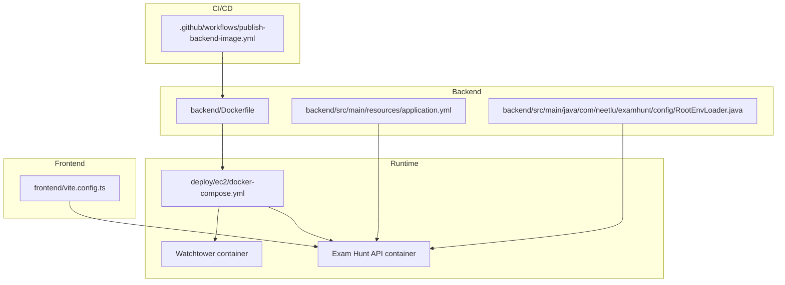
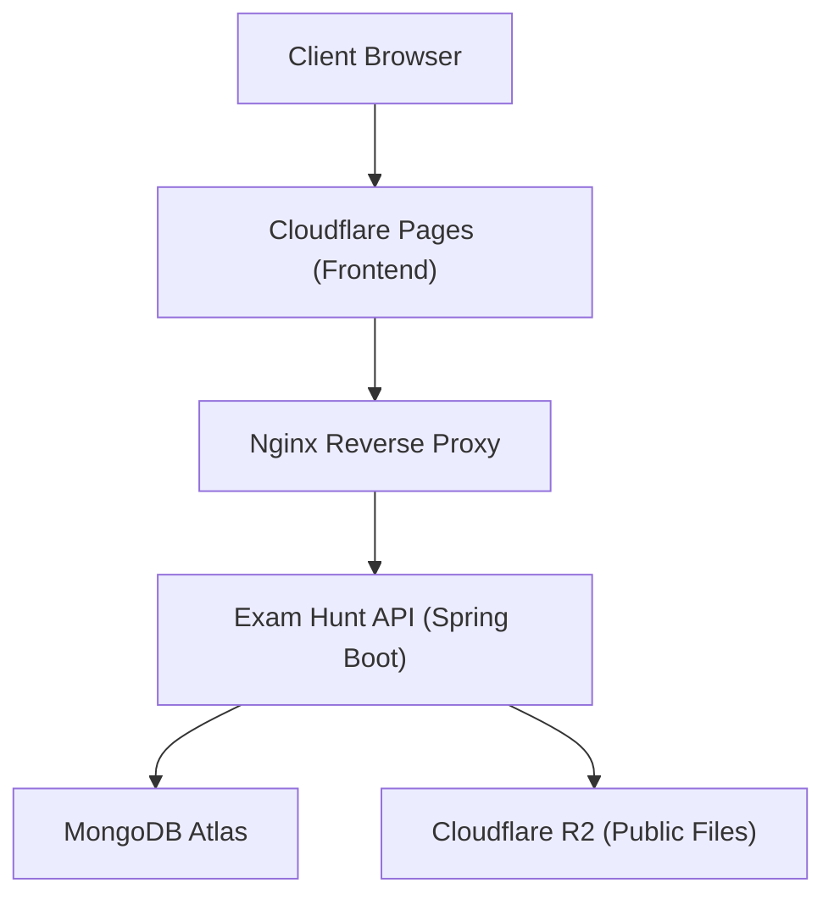
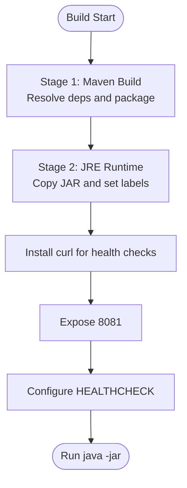
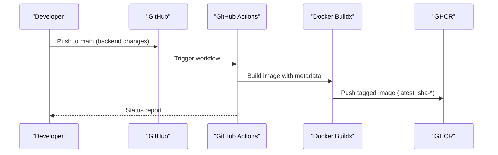
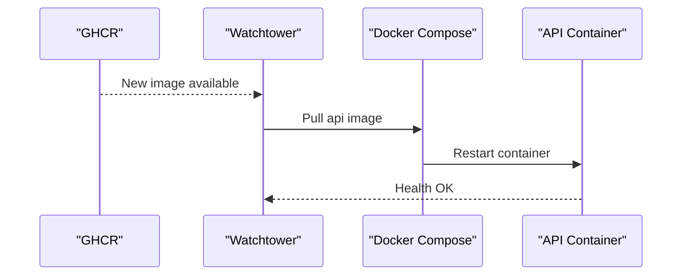
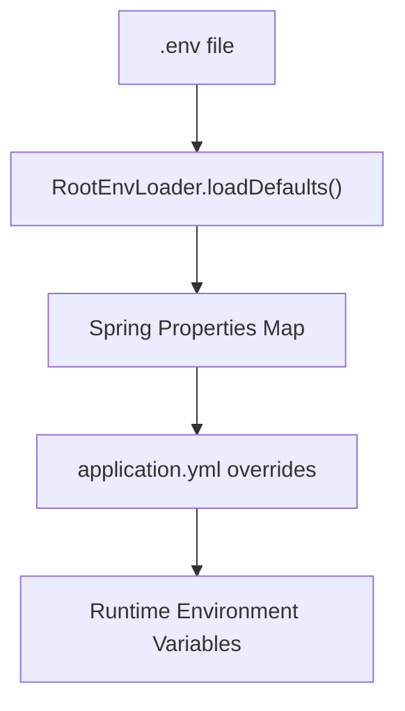
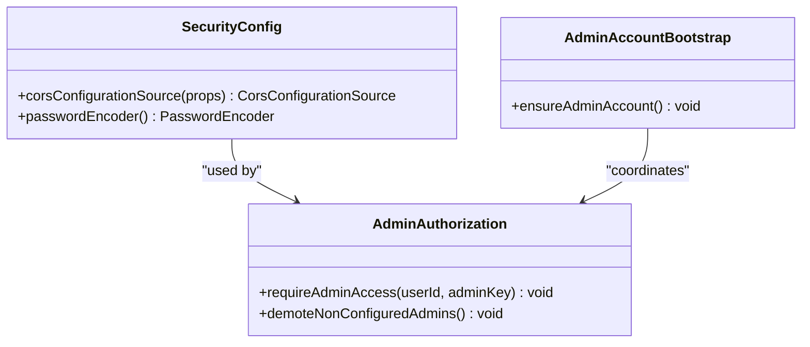
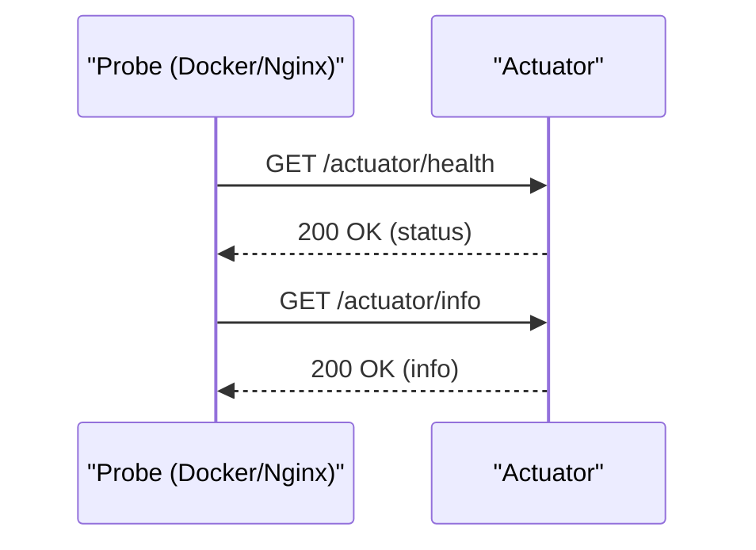
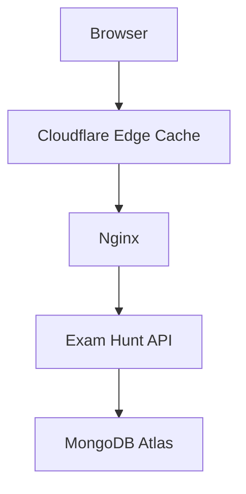
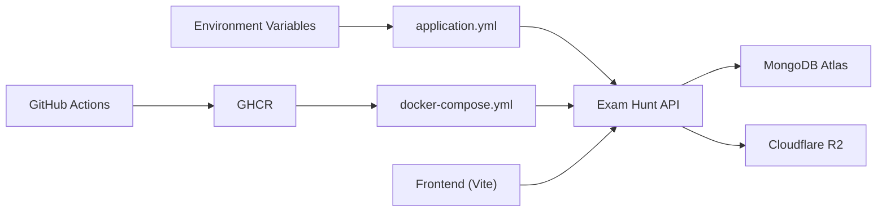

# Deployment and Operations

<cite>
**Referenced Files in This Document**
- [Dockerfile](file://backend/Dockerfile)
- [.dockerignore](file://backend/.dockerignore)
- [docker-compose.yml](file://deploy/ec2/docker-compose.yml)
- [deployment.md](file://docs/deployment.md)
- [application.yml](file://backend/src/main/resources/application.yml)
- [publish-backend-image.yml](file://.github/workflows/publish-backend-image.yml)
- [dev-api.sh](file://scripts/dev-api.sh)
- [RootEnvLoader.java](file://backend/src/main/java/com/neetlu/examhunt/config/RootEnvLoader.java)
- [AdminAccountBootstrap.java](file://backend/src/main/java/com/neetlu/examhunt/config/AdminAccountBootstrap.java)
- [SecurityConfig.java](file://backend/src/main/java/com/neetlu/examhunt/config/SecurityConfig.java)
- [vite.config.ts](file://frontend/vite.config.ts)
- [package.json](file://frontend/package.json)
</cite>

## Table of Contents
1. [Introduction](#introduction)
2. [Project Structure](#project-structure)
3. [Core Components](#core-components)
4. [Architecture Overview](#architecture-overview)
5. [Detailed Component Analysis](#detailed-component-analysis)
6. [Dependency Analysis](#dependency-analysis)
7. [Performance Considerations](#performance-considerations)
8. [Troubleshooting Guide](#troubleshooting-guide)
9. [Conclusion](#conclusion)
10. [Appendices](#appendices)

## Introduction
This document provides comprehensive deployment and operations guidance for the exam-hunt platform. It covers containerization with Docker, CI/CD using GitHub Actions, cloud deployment strategies, monitoring, production deployment including MongoDB Atlas configuration, environment variable management, security hardening, load balancing, backups, performance optimization, scaling, log management, health checks, and disaster recovery.

## Project Structure
The deployment assets are organized across three primary areas:
- Backend service with Docker containerization and Spring Boot configuration
- GitHub Actions workflow for building and publishing the backend image
- EC2 deployment stack with Docker Compose and Watchtower for automated updates

**Diagram sources**
- [publish-backend-image.yml:1-71](file://.github/workflows/publish-backend-image.yml#L1-L71)
- [Dockerfile:1-43](file://backend/Dockerfile#L1-L43)
- [application.yml:1-44](file://backend/src/main/resources/application.yml#L1-L44)
- [RootEnvLoader.java:1-75](file://backend/src/main/java/com/neetlu/examhunt/config/RootEnvLoader.java#L1-L75)
- [docker-compose.yml:1-30](file://deploy/ec2/docker-compose.yml#L1-L30)
- [vite.config.ts:1-20](file://frontend/vite.config.ts#L1-L20)

**Section sources**
- [publish-backend-image.yml:1-71](file://.github/workflows/publish-backend-image.yml#L1-L71)
- [Dockerfile:1-43](file://backend/Dockerfile#L1-L43)
- [application.yml:1-44](file://backend/src/main/resources/application.yml#L1-L44)
- [RootEnvLoader.java:1-75](file://backend/src/main/java/com/neetlu/examhunt/config/RootEnvLoader.java#L1-L75)
- [docker-compose.yml:1-30](file://deploy/ec2/docker-compose.yml#L1-L30)
- [vite.config.ts:1-20](file://frontend/vite.config.ts#L1-L20)

## Core Components
- Container image build and metadata: The backend Dockerfile defines a two-stage build, sets build args for image labels, exposes port 8081, and configures a health check endpoint.
- Environment loading: RootEnvLoader reads a root .env file and injects missing environment variables into Spring properties, ensuring local development parity with production defaults.
- Runtime orchestration: The EC2 docker-compose stack runs the API container and Watchtower for automated image updates.
- CI/CD pipeline: The GitHub Actions workflow builds and pushes the backend image to GHCR with semantic tags and labels derived from the build context.
- Frontend proxy: The frontend Vite dev server proxies API requests to the backend on port 8081 during development.

**Section sources**
- [Dockerfile:1-43](file://backend/Dockerfile#L1-L43)
- [RootEnvLoader.java:23-75](file://backend/src/main/java/com/neetlu/examhunt/config/RootEnvLoader.java#L23-L75)
- [docker-compose.yml:1-30](file://deploy/ec2/docker-compose.yml#L1-L30)
- [publish-backend-image.yml:24-71](file://.github/workflows/publish-backend-image.yml#L24-L71)
- [vite.config.ts:9-18](file://frontend/vite.config.ts#L9-L18)

## Architecture Overview
The production deployment follows a reverse-proxy architecture with Nginx terminating TLS and forwarding requests to the backend container. The backend exposes Actuator endpoints for health and info checks. Automated updates are handled by Watchtower pulling the latest image from GHCR.

**Diagram sources**
- [deployment.md:14-23](file://docs/deployment.md#L14-L23)
- [application.yml:8-9](file://backend/src/main/resources/application.yml#L8-L9)
- [docker-compose.yml:1-30](file://deploy/ec2/docker-compose.yml#L1-L30)

## Detailed Component Analysis

### Docker Containerization
- Multi-stage build: Maven stage resolves dependencies and compiles the application; JRE stage packages the executable JAR and sets runtime labels and environment variables.
- Health checks: A curl-based health check probes the Actuator health endpoint to ensure readiness.
- Exposed port: 8081 is mapped internally; externally proxied via Nginx.

**Diagram sources**
- [Dockerfile:1-43](file://backend/Dockerfile#L1-L43)

**Section sources**
- [Dockerfile:1-43](file://backend/Dockerfile#L1-L43)
- [.dockerignore:1-6](file://backend/.dockerignore#L1-L6)

### CI/CD Pipeline with GitHub Actions
- Trigger conditions: Workflow runs on push to main and when backend files change.
- Permissions: Writes to packages and reads content.
- Build metadata: Uses build args for commit, ref, time, run number, and image tag.
- Caching: Enables GitHub Actions cache for Maven dependencies.

**Diagram sources**
- [publish-backend-image.yml:3-10](file://.github/workflows/publish-backend-image.yml#L3-L10)
- [publish-backend-image.yml:55-71](file://.github/workflows/publish-backend-image.yml#L55-L71)

**Section sources**
- [publish-backend-image.yml:1-71](file://.github/workflows/publish-backend-image.yml#L1-L71)

### EC2 Runtime and Watchtower Updates
- Stack composition: The docker-compose file defines the API service and Watchtower, including health checks and automatic restarts.
- Auto-update: Watchtower polls GHCR every 5 minutes and restarts the API container when a new image is detected.
- Authentication: If GHCR is private, Docker login with a GitHub PAT is required.

**Diagram sources**
- [docker-compose.yml:19-30](file://deploy/ec2/docker-compose.yml#L19-L30)
- [deployment.md:145-198](file://docs/deployment.md#L145-L198)

**Section sources**
- [docker-compose.yml:1-30](file://deploy/ec2/docker-compose.yml#L1-L30)
- [deployment.md:145-198](file://docs/deployment.md#L145-L198)

### Environment Variable Management
- Spring configuration: application.yml defines environment-driven properties for server port, MongoDB URI, CORS origins, JWT secret, AI settings, caching, and analytics.
- Local .env support: RootEnvLoader loads variables from a root .env file when running locally, mapping keys to Spring properties and avoiding overrides already present in the OS environment.
- Admin bootstrap: AdminAccountBootstrap ensures an admin account exists based on ADMIN_EMAIL and ADMIN_PASSWORD, and demotes other admins if the configured admin email changes.

**Diagram sources**
- [RootEnvLoader.java:23-75](file://backend/src/main/java/com/neetlu/examhunt/config/RootEnvLoader.java#L23-L75)
- [application.yml:1-44](file://backend/src/main/resources/application.yml#L1-L44)

**Section sources**
- [application.yml:1-44](file://backend/src/main/resources/application.yml#L1-L44)
- [RootEnvLoader.java:23-75](file://backend/src/main/java/com/neetlu/examhunt/config/RootEnvLoader.java#L23-L75)
- [AdminAccountBootstrap.java:35-61](file://backend/src/main/java/com/neetlu/examhunt/config/AdminAccountBootstrap.java#L35-L61)

### Security Hardening
- CORS configuration: SecurityConfig applies CORS settings from AppProperties via CorsSupport, enabling controlled cross-origin access.
- Admin authorization: AdminAuthorization enforces admin roles and supports legacy admin keys for import endpoints.
- Secrets management: JWT_SECRET and admin credentials are supplied via environment variables; do not embed in code or configs.

**Diagram sources**
- [SecurityConfig.java:27-39](file://backend/src/main/java/com/neetlu/examhunt/config/SecurityConfig.java#L27-L39)
- [AdminAuthorization.java:44-56](file://backend/src/main/java/com/neetlu/examhunt/security/AdminAuthorization.java#L44-L56)
- [AdminAccountBootstrap.java:35-61](file://backend/src/main/java/com/neetlu/examhunt/config/AdminAccountBootstrap.java#L35-L61)

**Section sources**
- [SecurityConfig.java:27-39](file://backend/src/main/java/com/neetlu/examhunt/config/SecurityConfig.java#L27-L39)
- [AdminAuthorization.java:44-56](file://backend/src/main/java/com/neetlu/examhunt/security/AdminAuthorization.java#L44-L56)
- [AdminAccountBootstrap.java:35-61](file://backend/src/main/java/com/neetlu/examhunt/config/AdminAccountBootstrap.java#L35-L61)

### Monitoring and Health Checks
- Actuator endpoints: Health and info endpoints are exposed for runtime verification.
- Health check integration: Both Docker HEALTHCHECK and docker-compose healthcheck probe the Actuator health endpoint.
- Verification commands: Use curl against /actuator/health and /actuator/info to confirm service status.

**Diagram sources**
- [Dockerfile:39-40](file://backend/Dockerfile#L39-L40)
- [docker-compose.yml:12-18](file://deploy/ec2/docker-compose.yml#L12-L18)
- [application.yml:39-44](file://backend/src/main/resources/application.yml#L39-L44)

**Section sources**
- [Dockerfile:39-40](file://backend/Dockerfile#L39-L40)
- [docker-compose.yml:12-18](file://deploy/ec2/docker-compose.yml#L12-L18)
- [application.yml:39-44](file://backend/src/main/resources/application.yml#L39-L44)

### Load Balancing and CDN
- Edge caching: Cloudflare caches GET /api/packs and GET /api/exams based on Cache-Control headers and s-maxage.
- Cache rules: Configure Cloudflare cache rules to respect origin TTLs for these endpoints.
- Frontend hosting: Cloudflare Pages hosts the frontend; configure VITE_API_BASE_URL accordingly.

**Diagram sources**
- [deployment.md:279-324](file://docs/deployment.md#L279-L324)
- [application.yml:27-31](file://backend/src/main/resources/application.yml#L27-L31)

**Section sources**
- [deployment.md:279-324](file://docs/deployment.md#L279-L324)
- [application.yml:27-31](file://backend/src/main/resources/application.yml#L27-L31)

### Backup Procedures
- Data persistence: MongoDB Atlas stores application data; ensure cluster snapshots and point-in-time recovery are enabled per provider policies.
- Static assets: Public files are served from Cloudflare R2; maintain versioned uploads and consider bucket replication for durability.
- Logs: Collect container logs from the API and Watchtower containers for auditability.

[No sources needed since this section provides general guidance]

### Disaster Recovery
- Rollback strategy: Use Watchtower to restart the previous image tag if available; otherwise redeploy a known-good image manually.
- Restore data: Restore MongoDB Atlas from the most recent snapshot; re-validate application state.
- Rehydrate environment: Recreate .env with production secrets and re-run docker compose.

[No sources needed since this section provides general guidance]

## Dependency Analysis
The backend depends on environment variables for database connectivity, AI routing, and CORS. The runtime stack depends on GHCR for image distribution and Watchtower for updates. The frontend depends on the backend API base URL for requests.

**Diagram sources**
- [application.yml:1-44](file://backend/src/main/resources/application.yml#L1-L44)
- [publish-backend-image.yml:20-21](file://.github/workflows/publish-backend-image.yml#L20-L21)
- [docker-compose.yml:3-4](file://deploy/ec2/docker-compose.yml#L3-L4)
- [vite.config.ts:12-17](file://frontend/vite.config.ts#L12-L17)

**Section sources**
- [application.yml:1-44](file://backend/src/main/resources/application.yml#L1-L44)
- [publish-backend-image.yml:20-21](file://.github/workflows/publish-backend-image.yml#L20-L21)
- [docker-compose.yml:3-4](file://deploy/ec2/docker-compose.yml#L3-L4)
- [vite.config.ts:12-17](file://frontend/vite.config.ts#L12-L17)

## Performance Considerations
- Caching: Tune PUBLIC_API_CACHE_* settings to balance freshness and edge delivery; adjust memory TTL for in-memory catalog cache.
- Network timeouts: Nginx proxy timeouts are configured for long-running admin syncs; ensure upstream timeouts match expectations.
- AI routing: OPENAI_BASE_URL points to a router; monitor latency and availability for AI features.

**Section sources**
- [application.yml:27-31](file://backend/src/main/resources/application.yml#L27-L31)
- [deployment.md:114-119](file://docs/deployment.md#L114-L119)

## Troubleshooting Guide
- Import jobs timing out: Admin import is async; poll job status using the returned jobId until completion.
- Logs: Tail API and Watchtower logs via docker compose to diagnose startup and update issues.
- Health verification: Confirm Actuator health and info endpoints are reachable from external networks.
- CORS failures: Verify CORS_ORIGINS includes the frontend domains; check Access-Control-Allow-Origin headers.

**Section sources**
- [deployment.md:125-143](file://docs/deployment.md#L125-L143)
- [deployment.md:250-278](file://docs/deployment.md#L250-L278)

## Conclusion
The exam-hunt platform employs a robust, automated deployment pipeline with Docker containerization, GitHub Actions, and EC2 orchestration via Watchtower. Production-grade configurations for MongoDB Atlas, CDN caching, and security hardening are documented. Following the procedures outlined here ensures reliable deployments, observability, and scalability.

## Appendices

### Production Deployment Checklist
- Configure MongoDB Atlas and copy the connection string into MONGODB_URI.
- Set JWT_SECRET and admin credentials via ADMIN_EMAIL and ADMIN_PASSWORD.
- Point OPENAI_BASE_URL to the FreeLLM API router and set OPENAI_API_KEY.
- Configure PUBLIC_FILES_BASE_URL to the Cloudflare R2 public base URL.
- Set CORS_ORIGINS to include frontend domains.
- Deploy frontend to Cloudflare Pages with VITE_API_BASE_URL pointing to the backend domain.
- Provision Nginx reverse proxy and TLS certificates; keep backend port 8081 internal.
- Initialize admin account and verify health checks.

**Section sources**
- [deployment.md:58-74](file://docs/deployment.md#L58-L74)
- [application.yml:1-44](file://backend/src/main/resources/application.yml#L1-L44)