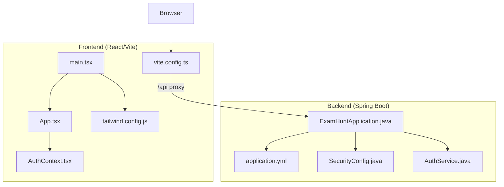
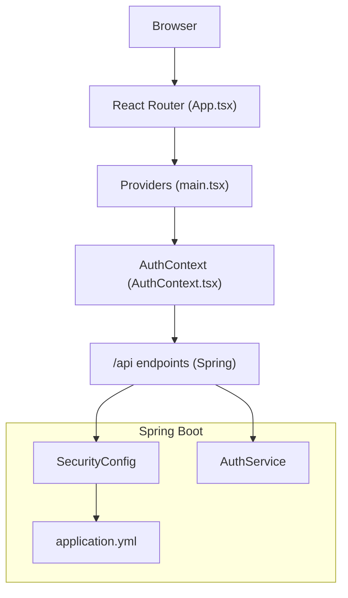
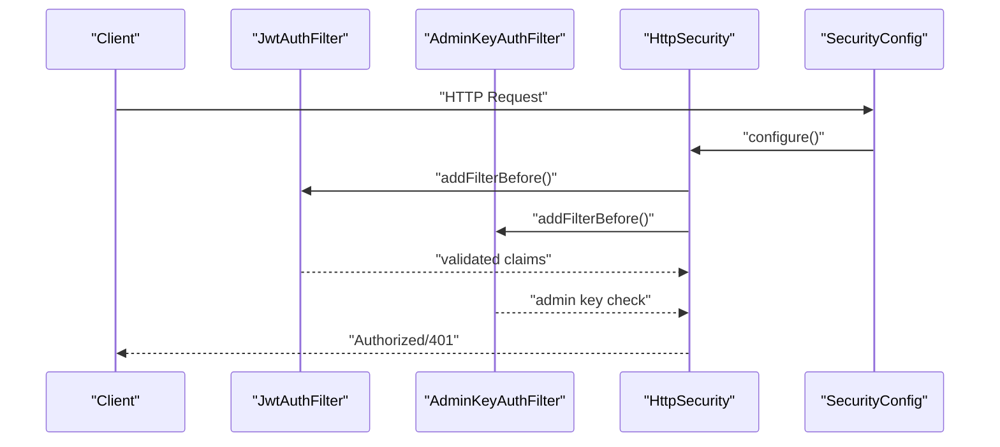
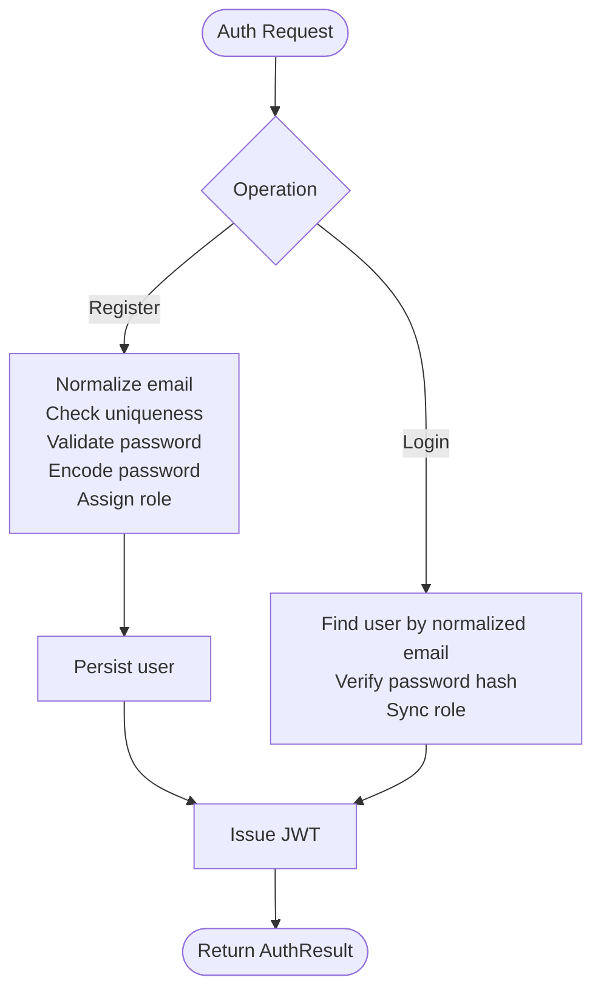
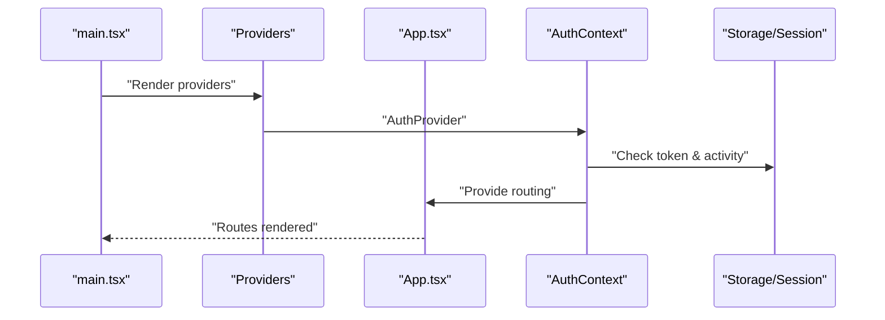
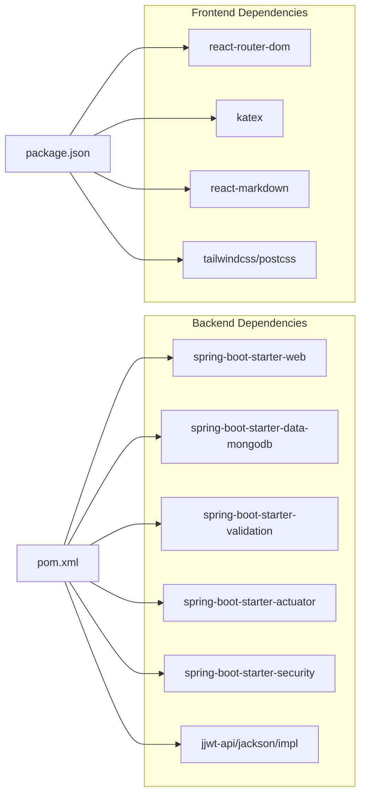

# Development Guidelines

<cite>
**Referenced Files in This Document**
- [README.md](file://README.md)
- [pom.xml](file://backend/pom.xml)
- [application.yml](file://backend/src/main/resources/application.yml)
- [ExamHuntApplication.java](file://backend/src/main/java/com/neetlu/examhunt/ExamHuntApplication.java)
- [SecurityConfig.java](file://backend/src/main/java/com/neetlu/examhunt/config/SecurityConfig.java)
- [AuthService.java](file://backend/src/main/java/com/neetlu/examhunt/service/AuthService.java)
- [Dockerfile](file://backend/Dockerfile)
- [package.json](file://frontend/package.json)
- [tsconfig.json](file://frontend/tsconfig.json)
- [vite.config.ts](file://frontend/vite.config.ts)
- [tailwind.config.js](file://frontend/tailwind.config.js)
- [main.tsx](file://frontend/src/main.tsx)
- [App.tsx](file://frontend/src/App.tsx)
- [AuthContext.tsx](file://frontend/src/auth/AuthContext.tsx)
</cite>

## Table of Contents
1. [Introduction](#introduction)
2. [Project Structure](#project-structure)
3. [Core Components](#core-components)
4. [Architecture Overview](#architecture-overview)
5. [Detailed Component Analysis](#detailed-component-analysis)
6. [Dependency Analysis](#dependency-analysis)
7. [Performance Considerations](#performance-considerations)
8. [Troubleshooting Guide](#troubleshooting-guide)
9. [Conclusion](#conclusion)
10. [Appendices](#appendices)

## Introduction
This document defines development guidelines and best practices for the exam-hunt project. It covers backend Java and frontend TypeScript/React standards, Git workflow and pull request expectations, code review criteria, architectural decisions, contribution procedures, environment setup, debugging, performance optimization, and code quality practices. The guidance is grounded in the repository’s existing configuration and implementation patterns.

## Project Structure
The project is a monorepo with two primary layers:
- Backend: Spring Boot API (Java 17+) serving REST endpoints and integrating with MongoDB.
- Frontend: React SPA (TypeScript) built with Vite, styled via Tailwind CSS.

Ports and layers:
- API: backend on port 8081
- Web: frontend on port 5173 with reverse proxy to backend

**Diagram sources**
- [ExamHuntApplication.java:1-16](file://backend/src/main/java/com/neetlu/examhunt/ExamHuntApplication.java#L1-L16)
- [application.yml:1-44](file://backend/src/main/resources/application.yml#L1-L44)
- [SecurityConfig.java:1-76](file://backend/src/main/java/com/neetlu/examhunt/config/SecurityConfig.java#L1-L76)
- [AuthService.java:1-106](file://backend/src/main/java/com/neetlu/examhunt/service/AuthService.java#L1-L106)
- [main.tsx:1-27](file://frontend/src/main.tsx#L1-L27)
- [App.tsx:1-53](file://frontend/src/App.tsx#L1-L53)
- [AuthContext.tsx:1-183](file://frontend/src/auth/AuthContext.tsx#L1-L183)
- [vite.config.ts:1-20](file://frontend/vite.config.ts#L1-L20)
- [tailwind.config.js:1-106](file://frontend/tailwind.config.js#L1-L106)

**Section sources**
- [README.md:15-18](file://README.md#L15-L18)
- [pom.xml:1-78](file://backend/pom.xml#L1-L78)
- [application.yml:1-44](file://backend/src/main/resources/application.yml#L1-L44)
- [package.json:1-32](file://frontend/package.json#L1-L32)
- [tsconfig.json:1-22](file://frontend/tsconfig.json#L1-L22)
- [vite.config.ts:1-20](file://frontend/vite.config.ts#L1-L20)
- [tailwind.config.js:1-106](file://frontend/tailwind.config.js#L1-L106)
- [main.tsx:1-27](file://frontend/src/main.tsx#L1-L27)
- [App.tsx:1-53](file://frontend/src/App.tsx#L1-L53)
- [AuthContext.tsx:1-183](file://frontend/src/auth/AuthContext.tsx#L1-L183)

## Core Components
- Backend application bootstrap and environment defaults are centralized in the main class and YAML configuration.
- Security is configured with stateless sessions, CORS, and role-based access for admin endpoints.
- Authentication service encapsulates registration, login, and JWT issuance with role synchronization.
- Frontend initializes providers for routing, authentication, analytics, and theming; routes are declared centrally.

Key implementation references:
- Application bootstrap and environment defaults: [ExamHuntApplication.java:1-16](file://backend/src/main/java/com/neetlu/examhunt/ExamHuntApplication.java#L1-L16), [application.yml:1-44](file://backend/src/main/resources/application.yml#L1-L44)
- Security and CORS: [SecurityConfig.java:1-76](file://backend/src/main/java/com/neetlu/examhunt/config/SecurityConfig.java#L1-L76)
- Auth service: [AuthService.java:1-106](file://backend/src/main/java/com/neetlu/examhunt/service/AuthService.java#L1-L106)
- Frontend providers and routing: [main.tsx:1-27](file://frontend/src/main.tsx#L1-L27), [App.tsx:1-53](file://frontend/src/App.tsx#L1-L53), [AuthContext.tsx:1-183](file://frontend/src/auth/AuthContext.tsx#L1-L183)

**Section sources**
- [ExamHuntApplication.java:1-16](file://backend/src/main/java/com/neetlu/examhunt/ExamHuntApplication.java#L1-L16)
- [application.yml:1-44](file://backend/src/main/resources/application.yml#L1-L44)
- [SecurityConfig.java:1-76](file://backend/src/main/java/com/neetlu/examhunt/config/SecurityConfig.java#L1-L76)
- [AuthService.java:1-106](file://backend/src/main/java/com/neetlu/examhunt/service/AuthService.java#L1-L106)
- [main.tsx:1-27](file://frontend/src/main.tsx#L1-L27)
- [App.tsx:1-53](file://frontend/src/App.tsx#L1-L53)
- [AuthContext.tsx:1-183](file://frontend/src/auth/AuthContext.tsx#L1-L183)

## Architecture Overview
The system follows a layered architecture:
- Presentation layer: React SPA with route-driven navigation and provider-based state.
- Business logic: Spring Boot services implementing domain use cases.
- Persistence: MongoDB via Spring Data.
- Security: Stateless JWT and admin key filters with CORS support.

**Diagram sources**
- [App.tsx:1-53](file://frontend/src/App.tsx#L1-L53)
- [main.tsx:1-27](file://frontend/src/main.tsx#L1-L27)
- [AuthContext.tsx:1-183](file://frontend/src/auth/AuthContext.tsx#L1-L183)
- [SecurityConfig.java:1-76](file://backend/src/main/java/com/neetlu/examhunt/config/SecurityConfig.java#L1-L76)
- [application.yml:1-44](file://backend/src/main/resources/application.yml#L1-L44)
- [AuthService.java:1-106](file://backend/src/main/java/com/neetlu/examhunt/service/AuthService.java#L1-L106)

## Detailed Component Analysis

### Backend Security and Access Control
- Stateless JWT-based authentication with role enforcement.
- Admin endpoints protected by a dedicated admin key filter.
- CORS configuration applied from application properties.

**Diagram sources**
- [SecurityConfig.java:42-74](file://backend/src/main/java/com/neetlu/examhunt/config/SecurityConfig.java#L42-L74)

**Section sources**
- [SecurityConfig.java:1-76](file://backend/src/main/java/com/neetlu/examhunt/config/SecurityConfig.java#L1-L76)

### Authentication Service Workflow
- Registration validates uniqueness and password length, normalizes email, assigns default role, and issues JWT.
- Login verifies credentials, synchronizes roles, and issues JWT.
- Role synchronization ensures admin privileges are up-to-date.

**Diagram sources**
- [AuthService.java:31-88](file://backend/src/main/java/com/neetlu/examhunt/service/AuthService.java#L31-L88)

**Section sources**
- [AuthService.java:1-106](file://backend/src/main/java/com/neetlu/examhunt/service/AuthService.java#L1-L106)

### Frontend Routing and Authentication Provider
- Centralized route declarations under a single layout.
- Authentication context manages user state, session activity, idle logout, and analytics user identity.
- Providers initialize theme and analytics on startup.

**Diagram sources**
- [main.tsx:1-27](file://frontend/src/main.tsx#L1-L27)
- [App.tsx:1-53](file://frontend/src/App.tsx#L1-L53)
- [AuthContext.tsx:39-175](file://frontend/src/auth/AuthContext.tsx#L39-L175)

**Section sources**
- [main.tsx:1-27](file://frontend/src/main.tsx#L1-L27)
- [App.tsx:1-53](file://frontend/src/App.tsx#L1-L53)
- [AuthContext.tsx:1-183](file://frontend/src/auth/AuthContext.tsx#L1-L183)

## Dependency Analysis
- Backend dependencies include Spring Web, MongoDB, Validation, Actuator, Security, and JWT libraries.
- Frontend dependencies include React, React Router, KaTeX, React Markdown, and Tailwind CSS toolchain.

**Diagram sources**
- [pom.xml:24-66](file://backend/pom.xml#L24-L66)
- [package.json:11-30](file://frontend/package.json#L11-L30)

**Section sources**
- [pom.xml:1-78](file://backend/pom.xml#L1-L78)
- [package.json:1-32](file://frontend/package.json#L1-L32)

## Performance Considerations
- Backend
  - Use Spring Actuator for health checks and observability.
  - Configure public API caching via application properties to reduce load.
  - Keep sessions stateless to scale horizontally.
- Frontend
  - Leverage Vite’s optimized build pipeline and tree-shaking.
  - Use Tailwind utilities efficiently; avoid excessive dynamic class generation.
  - Debounce or throttle frequent UI updates to minimize re-renders.

[No sources needed since this section provides general guidance]

## Troubleshooting Guide
- Environment variables
  - Ensure environment variables are loaded before starting the backend (see README setup steps).
  - Verify MongoDB URI and extractor paths in environment configuration.
- CORS and proxy
  - Confirm frontend proxy targets the backend port and origin matches CORS configuration.
- Health checks
  - Use Actuator health endpoint to validate runtime status in containers.

**Section sources**
- [README.md:20-72](file://README.md#L20-L72)
- [application.yml:1-44](file://backend/src/main/resources/application.yml#L1-L44)
- [vite.config.ts:9-18](file://frontend/vite.config.ts#L9-L18)
- [Dockerfile:39-42](file://backend/Dockerfile#L39-L42)

## Conclusion
These guidelines consolidate the project’s current standards and patterns into actionable practices for contributors. By adhering to the outlined conventions—naming, structure, security posture, testing readiness, and operational hygiene—you help maintain a consistent, secure, and scalable codebase.

[No sources needed since this section summarizes without analyzing specific files]

## Appendices

### A. Backend Java Standards
- Package naming: com.neetlu.examhunt.* packages for domain boundaries.
- Services: annotate with @Service; keep business logic cohesive and free of HTTP concerns.
- Controllers: expose REST endpoints; delegate to services; keep thin controllers.
- Exceptions: use Spring MVC’s @ExceptionHandler or global handler pattern; return appropriate HTTP status codes.
- Configuration: externalize properties via application.yml; apply via @ConfigurationProperties or @Value.
- Security: stateless JWT; enforce roles per endpoint; centralize CORS configuration.
- Testing: write unit tests for services and integration tests for repositories; keep tests isolated and deterministic.

**Section sources**
- [SecurityConfig.java:1-76](file://backend/src/main/java/com/neetlu/examhunt/config/SecurityConfig.java#L1-L76)
- [AuthService.java:1-106](file://backend/src/main/java/com/neetlu/examhunt/service/AuthService.java#L1-L106)
- [application.yml:1-44](file://backend/src/main/resources/application.yml#L1-L44)

### B. Frontend TypeScript/React Standards
- Strict TypeScript: enable strict, unused locals/parameters, and no fallthrough switches.
- Component composition: prefer small, single-responsibility components; group related logic in hooks.
- State management: use React Context minimally; centralize auth and platform settings via providers.
- Routing: declare routes in a single location; reuse layouts for consistent navigation.
- Styling: rely on Tailwind classes; define design tokens in Tailwind config; avoid inline styles.
- Build and tooling: Vite for dev/build; PostCSS/Tailwind for styling pipeline.

**Section sources**
- [tsconfig.json:1-22](file://frontend/tsconfig.json#L1-L22)
- [tailwind.config.js:1-106](file://frontend/tailwind.config.js#L1-L106)
- [vite.config.ts:1-20](file://frontend/vite.config.ts#L1-L20)
- [App.tsx:1-53](file://frontend/src/App.tsx#L1-L53)
- [AuthContext.tsx:1-183](file://frontend/src/auth/AuthContext.tsx#L1-L183)

### C. Git Workflow, Pull Requests, and Code Review
- Branching
  - Feature branches: feature/short-description
  - Hotfix branches: hotfix/issue-id
- Commit messages
  - Use imperative mood; prefix with component or module (e.g., backend: add validation)
- Pull requests
  - Target develop or main based on project policy
  - Include summary, rationale, testing notes, and screenshots for UI changes
  - Assign reviewers; address comments promptly
- Code review checklist
  - Correctness, readability, performance, security, tests, and documentation
  - No hardcoded secrets; environment variables preferred
  - Consistent naming and structure adherence

[No sources needed since this section provides general guidance]

### D. Contribution Guidelines and Issue Reporting
- Fork and branch per feature
- Open an issue before large PRs to discuss design
- Follow repository’s code style and testing requirements
- Keep commits small and focused

[No sources needed since this section provides general guidance]

### E. Development Environment Setup
- Backend
  - Java 17+ and Maven
  - MongoDB Atlas (recommended region for latency)
  - Set environment variables and run Spring Boot app
- Frontend
  - Node 20+
  - Install dependencies and run dev server
  - Proxy to backend port 8081

**Section sources**
- [README.md:20-72](file://README.md#L20-L72)

### F. Debugging Techniques
- Backend
  - Enable logging for service layers; use Actuator endpoints
  - Validate JWT and admin key filtering in SecurityConfig
- Frontend
  - Inspect provider initialization order and token presence
  - Monitor network tab for proxy and API responses

**Section sources**
- [application.yml:35-44](file://backend/src/main/resources/application.yml#L35-L44)
- [SecurityConfig.java:42-74](file://backend/src/main/java/com/neetlu/examhunt/config/SecurityConfig.java#L42-L74)
- [main.tsx:13-26](file://frontend/src/main.tsx#L13-L26)

### G. Architectural Principles
- Separation of concerns: controllers, services, repositories
- Immutable DTOs and records for transport types
- Explicit configuration over hardcoding
- Stateless services for scalability
- Minimal, declarative UI with centralized routing and providers

**Section sources**
- [AuthService.java:102-104](file://backend/src/main/java/com/neetlu/examhunt/service/AuthService.java#L102-L104)
- [App.tsx:21-52](file://frontend/src/App.tsx#L21-L52)

### H. Containerization and Health Checks
- Multi-stage Docker build with health check against Actuator health endpoint
- Expose application port and pass build metadata via labels

**Section sources**
- [Dockerfile:1-43](file://backend/Dockerfile#L1-L43)