# Build and Deployment

<cite>
**Referenced Files in This Document**
- [package.json](file://frontend/package.json)
- [vite.config.ts](file://frontend/vite.config.ts)
- [tsconfig.json](file://frontend/tsconfig.json)
- [postcss.config.js](file://frontend/postcss.config.js)
- [tailwind.config.js](file://frontend/tailwind.config.js)
- [index.html](file://frontend/index.html)
- [main.tsx](file://frontend/src/main.tsx)
- [styles.css](file://frontend/src/styles.css)
- [site.webmanifest](file://frontend/public/site.webmanifest)
- [robots.txt](file://frontend/public/robots.txt)
- [docker-compose.yml](file://deploy/ec2/docker-compose.yml)
- [deployment.md](file://docs/deployment.md)
</cite>

## Table of Contents
1. [Introduction](#introduction)
2. [Project Structure](#project-structure)
3. [Core Components](#core-components)
4. [Architecture Overview](#architecture-overview)
5. [Detailed Component Analysis](#detailed-component-analysis)
6. [Dependency Analysis](#dependency-analysis)
7. [Performance Considerations](#performance-considerations)
8. [Troubleshooting Guide](#troubleshooting-guide)
9. [Conclusion](#conclusion)
10. [Appendices](#appendices)

## Introduction
This document explains the frontend build system and deployment pipeline for the project. It covers Vite configuration, TypeScript compilation, PostCSS and Tailwind CSS integration, environment variable management, build targets, and deployment configurations. It also outlines dependency management via package.json scripts, build optimization techniques, bundle analysis guidance, and deployment guidelines for multiple environments with CI patterns.

## Project Structure
The frontend build system centers on Vite, TypeScript, and PostCSS/Tailwind CSS. Key files include:
- Build and tooling: vite.config.ts, package.json
- Type checking and compilation: tsconfig.json
- Styling pipeline: postcss.config.js, tailwind.config.js, styles.css
- Application entry and HTML template: main.tsx, index.html
- PWA assets: site.webmanifest, robots.txt
- Deployment and CI: docker-compose.yml, docs/deployment.md

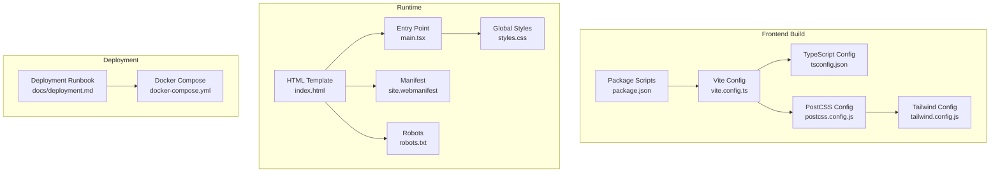

**Diagram sources**
- [vite.config.ts:1-20](file://frontend/vite.config.ts#L1-L20)
- [tsconfig.json:1-22](file://frontend/tsconfig.json#L1-L22)
- [postcss.config.js:1-7](file://frontend/postcss.config.js#L1-L7)
- [tailwind.config.js:1-106](file://frontend/tailwind.config.js#L1-L106)
- [package.json:1-32](file://frontend/package.json#L1-L32)
- [index.html:1-59](file://frontend/index.html#L1-L59)
- [main.tsx:1-27](file://frontend/src/main.tsx#L1-L27)
- [styles.css:1-800](file://frontend/src/styles.css#L1-L800)
- [site.webmanifest:1-20](file://frontend/public/site.webmanifest#L1-L20)
- [robots.txt:1-11](file://frontend/public/robots.txt#L1-L11)
- [docker-compose.yml:1-30](file://deploy/ec2/docker-compose.yml#L1-L30)
- [deployment.md:1-353](file://docs/deployment.md#L1-L353)

**Section sources**
- [package.json:1-32](file://frontend/package.json#L1-L32)
- [vite.config.ts:1-20](file://frontend/vite.config.ts#L1-L20)
- [tsconfig.json:1-22](file://frontend/tsconfig.json#L1-L22)
- [postcss.config.js:1-7](file://frontend/postcss.config.js#L1-L7)
- [tailwind.config.js:1-106](file://frontend/tailwind.config.js#L1-L106)
- [index.html:1-59](file://frontend/index.html#L1-L59)
- [main.tsx:1-27](file://frontend/src/main.tsx#L1-L27)
- [styles.css:1-800](file://frontend/src/styles.css#L1-L800)
- [site.webmanifest:1-20](file://frontend/public/site.webmanifest#L1-L20)
- [robots.txt:1-11](file://frontend/public/robots.txt#L1-L11)
- [docker-compose.yml:1-30](file://deploy/ec2/docker-compose.yml#L1-L30)
- [deployment.md:1-353](file://docs/deployment.md#L1-L353)

## Core Components
- Vite configuration defines the React plugin, PostCSS integration, development server, and API proxy to the backend.
- TypeScript configuration enforces strictness, ES target, JSX transform, and bundler module resolution.
- PostCSS and Tailwind CSS configure autoprefixing and a design-token-driven theme with CSS variables.
- Package scripts orchestrate dev, build, and preview tasks.
- Runtime entry initializes routing, providers, analytics, theme, and global styles.
- PWA assets provide manifest and robots directives.

**Section sources**
- [vite.config.ts:1-20](file://frontend/vite.config.ts#L1-L20)
- [tsconfig.json:1-22](file://frontend/tsconfig.json#L1-L22)
- [postcss.config.js:1-7](file://frontend/postcss.config.js#L1-L7)
- [tailwind.config.js:1-106](file://frontend/tailwind.config.js#L1-L106)
- [package.json:6-10](file://frontend/package.json#L6-L10)
- [main.tsx:1-27](file://frontend/src/main.tsx#L1-L27)
- [index.html:1-59](file://frontend/index.html#L1-L59)
- [site.webmanifest:1-20](file://frontend/public/site.webmanifest#L1-L20)
- [robots.txt:1-11](file://frontend/public/robots.txt#L1-L11)

## Architecture Overview
The frontend build pipeline integrates TypeScript compilation, Vite bundling, and PostCSS/Tailwind processing. The development server proxies API calls to the backend. Production builds are deployed to Cloudflare Pages, while the backend runs on AWS EC2 via Docker Compose.

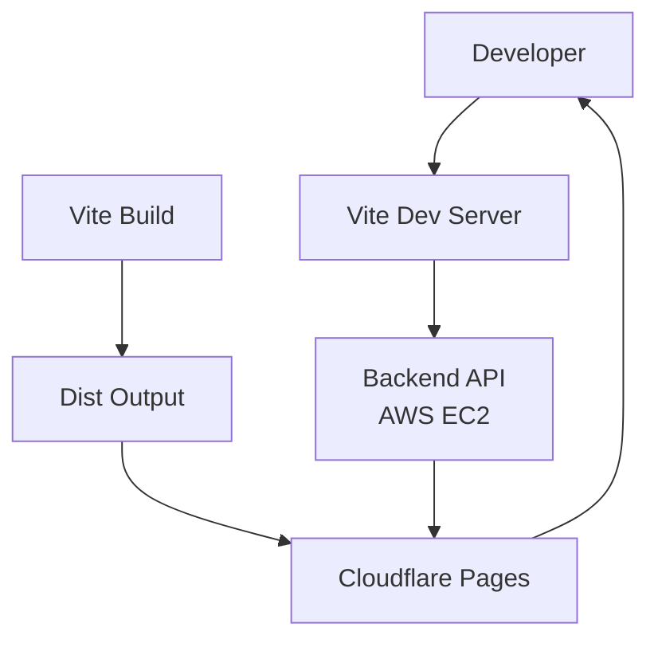

**Diagram sources**
- [vite.config.ts:9-18](file://frontend/vite.config.ts#L9-L18)
- [deployment.md:200-217](file://docs/deployment.md#L200-L217)
- [docker-compose.yml:1-30](file://deploy/ec2/docker-compose.yml#L1-L30)

## Detailed Component Analysis

### Vite Configuration
- Plugin stack: React plugin enables fast refresh and JSX transforms.
- CSS: PostCSS configured via external config file.
- Dev server: port 5173 with strictPort and API proxy to backend on localhost:8081.
- Environment variable prefix: VITE_* is exposed to client code.

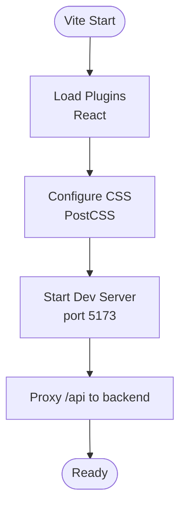

**Diagram sources**
- [vite.config.ts:1-20](file://frontend/vite.config.ts#L1-L20)

**Section sources**
- [vite.config.ts:1-20](file://frontend/vite.config.ts#L1-L20)

### TypeScript Configuration
- Targets ES2022 with DOM/Iterable libs.
- Module resolution optimized for bundlers.
- Strict compiler options enabled (unused locals/params, no fallthrough, unchecked side-effect imports).
- JSX transform set to react-jsx.
- No emit during build script; Vite handles emitting.

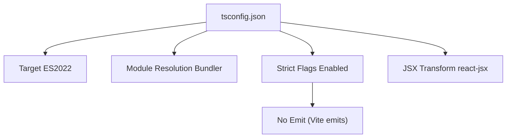

**Diagram sources**
- [tsconfig.json:1-22](file://frontend/tsconfig.json#L1-L22)

**Section sources**
- [tsconfig.json:1-22](file://frontend/tsconfig.json#L1-L22)

### PostCSS and Tailwind CSS Integration
- PostCSS plugins: Tailwind CSS and Autoprefixer.
- Tailwind dark mode via class strategy.
- Content scanning globs include index.html and all TS/JS/TSX/JSX sources.
- Theme extends colors, spacing, typography, and background images using CSS variables mapped to design tokens.
- No additional Tailwind plugins configured.

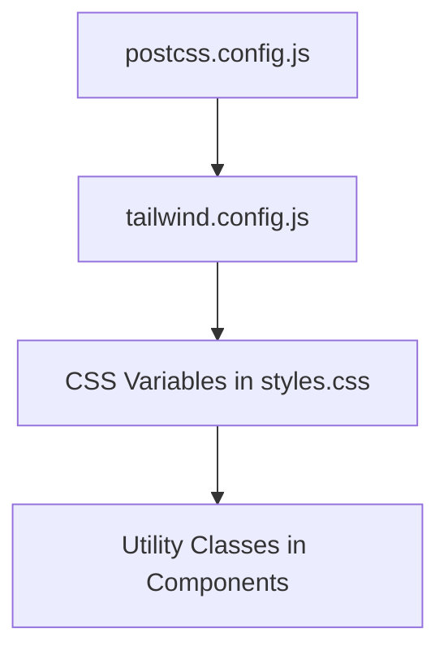

**Diagram sources**
- [postcss.config.js:1-7](file://frontend/postcss.config.js#L1-L7)
- [tailwind.config.js:1-106](file://frontend/tailwind.config.js#L1-L106)
- [styles.css:1-800](file://frontend/src/styles.css#L1-L800)

**Section sources**
- [postcss.config.js:1-7](file://frontend/postcss.config.js#L1-L7)
- [tailwind.config.js:1-106](file://frontend/tailwind.config.js#L1-L106)
- [styles.css:1-800](file://frontend/src/styles.css#L1-L800)

### Build Targets and Scripts
- Scripts:
  - dev: starts Vite dev server.
  - build: runs TypeScript type check without emit, then Vite build.
  - preview: serves built assets locally.
- Build output directory is configured in the Cloudflare Pages runbook.

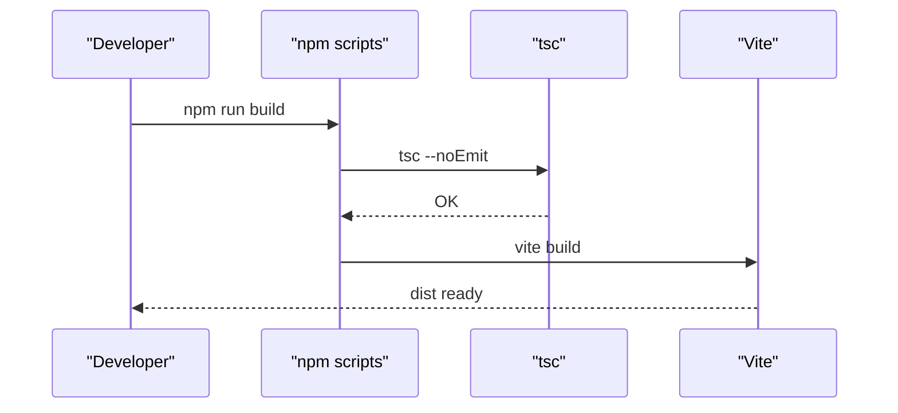

**Diagram sources**
- [package.json:6-10](file://frontend/package.json#L6-L10)

**Section sources**
- [package.json:6-10](file://frontend/package.json#L6-L10)

### Environment Variable Management
- Client variables must be prefixed with VITE_ to be embedded at build time.
- Production Pages environment variables include API base URL and optional analytics tokens.
- Local development supports analytics toggle via VITE_ANALYTICS_ENABLED.

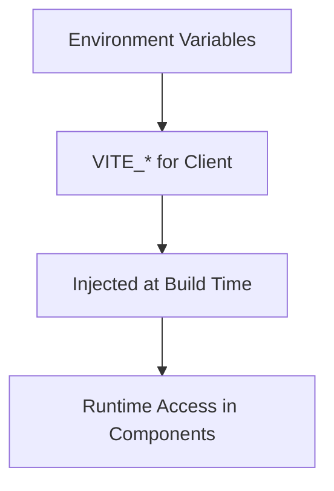

**Diagram sources**
- [deployment.md:210-236](file://docs/deployment.md#L210-L236)

**Section sources**
- [deployment.md:210-236](file://docs/deployment.md#L210-L236)

### Asset Handling and PWA
- HTML template sets theme defaults, meta tags, Open Graph, Twitter, and links to manifest and fonts.
- Global styles define CSS variables and responsive app shell.
- Manifest and robots are served from public assets.

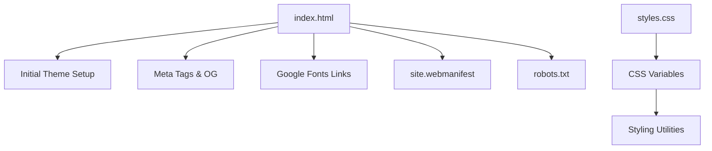

**Diagram sources**
- [index.html:1-59](file://frontend/index.html#L1-L59)
- [styles.css:1-800](file://frontend/src/styles.css#L1-L800)
- [site.webmanifest:1-20](file://frontend/public/site.webmanifest#L1-L20)
- [robots.txt:1-11](file://frontend/public/robots.txt#L1-L11)

**Section sources**
- [index.html:1-59](file://frontend/index.html#L1-L59)
- [styles.css:1-800](file://frontend/src/styles.css#L1-L800)
- [site.webmanifest:1-20](file://frontend/public/site.webmanifest#L1-L20)
- [robots.txt:1-11](file://frontend/public/robots.txt#L1-L11)

### Runtime Initialization
- Entry point initializes theme, analytics, providers, and mounts the React app inside BrowserRouter.

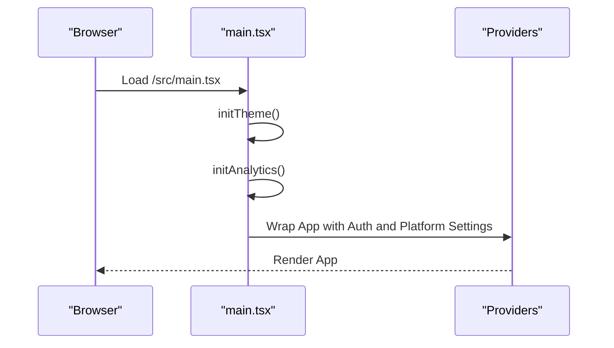

**Diagram sources**
- [main.tsx:1-27](file://frontend/src/main.tsx#L1-L27)

**Section sources**
- [main.tsx:1-27](file://frontend/src/main.tsx#L1-L27)

### Backend Proxy and Development Workflow
- Vite dev server proxies /api to backend running on localhost:8081.
- This enables local development against the real backend without CORS concerns.

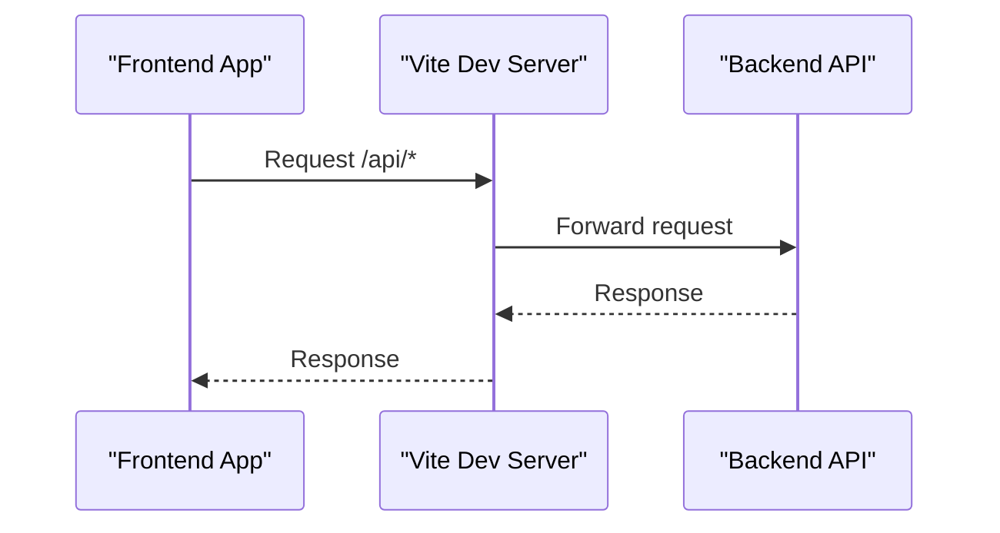

**Diagram sources**
- [vite.config.ts:12-17](file://frontend/vite.config.ts#L12-L17)

**Section sources**
- [vite.config.ts:12-17](file://frontend/vite.config.ts#L12-L17)

### Deployment Pipeline
- Frontend: Built by Cloudflare Pages using npm run build and serving from dist.
- Backend: Docker Compose runs the Spring Boot API on port 8081 behind Nginx.
- CI: Backend image built and pushed to GHCR on main pushes; Watchtower auto-updates containers.

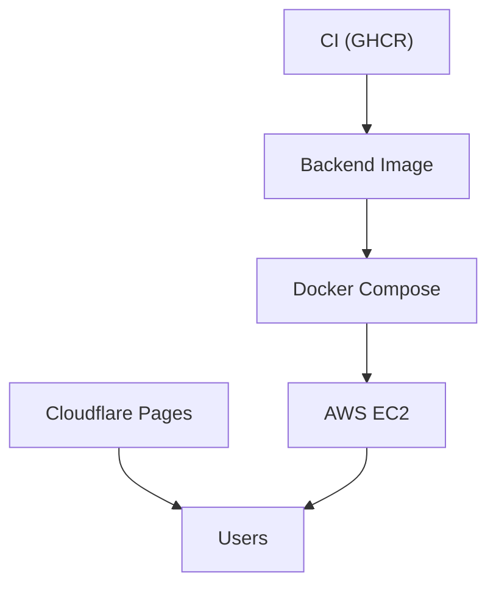

**Diagram sources**
- [deployment.md:145-154](file://docs/deployment.md#L145-L154)
- [docker-compose.yml:1-30](file://deploy/ec2/docker-compose.yml#L1-L30)

**Section sources**
- [deployment.md:145-154](file://docs/deployment.md#L145-L154)
- [docker-compose.yml:1-30](file://deploy/ec2/docker-compose.yml#L1-L30)

## Dependency Analysis
- Build-time dependencies: Vite, React plugin, TypeScript, PostCSS, Tailwind CSS, Autoprefixer.
- Runtime dependencies: React, React DOM, React Router, KaTeX, remark/rehype ecosystem for math rendering.
- Scripts orchestrate type-checking pre-build, then bundling.

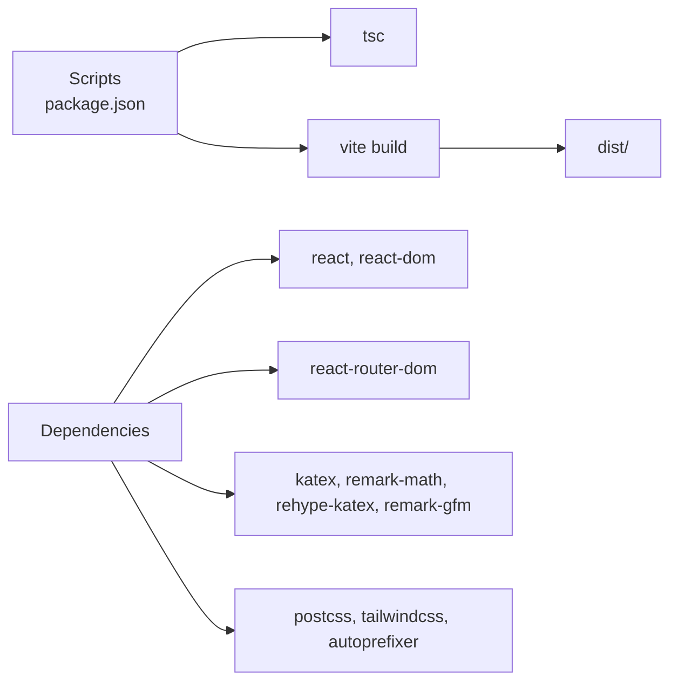

**Diagram sources**
- [package.json:11-30](file://frontend/package.json#L11-L30)
- [package.json:6-10](file://frontend/package.json#L6-L10)

**Section sources**
- [package.json:11-30](file://frontend/package.json#L11-L30)
- [package.json:6-10](file://frontend/package.json#L6-L10)

## Performance Considerations
- Bundle analysis: Use Vite’s built-in preview server and browser devtools Network panel to inspect bundle sizes and network requests.
- CSS optimization: Tailwind purges unused classes based on content globs; keep globs accurate to minimize CSS size.
- Assets: Serve static assets via CDN (Pages) and ensure appropriate cache headers from backend.
- Lazy loading: Split routes/components to reduce initial bundle size.
- Tree shaking: Keep imports granular; avoid importing entire libraries.
- Minification and hashing: Vite performs default minification and asset hashing in production builds.

[No sources needed since this section provides general guidance]

## Troubleshooting Guide
- Vite dev server port conflicts: strictPort prevents fallback; adjust port or stop conflicting processes.
- API proxy errors: verify backend is reachable at target host/port and CORS settings.
- Tailwind utilities missing: ensure content globs include all component files and rebuild.
- CSS variables not applied: confirm CSS variables are defined in :root and data-theme selectors.
- Cloudflare Pages build failures: check build command and output directory match runbook settings.
- Backend connectivity: confirm VITE_API_BASE_URL points to the correct API domain.

**Section sources**
- [vite.config.ts:9-18](file://frontend/vite.config.ts#L9-L18)
- [tailwind.config.js:4](file://frontend/tailwind.config.js#L4)
- [styles.css:1-800](file://frontend/src/styles.css#L1-L800)
- [deployment.md:200-217](file://docs/deployment.md#L200-L217)

## Conclusion
The frontend build system leverages Vite for rapid development and efficient production builds, TypeScript for type safety, and PostCSS/Tailwind for scalable styling. Environment variables are cleanly separated for client and server contexts, and the deployment pipeline integrates Cloudflare Pages for frontend delivery and AWS EC2 for backend hosting with automated updates.

[No sources needed since this section summarizes without analyzing specific files]

## Appendices

### Build and Preview Commands
- Development: npm run dev
- Build: npm run build
- Preview: npm run preview

**Section sources**
- [package.json:6-10](file://frontend/package.json#L6-L10)

### Cloudflare Pages Build Settings
- Root directory: frontend
- Build command: npm run build
- Build output directory: dist
- Production environment variables:
  - VITE_API_BASE_URL
  - Optional: VITE_CF_WEB_ANALYTICS_TOKEN, VITE_GA_MEASUREMENT_ID, VITE_PLAUSIBLE_DOMAIN

**Section sources**
- [deployment.md:200-236](file://docs/deployment.md#L200-L236)

### Backend Deployment Notes
- Backend image: ghcr.io/nazir098/exam-hunt-project/exam-hunt-api:latest
- Watchtower auto-updates containers
- Health checks and proxy configuration documented in runbook

**Section sources**
- [deployment.md:145-154](file://docs/deployment.md#L145-L154)
- [docker-compose.yml:1-30](file://deploy/ec2/docker-compose.yml#L1-L30)