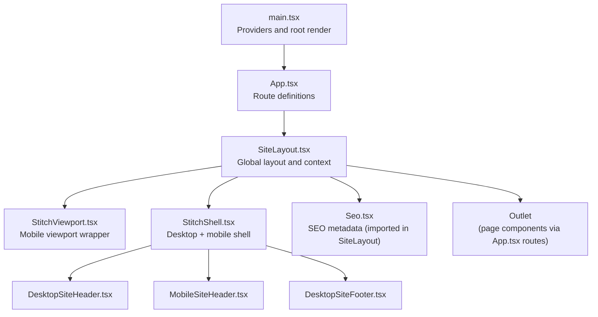
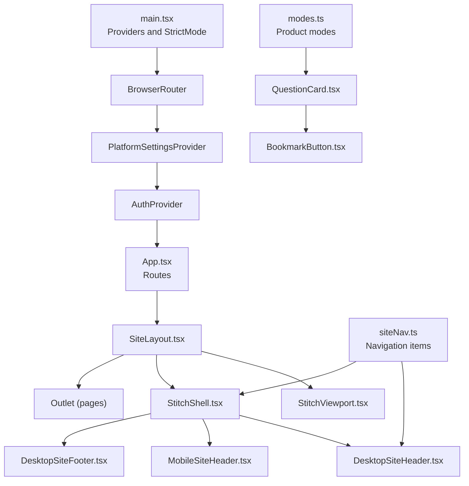
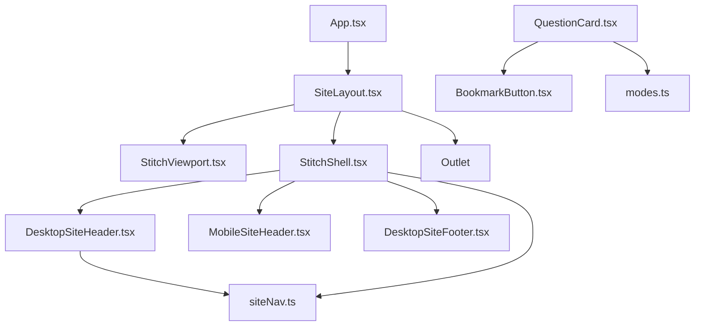

# Component System

<cite>
**Referenced Files in This Document**
- [main.tsx](file://frontend/src/main.tsx)
- [App.tsx](file://frontend/src/App.tsx)
- [SiteLayout.tsx](file://frontend/src/components/SiteLayout.tsx)
- [StitchShell.tsx](file://frontend/src/components/StitchShell.tsx)
- [StitchViewport.tsx](file://frontend/src/components/StitchViewport.tsx)
- [DesktopSiteHeader.tsx](file://frontend/src/components/DesktopSiteHeader.tsx)
- [MobileSiteHeader.tsx](file://frontend/src/components/MobileSiteHeader.tsx)
- [DesktopSiteFooter.tsx](file://frontend/src/components/DesktopSiteFooter.tsx)
- [BottomNav.tsx](file://frontend/src/components/BottomNav.tsx)
- [ProfileMenu.tsx](file://frontend/src/components/ProfileMenu.tsx)
- [QuestionCard.tsx](file://frontend/src/components/QuestionCard.tsx)
- [BookmarkButton.tsx](file://frontend/src/components/BookmarkButton.tsx)
- [siteNav.ts](file://frontend/src/navigation/siteNav.ts)
- [modes.ts](file://frontend/src/navigation/modes.ts)
</cite>

## Table of Contents
1. [Introduction](#introduction)
2. [Project Structure](#project-structure)
3. [Core Components](#core-components)
4. [Architecture Overview](#architecture-overview)
5. [Detailed Component Analysis](#detailed-component-analysis)
6. [Dependency Analysis](#dependency-analysis)
7. [Performance Considerations](#performance-considerations)
8. [Troubleshooting Guide](#troubleshooting-guide)
9. [Conclusion](#conclusion)
10. [Appendices](#appendices)

## Introduction
This document describes the React component system architecture for the frontend. It focuses on the layout and navigation shell, reusable UI components, and patterns for composition, props, lifecycle, styling with Tailwind CSS, and component communication. The primary entry point initializes providers and routing, while SiteLayout orchestrates the global layout and practice session creation. Child components like QuestionCard and BookmarkButton demonstrate reusable patterns and integration with authentication, platform settings, and API services.

## Project Structure
The frontend bootstraps providers and routes inside a strict React tree. Routing wraps most pages under SiteLayout, which composes desktop/mobile headers, a viewport container, a shell, and a footer. Navigation utilities define site-wide navigation items and product modes.

**Diagram sources**
- [main.tsx:16-26](file://frontend/src/main.tsx#L16-L26)
- [App.tsx:21-52](file://frontend/src/App.tsx#L21-L52)
- [SiteLayout.tsx:17-119](file://frontend/src/components/SiteLayout.tsx#L17-L119)
- [StitchViewport.tsx:6-14](file://frontend/src/components/StitchViewport.tsx#L6-L14)
- [StitchShell.tsx:12-63](file://frontend/src/components/StitchShell.tsx#L12-L63)
- [DesktopSiteHeader.tsx:12-80](file://frontend/src/components/DesktopSiteHeader.tsx#L12-L80)
- [MobileSiteHeader.tsx:7-73](file://frontend/src/components/MobileSiteHeader.tsx#L7-L73)
- [DesktopSiteFooter.tsx:5-28](file://frontend/src/components/DesktopSiteFooter.tsx#L5-L28)

**Section sources**
- [main.tsx:13-26](file://frontend/src/main.tsx#L13-L26)
- [App.tsx:21-52](file://frontend/src/App.tsx#L21-L52)

## Core Components
- SiteLayout: Provides global layout, SEO, mobile chrome behavior, and a shared context for starting practice sessions. It conditionally renders either a full shell with desktop/mobile navigation or a minimal viewport for specific routes.
- StitchViewport: Wraps content with a responsive viewport container, applying background and centering on mobile.
- StitchShell: Composes desktop and mobile headers, page content area, footer, and a bottom navigation bar for mobile.
- DesktopSiteHeader and MobileSiteHeader: Desktop and mobile navigation bars with branding, search, and profile actions.
- DesktopSiteFooter: Persistent footer with branding and messaging.
- BottomNav: Simplified bottom navigation for mobile contexts.
- ProfileMenu: User account dropdown with portal rendering and dynamic positioning.
- QuestionCard: Reusable card displaying question metadata and action buttons (solve, practice, test) with bookmark integration.
- BookmarkButton: Reusable bookmark toggle with controlled/uncontrolled modes, busy states, and authentication gating.

**Section sources**
- [SiteLayout.tsx:17-119](file://frontend/src/components/SiteLayout.tsx#L17-L119)
- [StitchViewport.tsx:6-14](file://frontend/src/components/StitchViewport.tsx#L6-L14)
- [StitchShell.tsx:12-63](file://frontend/src/components/StitchShell.tsx#L12-L63)
- [DesktopSiteHeader.tsx:12-80](file://frontend/src/components/DesktopSiteHeader.tsx#L12-L80)
- [MobileSiteHeader.tsx:7-73](file://frontend/src/components/MobileSiteHeader.tsx#L7-L73)
- [DesktopSiteFooter.tsx:5-28](file://frontend/src/components/DesktopSiteFooter.tsx#L5-L28)
- [BottomNav.tsx:11-49](file://frontend/src/components/BottomNav.tsx#L11-L49)
- [ProfileMenu.tsx:10-125](file://frontend/src/components/ProfileMenu.tsx#L10-L125)
- [QuestionCard.tsx:29-84](file://frontend/src/components/QuestionCard.tsx#L29-L84)
- [BookmarkButton.tsx:18-118](file://frontend/src/components/BookmarkButton.tsx#L18-L118)

## Architecture Overview
The layout and navigation architecture centers around SiteLayout and its child shells. Providers initialize theme and analytics at startup. Routing defines protected and public pages, with most pages rendered under SiteLayout. Navigation utilities define site items and product modes used across components.

**Diagram sources**
- [main.tsx:16-26](file://frontend/src/main.tsx#L16-L26)
- [App.tsx:21-52](file://frontend/src/App.tsx#L21-L52)
- [SiteLayout.tsx:17-119](file://frontend/src/components/SiteLayout.tsx#L17-L119)
- [StitchViewport.tsx:6-14](file://frontend/src/components/StitchViewport.tsx#L6-L14)
- [StitchShell.tsx:12-63](file://frontend/src/components/StitchShell.tsx#L12-L63)
- [DesktopSiteHeader.tsx:12-80](file://frontend/src/components/DesktopSiteHeader.tsx#L12-L80)
- [MobileSiteHeader.tsx:7-73](file://frontend/src/components/MobileSiteHeader.tsx#L7-L73)
- [DesktopSiteFooter.tsx:5-28](file://frontend/src/components/DesktopSiteFooter.tsx#L5-L28)
- [siteNav.ts:12-44](file://frontend/src/navigation/siteNav.ts#L12-L44)
- [modes.ts:3-31](file://frontend/src/navigation/modes.ts#L3-L31)
- [QuestionCard.tsx:29-84](file://frontend/src/components/QuestionCard.tsx#L29-L84)
- [BookmarkButton.tsx:18-118](file://frontend/src/components/BookmarkButton.tsx#L18-L118)

## Detailed Component Analysis

### SiteLayout
Responsibilities:
- Exposes a shared context to child pages enabling “start practice” from question lists.
- Handles authentication gating and redirects to login when practice is initiated without a user.
- Determines whether to show a minimal viewport (for specific routes) versus a full shell with desktop/mobile navigation.
- Integrates SEO metadata and stitching viewport/shell wrappers.

Key behaviors:
- Computes practice eligibility and route conditions.
- Creates practice sessions via API and navigates to the first question.
- Propagates loading/busy state to child components.

Communication pattern:
- Uses react-router’s Outlet with a context object containing startPracticeFromBank and practiceBusy.
- Conditionally renders either a minimal viewport or a full shell.

Lifecycle:
- Uses useState for local busy state and effects for navigation and error handling.

**Section sources**
- [SiteLayout.tsx:17-119](file://frontend/src/components/SiteLayout.tsx#L17-L119)

### QuestionCard
Responsibilities:
- Renders question preview metadata and action buttons.
- Integrates BookmarkButton for saving/removing bookmarks.
- Provides links to solve, practice, and test creation modes.

Props interface:
- question: QuestionPublic
- packId: string
- bookmarkSaved?: boolean
- onBookmarkChange?: (saved: boolean) => void
- bookmarkBatchStatus?: boolean

Composition:
- Uses MODES constants for tooltips and labels.
- Reads search params from the current location.
- Receives startPracticeFromBank via Outlet context to initiate practice sessions.

**Section sources**
- [QuestionCard.tsx:7-18](file://frontend/src/components/QuestionCard.tsx#L7-L18)
- [QuestionCard.tsx:29-84](file://frontend/src/components/QuestionCard.tsx#L29-L84)
- [modes.ts:3-31](file://frontend/src/navigation/modes.ts#L3-L31)

### BookmarkButton
Responsibilities:
- Toggles bookmark state for a given question.
- Supports controlled and uncontrolled modes.
- Handles authentication gating and platform settings.

Props interface:
- questionId: string
- variant?: "icon" | "full"
- className?: string
- saved?: boolean
- onSavedChange?: (saved: boolean) => void
- batchStatus?: boolean

Behavior:
- Fetches initial bookmark status when user and settings permit.
- Updates local or controlled state upon toggle.
- Disables interactions during async operations.

**Section sources**
- [BookmarkButton.tsx:7-25](file://frontend/src/components/BookmarkButton.tsx#L7-L25)
- [BookmarkButton.tsx:18-118](file://frontend/src/components/BookmarkButton.tsx#L18-L118)

### Navigation Components
- DesktopSiteHeader: Desktop navigation row with branding, search, and profile menu. Uses siteNav items and toggles minimal mode.
- MobileSiteHeader: Collapsible search form and profile menu for mobile.
- BottomNav: Simplified bottom navigation tailored for specific routes.
- ProfileMenu: Portal-rendered dropdown with dynamic positioning and keyboard/mouse dismissal.

**Section sources**
- [DesktopSiteHeader.tsx:12-80](file://frontend/src/components/DesktopSiteHeader.tsx#L12-L80)
- [MobileSiteHeader.tsx:7-73](file://frontend/src/components/MobileSiteHeader.tsx#L7-L73)
- [BottomNav.tsx:11-49](file://frontend/src/components/BottomNav.tsx#L11-L49)
- [ProfileMenu.tsx:10-125](file://frontend/src/components/ProfileMenu.tsx#L10-L125)
- [siteNav.ts:12-44](file://frontend/src/navigation/siteNav.ts#L12-L44)

### Layout Shells
- StitchViewport: Mobile-centered frame with background adjustments for mobile/desktop.
- StitchShell: Full-page shell composing desktop/mobile headers, page content, footer, and bottom navigation.

**Section sources**
- [StitchViewport.tsx:6-14](file://frontend/src/components/StitchViewport.tsx#L6-L14)
- [StitchShell.tsx:12-63](file://frontend/src/components/StitchShell.tsx#L12-L63)

### Component Composition Patterns
- Context propagation: SiteLayout passes startPracticeFromBank and practiceBusy to pages via Outlet context.
- Controlled vs uncontrolled: BookmarkButton supports controlled mode via props and batchStatus to avoid per-item fetches.
- Composition via children: Layout components accept children and wrap them with headers, footers, and navigation.

**Section sources**
- [SiteLayout.tsx:96](file://frontend/src/components/SiteLayout.tsx#L96)
- [BookmarkButton.tsx:30-31](file://frontend/src/components/BookmarkButton.tsx#L30-L31)

### Component Lifecycle Management
- Authentication and settings checks gate feature availability (e.g., bookmarks).
- Effects fetch initial state when user and settings are ready.
- Busy states prevent concurrent operations and reflect loading in UI.

**Section sources**
- [BookmarkButton.tsx:33-49](file://frontend/src/components/BookmarkButton.tsx#L33-L49)
- [SiteLayout.tsx:21-87](file://frontend/src/components/SiteLayout.tsx#L21-L87)

### Styling Integration with Tailwind CSS
- Components apply Tailwind utility classes directly for responsive layouts, spacing, and theming.
- Viewport and shell components adjust backgrounds and shadows for mobile/desktop experiences.
- Icons use Material Symbols with Tailwind modifiers for sizing and fill states.

**Section sources**
- [StitchViewport.tsx:8-12](file://frontend/src/components/StitchViewport.tsx#L8-L12)
- [StitchShell.tsx:22-61](file://frontend/src/components/StitchShell.tsx#L22-L61)
- [BookmarkButton.tsx:87-117](file://frontend/src/components/BookmarkButton.tsx#L87-L117)

### Component Communication and State Propagation
- Outlet context: SiteLayout exposes startPracticeFromBank and practiceBusy to pages.
- Controlled props: BookmarkButton accepts saved and onSavedChange to coordinate batch updates.
- Event handlers: Buttons and links handle clicks and form submissions, updating state and navigating.

**Section sources**
- [SiteLayout.tsx:96](file://frontend/src/components/SiteLayout.tsx#L96)
- [QuestionCard.tsx:63-73](file://frontend/src/components/QuestionCard.tsx#L63-L73)
- [BookmarkButton.tsx:51-64](file://frontend/src/components/BookmarkButton.tsx#L51-L64)
- [MobileSiteHeader.tsx:13-20](file://frontend/src/components/MobileSiteHeader.tsx#L13-L20)

### Examples of Component Usage and Integration
- QuestionCard integrates BookmarkButton and uses MODES to present action buttons. It reads search params and receives context from SiteLayout to start practice sessions.
- BookmarkButton integrates with AuthContext and PlatformSettingsContext to enforce feature gating and controlled state updates.
- Navigation components consume siteNav definitions to compute active states and tooltips.

**Section sources**
- [QuestionCard.tsx:29-84](file://frontend/src/components/QuestionCard.tsx#L29-L84)
- [BookmarkButton.tsx:18-118](file://frontend/src/components/BookmarkButton.tsx#L18-L118)
- [siteNav.ts:12-44](file://frontend/src/navigation/siteNav.ts#L12-L44)

## Dependency Analysis
The component hierarchy exhibits clear parent-child relationships and cross-cutting concerns via context and navigation utilities.

**Diagram sources**
- [App.tsx:21-52](file://frontend/src/App.tsx#L21-L52)
- [SiteLayout.tsx:17-119](file://frontend/src/components/SiteLayout.tsx#L17-L119)
- [StitchViewport.tsx:6-14](file://frontend/src/components/StitchViewport.tsx#L6-L14)
- [StitchShell.tsx:12-63](file://frontend/src/components/StitchShell.tsx#L12-L63)
- [DesktopSiteHeader.tsx:12-80](file://frontend/src/components/DesktopSiteHeader.tsx#L12-L80)
- [MobileSiteHeader.tsx:7-73](file://frontend/src/components/MobileSiteHeader.tsx#L7-L73)
- [DesktopSiteFooter.tsx:5-28](file://frontend/src/components/DesktopSiteFooter.tsx#L5-L28)
- [siteNav.ts:12-44](file://frontend/src/navigation/siteNav.ts#L12-L44)
- [QuestionCard.tsx:29-84](file://frontend/src/components/QuestionCard.tsx#L29-L84)
- [BookmarkButton.tsx:18-118](file://frontend/src/components/BookmarkButton.tsx#L18-L118)
- [modes.ts:3-31](file://frontend/src/navigation/modes.ts#L3-L31)

**Section sources**
- [App.tsx:21-52](file://frontend/src/App.tsx#L21-L52)
- [siteNav.ts:12-44](file://frontend/src/navigation/siteNav.ts#L12-L44)
- [modes.ts:3-31](file://frontend/src/navigation/modes.ts#L3-L31)

## Performance Considerations
- Controlled vs uncontrolled components: Use controlled props for batch operations to minimize re-renders and redundant network calls.
- Conditional rendering: Hide mobile chrome on specific routes to reduce DOM depth and layout thrash.
- Avoid unnecessary effects: BookmarkButton cancels pending requests on cleanup to prevent state updates after unmount.
- Provider initialization: Theme and analytics are initialized early to avoid layout shifts and missing metrics.

[No sources needed since this section provides general guidance]

## Troubleshooting Guide
- Practice session creation fails silently: SiteLayout catches errors and navigates to fallback routes; verify user presence and pack selection logic.
- Bookmark toggle does nothing: Ensure user is logged in and platform settings enable bookmarks; check controlled mode and batchStatus flags.
- Navigation highlights incorrect tab: Confirm siteNav match functions align with current pathname and route patterns.
- Mobile search not closing: Verify form submission handler clears state and navigates to the question bank.

**Section sources**
- [SiteLayout.tsx:83-87](file://frontend/src/components/SiteLayout.tsx#L83-L87)
- [BookmarkButton.tsx:33-49](file://frontend/src/components/BookmarkButton.tsx#L33-L49)
- [siteNav.ts:12-44](file://frontend/src/navigation/siteNav.ts#L12-L44)
- [MobileSiteHeader.tsx:13-20](file://frontend/src/components/MobileSiteHeader.tsx#L13-L20)

## Conclusion
The component system centers on SiteLayout and its shells to deliver a cohesive desktop/mobile experience. Reusable components like QuestionCard and BookmarkButton integrate auth, platform settings, and navigation utilities to support consistent behavior across pages. Context-based communication and controlled component patterns enable scalable composition and predictable state updates.

[No sources needed since this section summarizes without analyzing specific files]

## Appendices

### Component Naming Conventions
- Presentational components: PascalCase (e.g., QuestionCard, BookmarkButton).
- Shell/layout components: PascalCase with Shell/Viewport suffixes (e.g., StitchShell, StitchViewport).
- Navigation utilities: PascalCase with plural forms (e.g., SITE_NAV, MOBILE_BOTTOM_NAV).

[No sources needed since this section provides general guidance]

### Guidelines for Creating New Components
- Use PascalCase and descriptive names aligned with existing patterns.
- Accept props via TypeScript interfaces; prefer controlled props for batch operations.
- Integrate Tailwind classes for styling; avoid inline styles except where dynamic.
- Respect authentication and platform settings gates; defer to existing contexts.
- Keep side effects contained; use effects for initialization and cleanup.

[No sources needed since this section provides general guidance]