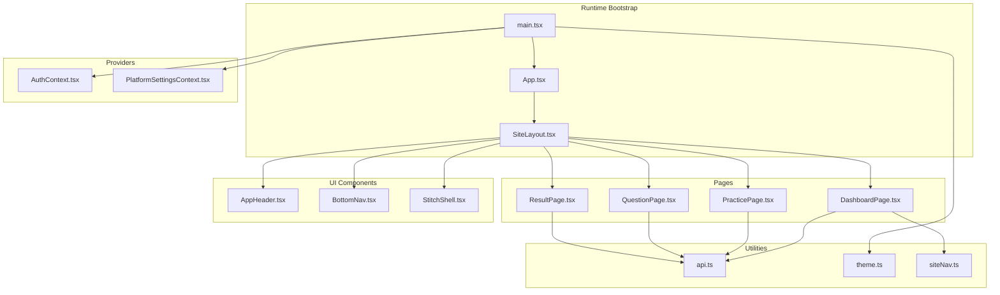
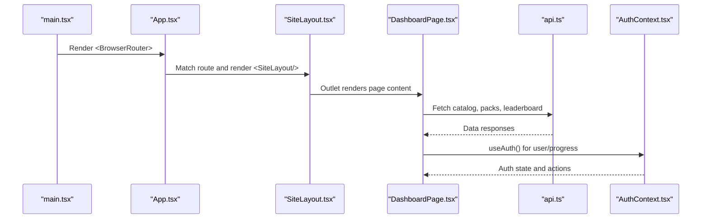
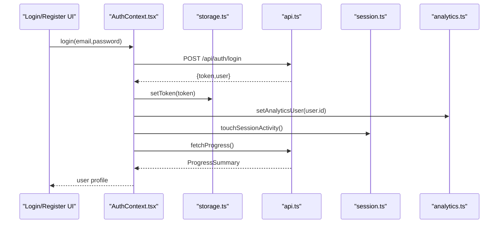
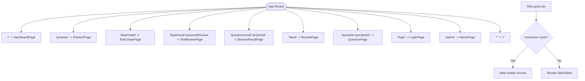
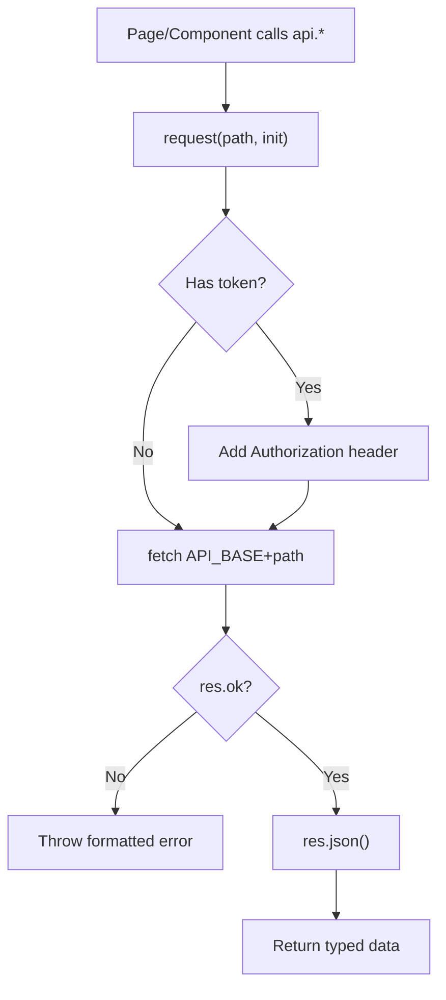
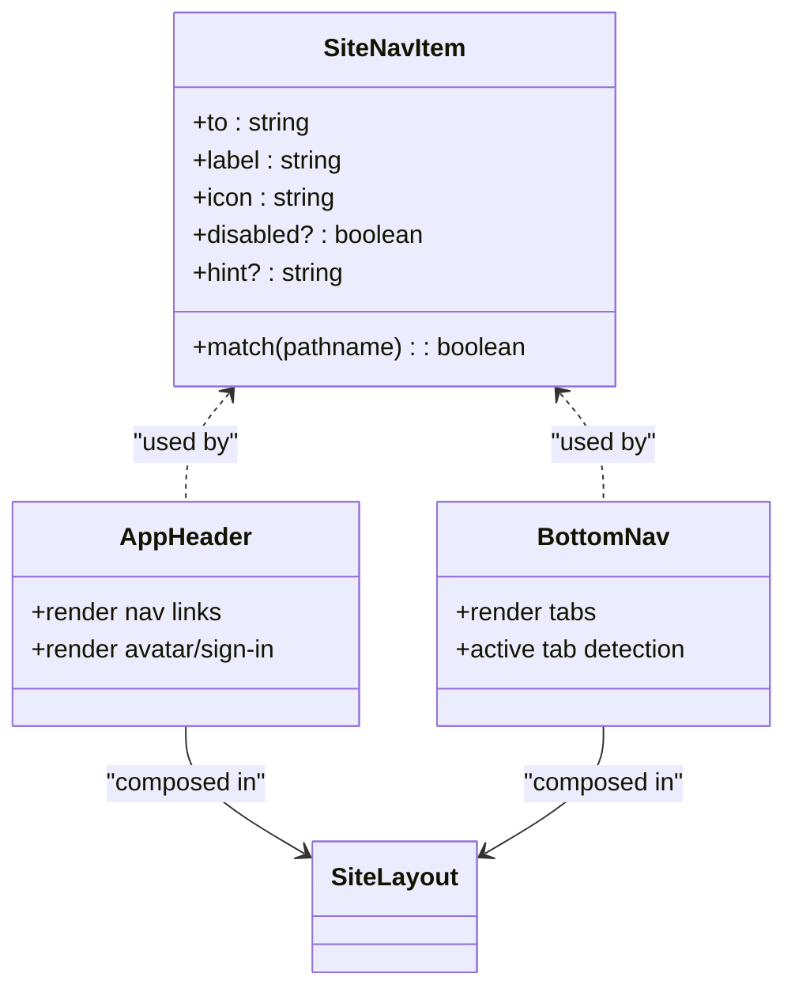
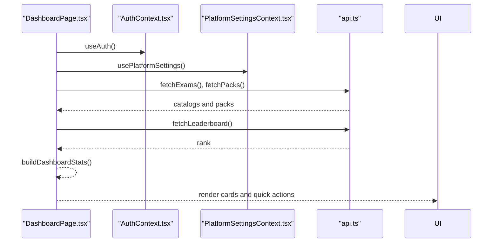
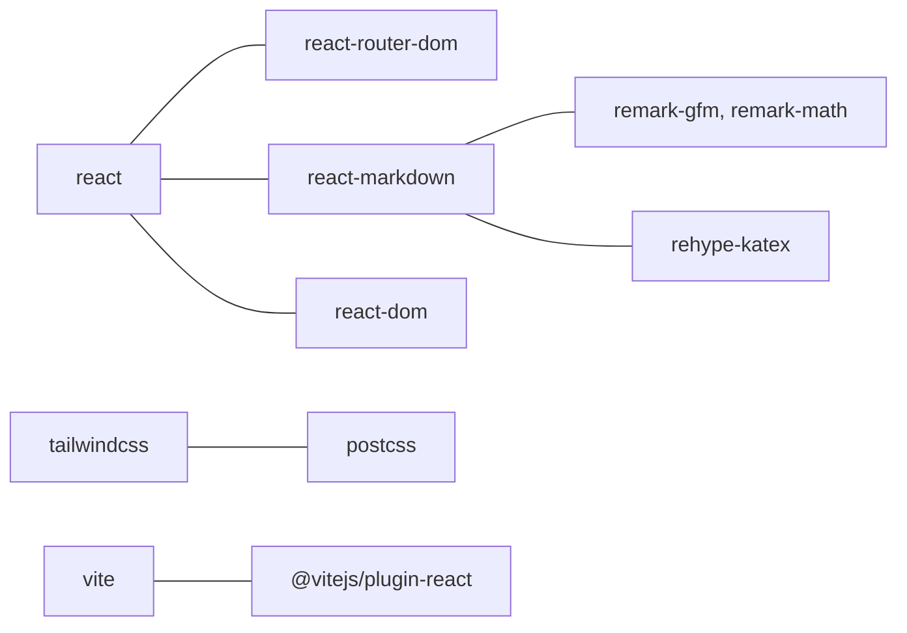

# Frontend Architecture

<cite>
**Referenced Files in This Document**
- [frontend/src/main.tsx](file://frontend/src/main.tsx)
- [frontend/src/App.tsx](file://frontend/src/App.tsx)
- [frontend/src/auth/AuthContext.tsx](file://frontend/src/auth/AuthContext.tsx)
- [frontend/src/auth/session.ts](file://frontend/src/auth/session.ts)
- [frontend/src/auth/storage.ts](file://frontend/src/auth/storage.ts)
- [frontend/src/settings/PlatformSettingsContext.tsx](file://frontend/src/settings/PlatformSettingsContext.tsx)
- [frontend/src/components/SiteLayout.tsx](file://frontend/src/components/SiteLayout.tsx)
- [frontend/src/components/AppHeader.tsx](file://frontend/src/components/AppHeader.tsx)
- [frontend/src/components/BottomNav.tsx](file://frontend/src/components/BottomNav.tsx)
- [frontend/src/navigation/siteNav.ts](file://frontend/src/navigation/siteNav.ts)
- [frontend/src/pages/DashboardPage.tsx](file://frontend/src/pages/DashboardPage.tsx)
- [frontend/src/utils/theme.ts](file://frontend/src/utils/theme.ts)
- [frontend/src/hooks/useTheme.ts](file://frontend/src/hooks/useTheme.ts)
- [frontend/src/api.ts](file://frontend/src/api.ts)
- [frontend/tailwind.config.js](file://frontend/tailwind.config.js)
- [frontend/package.json](file://frontend/package.json)
- [frontend/vite.config.ts](file://frontend/vite.config.ts)
</cite>

## Table of Contents
1. [Introduction](#introduction)
2. [Project Structure](#project-structure)
3. [Core Components](#core-components)
4. [Architecture Overview](#architecture-overview)
5. [Detailed Component Analysis](#detailed-component-analysis)
6. [Dependency Analysis](#dependency-analysis)
7. [Performance Considerations](#performance-considerations)
8. [Troubleshooting Guide](#troubleshooting-guide)
9. [Conclusion](#conclusion)
10. [Appendices](#appendices)

## Introduction
This document describes the React frontend architecture for the exam-hunt-project. It covers component hierarchy, state management via React Context API, routing with React Router, styling with Tailwind CSS, authentication and session management, API integration patterns, infrastructure and build configuration with Vite, and deployment considerations. It also explains reusable UI components, page-level components, and utility functions, along with responsive design patterns, accessibility compliance, and performance optimization strategies.

## Project Structure
The frontend is organized around a clear separation of concerns:
- Entry point initializes providers, router, analytics, and theme.
- Routing defines page-level routes under a shared layout.
- Providers supply global state (authentication and platform settings).
- Components are grouped into reusable UI building blocks and page-level views.
- Utilities encapsulate API calls, theme handling, and navigation helpers.
- Styling leverages Tailwind CSS with a design-token-driven configuration.

**Diagram sources**
- [frontend/src/main.tsx:16-26](file://frontend/src/main.tsx#L16-L26)
- [frontend/src/App.tsx:21-52](file://frontend/src/App.tsx#L21-L52)
- [frontend/src/components/SiteLayout.tsx:17-119](file://frontend/src/components/SiteLayout.tsx#L17-L119)
- [frontend/src/auth/AuthContext.tsx:39-175](file://frontend/src/auth/AuthContext.tsx#L39-L175)
- [frontend/src/settings/PlatformSettingsContext.tsx:36-60](file://frontend/src/settings/PlatformSettingsContext.tsx#L36-L60)
- [frontend/src/pages/DashboardPage.tsx:44-178](file://frontend/src/pages/DashboardPage.tsx#L44-L178)
- [frontend/src/components/AppHeader.tsx:11-54](file://frontend/src/components/AppHeader.tsx#L11-L54)
- [frontend/src/components/BottomNav.tsx:11-50](file://frontend/src/components/BottomNav.tsx#L11-L50)
- [frontend/src/navigation/siteNav.ts:12-44](file://frontend/src/navigation/siteNav.ts#L12-L44)
- [frontend/src/api.ts:430-463](file://frontend/src/api.ts#L430-L463)
- [frontend/src/utils/theme.ts:39-43](file://frontend/src/utils/theme.ts#L39-L43)

**Section sources**
- [frontend/src/main.tsx:1-27](file://frontend/src/main.tsx#L1-L27)
- [frontend/src/App.tsx:1-53](file://frontend/src/App.tsx#L1-L53)
- [frontend/src/components/SiteLayout.tsx:1-120](file://frontend/src/components/SiteLayout.tsx#L1-L120)
- [frontend/src/auth/AuthContext.tsx:1-183](file://frontend/src/auth/AuthContext.tsx#L1-L183)
- [frontend/src/settings/PlatformSettingsContext.tsx:1-69](file://frontend/src/settings/PlatformSettingsContext.tsx#L1-L69)
- [frontend/src/pages/DashboardPage.tsx:1-178](file://frontend/src/pages/DashboardPage.tsx#L1-L178)
- [frontend/src/components/AppHeader.tsx:1-54](file://frontend/src/components/AppHeader.tsx#L1-L54)
- [frontend/src/components/BottomNav.tsx:1-50](file://frontend/src/components/BottomNav.tsx#L1-L50)
- [frontend/src/navigation/siteNav.ts:1-44](file://frontend/src/navigation/siteNav.ts#L1-L44)
- [frontend/src/utils/theme.ts:1-43](file://frontend/src/utils/theme.ts#L1-L43)
- [frontend/src/api.ts:1-800](file://frontend/src/api.ts#L1-L800)
- [frontend/tailwind.config.js:1-106](file://frontend/tailwind.config.js#L1-L106)
- [frontend/package.json:1-32](file://frontend/package.json#L1-L32)
- [frontend/vite.config.ts:1-20](file://frontend/vite.config.ts#L1-L20)

## Core Components
- Provider stack: Authentication provider wraps the app and supplies user/profile/progress state and actions. Platform settings provider supplies configurable UI defaults.
- Routing: Centralized route definitions under a shared layout, with nested outlets for page content.
- Layout shell: SiteLayout composes header, footer, and viewport shells, and orchestrates practice session creation flows.
- Navigation: Desktop and mobile navigation components driven by siteNav definitions.
- Pages: DashboardPage and others fetch data via API utilities and render reusable UI components.
- Styling: Tailwind CSS with CSS variables for theme tokens and typography scales.

**Section sources**
- [frontend/src/auth/AuthContext.tsx:39-175](file://frontend/src/auth/AuthContext.tsx#L39-L175)
- [frontend/src/settings/PlatformSettingsContext.tsx:36-60](file://frontend/src/settings/PlatformSettingsContext.tsx#L36-L60)
- [frontend/src/App.tsx:21-52](file://frontend/src/App.tsx#L21-L52)
- [frontend/src/components/SiteLayout.tsx:17-119](file://frontend/src/components/SiteLayout.tsx#L17-L119)
- [frontend/src/components/AppHeader.tsx:11-54](file://frontend/src/components/AppHeader.tsx#L11-L54)
- [frontend/src/components/BottomNav.tsx:11-50](file://frontend/src/components/BottomNav.tsx#L11-L50)
- [frontend/src/pages/DashboardPage.tsx:44-178](file://frontend/src/pages/DashboardPage.tsx#L44-L178)
- [frontend/tailwind.config.js:5-102](file://frontend/tailwind.config.js#L5-L102)

## Architecture Overview
The runtime bootstrap initializes providers and router, then renders the route tree. SiteLayout acts as a shell that injects context for starting practice sessions and hides mobile chrome in immersive routes. Pages consume APIs and render reusable UI components. Providers centralize cross-cutting concerns like authentication and platform settings.

**Diagram sources**
- [frontend/src/main.tsx:16-26](file://frontend/src/main.tsx#L16-L26)
- [frontend/src/App.tsx:21-52](file://frontend/src/App.tsx#L21-L52)
- [frontend/src/components/SiteLayout.tsx:96-96](file://frontend/src/components/SiteLayout.tsx#L96-L96)
- [frontend/src/pages/DashboardPage.tsx:44-72](file://frontend/src/pages/DashboardPage.tsx#L44-L72)
- [frontend/src/api.ts:503-574](file://frontend/src/api.ts#L503-L574)
- [frontend/src/auth/AuthContext.tsx:177-181](file://frontend/src/auth/AuthContext.tsx#L177-L181)

## Detailed Component Analysis

### Authentication and Session Management
The authentication flow is centered around a Context provider that:
- Stores user profile and progress summaries.
- Handles login, registration, logout, and periodic refresh.
- Tracks idle session expiration and activity touchpoints.
- Persists tokens and analytics identity.

**Diagram sources**
- [frontend/src/auth/AuthContext.tsx:132-157](file://frontend/src/auth/AuthContext.tsx#L132-L157)
- [frontend/src/auth/storage.ts](file://frontend/src/auth/storage.ts)
- [frontend/src/auth/session.ts](file://frontend/src/auth/session.ts)
- [frontend/src/api.ts:558-574](file://frontend/src/api.ts#L558-L574)

Key behaviors:
- Token lifecycle via storage module.
- Idle detection and automatic logout.
- Activity touchpoints to keep sessions alive.
- Analytics user identity updates.

**Section sources**
- [frontend/src/auth/AuthContext.tsx:39-175](file://frontend/src/auth/AuthContext.tsx#L39-L175)
- [frontend/src/auth/session.ts](file://frontend/src/auth/session.ts)
- [frontend/src/auth/storage.ts](file://frontend/src/auth/storage.ts)
- [frontend/src/api.ts:558-574](file://frontend/src/api.ts#L558-L574)

### Routing and Layout
Routing is centralized in App.tsx with nested routes under SiteLayout. SiteLayout conditionally renders different shells and handles immersive routes (e.g., practice/test sessions) by hiding mobile chrome.

**Diagram sources**
- [frontend/src/App.tsx:21-52](file://frontend/src/App.tsx#L21-L52)
- [frontend/src/components/SiteLayout.tsx:98-118](file://frontend/src/components/SiteLayout.tsx#L98-L118)

**Section sources**
- [frontend/src/App.tsx:21-52](file://frontend/src/App.tsx#L21-L52)
- [frontend/src/components/SiteLayout.tsx:17-119](file://frontend/src/components/SiteLayout.tsx#L17-L119)

### Styling System with Tailwind CSS
Tailwind is configured to use CSS variables for theme tokens, enabling dynamic color schemes and typography scales. Dark mode is controlled via class toggles and data attributes.

**Diagram sources**
- [frontend/tailwind.config.js:5-102](file://frontend/tailwind.config.js#L5-L102)

Theme initialization and persistence:
- Theme resolution and application via theme utilities.
- Hook to manage theme state and system preference.

**Section sources**
- [frontend/tailwind.config.js:1-106](file://frontend/tailwind.config.js#L1-L106)
- [frontend/src/utils/theme.ts:1-43](file://frontend/src/utils/theme.ts#L1-L43)
- [frontend/src/hooks/useTheme.ts:1-29](file://frontend/src/hooks/useTheme.ts#L1-L29)

### API Integration Patterns
The API module encapsulates:
- Base URL resolution (dev proxy vs explicit base).
- Typed response models for domain entities.
- Request wrapper with token injection, timeouts, and caching for GETs.
- Convenience functions for auth, content catalogs, practice sessions, and admin tasks.

**Diagram sources**
- [frontend/src/api.ts:430-463](file://frontend/src/api.ts#L430-L463)

Caching and deduplication:
- Short-lived GET cache to coalesce duplicate requests during strict-mode double-mounts.

**Section sources**
- [frontend/src/api.ts:430-501](file://frontend/src/api.ts#L430-L501)

### Reusable UI Components and Navigation
Navigation is defined centrally and consumed by desktop and mobile components. SiteLayout composes header/footer shells and controls immersive layouts.

**Diagram sources**
- [frontend/src/navigation/siteNav.ts:3-10](file://frontend/src/navigation/siteNav.ts#L3-L10)
- [frontend/src/components/AppHeader.tsx:11-54](file://frontend/src/components/AppHeader.tsx#L11-L54)
- [frontend/src/components/BottomNav.tsx:11-50](file://frontend/src/components/BottomNav.tsx#L11-L50)
- [frontend/src/components/SiteLayout.tsx:11-119](file://frontend/src/components/SiteLayout.tsx#L11-L119)

**Section sources**
- [frontend/src/navigation/siteNav.ts:1-44](file://frontend/src/navigation/siteNav.ts#L1-L44)
- [frontend/src/components/AppHeader.tsx:1-54](file://frontend/src/components/AppHeader.tsx#L1-L54)
- [frontend/src/components/BottomNav.tsx:1-50](file://frontend/src/components/BottomNav.tsx#L1-L50)
- [frontend/src/components/SiteLayout.tsx:1-120](file://frontend/src/components/SiteLayout.tsx#L1-L120)

### Page-Level Components and Data Flow
DashboardPage demonstrates typical page composition:
- Uses Auth and PlatformSettings contexts.
- Fetches catalogs and packs in parallel.
- Computes derived stats and renders reusable cards.

**Diagram sources**
- [frontend/src/pages/DashboardPage.tsx:44-178](file://frontend/src/pages/DashboardPage.tsx#L44-L178)
- [frontend/src/auth/AuthContext.tsx:177-181](file://frontend/src/auth/AuthContext.tsx#L177-L181)
- [frontend/src/settings/PlatformSettingsContext.tsx:62-69](file://frontend/src/settings/PlatformSettingsContext.tsx#L62-L69)
- [frontend/src/api.ts:503-509](file://frontend/src/api.ts#L503-L509)

**Section sources**
- [frontend/src/pages/DashboardPage.tsx:1-178](file://frontend/src/pages/DashboardPage.tsx#L1-L178)

## Dependency Analysis
The frontend depends on React, React Router, and Tailwind CSS. Build-time dependencies include Vite, PostCSS, and Tailwind plugins. Runtime dependencies include KaTeX, React Markdown, and remark/rehype plugins for math rendering.

**Diagram sources**
- [frontend/package.json:11-30](file://frontend/package.json#L11-L30)

**Section sources**
- [frontend/package.json:1-32](file://frontend/package.json#L1-L32)

## Performance Considerations
- Request caching: Short-lived GET cache prevents duplicate network calls during development.
- Lazy loading: Consider React.lazy for heavy pages to reduce initial bundle size.
- Image optimization: Ensure images are optimized and lazy-loaded where appropriate.
- Minimize re-renders: Memoize derived data and callbacks using useMemo/useCallback.
- Bundle analysis: Use Vite’s built-in analyzer to inspect bundle composition.
- Idle session handling: Automatic logout reduces stale requests and improves UX.

[No sources needed since this section provides general guidance]

## Troubleshooting Guide
Common issues and remedies:
- Backend not reachable: The API wrapper throws descriptive errors for timeouts and unreachable servers. Ensure the backend is running and the dev proxy is configured.
- Authentication failures: 401/403 responses prompt re-authentication or indicate missing privileges. Confirm token presence and validity.
- Idle session expiry: Automatic logout occurs after inactivity; users should re-authenticate.
- Dev proxy misconfiguration: Verify Vite proxy target and CORS settings.

**Section sources**
- [frontend/src/api.ts:444-479](file://frontend/src/api.ts#L444-L479)
- [frontend/vite.config.ts:9-18](file://frontend/vite.config.ts#L9-L18)

## Conclusion
The frontend employs a clean, layered architecture with React Context for global state, React Router for navigation, and Tailwind CSS for styling. Authentication and session management are centralized, API integration is robust with caching and error handling, and the component model promotes reuse and maintainability. The build pipeline with Vite and PostCSS enables efficient development and production builds.

[No sources needed since this section summarizes without analyzing specific files]

## Appendices

### Build Configuration with Vite
- Scripts: dev, build, preview.
- Plugin: React Fast Refresh.
- CSS: PostCSS pipeline configured.
- Dev server: Port 5173 with proxy to backend.

**Section sources**
- [frontend/package.json:6-10](file://frontend/package.json#L6-L10)
- [frontend/vite.config.ts:1-20](file://frontend/vite.config.ts#L1-L20)

### Infrastructure and Deployment Considerations
- Proxy configuration: Vite dev proxy targets the backend for seamless local development.
- Environment variables: API base URL resolution supports overrides for non-proxy deployments.
- Static assets: Tailwind-generated CSS and compiled assets are served by Vite in dev and built by Rollup in production.

**Section sources**
- [frontend/vite.config.ts:9-18](file://frontend/vite.config.ts#L9-L18)
- [frontend/src/api.ts:7-13](file://frontend/src/api.ts#L7-L13)