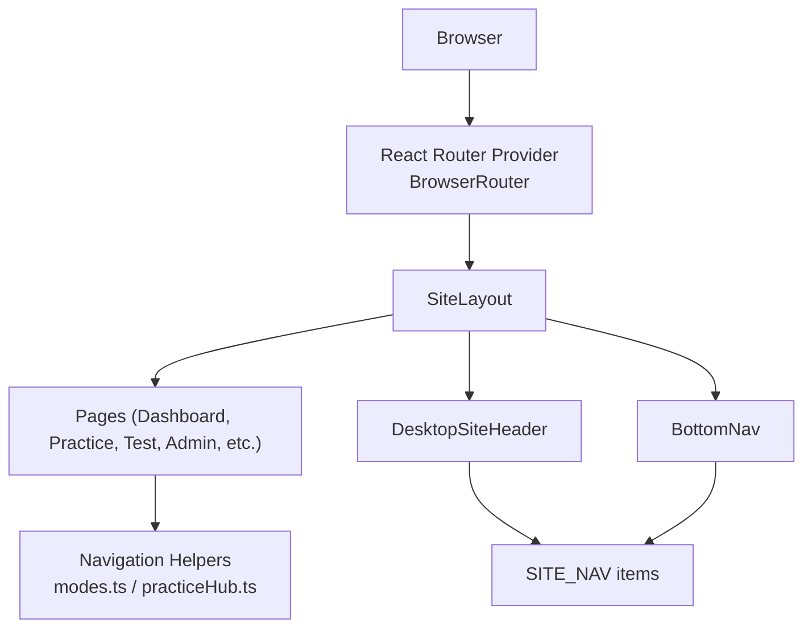
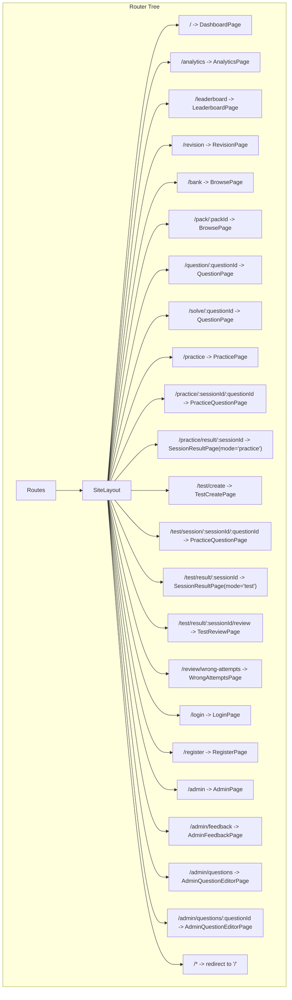
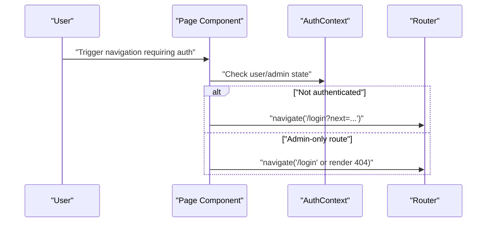
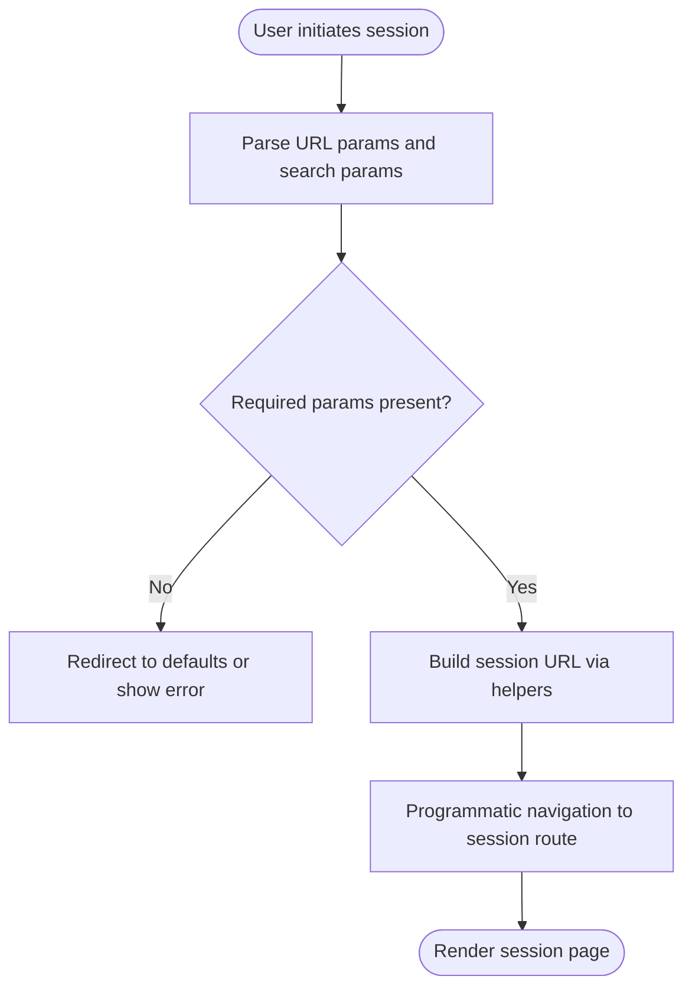
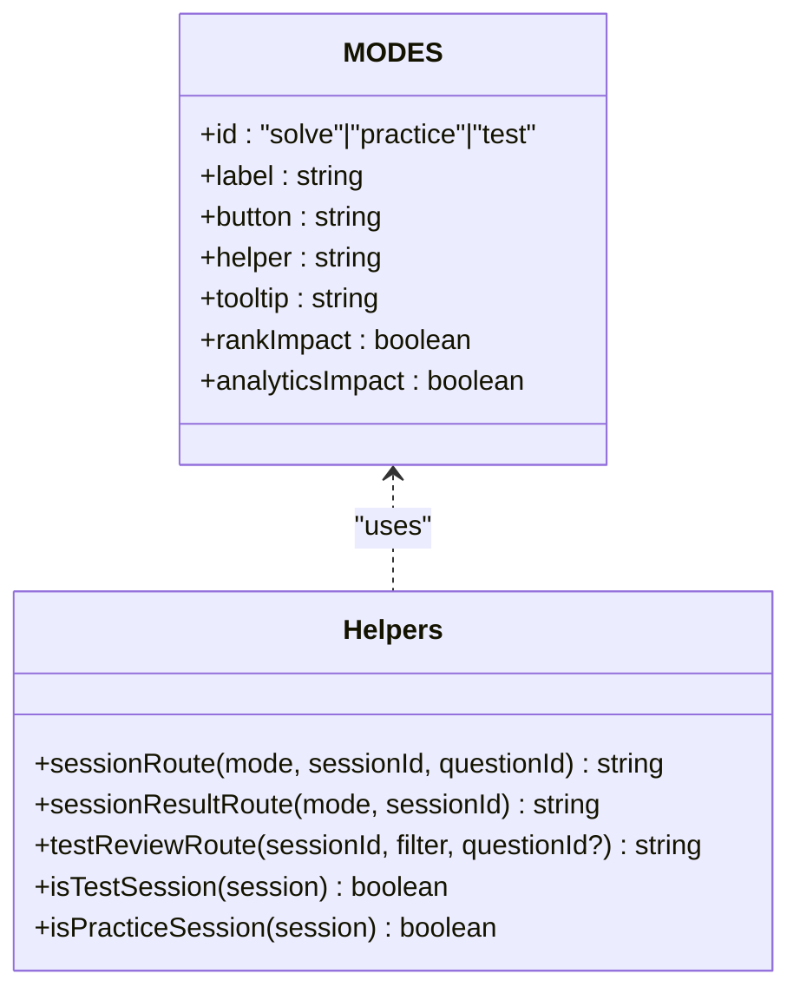
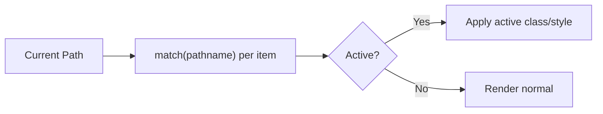
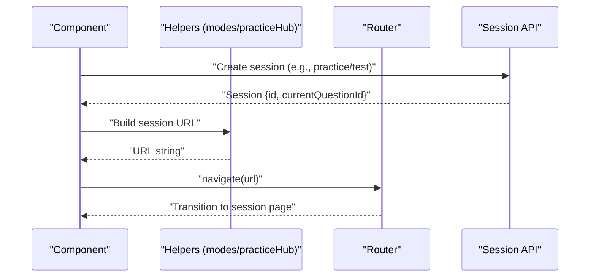
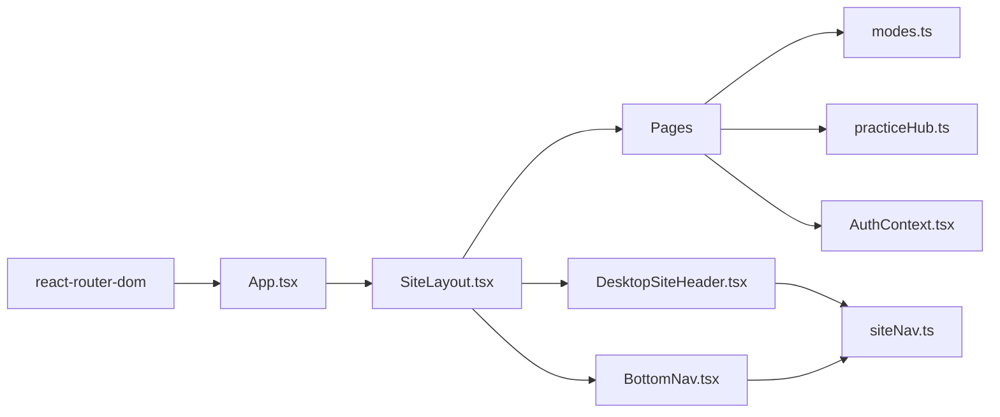

# Routing and Navigation

<cite>
**Referenced Files in This Document**
- [App.tsx](file://frontend/src/App.tsx)
- [main.tsx](file://frontend/src/main.tsx)
- [SiteLayout.tsx](file://frontend/src/components/SiteLayout.tsx)
- [siteNav.ts](file://frontend/src/navigation/siteNav.ts)
- [modes.ts](file://frontend/src/navigation/modes.ts)
- [modeHints.ts](file://frontend/src/navigation/modeHints.ts)
- [DesktopSiteHeader.tsx](file://frontend/src/components/DesktopSiteHeader.tsx)
- [MobileSiteHeader.tsx](file://frontend/src/components/MobileSiteHeader.tsx)
- [BottomNav.tsx](file://frontend/src/components/BottomNav.tsx)
- [DashboardPage.tsx](file://frontend/src/pages/DashboardPage.tsx)
- [PracticePage.tsx](file://frontend/src/pages/PracticePage.tsx)
- [TestCreatePage.tsx](file://frontend/src/pages/TestCreatePage.tsx)
- [AdminPage.tsx](file://frontend/src/pages/AdminPage.tsx)
- [AuthContext.tsx](file://frontend/src/auth/AuthContext.tsx)
- [practiceHub.ts](file://frontend/src/utils/practiceHub.ts)
- [package.json](file://frontend/package.json)
</cite>

## Table of Contents
1. [Introduction](#introduction)
2. [Project Structure](#project-structure)
3. [Core Components](#core-components)
4. [Architecture Overview](#architecture-overview)
5. [Detailed Component Analysis](#detailed-component-analysis)
6. [Dependency Analysis](#dependency-analysis)
7. [Performance Considerations](#performance-considerations)
8. [Troubleshooting Guide](#troubleshooting-guide)
9. [Conclusion](#conclusion)
10. [Appendices](#appendices)

## Introduction
This document explains the React Router configuration and navigation system used in the frontend. It covers the route structure defined in the application shell, protected routes, dynamic routes, nested routing via layouts, mode-based navigation for practice/test/admin contexts, route guards, navigation helpers, and programmatic navigation patterns. It also documents how URLs map to page components, parameter handling, and route transitions, with practical examples and best practices for consistent navigation across the app.

## Project Structure
The routing and navigation system centers around:
- A router provider bootstrapped at the root
- A top-level layout that wraps most routes
- A site navigation definition that drives header and bottom navigation
- Mode-aware helpers for building session and result routes
- Pages that implement programmatic navigation and route transitions

**Diagram sources**
- [main.tsx:16-26](file://frontend/src/main.tsx#L16-L26)
- [App.tsx:21-52](file://frontend/src/App.tsx#L21-L52)
- [SiteLayout.tsx:17-119](file://frontend/src/components/SiteLayout.tsx#L17-L119)
- [DesktopSiteHeader.tsx:12-79](file://frontend/src/components/DesktopSiteHeader.tsx#L12-L79)
- [BottomNav.tsx:11-49](file://frontend/src/components/BottomNav.tsx#L11-L49)
- [siteNav.ts:12-44](file://frontend/src/navigation/siteNav.ts#L12-L44)
- [modes.ts:33-64](file://frontend/src/navigation/modes.ts#L33-L64)
- [practiceHub.ts:139-145](file://frontend/src/utils/practiceHub.ts#L139-L145)

**Section sources**
- [main.tsx:16-26](file://frontend/src/main.tsx#L16-L26)
- [App.tsx:21-52](file://frontend/src/App.tsx#L21-L52)

## Core Components
- Router bootstrap: The application initializes React Router with a browser-based router at the root.
- Top-level layout: A shared layout wraps most routes, centralizing SEO, viewport handling, and mobile chrome behavior.
- Site navigation: A typed navigation definition defines menu items, icons, labels, and matching logic for active states.
- Mode system: A product-mode abstraction defines practice/test/solve modes and provides helpers to construct session/result URLs.
- Pages: Pages implement programmatic navigation and route transitions, often integrating with authentication and session APIs.

**Section sources**
- [main.tsx:16-26](file://frontend/src/main.tsx#L16-L26)
- [SiteLayout.tsx:17-119](file://frontend/src/components/SiteLayout.tsx#L17-L119)
- [siteNav.ts:12-44](file://frontend/src/navigation/siteNav.ts#L12-L44)
- [modes.ts:3-31](file://frontend/src/navigation/modes.ts#L3-L31)
- [practiceHub.ts:139-145](file://frontend/src/utils/practiceHub.ts#L139-L145)

## Architecture Overview
The routing architecture uses a single route tree under a shared layout. Dynamic segments power session-based flows, while mode-specific helpers unify URL construction across pages.

**Diagram sources**
- [App.tsx:23-49](file://frontend/src/App.tsx#L23-L49)

## Detailed Component Analysis

### Route Tree and Nested Routing
- The application mounts a top-level layout that wraps all routes except redirects.
- Nested routes under the layout enable consistent header/footer and viewport behavior.
- Catch-all wildcard route redirects unmatched paths to the home page.

**Section sources**
- [App.tsx:23-49](file://frontend/src/App.tsx#L23-L49)
- [SiteLayout.tsx:96-118](file://frontend/src/components/SiteLayout.tsx#L96-L118)

### Protected Routes and Authentication Integration
- Authentication state is managed globally and influences navigation behavior.
- Several flows redirect unauthenticated users to login with a return-to parameter.
- Admin-only pages enforce admin privileges and redirect to login when unauthorized.

**Diagram sources**
- [AuthContext.tsx:39-106](file://frontend/src/auth/AuthContext.tsx#L39-L106)
- [PracticePage.tsx:56-58](file://frontend/src/pages/PracticePage.tsx#L56-L58)
- [TestCreatePage.tsx:101-103](file://frontend/src/pages/TestCreatePage.tsx#L101-L103)
- [AdminPage.tsx:181-183](file://frontend/src/pages/AdminPage.tsx#L181-L183)

**Section sources**
- [AuthContext.tsx:39-106](file://frontend/src/auth/AuthContext.tsx#L39-L106)
- [PracticePage.tsx:56-58](file://frontend/src/pages/PracticePage.tsx#L56-L58)
- [TestCreatePage.tsx:101-103](file://frontend/src/pages/TestCreatePage.tsx#L101-L103)
- [AdminPage.tsx:181-183](file://frontend/src/pages/AdminPage.tsx#L181-L183)

### Dynamic Routes and Parameter Handling
- Dynamic segments capture session IDs and question IDs for practice/test flows.
- Helper utilities construct URLs consistently across pages and components.
- Some flows derive parameters from URL search params (e.g., pack selection, filters).

**Diagram sources**
- [SiteLayout.tsx:29-88](file://frontend/src/components/SiteLayout.tsx#L29-L88)
- [practiceHub.ts:139-145](file://frontend/src/utils/practiceHub.ts#L139-L145)
- [modes.ts:33-45](file://frontend/src/navigation/modes.ts#L33-L45)

**Section sources**
- [SiteLayout.tsx:29-88](file://frontend/src/components/SiteLayout.tsx#L29-L88)
- [practiceHub.ts:139-145](file://frontend/src/utils/practiceHub.ts#L139-L145)
- [modes.ts:33-45](file://frontend/src/navigation/modes.ts#L33-L45)

### Mode-Based Navigation System
- Modes define three contexts: study (solve), practice, and test.
- Helpers generate session and result routes based on mode.
- Test review route supports query parameters for filtering and optional question scoping.

**Diagram sources**
- [modes.ts:1-64](file://frontend/src/navigation/modes.ts#L1-L64)
- [modeHints.ts:1-14](file://frontend/src/navigation/modeHints.ts#L1-L14)

**Section sources**
- [modes.ts:1-64](file://frontend/src/navigation/modes.ts#L1-L64)
- [modeHints.ts:1-14](file://frontend/src/navigation/modeHints.ts#L1-L14)

### Navigation Configuration and Active States
- Site navigation items define target paths, labels, icons, and matchers for active state computation.
- Desktop and mobile headers consume the navigation definition to render active tabs and tooltips.
- Bottom navigation mirrors core navigation for mobile.

**Diagram sources**
- [siteNav.ts:12-44](file://frontend/src/navigation/siteNav.ts#L12-L44)
- [DesktopSiteHeader.tsx:48-76](file://frontend/src/components/DesktopSiteHeader.tsx#L48-L76)
- [BottomNav.tsx:11-49](file://frontend/src/components/BottomNav.tsx#L11-L49)

**Section sources**
- [siteNav.ts:12-44](file://frontend/src/navigation/siteNav.ts#L12-L44)
- [DesktopSiteHeader.tsx:48-76](file://frontend/src/components/DesktopSiteHeader.tsx#L48-L76)
- [BottomNav.tsx:11-49](file://frontend/src/components/BottomNav.tsx#L11-L49)

### Programmatic Navigation Patterns
- Pages use programmatic navigation to move users between steps (e.g., login, practice start, test creation).
- Navigation helpers centralize URL construction to avoid duplication and inconsistencies.
- Some flows preserve context via query parameters (e.g., next page after login).

**Diagram sources**
- [PracticePage.tsx:76-90](file://frontend/src/pages/PracticePage.tsx#L76-L90)
- [TestCreatePage.tsx:116-128](file://frontend/src/pages/TestCreatePage.tsx#L116-L128)
- [practiceHub.ts:139-145](file://frontend/src/utils/practiceHub.ts#L139-L145)
- [modes.ts:33-45](file://frontend/src/navigation/modes.ts#L33-L45)

**Section sources**
- [PracticePage.tsx:76-90](file://frontend/src/pages/PracticePage.tsx#L76-L90)
- [TestCreatePage.tsx:116-128](file://frontend/src/pages/TestCreatePage.tsx#L116-L128)
- [practiceHub.ts:139-145](file://frontend/src/utils/practiceHub.ts#L139-L145)
- [modes.ts:33-45](file://frontend/src/navigation/modes.ts#L33-L45)

### Relationship Between URL Structure and Page Components
- Home and dashboards: mapped to the dashboard page.
- Practice and question bank: mapped to practice and browse pages with dynamic pack and question segments.
- Sessions: mapped to question pages with dynamic session and question IDs.
- Results and reviews: mapped to result and review pages with dynamic session IDs and optional filters.
- Admin: mapped to admin pages with optional question ID segment.

**Section sources**
- [App.tsx:25-47](file://frontend/src/App.tsx#L25-L47)

### Examples of Navigation Implementation
- Starting a practice session from the bank or quick-start controls:
  - Validates auth, resolves pack and filters, creates a session, then navigates to the session route.
- Creating a test session:
  - Builds filters and counts, creates a test session, then navigates to the test session route.
- Navigating to analytics or leaderboard:
  - Uses links and programmatic navigation based on user state.

**Section sources**
- [SiteLayout.tsx:29-88](file://frontend/src/components/SiteLayout.tsx#L29-L88)
- [PracticePage.tsx:76-90](file://frontend/src/pages/PracticePage.tsx#L76-L90)
- [TestCreatePage.tsx:116-128](file://frontend/src/pages/TestCreatePage.tsx#L116-L128)
- [DashboardPage.tsx:19-42](file://frontend/src/pages/DashboardPage.tsx#L19-L42)

## Dependency Analysis
- Router provider: Installed and configured at the root.
- Layout dependency: All pages depend on the shared layout for consistent UX.
- Navigation definition: Consumed by desktop/mobile headers and bottom navigation.
- Mode helpers: Used by pages and utilities to construct URLs.
- Authentication: Impacts protected routes and redirects.

**Diagram sources**
- [package.json:16](file://frontend/package.json#L16)
- [App.tsx:21-52](file://frontend/src/App.tsx#L21-L52)
- [SiteLayout.tsx:17-119](file://frontend/src/components/SiteLayout.tsx#L17-L119)
- [DesktopSiteHeader.tsx:6](file://frontend/src/components/DesktopSiteHeader.tsx#L6)
- [BottomNav.tsx:1](file://frontend/src/components/BottomNav.tsx#L1)
- [siteNav.ts:12-44](file://frontend/src/navigation/siteNav.ts#L12-L44)
- [modes.ts:33-64](file://frontend/src/navigation/modes.ts#L33-L64)
- [practiceHub.ts:139-145](file://frontend/src/utils/practiceHub.ts#L139-L145)
- [AuthContext.tsx:39-106](file://frontend/src/auth/AuthContext.tsx#L39-L106)

**Section sources**
- [package.json:16](file://frontend/package.json#L16)
- [App.tsx:21-52](file://frontend/src/App.tsx#L21-L52)
- [SiteLayout.tsx:17-119](file://frontend/src/components/SiteLayout.tsx#L17-L119)
- [DesktopSiteHeader.tsx:6](file://frontend/src/components/DesktopSiteHeader.tsx#L6)
- [BottomNav.tsx:1](file://frontend/src/components/BottomNav.tsx#L1)
- [siteNav.ts:12-44](file://frontend/src/navigation/siteNav.ts#L12-L44)
- [modes.ts:33-64](file://frontend/src/navigation/modes.ts#L33-L64)
- [practiceHub.ts:139-145](file://frontend/src/utils/practiceHub.ts#L139-L145)
- [AuthContext.tsx:39-106](file://frontend/src/auth/AuthContext.tsx#L39-L106)

## Performance Considerations
- Prefer programmatic navigation for internal transitions to avoid unnecessary re-renders.
- Use memoization for derived navigation values (e.g., recommended practice) to minimize recomputation.
- Avoid deep nesting in route trees; keep the layout-centric structure for predictable transitions.
- Lazy-load heavy pages if needed, though current structure uses immediate imports.

## Troubleshooting Guide
- Uncaught redirects to home:
  - Ensure wildcard route is present and correctly configured.
- Unexpected active states:
  - Verify matcher functions in the navigation definition align with actual routes.
- Broken session navigation:
  - Confirm session creation returns a valid current question ID and that helpers receive correct parameters.
- Admin-only access errors:
  - Ensure admin checks occur before rendering sensitive content and that redirects are applied when missing privileges.

**Section sources**
- [App.tsx:48](file://frontend/src/App.tsx#L48)
- [siteNav.ts:18-32](file://frontend/src/navigation/siteNav.ts#L18-L32)
- [practiceHub.ts:139-145](file://frontend/src/utils/practiceHub.ts#L139-L145)
- [AdminPage.tsx:181-183](file://frontend/src/pages/AdminPage.tsx#L181-L183)

## Conclusion
The routing and navigation system is centered on a clean route tree wrapped by a shared layout, with a strong separation of concerns between navigation definitions, mode helpers, and page-level programmatic navigation. Protected routes and authentication integration ensure secure access, while dynamic routes and helpers support flexible session-based flows across practice and test modes. Adhering to the established patterns ensures consistent navigation behavior and maintainability.

## Appendices
- Best practices:
  - Centralize URL construction in helpers to prevent drift.
  - Use typed navigation definitions to drive UI and active-state logic.
  - Preserve context via query parameters for seamless redirects.
  - Keep route trees shallow and rely on a single layout for cross-cutting concerns.