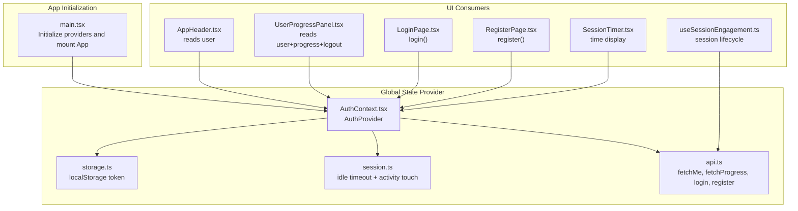
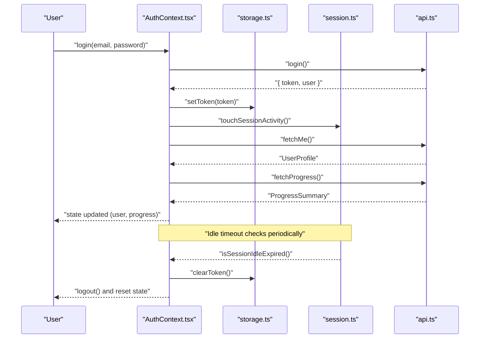
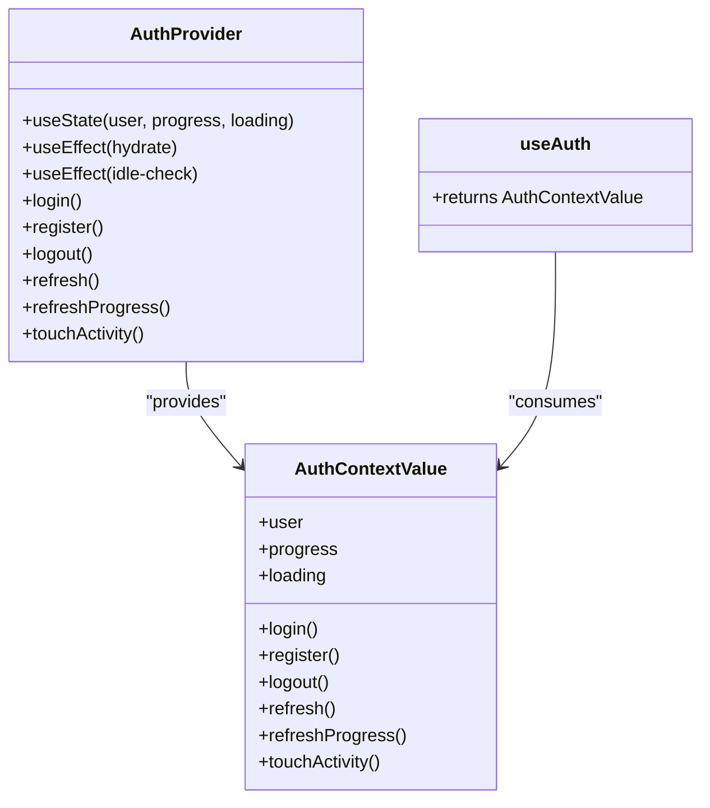
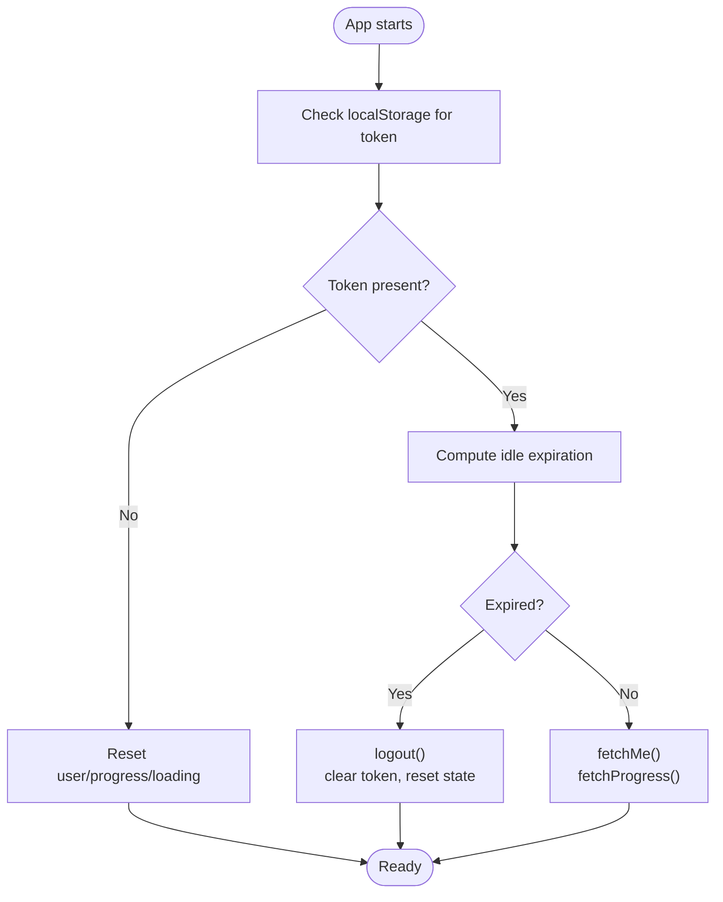
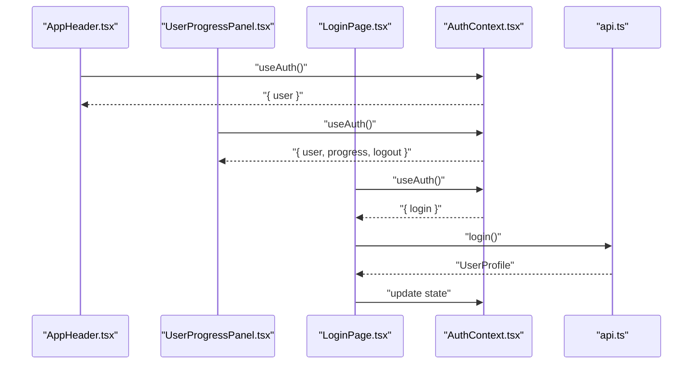
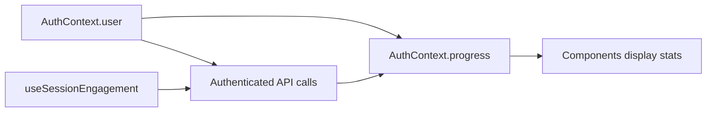
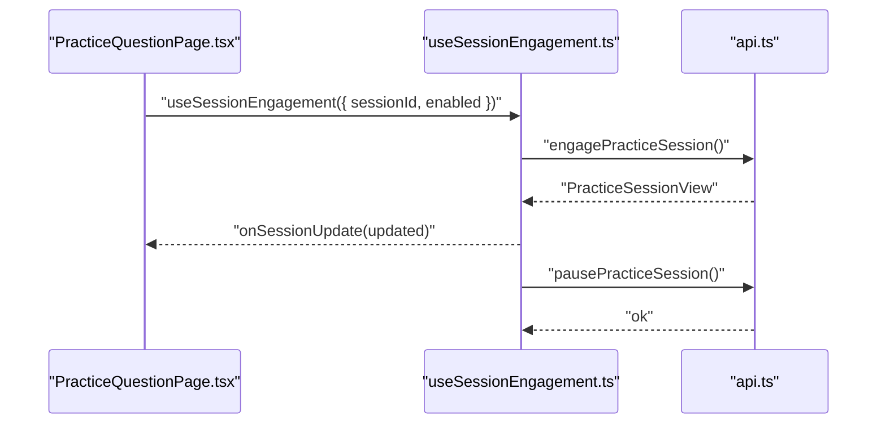
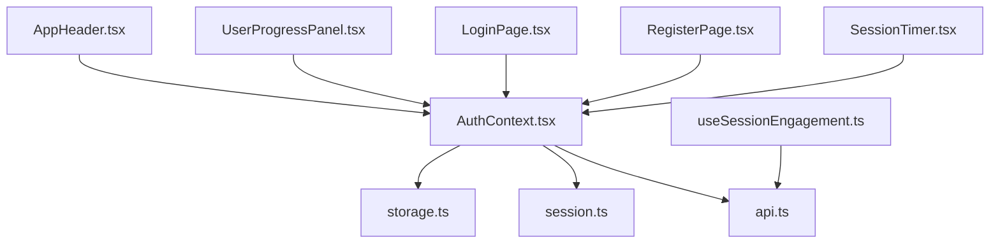

# State Management

<cite>
**Referenced Files in This Document**
- [AuthContext.tsx](file://frontend/src/auth/AuthContext.tsx)
- [session.ts](file://frontend/src/auth/session.ts)
- [storage.ts](file://frontend/src/auth/storage.ts)
- [api.ts](file://frontend/src/api.ts)
- [main.tsx](file://frontend/src/main.tsx)
- [AppHeader.tsx](file://frontend/src/components/AppHeader.tsx)
- [UserProgressPanel.tsx](file://frontend/src/components/UserProgressPanel.tsx)
- [LoginPage.tsx](file://frontend/src/pages/LoginPage.tsx)
- [RegisterPage.tsx](file://frontend/src/pages/RegisterPage.tsx)
- [useSessionEngagement.ts](file://frontend/src/hooks/useSessionEngagement.ts)
- [SessionTimer.tsx](file://frontend/src/components/SessionTimer.tsx)
</cite>

## Table of Contents
1. [Introduction](#introduction)
2. [Project Structure](#project-structure)
3. [Core Components](#core-components)
4. [Architecture Overview](#architecture-overview)
5. [Detailed Component Analysis](#detailed-component-analysis)
6. [Dependency Analysis](#dependency-analysis)
7. [Performance Considerations](#performance-considerations)
8. [Troubleshooting Guide](#troubleshooting-guide)
9. [Conclusion](#conclusion)

## Introduction
This document explains the frontend state management focused on authentication and session lifecycle using React’s Context API. It covers the AuthContext provider, custom hooks for state access, session persistence via localStorage, and how authentication state synchronizes across components. It also documents the relationship between authentication state and user session data, and provides best practices for managing state during exam preparation workflows.

## Project Structure
The state management is centered around a single global provider that wraps the app. Providers and consumers are wired up in the application entry point, and state is accessed via a custom hook.

**Diagram sources**
- [main.tsx:16-26](file://frontend/src/main.tsx#L16-L26)
- [AuthContext.tsx:39-175](file://frontend/src/auth/AuthContext.tsx#L39-L175)
- [storage.ts:1-30](file://frontend/src/auth/storage.ts#L1-L30)
- [session.ts:1-37](file://frontend/src/auth/session.ts#L1-L37)
- [api.ts:430-574](file://frontend/src/api.ts#L430-L574)
- [AppHeader.tsx:11-53](file://frontend/src/components/AppHeader.tsx#L11-L53)
- [UserProgressPanel.tsx:9-111](file://frontend/src/components/UserProgressPanel.tsx#L9-L111)
- [LoginPage.tsx:7-92](file://frontend/src/pages/LoginPage.tsx#L7-L92)
- [RegisterPage.tsx:6-96](file://frontend/src/pages/RegisterPage.tsx#L6-L96)
- [SessionTimer.tsx:20-48](file://frontend/src/components/SessionTimer.tsx#L20-L48)
- [useSessionEngagement.ts:13-68](file://frontend/src/hooks/useSessionEngagement.ts#L13-L68)

**Section sources**
- [main.tsx:16-26](file://frontend/src/main.tsx#L16-L26)
- [AuthContext.tsx:39-175](file://frontend/src/auth/AuthContext.tsx#L39-L175)

## Core Components
- AuthContext provider manages authentication state, progress summary, loading state, and actions (login, register, logout, refresh, refreshProgress, touchActivity).
- Token and session activity are persisted in localStorage via dedicated helpers.
- Consumers use a custom hook to access state and actions.

Key exports and responsibilities:
- AuthProvider: initializes state, hydrates from storage, sets up idle timeout and activity listeners, exposes actions.
- useAuth: custom hook returning the current context value.
- storage helpers: manage token persistence and session activity timestamps.
- session helpers: compute idle expiration and update last-activity timestamps.

**Section sources**
- [AuthContext.tsx:23-33](file://frontend/src/auth/AuthContext.tsx#L23-L33)
- [AuthContext.tsx:39-175](file://frontend/src/auth/AuthContext.tsx#L39-L175)
- [AuthContext.tsx:177-181](file://frontend/src/auth/AuthContext.tsx#L177-L181)
- [storage.ts:1-30](file://frontend/src/auth/storage.ts#L1-L30)
- [session.ts:1-37](file://frontend/src/auth/session.ts#L1-L37)

## Architecture Overview
The AuthContext provider orchestrates hydration, idle detection, and progress synchronization. It integrates with the API layer to fetch user and progress data, and with analytics and storage utilities.

**Diagram sources**
- [AuthContext.tsx:132-157](file://frontend/src/auth/AuthContext.tsx#L132-L157)
- [storage.ts:13-20](file://frontend/src/auth/storage.ts#L13-L20)
- [session.ts:26-36](file://frontend/src/auth/session.ts#L26-L36)
- [api.ts:558-574](file://frontend/src/api.ts#L558-L574)

## Detailed Component Analysis

### AuthContext Provider and Custom Hook
- State shape: user, progress, loading, plus action methods.
- Hydration: on mount, provider reads token and calls refresh to hydrate user and progress.
- Idle session: activity events update last-activity; periodic check triggers logout when expired.
- Actions:
  - login: persists token, updates user, touches activity, tracks event, refreshes progress.
  - register: similar flow to login.
  - logout: clears token and analytics user, resets state.
  - refresh: validates token and session, fetches user and progress, updates analytics.
  - refreshProgress: debounced progress refresh guarded by inflight ref.
  - touchActivity: updates last-activity timestamp.

**Diagram sources**
- [AuthContext.tsx:23-33](file://frontend/src/auth/AuthContext.tsx#L23-L33)
- [AuthContext.tsx:39-175](file://frontend/src/auth/AuthContext.tsx#L39-L175)
- [AuthContext.tsx:177-181](file://frontend/src/auth/AuthContext.tsx#L177-L181)

**Section sources**
- [AuthContext.tsx:39-175](file://frontend/src/auth/AuthContext.tsx#L39-L175)
- [AuthContext.tsx:177-181](file://frontend/src/auth/AuthContext.tsx#L177-L181)

### Authentication State and Session Persistence
- Token persistence: stored in localStorage under a fixed key; set on login/register; cleared on logout.
- Session activity: last-activity timestamp stored in localStorage; updated on user activity and on API requests.
- Idle timeout: computed by comparing last-activity to a fixed threshold; triggers logout when exceeded.

**Diagram sources**
- [AuthContext.tsx:77-97](file://frontend/src/auth/AuthContext.tsx#L77-L97)
- [session.ts:26-36](file://frontend/src/auth/session.ts#L26-L36)
- [storage.ts:3-9](file://frontend/src/auth/storage.ts#L3-L9)

**Section sources**
- [storage.ts:1-30](file://frontend/src/auth/storage.ts#L1-L30)
- [session.ts:1-37](file://frontend/src/auth/session.ts#L1-L37)
- [AuthContext.tsx:77-130](file://frontend/src/auth/AuthContext.tsx#L77-L130)

### State Consumption in Components
- AppHeader: reads user to conditionally render avatar vs. sign-in link.
- UserProgressPanel: reads user and progress to show stats and provides logout.
- LoginPage/RegisterPage: use login/register actions to authenticate and navigate.

**Diagram sources**
- [AppHeader.tsx:11-53](file://frontend/src/components/AppHeader.tsx#L11-L53)
- [UserProgressPanel.tsx:9-111](file://frontend/src/components/UserProgressPanel.tsx#L9-L111)
- [LoginPage.tsx:7-92](file://frontend/src/pages/LoginPage.tsx#L7-L92)
- [AuthContext.tsx:177-181](file://frontend/src/auth/AuthContext.tsx#L177-L181)
- [api.ts:558-574](file://frontend/src/api.ts#L558-L574)

**Section sources**
- [AppHeader.tsx:11-53](file://frontend/src/components/AppHeader.tsx#L11-L53)
- [UserProgressPanel.tsx:9-111](file://frontend/src/components/UserProgressPanel.tsx#L9-L111)
- [LoginPage.tsx:7-92](file://frontend/src/pages/LoginPage.tsx#L7-L92)
- [RegisterPage.tsx:6-96](file://frontend/src/pages/RegisterPage.tsx#L6-L96)

### Relationship Between Authentication State and User Session Data
- Authentication state (user) drives access to protected data (progress).
- Progress is refreshed after successful login/register and on demand.
- Session engagement hooks operate independently of AuthContext state, but rely on authenticated API calls.

**Diagram sources**
- [AuthContext.tsx:40-42](file://frontend/src/auth/AuthContext.tsx#L40-L42)
- [AuthContext.tsx:53-75](file://frontend/src/auth/AuthContext.tsx#L53-L75)
- [api.ts:936-943](file://frontend/src/api.ts#L936-L943)
- [useSessionEngagement.ts:13-68](file://frontend/src/hooks/useSessionEngagement.ts#L13-L68)

**Section sources**
- [AuthContext.tsx:40-75](file://frontend/src/auth/AuthContext.tsx#L40-L75)
- [api.ts:936-943](file://frontend/src/api.ts#L936-L943)
- [useSessionEngagement.ts:13-68](file://frontend/src/hooks/useSessionEngagement.ts#L13-L68)

### Session Lifecycle Hooks and Timer
- useSessionEngagement: automatically engages or pauses a session when the user navigates to a question page, and redirects upon completion.
- SessionTimer: displays elapsed time based on activeSeconds and engagedSince.

**Diagram sources**
- [useSessionEngagement.ts:13-68](file://frontend/src/hooks/useSessionEngagement.ts#L13-L68)
- [api.ts:871-883](file://frontend/src/api.ts#L871-L883)

**Section sources**
- [useSessionEngagement.ts:13-68](file://frontend/src/hooks/useSessionEngagement.ts#L13-L68)
- [SessionTimer.tsx:20-48](file://frontend/src/components/SessionTimer.tsx#L20-L48)

## Dependency Analysis
- AuthContext depends on:
  - storage.ts for token persistence
  - session.ts for idle detection
  - api.ts for user and progress hydration
- Consumers depend on AuthContext via useAuth.
- Session engagement hooks depend on authenticated API endpoints.

**Diagram sources**
- [AuthContext.tsx:11-21](file://frontend/src/auth/AuthContext.tsx#L11-L21)
- [storage.ts:1-30](file://frontend/src/auth/storage.ts#L1-L30)
- [session.ts:1-37](file://frontend/src/auth/session.ts#L1-L37)
- [api.ts:430-574](file://frontend/src/api.ts#L430-L574)
- [AppHeader.tsx:1-2](file://frontend/src/components/AppHeader.tsx#L1-L2)
- [UserProgressPanel.tsx:1-2](file://frontend/src/components/UserProgressPanel.tsx#L1-L2)
- [LoginPage.tsx:4](file://frontend/src/pages/LoginPage.tsx#L4)
- [RegisterPage.tsx:4](file://frontend/src/pages/RegisterPage.tsx#L4)
- [useSessionEngagement.ts:1-3](file://frontend/src/hooks/useSessionEngagement.ts#L1-L3)
- [SessionTimer.tsx:1](file://frontend/src/components/SessionTimer.tsx#L1)

**Section sources**
- [AuthContext.tsx:11-21](file://frontend/src/auth/AuthContext.tsx#L11-L21)
- [api.ts:430-574](file://frontend/src/api.ts#L430-L574)

## Performance Considerations
- Debounced progress refresh: a ref guards against overlapping progress fetches, reducing redundant network calls.
- Memoized context value: the provider memoizes the exposed value to prevent unnecessary re-renders of consumers.
- Idle check interval: runs at a fixed cadence; keep it reasonable to avoid overhead.
- Activity touch on API requests: ensures idle detection remains accurate even without user interaction.

Best practices:
- Keep the provider near the root to minimize re-renders.
- Use the custom hook consistently to avoid accessing context directly.
- Avoid frequent deep updates to user/progress objects; prefer immutable updates.

**Section sources**
- [AuthContext.tsx:53-75](file://frontend/src/auth/AuthContext.tsx#L53-L75)
- [AuthContext.tsx:159-172](file://frontend/src/auth/AuthContext.tsx#L159-L172)
- [api.ts:430-439](file://frontend/src/api.ts#L430-L439)

## Troubleshooting Guide
Common issues and resolutions:
- Stuck in loading: ensure hydration completes; check token presence and network connectivity.
- Unexpected logout: verify idle timeout thresholds and activity touch points; confirm localStorage availability.
- Progress not updating: ensure refreshProgress is called after login/register and when needed; check inflight guard.
- Navigation after session completion: confirm engagement hook logic and route construction.

Operational checks:
- Confirm AuthProvider is mounted at the root.
- Verify token and last-activity keys in localStorage.
- Inspect API error messages returned by the request wrapper.

**Section sources**
- [AuthContext.tsx:104-130](file://frontend/src/auth/AuthContext.tsx#L104-L130)
- [api.ts:430-463](file://frontend/src/api.ts#L430-L463)

## Conclusion
The frontend employs a focused, robust state management pattern centered on a single AuthContext provider. Authentication state and progress are synchronized at startup and during user activity, with idle-aware session persistence. Consumers access state via a custom hook, ensuring predictable updates across components. For exam preparation contexts, this design supports seamless transitions between practice, review, and analytics while maintaining reliability and performance.