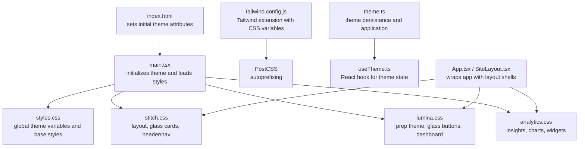
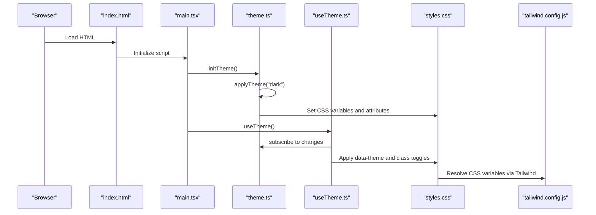
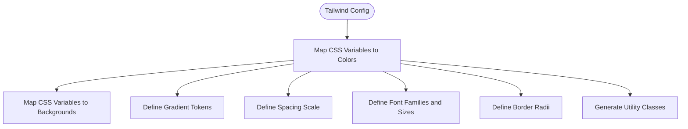
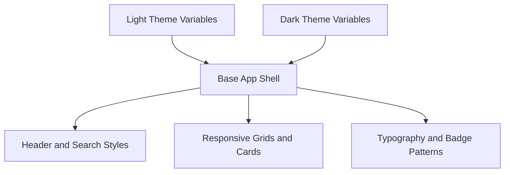
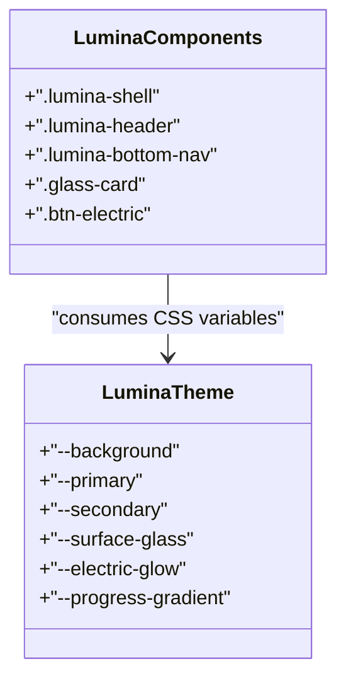
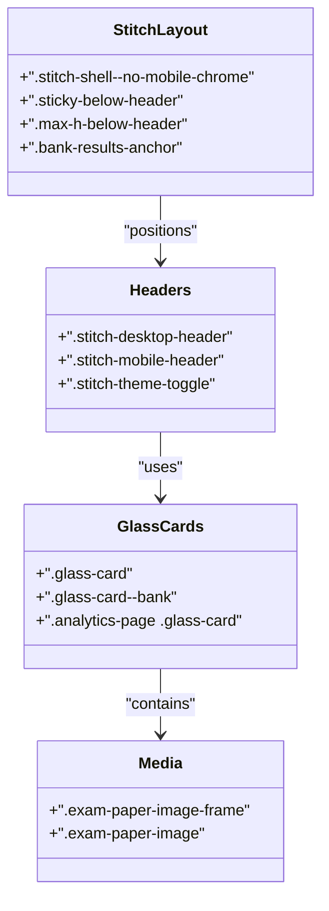
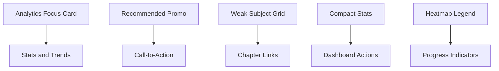
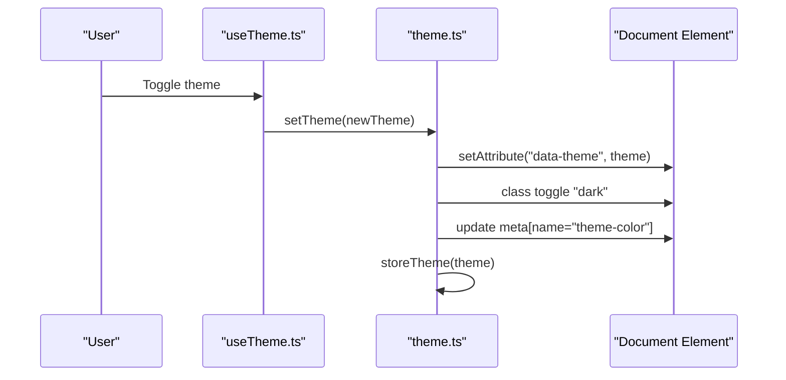
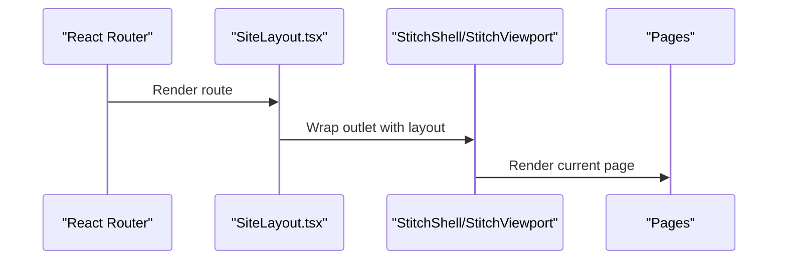
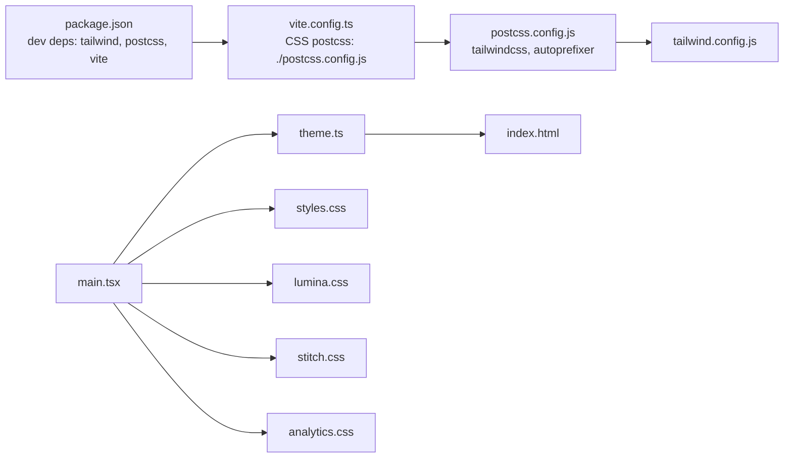

# Styling and Theming

<cite>
**Referenced Files in This Document**
- [tailwind.config.js](file://frontend/tailwind.config.js)
- [postcss.config.js](file://frontend/postcss.config.js)
- [styles.css](file://frontend/src/styles.css)
- [theme.ts](file://frontend/src/utils/theme.ts)
- [useTheme.ts](file://frontend/src/hooks/useTheme.ts)
- [lumina.css](file://frontend/src/styles/lumina.css)
- [stitch.css](file://frontend/src/styles/stitch.css)
- [analytics.css](file://frontend/src/styles/analytics.css)
- [App.tsx](file://frontend/src/App.tsx)
- [SiteLayout.tsx](file://frontend/src/components/SiteLayout.tsx)
- [index.html](file://frontend/index.html)
- [main.tsx](file://frontend/src/main.tsx)
- [package.json](file://frontend/package.json)
- [vite.config.ts](file://frontend/vite.config.ts)
- [stitchAssets.ts](file://frontend/src/design/stitchAssets.ts)
</cite>

## Table of Contents
1. [Introduction](#introduction)
2. [Project Structure](#project-structure)
3. [Core Components](#core-components)
4. [Architecture Overview](#architecture-overview)
5. [Detailed Component Analysis](#detailed-component-analysis)
6. [Dependency Analysis](#dependency-analysis)
7. [Performance Considerations](#performance-considerations)
8. [Troubleshooting Guide](#troubleshooting-guide)
9. [Conclusion](#conclusion)

## Introduction
This document explains the styling and theming system powering the frontend. It covers Tailwind CSS configuration, custom CSS modules (Lumina, Stitch, Analytics), theme customization and color palette management, component-specific styling, responsive design, dark/light theme support, accessibility, and the modular CSS architecture. It also provides guidelines for adding new styles, maintaining consistency, and optimizing performance.

## Project Structure
The styling system is organized around:
- Tailwind CSS configuration extending design tokens via CSS variables
- A global stylesheet defining light/dark themes and base styles
- Feature-specific style sheets for Lumina (prep/dashboard), Stitch (layout/chrome), and Analytics (insights)
- Runtime theme management via utilities and hooks
- Build pipeline using Vite, PostCSS, and Tailwind

**Diagram sources**
- [index.html:4-10](file://frontend/index.html#L4-L10)
- [main.tsx:9-11](file://frontend/src/main.tsx#L9-L11)
- [styles.css:1-59](file://frontend/src/styles.css#L1-L59)
- [stitch.css:1-3](file://frontend/src/styles/stitch.css#L1-L3)
- [lumina.css:1-71](file://frontend/src/styles/lumina.css#L1-L71)
- [analytics.css:1-20](file://frontend/src/styles/analytics.css#L1-L20)
- [tailwind.config.js:5-102](file://frontend/tailwind.config.js#L5-L102)
- [postcss.config.js:1-6](file://frontend/postcss.config.js#L1-L6)
- [theme.ts:22-28](file://frontend/src/utils/theme.ts#L22-L28)
- [useTheme.ts:4-10](file://frontend/src/hooks/useTheme.ts#L4-L10)
- [App.tsx:21-52](file://frontend/src/App.tsx#L21-L52)
- [SiteLayout.tsx:98-118](file://frontend/src/components/SiteLayout.tsx#L98-L118)

**Section sources**
- [index.html:4-10](file://frontend/index.html#L4-L10)
- [main.tsx:9-11](file://frontend/src/main.tsx#L9-L11)
- [tailwind.config.js:1-106](file://frontend/tailwind.config.js#L1-L106)
- [postcss.config.js:1-6](file://frontend/postcss.config.js#L1-L6)
- [styles.css:1-59](file://frontend/src/styles.css#L1-L59)
- [stitch.css:1-3](file://frontend/src/styles/stitch.css#L1-L3)
- [lumina.css:1-71](file://frontend/src/styles/lumina.css#L1-L71)
- [analytics.css:1-20](file://frontend/src/styles/analytics.css#L1-L20)
- [theme.ts:1-43](file://frontend/src/utils/theme.ts#L1-L43)
- [useTheme.ts:1-29](file://frontend/src/hooks/useTheme.ts#L1-L29)
- [App.tsx:21-52](file://frontend/src/App.tsx#L21-L52)
- [SiteLayout.tsx:98-118](file://frontend/src/components/SiteLayout.tsx#L98-L118)

## Core Components
- Tailwind CSS configuration extends design tokens using CSS variables for colors, backgrounds, typography, spacing, and radii. Dark mode is controlled via the "class" strategy.
- Global stylesheet defines light and dark theme variables and base UI patterns (app shell, headers, search, cards).
- Lumina module encapsulates prep/dashboard theme with glass cards, electric glow buttons, and Lumina-specific layout.
- Stitch module defines layout chrome, sticky offsets, glass cards, desktop/mobile headers, and reusable components.
- Analytics module styles insights panels, heatmaps, progress indicators, and dashboard widgets.
- Theme utilities persist and apply user preferences; a React hook manages theme state and system preference detection.
- Build pipeline integrates PostCSS and Tailwind; Vite handles CSS processing and development server.

**Section sources**
- [tailwind.config.js:3-102](file://frontend/tailwind.config.js#L3-L102)
- [styles.css:1-59](file://frontend/src/styles.css#L1-L59)
- [lumina.css:1-182](file://frontend/src/styles/lumina.css#L1-L182)
- [stitch.css:295-351](file://frontend/src/styles/stitch.css#L295-L351)
- [analytics.css:1-80](file://frontend/src/styles/analytics.css#L1-L80)
- [theme.ts:22-42](file://frontend/src/utils/theme.ts#L22-L42)
- [useTheme.ts:4-28](file://frontend/src/hooks/useTheme.ts#L4-L28)
- [postcss.config.js:1-6](file://frontend/postcss.config.js#L1-L6)
- [vite.config.ts:6-8](file://frontend/vite.config.ts#L6-L8)

## Architecture Overview
The styling architecture combines runtime theming with compile-time CSS generation:
- Runtime theme application sets data-theme and class attributes on the root element and persists user choice.
- Tailwind resolves design tokens from CSS variables, enabling dynamic theming without rebuilding.
- Feature-specific stylesheets layer on top of shared base styles and Tailwind utilities.
- Layout wrappers (StitchShell/StitchViewport) provide consistent chrome and safe-area handling.

**Diagram sources**
- [index.html:4-10](file://frontend/index.html#L4-L10)
- [main.tsx:13-13](file://frontend/src/main.tsx#L13-L13)
- [theme.ts:38-42](file://frontend/src/utils/theme.ts#L38-L42)
- [useTheme.ts:4-10](file://frontend/src/hooks/useTheme.ts#L4-L10)
- [styles.css:1-59](file://frontend/src/styles.css#L1-L59)
- [tailwind.config.js:5-102](file://frontend/tailwind.config.js#L5-L102)

## Detailed Component Analysis

### Tailwind Configuration and Design Tokens
- Extends Tailwind theme with CSS variable-backed colors, backgrounds, borders, and gradients.
- Adds spacing units, typography scales, and border radius presets.
- Uses darkMode: "class" to toggle dark styles via root class and data attribute.

**Diagram sources**
- [tailwind.config.js:5-102](file://frontend/tailwind.config.js#L5-L102)

**Section sources**
- [tailwind.config.js:5-102](file://frontend/tailwind.config.js#L5-L102)

### Global Theme Variables and Base Styles
- Defines :root and [data-theme="light"/"dark"] blocks with CSS variables for colors, backgrounds, shadows, focus rings, badges, and typography families.
- Establishes base app shell, header, search, and common UI patterns.
- Uses container queries and safe-area insets for responsive layouts.

**Diagram sources**
- [styles.css:1-59](file://frontend/src/styles.css#L1-L59)
- [styles.css:105-1734](file://frontend/src/styles.css#L105-L1734)

**Section sources**
- [styles.css:1-59](file://frontend/src/styles.css#L1-L59)
- [styles.css:105-1734](file://frontend/src/styles.css#L105-L1734)

### Lumina Module (Prep/Dashboard Theme)
- Overrides global variables for a prep-focused theme with vibrant primary/secondary palettes and glass effects.
- Provides Lumina-specific layout classes (.lumina-shell, .lumina-header, .lumina-bottom-nav).
- Defines glass-card, electric-glow button, and dashboard widgets with gradient accents.

**Diagram sources**
- [lumina.css:3-132](file://frontend/src/styles/lumina.css#L3-L132)
- [lumina.css:255-451](file://frontend/src/styles/lumina.css#L255-L451)

**Section sources**
- [lumina.css:1-182](file://frontend/src/styles/lumina.css#L1-L182)
- [lumina.css:255-451](file://frontend/src/styles/lumina.css#L255-L451)

### Stitch Module (Layout and Chrome)
- Declares Tailwind layers and defines base layout chrome (header height, bottom chrome).
- Implements glass-card variants for bank/analytics contexts and reusable components (desktop/mobile headers, theme toggle).
- Provides sticky offsets, scroll regions, and image handling for exam content.

**Diagram sources**
- [stitch.css:5-39](file://frontend/src/styles/stitch.css#L5-L39)
- [stitch.css:379-451](file://frontend/src/styles/stitch.css#L379-L451)
- [stitch.css:493-756](file://frontend/src/styles/stitch.css#L493-L756)
- [stitch.css:41-80](file://frontend/src/styles/stitch.css#L41-L80)

**Section sources**
- [stitch.css:1-3](file://frontend/src/styles/stitch.css#L1-L3)
- [stitch.css:5-39](file://frontend/src/styles/stitch.css#L5-L39)
- [stitch.css:379-451](file://frontend/src/styles/stitch.css#L379-L451)
- [stitch.css:493-756](file://frontend/src/styles/stitch.css#L493-L756)
- [stitch.css:41-80](file://frontend/src/styles/stitch.css#L41-L80)

### Analytics Module (Insights and Widgets)
- Styles focus cards, recommended promos, weak subject grids, trends, and session history.
- Provides compact stats, dashboard action cards, and heatmap legends.
- Aligns widths with the dashboard (1280px) and uses gradient accents and glass backgrounds.

**Diagram sources**
- [analytics.css:47-177](file://frontend/src/styles/analytics.css#L47-L177)
- [analytics.css:229-253](file://frontend/src/styles/analytics.css#L229-L253)
- [analytics.css:548-605](file://frontend/src/styles/analytics.css#L548-L605)
- [analytics.css:607-661](file://frontend/src/styles/analytics.css#L607-L661)
- [analytics.css:542-546](file://frontend/src/styles/analytics.css#L542-L546)

**Section sources**
- [analytics.css:1-80](file://frontend/src/styles/analytics.css#L1-L80)
- [analytics.css:47-177](file://frontend/src/styles/analytics.css#L47-L177)
- [analytics.css:229-253](file://frontend/src/styles/analytics.css#L229-L253)
- [analytics.css:548-605](file://frontend/src/styles/analytics.css#L548-L605)
- [analytics.css:607-661](file://frontend/src/styles/analytics.css#L607-L661)
- [analytics.css:542-546](file://frontend/src/styles/analytics.css#L542-L546)

### Theme Management (Runtime)
- Theme persistence and application: stores user preference, applies data-theme/class, and updates meta theme-color.
- React hook integrates with system preference and exposes theme state and toggle.

**Diagram sources**
- [useTheme.ts:4-28](file://frontend/src/hooks/useTheme.ts#L4-L28)
- [theme.ts:22-42](file://frontend/src/utils/theme.ts#L22-L42)

**Section sources**
- [theme.ts:1-43](file://frontend/src/utils/theme.ts#L1-L43)
- [useTheme.ts:1-29](file://frontend/src/hooks/useTheme.ts#L1-L29)

### Layout Integration
- SiteLayout conditionally renders desktop chrome or mobile chrome and wraps content in appropriate shells.
- Uses Tailwind utilities alongside Lumina/Stitch classes for consistent spacing and layout.

**Diagram sources**
- [App.tsx:21-52](file://frontend/src/App.tsx#L21-L52)
- [SiteLayout.tsx:98-118](file://frontend/src/components/SiteLayout.tsx#L98-L118)

**Section sources**
- [App.tsx:21-52](file://frontend/src/App.tsx#L21-L52)
- [SiteLayout.tsx:98-118](file://frontend/src/components/SiteLayout.tsx#L98-L118)

## Dependency Analysis
- Build pipeline: Vite invokes PostCSS with Tailwind; Tailwind reads design tokens from CSS variables.
- Runtime: index.html initializes theme early; main.tsx calls initTheme and loads feature styles.
- Feature styles depend on shared base styles and Tailwind utilities.

**Diagram sources**
- [package.json:21-30](file://frontend/package.json#L21-L30)
- [vite.config.ts:4-8](file://frontend/vite.config.ts#L4-L8)
- [postcss.config.js:1-6](file://frontend/postcss.config.js#L1-L6)
- [tailwind.config.js:1-106](file://frontend/tailwind.config.js#L1-L106)
- [main.tsx:8-11](file://frontend/src/main.tsx#L8-L11)
- [theme.ts:38-42](file://frontend/src/utils/theme.ts#L38-L42)
- [styles.css:1-59](file://frontend/src/styles.css#L1-L59)
- [lumina.css:1-71](file://frontend/src/styles/lumina.css#L1-L71)
- [stitch.css:1-3](file://frontend/src/styles/stitch.css#L1-L3)
- [analytics.css:1-20](file://frontend/src/styles/analytics.css#L1-L20)
- [index.html:4-10](file://frontend/index.html#L4-L10)

**Section sources**
- [package.json:21-30](file://frontend/package.json#L21-L30)
- [vite.config.ts:4-8](file://frontend/vite.config.ts#L4-L8)
- [postcss.config.js:1-6](file://frontend/postcss.config.js#L1-L6)
- [tailwind.config.js:1-106](file://frontend/tailwind.config.js#L1-L106)
- [main.tsx:8-11](file://frontend/src/main.tsx#L8-L11)
- [theme.ts:38-42](file://frontend/src/utils/theme.ts#L38-L42)
- [styles.css:1-59](file://frontend/src/styles.css#L1-L59)
- [lumina.css:1-71](file://frontend/src/styles/lumina.css#L1-L71)
- [stitch.css:1-3](file://frontend/src/styles/stitch.css#L1-L3)
- [analytics.css:1-20](file://frontend/src/styles/analytics.css#L1-L20)
- [index.html:4-10](file://frontend/index.html#L4-L10)

## Performance Considerations
- Prefer Tailwind utilities over ad-hoc custom CSS to leverage JIT compilation and minimize CSS payload.
- Centralize design tokens in CSS variables to reduce duplication and enable efficient dark/light switching.
- Use component-scoped styles (e.g., .glass-card variants) to avoid global cascade bloat.
- Keep feature styles modular and scoped to feature areas to limit reflows and repaints.
- Minimize heavy animations and backdrop-filter usage on low-power devices; consider prefers-reduced-motion checks.

## Troubleshooting Guide
- Theme not applying:
  - Verify initial theme attributes are set in index.html and initTheme runs before React mounts.
  - Confirm data-theme attribute and "dark" class are present on the root element.
- Colors appear incorrect:
  - Ensure CSS variables are defined in both :root and [data-theme="light"/"dark"] blocks.
  - Check Tailwind config maps CSS variables to colors.
- Layout chrome misaligned:
  - Confirm header/bottom chrome variables match the intended heights.
  - Verify sticky-below-header and max-h-below-header classes are applied where needed.
- Build errors:
  - Ensure Tailwind and PostCSS are installed and configured in Vite.

**Section sources**
- [index.html:4-10](file://frontend/index.html#L4-L10)
- [main.tsx:13-13](file://frontend/src/main.tsx#L13-L13)
- [styles.css:1-59](file://frontend/src/styles.css#L1-L59)
- [tailwind.config.js:5-102](file://frontend/tailwind.config.js#L5-L102)
- [stitch.css:5-39](file://frontend/src/styles/stitch.css#L5-L39)

## Conclusion
The styling and theming system combines runtime theme management with Tailwind’s utility-first approach and CSS variable-driven design tokens. Lumina, Stitch, and Analytics modules encapsulate feature-specific styles while sharing a cohesive base. The architecture supports responsive design, dark/light themes, and maintainable styling patterns through modular CSS and a centralized theme utility.