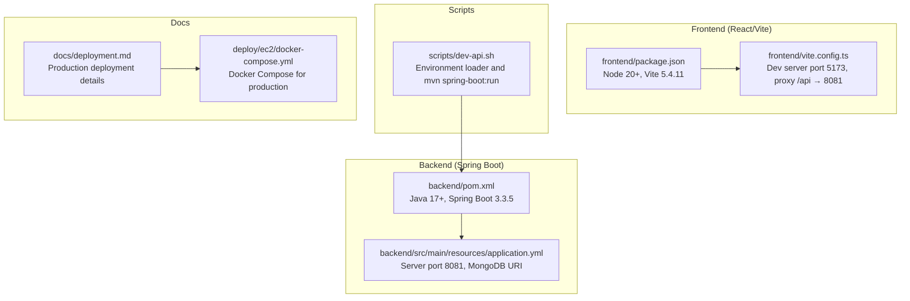
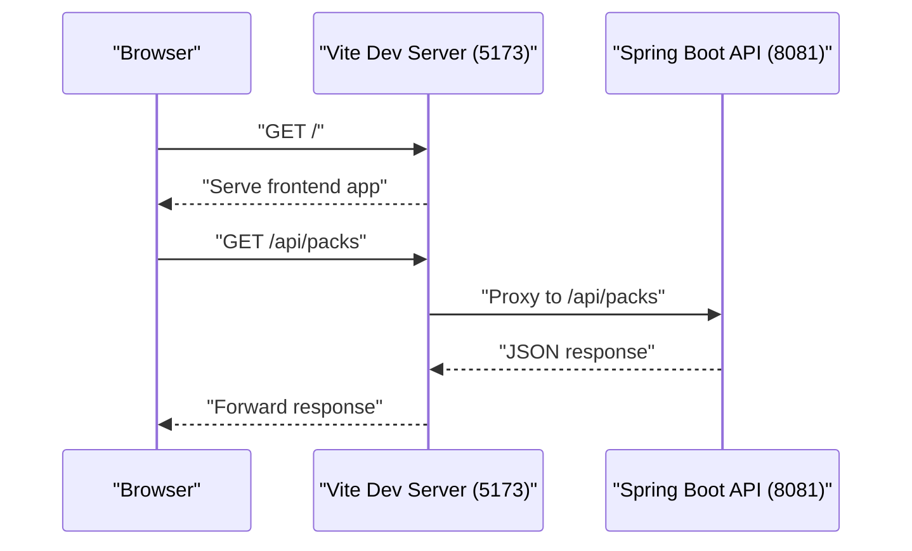
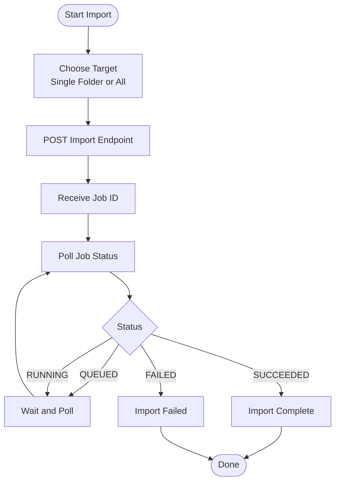

# Getting Started

<cite>
**Referenced Files in This Document**
- [README.md](file://README.md)
- [backend/pom.xml](file://backend/pom.xml)
- [backend/src/main/resources/application.yml](file://backend/src/main/resources/application.yml)
- [scripts/dev-api.sh](file://scripts/dev-api.sh)
- [frontend/package.json](file://frontend/package.json)
- [frontend/vite.config.ts](file://frontend/vite.config.ts)
- [frontend/src/api.ts](file://frontend/src/api.ts)
- [deploy/ec2/docker-compose.yml](file://deploy/ec2/docker-compose.yml)
- [docs/deployment.md](file://docs/deployment.md)
</cite>

## Table of Contents
1. [Introduction](#introduction)
2. [Prerequisites](#prerequisites)
3. [Project Structure](#project-structure)
4. [Environment Setup](#environment-setup)
5. [Backend Setup](#backend-setup)
6. [Frontend Setup](#frontend-setup)
7. [Running the Application Locally](#running-the-application-locally)
8. [Importing Content from pdf-qa-extractor](#importing-content-from-pdf-qa-extractor)
9. [Verification and Access](#verification-and-access)
10. [Common Issues and Troubleshooting](#common-issues-and-troubleshooting)
11. [Conclusion](#conclusion)

## Introduction
This guide helps you set up the exam-hunt-project for local development. The project is a monorepo containing a Spring Boot API backend and a React/Vite frontend. It integrates with pdf-qa-extractor to import question content and serves it through a modern web interface.

## Prerequisites
Before starting, ensure you have the following installed:

- Java 17+ and Maven (required for backend)
- Node 20+ (required for frontend)
- MongoDB Atlas (recommended: Mumbai/ap-south-1 for India latency)
- A local clone of the pdf-qa-extractor repository (for importing published manifests)

These requirements are documented in the project's README and backend configuration.

**Section sources**
- [README.md:20-25](file://README.md#L20-L25)
- [backend/pom.xml:20-22](file://backend/pom.xml#L20-L22)

## Project Structure
The repository follows a monorepo layout with two primary directories:

- backend: Spring Boot API with REST endpoints, MongoDB integration, and admin import functionality
- frontend: React application built with Vite, featuring routing, state management, and proxy configuration

**Diagram sources**
- [backend/pom.xml:1-78](file://backend/pom.xml#L1-L78)
- [backend/src/main/resources/application.yml:1-44](file://backend/src/main/resources/application.yml#L1-L44)
- [frontend/package.json:1-32](file://frontend/package.json#L1-L32)
- [frontend/vite.config.ts:1-20](file://frontend/vite.config.ts#L1-L20)
- [scripts/dev-api.sh:1-12](file://scripts/dev-api.sh#L1-L12)
- [docs/deployment.md:1-353](file://docs/deployment.md#L1-L353)
- [deploy/ec2/docker-compose.yml:1-30](file://deploy/ec2/docker-compose.yml#L1-L30)

**Section sources**
- [README.md:15-18](file://README.md#L15-L18)
- [backend/pom.xml:1-78](file://backend/pom.xml#L1-L78)
- [frontend/package.json:1-32](file://frontend/package.json#L1-L32)

## Environment Setup
Create and configure your environment file for local development:

1. Copy the example environment template:
   - Use the command documented in the README to create a local `.env` file from the example.

2. Configure required variables:
   - MONGODB_URI: Atlas connection string with database name (e.g., ending with `?retryWrites=true&w=majority`)
   - EXTRACTOR_ROOT: Absolute path to your pdf-qa-extractor repository
   - ADMIN_IMPORT_KEY: Optional admin import key for protected endpoints

3. Load environment variables:
   - The README describes loading the environment when starting the API server. The backend configuration also supports environment variables via application.yml.

4. Verify environment variables:
   - The backend reads MONGODB_URI, CORS_ORIGINS, EXTRACTOR_ROOT, and other app properties from environment variables.

**Section sources**
- [README.md:29-46](file://README.md#L29-L46)
- [backend/src/main/resources/application.yml:4-18](file://backend/src/main/resources/application.yml#L4-L18)

## Backend Setup
The backend is a Spring Boot application configured for MongoDB and admin import capabilities:

1. Install dependencies:
   - Navigate to the backend directory and run the Spring Boot development server as documented in the README.

2. Build and run:
   - The project uses Maven with Spring Boot plugin. The scripts/dev-api.sh demonstrates loading environment variables and invoking the Spring Boot runner.

3. Configuration highlights:
   - Server port defaults to 8081 via SERVER_PORT environment variable
   - MongoDB connection configured via MONGODB_URI
   - CORS origins configured via CORS_ORIGINS (defaults include localhost:5173)
   - Admin import key via ADMIN_IMPORT_KEY (optional)
   - JWT secret and expiration hours for authentication
   - Public API cache settings for performance

4. Docker support:
   - The backend includes a Dockerfile that builds a Java 17 JRE image and exposes port 8081. Health checks use the actuator endpoint.

**Section sources**
- [README.md:49-54](file://README.md#L49-L54)
- [scripts/dev-api.sh:1-12](file://scripts/dev-api.sh#L1-L12)
- [backend/src/main/resources/application.yml:1-44](file://backend/src/main/resources/application.yml#L1-L44)
- [backend/pom.xml:1-78](file://backend/pom.xml#L1-L78)
- [deploy/ec2/docker-compose.yml:1-30](file://deploy/ec2/docker-compose.yml#L1-L30)

## Frontend Setup
The frontend is a React application built with Vite:

1. Install dependencies:
   - Navigate to the frontend directory and run the package manager install command documented in the README.

2. Development server:
   - Start the Vite dev server as described in the README. The frontend proxies `/api` requests to the backend on port 8081.

3. Proxy configuration:
   - Vite's proxy targets 127.0.0.1:8081 for `/api` routes, enabling seamless development without CORS concerns.

4. Environment variables:
   - The frontend resolves API base URL dynamically. In development, it uses empty base (same-origin) unless forced via VITE_API_BASE_URL_FORCE.

5. Build and preview:
   - The package.json defines build and preview scripts for production bundling and local preview.

**Section sources**
- [README.md:64-70](file://README.md#L64-L70)
- [frontend/vite.config.ts:9-18](file://frontend/vite.config.ts#L9-L18)
- [frontend/src/api.ts:6-13](file://frontend/src/api.ts#L6-L13)
- [frontend/package.json:6-10](file://frontend/package.json#L6-L10)

## Running the Application Locally
Follow these steps to run the full application locally:

1. Start the backend:
   - Change to the backend directory and run the Spring Boot development server as documented in the README.

2. Start the frontend:
   - Change to the frontend directory, install dependencies, and start the Vite dev server as documented in the README.

3. Access the application:
   - Open the browser to the frontend URL documented in the README. The Vite proxy forwards `/api` requests to the backend.

**Diagram sources**
- [README.md:72](file://README.md#L72)
- [frontend/vite.config.ts:12-17](file://frontend/vite.config.ts#L12-L17)
- [backend/src/main/resources/application.yml:1-2](file://backend/src/main/resources/application.yml#L1-L2)

**Section sources**
- [README.md:49-70](file://README.md#L49-L70)
- [frontend/vite.config.ts:9-18](file://frontend/vite.config.ts#L9-L18)

## Importing Content from pdf-qa-extractor
After building and publishing content with pdf-qa-extractor, import it into the API:

1. Trigger import:
   - Use the curl commands documented in the README to import a specific year folder or all published manifests.

2. Endpoint behavior:
   - Import endpoints are protected by the ADMIN_IMPORT_KEY when configured. The frontend provides admin import functions that poll job status until completion.

3. Job polling:
   - The frontend includes robust polling logic for import jobs, handling statuses like QUEUED, RUNNING, SUCCEEDED, and FAILED.

**Diagram sources**
- [README.md:56-62](file://README.md#L56-L62)
- [frontend/src/api.ts:639-667](file://frontend/src/api.ts#L639-L667)

**Section sources**
- [README.md:56-62](file://README.md#L56-L62)
- [frontend/src/api.ts:592-699](file://frontend/src/api.ts#L592-L699)

## Verification and Access
To verify your setup is working:

1. Backend health:
   - Confirm the Spring Boot actuator health endpoint responds on the configured port.

2. Frontend accessibility:
   - Open the frontend URL and confirm it loads without CORS errors.

3. API endpoints:
   - Test basic endpoints like listing packs and questions to ensure data is available.

4. Admin import:
   - After importing content, verify that the imported data appears in the frontend and admin endpoints.

**Section sources**
- [README.md:72](file://README.md#L72)
- [backend/src/main/resources/application.yml:39-44](file://backend/src/main/resources/application.yml#L39-L44)

## Common Issues and Troubleshooting
Address these typical setup problems:

- Port conflicts:
  - Backend runs on 8081, frontend on 5173. Ensure these ports are free or adjust configuration accordingly.

- CORS errors:
  - The frontend proxy handles CORS for development. If using a custom API base URL, ensure CORS origins include your frontend origin.

- MongoDB connectivity:
  - Verify MONGODB_URI points to a reachable Atlas cluster with the correct database name.

- Admin import protection:
  - If ADMIN_IMPORT_KEY is set, include the required header when calling admin import endpoints.

- Proxy configuration:
  - The Vite proxy targets 127.0.0.1:8081 for `/api`. If you change backend port, update the proxy target.

- Timeout handling:
  - The frontend includes explicit timeout messages for slow or unresponsive servers. Restart the backend if requests time out.

**Section sources**
- [README.md:15-18](file://README.md#L15-L18)
- [frontend/vite.config.ts:12-17](file://frontend/vite.config.ts#L12-L17)
- [backend/src/main/resources/application.yml:11-18](file://backend/src/main/resources/application.yml#L11-L18)
- [frontend/src/api.ts:447-454](file://frontend/src/api.ts#L447-L454)

## Conclusion
You now have a complete local development environment for the exam-hunt-project. The backend and frontend are configured to work together seamlessly, with proxy support and environment-driven configuration. Use the import workflow to populate content from pdf-qa-extractor and verify everything works by accessing the frontend locally.