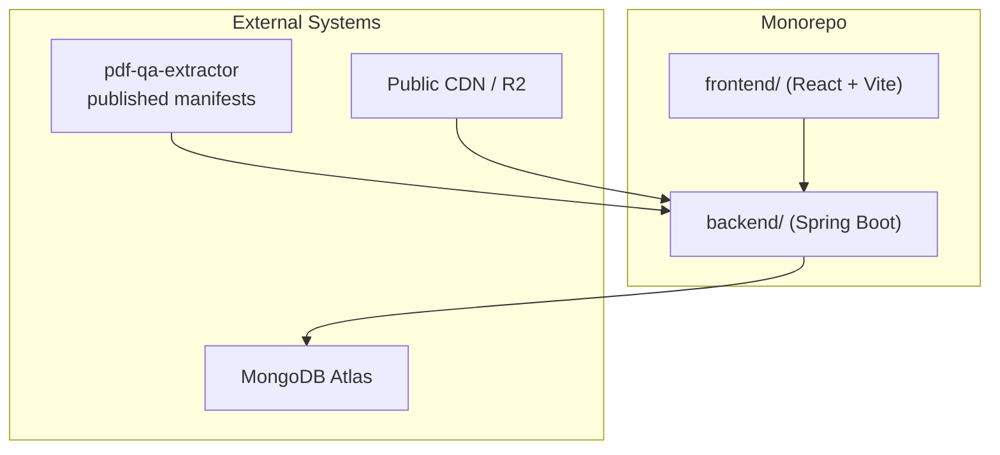
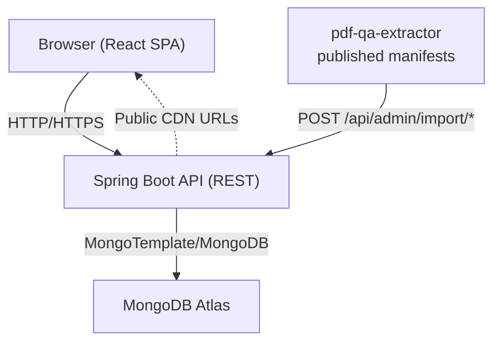
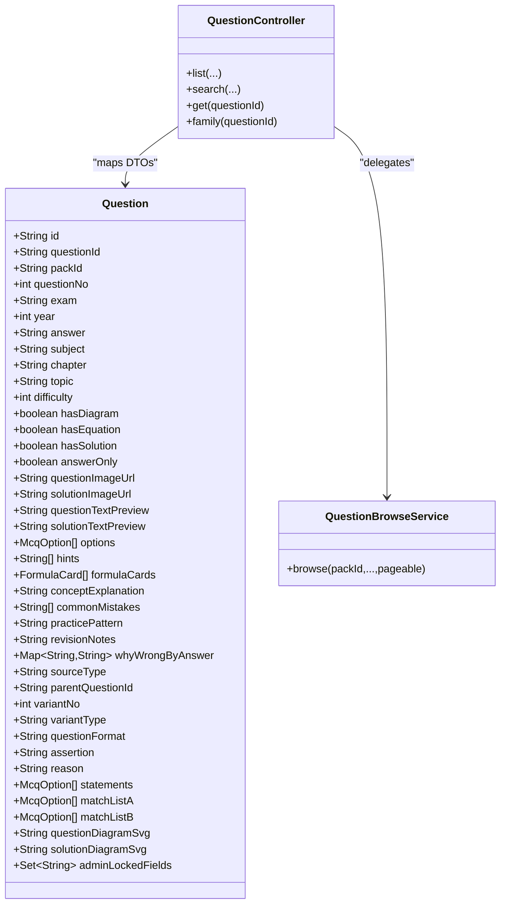
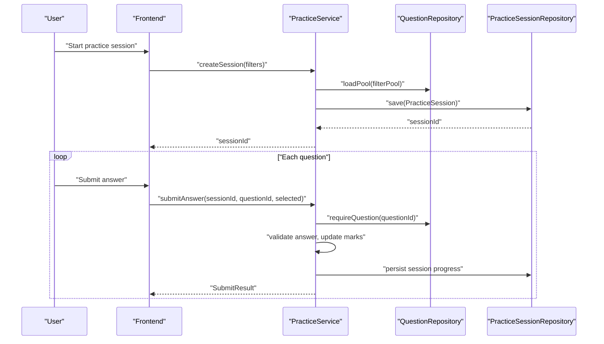
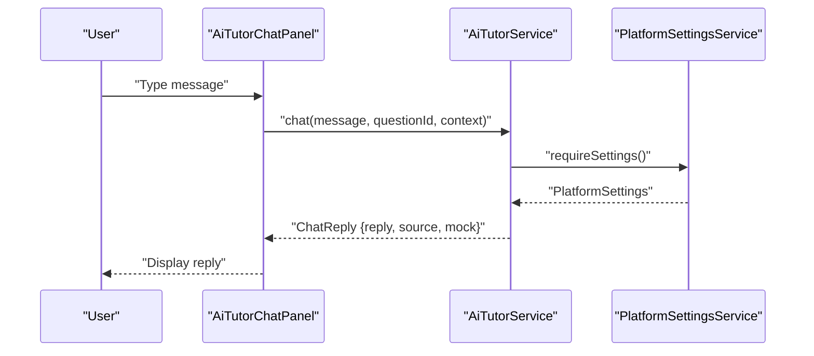
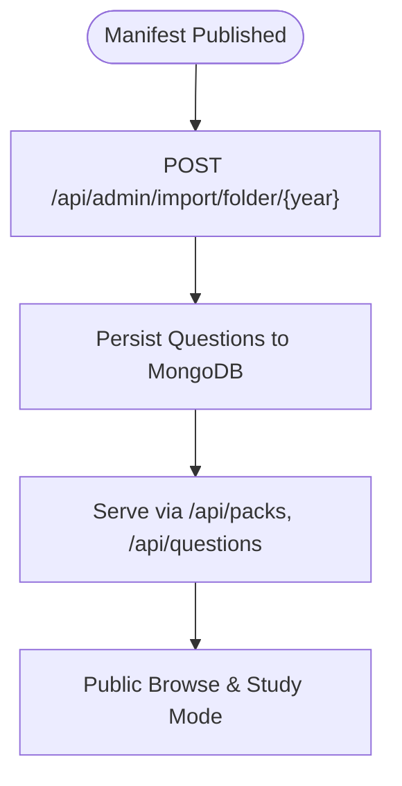
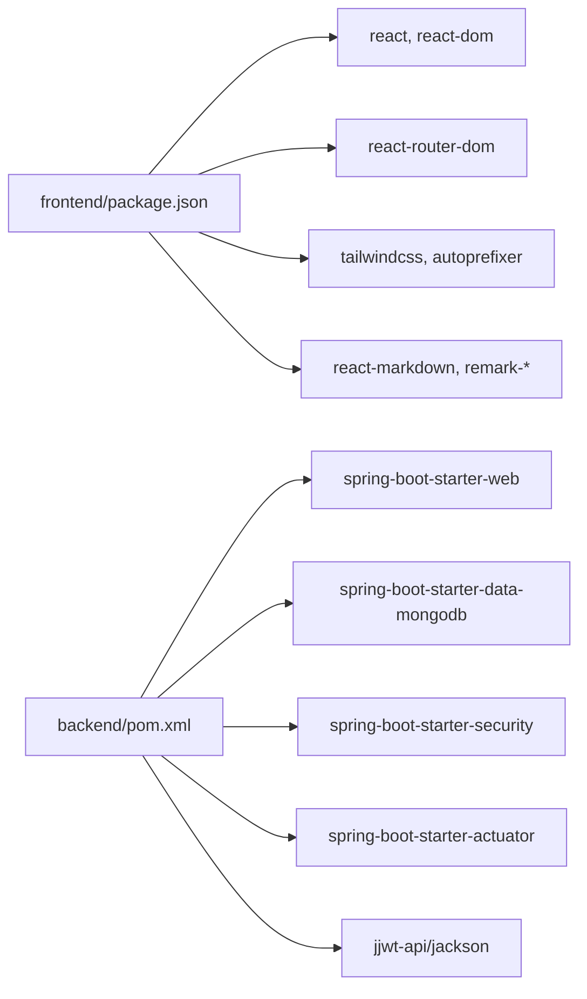

# Project Overview

<cite>
**Referenced Files in This Document**
- [README.md](file://README.md)
- [ExamHuntApplication.java](file://backend/src/main/java/com/neetlu/examhunt/ExamHuntApplication.java)
- [application.yml](file://backend/src/main/resources/application.yml)
- [SecurityConfig.java](file://backend/src/main/java/com/neetlu/examhunt/config/SecurityConfig.java)
- [Question.java](file://backend/src/main/java/com/neetlu/examhunt/model/Question.java)
- [QuestionController.java](file://backend/src/main/java/com/neetlu/examhunt/web/QuestionController.java)
- [QuestionBrowseService.java](file://backend/src/main/java/com/neetlu/examhunt/service/QuestionBrowseService.java)
- [PracticeService.java](file://backend/src/main/java/com/neetlu/examhunt/service/PracticeService.java)
- [AiTutorService.java](file://backend/src/main/java/com/neetlu/examhunt/service/AiTutorService.java)
- [App.tsx](file://frontend/src/App.tsx)
- [DashboardPage.tsx](file://frontend/src/pages/DashboardPage.tsx)
- [AiTutorChatPanel.tsx](file://frontend/src/components/AiTutorChatPanel.tsx)
- [package.json](file://frontend/package.json)
- [pom.xml](file://backend/pom.xml)
</cite>

## Table of Contents
1. [Introduction](#introduction)
2. [Project Structure](#project-structure)
3. [Core Components](#core-components)
4. [Architecture Overview](#architecture-overview)
5. [Detailed Component Analysis](#detailed-component-analysis)
6. [Dependency Analysis](#dependency-analysis)
7. [Performance Considerations](#performance-considerations)
8. [Troubleshooting Guide](#troubleshooting-guide)
9. [Conclusion](#conclusion)

## Introduction
Neetlu is a full-stack educational platform designed for NEET and competitive exam preparation. It provides a curated question bank derived from a trusted extractor pipeline, supports both public browsing and authenticated study/practice modes, and offers adaptive practice and an AI-powered learning assistant. The platform is organized as a monorepo with a Spring Boot backend serving a React/Vite frontend, backed by MongoDB.

The system’s mission is to enable efficient, data-driven learning through:
- Curated PYQ (Previous Year Questions) and AI-generated variants
- Adaptive practice sessions tailored to a learner’s performance
- AI-powered hints, explanations, and weak-area insights
- Public catalogs and leaderboards for motivation and benchmarking

## Project Structure
Neetlu follows a monorepo layout with clear separation between backend and frontend:
- Backend: Spring Boot application under backend/, exposing REST APIs for question catalogs, practice sessions, bookmarks, analytics, and administrative imports.
- Frontend: React application under frontend/ built with Vite, providing routes for dashboards, question banks, practice/test sessions, analytics, leaderboard, and admin tools.
- Shared pipeline: Content ingestion from pdf-qa-extractor via published manifests, imported into MongoDB and served through the backend APIs.

**Diagram sources**
- [README.md:1-110](file://README.md#L1-L110)
- [ExamHuntApplication.java:1-16](file://backend/src/main/java/com/neetlu/examhunt/ExamHuntApplication.java#L1-L16)
- [application.yml:1-44](file://backend/src/main/resources/application.yml#L1-L44)

**Section sources**
- [README.md:1-110](file://README.md#L1-L110)
- [ExamHuntApplication.java:1-16](file://backend/src/main/java/com/neetlu/examhunt/ExamHuntApplication.java#L1-L16)
- [application.yml:1-44](file://backend/src/main/resources/application.yml#L1-L44)

## Core Components
- Backend (Spring Boot)
  - REST controllers expose endpoints for packs, questions, practice, bookmarks, leaderboard, and admin imports.
  - MongoDB-backed domain models for questions, practice sessions, and user-related entities.
  - Services implement question browsing, practice session orchestration, AI tutoring, and analytics.
- Frontend (React + Vite)
  - Routing covers public and authenticated views: dashboard, bank, practice/test sessions, analytics, leaderboard, revision, admin, and question pages.
  - UI components integrate with backend APIs for catalogs, sessions, and AI chat.

Key backend technologies:
- Spring Boot starters for web, data-mongodb, validation, actuator, and security
- JWT-based authentication and admin key guard
- CORS configuration and stateless sessions

Key frontend technologies:
- React 18, React Router, Tailwind CSS, TypeScript, Vite
- Components for AI chat, practice panels, analytics, and dashboards

**Section sources**
- [pom.xml:24-66](file://backend/pom.xml#L24-L66)
- [package.json:11-30](file://frontend/package.json#L11-L30)
- [SecurityConfig.java:23-76](file://backend/src/main/java/com/neetlu/examhunt/config/SecurityConfig.java#L23-L76)
- [App.tsx:21-52](file://frontend/src/App.tsx#L21-L52)

## Architecture Overview
The platform’s runtime architecture connects the React frontend to the Spring Boot API, which persists and queries MongoDB. Content is ingested from pdf-qa-extractor manifests and cached for fast retrieval.

**Diagram sources**
- [README.md:5-13](file://README.md#L5-L13)
- [application.yml:8-16](file://backend/src/main/resources/application.yml#L8-L16)
- [QuestionController.java:24-40](file://backend/src/main/java/com/neetlu/examhunt/web/QuestionController.java#L24-L40)

**Section sources**
- [README.md:5-13](file://README.md#L5-L13)
- [application.yml:8-16](file://backend/src/main/resources/application.yml#L8-L16)

## Detailed Component Analysis

### Question Bank Management
The backend exposes a robust question catalog with filtering, pagination, and search. The Question entity encapsulates PYQ metadata, variants, images, and AI-enhanced fields. Controllers and services coordinate ingestion, enrichment, and presentation.

**Diagram sources**
- [Question.java:12-413](file://backend/src/main/java/com/neetlu/examhunt/model/Question.java#L12-L413)
- [QuestionController.java:24-292](file://backend/src/main/java/com/neetlu/examhunt/web/QuestionController.java#L24-L292)
- [QuestionBrowseService.java:16-102](file://backend/src/main/java/com/neetlu/examhunt/service/QuestionBrowseService.java#L16-L102)

**Section sources**
- [QuestionController.java:42-121](file://backend/src/main/java/com/neetlu/examhunt/web/QuestionController.java#L42-L121)
- [QuestionBrowseService.java:25-69](file://backend/src/main/java/com/neetlu/examhunt/service/QuestionBrowseService.java#L25-L69)
- [Question.java:12-413](file://backend/src/main/java/com/neetlu/examhunt/model/Question.java#L12-L413)

### Adaptive Practice
Adaptive practice adjusts question difficulty based on correctness, maintaining a dynamic queue for the session. The service orchestrates session creation, answer submission, skipping, and analytics.

**Diagram sources**
- [PracticeService.java:60-89](file://backend/src/main/java/com/neetlu/examhunt/service/PracticeService.java#L60-L89)
- [PracticeService.java:278-337](file://backend/src/main/java/com/neetlu/examhunt/service/PracticeService.java#L278-L337)

**Section sources**
- [PracticeService.java:60-89](file://backend/src/main/java/com/neetlu/examhunt/service/PracticeService.java#L60-L89)
- [PracticeService.java:278-337](file://backend/src/main/java/com/neetlu/examhunt/service/PracticeService.java#L278-L337)

### AI-Powered Learning Assistant
The AI tutor provides keyword-driven replies and contextual hints. The frontend renders a chat panel that integrates with backend endpoints gated by platform settings.

**Diagram sources**
- [AiTutorChatPanel.tsx:15-51](file://frontend/src/components/AiTutorChatPanel.tsx#L15-L51)
- [AiTutorService.java:20-40](file://backend/src/main/java/com/neetlu/examhunt/service/AiTutorService.java#L20-L40)

**Section sources**
- [AiTutorChatPanel.tsx:15-51](file://frontend/src/components/AiTutorChatPanel.tsx#L15-L51)
- [AiTutorService.java:20-58](file://backend/src/main/java/com/neetlu/examhunt/service/AiTutorService.java#L20-L58)

### Content Ingestion Pipeline
Content is ingested from pdf-qa-extractor manifests into MongoDB via admin endpoints. The pipeline ensures only QC-accepted questions are published to public endpoints.

**Diagram sources**
- [README.md:57-62](file://README.md#L57-L62)
- [QuestionController.java:42-57](file://backend/src/main/java/com/neetlu/examhunt/web/QuestionController.java#L42-L57)

**Section sources**
- [README.md:57-62](file://README.md#L57-L62)
- [QuestionController.java:42-57](file://backend/src/main/java/com/neetlu/examhunt/web/QuestionController.java#L42-L57)

## Dependency Analysis
- Backend dependencies include Spring Web, MongoDB, Validation, Actuator, Security, and JWT libraries.
- Frontend dependencies include React, React Router, Tailwind, KaTeX, and remark plugins for math rendering.

**Diagram sources**
- [package.json:11-30](file://frontend/package.json#L11-L30)
- [pom.xml:24-66](file://backend/pom.xml#L24-L66)

**Section sources**
- [package.json:11-30](file://frontend/package.json#L11-L30)
- [pom.xml:24-66](file://backend/pom.xml#L24-L66)

## Performance Considerations
- Indexes on Question collection support efficient filtering by pack, subject, chapter, and composite keys for pack+questionNo and pack+subject+chapter.
- Pagination limits requests to safe sizes to avoid heavy queries.
- Public API caching settings are configurable to balance freshness and cost.
- Stateless JWT sessions reduce server-side state and improve scalability.

**Section sources**
- [Question.java:12-14](file://backend/src/main/java/com/neetlu/examhunt/model/Question.java#L12-L14)
- [QuestionController.java:50-56](file://backend/src/main/java/com/neetlu/examhunt/web/QuestionController.java#L50-L56)
- [application.yml:27-31](file://backend/src/main/resources/application.yml#L27-L31)

## Troubleshooting Guide
- Authentication and Authorization
  - Ensure JWT secret and roles are configured; verify admin key headers for admin endpoints.
  - Stateless sessions require proper CORS origins and CSRF disabled for SPA proxying.
- Database Connectivity
  - Confirm MONGODB_URI and network access; use Atlas Mumbai region for low latency in India.
- Admin Import
  - Provide ADMIN_IMPORT_KEY and ensure extractor manifest paths are correct; verify extractor root or manifest base URL.
- Frontend Proxy
  - Dev server proxies /api to backend; confirm ports and CORS origins align with local setup.

**Section sources**
- [SecurityConfig.java:42-74](file://backend/src/main/java/com/neetlu/examhunt/config/SecurityConfig.java#L42-L74)
- [application.yml:8-16](file://backend/src/main/resources/application.yml#L8-L16)
- [README.md:20-73](file://README.md#L20-L73)

## Conclusion
Neetlu delivers a cohesive, scalable exam prep platform combining a curated question bank, adaptive practice, and an AI tutor. Its monorepo structure, Spring Boot backend, React frontend, and MongoDB persistence form a solid foundation for continuous improvement and deployment across cloud providers. The documented ingestion pipeline and API surface enable efficient content curation and learner engagement.