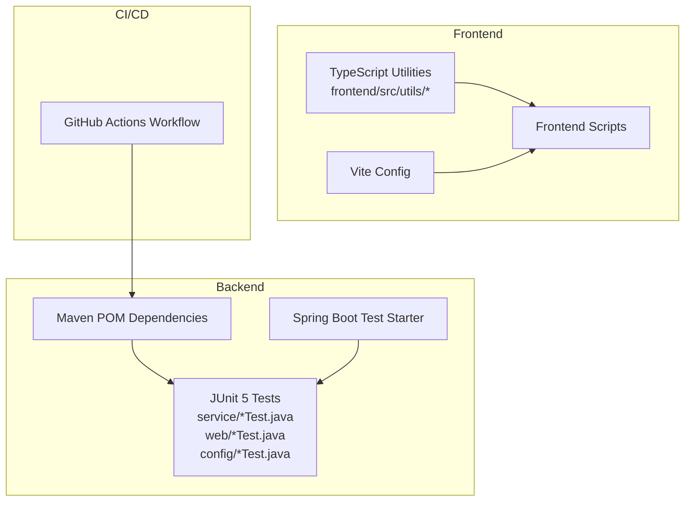
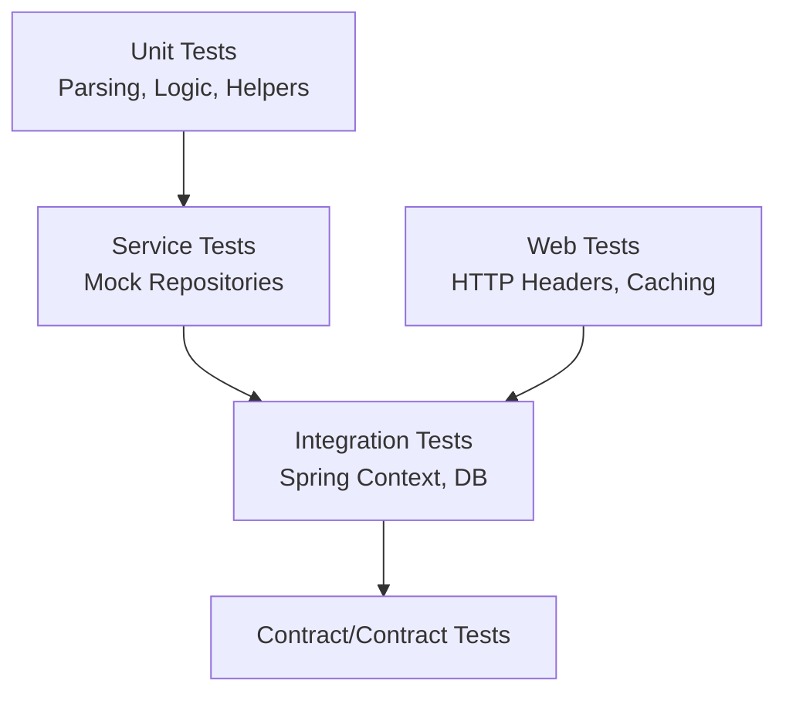
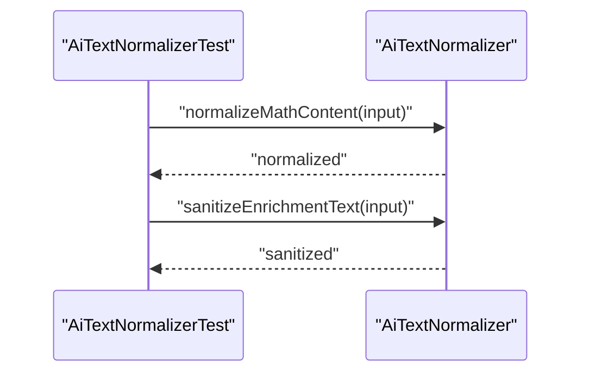
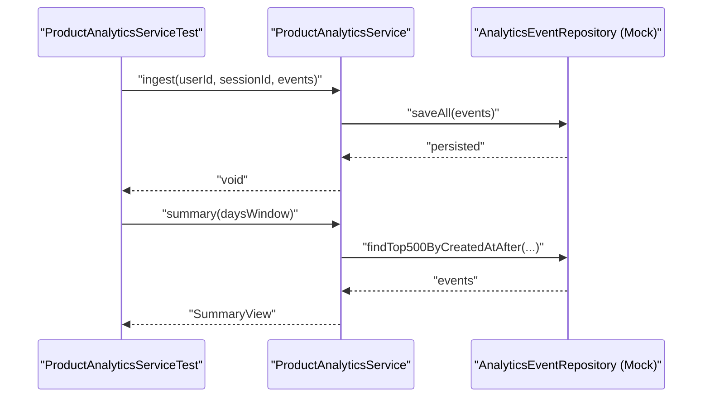
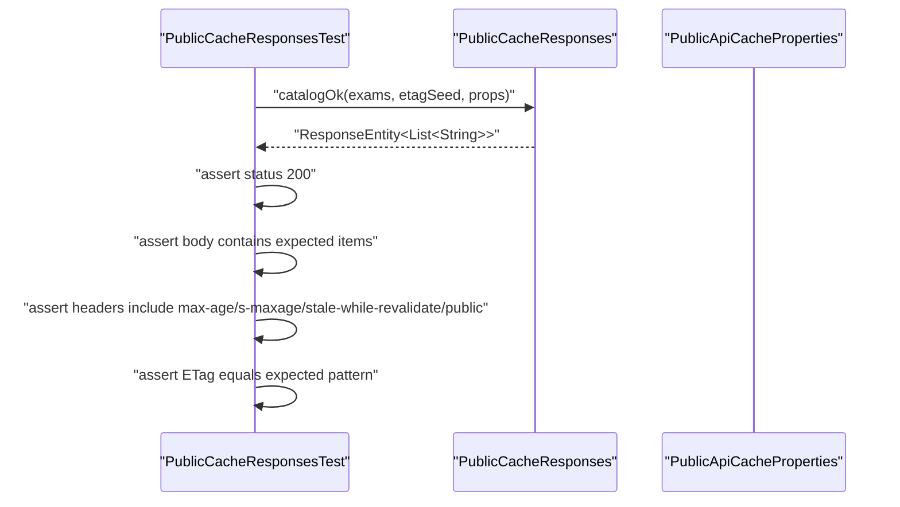
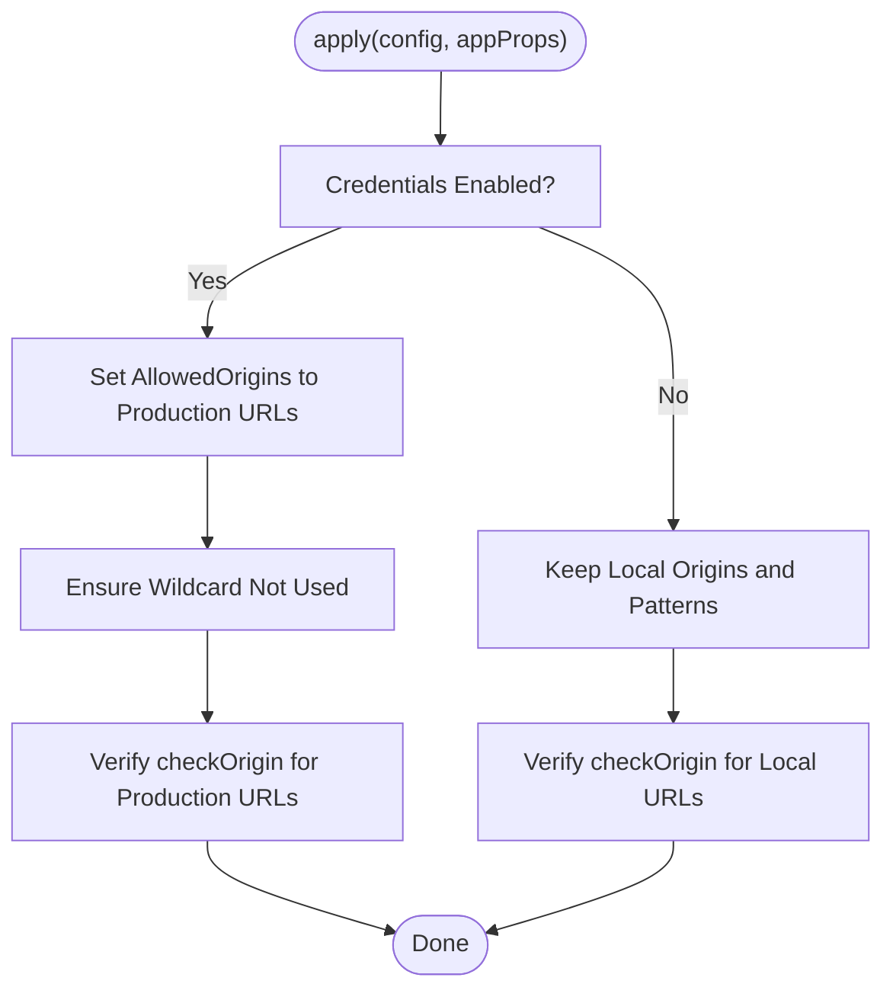
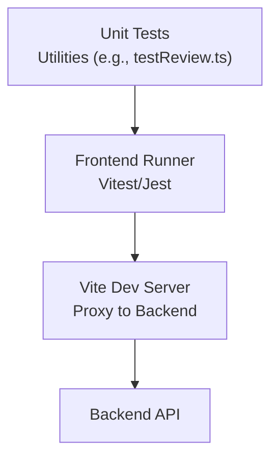
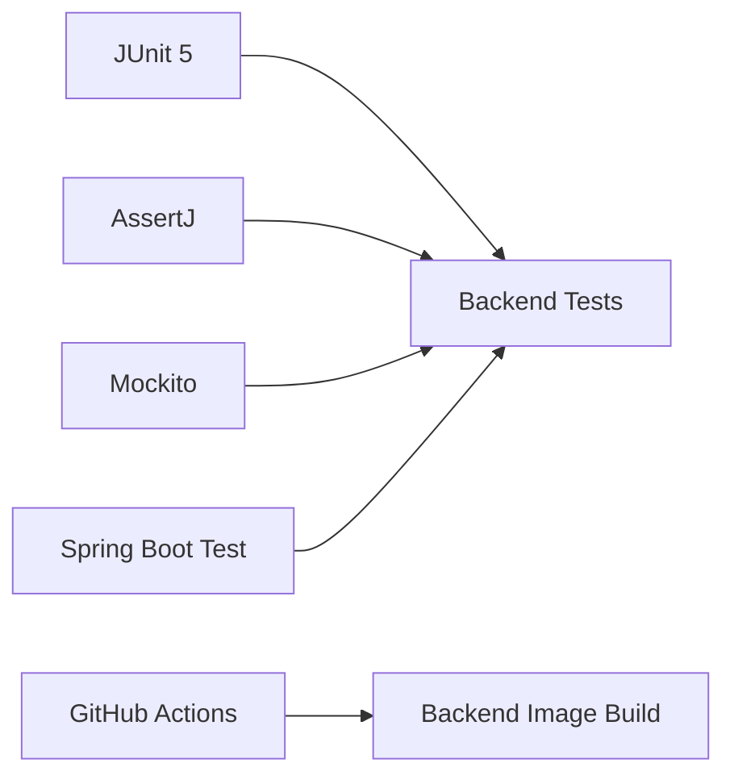

# Testing Strategy

<cite>
**Referenced Files in This Document**
- [pom.xml](file://backend/pom.xml)
- [.github/workflows/publish-backend-image.yml](file://.github/workflows/publish-backend-image.yml)
- [AiTextNormalizerTest.java](file://backend/src/test/java/com/neetlu/examhunt/service/AiTextNormalizerTest.java)
- [MatchingVariantParserTest.java](file://backend/src/test/java/com/neetlu/examhunt/service/MatchingVariantParserTest.java)
- [PackStatsServiceTest.java](file://backend/src/test/java/com/neetlu/examhunt/service/PackStatsServiceTest.java)
- [ProductAnalyticsServiceTest.java](file://backend/src/test/java/com/neetlu/examhunt/service/ProductAnalyticsServiceTest.java)
- [CorsSupportTest.java](file://backend/src/test/java/com/neetlu/examhunt/config/CorsSupportTest.java)
- [PublicCacheResponsesTest.java](file://backend/src/test/java/com/neetlu/examhunt/web/PublicCacheResponsesTest.java)
- [testReview.ts](file://frontend/src/utils/testReview.ts)
- [vite.config.ts](file://frontend/vite.config.ts)
- [package.json](file://frontend/package.json)
</cite>

## Table of Contents
1. [Introduction](#introduction)
2. [Project Structure](#project-structure)
3. [Core Components](#core-components)
4. [Architecture Overview](#architecture-overview)
5. [Detailed Component Analysis](#detailed-component-analysis)
6. [Dependency Analysis](#dependency-analysis)
7. [Performance Considerations](#performance-considerations)
8. [Troubleshooting Guide](#troubleshooting-guide)
9. [Conclusion](#conclusion)
10. [Appendices](#appendices)

## Introduction
This document outlines the testing strategy and implementation for the exam-hunt project. It covers backend unit testing, integration testing patterns, and frontend testing methodologies. It documents the frameworks used, test organization, continuous integration testing procedures, practical examples of testing core business logic, API endpoints, and UI components, along with test utilities, mock implementations, best practices, and guidance for performance and load testing.

## Project Structure
The repository is organized into a Spring Boot backend and a React-based frontend. Tests are present under the backend module’s JUnit test sources and under the frontend’s TypeScript utilities. CI/CD is configured via GitHub Actions for backend container builds.

**Diagram sources**
- [pom.xml:24-66](file://backend/pom.xml#L24-L66)
- [.github/workflows/publish-backend-image.yml:1-71](file://.github/workflows/publish-backend-image.yml#L1-L71)
- [vite.config.ts:1-20](file://frontend/vite.config.ts#L1-L20)
- [package.json:6-10](file://frontend/package.json#L6-L10)

**Section sources**
- [pom.xml:1-78](file://backend/pom.xml#L1-L78)
- [.github/workflows/publish-backend-image.yml:1-71](file://.github/workflows/publish-backend-image.yml#L1-L71)
- [vite.config.ts:1-20](file://frontend/vite.config.ts#L1-L20)
- [package.json:1-32](file://frontend/package.json#L1-L32)

## Core Components
- Backend testing stack:
  - JUnit 5 for unit tests.
  - AssertJ for fluent assertions.
  - Mockito for mocking collaborators.
  - Spring Boot Test starter for integration-style tests.
- Frontend testing stack:
  - Vite-based development and build pipeline.
  - React and TypeScript ecosystem.
  - No dedicated frontend test runner is configured in the repository snapshot; tests are typically authored under a conventional test folder in a typical Vite/React setup.

Key backend test categories:
- Unit tests for pure logic and parsing helpers.
- Service-layer tests with mocked repositories.
- Web-layer tests for HTTP header and caching behaviors.
- Configuration tests for CORS policies.

**Section sources**
- [pom.xml:64-66](file://backend/pom.xml#L64-L66)
- [AiTextNormalizerTest.java:1-28](file://backend/src/test/java/com/neetlu/examhunt/service/AiTextNormalizerTest.java#L1-L28)
- [ProductAnalyticsServiceTest.java:22-82](file://backend/src/test/java/com/neetlu/examhunt/service/ProductAnalyticsServiceTest.java#L22-L82)
- [PublicCacheResponsesTest.java:1-30](file://backend/src/test/java/com/neetlu/examhunt/web/PublicCacheResponsesTest.java#L1-L30)
- [CorsSupportTest.java:1-67](file://backend/src/test/java/com/neetlu/examhunt/config/CorsSupportTest.java#L1-L67)

## Architecture Overview
The testing architecture separates concerns by layer:
- Pure logic and parsing tests validate deterministic transformations without external dependencies.
- Service tests validate orchestrations and repository interactions using mocks.
- Web tests validate HTTP-level behaviors such as headers and caching.
- CI/CD validates backend image builds but does not currently run tests in the workflow.

[No sources needed since this diagram shows conceptual workflow, not actual code structure]

## Detailed Component Analysis

### Backend Unit Testing: Parsing and Normalization
- Purpose: Validate text normalization and variant parsing logic.
- Examples:
  - Math delimiter repair and enrichment sanitization.
  - Matching variant extraction from JSON nodes and stability checks.

**Diagram sources**
- [AiTextNormalizerTest.java:11-26](file://backend/src/test/java/com/neetlu/examhunt/service/AiTextNormalizerTest.java#L11-L26)

**Section sources**
- [AiTextNormalizerTest.java:1-28](file://backend/src/test/java/com/neetlu/examhunt/service/AiTextNormalizerTest.java#L1-L28)

### Backend Service Testing: Analytics and Statistics
- Purpose: Validate ingestion, filtering, and aggregation of product analytics events; validate pack statistics derivation.
- Examples:
  - Event ingestion with sanitized attributes and persistence.
  - Conditional analytics behavior when disabled.
  - Derivation of total counts from PYQ and variant counts.

**Diagram sources**
- [ProductAnalyticsServiceTest.java:35-80](file://backend/src/test/java/com/neetlu/examhunt/service/ProductAnalyticsServiceTest.java#L35-L80)

**Section sources**
- [ProductAnalyticsServiceTest.java:1-82](file://backend/src/test/java/com/neetlu/examhunt/service/ProductAnalyticsServiceTest.java#L1-L82)
- [PackStatsServiceTest.java:1-33](file://backend/src/test/java/com/neetlu/examhunt/service/PackStatsServiceTest.java#L1-L33)

### Backend Web Testing: HTTP Headers and Caching
- Purpose: Validate HTTP caching headers and ETag generation for public endpoints.
- Example:
  - Catalog OK response sets Cache-Control directives and ETag.

**Diagram sources**
- [PublicCacheResponsesTest.java:13-28](file://backend/src/test/java/com/neetlu/examhunt/web/PublicCacheResponsesTest.java#L13-L28)

**Section sources**
- [PublicCacheResponsesTest.java:1-30](file://backend/src/test/java/com/neetlu/examhunt/web/PublicCacheResponsesTest.java#L1-L30)

### Backend Configuration Testing: CORS Policies
- Purpose: Validate CORS configuration application for production and local origins.
- Examples:
  - Allowed origins lists for production without wildcard when credentials are enabled.
  - Local development origins and patterns retained.

**Diagram sources**
- [CorsSupportTest.java:10-65](file://backend/src/test/java/com/neetlu/examhunt/config/CorsSupportTest.java#L10-L65)

**Section sources**
- [CorsSupportTest.java:1-67](file://backend/src/test/java/com/neetlu/examhunt/config/CorsSupportTest.java#L1-L67)

### Frontend Testing Methodologies
- Current state: No explicit frontend test framework is configured in the repository snapshot. The frontend includes a utility module for test review logic.
- Recommended approach:
  - Add a test runner (e.g., Vitest or Jest) and React Testing Library for component tests.
  - Keep logic in utilities (e.g., test review filters) testable via unit tests.
  - Use Vite’s built-in dev server and proxy configuration for integration-like testing against the backend.

**Diagram sources**
- [testReview.ts:1-75](file://frontend/src/utils/testReview.ts#L1-L75)
- [vite.config.ts:9-18](file://frontend/vite.config.ts#L9-L18)

**Section sources**
- [testReview.ts:1-75](file://frontend/src/utils/testReview.ts#L1-L75)
- [vite.config.ts:1-20](file://frontend/vite.config.ts#L1-L20)
- [package.json:6-10](file://frontend/package.json#L6-L10)

## Dependency Analysis
- Backend test dependencies:
  - JUnit Jupiter and AssertJ for assertions.
  - Mockito for mocking repositories and collaborators.
  - Spring Boot Starter Test for Spring-specific testing support.
- CI/CD dependency:
  - GitHub Actions workflow builds and pushes the backend Docker image; tests are not executed in this workflow.

**Diagram sources**
- [pom.xml:64-66](file://backend/pom.xml#L64-L66)
- [.github/workflows/publish-backend-image.yml:24-71](file://.github/workflows/publish-backend-image.yml#L24-L71)

**Section sources**
- [pom.xml:24-66](file://backend/pom.xml#L24-L66)
- [.github/workflows/publish-backend-image.yml:1-71](file://.github/workflows/publish-backend-image.yml#L1-L71)

## Performance Considerations
- Backend:
  - Favor unit tests for pure logic to keep the suite fast.
  - Use repository mocks to avoid database overhead in service tests.
  - Introduce contract tests to validate API shapes and reduce flakiness.
- Frontend:
  - Keep utility logic (e.g., filters) pure and easily testable.
  - Use lightweight test runners to minimize cold-start overhead.
- Load testing:
  - Use tools like k6 or Artillery to simulate concurrent requests against the backend API.
  - Complement with synthetic traffic from the frontend to the backend via Vite proxy.

[No sources needed since this section provides general guidance]

## Troubleshooting Guide
- Assertion failures:
  - Prefer AssertJ for readable failure messages and rich matchers.
  - Use ArgumentCaptor to verify repository interactions precisely.
- Mock misconfiguration:
  - Ensure mocks capture the intended arguments and are verified after test execution.
- CORS issues:
  - Validate origin checks and credential handling in configuration tests.
- HTTP caching:
  - Confirm Cache-Control directives and ETag formats align with expectations.

**Section sources**
- [ProductAnalyticsServiceTest.java:45-54](file://backend/src/test/java/com/neetlu/examhunt/service/ProductAnalyticsServiceTest.java#L45-L54)
- [ProductAnalyticsServiceTest.java:58-62](file://backend/src/test/java/com/neetlu/examhunt/service/ProductAnalyticsServiceTest.java#L58-L62)
- [CorsSupportTest.java:32-38](file://backend/src/test/java/com/neetlu/examhunt/config/CorsSupportTest.java#L32-L38)
- [PublicCacheResponsesTest.java:19-28](file://backend/src/test/java/com/neetlu/examhunt/web/PublicCacheResponsesTest.java#L19-L28)

## Conclusion
The exam-hunt project demonstrates a pragmatic testing approach with focused unit tests for parsing and normalization, service tests with mocks, and web tests validating HTTP behaviors. The CI/CD pipeline currently builds backend images but does not execute tests. Extending the frontend test coverage and integrating backend tests into CI would strengthen quality assurance. Adopting best practices for test organization, mocks, and performance/load testing will further improve reliability and maintainability.

[No sources needed since this section summarizes without analyzing specific files]

## Appendices

### Practical Examples Index
- Backend unit tests:
  - [AiTextNormalizerTest.java:1-28](file://backend/src/test/java/com/neetlu/examhunt/service/AiTextNormalizerTest.java#L1-L28)
  - [MatchingVariantParserTest.java:1-94](file://backend/src/test/java/com/neetlu/examhunt/service/MatchingVariantParserTest.java#L1-L94)
- Backend service tests:
  - [ProductAnalyticsServiceTest.java:1-82](file://backend/src/test/java/com/neetlu/examhunt/service/ProductAnalyticsServiceTest.java#L1-L82)
  - [PackStatsServiceTest.java:1-33](file://backend/src/test/java/com/neetlu/examhunt/service/PackStatsServiceTest.java#L1-L33)
- Backend web tests:
  - [PublicCacheResponsesTest.java:1-30](file://backend/src/test/java/com/neetlu/examhunt/web/PublicCacheResponsesTest.java#L1-L30)
- Backend configuration tests:
  - [CorsSupportTest.java:1-67](file://backend/src/test/java/com/neetlu/examhunt/config/CorsSupportTest.java#L1-L67)
- Frontend utility tests:
  - [testReview.ts:1-75](file://frontend/src/utils/testReview.ts#L1-L75)

### Continuous Integration Testing Procedures
- Current state:
  - Backend image build workflow exists and is triggered on pushes to main under the backend path.
- Recommendations:
  - Add a dedicated job to run Maven tests and report results.
  - Optionally, add a frontend test job using the existing scripts and a test runner.

**Section sources**
- [.github/workflows/publish-backend-image.yml:1-71](file://.github/workflows/publish-backend-image.yml#L1-L71)
- [package.json:6-10](file://frontend/package.json#L6-L10)