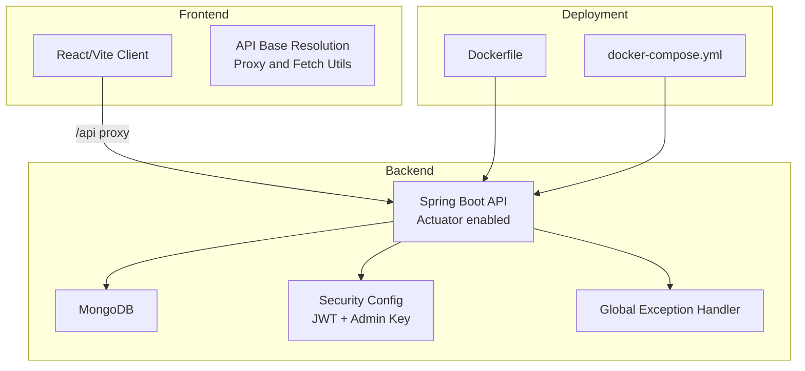
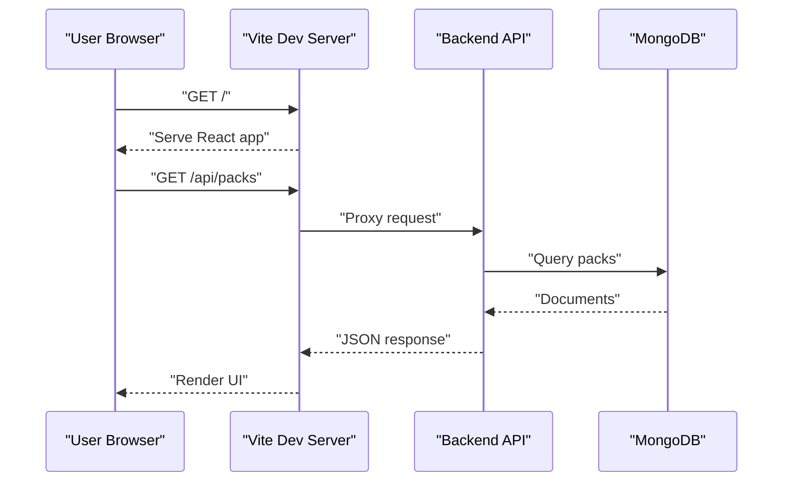
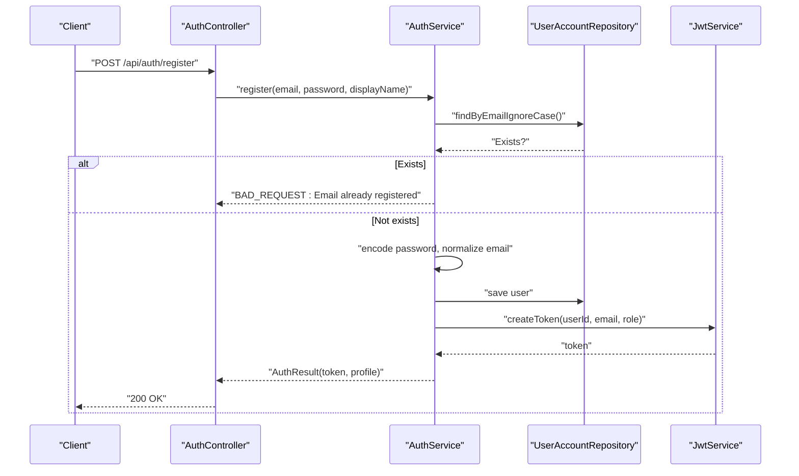
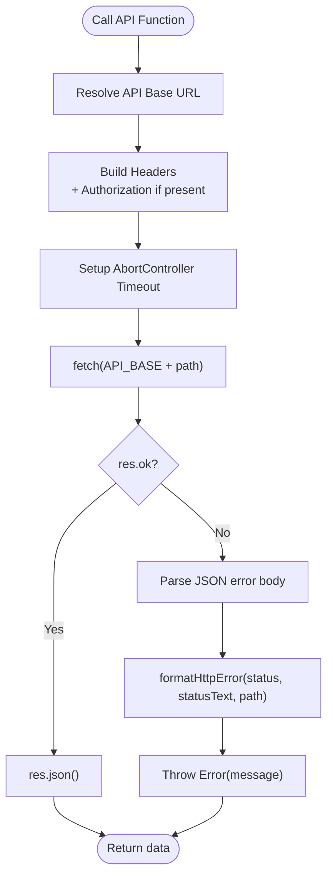
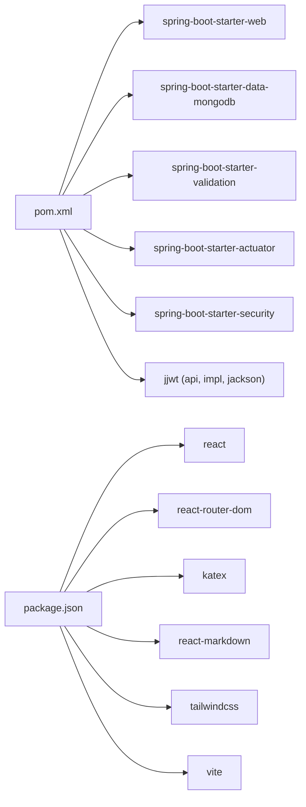
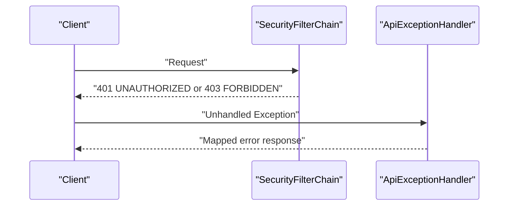

# Troubleshooting and FAQ

<cite>
**Referenced Files in This Document**
- [README.md](file://README.md)
- [backend/src/main/resources/application.yml](file://backend/src/main/resources/application.yml)
- [backend/pom.xml](file://backend/pom.xml)
- [backend/Dockerfile](file://backend/Dockerfile)
- [deploy/ec2/docker-compose.yml](file://deploy/ec2/docker-compose.yml)
- [scripts/dev-api.sh](file://scripts/dev-api.sh)
- [backend/src/main/java/com/neetlu/examhunt/web/ApiExceptionHandler.java](file://backend/src/main/java/com/neetlu/examhunt/web/ApiExceptionHandler.java)
- [backend/src/main/java/com/neetlu/examhunt/config/SecurityConfig.java](file://backend/src/main/java/com/neetlu/examhunt/config/SecurityConfig.java)
- [backend/src/main/java/com/neetlu/examhunt/web/AuthController.java](file://backend/src/main/java/com/neetlu/examhunt/web/AuthController.java)
- [backend/src/main/java/com/neetlu/examhunt/service/AuthService.java](file://backend/src/main/java/com/neetlu/examhunt/service/AuthService.java)
- [backend/src/main/java/com/neetlu/examhunt/repository/UserAccountRepository.java](file://backend/src/main/java/com/neetlu/examhunt/repository/UserAccountRepository.java)
- [frontend/vite.config.ts](file://frontend/vite.config.ts)
- [frontend/package.json](file://frontend/package.json)
- [frontend/src/api.ts](file://frontend/src/api.ts)
</cite>

## Table of Contents
1. [Introduction](#introduction)
2. [Project Structure](#project-structure)
3. [Core Components](#core-components)
4. [Architecture Overview](#architecture-overview)
5. [Detailed Component Analysis](#detailed-component-analysis)
6. [Dependency Analysis](#dependency-analysis)
7. [Performance Considerations](#performance-considerations)
8. [Troubleshooting Guide](#troubleshooting-guide)
9. [Conclusion](#conclusion)
10. [Appendices](#appendices)

## Introduction
This document provides a comprehensive troubleshooting guide and FAQ for the exam-hunt project. It covers common issues during setup, development, and deployment, with practical solutions. It also includes debugging techniques for backend API issues, frontend rendering problems, and database connectivity issues. Guidance is provided on performance optimization, memory management, resource utilization, log analysis, error diagnosis, system monitoring, configuration, deployment, and maintenance procedures including backups and disaster recovery.

## Project Structure
The exam-hunt project is a monorepo containing:
- Backend: Spring Boot API with MongoDB, Actuator, JWT, and security configuration.
- Frontend: React (Vite) client with TypeScript and Tailwind CSS.
- Deployment: Docker images and docker-compose for EC2-style deployments.
- Scripts: Local development helpers.

**Diagram sources**
- [backend/src/main/resources/application.yml:1-44](file://backend/src/main/resources/application.yml#L1-L44)
- [backend/src/main/java/com/neetlu/examhunt/config/SecurityConfig.java:1-76](file://backend/src/main/java/com/neetlu/examhunt/config/SecurityConfig.java#L1-L76)
- [backend/src/main/java/com/neetlu/examhunt/web/ApiExceptionHandler.java:1-39](file://backend/src/main/java/com/neetlu/examhunt/web/ApiExceptionHandler.java#L1-L39)
- [frontend/vite.config.ts:1-20](file://frontend/vite.config.ts#L1-L20)
- [frontend/src/api.ts:1-1300](file://frontend/src/api.ts#L1-L1300)
- [backend/Dockerfile:1-43](file://backend/Dockerfile#L1-L43)
- [deploy/ec2/docker-compose.yml:1-30](file://deploy/ec2/docker-compose.yml#L1-L30)

**Section sources**
- [README.md:1-110](file://README.md#L1-L110)
- [backend/src/main/resources/application.yml:1-44](file://backend/src/main/resources/application.yml#L1-L44)
- [frontend/vite.config.ts:1-20](file://frontend/vite.config.ts#L1-L20)
- [backend/Dockerfile:1-43](file://backend/Dockerfile#L1-L43)
- [deploy/ec2/docker-compose.yml:1-30](file://deploy/ec2/docker-compose.yml#L1-L30)

## Core Components
- Backend configuration and runtime:
  - Application properties for server port, MongoDB URI, CORS origins, extractor roots, JWT, caching, analytics, and Actuator exposure.
  - Dependencies include Spring Web, Data MongoDB, Validation, Actuator, Security, and JWT libraries.
  - Health checks via Actuator and Docker HEALTHCHECK.
- Frontend configuration and runtime:
  - Vite dev server with proxy to backend.
  - API base resolution logic and robust fetch wrapper with timeouts and error messaging.
- Deployment:
  - Multi-stage Docker build and docker-compose healthchecks for automated monitoring.

**Section sources**
- [backend/src/main/resources/application.yml:1-44](file://backend/src/main/resources/application.yml#L1-L44)
- [backend/pom.xml:1-78](file://backend/pom.xml#L1-L78)
- [backend/Dockerfile:1-43](file://backend/Dockerfile#L1-L43)
- [deploy/ec2/docker-compose.yml:1-30](file://deploy/ec2/docker-compose.yml#L1-L30)
- [frontend/vite.config.ts:1-20](file://frontend/vite.config.ts#L1-L20)
- [frontend/src/api.ts:1-1300](file://frontend/src/api.ts#L1-L1300)

## Architecture Overview
High-level flow:
- Frontend requests are proxied to the backend during development.
- Production builds use a configurable API base URL.
- Backend serves REST endpoints, enforces security, and connects to MongoDB.
- Actuator exposes health and info endpoints for monitoring.

**Diagram sources**
- [frontend/vite.config.ts:1-20](file://frontend/vite.config.ts#L1-L20)
- [backend/src/main/resources/application.yml:1-44](file://backend/src/main/resources/application.yml#L1-L44)

## Detailed Component Analysis

### Backend API and Security
- Security configuration:
  - Stateless sessions, CSRF disabled, CORS applied from properties.
  - Public endpoints for browsing and authentication; authenticated routes for practice and bookmarks; admin-only endpoints.
  - Authentication entry point returns UNAUTHORIZED for unauthenticated requests.
- Authentication flow:
  - Registration validates email uniqueness and password length, encodes password, assigns role, and issues JWT.
  - Login validates credentials and issues JWT.
  - Profile endpoint requires a valid JWT.
- Global exception handling:
  - Maps authentication, access denied, HTTP status exceptions, and bad request scenarios to appropriate HTTP responses.

**Diagram sources**
- [backend/src/main/java/com/neetlu/examhunt/web/AuthController.java:1-45](file://backend/src/main/java/com/neetlu/examhunt/web/AuthController.java#L1-L45)
- [backend/src/main/java/com/neetlu/examhunt/service/AuthService.java:1-106](file://backend/src/main/java/com/neetlu/examhunt/service/AuthService.java#L1-L106)
- [backend/src/main/java/com/neetlu/examhunt/repository/UserAccountRepository.java:1-17](file://backend/src/main/java/com/neetlu/examhunt/repository/UserAccountRepository.java#L1-L17)

**Section sources**
- [backend/src/main/java/com/neetlu/examhunt/config/SecurityConfig.java:1-76](file://backend/src/main/java/com/neetlu/examhunt/config/SecurityConfig.java#L1-L76)
- [backend/src/main/java/com/neetlu/examhunt/web/AuthController.java:1-45](file://backend/src/main/java/com/neetlu/examhunt/web/AuthController.java#L1-L45)
- [backend/src/main/java/com/neetlu/examhunt/service/AuthService.java:1-106](file://backend/src/main/java/com/neetlu/examhunt/service/AuthService.java#L1-L106)
- [backend/src/main/java/com/neetlu/examhunt/repository/UserAccountRepository.java:1-17](file://backend/src/main/java/com/neetlu/examhunt/repository/UserAccountRepository.java#L1-L17)
- [backend/src/main/java/com/neetlu/examhunt/web/ApiExceptionHandler.java:1-39](file://backend/src/main/java/com/neetlu/examhunt/web/ApiExceptionHandler.java#L1-L39)

### Frontend API Client and Proxy
- API base resolution:
  - In development, if a forced base URL is not set, requests are sent to the same origin (via Vite proxy).
  - In production, the base URL is taken from the environment variable.
- Fetch wrapper:
  - Adds Authorization header when present.
  - Applies a timeout and provides actionable error messages for common scenarios (timeout, unreachable server).
  - Formats HTTP errors with user-friendly messages depending on status and path.
- Caching:
  - Short-lived cache for GET requests to coalesce duplicate calls.

**Diagram sources**
- [frontend/src/api.ts:430-480](file://frontend/src/api.ts#L430-L480)

**Section sources**
- [frontend/vite.config.ts:1-20](file://frontend/vite.config.ts#L1-L20)
- [frontend/src/api.ts:1-1300](file://frontend/src/api.ts#L1-L1300)

### Database Connectivity and Initialization
- MongoDB connection:
  - URI configured via environment variable; defaults to localhost if not set.
  - Ensure the cluster allows connections from your network or use VPC/IP allowlist.
- Admin bootstrap:
  - Admin account bootstrap initializes an admin user if configured.
- Import sources:
  - Two supported import sources: local extractor root or a manifest base URL.

**Section sources**
- [backend/src/main/resources/application.yml:1-44](file://backend/src/main/resources/application.yml#L1-L44)
- [README.md:20-46](file://README.md#L20-L46)

## Dependency Analysis
- Backend dependencies:
  - Web, Data MongoDB, Validation, Actuator, Security, and JWT libraries.
- Frontend dependencies:
  - React, React Router, KaTeX, React Markdown, Tailwind CSS, and Vite toolchain.
- Runtime dependencies:
  - Docker image runs a JRE, exposes health checks, and relies on environment variables for configuration.

**Diagram sources**
- [backend/pom.xml:1-78](file://backend/pom.xml#L1-L78)
- [frontend/package.json:1-32](file://frontend/package.json#L1-L32)

**Section sources**
- [backend/pom.xml:1-78](file://backend/pom.xml#L1-L78)
- [frontend/package.json:1-32](file://frontend/package.json#L1-L32)

## Performance Considerations
- Caching:
  - Public API cache TTLs and revalidation windows are configurable.
  - Frontend short-lived GET cache reduces duplicate requests.
- Memory and CPU:
  - Keep JVM heap tuned; monitor GC logs in production.
  - Use container limits and autoscaling where applicable.
- Network:
  - Use a Mumbai region Atlas cluster for lower latency in India.
  - Ensure CORS origins are restricted to production domains.
- Observability:
  - Enable Actuator health/info endpoints and scrape metrics in production.

[No sources needed since this section provides general guidance]

## Troubleshooting Guide

### Setup Issues
- Environment variables not loaded:
  - Backend expects environment variables; sourcing .env is required before running the API.
  - Confirm MONGODB_URI, EXTRACTOR_ROOT, ADMIN_IMPORT_KEY, CORS_ORIGINS, JWT_SECRET, and related keys are set.
- Missing prerequisites:
  - Ensure Java 17+ and Maven for backend, Node 20+ for frontend.
- MongoDB connectivity:
  - Verify URI and network access; whitelist IPs or use VPC.
  - Confirm database name and collection access.

**Section sources**
- [README.md:20-46](file://README.md#L20-L46)
- [backend/src/main/resources/application.yml:1-44](file://backend/src/main/resources/application.yml#L1-L44)

### Development Phase Problems
- Frontend cannot reach backend:
  - In development, Vite proxies /api to the backend on 8081.
  - Ensure backend is running and reachable at http://127.0.0.1:8081.
  - If using a forced API base URL, confirm it matches the backend address.
- CORS errors:
  - Adjust CORS_ORIGINS to include the frontend origin.
- Hot reload and proxy:
  - If proxy fails, verify Vite server configuration and that the backend port matches.

**Section sources**
- [README.md:47-73](file://README.md#L47-L73)
- [frontend/vite.config.ts:1-20](file://frontend/vite.config.ts#L1-L20)
- [backend/src/main/resources/application.yml:1-44](file://backend/src/main/resources/application.yml#L1-L44)

### Deployment Phase Problems
- Container health failures:
  - Health checks probe Actuator health; ensure the backend starts and exposes /actuator/health.
  - Watchtower updates containers; ensure Docker socket permissions and credentials are configured.
- Port conflicts:
  - Backend runs on 8081; ensure host port mapping is correct.
- Image build issues:
  - Multi-stage Docker build requires network access for Maven downloads; cache mounts speed up builds.

**Section sources**
- [deploy/ec2/docker-compose.yml:1-30](file://deploy/ec2/docker-compose.yml#L1-L30)
- [backend/Dockerfile:1-43](file://backend/Dockerfile#L1-L43)

### Backend API Debugging
- Unauthorized or forbidden:
  - Missing or invalid JWT; missing or incorrect ADMIN key for admin endpoints.
  - Check authentication principal and roles.
- Bad requests:
  - Validation failures (e.g., short passwords, missing fields) or IO issues.
- Global exception handling:
  - Review mapped responses for authentication, access denied, and HTTP status exceptions.

**Diagram sources**
- [backend/src/main/java/com/neetlu/examhunt/config/SecurityConfig.java:1-76](file://backend/src/main/java/com/neetlu/examhunt/config/SecurityConfig.java#L1-L76)
- [backend/src/main/java/com/neetlu/examhunt/web/ApiExceptionHandler.java:1-39](file://backend/src/main/java/com/neetlu/examhunt/web/ApiExceptionHandler.java#L1-L39)

**Section sources**
- [backend/src/main/java/com/neetlu/examhunt/config/SecurityConfig.java:1-76](file://backend/src/main/java/com/neetlu/examhunt/config/SecurityConfig.java#L1-L76)
- [backend/src/main/java/com/neetlu/examhunt/web/ApiExceptionHandler.java:1-39](file://backend/src/main/java/com/neetlu/examhunt/web/ApiExceptionHandler.java#L1-L39)

### Frontend Rendering and API Problems
- Requests timeout or cannot reach server:
  - Backend may still be starting; retry after a few seconds.
  - If using a custom API base URL, verify it points to the backend.
- Auth endpoints not found:
  - Restart the backend if the auth endpoints are missing.
- Access denied:
  - Sign in for protected routes; avoid forcing API base URL in development unless necessary.

**Section sources**
- [frontend/src/api.ts:430-480](file://frontend/src/api.ts#L430-L480)
- [README.md:47-73](file://README.md#L47-L73)

### Database Connectivity Issues
- Symptoms:
  - Startup failures, empty queries, or connection refused.
- Checks:
  - Confirm MONGODB_URI is set and correct.
  - Verify network ACLs and VPC settings for Atlas.
  - Ensure collections exist or rely on auto-creation behavior.

**Section sources**
- [backend/src/main/resources/application.yml:1-44](file://backend/src/main/resources/application.yml#L1-L44)
- [README.md:20-26](file://README.md#L20-L26)

### Log Analysis and Error Diagnosis
- Backend logs:
  - Enable INFO/WARN/ERROR logging as needed; review stack traces for exceptions.
  - Use global exception handler responses to correlate client errors with server-side causes.
- Frontend logs:
  - Inspect browser console for fetch errors and timeout messages.
  - Use network tab to inspect request/response bodies and status codes.
- Monitoring:
  - Expose Actuator health/info endpoints and integrate with your monitoring stack.

**Section sources**
- [backend/src/main/resources/application.yml:35-44](file://backend/src/main/resources/application.yml#L35-L44)
- [backend/src/main/java/com/neetlu/examhunt/web/ApiExceptionHandler.java:1-39](file://backend/src/main/java/com/neetlu/examhunt/web/ApiExceptionHandler.java#L1-L39)
- [frontend/src/api.ts:430-480](file://frontend/src/api.ts#L430-L480)

### System Monitoring
- Health checks:
  - Actuator health endpoint is probed by Docker and docker-compose.
- Metrics:
  - Enable Spring Boot Actuator and export metrics to your preferred backend.

**Section sources**
- [backend/Dockerfile:39-42](file://backend/Dockerfile#L39-L42)
- [deploy/ec2/docker-compose.yml:12-17](file://deploy/ec2/docker-compose.yml#L12-L17)
- [backend/src/main/resources/application.yml:39-44](file://backend/src/main/resources/application.yml#L39-L44)

### Frequently Asked Questions

Q: How do I run the backend locally?
A: Source environment variables and run the Spring Boot application from the backend directory.

Q: How do I import question packs?
A: After generating manifests, trigger import endpoints from the backend.

Q: Why am I getting CORS errors in development?
A: Set CORS_ORIGINS to include the frontend origin.

Q: How do I configure MongoDB Atlas?
A: Provide MONGODB_URI with the database name and ensure IP allowlist or VPC access.

Q: How do I enable admin import endpoints?
A: Set ADMIN_IMPORT_KEY and use the X-Admin-Key header for admin endpoints.

Q: How do I build the frontend for production?
A: Build with VITE_API_BASE_URL pointing to your production API.

Q: How do I monitor backend health?
A: Use Actuator health endpoint and container health checks.

Q: How do I troubleshoot authentication issues?
A: Verify JWT secret, roles, and that admin endpoints receive the correct admin key.

Q: How do I optimize frontend performance?
A: Leverage the built-in GET cache and reduce unnecessary re-renders.

Q: How do I back up and recover the database?
A: Use Atlas snapshots/backups and restore to a new cluster if needed.

**Section sources**
- [README.md:27-110](file://README.md#L27-L110)
- [backend/src/main/resources/application.yml:1-44](file://backend/src/main/resources/application.yml#L1-L44)
- [frontend/vite.config.ts:1-20](file://frontend/vite.config.ts#L1-L20)
- [frontend/src/api.ts:485-501](file://frontend/src/api.ts#L485-L501)

## Conclusion
This guide consolidates setup, development, and deployment troubleshooting, backend and frontend debugging, performance tuning, monitoring, and operational procedures. By aligning environment configuration, validating network and security settings, and leveraging built-in health checks and logging, most issues can be diagnosed and resolved efficiently.

[No sources needed since this section summarizes without analyzing specific files]

## Appendices

### Configuration Reference
- Backend application properties:
  - Server port, MongoDB URI, CORS origins, extractor roots, JWT secret/expiry, cache settings, analytics flags, and Actuator exposure.
- Frontend environment:
  - Vite proxy target and API base URL for production builds.

**Section sources**
- [backend/src/main/resources/application.yml:1-44](file://backend/src/main/resources/application.yml#L1-L44)
- [frontend/vite.config.ts:1-20](file://frontend/vite.config.ts#L1-L20)

### Quickstart Scripts
- Local backend runner script loads environment and starts the API.

**Section sources**
- [scripts/dev-api.sh:1-12](file://scripts/dev-api.sh#L1-L12)